# Kapitel 14. Stil der servicebasierten Architektur

Diese Arbeit wurde mithilfe von KI übersetzt. Wir freuen uns über dein Feedback und deine Kommentare: [translation-feedback@oreilly.com](mailto:translation-feedback@oreilly.com)

Die*servicebasierte* Architektur ist eine hybride Variante des Microservices-Architekturstils und gilt vor allem wegen ihrer Flexibilität als einer der pragmatischsten verfügbaren Stile. Obwohl die servicebasierte Architektur verteilt ist, ist sie nicht so komplex und kostspielig wie andere verteilte Architekturen (z. B. Microservices oder ereignisgesteuerte Architekturen), was sie zu einer beliebten Wahl für geschäftsbezogeneAnwendungen macht.

## Topologie

Die grundlegende Topologie der dienstbasierten Architektur folgt einer verteilten Makroschichtstruktur, die aus einer separat bereitgestellten Benutzeroberfläche, separat bereitgestellten, entfernten, grobkörnigen Diensten und optional einer monolithischen Datenbank besteht.

Obwohl [Abbildung](#page-2-0) 14-1 die *grundlegende* Topologie dieses Stils veranschaulicht, kann sie stark variieren, einschließlich der Verwendung separater Benutzeroberflächen und separater

Datenbanken. In diesem Kapitel werden diese Topologievarianten im Detail beschrieben.

Dienste in diesem Architekturstil repräsentieren in der Regel eine bestimmte Domäne oder Teildomäne eines Systems und werden daher als *Domänendienste* bezeichnet. Domänendienste sind in der Regel grobkörnig und stellen einen Teil der Systemfunktionalität dar (z. B. die Auftragsabwicklung oder den Versand von Bestellungen). Sie sind in der Regel unabhängig voneinander und werden separat eingesetzt. Sie werden in der Regel wie jede andere monolithische Anwendung eingesetzt und müssen daher nicht in Containern implementiert werden (obwohl der Einsatz von Domain Services in Containern wie Docker oder Kubernetes durchaus eine Option ist). Bei der Verwendung einer einzigen monolithischen Datenbank sollte ein Architekt versuchen, die Anzahl der Domänendienste zu minimieren (wir empfehlen nicht mehr als 12), um Probleme bei der Änderungskontrolle, Skalierbarkeit und Fehlertoleranz zu vermeiden.

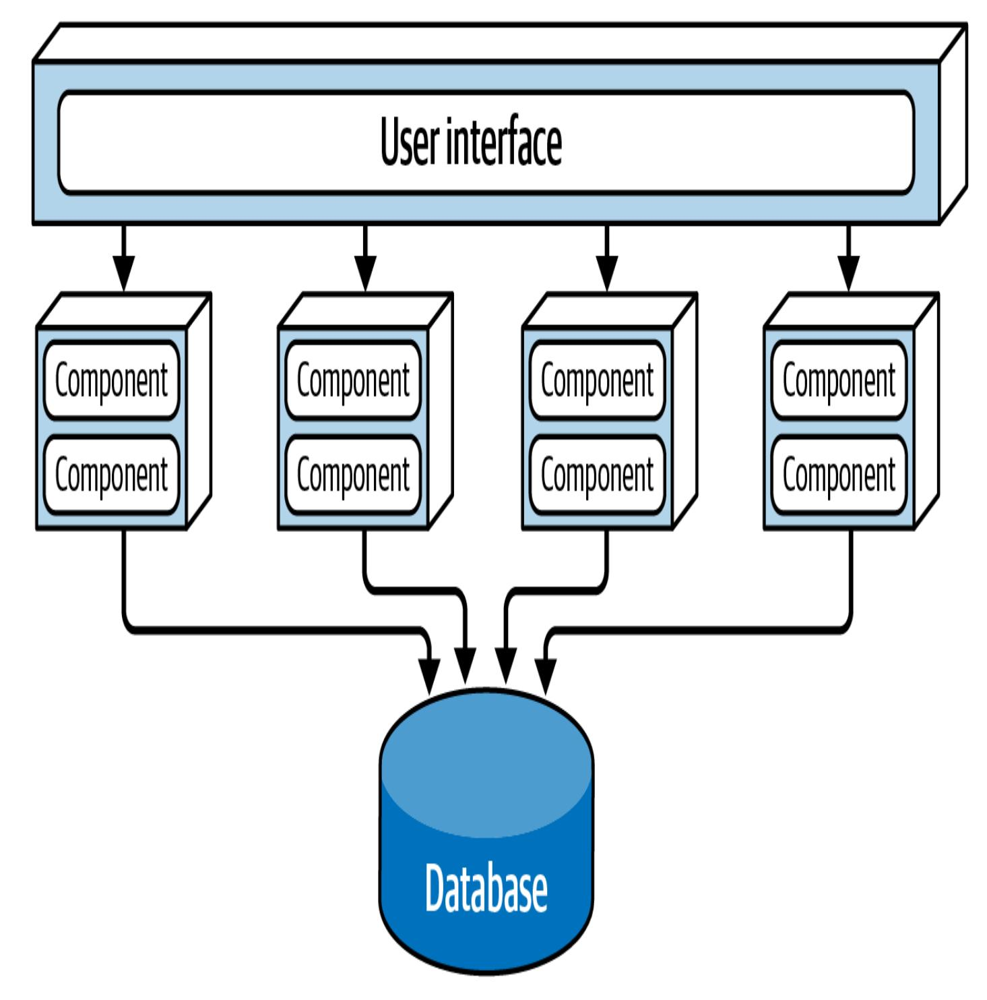

Abbildung 14-1. Grundtopologie des servicebasierten Architekturstils

Normalerweise wird jeder Domänenservice als eine einzige Instanz bereitgestellt. Je nach Anforderungen an die Skalierbarkeit, Fehlertoleranz und den Durchsatz des Systems erstellen Architekten jedoch manchmal mehrere Instanzen eines Domänendienstes. Dies

erfordert in der Regel eine Art Lastausgleich zwischen der Benutzeroberfläche und dem Domänenservice, damit die Benutzeroberfläche zu einer intakten und verfügbaren Serviceinstanz geleitet werden kann.

Der Fernzugriff auf Dienste erfolgt von einer Benutzeroberfläche aus über ein Fernzugriffsprotokoll, in der Regel REST. Andere Möglichkeiten sind Messaging, Remote Procedure Call (RPC), eine API-Schicht mit einem Proxy oder Gateway oder sogar SOAP. In den meisten Fällen verfügt die [Benutzeroberfläche](https://oreil.ly/UAA5I) jedoch über ein eingebettetes Service-Locator-Muster, so dass sie direkt auf die Dienste zugreifen kann; das Service-Locator-Muster kann auch in ein API-Gateway oder einen Proxy eingebettet sein.

Die servicebasierte Architektur verwendet in der Regel eine zentral gemeinsam genutzte monolithische Datenbank. Dadurch können die Dienste SQL-Abfragen und Joins genauso nutzen wie in einer traditionellen monolithischen Schichtenarchitektur. Aufgrund der geringen Anzahl von Diensten, die in dieser Architektur typischerweise vorkommen, ist die Erschöpfung der verfügbaren Datenbankverbindungen selten ein Problem. Die Verwaltung von [Datenbankänderungen](#page-13-0) kann jedoch eine Herausforderung darstellen. In "Datentopologien" werden Techniken beschrieben, mit denen Datenbankänderungen in einer servicebasierten Architektur berücksichtigt und verwaltet werden können.

### Stil Besonderheiten

Da die Domänendienste in einer servicebasierten Architektur in der Regel grobkörnig sind, wird jeder Domänendienst in der Regel in einem mehrschichtigen Architekturstil entworfen, der aus einer API-Fassadenschicht, einer Geschäftsschicht und einer Persistenzschicht besteht. Ein anderer beliebter Entwurfsansatz besteht darin, jeden Domänenservice in Subdomänen zu unterteilen, ähnlich dem modularen monolithischen Architekturstil (siehe [Kapitel](#page--1-0) 11). Beide Ansätze sind in [Abbildung](#page-5-0) 14-2 dargestellt.

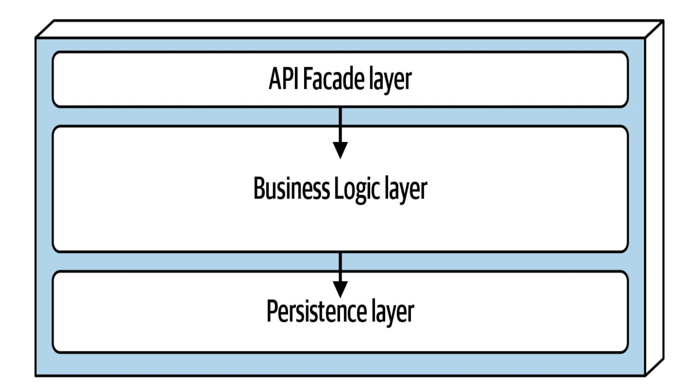

Layered design (technical partitioning)

Domain design (domain partitioning)

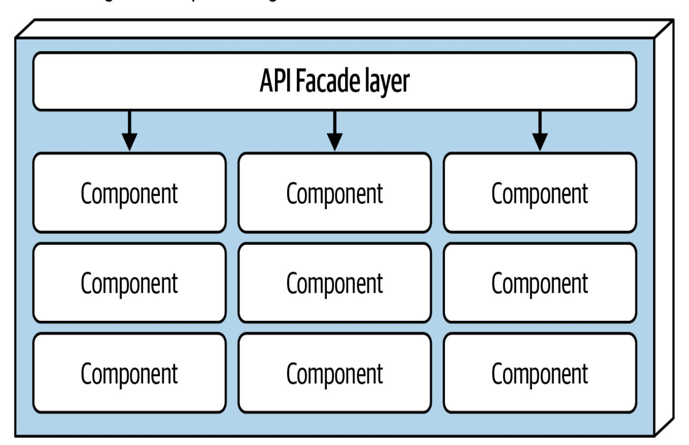

Unabhängig von seinem Design muss ein Domänenservice eine Art API-Zugangsfassade enthalten, mit der die Benutzeroberfläche interagiert, um eine Art von Geschäftsfunktionalität auszuführen. Die API-Zugangsfassade übernimmt in der Regel die Verantwortung für die Orchestrierung der Geschäftsanforderung von der Benutzeroberfläche.

Betrachten wir ein Beispiel von einer E-Commerce-Website mit einer servicebasierten Architektur. Eine Geschäftsanfrage kommt von der Benutzeroberfläche: Ein Kunde bestellt einige Artikel. Diese einzelne Anfrage wird von der API-Zugangsfassade innerhalb des OrderService Domänenservice empfangen. Die API-Zugangsfassade steuert intern alles, was zur Erfüllung dieser Anfrage notwendig ist: die Bestellung, die Erstellung einer Bestell-ID, die Zahlung und die Aktualisierung des Bestands für jedes bestellte Produkt. In einer Microservices-Architektur würde die Ausführung dieser Anfrage wahrscheinlich die Orchestrierung vieler separat bereitgestellter, dezentraler Einzweckdienste erfordern. Dieser Unterschied in der Granularität zwischen der internen Orchestrierung auf Klassenebene in einer servicebasierten Architektur und der externen Service-Orchestrierung in einer Microservices-Architektur - weist auf einen der vielen bedeutenden Unterschiede zwischen den beiden Stilen hin.

Da Domänendienste grobkörnig sind, können reguläre ACID-Datenbanktransaktionen (Atomarität, Konsistenz, Isolation, Dauerhaftigkeit) mit Standard-Datenbank-Commits und Rollbacks die Datenbankintegrität innerhalb eines einzelnen Domänendienstes sicherstellen. Im Vergleich dazu verwenden die feinkörnigen Einzweckdienste von hochgradig verteilten Architekturen wie Microservices eine verteilte Transaktionstechnik, die als BASE-Transaktionen (Basic Availability, Soft State, Eventual Consistency) bekannt ist. Solche feinkörnigen Dienste unterstützen nicht dasselbe Maß an Datenbankintegrität, das ACID-Transaktionen in einer servicebasierten Architektur unterstützen können.

Um diesen Punkt zu verdeutlichen, betrachte den Bestellvorgang auf unserer dienstleistungsbasierten E-Commerce-Website. Angenommen, der Kunde gibt eine Bestellung auf, aber die Kreditkarte, mit der er bezahlt hat, ist abgelaufen. Da es sich bei dieser Zahlung um eine atomare Transaktion innerhalb desselben Dienstes handelt, kann der Dienst alles, was der Datenbank bisher hinzugefügt wurde, mit einem Standard-Rollback der Transaktion löschen. Der Dienst benachrichtigt den Kunden, dass die Zahlung nicht durchgeführt werden kann.

Betrachte nun den gleichen Prozess in einer Microservices-Architektur mit kleineren, feinkörnigen Diensten. Zunächst nimmt der Dienst OrderPlacement die Anfrage an, erstellt die Bestellung, generiert eine Bestell-ID und fügt die Bestellung in die Bestelltabellen ein. Danach ruft der Dienst OrderPlacement den Dienst PaymentService auf, der versucht, die Zahlung vorzunehmen. Wenn die Zahlung nicht durchgeführt werden kann, weil die Kreditkarte abgelaufen ist, kann die Bestellung nicht aufgegeben werden. Jetzt befinden sich die Daten in einem inkonsistenten Zustand: Die Bestellinformationen wurden bereits

eingegeben, aber noch nicht genehmigt. Um die Daten in einen konsistenten Zustand zu bringen, muss eine separate Aktion, die so genannte *ausgleichende Aktualisierung* (siehe [Kapitel](#page--1-0) 9), auf den Dienst OrderPlacement angewendet werden.

### **Dienstgestaltung und Granularität**

Da Domain-Services grobkörnig sind, ermöglichen sie eine bessere Datenintegrität und -konsistenz, aber es gibt einen großen Kompromiss. In einer servicebasierten Architektur müsste das Team bei einer Änderung der Bestellfunktion auf OrderService die gesamte Funktionalität des Dienstes, einschließlich der Zahlungsabwicklung, testen und neu bereitstellen. In einer Microservices-Architektur hingegen würde sich dieselbe Änderung nur auf einen kleineren, feingranularen OrderPlacement Dienst auswirken, so dass keine Tests und kein Deployment für PaymentService erforderlich wären. Da ein Domänen-Dienst mehr Funktionen bereitstellt, besteht außerdem ein größeres Risiko, dass etwas anderes kaputt geht (einschließlich der Zahlungsabwicklung). Bei Microservices ist jeder Dienst nur für eine einzige Funktion verantwortlich, so dass die Gefahr geringer ist, dass bei Änderungen andere Funktionen beschädigt werden.

### **Optionen der Benutzeroberfläche**

Der Stil der servicebasierten Architektur umfasst viele UI-Varianten, was ihn sehr flexibel macht. Ein Architekt könnte zum Beispiel die in [Abbildung](#page-2-0) 14-1 gezeigte monolithische Benutzeroberfläche in einzelne

Benutzeroberflächen aufteilen, bis hin zur Anpassung an jeden Domänen-Dienst. Das würde die Skalierbarkeit, Fehlertoleranz und Agilität des Systems insgesamt erhöhen. Diese UI-Varianten sind in [Abbildung](#page-10-0) 14-3 dargestellt.

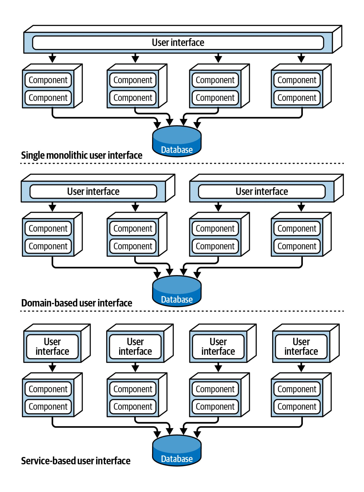

Ein typisches Bestellsystem könnte zum Beispiel eine Benutzeroberfläche für die Kunden haben, um Bestellungen aufzugeben, und separate, interne Benutzeroberflächen für die Auftragspacker, um die zu verpackenden Artikel anzuzeigen, und für den Kundensupport.

### **API Gateway Optionen**

Dank der Flexibilität dieses Architekturstils ist es möglich, zwischen der Benutzeroberfläche und den Diensten eine API-Schicht einzufügen, die aus einem Reverse Proxy oder einem API Gateway besteht, wie in [Abbildung](#page-12-0) 14-4 dargestellt. Dies ist nützlich, um die Funktionalität von Domänendiensten für externe Systeme zugänglich zu machen, um gemeinsame übergreifende Belange (wie Metriken, Sicherheit, Audit-Anforderungen und Service Discovery) zu konsolidieren und in das API Gateway zu verlagern und um Domänendienste, die mehrere Instanzen haben, auszugleichen.

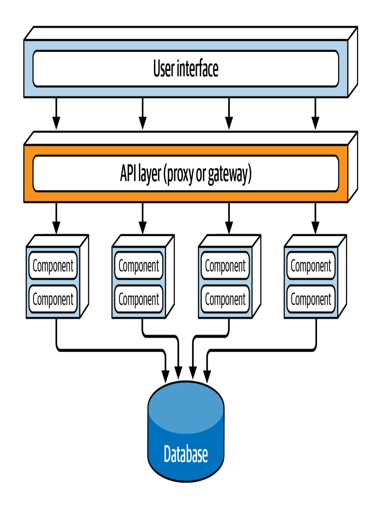

## Daten-Topologien

Servicebasierte Architekturen bieten Architekten viele Möglichkeiten der Datenbanktopologie, was ihre Flexibilität unterstreicht. Diese Art von Architektur ist einzigartig, weil sie eine verteilte Architektur ist, die eine monolithische Datenbank effektiv unterstützen kann. Diese monolithische Datenbank kann aber auch in mehrere Datenbanken aufgeteilt werden, bis hin zur Erstellung einer domänenspezifischen Datenbank für jeden Dienst (ähnlich wie bei Microservices). Bei der Verwendung mehrerer separater Datenbanken muss der Architekt sicherstellen, dass kein anderer Domänenservice die Daten in jeder Datenbank benötigt, was zu einer Kommunikation zwischen den Domänenservices führen könnte. In der Regel ist es bei diesem Architekturstil besser, Daten gemeinsam zu nutzen, als einen anderen Domänenservice aufzurufen. Diese Datenbankvarianten sind in [Abbildung](#page-14-0) 14-5 dargestellt.

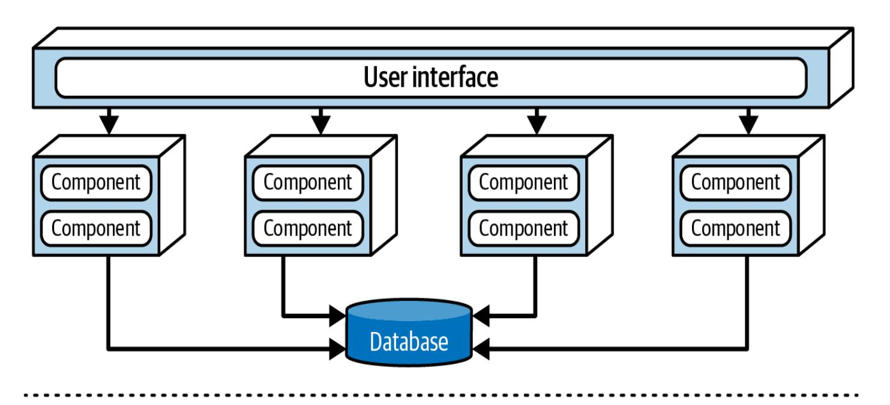

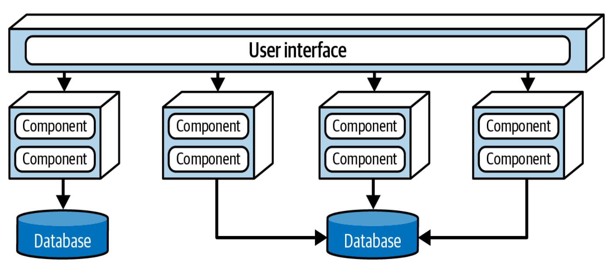

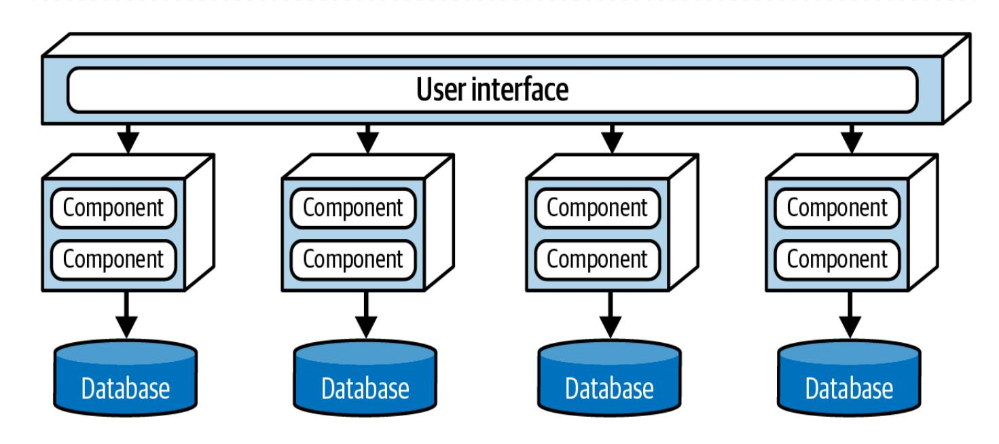

Obwohl dieser Architekturstil eine monolithische Datenbank unterstützt, können sich Schemaänderungen an der Datenbanktabelle, wenn sie nicht ordnungsgemäß durchgeführt werden, auf jeden Domänendienst auswirken. Das macht die Änderung der Datenbank zu einer sehr kostspieligen und risikoreichen Aufgabe, die einen hohen Aufwand, Koordination und allgemeine Zuverlässigkeit erfordert.

In einer servicebasierten Architektur befinden sich die gemeinsam genutzten Klassendateien, die die Schemata der Datenbanktabellen darstellen (sogenannte *Entity-Objekte*), normalerweise in einer benutzerdefinierten gemeinsam genutzten Bibliothek, die von allen Domänendiensten verwendet wird, z. B. in einer JAR- oder DLL-Datei. Diese Shared Librarys können auch SQL-Code enthalten. Die Erstellung einer einzigen Shared Library für alle Entity-Objekte ist die *am wenigsten* effektive Art, eine servicebasierte Architektur zu implementieren. Bei jeder Änderung der Datenbanktabellenstrukturen muss auch die Bibliothek der entsprechenden Entitätsobjekte geändert werden, was bedeutet, dass *jeder* Dienst geändert und neu bereitgestellt werden muss, unabhängig davon, ob er tatsächlich auf die geänderte Tabelle zugreift. Eine gemeinsame Bibliotheksversionierung kann dieses Problem lösen, aber es ist immer noch schwierig zu wissen, welche Dienste von der Tabellenänderung betroffen sind, ohne eine detaillierte manuelle Analyse durchzuführen. Dieses Szenario, das in der servicebasierten Architektur als Antipattern gilt, ist in [Abbildung](#page-16-0) 14-6 dargestellt.

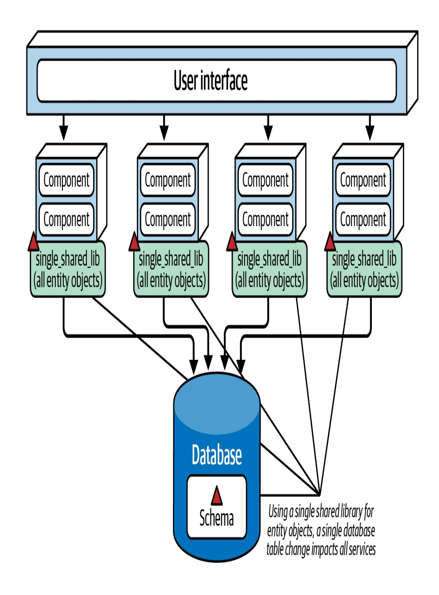

Abbildung 14-6. Die Verwendung einer einzigen gemeinsam genutzten Bibliothek für Datenbankentitätsobjekte wirkt sich bei einer Änderung auf alle Dienste aus und wird in der servicebasierten Architektur als Anti-Pattern betrachtet

Eine Möglichkeit, die Auswirkungen und Risiken von Datenbankänderungen zu verringern, besteht darin, die Datenbank logisch zu partitionieren und diese logische Partitionierung durch separate gemeinsame Bibliotheken darzustellen. In [Abbildung](#page-18-0) 14-7 ist die Datenbank logisch in fünf separate Domänen unterteilt: Allgemein, Kunde, Rechnungsstellung, Bestellung und Nachverfolgung. Die Domänen-Services verwenden fünf entsprechende Shared Libraries, die den logischen Partitionen in der Datenbank entsprechen. Mit dieser Technik würden alle Änderungen, die der Architekt an einer Tabelle innerhalb einer bestimmten logischen Domäne (in diesem Fall Invoicing ) vornimmt, mit der entsprechenden gemeinsamen Bibliothek übereinstimmen, die die Entitätsobjekte (und möglicherweise auch SQL) enthält. Die einzigen Dienste, die davon betroffen wären, wären diejenigen, die diese Shared Library nutzen. Andere Dienste wären von dieser Änderung nicht betroffen, sodass sie nicht erneut getestet und bereitgestellt werden müssten.

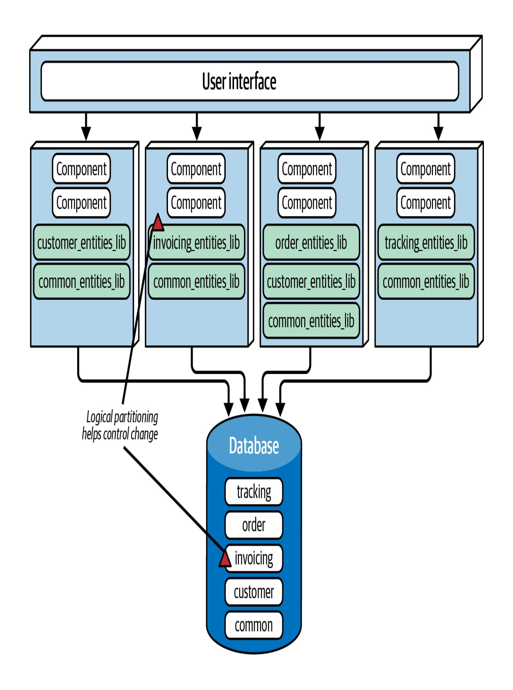

In [Abbildung](#page-18-0) 14-7 enthält die Datenbank eine Common Domain und eine entsprechende common\_entities\_lib gemeinsame Bibliothek, die von allen Diensten genutzt wird. Das ist relativ häufig der Fall. Da diese Tabellen von allen Diensten gemeinsam genutzt werden, müssen Änderungen an ihnen von allen Diensten, die auf die gemeinsame Datenbank zugreifen, koordiniert werden. Eine Möglichkeit, die potenziellen Nebenwirkungen von Änderungen an diesen Tabellen (und an den entsprechenden Entitätsobjekten und Domänendiensten) abzumildern, besteht darin, die gemeinsamen Entitätsobjekte in der Versionskontrolle zu sperren (falls vorhanden) und nur dem Datenbankteam zu erlauben, Änderungen vorzunehmen. So lassen sich Änderungen besser kontrollieren und es wird deutlich, wie wichtig es ist, Änderungen an den gemeinsamen Tabellen vorzunehmen, die von allen Diensten genutzt werden.

#### **TIPP**

Um Datenbankänderungen in einer servicebasierten Architektur besser kontrollieren zu können, solltest du die logische Partitionierung der Datenbank so feinkörnig wie möglich gestalten, ohne auf klar definierte Datendomänen zu verzichten.

# Überlegungen zur Cloud

Da es sich um eine verteilte Architektur handelt, funktioniert der servicebasierte Stil gut in Cloud-Umgebungen, auch wenn die DomänenDienste in der Regel grobkörnig sind. Aufgrund ihres großen Umfangs werden Domänen-Dienste in der Regel als containerisierte Dienste und nicht als serverlose Funktionen implementiert, und sie können problemlos Cloud-Datenspeicher-, Datenbank- und Messaging-Dienste nutzen.

### Gemeinsame Risiken

Während die Kommunikation zwischen den Diensten für Microservices typisch ist, versuchen Architekten, sie im servicebasierten Architekturstil zu vermeiden. Idealerweise sollten die Domänen so unabhängig wie möglich sein und die Kopplung nur auf der Datenbankebene stattfinden. Zu viel Kommunikation zwischen Domänen-Services ist ein guter Hinweis darauf, dass entweder der Architekt die Domänen nicht richtig partitioniert hat oder dass dies nicht der richtige Architekturstil für das zu lösende Problem ist.

Ein weiteres häufiges Risiko ist die Einrichtung *zu vieler* Domänendienste. Die praktische Obergrenze liegt bei etwa 12. Wenn es mehr sind, kann es zu Problemen beim Testen, Verteilen, Überwachen und bei Datenbankverbindungen und -änderungen kommen.

### Governance

Zusätzlich zu den allgemeinen strukturellen und operativen Architektur-Governance-Techniken, die in diesem Buch besprochen werden, wie z.B.

zyklomatische Komplexität, Skalierbarkeit, Reaktionsfähigkeit usw., können Architekten spezielle Governance-Tests anwenden, um die strukturelle Integrität einer servicebasierten Architektur sicherzustellen.

Da die Domänendienste so unabhängig wie möglich sein sollten, muss zunächst sichergestellt werden, dass sich Änderungen nicht über mehrere Domänendienste erstrecken. Wenn dies der Fall ist, ist das ein guter Hinweis darauf, dass die Domänengrenzen nicht angemessen definiert sind oder dass die servicebasierte Architektur nicht der am besten geeignete Stil für das Problem ist.

Wenn die Interservice-Kommunikation nicht verfügbar ist, können Architekten auch den Umfang der Kommunikation zwischen den Domänendiensten festlegen. Es gibt sicherlich Situationen und Arbeitsabläufe, in denen ein Domänendienst mit einem anderen kommunizieren muss: So muss z. B. eine OrderProcessing Domäne mit einer CustomerNotification Domäne kommunizieren, um dem Kunden Informationen zum Bestellstatus per E-Mail zukommen zu lassen. In den meisten Fällen sollten die Domänendienste jedoch weitgehend unabhängig voneinander sein und die Orchestrierung sollte auf der Ebene der Benutzeroberfläche oder des API-Gateways stattfinden.

# Überlegungen zur Team-Topologie

Da servicebasierte Architekturen nach Domänen aufgeteilt sind, funktionieren sie am besten, wenn die Teams auch nach

Domänenbereichen ausgerichtet sind (z. B. funktionsübergreifende Teams mit Spezialisierung). Wenn eine bereichsbezogene Anforderung auftaucht, kann ein bereichsbezogenes funktionsübergreifendes Team gemeinsam an dieser Funktion innerhalb eines bestimmten Bereichsdienstes arbeiten, ohne andere Teams oder Dienste zu beeinträchtigen. Umgekehrt funktionieren technisch partitionierte Teams (wie UI-Teams, Backend-Teams, Datenbank-Teams usw.) aufgrund der Domänenpartitionierung nicht gut mit diesem Architekturstil. Die Zuweisung von fachlichen Anforderungen an ein technisch organisiertes Team erfordert ein Maß an teamübergreifender Kommunikation und Zusammenarbeit, das sich in den meisten Unternehmen als schwierig erweist.

Hier sind einige Überlegungen für Architekten, um eine servicebasierte Architektur mit den spezifischen Teamtopologien, die in ["Teamtopologien](#page--1-1) und Architektur" beschrieben sind, in Einklang zu bringen [:](#page--1-1)

#### *Auf den Strom ausgerichtete Teams*

Wenn die Domänengrenzen richtig ausgerichtet sind, arbeiten Teams, die sich an Streams orientieren, gut mit diesem Architekturstil, vor allem wenn ihre Streams auf eine bestimmte Domäne ausgerichtet sind. Die servicebasierte Architektur wird jedoch schwieriger, wenn die Streams die von den Domänenservices definierten Grenzen überschreiten. In diesem Fall sollte der Architekt die Grenzen und die Granularität der Domänenservices analysieren und sie entweder neu

auf die Streams abstimmen oder einen anderen Architekturstil wählen.

#### *Teams befähigen*

Die servicebasierte Architektur ist in Verbindung mit der Team-Topologie nicht so effektiv wie andere verteilte Architekturen, da die Domänen-Dienste sehr grobkörnig sind. Ein Architekt kann jedoch die Modularität dieses Stils erhöhen, indem er sorgfältig geeignete Komponenten für jeden Domänenservice identifiziert und erstellt. Spezialisten und übergreifende Teammitglieder können dann auf der Grundlage dieser Komponenten Vorschläge machen und Experimente durchführen.

#### *Teams mit komplizierten Subsystemen*

Teams für komplizierte Subsysteme können die Modularität dieses Architekturstils auf Domänen- und Subdomänenebene nutzen, um sich unabhängig von anderen Teammitgliedern (und Diensten) auf die Bearbeitung komplizierter Domänen oder Subdomänen zu konzentrieren.

#### *Plattform-Teams*

Der hohe Grad an Modularität der servicebasierten Architektur hilft Teams, die Vorteile der Plattformteam-Topologie zu nutzen, indem sie gemeinsame Tools, Dienste, APIs und Aufgaben verwenden.

# Stilmerkmale

Eine Ein-Stern-Bewertung in der Tabelle in [Abbildung](#page-25-0) 14-8 bedeutet, dass ein bestimmtes Architekturmerkmal in der Architektur nicht gut unterstützt wird, während eine Fünf-Stern-Bewertung bedeutet, dass das Architekturmerkmal eines der stärksten Merkmale des Architekturstils ist. Die Definition für jedes Merkmal in der Scorecard findest du in [Kapitel](#page--1-0) 4.

|             | Architectural characteristic | Star rating               |
|-------------|------------------------------|---------------------------|
|             | Overall cost                 | \$\$                      |
| Structural  | Partitioning type            | Domain                    |
|             | Number of quanta             | 1 to many                 |
|             | Simplicity                   | ***                       |
|             | Modularity                   | ***                       |
| Engineering | Maintainability              | ***                       |
|             | Testability                  | ***                       |
|             | Deployability                | ***                       |
|             | Evolvability                 | ***                       |
| Operational | Responsiveness               | ***                       |
|             | Scalability                  | ***                       |
|             | Elasticity                   | $\Rightarrow \Rightarrow$ |
|             | Fault tolerance              | ***                       |

Die servicebasierte Architektur ist eine *domänengegliederte* Architektur, d.h. ihre Struktur wird durch Domänen und nicht durch technische Überlegungen (wie Präsentationslogik oder Persistenzlogik) bestimmt.

Nehmen wir das Beispiel der Elektronik-Recycling-Anwendung Going Green, die wir in [Kapitel](#page--1-0) 7 vorgestellt und in [Kapitel](#page--1-0) 13 wieder aufgegriffen haben. Für die Zwecke dieses Kapitels stellen wir uns vor, dass Going Green eine servicebasierte Architektur verwendet. Jeder Dienst ist eine separat bereitgestellte Softwareeinheit, die auf eine bestimmte Domäne (z. B. die Bewertung von Gegenständen) beschränkt ist. Änderungen, die innerhalb dieses Bereichs vorgenommen werden, wirken sich nur auf diesen speziellen Dienst und die dazugehörige Benutzeroberfläche und Datenbank aus. Nichts anderes muss geändert werden, um eine bestimmte Bewertungsänderung zu unterstützen.

In einer verteilten Architektur kann die Anzahl der Quanten größer oder gleich eins sein. Wenn zum Beispiel alle Dienste von Going Green dieselbe Datenbank oder Benutzeroberfläche nutzen, wäre das gesamte System nur ein einziges Quantum. Wie im Abschnitt ["Stilspezifika"](#page-3-0) erläutert, können jedoch sowohl die Benutzeroberfläche als auch die Datenbank föderiert (aufgeteilt) werden, was zu mehreren Quanten innerhalb des Gesamtsystems führt. In [Abbildung](#page-28-0) 14-9 enthält das System von Going Green zwei Quanten. Das eine ist für den kundenorientierten Teil der Anwendung und enthält eine eigene Benutzeroberfläche, eine Datenbank und eine Reihe von Diensten

( Quoting und Item Status ). Der andere Teil befasst sich mit den internen Abläufen der Annahme, Bewertung und des Recyclings von elektronischen Geräten. Obwohl das Quantum für die internen Vorgänge separat bereitgestellte Dienste und zwei separate Benutzeroberflächen enthält, nutzen sie alle dieselbe Datenbank, was den internen Teil der Anwendung zu einem einzigen Quantum macht.

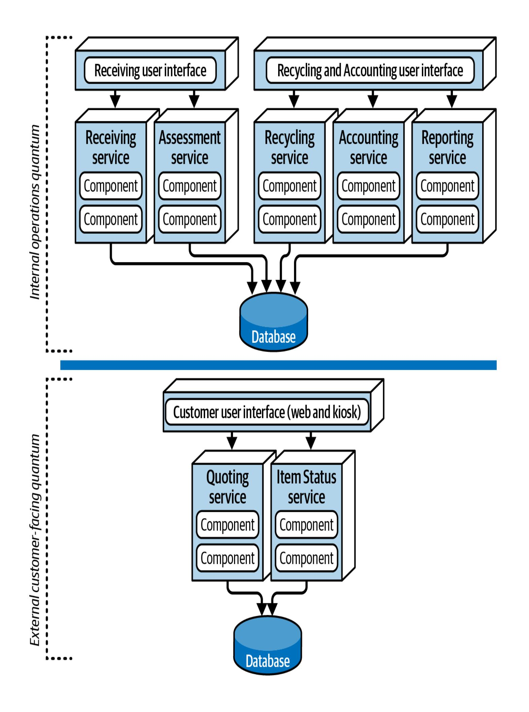

Obwohl wir der servicebasierten Architektur keine Fünf-Sterne-Bewertung gegeben haben, erhält sie dennoch in vielen wichtigen Bereichen eine hohe Bewertung (vier Sterne). Die Aufteilung einer Anwendung in separate Domänen-Services ermöglicht schnellere Änderungen (Agilität), eine bessere Testabdeckung aufgrund der Modularität auf der Grundlage des Domänen-Scopings (Testbarkeit) und die Möglichkeit, die Anwendung häufiger und mit geringerem Risiko einzusetzen als bei einer monolithischen Architektur (Implementierbarkeit). Diese drei Eigenschaften führen zu einer kürzeren Markteinführungszeit und ermöglichen es Unternehmen, neue Funktionen zu liefern und Fehler relativ schnell zu beheben.

Auch die Fehlertoleranz und die Gesamtverfügbarkeit der Anwendung werden bei der servicebasierten Architektur hoch bewertet. Obwohl die Domänen-Dienste eher grobkörnig sind, kommt die Vier-Sterne-Bewertung daher, dass die Dienste in diesem Architekturstil in der Regel in sich geschlossen sind und dank der gemeinsamen Nutzung von Code und Datenbanken in der Regel keine Kommunikation zwischen den Diensten stattfindet. Wenn also ein Domain-Dienst ausfällt (z. B. der Dienst Receiving von Going Green), hat das keine Auswirkungen auf die anderen sechs Dienste.

Die Skalierbarkeit wird aufgrund der grobkörnigen Natur der Dienste nur mit drei Sternen bewertet, die Elastizität dementsprechend nur mit zwei Sternen. Obwohl programmatische Skalierbarkeit und Elastizität

mit diesem Architekturstil durchaus möglich sind, werden mehr Funktionen repliziert als bei Architekturen mit feinkörnigeren Diensten (z. B. Microservices), was sie weniger kosteneffektiv und in Bezug auf die Maschinenressourcen weniger effizient macht. Bei servicebasierten Architekturen wird in der Regel nur eine einzige Instanz jedes Dienstes verwendet, es sei denn, es besteht ein Bedarf an besserem Durchsatz oder [Failover. Ein](#page-28-0) gutes Beispiel dafür ist Going Green (siehe Abbildung 14-9) - nur die Dienste Quoting und Item Status müssen skaliert werden, um ein hohes Kundenaufkommen zu unterstützen. Die anderen operativen Dienste benötigen nur einzelne Instanzen, was es einfacher macht, Dinge wie In-Memory-Caching und Pooling von Datenbankverbindungen zu unterstützen.

Einfachheit und Gesamtkosten sind zwei weitere Faktoren, die diesen Architekturstil von anderen, teureren und komplexeren verteilten Architekturen wie Microservices, ereignisgesteuerten Architekturen oder sogar raumbezogenen Architekturen unterscheiden. Das macht die servicebasierte Architektur zu einer der einfachsten und kostengünstigsten verteilten Architekturen, die umgesetzt werden können. Das ist zwar ein attraktives Angebot, aber wie immer gibt es auch einen Kompromiss. Je höher die Kosten und die Komplexität sind, desto besser werden die Vier-Sterne-Eigenschaften (wie Skalierbarkeit, Elastizität und Fehlertoleranz).

Ihre Flexibilität in Verbindung mit den vielen Drei- und Vier-Sterne-Architekturmerkmalen machen die servicebasierte Architektur zu einem der pragmatischsten Stile, die es gibt. Es gibt zwar viel

leistungsfähigere verteilte Architekturen, aber viele Unternehmen finden, dass diese Leistung einen zu hohen Preis hat. Andere finden, dass sie einfach nicht so viel Leistung *brauchen*. Das ist so, als ob man einen Ferrari kauft, ihn aber nur benutzt, um im Berufsverkehr zur Arbeit zu fahren - sicher, er sieht cool aus, aber was für eine Verschwendung von Leistung, Geschwindigkeit und Agilität!

Eine servicebasierte Architektur eignet sich auch hervorragend für ein domänenorientiertes Design. Da Dienste grobkörnig und domänenspezifisch sind, passt jede Domäne gut in einen separat bereitgestellten Dienst, der diese spezielle Domäne umfasst. Die Aufteilung der Funktionalität in eine einzige Softwareeinheit macht es einfacher, Änderungen an dieser Domäne vorzunehmen.

Die Aufrechterhaltung und Koordinierung von Datenbanktransaktionen ist immer ein Problem bei verteilten Architekturen, die sich in der Regel auf *eventuelle Konsistenz* (d.h., dass unabhängige Datenbankaktualisierungen schließlich miteinander synchronisiert werden) und nicht auf traditionelle *ACID-Transaktionen* (d.h., dass Datenbankaktualisierungen koordiniert und gemeinsam in einer einzigen Arbeitseinheit durchgeführt werden) verlassen. Eine dienstbasierte Architektur nutzt ACID-Transaktionen besser als jede andere verteilte Architektur, weil die Dienste der Domäne grobkörnig sind. Das bedeutet, dass der Transaktionsbereich auf einen bestimmten Domänenservice festgelegt ist, was die traditionelle Commit-and-Rollback-Transaktionsfunktionalität ermöglicht, die in den meisten monolithischen Anwendungen zu finden ist.

Schließlich ist die servicebasierte Architektur eine gute Wahl für Architekten, die ein hohes Maß an Modularität erreichen wollen, ohne sich in der Komplexität von Granularität und Servicekoordination zu verheddern (siehe "Choreografie und [Orchestrierung"](#page--1-2) in [Kapitel](#page--1-0) 18).

## Beispiele und Anwendungsfälle

Um die Flexibilität und Leistungsfähigkeit des servicebasierten Architekturstils zu veranschaulichen, greifen wir noch einmal unser Beispiel Going Green auf, ein System zum Recyceln alter elektronischer Geräte (z. B. ein iPhone oder ein Galaxy-Handy).

Der Verarbeitungsprozess von Going Green funktioniert folgendermaßen:

- 1. Der Kunde fragt Going Green (über eine Website oder einen Kiosk), wie viel Geld es für ein altes elektronisches Gerät zahlen würde*(Zitat*).
- 2. Wenn der Kunde mit dem Angebot zufrieden ist, schickt er das Gerät an das Recyclingunternehmen*(Annahme*).
- 3. Going Green bewertet den Zustand des Geräts*(Bewertung*).
- 4. Wenn das Gerät in gutem Zustand ist, bezahlt Going Green den Kunden für das Gerät*(Abrechnung*). Während dieses Vorgangs kann der Kunde jederzeit auf die Website gehen, um sich über den Status des Geräts zu informieren*(Artikelstatus*).
- 5. Auf der Grundlage der Bewertung zerstört Going Green das Gerät entweder sicher und recycelt seine Teile oder verkauft es auf einer

- Drittanbieter-Verkaufsplattform wie Facebook Marketplace oder eBay weiter*(Recycling)*.
- 6. Going Green erstellt regelmäßig Finanz- und Betriebsberichte über seine Recyclingaktivitäten*(Berichterstattung*).

[Abbildung](#page-34-0) 14-10 zeigt, wie dieses System mit einer servicebasierten Architektur umgesetzt wird. Jeder der soeben identifizierten Domänenbereiche wird als separater, unabhängiger Domänenservice implementiert. Die Dienste, die skaliert werden müssen (und daher mehrere Service-Instanzen benötigen), sind diejenigen, die einen höheren Durchsatz benötigen (in diesem Fall die kundenorientierten Dienste Quoting und ItemStatus ). Da die anderen Dienste nicht skaliert werden müssen, benötigen sie nur eine einzige Service-Instanz.

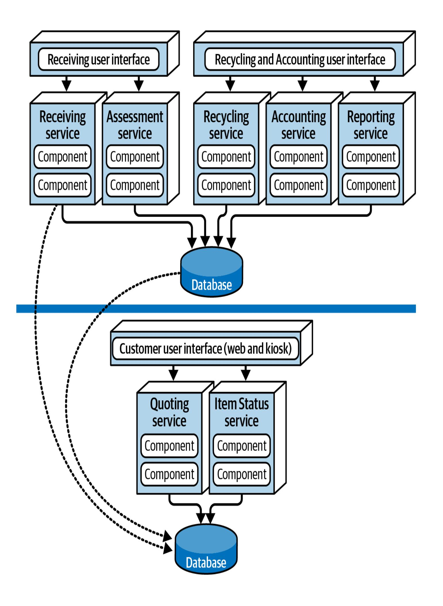

In diesem Beispiel sind die UI-Anwendungen in Bereiche unterteilt: *Customer Facing*, *Wareneingang* sowie *Recycling und Buchhaltung*. Diese Trennung sorgt für eine gute Fehlertoleranz auf der Benutzeroberflächenebene, eine gute Skalierbarkeit und eine angemessene Sicherheit (da externe Kunden keinen Netzwerkpfad für den Zugriff auf interne Funktionen haben). Beachte auch, dass es zwei getrennte physische Datenbanken gibt: eine für die externen, kundenorientierten Vorgänge und eine für die internen Vorgänge. Auf diese Weise können die internen Daten und Abläufe in einer von den externen Abläufen getrennten Netzwerkzone gespeichert werden (gekennzeichnet durch die horizontale Linie). Sie bietet auch eine viel bessere Sicherheit - Zugangsbeschränkungen und Datenschutz - und stellt ein separates architektonisches Quantum dar). Ein einseitiger Zugang durch die Firewall ermöglicht es internen Diensten, auf kundenorientierte Informationen zuzugreifen und diese zu aktualisieren, aber nicht umgekehrt. Je nach Datenbank können die Teams auch interne Tabellenspiegelung und externe Tabellensynchronisation verwenden, um die Daten zwischen den beiden Datenbanken zu synchronisieren.

Außerdem ändert sich der Dienst Assessment ständig, wenn neue Produkte eintreffen oder auf den Markt kommen. Mit einer servicebasierten Architektur werden diese häufigen Änderungen auf einen einzigen Domänenservice beschränkt, was Agilität, Testbarkeit und Einsatzfähigkeit gewährleistet.

Die servicebasierte Architektur ist ein sehr flexibler Architekturstil, der im Vergleich zu anderen verteilten Architekturen ein hohes Maß an Skalierbarkeit, Agilität, Fehlertoleranz, Verfügbarkeit und Reaktionsfähigkeit zu einem relativ niedrigen Preis bietet. Diese Faktoren machen sie zu einer beliebten Wahl.

Servicebasierte Architekturen eignen sich auch gut als Sprungbrett für andere verteilte Architekturen, unabhängig davon, ob das Unternehmen zu einem anderen verteilten Architekturstil migriert oder ein neues verteiltes System von Grund auf aufbaut. Das bringt uns zu unserem wichtigsten Punkt:

*Nicht jeder Teil einer Anwendung muss aus Microservices bestehen.*

#### —Mark Richards

Die Umstellung auf eine servicebasierte Architektur oder die Erstellung einer solchen als "Sprungbrett" *vor der* Umstellung auf den angestrebten Architekturstil ermöglicht es den Teams, die Domänen zu analysieren und zu entscheiden, welche Teile der Architektur Microservices sein *sollten*. Im Beispiel von Going Green müssen die Dienste Recycling und Accounting nicht weiter aufgeschlüsselt werden und sollten wahrscheinlich Domänendienste bleiben. Der Dienst Assessment ändert sich jedoch häufig und erfordert ein hohes Maß an Agilität, so dass *dieser* Dienst in separate Dienste unterteilt werden sollte, einen für jede Art von elektronischem Gerät. Wenn das Going Green Team diesen Schritt überspringen und *direkt* zu einer Microservice-Architektur übergehen

würde, würde wahrscheinlich *jede* Funktion als Microservice enden, auch wenn sie nicht unbedingt einer sein muss.

Dies sind nur einige der vielen Gründe, warum servicebasierte Architekturen bei Architekten so beliebt sind. Sie ist jedoch nur einer von vielen verteilten Architekturstilen, und alle zu verstehen ist hilfreich, um die richtige Lösung für ein bestimmtes Geschäftsproblem zu finden. Sehen wir uns deshalb einige andere verteilte Architekturen an.