# Kapitel 15. Ereignisgesteuerter Architekturstil

Diese Arbeit wurde mithilfe von KI übersetzt. Wir freuen uns über dein Feedback und deine Kommentare: [translation-feedback@oreilly.com](mailto:translation-feedback@oreilly.com)

Die *ereignisgesteuerte* Architektur (EDA) ist ein beliebter verteilter, asynchroner Architekturstil, mit dem sich hoch skalierbare und leistungsstarke Anwendungen erstellen lassen. Außerdem ist sie besonders anpassungsfähig und kann sowohl für kleine als auch für große, komplexe Anwendungen eingesetzt werden. Die ereignisgesteuerte Architektur besteht aus entkoppelten Komponenten zur Ereignisverarbeitung, die asynchron Ereignisse auslösen und darauf reagieren. Sie kann als eigenständiger Architekturstil verwendet oder in andere Architekturstile eingebettet werden (z. B. in eine ereignisgesteuerte Microservices-Architektur).

Viele Entwickler und Softwarearchitekten betrachten EDA eher als ein Architekturmuster denn als einen Architekturstil. Wir sind da anderer Meinung. Eure Autoren haben ganze Systeme entwickelt, die sich ausschließlich auf EDA stützen, weshalb wir behaupten, dass es sich in erster Linie um einen Architekturstil handelt. EDA kann zwar auch in anderen Architekturstilen - wie Microservices und raumbasierte Architekturen - verwendet werden, um hybride Architekturen zu bilden, aber im Kern bleibt es eine Methode, um komplexe Systeme zu entwerfen.

Die meisten Anwendungen folgen einem so genannten *anfragebasierten* Modell, wie in [Abbildung](#page-2-0) 15-1 dargestellt. Wenn ein Kunde z. B. seine Bestellhistorie der letzten sechs Monate abfragt, wird diese Anfrage zunächst von einem *Anfrage-Orchestrator* entgegengenommen. Der Anfrage-Orchestrator ist in der Regel eine Benutzeroberfläche, kann aber auch durch eine API-Schicht, Orchestrierungsdienste, Event Hubs, einen Event Bus oder einen Integration Hub implementiert werden. Seine Aufgabe ist es, die Anfrage deterministisch und synchron an verschiedene *Anfrageverarbeiter* weiterzuleiten. Diese bearbeiten die Anfrage, indem sie die Informationen des Kunden in einer Datenbank abrufen und aktualisieren. Das Abrufen von Informationen über die Bestellhistorie ist eine datengesteuerte, deterministische Anfrage an das System in einem bestimmten Kontext und kein Ereignis, auf das das System reagieren muss, weshalb es sich um ein anfragebasiertes Modell handelt.

Ein *ereignisbasiertes* Modell hingegen reagiert auf ein bestimmtes Ereignis, indem es eine Aktion ausführt. Nehmen wir zum Beispiel die Abgabe eines Gebots für einen bestimmten Artikel bei einer Online-Auktion. Der Bieter, der das Gebot abgibt, stellt keine Anfrage an das System, sondern löst ein Ereignis aus, das nach der Bekanntgabe des aktuellen Angebotspreises eintritt. Das System muss auf dieses Ereignis reagieren, indem es das Gebot mit anderen zur gleichen Zeit

eingegangenen Geboten vergleicht und den aktuellen Höchstbietenden ermittelt.

<span id="page-2-0"></span>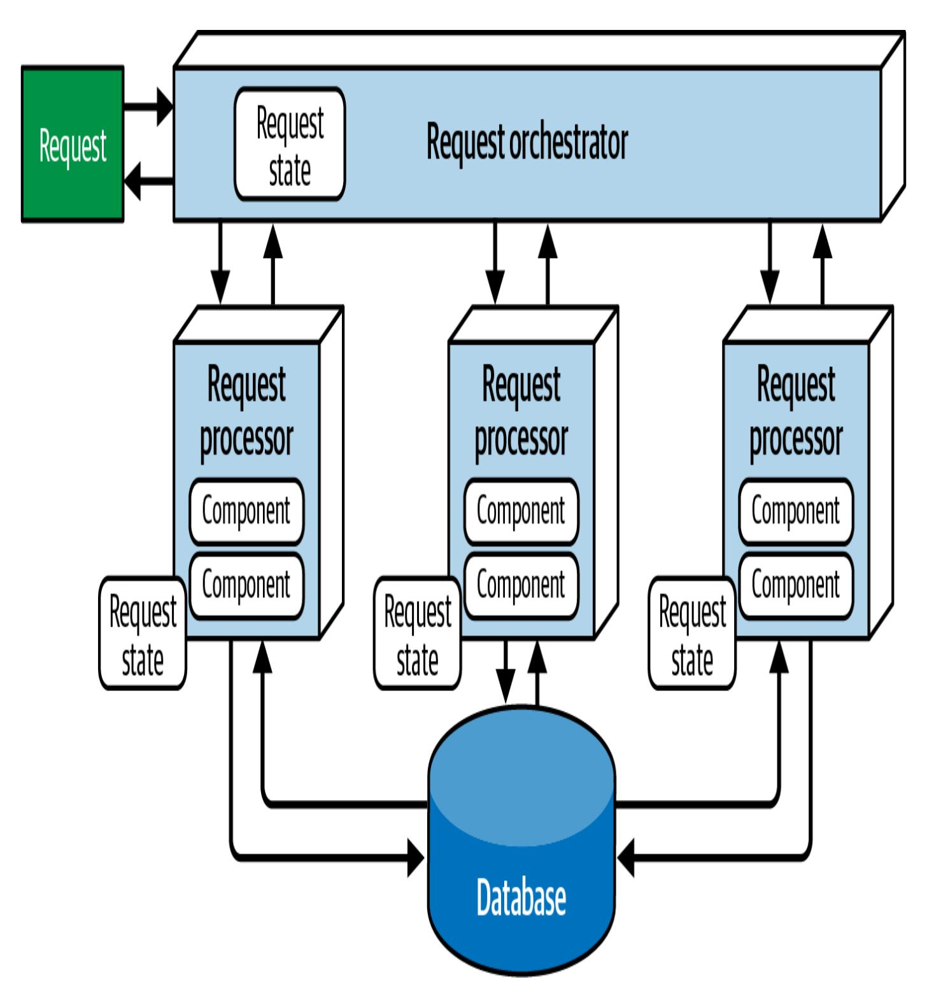

Abbildung 15-1. Anfrage-basiertes Modell

# Topologie

Die ereignisgesteuerte Architektur nutzt die asynchrone *Fire-and-Forget-Kommunikation*, bei der Dienste Ereignisse auslösen und andere Dienste auf diese Ereignisse reagieren. Die vier Hauptkomponenten der Architektur sind ein *auslösendes Ereignis*, ein *Ereignis-Broker*, ein *Ereignis-Prozessor* (normalerweise nur als *Dienst* bezeichnet) und ein *abgeleitetes Ereignis*.

Das *auslösende Ereignis* ist das Ereignis, das den gesamten Ereignisfluss in Gang setzt. Dabei kann es sich um ein einfaches Ereignis handeln, wie z. B. die Abgabe eines Gebots bei einer Online-Auktion, oder um ein komplexeres Ereignis, wie z. B. die Aktualisierung eines Krankenversicherungssystems, wenn ein Mitarbeiter heiratet. Das auslösende Ereignis wird zur Verarbeitung an einen Ereigniskanal im *Event Broker* gesendet. Ein einzelner *Ereignisprozessor* nimmt das auslösende Ereignis vom Ereignisbroker entgegen und beginnt mit der Verarbeitung des Ereignisses.

Der Ereignisverarbeiter, der das auslösende Ereignis angenommen hat, führt eine bestimmte Aufgabe aus, die mit der Verarbeitung dieses Ereignisses verbunden ist (z. B. die Abgabe eines Gebots für einen Auktionsartikel), und teilt dann dem Rest des Systems asynchron mit, was er getan hat, indem er ein so genanntes *abgeleitetes Ereignis* an einen *Ereignisbroker* auslöst. Andere Ereignisprozessoren reagieren auf das abgeleitete Ereignis, führen darauf basierend bestimmte Verarbeitungen durch und geben dann durch neue abgeleitete

Ereignisse bekannt, was sie getan haben. Dieser Prozess wird so lange fortgesetzt, bis alle Ereignisprozessoren im Leerlauf sind und alle abgeleiteten Ereignisse verarbeitet wurden. [Abbildung](#page-5-0) 15-2 veranschaulicht diesen Ablauf der Ereignisverarbeitung.

<span id="page-5-0"></span>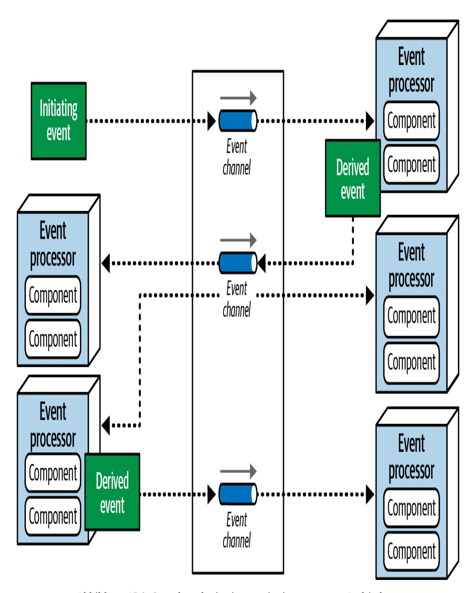

Abbildung 15-2. Grundtopologie einer ereignisgesteuerten Architektur

Die Event-Broker-Komponente ist in der Regel *föderiert* (d.h. sie verfügt über mehrere domänenbasierte geclusterte Instanzen). Jeder föderierte Broker enthält alle *Ereigniskanäle* (z. B. Warteschlangen und Themen), die innerhalb des *Ereignisflusses* (der gesamte Arbeitsablauf für die Verarbeitung des Ereignisses) für die jeweilige Domäne verwendet werden. Aufgrund der entkoppelten, asynchronen, "fire-and-forget"- Broadcasts dieses Architekturstils verwendet die Broker-Topologie [Topics, Topic-Exchanges](https://oreil.ly/TQDvA) (im Falle des Advanced Message Queuing Protocol (AMQP)) oder Streams mit einem Publish-and-Subscribe-Messaging-Modell.

Um zu veranschaulichen, wie die EDA-Verarbeitung insgesamt funktioniert, betrachte den Arbeitsablauf eines typischen Bestellsystems im Einzelhandel, wie in [Abbildung](#page-7-0) 15-3 dargestellt, bei dem Kunden Artikel bestellen können (z. B. ein Buch wie dieses). In diesem Beispiel empfängt der Ereignisprozessor Order Placement das auslösende Ereignis ( place order ), fügt die Bestellung in eine Datenbanktabelle ein und gibt eine Bestell-ID an den Kunden zurück. Dann teilt er dem Rest des Systems mit, dass er eine Bestellung über ein von order placed abgeleitetes Ereignis erstellt hat. Es gibt drei Ereignisprozessoren, die sich für dieses abgeleitete Ereignis interessieren: der Notification Ereignisprozessor, der Payment Ereignisprozessor und der Inventory Ereignisprozessor, die alle ihre Aufgaben parallel ausführen.

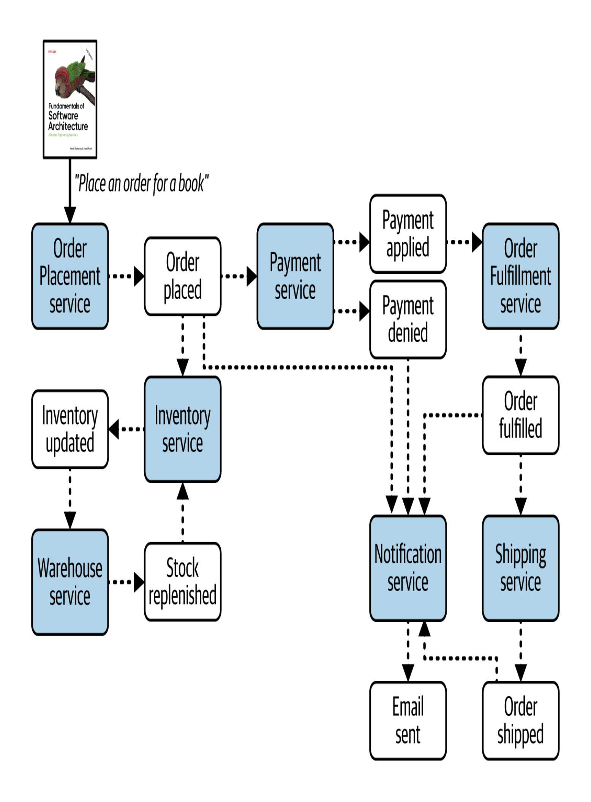

Der Notification Ereignisprozessor empfängt das abgeleitete Ereignis order placed und schickt dem Kunden eine E-Mail mit den Bestelldaten. Da der Ereignisprozessor Notification eine Aktion durchgeführt hat, erzeugt er ein abgeleitetes Ereignis email sent . In [Abbildung](#page-7-0) 15-3 siehst du jedoch, dass keine anderen Ereignisprozessoren auf dieses abgeleitete Ereignis hören. Das ist typisch für die EDA und verdeutlicht die *architektonische Erweiterbarkeit*dieses Stils *, d. h. die*Möglichkeit, dass zukünftige Ereignisprozessoren auf das abgeleitete Ereignis reagieren können, ohne das bestehende System zu verändern (siehe "Auslösen [erweiterbarer](#page-17-0) Ereignisse").

Der Inventory Ereignisprozessor lauscht auch auf das order placed abgeleitete Ereignis und passt den entsprechenden Bestand für dieses Buch an. Anschließend kündigt er diese Aktion an, indem er ein inventory updated abgeleitetes Ereignis auslöst, das wiederum eine Antwort des Warehouse Ereignisprozessors auslöst. Dieser Prozessor reagiert auf den entsprechenden Bestand und verwaltet ihn zwischen den Lagern, indem er Artikel nachbestellt, wenn der Vorrat zu gering wird. Wenn der Bestand wieder aufgefüllt wird, löst der Warehouse Ereignisprozessor ein abgeleitetes Ereignis stock replenished aus, auf das der Inventory Ereignisprozessor mit einer Anpassung des aktuellen Bestands reagiert.

In diesem Fall würde der Inventory Ereignisprozessor kein entsprechendes inventory adjusted Ereignis auslösen. Wenn doch, würde das zu einem so genannten *Gift-Ereignis*führen *- ein*Ereignis, das in einer Endlosschleife läuft.

#### **WARNUNG**

Ein *vergiftetes Ereignis* tritt auf, wenn ein abgeleitetes Ereignis in einer Endlosschleife zwischen den Diensten immer wieder ausgelöst wird und darauf reagiert wird. Das kann bei einer ereignisgesteuerten Architektur häufig vorkommen, also achte darauf, es zu vermeiden.

Der Payment Ereignisprozessor reagiert auch auf das von order placed abgeleitete Ereignis. Er reagiert, indem er die Kreditkarte des Kunden belastet. [Abbildung](#page-7-0) 15-3 zeigt, dass eines von zwei möglichen abgeleiteten Ereignissen als Ergebnis der Aktion des Payment Ereignisprozessors erzeugt wird: eines, um den Rest des Systems zu benachrichtigen, dass die Zahlung durchgeführt wurde ( payment applied ), und eines, um das System zu benachrichtigen, dass die Zahlung abgelehnt wurde ( payment denied ). Der Ereignisprozessor Notification ist an dem von payment denied abgeleiteten Ereignis interessiert, denn in diesem Fall muss er den Kunden per E-Mail darüber informieren, dass er seine Kreditkartendaten aktualisieren oder eine andere Zahlungsmethode wählen muss.

Der Ereignisprozessor Order Fulfillment hört auf das abgeleitete Ereignis payment applied und führt verschiedene automatisierte Funktionen im Rahmen der Kommissionierung und Verpackung aus, wie z. B. die Anweisung an den Arbeiter, wo er den Artikel finden kann und welche Kartongröße für die Bestellung benötigt wird. Sobald dies erledigt ist, wird ein order fulfilled abgeleitetes Ereignis ausgelöst,

das dem Rest des Systems mitteilt, dass der Auftrag erfüllt wurde. Sowohl der Notification als auch der Shipping Ereignisprozessor hören auf dieses abgeleitete Ereignis. Gleichzeitig benachrichtigt der Notification -Ereignisprozessor den Kunden, dass die Bestellung erfüllt wurde und versandbereit ist. Der Shipping -Ereignisprozessor wählt eine Versandmethode aus, versendet die Bestellung und sendet ein abgeleitetes Ereignis order shipped . Der Notification Ereignisprozessor wartet auch auf das abgeleitete Ereignis order shipped und benachrichtigt den Kunden, dass die Bestellung unterwegs ist.

Alle Ereignisprozessoren sind stark entkoppelt und unabhängig voneinander. Eine Möglichkeit, diesen asynchronen Verarbeitungsprozess zu verstehen, ist, ihn sich wie einen Staffellauf vorzustellen. Bei einem Staffellauf nehmen die Läuferinnen und Läufer einen Staffelstab (einen Holzstab) in die Hand und laufen eine bestimmte Strecke (z. B. 1,5 Kilometer), bevor sie den Staffelstab an die nächste Läuferin oder den nächsten Läufer weitergeben, die oder der dasselbe tut, bis die letzte Läuferin oder der letzte Läufer die Ziellinie überquert. Sobald ein Läufer den Staffelstab weitergibt, ist das Rennen für ihn beendet und er kann sich anderen Dingen zuwenden. Das gilt auch für Ereignisprozessoren: Sobald ein Ereignisprozessor ein Ereignis weitergibt, ist er nicht mehr mit der Verarbeitung dieses speziellen Ereignisses beschäftigt und kann auf andere auslösende oder abgeleitete Ereignisse reagieren. Darüber hinaus kann jeder Ereignisprozessor unabhängig skaliert werden, um mit unterschiedlichen Lastbedingungen oder Backups umzugehen.

# Stil Besonderheiten

In den folgenden Abschnitten wird EDA genauer beschrieben, einschließlich einiger Überlegungen, Muster und Mischformen dieses komplexen Architekturstils.

## <span id="page-11-0"></span>**Ereignisse vs. Botschaften**

Die ereignisgesteuerte Architektur nutzt Ereignisse, um Informationen weiterzugeben und zu verarbeiten. Aber ist ein *Ereignis* wirklich so anders als eine *Nachricht*? Es stellt sich heraus: Ja, das ist es wirklich.

Ein *Ereignis* sendet an andere Ereignisverarbeiter, dass etwas bereits geschehen ist: "Ich habe gerade eine Bestellung aufgegeben." Eine *Nachricht* hingegen ist eher ein Befehl oder eine Abfrage, wie z. B. "wende die Zahlung für diese Bestellung an" oder "gib die Versandoptionen für diese Bestellung an". Das ist kein feiner Unterschied. Wenn wir von *Ereignisverarbeitung* sprechen, meinen wir die *Reaktion* auf etwas, das bereits passiert ist, während eine Nachricht etwas beschreibt, das *noch getan werden muss*. In unserem Beispiel ist es klar, dass "Ich habe gerade eine Bestellung aufgegeben" ein Ereignis ist, weil es nicht wie eine Nachricht beschreibt, was noch zu tun ist. Dies verdeutlicht die Entkopplung der EDA.

Der zweite wesentliche Unterschied zwischen einem Ereignis und einer Nachricht besteht darin, dass ein Ereignis in der Regel keine Antwort des Empfängers erfordert, während dies bei einer Nachricht normalerweise

der Fall ist. Dadurch wird die Hin- und Her-Kommunikation zwischen den Ereignisverarbeitern reduziert und sie werden weiter voneinander entkoppelt.

Ein weiterer wichtiger Unterschied zwischen Ereignissen und Nachrichten ist, dass ein Ereignis in der Regel an mehrere Ereignisprozessoren gesendet wird, während eine Nachricht fast immer an einen Ereignisprozessor gerichtet ist. In unserem einfachen Beispiel der Auftragsabwicklung sind mehrere Ereignisverarbeiter an dem Ereignis order created interessiert und reagieren darauf, während nur ein Ereignisverarbeiter auf die Nachricht apply payment antwortet. Bei Ereignissen wird in der Regel eine *"Publish-and-Subscribe* "- Kommunikation (ein-zu-vielen) verwendet, während bei Nachrichten in der Regel eine *"Point-to-Point* "-Kommunikation (ein-zu-eins) stattfindet.

Ein letzter Unterschied zwischen Ereignissen und Nachrichten ist das physische Artefakt, das den Kommunikationskanal darstellt. Ereignisse verwenden ein *Topic*, einen *Stream* oder einen Benachrichtigungsdienst, damit mehrere Ereignisverarbeiter den Kanal abonnieren und auf das Ereignis warten können. Bei Nachrichten wird in der Regel eine *Warteschlange* oder ein *Nachrichtendienst* verwendet, um sicherzustellen, dass nur eine Art von Ereignisverarbeiter die Nachricht erhält.

Die ereignisgesteuerte Architektur verwendet hauptsächlich *Ereignisse* (daher ihr Name), kann aber gelegentlich auch Nachrichten verwenden, z. B. um Daten von einem anderen Ereignisprozessor anzufordern (siehe ["Datentopologien"](#page-90-0) und ["Request-Reply-Verarbeitung"\)](#page-63-0). Später in diesem

Kapitel zeigen wir dir die *vermittelte ereignisgesteuerte Architektur* (siehe "Vermittelte [ereignisgesteuerte](#page-70-0) Architektur"), die Nachrichten verwendet, um die Reihenfolge der Verarbeitung von Ereignissen zu steuern.

Kannst du herausfinden, welche der folgenden Optionen Ereignisse und welche Nachrichten sind?

- "Adventurous Air Flug 6557, links abbiegen, Kurs 230 Grad."
- "Weitere Nachrichten: Eine Kaltfront ist in die Region gezogen."
- "OK, Klasse, schlagt die Seite 145 in euren Arbeitsbüchern auf."
- "Hallo, alle zusammen! Tut mir leid, dass ich zu spät zum Treffen komme."

Schauen wir uns diese nacheinander an:

*"Adventurous Air Flug 6557, links abbiegen, Kurs 230 Grad."* Es handelt sich um eine *Nachricht*, weil sie ein Befehl ist (etwas, das getan werden muss) und weil sie an ein Ziel, den Piloten, gerichtet ist, auch wenn mehrere andere Piloten die Nachricht hören können.

*"Weitere Nachrichten: Eine Kaltfront ist in die Region gezogen."* Dies ist ein *Ereignis*: Es wird an mehrere Personen gesendet, es beschreibt etwas, das bereits geschehen ist, und der Nachrichtensprecher erwartet keine Antwort. (Es gibt allerdings auch Nachrichten, die keine Antwort erfordern.)

*"OK, Klasse, schlagt die Seite 145 in euren Arbeitsbüchern auf."*

Diese Nachricht ist ein wenig knifflig. Es stellt sich heraus, dass dies eine *Nachricht* ist, auch wenn sie an mehrere Schüler/innen gesendet wird. Es ist ein *Befehl*, etwas zu tun, und nicht etwas, das bereits geschehen ist (was es zu einem Ereignis machen würde). Dies verdeutlicht den Unterschied zwischen einem Ereignis und einer Nachricht: Das Senden eines Befehls (z. B. das Aufschlagen der Seite 145 in den Arbeitsbüchern) über einen Publish-and-Subscribe-Kanal macht ihn nicht zu einem *Ereignis*.

*"Hallo, alle zusammen! Tut mir leid, dass ich zu spät zum Treffen komme."*

Dies ist ein *Ereignis*, denn die Person, die zu spät zur Besprechung kommt, ist bereits da. Außerdem wird es an mehrere Personen gesendet, und es wird keine Antwort erwartet.

## **Abgeleitete Ereignisse**

Abgeleitete Ereignisse sind ein wichtiger und notwendiger Teil der EDA. Sie werden von Ereignisprozessoren erstellt und ausgelöst *, nachdem* das auslösende Ereignis empfangen wurde. Ein Ereignisprozessor kann mehr als ein abgeleitetes Ereignis auslösen, abhängig von seiner Verarbeitung.

Betrachte die abgeleiteten Ereignisse, die ausgelöst werden, wenn der Payment Ereignisprozessor die Kreditkarte eines Kunden für einen Kauf belastet ( [Abbildung](#page-7-0) 15-3). Wie in [Abbildung](#page-15-0) 15-4 dargestellt, beinhaltet die Belastung einer Kreditkarte die Überprüfung auf möglichen Betrug

(verarbeitet durch den Ereignisprozessor Fraud Detection ) und die Überprüfung des Kreditkartenguthabens (verarbeitet durch den Ereignisprozessor Credit Limit ). Die EDA kann ein einziges Ereignis ( creditcard charged ) nutzen, um beide Vorgänge gleichzeitig auszuführen.

<span id="page-15-0"></span>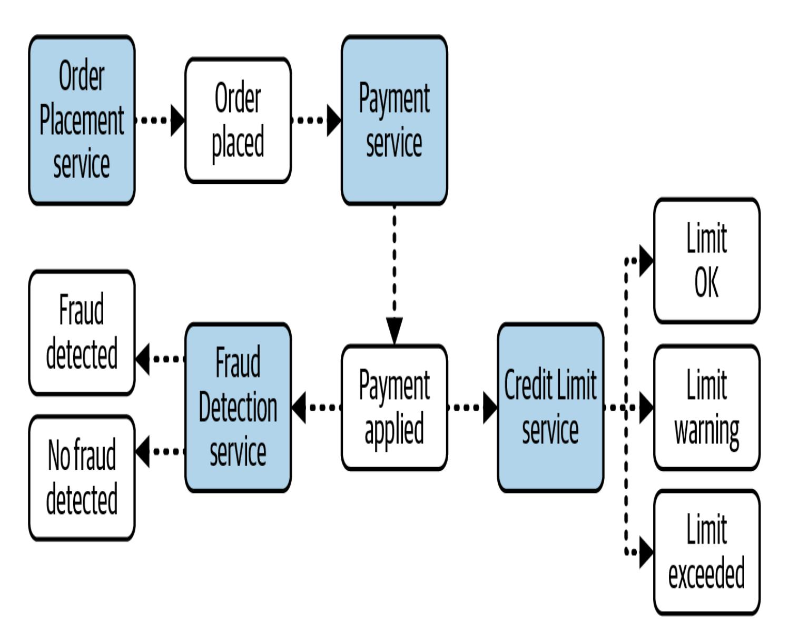

Abbildung 15-4. Abgeleitete Ereignisse werden als Reaktion auf das auslösende Ereignis erzeugt

Beachte, wie viele abgeleitete Ereignisse diese eine Aktion auslöst. Im Ereignisprozessor Fraud Detection löst sie zwei mögliche abgeleitete Ereignisse aus: eines, wenn der Prozessor Betrug aufdeckt, ein anderes, wenn kein Betrug festgestellt wird. Diese beiden abgeleiteten Ereignisse sind notwendig, weil verschiedene Ereignisverarbeiter je nach Ergebnis der Betrugserkennung weitere Aktionen durchführen können.

Schau dir nun die abgeleiteten Ereignisse des Credit Limit Ereignisprozessors an. Erstens zeigt ein von limit okay abgeleitetes Ereignis dem Rest des Systems an, dass für diesen Kauf kein Risiko besteht und dass der Kunde über ein ausreichendes Guthaben verfügt. In der Tat könnte dieses Ereignis auch die Höhe des Guthabens, das der Kunde noch hat, in seinem Ereignis-Payload speichern, was für nachgelagerte Ereignisverarbeiter von Interesse sein könnte. Zweitens könnte das von limit warning abgeleitete Ereignis, das darauf hinweist, dass das Guthaben der Karte fast das Kreditlimit erreicht hat, für andere nachgelagerte Ereignisprozessoren von Interesse sein - zum Beispiel für den Notification Ereignisprozessor, der den Kunden darüber informieren könnte, dass sein Kreditlimit fast erreicht ist. Das von limit exceeded abgeleitete Ereignis "fatal" schließlich ist für mehrere Ereignisverarbeiter von Interesse, z. B. Notification , Decline Purchase und vielleicht für einen marketingbasierten Extend Credit Limit Ereignisverarbeiter, der das Kreditlimit des Kunden automatisch erweitert, um den Kauf zu ermöglichen.

Dies verdeutlicht, dass mehr als ein abgeleitetes Ereignis von einem Ereignisprozessor ausgelöst werden kann. Achte jedoch darauf, dass du nicht in die Falle des *Mückenschwarms* gerätst, bei dem eine Verarbeitungseinheit zu viele feinkörnige Ereignisse aussendet (siehe "Der [Mückenschwarm"\)](#page-44-0).

## <span id="page-17-0"></span>**Auslösen von erweiterbaren Ereignissen**

In der EDA ist es in der Regel eine gute Praxis, dass jeder Ereignisprozessor dem Rest des Systems mitteilt, was er getan hat, unabhängig davon, ob sich ein anderer Ereignisprozessor für diese Aktion interessiert oder nicht.

Wenn sich kein Ereignisprozessor um das Ereignis kümmert oder darauf reagiert, nennen wir es ein *erweiterbares abgeleitetes Ereignis*, weil es dennoch die *architektonische Erweiterbarkeit* unterstützt, indem es einen eingebauten "Haken" für den Fall bietet, dass die Verarbeitung dieses Ereignisses zusätzliche Funktionen erfordert. Nehmen wir zum Beispiel an, dass der Notification Ereignisprozessor als Teil eines komplexen Ereignisprozesses (wie in [Abbildung](#page-18-0) 15-5 dargestellt) eine E-Mail erzeugt, die er an einen Kunden sendet, um ihn über eine bestimmte Aktion zu informieren. Anschließend teilt er dem Rest des Systems über ein neues abgeleitetes Ereignis ( email sent ) mit, dass er die E-Mail verschickt hat. Da derzeit keine anderen Ereignisverarbeiter zuhören oder auf dieses Ereignis reagieren, verschwindet die Nachricht einfach (oder wird ignoriert, im Falle von Event Streaming). Das mag wie eine Verschwendung von Ressourcen erscheinen, ist es aber nicht. Angenommen, das Unternehmen beschließt, alle an Kunden gesendeten E-Mails zu analysieren. Das Team kann das Gesamtsystem mit minimalem Aufwand und ohne Änderungen an anderen Ereignisverarbeitern um einen neuen Email Analyzer Ereignisprozessor erweitern, da die E-Mail-Informationen bereits über das abgeleitete Ereignis email sent verfügbar sind.

<span id="page-18-0"></span>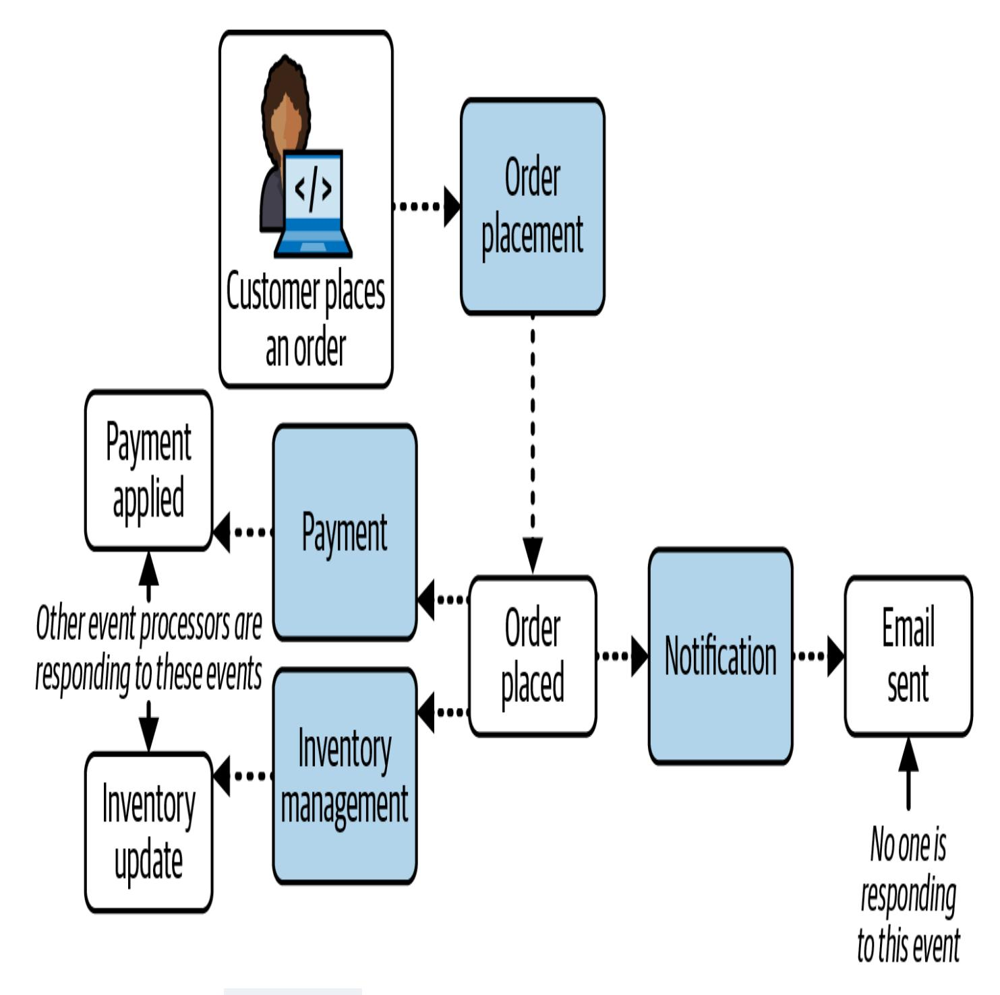

Abbildung 15-5. Notification Ereignis wird gesendet, aber ignoriert und nicht verwendet

## **Asynchrone Fähigkeiten**

Die ereignisgesteuerte Architektur zeichnet sich dadurch aus, dass sie in erster Linie auf asynchrone Kommunikation setzt, sowohl für die *Fireand-Forget-Verarbeitung* (keine Antwort erforderlich) als auch für die

*Request/Reply-Verarbeitung* (wenn eine Antwort vom [Ereignisverbraucher](#page-63-0) erforderlich ist, siehe "Request-Reply-Verarbeitung"). Die asynchrone Kommunikation kann eine leistungsstarke Technik sein, um dieReaktionsfähigkeit eines Systems insgesamt zu verbessern.

In [Abbildung](#page-20-0) 15-6 postet ein Nutzer eine Produktbewertung auf einer Website. Der Kommentardienst benötigt in diesem Beispiel 3.000 Millisekunden, um den Kommentar zu validieren und zu veröffentlichen. Der Kommentar muss mehrere Parsing-Engines durchlaufen: eine Prüfung auf unzulässige Wörter, eine Prüfung, um sicherzustellen, dass der Kommentar keinen beleidigenden Text enthält (wie z. B. "langsamer Denker" oder "nicht in der Lage, klar zu denken"), und schließlich eine Kontextprüfung, um sicherzustellen, dass sich der Kommentar auf das Produkt bezieht (und nicht z. B. nur eine politische Tirade ist).

Der obere Pfad in [Abbildung](#page-20-0) 15-6 postet den Kommentar über einen synchronen RESTful-Aufruf. Das bedeutet, dass der Dienst 50 ms Netzwerklatenz benötigt, um den Beitrag zu empfangen, 3.000 ms, um den Kommentar zu validieren und zu posten, und 50 ms Latenz, um dem Nutzer mitzuteilen, dass der Kommentar gepostet wurde. Die Gesamtzeit für das Posten eines Kommentars beträgt aus Sicht des Nutzers also 3.100 Millisekunden. Betrachte nun den unteren Pfad, der asynchrone Nachrichten verwendet. Hier beträgt die Gesamtzeit des Nutzers für das Posten eines Kommentars nur 25 ms im Gegensatz zu 3.100 ms. Das System braucht zwar immer noch 25 ms, um den Kommentar zu

empfangen, und 3.000 ms, um ihn zu posten, also insgesamt 3.025 ms, aber aus Sicht des Endnutzers vergehen nur 25 ms, bis das System antwortet, dass es den Kommentar akzeptiert hat (obwohl er noch gar nicht gepostet wurde).

<span id="page-20-0"></span>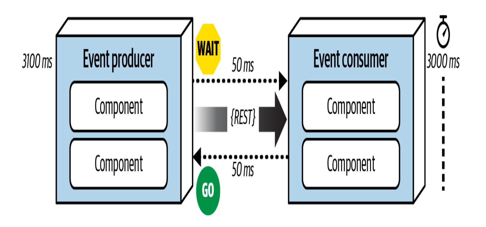

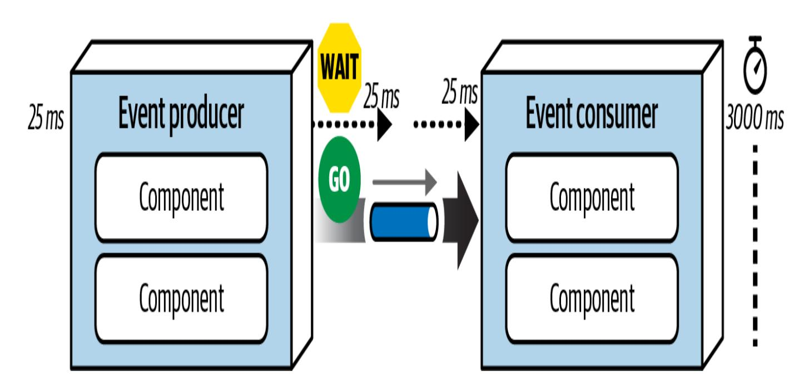

Abbildung 15-6. Synchrone versus asynchrone Kommunikation

Der Unterschied in der Antwortzeit zwischen 3.100 ms und 25 ms ist atemberaubend. Es gibt jedoch eine Einschränkung: Auf dem synchronen oberen Pfad erhält der Endnutzer eine *Garantie*, dass sein Kommentar veröffentlicht wurde. Auf dem asynchronen unteren Weg wird der Beitrag jedoch nur bestätigt, mit dem Versprechen, dass er *in* Zukunft veröffentlicht wird. Was würde passieren, wenn der Kommentar des Nutzers Obszönitäten enthält und das System ihn ablehnt? Es gibt keine Möglichkeit, den Endnutzer zu benachrichtigen oder etwa doch? Wenn der/die Nutzer/in sich auf der Website registrieren muss, um einen Kommentar zu veröffentlichen, könnte das System ihm/ihr eine Nachricht schicken, die auf ein Problem mit dem Kommentar hinweist und vorschlägt, wie man es beheben kann.

Dieses Beispiel verdeutlicht den Unterschied zwischen *Reaktionsfähigkeit* (die Zeit, die benötigt wird, um Informationen an den Nutzer zurückzukommen) und *Leistung* (die Zeit, die benötigt wird, um den Kommentar in die Datenbank einzufügen). Wenn der Nutzer keine weiteren Informationen benötigt (außer einer Bestätigung oder einem Dankeschön), warum sollte er dann warten müssen? Bei der Reaktionsfähigkeit geht es darum, dem Nutzer mitzuteilen, dass die Aktion angenommen wurde und gleich bearbeitet wird, während es bei der Leistung darum geht, den End-to-End-Prozess zu beschleunigen. Auf dem asynchronen unteren Pfad hat der Architekt nichts getan, um die Art und Weise zu optimieren, wie der Kommentardienst den Kommentar verarbeitet (das betrifft die *Reaktionsfähigkeit*). Wenn der Architekt sich die Zeit genommen hätte, den Kommentardienst zu optimieren, z. B. durch die parallele Ausführung aller Text- und Grammatik-ParsingEngines, die Nutzung von Caching und anderen ähnlichen Techniken, aber immer noch mit synchroner Kommunikation, würde er sich stattdessen um die *Gesamtleistung* kümmern.

Das war ein einfaches Beispiel. Wie wäre es mit einem etwas komplizierteren Beispiel? Betrachten wir dieses Mal einen *Online-Aktienhandel*, bei dem ein Nutzer asynchron Aktien kauft. Was ist, wenn es keine Möglichkeit gibt, den Nutzer über einen Fehler zu informieren?

Während die asynchrone Kommunikation die Reaktionsfähigkeit deutlich verbessert, ist die Fehlerbehandlung ein großes Problem. Die Schwierigkeit, mit Fehlerzuständen umzugehen, erhöht die Komplexität dieses Architekturstils. ["Fehlerbehandlung"](#page-51-0) veranschaulicht ein Muster reaktiver Architektur, das die Herausforderungen bei der Fehlerbehandlung angeht: das *Workflow-Ereignismuster*.

Die asynchrone Kommunikation ist nicht nur reaktionsschnell, sondern bietet auch ein gutes Maß an dynamischer Entkopplung und vermeidet ein Gegenmuster, die *dynamische Quantenverschränkung*, die auftritt, wenn zwei Architekturquanten durch synchrone Kommunikation kommunizieren. (Du erinnerst dich wahrscheinlich aus [Kapitel](#page--1-0) 7, dass ein *architektonisches Quantum* ein Teil des Systems ist, der unabhängig vom Rest des Systems eingesetzt werden kann und durch synchrone dynamische Kopplung gebunden ist, und dass architektonische Merkmale auf der Quantenebene leben). Da diese beiden architektonischen Quanten nun voneinander abhängig sind, werden sie im Wesentlichen *verschränkt*. Durch die Abhängigkeit werden sie zu einem einzigen Architekturquantum. Asynchrone Kommunikation kann helfen, die Architekturquanten zu entflechten, weil sie diese dynamische Abhängigkeit aufhebt.

Um diesen wichtigen Punkt zu veranschaulichen, betrachte die beiden Systeme in [Abbildung](#page-23-0) 15-7. In diesem Beispiel erstellt das System Portfolio Management einen Handelsauftrag zum Kauf einer Aktie. Es sendet diesen Handelsauftrag synchron an das System Trade Order , das die Konformitätsprüfung durchführt und den Handelsauftrag erstellt. Da die Kommunikation zwischen diesen beiden Systemen synchron ist, muss das System Portfolio Management zwangsläufig blockieren und auf eine Handelsbestätigungsnummer vom System Trade Order warten. Diese beiden Systeme haben sich verschränkt und bilden nun ein einziges architektonisches Quantum.

<span id="page-23-0"></span>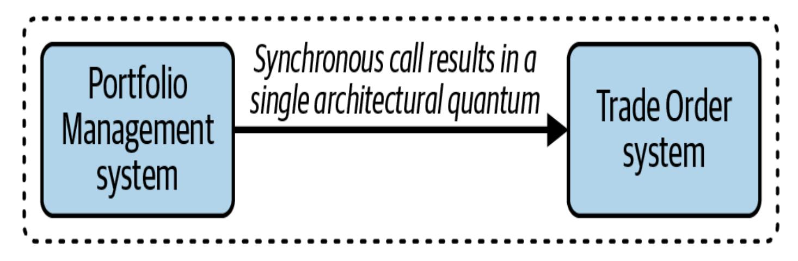

Abbildung 15-7. Diese Systeme bilden aufgrund der synchronen dynamischen Kopplung ein einziges Architekturquantum

Die Bedeutung dieser Verflechtung liegt darin, dass die architektonischen Merkmale nun *zwischen* diesen beiden Systemen leben. Wenn das System Trade Order nicht mehr verfügbar ist oder nicht mehr reagiert, kann das System Portfolio Management den Handelsauftrag nicht mehr erteilen. Dies verschlechtert auch die

Reaktionsfähigkeit: Wenn das Trade Order System langsam ist, wird auch das Portfolio Management System langsam sein. Auch die Skalierbarkeit leidet, denn wenn das Portfolio Management System skaliert werden muss, muss auch das Trade Order System skalieren. Wenn es nicht skaliert oder skalieren kann, dann kann auch das Portfolio Management System nicht entsprechend skalieren.

Ein Architekt kann diese architektonischen Quanten entflechten, indem er den synchronen Aufruf durch einen asynchronen Aufruf zwischen den beiden Systemen ersetzt, wie in [Abbildung](#page-24-0) 15-8 dargestellt.

<span id="page-24-0"></span>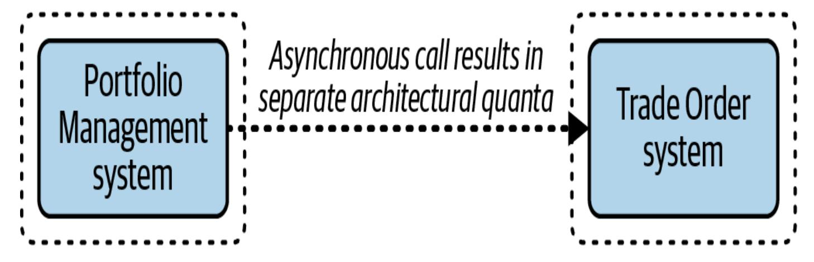

Abbildung 15-8. Diese Systeme bilden aufgrund ihrer asynchronen dynamischen Kopplung separate Architekturquanten

Durch die Verwendung asynchroner Kommunikation kann das Portfolio Management System den Handelsauftrag über eine Warteschlange oder ein anderes asynchrones Mittel senden, so dass es nicht darauf warten muss, dass das Trade Order System den Handelsauftrag erstellt. Sobald das System Trade Order seine Prüfungen durchgeführt und den Handelsauftrag erstellt hat, kann es die Bestätigungsnummer über einen separaten, asynchronen Kanal an das System Portfolio Management senden. Indem diese Abhängigkeit

von der dynamischen Kopplung der beiden Systeme aufgehoben wird, können sie zwei getrennte architektonische Quanten bilden. Wenn das System Trade Order nicht verfügbar ist oder nicht reagiert, kann das System Portfolio Management trotzdem Handelsaufträge erteilen, da es weiß, dass sie irgendwann erstellt und die Bestätigungsnummern zurückgeschickt werden.

## **Broadcast-Fähigkeiten**

Ein weiteres einzigartiges Merkmal der EDA ist ihre Fähigkeit, Ereignisse zu senden, ohne zu wissen, welche anderen Verarbeitungseinheiten (wenn überhaupt) diese Ereignisse empfangen oder welche Verarbeitung sie als Reaktion darauf durchführen werden. Wie [Abbildung](#page-26-0) 15-9 zeigt, werden die Ereignisprozessoren dadurch dynamisch voneinander entkoppelt.

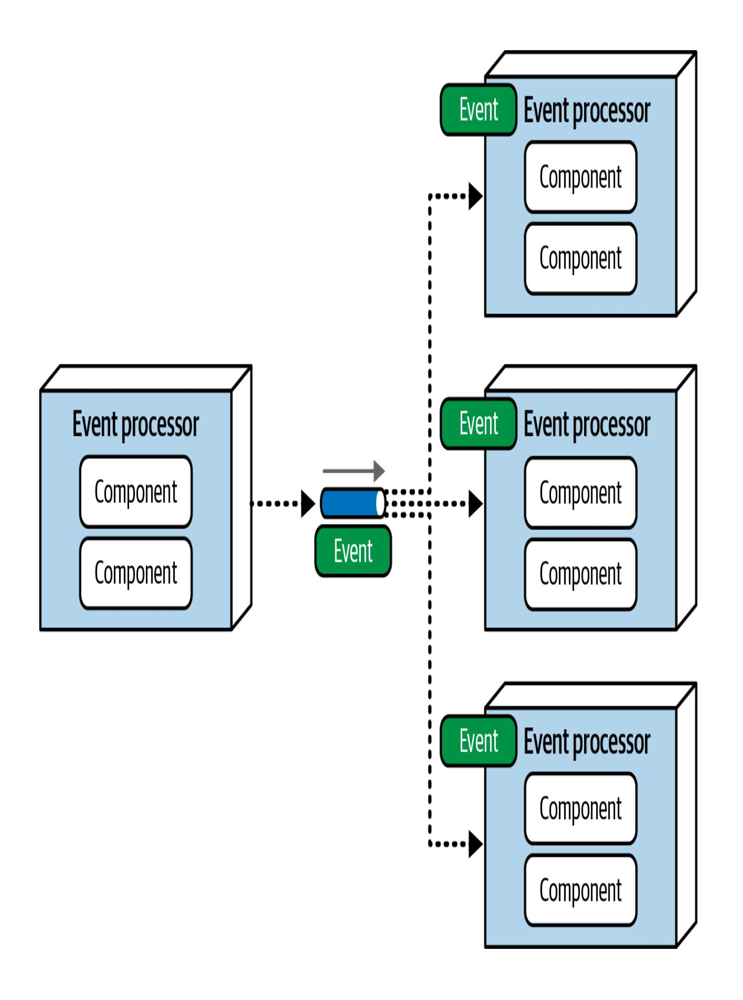

Broadcasting-Fähigkeiten sind ein wesentlicher Bestandteil vieler Muster, einschließlich eventueller Konsistenz und komplexer Ereignisverarbeitung (CEP). Die Preise für Instrumente, die an der Börse gehandelt werden, ändern sich zum Beispiel häufig. Jedes Mal, wenn ein neuer Tickerkurs (der aktuelle Kurs einer bestimmten Aktie) veröffentlicht wird, könnten viele Ereignisverarbeiter auf den neuen Kurs reagieren (z. B. Handelsanalysen, Kauf oder Verkauf der Aktie). Der Ereignisverarbeiter, der den neuesten Kurs veröffentlicht, gibt ihn jedoch einfach weiter, ohne zu wissen, wie diese Information verwendet wird. Dies wird als *semantische Entkopplung* bezeichnet, da ein Ereignisverarbeiter keine Kenntnis von den Aktionen anderer Ereignisverarbeiter hat (oder von ihnen abhängig ist).

## <span id="page-27-0"></span>**Ereignis-Nutzlast**

Die Informationen, die in einem Ereignis enthalten sind, werden als *Nutzdaten* bezeichnet. Die Nutzdaten können sehr unterschiedlich sein: Ein Ereignis-Nutzdatenpaar kann ein einfaches Schlüssel-Wert-Paar sein oder alle Informationen, die für die nachfolgende Verarbeitung notwendig sind. Die beiden Grundtypen sind *datenbasierte* und *schlüsselbasierte* Ereignis-Nutzdaten. Architekten müssen eine sorgfältige Kompromiss-Analyse durchführen, um festzustellen, welche dieser Optionen für jede Art von Ereignis, das im System ausgelöst wird, geeignet ist. In diesem Abschnitt beschreiben wir diese beiden Arten von Nutzdaten und ihre jeweiligen Kompromisse.

### **Datenbasierte Ereignis-Payloads**

Ein *datenbasierter Event Payload* ist ein Event Payload, der alle notwendigen Informationen für die Verarbeitung sendet. In dem in [Abbildung](#page-29-0) 15-10 dargestellten Beispiel gibt ein Kunde eine Bestellung auf. Zuerst fügt der Order Placement Ereignisprozessor die komplette Bestellung in die Datenbank (das System of Record) ein. Dann sendet er ein Ereignis namens order\_placed , das alle Einzelheiten der Bestellung enthält (in diesem Fall 45 Attribute, insgesamt 500 KB Speicherplatz). Der Ereignisprozessor von Payment reagiert auf dieses Ereignis, indem er Informationen aus der Nutzlast des Ereignisses abruft - insbesondere die Bestell-ID, die Daten des Kunden und die Gesamtkosten der Bestellung und diese für die Zahlung verwendet. Gleichzeitig verwendet der Inventory Management Ereignisprozessor die Artikel-ID und die Artikelmenge aus dem Ereignis-Payload, um den aktuellen Bestand für den gekauften Artikel anzupassen.

<span id="page-29-0"></span>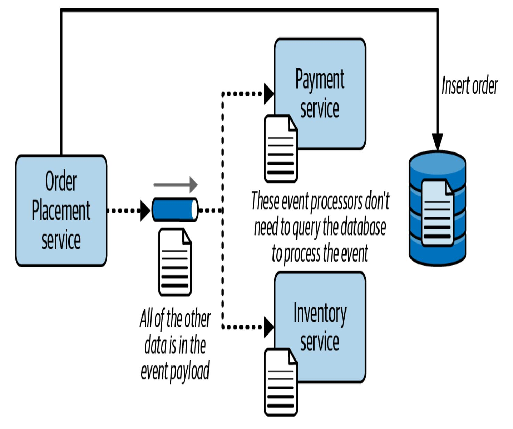

Abbildung 15-10. Datenbasierte Ereignis-Payloads enthalten alle für die Verarbeitung notwendigen Daten

Die Ereignisverarbeiter von Payment und Inventory Management mussten die Datenbank nicht abfragen, um die Bestellinformationen zu erhalten, da die Daten bereits in der Ereignis-Nutzlast enthalten waren. Das ist einer der größten Vorteile der Verwendung von datenbasierten Event Payloads. Je weniger ein Ereignisverarbeiter die Datenbank abfragt, desto besser sind seine Leistung, Reaktionsfähigkeit und Skalierbarkeit. Da die EDA sehr dynamisch und entkoppelt ist, weiß der

Order Placement Ereignisprozessor unter Umständen nicht, welche anderen Ereignisprozessoren auf das Ereignis reagieren oder welche Daten sie für die Verarbeitung benötigen. Die Übermittlung aller Informationen in der Ereignis-Nutzlast garantiert, dass jeder antwortende Ereignisprozessor die Informationen erhält, die er für seine Verarbeitung benötigt. Eventprozessoren haben möglicherweise nicht einmal Zugriff auf die Datenbank, die die Auftragsinformationen enthält, insbesondere in Datentopologien mit strikt begrenzten Kontexten, domänenbasiert oder datenbankbasiert (siehe ["Datentopologien"\).](#page-90-0)

Diese Vorteile zeigen, wie man reaktionsschnellere, skalierbarere und flexiblere Systeme schaffen kann, aber datenbasierte Payloads haben auch einige Nachteile. Der erste ist, dass es schwieriger ist, die Datenkonsistenz und -integrität aufrechtzuerhalten, wenn du *mehrere Datensysteme* hast. Da alle Auftragsdaten in der Datenbank *und* in den Ereignissen, die im System ausgelöst werden, enthalten sind, können die Auftragsdaten leicht aus dem Gleichgewicht geraten - vor allem, wenn der Auftrag während der Verarbeitung aktualisiert wird.

Nehmen wir zum Beispiel an, ein Kunde bestellt hundert Artikel, wollte aber nur einen bestellen und bemerkt seinen Fehler sofort, nachdem er die Bestellung abgeschickt hat. Oder der Kunde merkt kurz nach der Bestellung, dass er die falsche Lieferadresse angegeben hat (das ist deinen Autoren schon oft passiert). In beiden Fällen aktualisiert der Kunde die Bestellung sofort mit den richtigen Informationen. Die Datenbank, die das einzige System ist, in dem die Daten gespeichert werden, enthält die korrigierten Werte, aber einige der Ereignisse, die

die älteren Werte enthalten, werden möglicherweise nicht sofort verarbeitet. Das bedeutet, dass alle älteren, falschen Werte, die noch verarbeitet werden, anstelle der neueren, korrekten Werte verwendet werden. Erschwerend kommt hinzu, dass es in der EDA sehr schwierig ist, das Timing von Ereignissen zu kontrollieren, sodass es möglich ist, dass die neueren Werte *vor den* älteren verarbeitet werden. Das heißt, wenn andere Ereignisverarbeiter die älteren, falschen Werte verwenden, könnten diese die korrekten, neueren Werte überlagern.

Ein zweiter großer Nachteil des datenbasierten Ereignis-Payloads betrifft das Vertragsmanagement und die Versionierung. Wir wissen, dass eine Bestellung in diesem System 45 Attribute hat. Da all diese Informationen in der Ereignis-Nutzlast enthalten sind, braucht das Ereignis eine Art *Vertrag - eine*Möglichkeit, die gesendeten Daten zu strukturieren. Der Architekt steht nun vor unzähligen Entscheidungen: Soll der Payload-Typ ein JSON-Objekt sein? Ein XML-Objekt? Soll der Vertrag strikt oder locker sein? (Ein *strikter* Vertrag ist ein Vertrag, der eine Art Schema oder Objektdefinition verwendet, z. B. ein JSON-Schema, eine GraphQL-Spezifikation oder eine Klassendefinition, während ein *loser* Vertrag einfache JSON-Namen-Wert-Paare verwenden kann). Jede dieser Entscheidungen bringt viele Kompromisse mit sich und bildet eine enge statische Kopplung zwischen den Ereignisverarbeitern.

Und dann ist da noch die Versionierung. Bei strengen Verträgen kann ein Architekt oder Entwickler einen [Hersteller-MIME-Typ](https://oreil.ly/gj4TZ) in den Ereignis-Headern verwenden, um die Versionsnummer anzugeben. Das macht das System agiler und sorgt für Abwärtskompatibilität (damit andere

Ereignisprozessoren nicht kaputt gehen). Allerdings müssen alle Ereignisprozessoren die gleiche Versionslogik verwenden, was eine strenge Kontrolle erfordert. Wenn ein Ereignisprozessor eine Vertragsversion ignoriert, wenn er auf die Nutzdaten eines strikten Vertrags reagiert, kann eine Änderung des Schemas dazu führen, dass dieser Ereignisprozessor fehlschlägt. Außerdem ist es sehr schwierig, in einer stark entkoppelten, asynchronen Architektur wie der EDA Strategien für die Versionskommunikation und das Veralten von Versionen zu implementieren. All dies macht datenbasierte Ereignis-Payloads etwas anfällig.

Datenbasierte Event-Payloads können auch unter *Stempelkopplung* leiden: eine Form der statischen Kopplung, bei der mehrere Module (in diesem Fall Event-Prozessoren) eine gemeinsame Datenstruktur haben, aber nur Teile davon verwenden (und in vielen Fällen unterschiedliche Teile davon). In diesem Fall kann eine Änderung der gemeinsamen Datenstruktur dazu führen, dass andere Ereignisprozessoren geändert werden müssen, auch solche, die sich nicht um die Daten kümmern.

[Abbildung](#page-34-0) 15-11 veranschaulicht, wie die Stempelkopplung funktioniert und welche negativen Auswirkungen sie auf die Architektur hat. In diesem Beispiel sendet der Order Placement -Ereignisprozessor ein order\_placed -Ereignis, das aus 45 Attributen besteht, die alle Informationen über die Bestellung enthalten, mit einer Größe von 500 KB. Der Inventory -Ereignisprozessor antwortet auf das order\_created -Ereignis, benötigt aber nur zwei Attribute, item\_id und quantity , die insgesamt nur 30 Bytes umfassen. In diesem Beispiel

würde sich eine Änderung der Nutzlast, z. B. durch das Entfernen eines Attributs für die Adresszeile, auf den Ereignisprozessor Inventory auswirken, auch wenn er sich nicht um dieses Feld kümmert.

<span id="page-34-0"></span>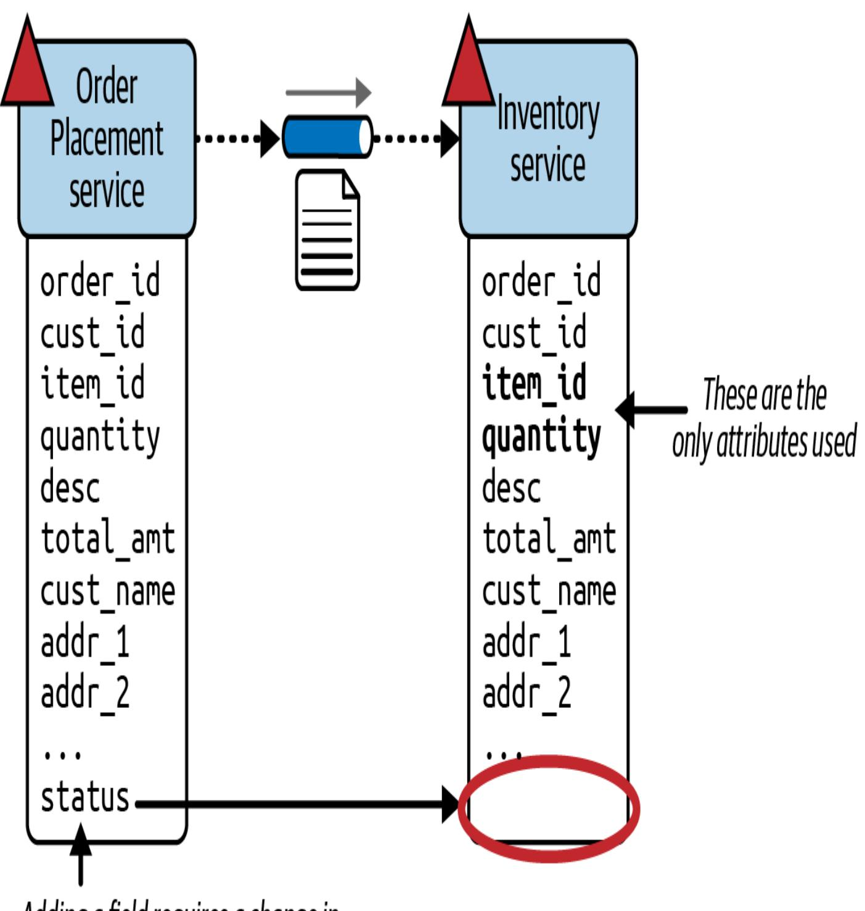

Abbildung 15-11. Ein Beispiel für Stempelkopplung, bei der ein anderer Dienst nur einen Teil der gesendeten Daten benötigt

In diesem Beispiel hilft die Verwendung von Vertragsversionen mit strikten Verträgen, das Risiko zu verringern, dass der Inventory

Ereignisprozessor nicht mehr funktioniert, aber irgendwann - wenn die Vertragsversion veraltet ist oder eine Vertragsänderung eintritt - muss der Entwickler ihn erneut testen und bereitstellen.

Ein häufig übersehenes Problem bei der Stempelkopplung ist die *Bandbreitennutzung*. Der dritte Trugschluss des [verteilten](https://oreil.ly/xxVRx) Rechnens ist, dass "die Bandbreite unendlich ist". Das ist sie natürlich nicht. Tatsächlich ist es in den meisten Cloud-basierten Umgebungen die Bandbreite, die so viel kostet. Um auf unser Beispiel in [Abbildung](#page-34-0) 15-11 zurückzukommen: Wenn Kunden 500 Bestellungen pro Sekunde aufgeben, verbraucht das Senden eines einzigen 500 KB großen Ereignisses an den Ereignisprozessor Inventory 250.000 KB pro Sekunde an Bandbreite. Wenn das System jedoch nur die 30 Bytes an Daten sendet, die tatsächlich *benötigt werden*, beansprucht das Ereignis nur 15 KB pro Sekunde an Bandbreite. Das ist ein gewaltiger Unterschied, der bei der Verwendung von datenbasierten Ereignissen untersucht werden sollte.

Ein Grund, warum Architekten manchmal die Stempelkopplung einschränken, ist die Nutzung von [verbrauchergesteuerten](https://oreil.ly/tG-eT) Verträgen, bei denen jeder Verbraucher einer Nachricht seinen eigenen Vertrag hat, der nur die Daten enthält, die er für die Verarbeitung benötigt. Aufgrund der Broadcast-Fähigkeiten von EDA und der Tatsache, dass das System nicht immer wissen kann, welche Ereignisprozessoren auf ein Ereignis reagieren werden, ist es jedoch schwierig, verbrauchergesteuerte Verträge mit Ereignissen in einer ereignisgesteuerten Architektur zu nutzen. Aus diesem Grund (und um die anderen Nachteile von

datenbasierten Event Payloads zu umgehen) wenden sich viele Architekten schlüsselbasierten Event Payloads zu.

### **Schlüsselbasierte Ereignis-Nutzlast**

Ein *schlüsselbasierter Ereignis-Payload* ist ein Ereignis-Payload, der nur einen Schlüssel enthält, der den Kontext für das Ereignis identifiziert (z. B. eine Bestell-ID oder eine Kunden-ID). Bei schlüsselbasierten Ereignis-Payloads müssen die Ereignisverarbeiter, die auf das Ereignis reagieren, eine Datenbank abfragen, um die Informationen zu erhalten, die sie zur Verarbeitung des Ereignisses benötigen.

Wenn ein Kunde eine Bestellung aufgibt, fügt der Order Placement Ereignisprozessor die Bestellung in die Datenbank ein und löst ein schlüsselbasiertes Ereignis namens order\_placed aus. Dieses Ereignis enthält einen einzelnen Schlüsselwert, der die Bestell-ID in einfacher JSON-Form enthält:

```
{
 "order_id": "123"
}
```

Einer der Hauptnachteile von schlüsselbasierten Ereignis-Payloads ist, dass jeder Ereignisverarbeiter, der auf das Ereignis reagiert, die Datenbank abfragen muss, um die Informationen zu erhalten, die er zur Bearbeitung der Bestellung benötigt. Wenn z. B. der Ereignisprozessor Payment auf das Ereignis antwortet, muss er die Datenbank nach den Bestellinformationen abfragen, die er für die Zahlungsabwicklung

benötigt. Da der Ereignisprozessor Inventory gleichzeitig auf das Ereignis reagiert, muss er auch die Datenbank abfragen, um die Artikel-ID und die Menge zu erhalten. Dies kann die Reaktionsfähigkeit, Leistung und Skalierbarkeit beeinträchtigen und eine Datenbank überfordern, insbesondere in einer hochgradig parallelen und asynchronen Architektur wie der ereignisgesteuerten Architektur. (Siehe ["Datentopologien"](#page-90-0) für Möglichkeiten, dieses Risiko zu verringern.) Schlüsselbasierte Ereignis-Payloads stellen auch eine Herausforderung dar, wenn die benötigten Daten nicht leicht zugänglich sind (z. B. wenn sie im begrenzten Kontext eines anderen Ereignisprozessors liegen). [Abbildung](#page-38-0) 15-12 veranschaulicht diese Technik.

<span id="page-38-0"></span>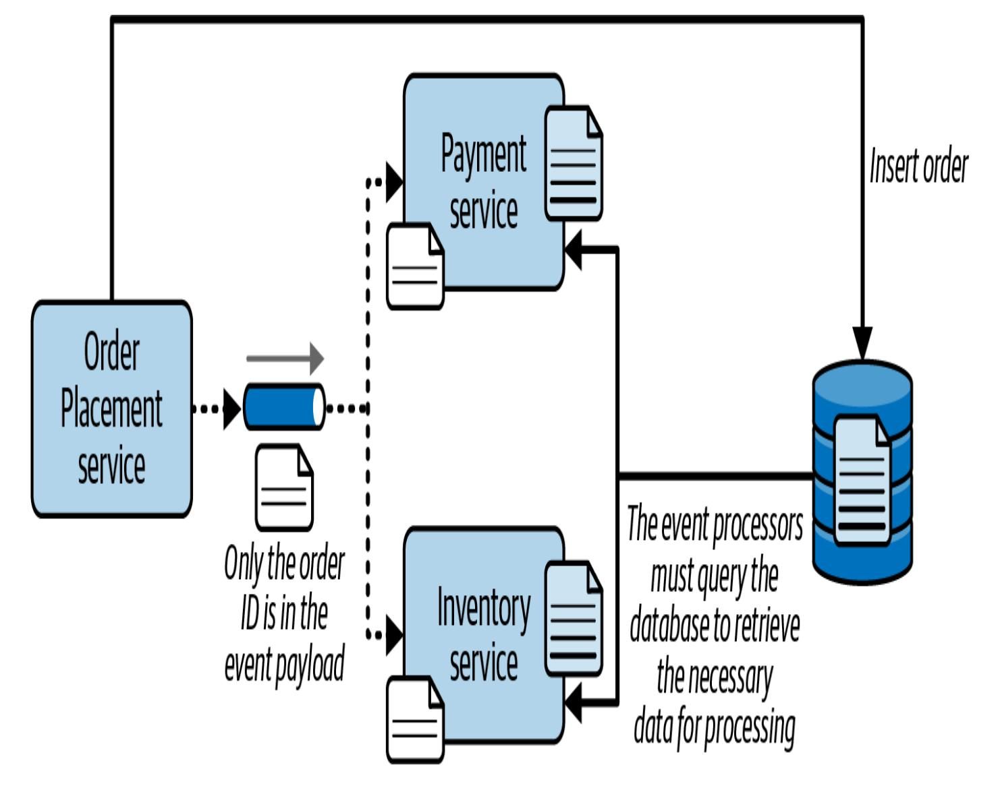

Abbildung 15-12. Bei schlüsselbasierten Ereignis-Payloads ist nur der Kontextschlüssel im Ereignis enthalten

Die Verwendung von schlüsselbasierten Ereignis-Payloads bringt jedoch viele Vorteile mit sich, von denen einige die Leistungs- und Skalierbarkeitsprobleme überwiegen können. Der erste Hauptvorteil ist die bessere allgemeine Datenkonsistenz und Datenintegrität, da es *nur ein einziges Aufzeichnungssystem* gibt. Da sich die Daten über das Ereignis nur an einem Ort befinden (in der Datenbank), können schlüsselbasierte Ereignis-Payloads Änderungen an den Daten während

der Ereignisverarbeitung viel leichter verarbeiten als datenbasierte Ereignis-Payloads.

Der zweite große Vorteil ist, dass der Vertrag in schlüsselbasierten Ereignis-Payloads so einfach ist und sich nur selten ändert, dass Architekten ihn in der Regel durch lose, schemafreie JSON- oder XML-Dateien implementieren. Daher haben schlüsselbasierte Ereignis-Payloads nicht die gleichen Probleme mit der Verwaltung von Vertragsänderungen, der Versionierung und den Kommunikations- und Auslaufstrategien, die bei datenbasierten Ereignis-Payloads häufig auftreten.

Ein weiterer Vorteil von schlüsselbasierten Ereignis-Payloads: Sie haben nicht die gleichen Probleme mit der Stempelkopplung und Bandbreite wie datenbasierte Ereignis-Payloads. Da mit dem Ereignis keine undurchsichtigen Daten verbunden sind, sind Verträge einfach und klein und benötigen nur eine geringe Bandbreite. Daher sind sie aus Sicht des Netzwerks und des Message Brokers in der Regel schneller als datenbasierte Event Payloads.

### **Zusammenfassung der Kompromisse**

Die Entscheidung zwischen einer datenbasierten Ereignis-Nutzlast und einer schlüsselbasierten Daten-Nutzlast erfordert eine sorgfältige Analyse des Kompromisses. Erinnere dich daran, dass es kein Alles-oder-Nichts-Prinzip ist: Jede Art von Ereignis kann einen anderen Payload-Typ verwenden. [Tabelle](#page-40-0) 15-1 fasst die Kompromisse zusammen, die mit

datenbasierten und schlüsselbasierten Ereignis-Payloads verbunden sind.

<span id="page-40-0"></span>Tabelle 15-1. Datenbasierte versus schlüsselbasierte Ereignis-Payloads

| Kriterien                                    | Datenbasierte<br>Nutzlasten | Schlüsselbasierte<br>Nutzlasten |
|----------------------------------------------|-----------------------------|---------------------------------|
| Leistung<br>und<br>Skalierbarkeit            | Gut                         | Schlecht                        |
| Vertragsmanagement                           | Schlecht                    | Gut                             |
| Stempelkupplung                              | Schlecht                    | Gut                             |
| Bandbreitennutzung                           | Schlecht                    | Gut                             |
| Eingeschränkter<br>Datenbankzugang           | Gut                         | Schlecht                        |
| Allgemeine<br>Anfälligkeit<br>des<br>Systems | Schlecht                    | Gut                             |

Beachte, dass der Kompromiss zwischen diesen beiden Optionen auf Skalierbarkeit und Leistung gegenüber Vertragsmanagement und

Bandbreitennutzung hinausläuft. Frag dich, was für jedes einzelne Ereignis wichtiger ist. Manche Ereignisverarbeitungen erfordern ein extremes Maß an Skalierbarkeit und Leistung, in diesem Fall wäre ein datenbasierter Ereignis-Payload die bessere Wahl; manche Ereignisverarbeitungsdaten werden sich häufig ändern, in diesem Fall könnte ein schlüsselbasierter Ereignis-Payload besser geeignet sein.

Wie bei den meisten Dingen in der Softwarearchitektur liegen die Entscheidungen der Architekten auf einem Spektrum, nicht auf einer einfachen Binärzahl. Deshalb ist es wichtig, darauf zu achten, dass keine so genannten anämischen Ereignisse ausgelöst werden.

### **Anämische Ereignisse**

Ein *anämisches Ereignis* ist ein abgeleitetes Ereignis mit einer Nutzlast, die nicht genug Informationen enthält, um dem Ereignisverarbeiter bei der Entscheidungsfindung zu helfen, und der notwendige Kontext für die weitere Verarbeitung fehlt.

[Abbildung](#page-43-0) 15-13 zeigt ein anämisches abgeleitetes Ereignis. In diesem Beispiel hat ein Kunde einige Informationen in seinem Benutzerprofil aktualisiert. Sobald diese Informationen in der Datenbank aktualisiert wurden, löst der Customer Profile Ereignisprozessor ein profile\_updated Ereignis aus, das einen schlüsselbasierten Ereignis-Payload verwendet, der nur die Kunden-ID als schlüsselbasierte Daten übergibt.

Die drei Dienste, die auf dieses Ereignis reagieren, erhalten nur die Kunden-ID und den Kontext, dass das Profil des Kunden geändert wurde. Der erste Dienst ( Service 1 ) hat keine Ahnung, welche Daten im Profil geändert wurden: Name, Adresse oder andere wichtige Informationen? Leider kann die Abfrage der Datenbank diese Frage nicht beantworten, so dass Service 1 keine Ahnung hat, wie er reagieren oder was er tun soll. Service 2 antwortet auf das Ereignis profile\_updated , aber da er nur den Schlüssel kennt, weiß er nicht, ob er eine weitere Verarbeitung vornehmen muss. Service 3 schließlich reagiert auf dasselbe Ereignis, hat aber keine Ahnung, welche Werte vorher vorhanden waren und kann daher keine Verarbeitung vornehmen. Alle drei Ereignisverarbeiter müssen in irgendeiner Weise auf die Aktualisierung des Kundenprofils reagieren, können dies aber nicht, weil ihnen die Informationen fehlen. Das sind anämische Ereignisse: Ereignisse, die keine zusätzlichen Informationen enthalten, um das Ereignis weiter zu verarbeiten.

<span id="page-43-0"></span>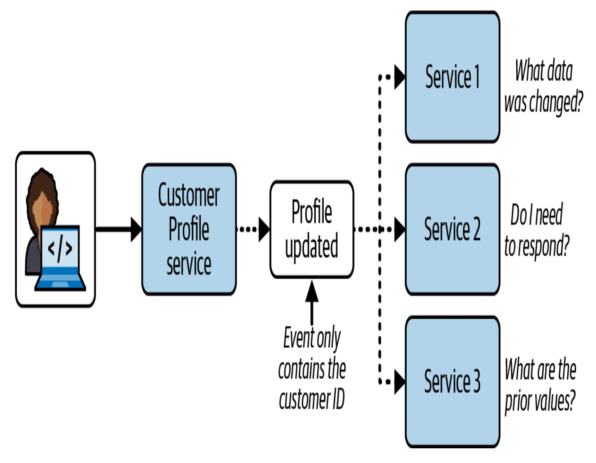

Abbildung 15-13. Einem anämischen Ereignis fehlt genügend Kontext, um das Ereignis zu verarbeiten

Um blutleere Ereignisse wie dieses zu vermeiden, solltest du sowohl die aktualisierten Kundeninformationen *als auch die früheren Werte* einbeziehen, da die meisten Datenbanken dieseInformationen normalerweise nicht wiedergeben.

Dies ist ein Beispiel für das *Spektrum* der Granularität von Ereignis-Nutzdaten. Auf der äußersten linken Seite des Spektrums befinden sich schlüsselbasierte Ereignis-Payloads, bei denen nur der Schlüssel im Ereignis enthalten ist. Das ist zwar gut, wenn du eine Bestellung erstellst oder löschst, funktioniert aber nicht gut, wenn ein Kunde eine Bestellung aktualisiert. Auf der anderen Seite des Spektrums stehen die datenbasierten Ereignis-Payloads, bei denen *alle* Daten enthalten sind, egal ob sie benötigt werden oder nicht. Hier zeigt die Stempelkopplung ihr hässliches Gesicht. Das Szenario mit der Aktualisierung des Kundenprofils liegt irgendwo zwischen diesen beiden Extremen, weil es die richtige Menge an Informationen liefert und so das Problem der blutarmen abgeleiteten Ereignisse vermeidet.

## <span id="page-44-0"></span>**Das Mückenschwarm-Antipattern**

Im Zusammenhang mit anämischen Ereignissen gibt es ein Antipattern, das als *Mückenschwarm* bekannt ist. Du kennst Mücken wahrscheinlich als sehr kleine, lästige fliegende Insekten, die um deinen Kopf herumschwirren und dich an einem schönen sonnigen Tag so sehr stören, dass du wieder ins Haus gehen musst. Während es bei anämischen Ereignissen um die Granularität der *Nutzlast* eines Ereignisses geht, befasst sich das Antipattern Swarm of Gnats mit der Granularität der ausgelösten Ereignisse *selbst* und damit, wie viele abgeleitete Ereignisse von einem Ereignisprozessor ausgelöst werden. Wenn ein Architekt zu viele abgeleitete Ereignisse von einem einzigen Ereignisprozessor auslöst, besteht die Gefahr, dass er in den Schwarm der Mücken gerät.

Betrachte das Beispiel der Kreditkartenzahlung in [Abbildung](#page-46-0) 15-14, bei dem ein Kunde eine Bestellung aufgibt und seine Kreditkarte belastet wird, um sie zu bezahlen. Wenn die Kreditkarte belastet wird, löst der

Payment Ereignisprozessor ein payment applied Ereignis aus, und (glücklicherweise) hört der Fraud Detection Ereignisprozessor darauf. Dieser Ereignisprozessor analysiert jede Abbuchung, um festzustellen, ob sie rechtmäßig oder betrügerisch ist. In jedem Fall löst der Fraud Detection Ereignisprozessor ein von fraud\_checked abgeleitetes Ereignis aus, das das Ergebnis der Betrugsprüfung in seinem Ereignis-Payload enthält.

<span id="page-46-0"></span>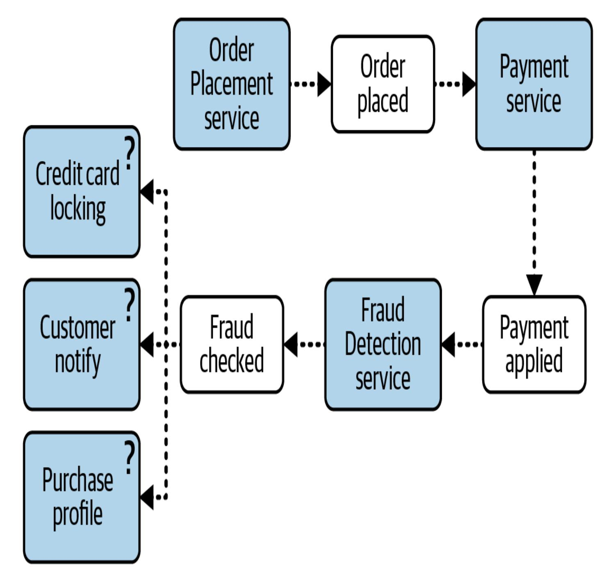

Abbildung 15-14. Ein Beispiel für ein Ereignis, das zu grobkörnig ist

Drei Ereignisverarbeiter interessieren sich für das Ergebnis der Kreditkartenbetrugsprüfung:

Wenn ein Betrug festgestellt wird, sperrt der Credit Card Locking Ereignisprozessor die Kreditkarte des Kunden, um weitere Belastungen zu verhindern.

- Der Customer Notify Ereignisprozessor benachrichtigt den Kunden über einen möglichen Betrug.
- Wenn *kein* Betrug festgestellt wird, aktualisiert der Purchase Profile Ereignisprozessor seineAlgorithmen.

Wenn ein einzelnes fraud\_checked abgeleitetes Ereignis ausgelöst wird, müssen leider *alle* diese Ereignisprozessoren auf das Ereignis reagieren, die Nutzdaten auf das Ergebnis prüfen und entscheiden, ob sie Maßnahmen ergreifen sollen. Da dieses abgeleitete Ereignis zu grobkörnig ist, müssen alle Ereignisverarbeiter eine zusätzliche Verarbeitung durchführen: Sie müssen die Nutzdaten des einzelnen abgeleiteten Ereignisses analysieren, um zu entscheiden, ob sie Maßnahmen ergreifen sollen. Wenn kein Betrug aufgedeckt wurde, ist dies eine Verschwendung von Bandbreite und Rechenleistung, da nur der Ereignisprozessor Purchase Profile eine Maßnahme ergreifen muss.

Ein viel effizienterer Ansatz wäre es, *zwei* getrennte abgeleitete Ereignisse ( fraud\_detected und no\_fraud\_detected ) auszulösen, wie in [Abbildung](#page-48-0) 15-15 dargestellt. In diesem Fall liefern die abgeleiteten Ereignisse, die vom Ereignisprozessor Fraud Detection ausgelöst werden, einen Kontext *außerhalb* der Nutzdaten des Ereignisses, so dass jeder Ereignisprozessor entscheiden kann, ob er reagieren will, ohne die internen Nutzdaten des Ereignisses analysieren zu müssen.

<span id="page-48-0"></span>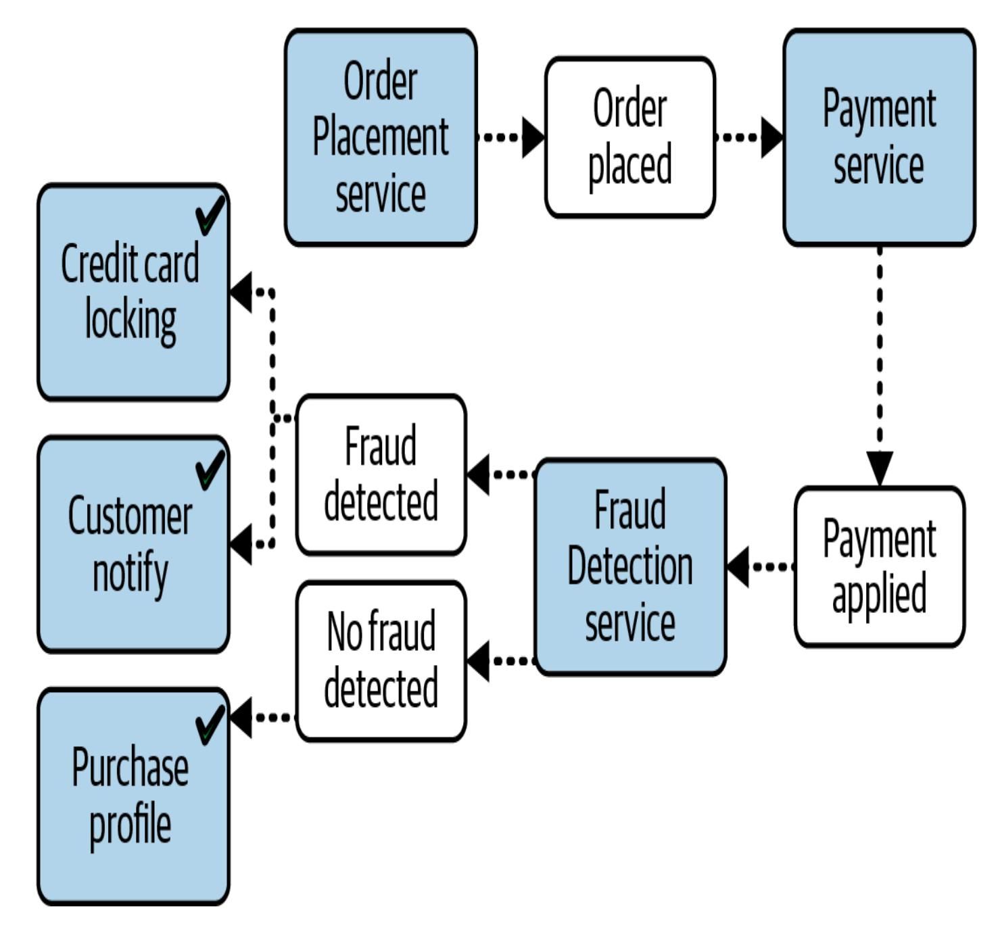

Abbildung 15-15. Das Auslösen mehrerer Ereignisse ermöglicht eine effizientere Verarbeitung und Entscheidungsfindung

In diesem Beispiel ermöglicht das Auslösen mehrerer abgeleiteter Ereignisse für jedes Ergebnis einen besseren Ereignisfluss, weniger Abwanderung und eine effizientere Verarbeitung. Wenn du jedoch *zu viele* abgeleitete Ereignisse auslöst, führt das zu einem *Schwarm von Mücken*.

Das in [Abbildung](#page-49-0) 15-16 gezeigte Szenario veranschaulicht, wie dieses Muster auftreten kann. Ein Kunde ist kürzlich umgezogen und muss sein Benutzerprofil auf der Website ändern, um die Rechnungsadresse seiner Kreditkarte, die Lieferadresse (wohin die Bestellungen geliefert werden) und die Telefonnummer von seinem alten Festnetztelefon auf sein Handy zu ändern. Wenn der Kunde auf die Schaltfläche "Absenden" für diese Profiländerungen klickt, empfängt der Customer Profile Ereignisprozessor die Aktualisierungsanfrage, aktualisiert die Datenbank und löst für jede Aktualisierung ein separates Ereignis aus, das die notwendigen Informationen für die weitere Verarbeitung enthält.

<span id="page-49-0"></span>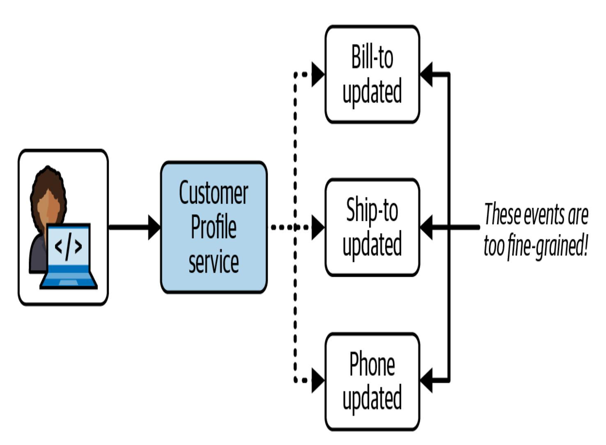

Abbildung 15-16. Das Auslösen von zu vielen feinkörnigen abgeleiteten Ereignissen ist als "Swarm of Gnats"-Antipattern bekannt

Das Problem bei der Auslösung von zu vielen detaillierten Ereignissen ist, dass das System mit abgeleiteten Ereignissen gesättigt und überwältigt werden kann, die sich alle auf dieselbe Sache beziehen: Der Kunde hat sein Benutzerprofil aktualisiert. Dieses Verhaltensmuster führt außerdem dazu, dass zahlreiche kleine abgeleitete Ereignisse von anderen Ereignisverarbeitern erzeugt werden, so dass es für alle schwer wird, die gesamten Ereignisflüsse des Systems zu verstehen.

Um dieses Muster zu vermeiden, könnte der Architekt jede einzelne Profilaktualisierung in einem einzigen profile\_updated abgeleiteten Ereignis für die gesamte Aktion bündeln, das die Vorher- und Nachher-Daten aller aktualisierten Felder enthält. Dieser effizientere Ansatz ist in [Abbildung](#page-50-0) 15-17 dargestellt.

<span id="page-50-0"></span>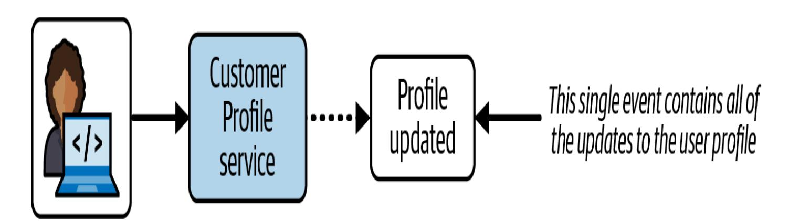

Abbildung 15-17. Die Kombination einzelner Zustandsänderungen in einem einzigen abgeleiteten Ereignis vermeidet das Antipattern des Mückenschwarms

Die richtige Granularität für abgeleitete Ereignisse zu bestimmen, kann ziemlich schwierig sein. Wir empfehlen, sich auf das *Ergebnis* der Verarbeitung oder der Zustandsänderung zu konzentrieren, um den Schwarm von Mücken zu vermeiden und den Ereignisfluss zu vereinfachen.

## <span id="page-51-0"></span>**Fehlerbehandlung**

Das Workflow-Ereignismuster der reaktiven Architektur ist eine Möglichkeit, die Fehlerbehandlung in einem asynchronen Workflow zu regeln. Dieses Muster ist sowohl auf Ausfallsicherheit als auch auf Reaktionsfähigkeit ausgerichtet, da es dem System erlaubt, asynchrone Fehler zu behandeln, ohne seine Reaktionsfähigkeit zu beeinträchtigen.

Das Workflow-Ereignismuster nutzt Delegation, Containment und Reparatur durch die Verwendung eines *Workflow-Delegaten*, wie in [Abbildung](#page-53-0) 15-18 dargestellt. Bei diesem Muster leitet ein Ereignisprozessor Daten asynchron über einen Nachrichtenkanal an den Ereignisverbraucher weiter. Tritt bei der Verarbeitung der Daten ein Fehler auf, delegiert der Ereignisverbraucher diesen Fehler sofort an den Dienst Workflow Processor und geht zur nächsten Nachricht in der Ereigniswarteschlange über. Auf diese Weise wird die nächste Nachricht sofort verarbeitet, so dass die Reaktionsfähigkeit insgesamt gleich bleibt. Wenn der Ereigniskonsument Zeit damit verbringen würde, den Fehler zu finden, würde er die nächste Nachricht in der Warteschlange nicht verarbeiten - und damit nicht nur die nächste Nachricht, sondern auch alle anderen Nachrichten in der Warteschlange verzögern.

Wenn der Dienst Workflow Processor einen Fehler erhält, versucht er herauszufinden, was mit der Nachricht nicht stimmt. Vielleicht liegt ein statischer, deterministischer Fehler vor? Er könnte die Nachricht mit Hilfe von Algorithmen des maschinellen Lernens oder der Künstlichen Intelligenz analysieren, um nach einer Anomalie in den Daten zu

suchen. In jedem Fall nimmt der Workflow-Prozessor *programmgesteuert* (d. h. ohne menschliches Zutun) Änderungen an den ursprünglichen Daten vor, um sie zu reparieren, und sendet sie dann zurück an die ursprüngliche Warteschlange. Der Ereignisverbraucher sieht diese aktualisierte Nachricht als eine neue und versucht, sie erneut zu verarbeiten, diesmal hoffentlich mit mehr Erfolg.

Natürlich kann der Workflow-Prozessor nicht immer feststellen, was mit der Nachricht nicht stimmt. In diesen Fällen schickt er die Nachricht an eine andere Warteschlange, die dann von einem Dashboard auf dem Desktop einer sachkundigen Person empfangen wird. Diese Person sieht sich die Nachricht an, nimmt manuelle Korrekturen vor und sendet sie dann erneut an die ursprüngliche Warteschlange (in der Regel über eine Reply-to Message Header Variable).

<span id="page-53-0"></span>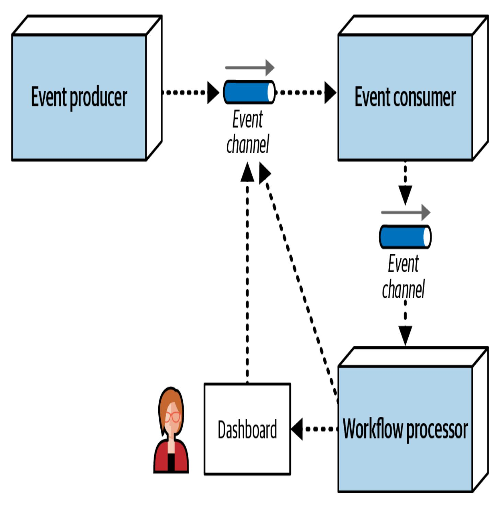

Abbildung 15-18. Das Workflow-Ereignismuster der reaktiven Architektur

Angenommen, ein Handelsberater in einem Teil des Landes nimmt im Auftrag eines großen Handelsunternehmens in einem anderen Teil des Landes *Handelsaufträge* entgegen (Anweisungen, welche Aktien in welcher Menge gekauft werden sollen). Der Berater fasst die Handelsaufträge in einem so genannten *Korb* zusammen und sendet sie asynchron an einen Broker im anderen Teil des Landes, der dann die Aktie kauft. Um das Beispiel zu vereinfachen, nehmen wir an, dass der Vertrag für die Handelsanweisungen die folgenden Bedingungen erfüllen muss:

```
ACCOUNT(String),SIDE(String),SYMBOL(String),SHARES(Long)
```

Angenommen, das große Handelsunternehmen erhält vom Handelsberater den folgenden Korb mit Handelsaufträgen für Apple (AAPL):

```
12654A87FR4,BUY,AAPL,1254
87R54E3068U,BUY,AAPL,3122
6R4NB7609JJ,BUY,AAPL,5433
2WE35HF6DHF,BUY,AAPL,8756 SHARES
764980974R2,BUY,AAPL,1211
1533G658HD8,BUY,AAPL,2654
```

Die vierte Handelsanweisung ( 2WE35HF6DHF,BUY,AAPL,8756 SHARES ) hat das Wort SHARES nach der Anzahl der Aktien für den Handel. Wenn die Primärfirma diese asynchronen Handelsaufträge ohne Fehlerbehandlungsfunktionen verarbeitet, tritt folgender Fehler innerhalb des Dienstes TradePlacement auf:

```
Exception in thread "main" java.lang.NumberFormatException:
        For input string: "8756 SHARES"
        at java.lang.NumberFormatException.forInputString
        (NumberFormatException.java:65)
```

```
at java.lang.Long.parseLong(Long.java:589)
at java.lang.Long.<init>(Long.java:965)
at trading.TradePlacement.execute(TradePlacement.java
at trading.TradePlacement.main(TradePlacement.java:29
```

Wenn diese Ausnahme auftritt, gibt es, da es sich um eine asynchrone Anfrage handelt, keinen Benutzer, der synchron reagieren und den Fehler beheben kann. Der Dienst TradePlacement kann nichts tun, außer möglicherweise den Fehlerzustand zu protokollieren.

Durch die Anwendung des Workflow-Ereignismusters kann dieser Fehler programmatisch behoben werden. Da die Primärfirma keine Kontrolle über den Trading Advisor oder die von ihm gesendeten Handelsauftragsdaten hat, muss sie reagieren und den Fehler selbst beheben (siehe [Abbildung](#page-57-0) 15-19). Wenn derselbe Fehler auftritt ( 2WE35HF6DHF,BUY,AAPL,8756 SHARES ), delegiert der Dienst TradePlacement den Fehler sofort über asynchrones Messaging an den Dienst Trade Placement Error zur Fehlerbehandlung und gibt ihm die Fehlerinformationen über die Ausnahme mit:

```
Trade Placed: 12654A87FR4,BUY,AAPL,1254
Trade Placed: 87R54E3068U,BUY,AAPL,3122
Trade Placed: 6R4NB7609JJ,BUY,AAPL,5433
Error Placing Trade: "2WE35HF6DHF,BUY,AAPL,8756 SHARES"
Sending to trade error processor <-- delegate the error fixin
Trade Placed: 764980974R2,BUY,AAPL,1211
...
```

Der Dienst Trade Placement Error , der als Delegierter des Workflows fungiert, empfängt den Fehler und prüft die Ausnahme. Er stellt fest, dass das Problem mit dem Wort SHARES im Feld "Anzahl der Anteile" zusammenhängt. Der Dienst Trade Placement Error entfernt das Wort SHARES und sendet den Handel zur erneuten Bearbeitung zurück:

```
Received Trade Order Error: 2WE35HF6DHF,BUY,AAPL,8756 SHARES
Trade fixed: 2WE35HF6DHF,BUY,AAPL,8756
Resubmitting Trade For Re-Processing
```

Der Dienst TradePlacement kann nun den festen Handel erfolgreich abwickeln:

```
...
trade placed: 1533G658HD8,BUY,AAPL,2654
trade placed: 2WE35HF6DHF,BUY,AAPL,8756 <-- this was the orig
```

<span id="page-57-0"></span>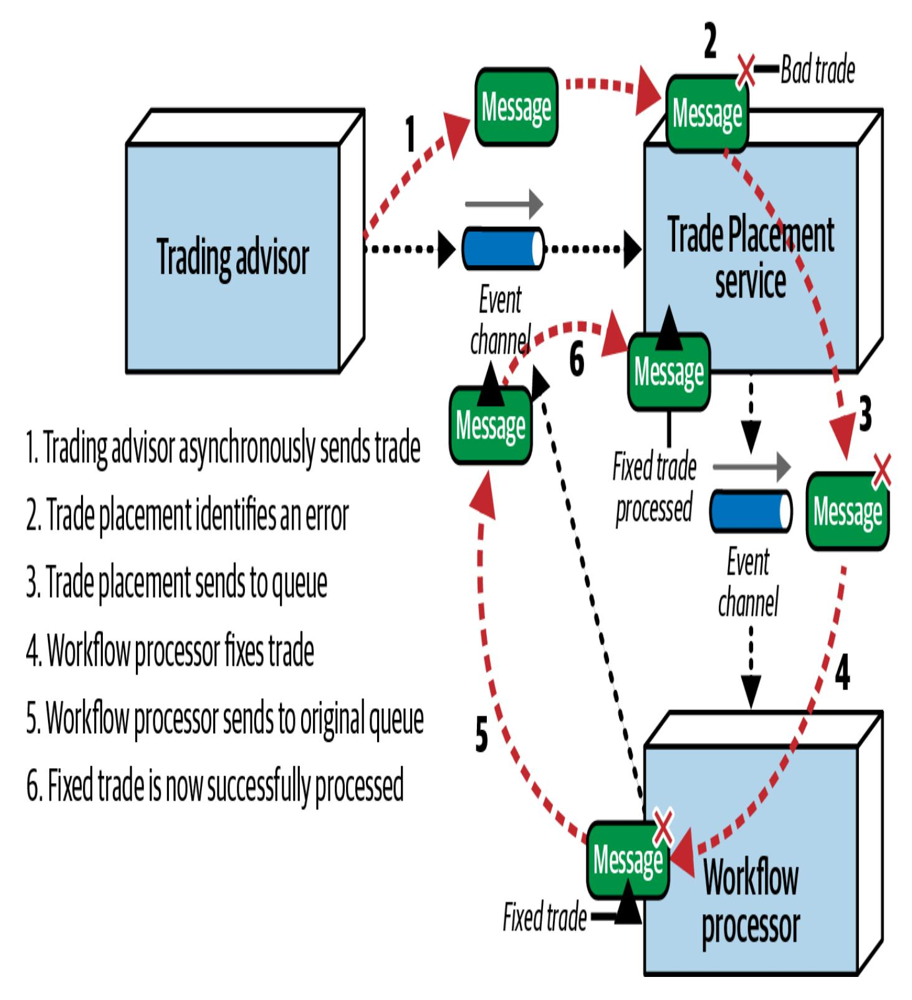

Abbildung 15-19. Fehlerbehandlung mit dem Workflow-Ereignismuster

Eine Folge der Verwendung des Workflow-Ereignismusters ist, dass Nachrichten, die an einen Workflow-Prozessor gesendet und dann erneut übermittelt werden, nicht in der richtigen Reihenfolge

verarbeitet werden. In unserem Handelsbeispiel spielt die Reihenfolge der Nachrichten eine Rolle, da alle Geschäfte innerhalb eines bestimmten Kontos in der richtigen Reihenfolge verarbeitet werden müssen (z. B. muss eine SELL für IBM vor einer BUY für AAPL innerhalb desselben Brokerage-Kontos erfolgen). Es wäre zwar kompliziert, aber nicht unmöglich, die Reihenfolge der Nachrichten innerhalb eines bestimmten Kontexts (in diesem Fall die Nummer des Maklerkontos) beizubehalten. Eine Möglichkeit, dieses Problem zu lösen, besteht darin, dass der Dienst TradePlacement die Maklerkontonummer des fehlerhaften Geschäfts in eine Warteschlange stellt und speichert. Alle Geschäfte mit der gleichen Kontonummer werden in einer temporären Warteschlange für eine spätere Bearbeitung gespeichert (in der Reihenfolge "first-in, first-out", oder FIFO). Sobald der fehlerhafte Abschluss korrigiert und bearbeitet wurde, baut der Dienst TradePlacement die Warteschlange der verbleibenden Abschlüsse für dasselbe Konto ab und bearbeitet sie der Reihe nach.

## **Verhinderung von Datenverlust**

Architekten, die sich mit asynchroner Kommunikation befassen, sind immer mit *Datenverlusten* konfrontiert: wenn ein Ereignis oder eine Nachricht verloren geht oder nie sein Ziel erreicht. Zum Glück gibt es grundlegende Techniken, um Datenverluste zu verhindern.

Architekten können Ereigniskanäle auf verschiedene Weise implementieren. Die meisten ereignisgesteuerten Architekturen verwenden das [Advanced](https://oreil.ly/X3Dl7) Message Queuing Protocol (AMQP), um Ereignisse auszulösen und darauf zu reagieren. Beispiele für AMQP-Broker sind Amazon SNS (Simple [Notification](https://aws.amazon.com/pm/sns) Service), [RabbitMQ,](https://oreil.ly/XLNKs) [Solace](https://solace.com/) und [Azure](https://oreil.ly/b2Lzw) Event Hubs. Mit AMQP werden Ereignisse an einen Austausch veröffentlicht. Der Austausch nutzt die Bindungsregeln, die von den konsumierenden Ereignisverarbeitern festgelegt wurden, um das Ereignis an eine Warteschlange für jeden Ereignisverarbeiter weiterzuleiten, der dieses Ereignis abonniert hat. AMQP-Broker können auch das sogenannte *Event Forwarding-Pattern* nutzen, um Datenverluste zu verhindern, eine Technik, die wir in diesem Abschnitt beschreiben.

Eine weitere [Implementierung](https://oreil.ly/YdBvG) des Ereigniskanals ist die Jakarta Messaging API (ehemals Java Message Service oder JMS), die *Topics* anstelle des zweistufigen Weiterleitungsprozesses von Warteschlangen verwendet. Nichtsdestotrotz kann Jakarta Messaging das Muster der *Ereignisweiterleitung* nutzen, um Datenverluste zu verhindern, vorausgesetzt, die Ereignisprozessoren, die auf ein Ereignis reagieren, sind als dauerhafte Abonnenten konfiguriert. Ein *dauerhafter Teilnehmer* ist ein Teilnehmer, der garantiert ein Ereignis erhält. Wenn der Ereignisprozessor ausfällt oder aus anderen Gründen nicht verfügbar ist, speichert das JMS-Thema das Ereignis, bis der abonnierende Ereignisprozessor wieder verfügbar ist.

Eine weitere mögliche Implementierung des Event-Kanals ist das Event-Streaming mit [Kafka](https://kafka.apache.org/) als *Event-Broker* (das Softwareprodukt, das die Warteschlangen und Themen enthält). Die Techniken zur Vermeidung von Datenverlusten beim Event-Streaming unterscheiden sich stark von denen, die für das in diesem Abschnitt beschriebene Event-Forwarding-Muster verwendet werden. Auf der [Kafka-Website](https://kafka.apache.org/) findest du weitere Informationen zur Vermeidung von Datenverlusten bei der Verwendung dieser Art von Streaming-Event-Broker.

Betrachten wir ein typisches Szenario, in dem der Ereignisprozessor A asynchron ein Ereignis an einen Message Broker veröffentlicht, das schließlich an eine AMQP-Warteschlange oder ein JMS-Topic weitergeleitet wird. Der Ereignisprozessor B antwortet auf das Ereignis und fügt die Daten aus der Nutzlast in eine Datenbank ein. Wie in [Abbildung](#page-61-0) 15-20 dargestellt, kann es in diesem Szenario auf drei Arten zu Datenverlusten kommen:

- 1. Während der Ereignisprozessor A das Ereignis veröffentlicht, stürzt er ab, bevor eine Bestätigung vom Ereignisbroker gesendet werden kann; alternativ sendet der Ereignisbroker eine Bestätigung an den Ereignisprozessor A , stürzt dann aber ab, bevor das Ereignis von einem anderen Ereignisprozessor angenommen wird.
- 2. Der Ereignisprozessor B nimmt das Ereignis aus der Warteschlange an, stürzt aber ab, bevor er das Ereignis verarbeiten kann.
- 3. Der Ereignisprozessor B ist aufgrund eines Datenfehlers nicht in der Lage, die Meldung in der Datenbank zu speichern.

Jeder dieser Bereiche, in denen es zu Datenverlusten kommen kann, kann durch das *Ereignisweiterleitungsmuster* entschärft werden.

<span id="page-61-0"></span>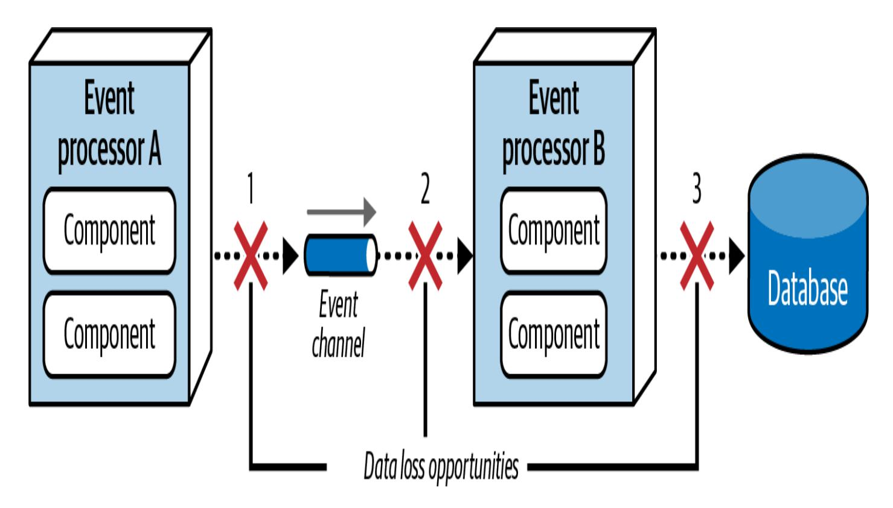

Abbildung 15-20. Orte, an denen Datenverluste in einer ereignisgesteuerten Architektur auftreten können

Im ersten Fall landet das Ereignis nie in der Warteschlange oder der Broker schlägt fehl, bevor das Ereignis gelesen wird. Um dies zu vermeiden, solltest du persistente Warteschlangen und synchrones Senden verwenden. Persistente Warteschlangen ermöglichen *eine garantierte Zustellung*: Wenn der Event Broker das Ereignis erhält, speichert er es nicht nur im Speicher, um es schnell abrufen zu können, sondern speichert es auch in einem physischen Datenspeicher (z. B. in einem Dateisystem oder einer Datenbank). Wenn der Event Broker ausfällt, wird das Ereignis physisch auf der Festplatte gespeichert, so dass es immer noch zur Verarbeitung zur Verfügung steht, wenn der Event Broker wieder anspringt. *Beim synchronen Senden* wird der Ereignisprozessor blockiert, so dass er das Ereignis erst dann auslöst, wenn der Broker bestätigt, dass er das Ereignis in der Datenbank

gespeichert hat. Diese beiden grundlegenden Techniken verhindern Datenverluste zwischen dem Ereignisproduzenten und der Warteschlange, da sich das Ereignis entweder noch beim Ereignisproduzenten befindet oder in der Warteschlange persistiert.

Eine grundlegende Messaging-Technik namens *Client-Acknowledge-Modus* kann das zweite Problem lösen, bei dem der Ereignisprozessor B das nächste verfügbare Ereignis aus der Warteschlange nimmt und abstürzt, bevor er das Ereignis verarbeiten kann. Wenn ein Ereignis aus einer Warteschlange gelesen wird, wird es standardmäßig sofort aus der Warteschlange entfernt (dies wird als *Auto-Acknowledge-Modus* bezeichnet). Im Client-Acknowledge-Modus bleibt das Ereignis in der Warteschlange und wird mit der Client-ID versehen, damit kein anderer Verbraucher das Ereignis lesen oder verarbeiten kann. Wenn der Ereignisprozessor B abstürzt, bleibt das Ereignis in der Warteschlange erhalten, so dass ein Verlust der Nachricht verhindert wird.

Das dritte Problem, bei dem der Ereignisprozessor B aufgrund eines Datenfehlers nicht in der Lage ist, das Ereignis in der Datenbank zu speichern, kann mit ACID-Transaktionen über einen Datenbank-Commit gelöst werden. Sobald der Ereignisprozessor einen Datenbank-Commit ausführt, ist gewährleistet, dass die Daten in der Datenbank persistiert werden. Die*Unterstützung des letzten Teilnehmers* (LPS) entfernt das Ereignis aus der persistierten Warteschlange, indem sie bestätigt, dass alle Verarbeitungen abgeschlossen sind und das Ereignis persistiert wurde. Dies garantiert, dass das Ereignis auf dem Weg vom

Ereignisprozessor A zur Datenbank nicht verloren gegangen ist. Diese Techniken sind in [Abbildung](#page-63-1) 15-21 dargestellt.

<span id="page-63-1"></span>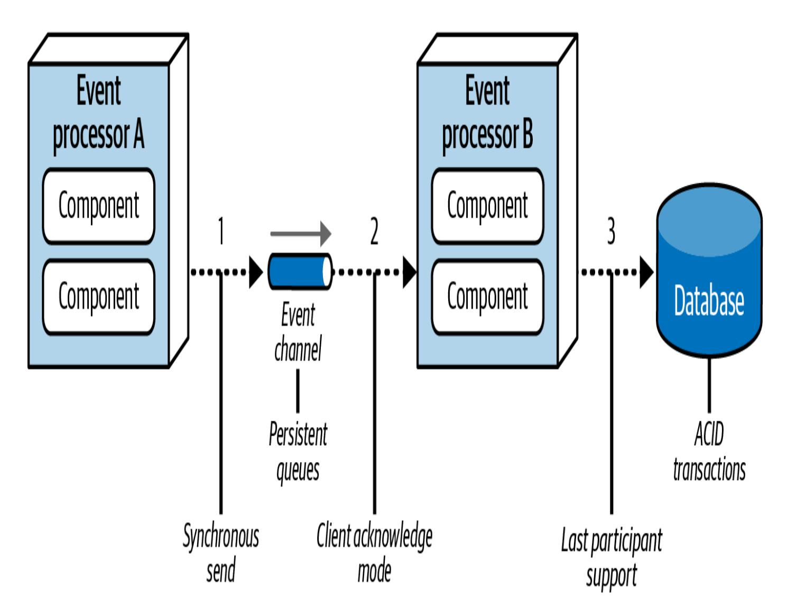

Abbildung 15-21. Verhinderung von Datenverlusten in einer ereignisgesteuerten Architektur

## <span id="page-63-0"></span>**Request-Reply-Verarbeitung**

Bisher haben wir uns in diesem Kapitel mit asynchronen Anfragen beschäftigt, die keine sofortige Antwort vom Ereignisverbraucher benötigen. Aber was ist mit Ereignisverarbeitern, die sofortige Informationen von einem anderen Ereignisverarbeiter benötigen - zum Beispiel, wenn sie auf eine Art Bestätigungs-ID oder eine Bestätigung

warten, bevor sie ein Ereignis auslösen? In diesem Fall ist eine synchrone Kommunikation erforderlich, um die Anfrage abzuschließen.

In der EDA wird die synchrone Kommunikation in der Regel durch *Anfrage-Antwort-Nachrichten* (manchmal auch als *pseudosynchrone Kommunikation* bezeichnet) erreicht. Jeder Ereigniskanal innerhalb der Anfrage-Antwort-Kommunikation besteht aus zwei Warteschlangen: einer *Anfrage-Warteschlange* und einer *Antwort-Warteschlange*. Der Nachrichtenproduzent, der die erste Anfrage nach Informationen stellt, sendet asynchron Daten an die Anfragewarteschlange und gibt dann die Kontrolle an den Nachrichtenproduzenten zurück. Der Nachrichtenproduzent führt dann weitere Verarbeitungen durch und wartet schließlich in der Antwort-Warteschlange auf die Antwort. Der Nachrichtenkonsument empfängt und verarbeitet die Nachricht und sendet dann die Antwort an die Antwort-Warteschlange. Der Event Producer empfängt die Nachricht mit den Antwortdaten. Dieser grundlegende Ablauf ist in [Abbildung](#page-65-0) 15-22 dargestellt.

<span id="page-65-0"></span>

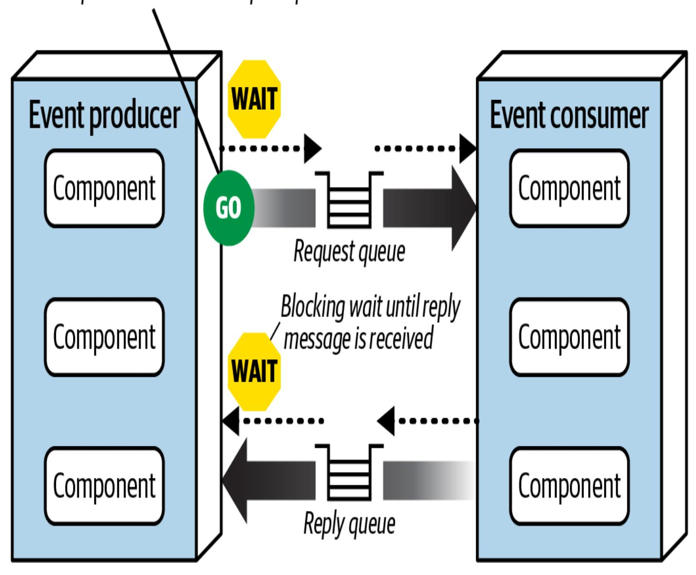

Abbildung 15-22. Verarbeitung von Anfrage-Antwort-Nachrichten

Es gibt zwei Hauptmethoden, um Anfrage-Antwort-Nachrichten zu implementieren. Die erste (und am weitesten verbreitete) Methode besteht darin, ein *Korrelations-ID-Feld* (CID) in den Nachrichtenkopf der Antwortnachricht einzufügen, das in der Regel auf die Nachrichten-ID der ursprünglichen [Anforderungsnachricht](#page-67-0) gesetzt wird (in Abbildung 15-23 einfach ID genannt). Das funktioniert folgendermaßen:

- 1. Der Ereignisproduzent sendet eine Nachricht an die Anforderungswarteschlange und registriert die eindeutige Nachrichten-ID (ID 124). Beachte, dass die CID in diesem Fall null lautet.
- 2. Der Ereignisproduzent wartet mit einem Nachrichtenfilter (auch *Nachrichtenselektor* genannt) blockierend auf die Antwortwarteschlange, wobei die CID im Nachrichtenkopf der ursprünglichen Nachrichten-ID (124) entspricht. In der Antwort-Warteschlange befinden sich zwei Nachrichten: ID 855 mit CID 120 und ID 856 mit CID 122. Keine dieser beiden Nachrichten wird abgeholt, weil keine der beiden Korrelations-IDs mit dem übereinstimmt, wonach der Ereignisverbraucher sucht (CID 124).
- 3. Der Ereignisverbraucher empfängt die Nachricht (ID 124) und bearbeitet die Anfrage.
- 4. Der Ereignisverbraucher erstellt die Antwortnachricht mit der Antwort und setzt die CID im Nachrichtenkopf auf die ursprüngliche Nachrichten-ID (124).
- 5. Der Ereignisverbraucher sendet die neue Nachrichten-ID (857) an die Antwort-Warteschlange.
- 6. Der Ereignisproduzent empfängt die Nachricht, da die CID (124) mit dem Nachrichtenselektor aus Schritt 2 übereinstimmt.

<span id="page-67-0"></span>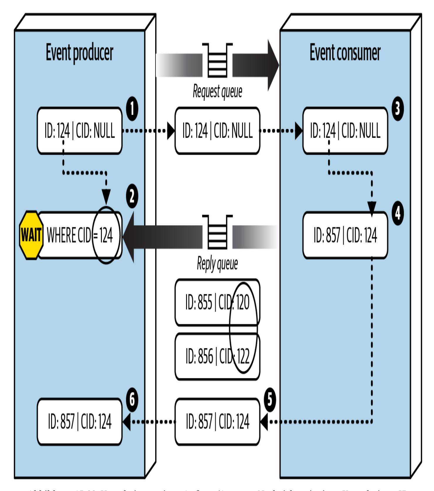

Abbildung 15-23. Verarbeitung einer Anfrage/Antwort-Nachricht mit einer Korrelations-ID

Die andere Möglichkeit, Anfrage-Antwort-Nachrichten zu übermitteln, ist die Verwendung einer *temporären Warteschlange* für die AntwortWarteschlange. Eine temporäre Warteschlange ist einer bestimmten Anfrage gewidmet, wird bei der Anfrage erstellt und bei Beendigung der Anfrage gelöscht. Bei dieser Technik, die in [Abbildung](#page-69-0) 15-24 dargestellt ist, ist keine Korrelations-ID erforderlich, da die temporäre Warteschlange eine dedizierte Warteschlange ist, die nur dem Ereignisproduzenten für diese spezielle Anfrage bekannt ist. Die Technik der temporären Warteschlange funktioniert wie folgt:

- 1. Der Ereignisproduzent erstellt eine temporäre Warteschlange (oder es wird automatisch eine erstellt, je nach Message Broker) und sendet eine Nachricht an die Anforderungswarteschlange, wobei er den Namen der temporären Warteschlange im Reply-to-Header (oder einem anderen vereinbarten benutzerdefinierten Attribut im Message-Header) angibt.
- 2. Der Ereignisproduzent wartet blockierend auf die temporäre Antwort-Warteschlange. Es wird kein Nachrichtenselektor benötigt, da jede Nachricht, die an diese Warteschlange gesendet wird, nur dem Ereignisproduzenten gehört, der die ursprüngliche Nachricht gesendet hat.
- 3. Der Ereignisverbraucher empfängt die Nachricht, verarbeitet die Anfrage und sendet eine Antwortnachricht an die im reply-to-Header genannte Antwortwarteschlange.
- 4. Der Ereignisprozessor empfängt die Nachricht und löscht die temporäre Warteschlange.

<span id="page-69-0"></span>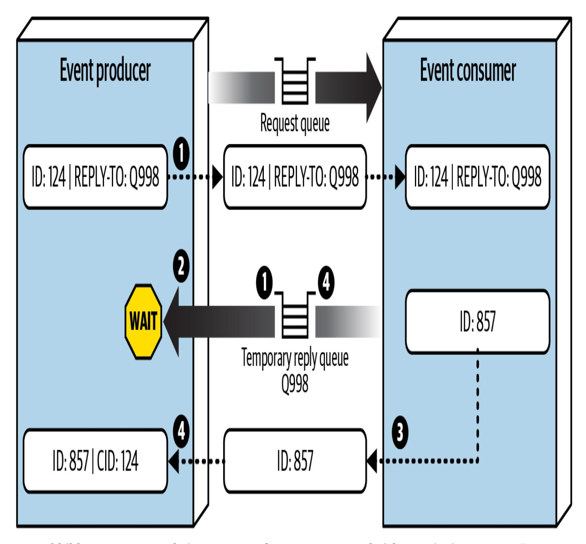

Abbildung 15-24. Verarbeitung von Anfrage-Antwort-Nachrichten mit einer temporären Warteschlange

Die Technik der temporären Warteschlange ist zwar viel einfacher, aber der Message Broker muss für jede Anfrage eine temporäre Warteschlange erstellen und sie dann sofort löschen. Dies kann den Broker erheblich verlangsamen und die Gesamtleistung und Reaktionsfähigkeit beeinträchtigen, insbesondere bei großen Nachrichtenmengen und hoher Gleichzeitigkeit. Aus diesem Grund

empfehlen wir normalerweise die Verwendung der Korrelations-ID-Technik.

### <span id="page-70-0"></span>**Mediated Event-Driven Architecture**

Bisher haben wir uns in diesem Kapitel auf die *choreografierte* EDA konzentriert, bei der Ereignisprozessoren Ereignisse über Broadcast-Funktionen auslösen und mehrere Ereignisprozessoren auf das Ereignis reagieren. Es kann jedoch vorkommen, dass ein Architekt mehr Kontrolle über die Verarbeitung eines Ereignisses haben möchte. In diesem Fall kann der Architekt eine *orchestrierte* Form der EDA verwenden, die sogenannte Mediator-Topologie.

Die *Mediator-Topologie* behebt einige der Unzulänglichkeiten der standardmäßigen choreografierten EDA-Topologie, die wir in diesem Kapitel bisher beschrieben haben. Im Mittelpunkt steht ein *Ereignisvermittler*, der den Arbeitsablauf für auslösende Ereignisse, die eine Koordination zwischen mehreren Ereignisverarbeitern erfordern, verwaltet und steuert. Die Architekturkomponenten, aus denen die Mediator-Topologie besteht, sind: ein auslösendes Ereignis, eine Ereigniswarteschlange, ein Ereignisvermittler, Ereigniskanäle und Ereignisprozessoren.

Wichtig ist, dass die vermittelte Topologie in der Regel *Nachrichten* und keine *Ereignisse* verwendet (siehe "Ereignisse statt [Nachrichten"\).](#page-11-0) In der Regel handelt es sich dabei um Befehle (z. B. ship\_order ) und nicht um Ereignisse (z. B. order\_shipped ), die eingetreten sind.

Wie bei der choreografierten Topologie ist es das auslösende Ereignis, das den gesamten Prozess in Gang setzt. In der Mediator-Topologie[\(Abbildung](#page-73-0) 15-25) nimmt jedoch ein Ereignis-Mediator das auslösende Ereignis entgegen. Er kennt nur die Schritte, die zur Verarbeitung des Ereignisses notwendig sind, und erzeugt daher entsprechende abgeleitete Nachrichten und sendet sie an dedizierte Nachrichtenkanäle (normalerweise Warteschlangen) in einer Punkt-zu-Punkt-Verbindung. Die Ereignisprozessoren hören dann die dedizierten Ereigniskanäle ab, verarbeiten die Nachrichten und antworten (normalerweise) dem Mediator, wenn sie ihre Arbeit abgeschlossen haben. Die Ereignisverarbeiter innerhalb der Mediator-Topologie teilen dem Rest des Systems ihre Arbeit nicht durch zusätzliche abgeleitete Nachrichten mit.

Bei den meisten Implementierungen der Mediator-Topologie gibt es mehrere Mediatoren, die in der Regel jeweils mit einem bestimmten Bereich oder einer Gruppe von Ereignissen verbunden sind. Dadurch wird ein Single Point of Failure vermieden, was bei dieser Topologie ein Problem sein kann, und der Gesamtdurchsatz und die Leistung werden erhöht. Ein Kundenvermittler kann zum Beispiel alle kundenbezogenen Ereignisse (wie Neuanmeldungen und Profilaktualisierungen) bearbeiten, während ein Bestellvermittler auftragsbezogene Aktivitäten (wie das Hinzufügen eines Artikels zu einem Warenkorb und das Auschecken) bearbeitet.

Wie die Architekten den Event Mediator implementieren, hängt in der Regel von der Art und Komplexität der Nachrichten ab, die der Event

Mediator verarbeitet. Für Ereignisse, die eine einfache Fehlerbehandlung und Orchestrierung erfordern, sind Mediatoren wie [Apache](https://camel.apache.org/) Camel, [Mule](https://mulesoft.com/) ESB oder Spring [Integration](https://oreil.ly/r2e4r) in der Regel ausreichend. Nachrichtenflüsse und Nachrichtenrouten innerhalb dieser Arten von Mediatoren werden in der Regel in Programmiercode (z. B. Java oder C#) geschrieben, um den Workflow der Ereignisverarbeitung zu steuern.

Wenn der Ereignis-Workflow jedoch viele bedingte Verarbeitungen und mehrere dynamische Pfade mit komplexen Fehlerbehandlungsanweisungen erfordert, wäre ein Mediator wie [Apache](https://ode.apache.org/) ODE oder der Oracle BPEL Process [Manager](https://oreil.ly/jMtta) die bessere Wahl. Diese Mediatoren basieren auf der Business Process Execution Language (BPEL), einer [XML-ähnlichen](https://oreil.ly/Uu-Fo) Struktur, die die Schritte bei der Verarbeitung eines Ereignisses beschreibt. BPEL-Artefakte enthalten auch strukturierte Elemente, die für die Fehlerbehandlung, dieUmleitung, das Multicasting und so weiter verwendet werden. BPEL ist eine mächtige, aber relativ komplexe Sprache, die man lernen muss. Deshalb erstellen Architekten Mediatoren in der Regel mit den GUI-Tools der BPEL-Engine-Suite.

<span id="page-73-0"></span>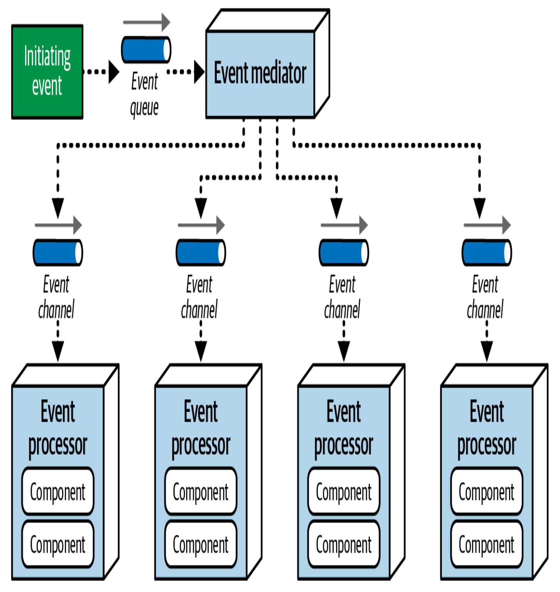

Abbildung 15-25. Mediator-Topologie

BPEL eignet sich gut für komplexe, dynamische Workflows, aber nicht für Ereignis-Workflows mit lang andauernden Transaktionen, die menschliche Eingriffe während des gesamten Prozesses erfordern. Nehmen wir zum Beispiel an, dass ein Handel über ein place\_trade

initiierendes Ereignis platziert wird. Der Ereignisvermittler nimmt dieses Ereignis an, stellt aber während der Verarbeitung fest, dass eine manuelle Genehmigung erforderlich ist, weil der Handel eine bestimmte Anzahl von Aktien überschreitet. Der Ereignisvermittler muss nun die Ereignisverarbeitung stoppen, einen erfahrenen Händler benachrichtigen, um die manuelle Genehmigung einzuholen, und auf diese Genehmigung warten. In diesen Fällen wäre eine Business Process Management (BPM)-Engine, wie z. B. [jBPM,](https://jbpm.org/) besser geeignet als ein Ereignisvermittler.

Bevor du dich für einen Ereignisvermittler entscheidest, ist es wichtig zu wissen, welche Arten von Ereignissen er verarbeiten soll. Für komplexe, lang andauernde Ereignisse, die eine menschliche Interaktion erfordern, wäre Apache Camel extrem schwer zu bedienen und zu warten. Umgekehrt würde die Verwendung einer BPM-Engine für einfache Ereignisabläufe monatelange Arbeit für etwas vergeuden, das Apache Camel in wenigen Tagen erledigen könnte.

Natürlich ist es selten, dass alle Ereignisse genau in eine Komplexitätsklasse passen. Wir empfehlen, Ereignisse als einfach, schwer oder komplex zu klassifizieren und jedes Ereignis durch einen einfachen Mediator wie Apache Camel oder Mule zu schicken. Der einfache Mediator kann das Ereignis selbst bearbeiten oder es an einen anderen, komplexeren Ereignis-Mediator weiterleiten, je nach Komplexitätsklasse. Dieses in [Abbildung](#page-76-0) 15-26 dargestellte Delegationsmodell für Mediatoren stellt sicher, dass alle Arten von

Ereignissen von dem Mediator bearbeitet werden, der sie am effektivsten verarbeiten kann.

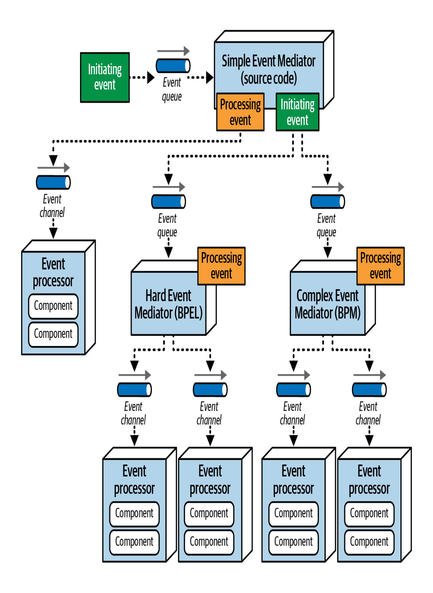

In [Abbildung](#page-76-0) 15-26 siehst du, dass Simple Event Mediator eine abgeleitete Nachricht erzeugt und sendet, wenn der Ereignis-Workflow einfach genug ist, um vollständig vom einfachen Mediator bearbeitet zu werden. Wenn das auslösende Ereignis jedoch als schwer oder komplex eingestuft wird, leitet Simple Event Mediator das ursprüngliche auslösende Ereignis an die entsprechenden Mediatoren (BPEL oder BPM) weiter. Der Simple Event Mediator , der das ursprüngliche Ereignis abgefangen hat, kann immer noch dafür verantwortlich sein, zu wissen, wann das Ereignis abgeschlossen ist, oder er kann einfach den gesamten Arbeitsablauf (einschließlich der Kundenbenachrichtigung) an die anderen Mediatoren delegieren.

Um zu untersuchen, wie die Mediator-Topologie funktioniert, betrachten wir dasselbe System für die Auftragserfassung im Einzelhandel, das wir im Abschnitt über die choreografierte Topologie beschrieben haben, diesmal aber unter Verwendung der Mediator-Topologie. Der Mediator kennt die Schritte, die erforderlich sind, um dieses bestimmte Ereignis zu verarbeiten. Der interne Ereignisfluss der Mediator-Komponente ist in [Abbildung](#page-78-0) 15-27 dargestellt.

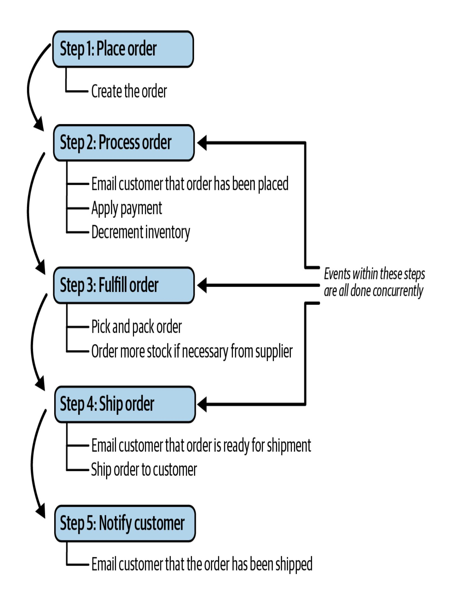

Wie im vorherigen Beispiel wird dasselbe auslösende Ereignis ( place order ) über eine spezielle Warteschlange zur Verarbeitung an den Ereignisvermittler gesendet. Der Mediator Customer nimmt dieses auslösende Ereignis auf und beginnt mit der Erstellung abgeleiteter Nachrichten gemäß dem Ablauf in [Abbildung](#page-78-0) 15-27. Die in den Schritten 2, 3 und 4 dargestellten Ereignisse werden alle gleichzeitig und seriell zwischen den Schritten ausgeführt. Mit anderen Worten: Schritt 3 (Bestellung erfüllen) muss abgeschlossen und bestätigt werden, bevor der Kunde in Schritt 4 (Bestellung versenden) benachrichtigt werden kann, dass die Bestellung versandfertig ist.

Sobald er das auslösende Ereignis erhält, erzeugt der Customer Mediator eine abgeleitete Nachricht create order , die er an die order placement Warteschlange sendet (siehe [Abbildung](#page-80-0) 15-28). Der Order Placement Ereignisprozessor nimmt die Nachricht an, prüft und erstellt die Bestellung und sendet dem Mediator eine Bestätigung und die Bestell-ID. An diesem Punkt kann der Vermittler dem Kunden die Auftragskennung senden und damit anzeigen, dass der Auftrag erteilt wurde. Er kann aber auch fortfahren, bis alle Schritte abgeschlossen sind (dies hängt von den spezifischen Geschäftsregeln für die Auftragserteilung ab).

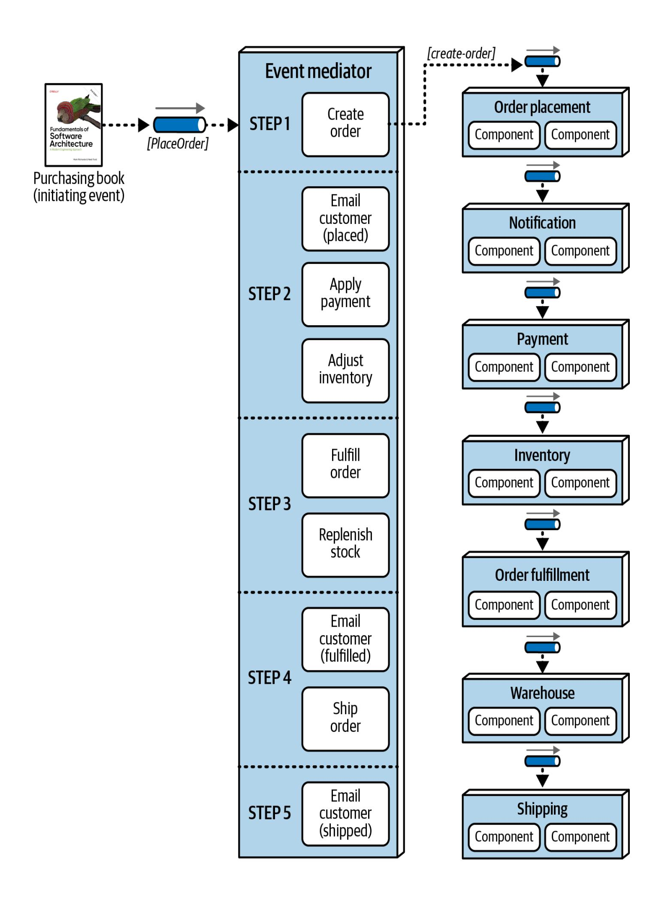

Nachdem Schritt 1 abgeschlossen ist, geht der Mediator zu Schritt 2 über (siehe [Abbildung](#page-82-0) 15-29) und erzeugt gleichzeitig drei abgeleitete Nachrichten: email customer , apply payment und adjust inventory . Er sendet alle drei an ihre jeweiligen Warteschlangen. Alle drei Ereignisprozessoren empfangen diese Nachrichten, führen ihre jeweiligen Aufgaben aus und melden dem Mediator, dass ihre Verarbeitung abgeschlossen ist. Der Vermittler muss warten, bis er die Bestätigung von allen drei parallelen Prozessen erhält, bevor er zu Schritt 3 übergeht. Wenn in einem der parallelen Ereignisprozessoren ein Fehler auftritt, kann der Vermittler korrigierend eingreifen (mehr dazu später in diesem Abschnitt).

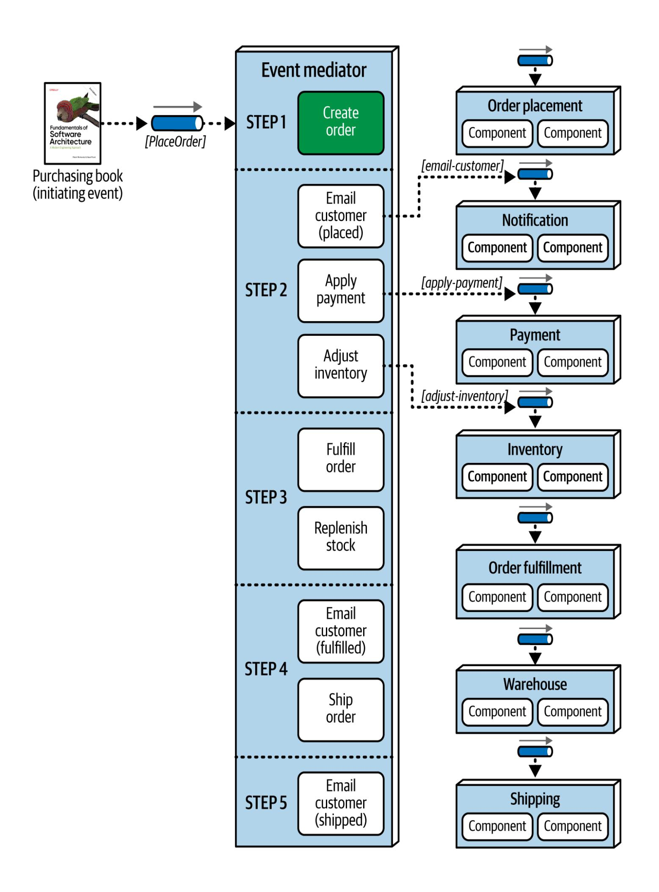

Sobald der Vermittler eine erfolgreiche Bestätigung von allen Ereignisverarbeitern in Schritt 2 erhält, kann er zu Schritt 3 übergehen, um den Auftrag zu erfüllen (siehe [Abbildung](#page-84-0) 15-30). Auch hier können beide Meldungen ( fulfill order und order stock ) gleichzeitig erfolgen. Die Ereignisprozessoren Order Fulfillment und Warehouse nehmen die Nachrichten entgegen, führen ihre Arbeit aus und senden eine Bestätigung an den Mediator zurück.


#### Abbildung 15-30. Schritt 3 des Mediator-Beispiels

Der Mediator geht weiter zu Schritt 4 (siehe [Abbildung](#page-86-0) 15-31), um die Bestellung zu versenden. Dieser Schritt erzeugt zwei abgeleitete Nachrichten: eine ship order Nachricht und eine weitere email customer Nachricht mit spezifischen Informationen darüber, was zu tun ist (dem Kunden mitteilen, dass die Bestellung versandfertig ist).

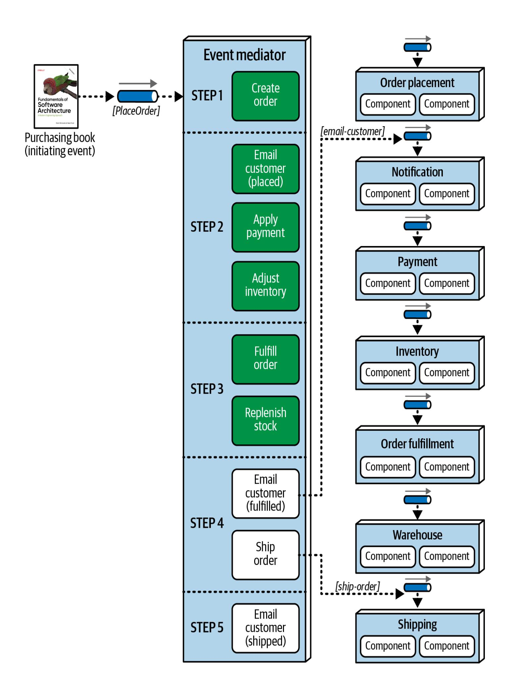

#### Abbildung 15-31. Schritt 4 des Mediator-Beispiels

Schließlich geht der Mediator zu Schritt 5 über (siehe [Abbildung](#page-88-0) 15-32) und erzeugt eine weitere kontextbezogene email customer Nachricht, um den Kunden zu benachrichtigen, dass die Bestellung versandt wurde. Damit ist der Workflow beendet. Der Mediator markiert den Ablauf des auslösenden Ereignisses als abgeschlossen und entfernt alle mit dem auslösenden Ereignis verbundenen Zustände.

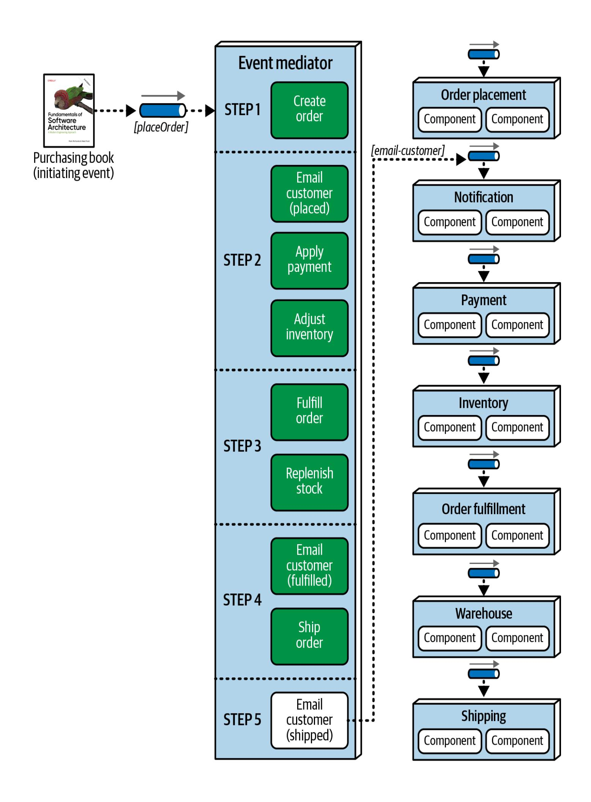

Im Gegensatz zur choreografierten Topologie hat die Mediator-Komponente in dieser Topologie Kenntnis und Kontrolle über den Workflow. Sie kann den Status von Ereignissen aufrechterhalten und Fehlerbehandlung, Wiederherstellbarkeit und Neustartfunktionen verwalten. Nehmen wir in unserem Beispiel an, dass die Zahlung nicht ausgeführt wurde, weil die Kreditkarte abgelaufen ist. Wenn der Mediator diese Fehlerbedingung erhält, weiß er, dass die Bestellung nicht erfüllt werden kann (Schritt 3), bis die Zahlung erfolgt ist. Er stoppt also den Workflow und speichert den Status der Anfrage in seinem eigenen persistenten Datenspeicher. Sobald die Zahlung erfolgt ist, kann der Arbeitsablauf an der Stelle fortgesetzt werden, an der er aufgehört hat (in diesem Fall am Anfang von Schritt 3).

Die Mediator-Topologie löst zwar die Probleme, die mit der choreografierten Topologie verbunden sind, hat aber auch ihre eigenen Nachteile. Zunächst einmal ist es sehr schwierig, die dynamische Verarbeitung, die in einem komplexen Ereignisfluss stattfindet, deklarativ zu modellieren. Viele Workflows in der Mediator-Topologie behandeln daher nur die allgemeine Verarbeitung, verwenden aber ein hybrides Modell, das die Mediator- und die choreografierte Topologie kombiniert, um die Dynamik komplexer Ereignisverarbeitungen, wie z. B. Out-of-Stock-Bedingungen oder andere untypische Fehler, zu berücksichtigen. Obwohl die Ereignisprozessoren genauso skaliert werden können wie die choreografierte Topologie, muss der Mediator ebenfalls skaliert werden, was gelegentlich zu einem Engpass im

gesamten Ereignisverarbeitungsfluss führt. Die Ereignisprozessoren sind in der Mediator-Topologie nicht so stark entkoppelt wie in der choreografierten Topologie. Und schließlich ist die Leistung in dieser Topologie nicht so gut, weil der Mediator die Ereignisverarbeitung kontrolliert.

Der Kompromiss zwischen der choreografierten und der Mediator-Topologie besteht im Wesentlichen darin, die Workflow-Kontrolle und die Fähigkeit zur Fehlerbehandlung gegen hohe Leistung und Skalierbarkeit abzuwägen. Obwohl Leistung und Skalierbarkeit in der Mediator-Topologie immer noch gut sind, sind sie nicht so hoch wie in der choreografierten Topologie.

# <span id="page-90-0"></span>Daten-Topologien

Bei all dem Gerede über Ereignisse und Ereignisverarbeitung vergisst man leicht die Datenseite der EDA. Datenbanktopologien sind ein einzigartiger und interessanter Aspekt dieses Architekturstils. Sie bietet viele Möglichkeiten, die jeweils mit erheblichen Kompromissen verbunden sind, die sich stark auf die Gesamtarchitektur auswirken können. Um die verschiedenen Datenbanktopologien in der EDA zu beschreiben, verwenden wir eine vereinfachte Version des Beispiels in [Abbildung](#page-7-0) 15-3 (siehe [Abbildung](#page-92-0) 15-33).

Wenn ein Kunde eine Bestellung aufgibt, erstellt der Order Placement Ereignisprozessor die Bestellung und löst dann ein order placed Ereignis aus, auf das die beiden Payment und Inventory

Ereignisprozessoren reagieren. Sobald die Zahlung erfolgt ist, hilft der Order Fulfillment Ereignisprozessor dem Auftragspacker, die Bestellung vorzubereiten, und löst dann ein order fulfilled Ereignis aus. Der Shipping -Ereignisprozessor reagiert auf das order fulfilled -Ereignis, indem er die Bestellung an den Kunden versendet, die Bearbeitung abschließt und den Wunsch des Kunden erfüllt.

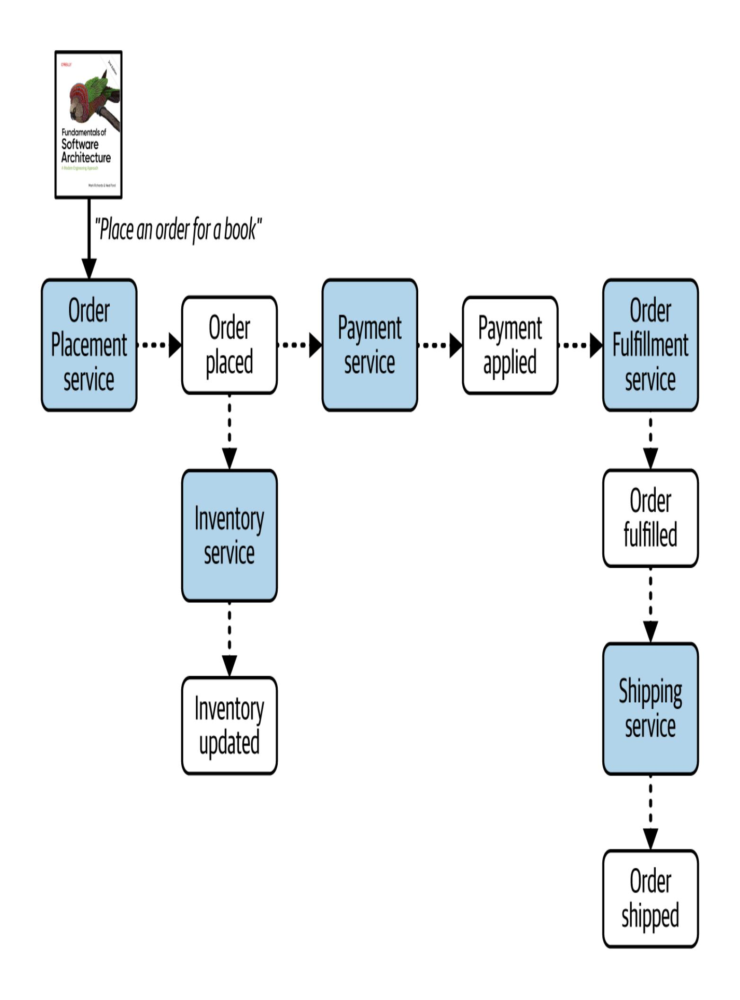

Eine Komplikation der EDA besteht darin, dass der Order Placement Ereignisprozessor zwei Informationen benötigt: wie viele Artikel derzeit auf Lager sind und welche Versandoptionen je nach Standort des Kunden verfügbar sind. Wie er diese Informationen erhält, hängt von der Art der Datenbanktopologie ab, die die Architektur verwendet. Schauen wir uns jede Option der Datenbanktopologie an, um die wichtigsten Kompromisse zu erkennen.

## **Monolithische Datenbanktopologie**

Die erste und vielleicht häufigste Datenbanktopologie, die in der EDA verwendet wird, ist die *einzige monolithische Datenbanktopologie*. Bei dieser Topologie sind alle Daten über eine zentrale Datenbank für alle Ereignisverarbeiter verfügbar.

Der Hauptvorteil der monolithischen Datenbanktopologie besteht darin, dass jeder Ereignisprozessor die von ihm benötigten Daten direkt aus der Datenbank abfragen kann, ohne mit anderen Ereignisprozessoren synchron kommunizieren zu müssen. Das ist ein großer Vorteil, da ereignisgesteuerte Architekturen auf stark entkoppelte Ereignisprozessoren angewiesen sind, die über asynchrone Kommunikation miteinander kommunizieren. In [Abbildung](#page-94-0) 15-34 kann der Ereignisprozessor Order Placement einfach die zentrale monolithische Datenbank abfragen, um die Anzahl der derzeit vorrätigen Artikel und die Versandoptionen des Kunden zu ermitteln.

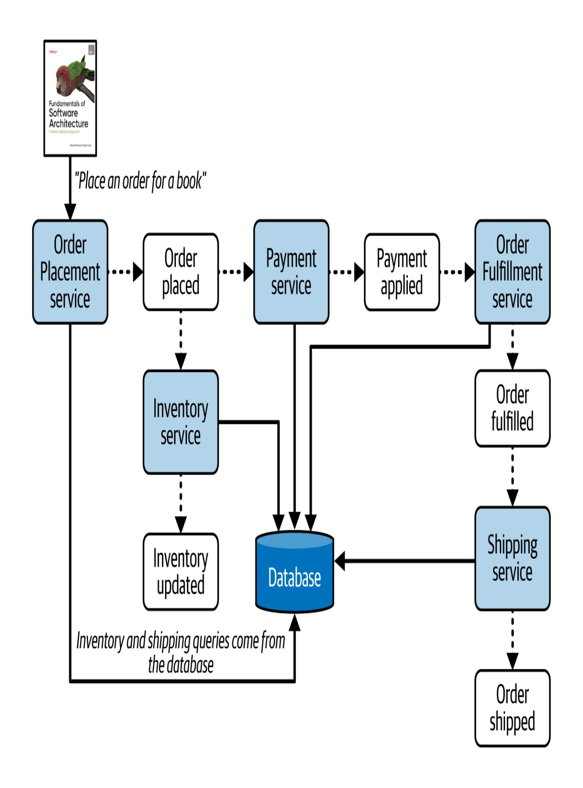

Die monolithische Datenbanktopologie unterstützt zwar die Entkopplung und begrenzt die Kommunikation zwischen den Ereignisverarbeitern, hat aber auch einige unangenehme Nachteile, von denen der erste die Fehlertoleranz ist. Wenn die zentrale monolithische Datenbank abstürzt oder wegen Wartungsarbeiten ausfällt, sind alle Ereignisprozessoren nicht mehr verfügbar.

Der zweite Punkt ist die Skalierbarkeit. Da ereignisgesteuerte Architekturen asynchrone Kommunikation verwenden, kann jeder Ereignisprozessor unabhängig von den anderen skalieren. Der Ereigniskanal fungiert im Wesentlichen als Gegendruckpunkt, sodass einzelne Ereignisprozessoren bei Bedarf skalieren können, unabhängig davon, ob andere Ereignisprozessoren ebenfalls skalieren. Wenn jedoch alle Ereignisprozessoren gleichzeitig dieselbe Datenbank abfragen und in sie schreiben, muss die *Datenbank* skalieren, um diese Anforderungen zu erfüllen. Viele Datenbanken können dies bei hoher Gleichzeitigkeitslast nicht leisten.

Der dritte Punkt ist die Änderungskontrolle. Wenn sich die Struktur der Datenbank ändert (z. B. wenn eine Spalte oder ein Attribut gelöscht wird), sind mehrere Ereignisverarbeiter betroffen und müssen sich koordinieren, selbst bei einer einzigen Datenbankänderung.

Schließlich schafft die monolithische Datenbanktopologie aufgrund der gemeinsamen monolithischen Datenbank zwangsläufig ein einziges

architektonisches Quantum.

### **Topologie der Domänen-Datenbank**

Eine weitere mögliche Datenbanktopologie innerhalb der EDA ist die *Domänendatenbanktopologie*, bei der Ereignisprozessoren in verschiedene Domänen unterteilt werden, die jeweils ihre eigene Datenbank besitzen[\(Abbildung](#page-97-0) 15-35).

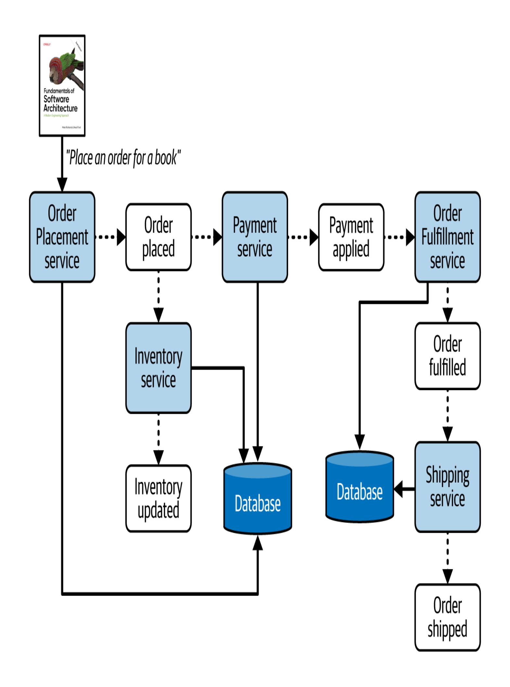

Die Hauptvorteile der Domänen-Datenbanktopologie gegenüber der monolithischen Datenbanktopologie, die sich aus der Domänenpartitionierung ergibt, sind eine bessere Fehlertoleranz, Skalierbarkeit und Änderungskontrolle. In dem in [Abbildung](#page-97-0) 15-35 gezeigten Beispiel ist die Datenbank der Auftragsverarbeitungsdomäne (die Datenbank, die mit den Ereignisprozessoren Order Fulfillment und Order Shipping verbunden ist) zwar abgestürzt oder aufgrund von Wartungsarbeiten nicht mehr verfügbar, die Auftragsvermittlungsdomäne ist jedoch weiterhin voll funktionsfähig und kann weiterhin Aufträge annehmen. Der Ereigniskanal, der das von payment applied abgeleitete Ereignis enthält, fungiert als Staudruckpunkt und stellt die Ereignisse in die Warteschlange, bis die Datenbank für die Auftragsverarbeitung wieder verfügbar ist. Das Gleiche gilt für die Skalierbarkeit und die Änderungskontrolle: Jede Domänendatenbank muss sich nur um die Skalierung auf der Grundlage der domänenspezifischen Ereignisprozessoren kümmern, und nur diese domänenspezifischen Ereignisprozessoren müssen sich ändern, wenn sich die Datenbankstruktur ändert.

Betrachten wir jedoch die beiden Informationen, die der Order Placement Ereignisprozessor benötigt: die Anzahl der derzeit vorrätigen Bücher und die Versandoptionen. Mit der Domänen-Datenbanktopologie kann der Order Placement -Ereignisprozessor einfach seine Domänen-Datenbank abfragen, um den Buchbestand zu erhalten, ähnlich wie er diese Informationen mit der monolithischen Datenbanktopologie

erhalten hat. Allerdings muss er einen *synchronen* Aufruf an den Ereignisprozessor Order Shipping tätigen, um die Versandoptionen abzurufen, wodurch diese Dienste synchron gekoppelt werden (siehe [Abbildung](#page-100-0) 15-36).

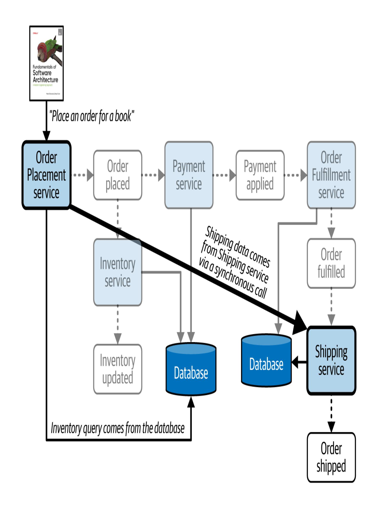

Architekten sollten versuchen, synchrone Kopplung in einer hochdynamischen, entkoppelten Architektur wie der EDA zu vermeiden. Synchrone Aufrufe können sich negativ auf die Fehlertoleranz und Skalierbarkeit auswirken und viele der Vorteile dieser Topologie zunichte machen. Achte immer darauf, dass die Domänen relativ unabhängig voneinander bleiben, und minimiere synchrone Interservice-Aufrufe so weit wie möglich. Wenn zu viel synchrone Kommunikation zwischen den Ereignisprozessoren erforderlich ist, solltest du die Domänengrenzen überdenken, die Domänen zu einer einzigen zusammenfassen oder zu einer monolithischen Datenbanktopologie wechseln.

## **Dedizierte Datentopologie**

Eine weitere praktikable Option innerhalb der EDA ist die *dedizierte Datenbanktopologie*, die in der Welt der Microservices gemeinhin als *Datenbank-per-Service-Muster* bezeichnet wird. Bei dieser Datenbanktopologie besitzt jeder Ereignisprozessor seine eigene dedizierte Datenbank in einem eng umgrenzten Kontext, ähnlich wie bei Microservices (siehe ["Datentopologien"](#page--1-1) in [Kapitel](#page--1-0) 18). Diese Topologie ist in [Abbildung](#page-102-0) 15-37 dargestellt.

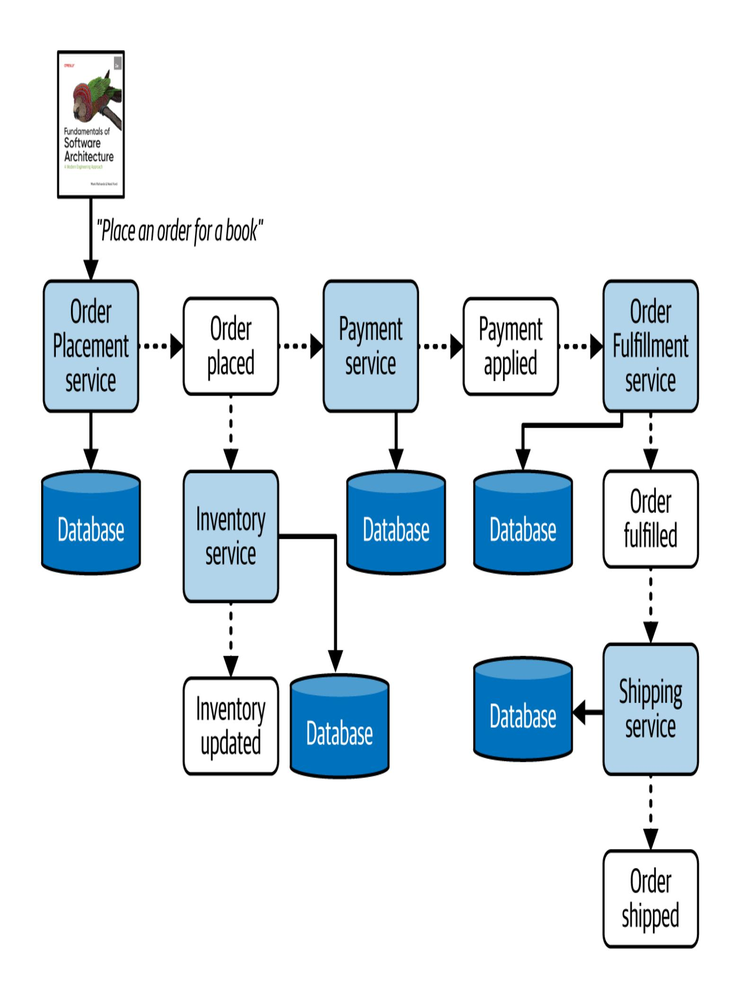

Es überrascht nicht, dass die dedizierte Datenbanktopologie von allen verfügbaren Topologien das höchste Maß an Fehlertoleranz, Skalierbarkeit und Änderungskontrolle aufweist. Wenn ein Ereignisprozessor oder eine Datenbank ausfällt, wird der Ausfall auf diesen Ereignisprozessor beschränkt; alle anderen Ereignisprozessoren funktionieren normal. Die Datenbanken müssen nur auf der Grundlage des einzelnen Ereignisprozessors innerhalb seines begrenzten Kontexts skaliert werden, was diese Topologie zur skalierbarsten der drei in diesem Abschnitt behandelten macht. Schließlich wirken sich Änderungen an der Datenbankstruktur nur auf den Ereignisprozessor aus, der mit dieser Datenbank verbunden ist.

Der Nachteil ist, dass dies je nach Datenbanktechnologie eine sehr teure Option sein kann. Der vielleicht größte Nachteil ist jedoch die synchrone dynamische Kopplung zwischen den Ereignisprozessoren. Um diesen Nachteil zu verdeutlichen, betrachte noch einmal die beiden Informationen, die der Ereignisprozessor Order Placement für seine Verarbeitung benötigt: Buchbestand und Versandoptionen. In dieser Topologie müsste der Ereignisprozessor Order Placement *sowohl* den Ereignisprozessor Inventory als auch den Ereignisprozessor Order Shipment synchron aufrufen, um die benötigten Informationen zu erhalten, wodurch in der gesamten Architektur enge synchrone Kopplungspunkte entstehen (siehe [Abbildung](#page-105-0) 15-38). Wie bei der Topologie der Domänen-Datenbank musst du alle datenbezogenen

Anforderungen in jedem Ereignisprozessor ermitteln, bevor du diese Option der Datenbanktopologie wählst.

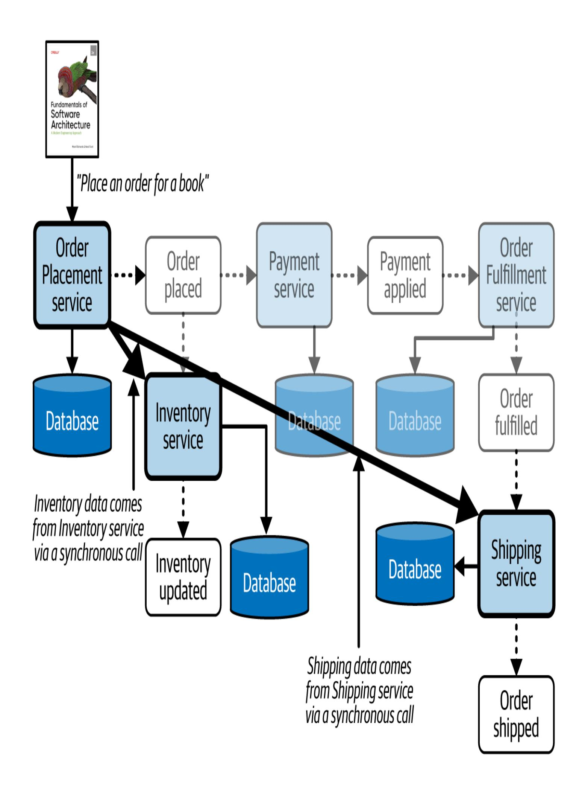

Die dedizierte Datenbanktopologie ist eine gute Wahl, wenn die Ereignisprozessoren größtenteils in sich geschlossen sind und die Daten nur innerhalb ihres eigenen begrenzten Kontexts und der entsprechenden Datenbank benötigen. Wenn die Ereignisprozessoren zu viel kommunizieren (siehe ["Governance"\)](#page-108-0), sollte der Architekt einen Wechsel zur Domäne oder sogar zur monolithischen Datenbanktopologie in Betracht ziehen, um die Gesamtleistung und Skalierbarkeit zu verbessern. Wenn die spezifische Situation jedoch häufige strukturelle Änderungen an der Datenbank erfordert, könnte dies einen Kompromiss zwischen diesen betrieblichen Merkmalen rechtfertigen, um die Anzahl der betroffenen Ereignisprozessoren zu minimieren .

# Überlegungen zur Cloud

Ereignisgesteuerte Architekturen funktionieren gut mit Cloud-basierten Umgebungen und Implementierungen, vor allem aufgrund ihrer hohen Entkopplung. Die EDA kann die asynchronen Dienste der Cloud-Anbieter problemlos nutzen, und die elastische Natur der Cloud-Infrastruktur und der Cloud-basierten Dienste passt zu ihrer Form. Im Grunde genommen passen cloudbasierte Umgebungen gut zur EDA.

# Gemeinsame Risiken

Eines der Hauptrisiken der EDA besteht darin, dass die nichtdeterministische Ereignisverarbeitung Nebeneffekte verursachen kann: zum Beispiel, dass Ereignisprozessoren unerwartet abgeleitete Ereignisse auslösen oder nicht rechtzeitig auf ein Ereignis reagieren. Ereignis-Workflows können in einer ereignisgesteuerten Architektur sehr komplex werden, und oft ist es schwierig, genau zu wissen, was passieren wird, wenn ein Ereignis ausgelöst wird.

Ein weiteres großes Risiko ist eine zu starke statische Kopplung (und damit Brüchigkeit) innerhalb der ereignisgesteuerten Architektur. Obwohl die EDA sehr *dynamisch* gekoppelt ist, können Event-Payload-Verträge (siehe ["Event-Payload"\)](#page-27-0) auch zu einer engen *statischen* Kopplung führen. Einen Vertrag zu ändern, kann eine entmutigende Aufgabe sein, da Architekten nicht immer wissen, welche Ereignisprozessoren auf ein bestimmtes Ereignis reagieren. Wenn sich der Vertrag einer Ereignis-Nutzlast ändert, kann sich dies auf mehrere andere Ereignisprozessoren auswirken, was die Brüchigkeit dieses Architekturstils noch vergrößert. Schlüsselbasierte Event Payloads helfen dabei, dieses Risiko zu mindern, aber zu den Risiken dieser Praxis gehören Probleme mit der Skalierbarkeit und Leistung sowie die Möglichkeit anämischer Ereignisse (siehe "Event [Payload"\).](#page-27-0)

Achte auch auf zu viel synchrone Kommunikation zwischen den Ereignisprozessoren. Die ereignisgesteuerte Architektur erhält ihre Superkräfte durch die hochdynamisch entkoppelten Ereignisprozessoren. Wenn die Ereignisprozessoren jedoch ständig

synchron kommunizieren müssen, ist das ein gutes Zeichen dafür, dass EDA nicht der am besten geeignete Architekturstil ist.

Schließlich ist die allgemeine Zustandsverwaltung in der EDA sowohl ein Risiko als auch eine Herausforderung. Es ist gut zu wissen, wann das auslösende Ereignis vollständig verarbeitet wurde, aber das kann aufgrund der nicht-deterministischen, asynchronen parallelen Ereignisverarbeitung in der EDA sehr schwer zu bestimmen sein. Gelegentlich kann ein Architekt den Endpunkt der Verarbeitung bestimmen und den Ereignisprozessor, der das auslösende Ereignis angenommen hat, dazu veranlassen, dieses "endende" Ereignis zu abonnieren, aber in den meisten Fällen ist das schwer zu bestimmen. Daher ist es schwierig zu wissen, wann ein auslösendes Ereignis vollständig verarbeitet wurde oder wie sein aktueller Zustand ist.

# <span id="page-108-0"></span>Governance

Ein Großteil der mit der EDA verbundenen Governance ist nicht strukturell und erfordert eine Beobachtbarkeit in Form von Protokollen als Teil eines übergeordneten Governance-Netzes. Je nach Infrastruktur und Umgebung müssen einige Governance-Kennzahlen im Zusammenhang mit EDA manuell erfasst werden.

Die beiden wichtigsten Bereiche der Governance in diesem Stil sind die statische Kopplung durch Vertragsmanagement und die dynamische Kopplung durch synchrone Aufrufe. Beide Aspekte werden in der EDA

als struktureller Verfall betrachtet, daher ist es wichtig, sie im Auge zu behalten.

Aus der Perspektive der statischen Kopplung können Architekten die Änderungsrate von Event-Payload-Verträgen und die allgemeine Stempelkopplung regeln. Das Ändern von Verträgen kann in der EDA sehr riskant sein, da sie entkoppelt ist. Die Änderung eines Ereignisvertrags, insbesondere eines ohne zugehöriges Schema, kann einen nachgelagerten Ereignisprozessor zerstören. Dies ist in der EDA ein besonderes Risiko, weil es so schwierig ist, nicht-deterministische End-to-End-Ereignisflüsse zu testen.

Die Stempelkopplung (siehe ["Ereignis-Nutzlast"\)](#page-27-0) lässt sich steuern, indem kontinuierlich aufgezeichnet und beobachtet wird, welche Felder in einem Ereignisvertrag von den Ereignisprozessoren, die auf das Ereignis reagieren, nicht verwendet werden. Die Beobachtung dieser ungenutzten Felder kann dazu beitragen, die Vertragsgröße zu verringern, die Bandbreite zu reduzieren und die Stempelkopplung und die damit verbundenen unnötigen Änderungen an den Ereignisprozessoren zu steuern.

Unter dem Gesichtspunkt der dynamischen Kopplung können Architekten automatisierte Fitness-Funktionen schreiben, um die synchrone Kommunikation zwischen Ereignisprozessoren durch Protokolle und andere beobachtbare Mittel (wie Quellcode-Anmerkungen oder die Verwendung von standardmäßigen synchronen Custom-Identifier-Bibliotheken) zu beobachten und zu verfolgen. *Jede* synchrone Kommunikation in einer ereignisgesteuerten Architektur

sollte nachverfolgt und diskutiert werden, um sicherzustellen, dass sie notwendig ist, insbesondere wenn eine Domäne oder eine spezielle Datenbanktopologie verwendet wird.

# Überlegungen zur Team-Topologie

EDA wird aufgrund der vielen Artefakte, die jede Domäne ausmachen, weitgehend als technisch partitionierte Architektur betrachtet: mehrere Ereignisprozessoren, Ereigniskanäle, Nachrichtenbroker und möglicherweise Datenbanken, je nach Datenbanktopologie. Nichtsdestotrotz kann sie gut funktionieren, wenn die Teams innerhalb der Domänenbereiche aufeinander abgestimmt sind (z. B. funktionsübergreifende Teams mit Spezialisierung). Für bestimmte Arten von Teamtopologien (siehe ["Teamtopologien](#page--1-2) und Architektur") kann EDA jedoch eine Herausforderung darstellen.

Hier sind einige Überlegungen zur Abstimmung zwischen diesen speziellen Team-Topologien und der EDA:

### *Auf den Strom ausgerichtete Teams*

Je nach Größe des Systems kann es für Teams, die sich am Stream orientieren, schwierig sein, domänenbasierte Änderungen zu implementieren, da die Ereignisprozessoren entkoppelt sind. Da Domänen und Subdomänen in der EDA in der Regel mit mehreren Ereignisprozessoren und abgeleiteten Ereignissen implementiert werden, kann es für stromorientierte Teams eine Herausforderung sein, all diese beweglichen Teile zu verstehen. Das Hinzufügen eines Schritts zum Auftragsvergabe-Workflow kann zum Beispiel die Änderung mehrerer Ereignisprozessoren sowie eine Umstrukturierung der Art und Weise (und des Zeitpunkts), wie die vorhandenen abgeleiteten Ereignisse ausgelöst werden, erfordern. Je größer und komplexer die ereignisgesteuerte Architektur ist, desto weniger effektiv werden die Teams sein, die sich an den Datenströmen orientieren.

### *Teams befähigen*

Aufgrund der erforderlichen Integration zwischen Ereignisverarbeitern, die auf abgeleiteten Ereignissen und ihren Verträgen basieren, funktionieren Enabling-Teams in ereignisgesteuerten Architekturen nicht gut. Das Experimentieren und die Effizienz von Enabling Teams *innerhalb* eines Streams kann das Verständnis und die Verwaltung des gesamten Ereignisflusses durch ein Stream-orientiertes Team stören und erfordert in der Regel zu viel Koordination zwischen Stream-orientierten Teams und Enabling Teams.

### *Teams mit komplizierten Subsystemen*

Teams für komplizierte Teilsysteme arbeiten gut mit der EDA zusammen, weil sie entkoppelt und asynchron ist. Komplexe Verarbeitungen können durch separate Ereignisprozessoren leicht isoliert werden, so dass sich das Team für komplizierte Teilsysteme darauf konzentrieren kann und die weniger komplizierten Verarbeitungen den stromorientierten Teams überlässt. Da die Ereignisprozessoren in hohem Maße dynamisch entkoppelt sind,

müssen sich die stromorientierten Teams nur bei statischen Ereignis-Payload-Verträgen und abgeleiteten Ereignissen mit den Teams des komplizierten Teilsystems abstimmen.

### *Plattform-Teams*

In der EDA können Entwickler die Vorteile der Plattform-Teams-Topologie nutzen, indem sie gemeinsame Tools, Dienste, APIs und Aufgaben verwenden, vor allem aufgrund der technischen Partitionierung der EDA. Dies gilt vor allem dann, wenn Teams die infrastrukturbezogenen Teile der EDA (z. B. die Message Broker, Event Hubs, Event Buses und andere Event-Channel-Artefakte) als plattformbezogen behandeln.

# Stilmerkmale

Eine Ein-Stern-Bewertung in der Tabelle in [Abbildung](#page-114-0) 15-39 bedeutet, dass ein bestimmtes Architekturmerkmal in der Architektur nicht gut unterstützt wird, während eine Fünf-Sterne-Bewertung bedeutet, dass es eines der stärksten Merkmale dieses Stils ist. Definitionen für jedes in der Scorecard genannte Merkmal findest du in [Kapitel](#page--1-0) 4.

Die ereignisgesteuerte Architektur ist in erster Linie eine technisch partitionierte Architektur, bei der eine bestimmte Domäne auf mehrere Ereignisprozessoren verteilt und durch Broker, Verträge (Event Payload) und Themen miteinander verbunden ist. Änderungen an einer bestimmten Domäne wirken sich in der Regel auf mehrere

Ereignisprozessoren und andere Messaging-Artefakte aus, so dass die EDA im Allgemeinen nicht als domänenpartitioniert gilt.

|             | Architectural characteristic | Star rating                      |
|-------------|------------------------------|----------------------------------|
|             | Overall cost                 | \$\$\$                           |
| Structural  | Partitioning type            | Technical                        |
|             | Number of quanta             | 1 to many                        |
|             | Simplicity                   | $\stackrel{\star}{\Rightarrow}$  |
|             | Modularity                   | ***                              |
| Engineering | Maintainability              | ***                              |
|             | Testability                  | $\stackrel{\wedge}{\Rightarrow}$ |
|             | Deployability                | ***                              |
|             | Evolvability                 | ***                              |
| Operational | Responsiveness               | ***                              |
|             | Scalability                  | ****                             |
|             | Elasticity                   | ***                              |
|             | Fault tolerance              | ***                              |

Die Anzahl der Quanten innerhalb der EDA kann von einem bis zu vielen variieren, je nachdem, welche Datenbankinteraktionen innerhalb der einzelnen Ereignisprozessoren stattfinden und ob das System eine Anfrage-Antwort-Verarbeitung verwendet. Auch wenn die Kommunikation in einer EDA auf asynchronen Aufrufen beruht, würden mehrere Ereignisprozessoren, die sich eine einzige Datenbankinstanz teilen, alle in demselben architektonischen Quantum enthalten sein. Das Gleiche gilt für die Anfrage-Antwort-Verarbeitung: Obwohl die Kommunikation zwischen den Ereignisprozessoren immer noch asynchron ist, werden die Ereignisprozessoren synchron miteinander verbunden und bilden ein einziges Quantum, wenn eine Antwort vom Ereignisverbraucher sofort benötigt wird.

Stell dir zum Beispiel vor, dass ein Ereignisverarbeiter eine Anfrage an einen anderen Ereignisverarbeiter sendet, um eine Bestellung aufzugeben. Der erste Ereignisverarbeiter muss auf eine Auftragskennung des anderen Ereignisverarbeiters warten, um fortfahren zu können. Wenn der zweite Ereignisprozessor (derjenige, der die Bestellung aufgibt und eine Bestell-ID generiert) ausgefallen ist, kann der erste Ereignisprozessor nicht fortfahren. Das bedeutet, dass sie Teil desselben Architekturquantums sind und dieselben architektonischen Merkmale teilen, obwohl sie beide asynchrone Nachrichten senden und empfangen.

Die ereignisgesteuerte Architektur wird in Bezug auf Leistung, Skalierbarkeit und Fehlertoleranz, ihren Hauptstärken, sehr hoch bewertet (4 bis 5 Sterne). Die hohe Leistung wird durch die Kombination von asynchroner Kommunikation und hochparalleler Verarbeitung erreicht. Die hohe Skalierbarkeit wird durch den programmatischen Lastausgleich der Ereignisprozessoren (auch *konkurrierende Verbraucher* und *Verbrauchergruppen* genannt) erreicht. Wenn die Last der Anfragen steigt, können zusätzliche Ereignisprozessoren programmatisch hinzugefügt werden, um die zusätzlichen Anfragen zu bearbeiten. Der Grund, warum wir ihr nur vier (und nicht fünf) Sterne gegeben haben, ist die Datenbank (ein Beispiel für eine Fünf-Sterne-Bewertung für diese Merkmale findest du in [Kapitel](#page--1-0) 16, über raumbezogene Architekturen). Die EDA erreicht Fehlertoleranz durch ihre entkoppelten, asynchronen Ereignisprozessoren, die für die Konsistenz und Verarbeitung von Ereignisabläufen sorgen. Wenn andere nachgelagerte Prozessoren nicht verfügbar sind, kann das System das Ereignis zu einem späteren Zeitpunkt verarbeiten, solange die Benutzeroberfläche oder ein Ereignisprozessor, der eine Anfrage stellt, keine sofortige Antwort benötigt.

Die EDA schneidet bei der allgemeinen *Einfachheit* und *Prüfbarkeit* relativ schlecht ab, was vor allem an den nicht-deterministischen und dynamischen Ereignisabläufen liegt. Bei anforderungsbasierten Modellen sind deterministische Abläufe relativ einfach zu testen, weil ihre Pfade und Ergebnisse im Allgemeinen bekannt sind. Das ist beim ereignisgesteuerten Modell nicht der Fall. Manchmal wissen Architekten einfach nicht, wie die Ereignisprozessoren auf dynamische Ereignisse

reagieren oder welche Nachrichten sie produzieren. Diese werden als *nicht-deterministische Workflows* bezeichnet. Die "Ereignisbaumdiagramme" dieser Systeme können extrem komplex sein und Hunderte oder sogar Tausende von Szenarien erzeugen, was die Steuerung und Prüfung sehr schwierig macht.

Schließlich sind EDAs hochgradig entwicklungsfähig, daher die Fünf-Sterne-Bewertung. Das Hinzufügen neuer Funktionen durch bestehende oder neue Ereignisprozessoren ist relativ einfach. Durch die Bereitstellung von Hooks über ausgelöste abgeleitete Ereignisse stehen das Ereignis und die zugehörigen Daten bereits für andere Verarbeitungen zur Verfügung, so dass keine Änderungen an der Infrastruktur oder den bestehenden Ereignisprozessoren erforderlich sind, um die neue Funktionalität hinzuzufügen.

Zu den Nachteilen der EDA gehört, dass es schwierig ist, den gesamten Arbeitsablauf zu kontrollieren, der mit einem auslösenden Ereignis verbunden ist. Die Ereignisverarbeitung ist aufgrund sich ändernder Bedingungen sehr dynamisch, und es ist schwierig zu wissen, wann der Geschäftsvorgang, der auf dem auslösenden Ereignis basiert, abgeschlossen ist.

Auch die Fehlerbehandlung ist eine große Herausforderung bei EDA. Da es in der Regel keinen Mediator gibt, der den Geschäftsvorgang überwacht oder steuert (außer bei der Mediator-Topologie), werden andere Dienste im Falle eines Fehlers nichts von dem Absturz erfahren. Der Geschäftsprozess, der auf dem auslösenden Ereignis basiert, bleibt stecken und kann nicht ohne eine Art automatisches oder manuelles

Eingreifen fortgesetzt werden, auch wenn alle anderen Prozesse ohne Rücksicht auf den Fehler weiterlaufen. Wenn z. B. der Ereignisprozessor Payment in unserem Bestellsystem abstürzt und die ihm zugewiesene Aufgabe nicht erfüllt, passt der Ereignisprozessor Inventory trotzdem den Bestand an, und alle anderen weiteren Ereignisprozessoren reagieren, als wäre alles in Ordnung.

Die Wiederaufnahme eines Geschäftsvorfalls (Wiederherstellbarkeit) ist in der EDA sehr schwierig. Da während der Verarbeitung des auslösenden Ereignisses bereits andere Aktionen asynchron ausgeführt wurden, ist es oft einfach nicht möglich, das auslösende Ereignis erneut zu übermitteln.

## **Die Wahl zwischen anforderungsbasierten und ereignisbasierten Modellen**

Das anforderungsbasierte und das ereignisbasierte Modell sind beides praktikable Ansätze für die Entwicklung von Softwaresystemen. Die Wahl des richtigen Modells ist jedoch entscheidend für den Erfolg. Wir empfehlen das anfragebasierte Modell für gut strukturierte, datengesteuerte Anfragen (z. B. die Abfrage von Kundenprofildaten), bei denen Sicherheit und Kontrolle über den Arbeitsablauf im Vordergrund stehen. Wir empfehlen das ereignisbasierte Modell für flexible, aktionsbasierte Ereignisse, die ein hohes Maß an Reaktionsfähigkeit und Skalierbarkeit erfordern, sowie für komplexe und dynamische Benutzerprozesse.

Das Verständnis der Kompromisse des ereignisbasierten Modells hilft auch dabei, die beste Lösung zu finden. [Tabelle](#page-120-0) 15-2 listet die Vor- und Nachteile des ereignisbasierten Modells der EDA auf.

<span id="page-120-0"></span>Tabelle 15-2. Kompromisse des ereignisgesteuerten Modells

| Vorteile<br>gegenüber<br>anforderungsbasierten            | Kompromisse                                                               |
|-----------------------------------------------------------|---------------------------------------------------------------------------|
| Bessere<br>Reaktion<br>auf<br>dynamische<br>Nutzerinhalte | Unterstützt<br>nur<br>eventuelle<br>Konsistenz                            |
| Bessere<br>Skalierbarkeit<br>und<br>Elastizität           | Weniger<br>Kontrolle<br>über<br>den<br>Verarbeitungsprozess               |
| Bessere<br>Agilität<br>und<br>Veränderungsmanagement      | Weniger<br>Gewissheit<br>über<br>den<br>Ausgang<br>des<br>Ereignisablaufs |
| Bessere<br>Anpassungsfähigkeit<br>und<br>Erweiterbarkeit  | Schwierig<br>zu<br>testen<br>und<br>zu<br>debuggen                        |
| Bessere<br>Reaktionsfähigkeit<br>und<br>Leistung          |                                                                           |
| Bessere<br>Entscheidungsfindung<br>in<br>Echtzeit         |                                                                           |

### **Vorteile gegenüber anforderungsbasierten**

### **Kompromisse**

Bessere Reaktion auf Situationsbewusstsein

# Beispiele und Anwendungsfälle

Jedes Geschäftsproblem, bei dem es darum geht, auf Dinge zu reagieren, die im System passieren (entweder intern oder extern), ist ein guter Kandidat für EDA. Das Beispiel des Auftragseingabesystems, das wir in diesem Kapitel verwendet haben, ist ein guter Anwendungsfall für EDA, da es eine parallele, entkoppelte Bearbeitung eines Auftrags ermöglicht. Systeme, die ein hohes Maß an Reaktionsfähigkeit, Leistung, Skalierbarkeit, Fehlertoleranz und Elastizität erfordern, sind ebenfalls gute Kandidaten für EDA.

Ein weiterer guter Anwendungsfall, um die Leistungsfähigkeit und Effektivität von EDA zu demonstrieren, ist unser laufendes Beispiel für ein Going, Going, Gone-Auktionssystem, bei dem Benutzer auf zur Versteigerung angebotene Artikel bieten, bis das letzte Gebot unangefochten bleibt und der Bieter den Artikel gewinnt. Bei diesen Systemen ist die Anzahl der Bieter in der Regel nicht bekannt, was sowohl Skalierbarkeit als auch Elastizität erfordert - vor allem, wenn die Auktion zeitlich begrenzt ist und das Bieten zu einem Ende kommt. Diese Systeme brauchen auch ein hohes Maß an Reaktionsfähigkeit. Der vielleicht beste Grund dafür, dass Online-Auktionssysteme und EDA gut zusammenpassen, ist, dass EDA die Abgabe eines Gebots nicht als eine *Anfrage an das System* betrachtet, sondern als ein *Ereignis, das bereits eingetreten ist*.

Wie [Abbildung](#page-123-0) 15-40 zeigt, finden im System viele Aktionen statt, wenn ein Bieter ein Gebot abgibt. Diese Aktionen können alle asynchron sein und entweder gleichzeitig oder später als Backend-Verarbeitung (z. B. durch den Bidder Tracker Ereignisprozessor) ausgeführt werden. Wenn ein Bieter ein Gebot abgibt, empfängt der Bid Capture Ereignisprozessor das auslösende Ereignis, stellt fest, ob es höher ist als das vorherige Gebot und löst ein bid placed Ereignis aus. Der Auctioneer Ereignisprozessor reagiert auf dieses Ereignis und aktualisiert die Website mit dem neuen Gebotspreis des Artikels. Gleichzeitig reagiert der Bid Streamer Ereignisprozessor auf das gleiche Ereignis und überträgt das Gebot an den Gebotsverlauf der Website oder sogar an die einzelnen Bieter (je nach Benutzeroberfläche). Schließlich reagiert der Bidder Tracker Ereignisprozessor auf das Ereignis, um den Bieter und sein Gebot zu Nachverfolgungs- und Prüfungszwecken zu speichern.

<span id="page-123-0"></span>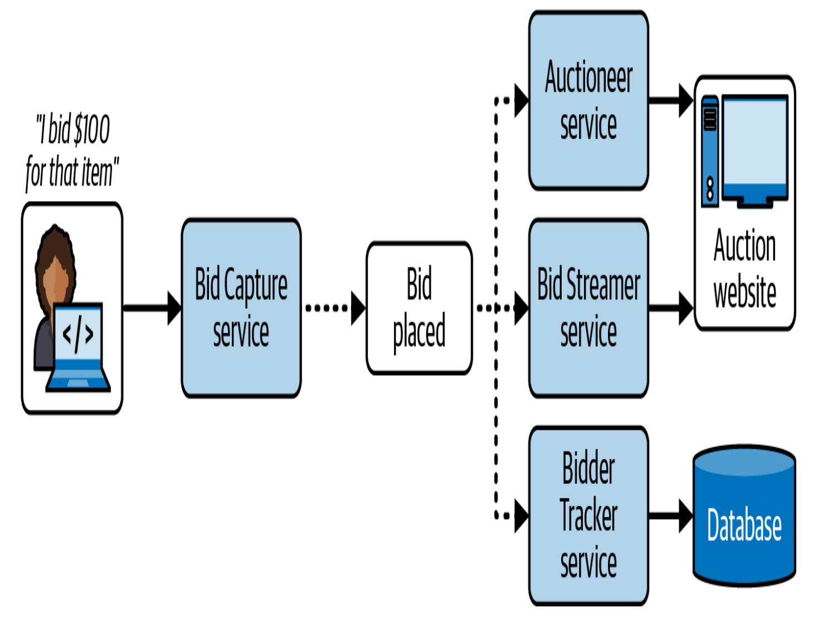

Abbildung 15-40. Ein Beispiel für ein Online-Bietsystem mit EDA

Viele andere Ereignisverarbeiter sind in den Arbeitsablauf dieses auslösenden Ereignisses involviert, und viele andere abgeleitete Ereignisse werden ausgelöst, aber dieser kleine Teil des Systems demonstriert eine gute Nutzung des ereignisgesteuerten Architekturstils und veranschaulicht Reaktionsfähigkeit, Fehlertoleranz, Skalierbarkeit und Elastizität.

Die ereignisgesteuerte Architektur ist ein sehr komplizierter, aber auch ein sehr leistungsfähiger Architekturstil. Analysiere die Arbeitsabläufe und Verarbeitungsprozesse, die für das Geschäftsproblem benötigt

werden, um festzustellen, ob es sich lohnt, die Komplexität der EDA angesichts ihrer Superkräfte zu bewältigen. Wenn ein Großteil der benötigten Prozesse auf Anfragen basiert, solltest du stattdessen den Architekturstil der Microservices (siehe [Kapitel](#page--1-0) 18) in Betracht ziehen.