# Kapitel 16. Raumbasierter Architekturstil

Diese Arbeit wurde mithilfe von KI übersetzt. Wir freuen uns über dein Feedback und deine Kommentare: [translation-feedback@oreilly.com](mailto:translation-feedback@oreilly.com)

Die meisten webbasierten Geschäftsanwendungen folgen demselben allgemeinen Anfragefluss: Eine Anfrage von einem Browser trifft auf den Webserver, dann auf einen Anwendungsserver und schließlich auf den Datenbankserver. Während dieser typische Anfragefluss für eine kleine Anzahl gleichzeitiger Benutzer funktioniert, treten Engpässe auf, wenn die gleichzeitige Benutzerlast steigt: zuerst auf der Webserver-Ebene, dann auf der Anwendungsserver-Ebene und schließlich auf der Datenbankserver-Ebene.

Die übliche Reaktion auf Engpässe, die durch eine erhöhte Nutzerzahl entstehen, ist die Verkleinerung der Webserver. Das ist relativ einfach und kostengünstig, und manchmal funktioniert es auch. In den meisten Fällen von hoher Benutzerlast verlagert sich der Engpass durch die Skalierung der Webserverschicht jedoch nur auf den Anwendungsserver. Die Skalierung von Anwendungsservern kann komplexer und teurer sein als die Skalierung von Webservern, und in der Regel verlagert sich der Engpass dadurch nur auf den Datenbankserver, der noch schwieriger und teurer zu skalieren ist. Selbst wenn du die Datenbank skalieren kannst, hast du am Ende eine

dreieckige Topologie, bei der der breiteste Teil des Dreiecks die Webserver sind (am einfachsten zu skalieren) und der kleinste Teil die Datenbank ist (am schwierigsten zu skalieren), wie in [Abbildung](#page-2-0) 16-1 dargestellt.

Bei jeder Anwendung mit hohem Volumen und einer großen Anzahl gleichzeitiger Benutzer/innen ist die Datenbank in der Regel der letzte begrenzende Faktor für die Anzahl der Transaktionen, die die Anwendung gleichzeitig verarbeiten kann. Verschiedene Caching-Technologien und Datenbank-Skalierungsprodukte können zwar helfen, aber die Skalierung einer normalen Anwendung für extreme Belastungen bleibt ein sehr schwieriges Unterfangen.

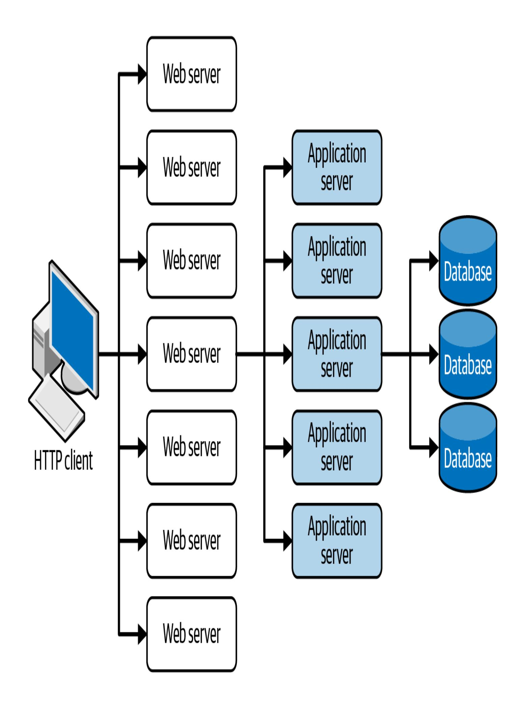

Die *raumbezogene* Architektur wurde speziell für Probleme entwickelt, die hohe Skalierbarkeit, Elastizität und Gleichzeitigkeit erfordern. Sie ist auch ein nützlicher Architekturstil für Anwendungen mit variablen und unvorhersehbaren gleichzeitigen Nutzerzahlen. Es ist oft besser, extreme und variable Skalierbarkeit architektonisch zu lösen, als zu versuchen, eine Datenbank zu skalieren oder Caching-Technologien in eine Architektur einzubauen, die nicht so gut skalieren kann.

# Topologie

Die Space-basierte Architektur verdankt ihren Namen dem Konzept des *Tupel [Space](https://oreil.ly/XVJ_D)*, einer Technik, bei der mehrere parallele Prozessoren über einen gemeinsamen Speicher kommunizieren. Space-basierte Systeme erreichen eine hohe Skalierbarkeit, Elastizität und Leistung, indem sie die zentrale Datenbank als synchrone Beschränkung im System durch replizierte In-Memory-Datengrids ersetzen.

Die Anwendungsdaten werden im Arbeitsspeicher gehalten und auf alle aktiven Verarbeitungseinheiten repliziert. Wenn eine Verarbeitungseinheit Daten aktualisiert, sendet sie diese Daten asynchron über eine Datenpumpe an die Datenbank, normalerweise über Messaging mit persistenten Warteschlangen. Die Verarbeitungseinheiten werden dynamisch hoch- und heruntergefahren, je nachdem, wie die Benutzerlast steigt oder sinkt. Da keine zentrale Datenbank an der Standardtransaktionsverarbeitung der

Anwendung beteiligt ist, entfällt der Engpass in der Datenbank. Dies ermöglicht eine nahezu unbegrenzte Skalierbarkeit innerhalb der Anwendung.

Die raumbezogene Architektur ist ein komplizierter Architekturstil, der aus vielen verschiedenen Artefakten besteht, die zusammenarbeiten, um eine einzige Anfrage zu bearbeiten. Die wichtigsten Artefakte sind:

*Verarbeitungseinheiten*

Enthält die Anwendungsfunktionalität

*Virtualisierte Middleware*

Die Sammlung infrastrukturbezogener Artefakte, die zur Verwaltung und Koordinierung der Verarbeitungseinheiten verwendet werden

*Messaging-Raster*

Wird verwendet, um Eingabeanfragen und den Sitzungsstatus zu verwalten

*Datengitter*

Verwaltet die Synchronisierung und Replikation von Daten zwischen Verarbeitungseinheiten

*Verarbeitungsgitter*

Dient der Verwaltung der Anfrage-Orchestrierung zwischen mehreren Verarbeitungseinheiten

*Einsatzleiter*

Verwaltet das Starten und Herunterfahren von Verarbeitungseinheiten bei steigender und sinkender Last

*Datenpumpen*

Asynchron aktualisierte Daten an die Datenbank senden

*Datenschreiber*

Führe die Aktualisierungen von den Datenpumpen aus

*Datenleser*

Datenbankdaten lesen und beim Start an die Verarbeitungseinheiten liefern

[Abbildung](#page-6-0) 16-2 veranschaulicht diese primären Artefakte.

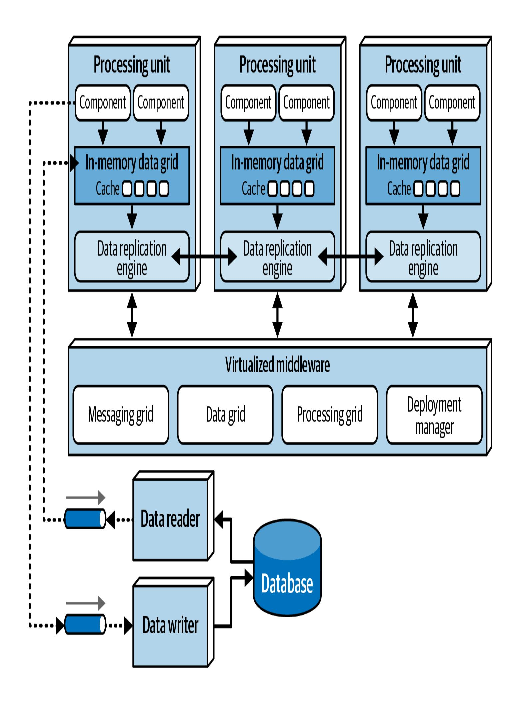

# Stil Besonderheiten

In den folgenden Abschnitten werden diese primären Artefakte und ihre Funktionsweise im Detail beschrieben.

#### **Verarbeitungseinheit**

Die Processing Unit (siehe [Abbildung](#page-8-0) 16-3) enthält die Anwendungslogik (oder Teile davon), die in der Regel sowohl webbasierte Komponenten als auch die Backend-Geschäftslogik umfasst. Der Inhalt der Processing Unit hängt von der Art der Anwendung ab. Kleinere webbasierte Anwendungen werden in der Regel in einer einzigen Processing Unit implementiert, während größere Anwendungen ihre Funktionalität oft in mehrere Processing Units aufteilen, je nach Funktionsbereich der Anwendung. Die Processing Unit kann auch kleine Einzweckdienste enthalten (ähnlich wie Microservices). Außerdem enthält die Processing Unit ein In-Memory-Datengitter und eine Replikations-Engine, die in der Regel durch Produkte wie [H](https://oreil.ly/XOUJL)[azelcast](https://hazelcast.com/)[,](https://oreil.ly/XOUJL) [Apache](https://ignite.apache.org/) Ignite und Oracle Coherence implementiert werden (siehe ["Datengitter"\)](#page-12-0).

<span id="page-8-0"></span>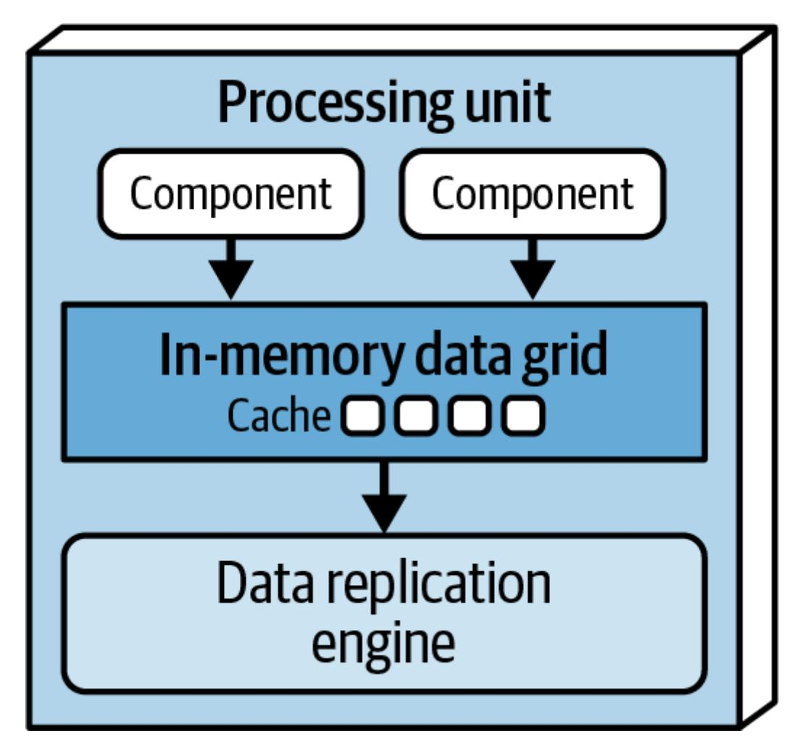

Abbildung 16-3. Die Verarbeitungseinheit enthält die Funktionen der Anwendung

#### **Virtualisierte Middleware**

Die *virtualisierte Middleware*, wie in [Abbildung](#page-11-0) 16-4 dargestellt, enthält verschiedene infrastrukturbezogene Artefakte und dient der Verwaltung und Steuerung der Verarbeitungseinheiten. Dieses Middleware-Artefakt enthält mindestens ein *Messaging Grid* zur Verwaltung von Eingabeanfragen und des Sitzungsstatus, ein *Data Grid* zur Verwaltung der Datenreplikation und -synchronisation und einen *Deployment Manager* zum Starten und Abbauen von Verarbeitungseinheiten, je nachdem, ob sie benötigt werden oder nicht. Optional enthält die virtualisierte Middleware auch ein *Processing Grid* für den Fall, dass zwei

oder mehr Processing Units für eine einzige Geschäftsanfrage orchestriert werden müssen. Der Architekt kann der virtualisierten Middleware bei Bedarf weitere infrastrukturbezogene Funktionen hinzufügen, z. B. Sicherheitsfunktionen, die Erfassung von Metriken zur Beobachtung usw.

Da kein einzelnes Produkt alle Funktionen der virtualisierten Middleware übernehmen kann, wird sie in der Regel durch Produkte von Drittanbietern wie Webserver, Caching-Tools, Load Balancer, Service Orchestratoren und Deployment Manager implementiert, um die Überwachung, den Start und das Herunterfahren der Verarbeitungseinheiten zu verwalten. Jedes dieser Middleware-Artefakte wird in den folgenden Abschnitten im Detail beschrieben.

### **Messaging Grid**

Das *Messaging Grid*, das in [Abbildung](#page-11-0) 16-4 dargestellt ist, ist Teil der virtualisierten Middleware und verwaltet Eingabeanfragen und den Sitzungsstatus. Wenn eine Anfrage bei der virtualisierten Middleware eingeht, ermittelt die Messaging-Grid-Komponente, welche aktiven Verarbeitungseinheiten für den Empfang der Anfrage verfügbar sind, und leitet die Anfrage an eine dieser Verarbeitungseinheiten weiter.

Die Komplexität des Messaging Grid kann variieren, von einem einfachen Round-Robin-Algorithmus bis hin zu einem komplexeren Next-Available-Algorithmus, der festhält, welche Verarbeitungseinheit am meisten verfügbar ist. Diese Komponente wird in der Regel mit

einem typischen Webserver mit Load-Balancing-Fähigkeiten (wie HA Proxy oder Nginx) implementiert.

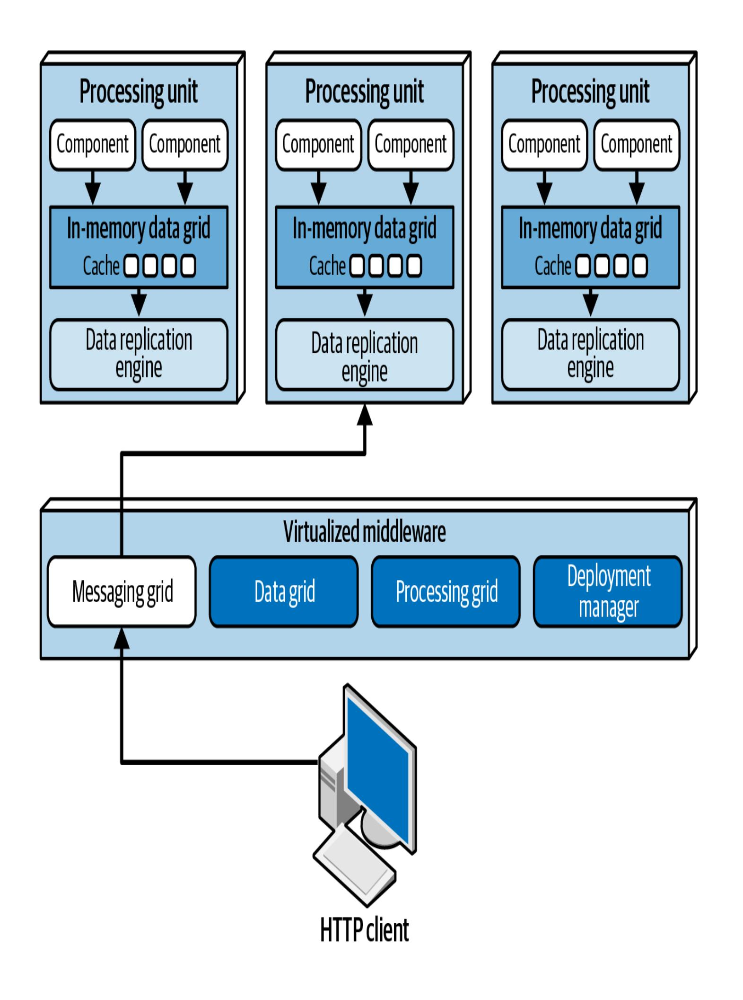

#### <span id="page-12-0"></span>**Datenraster**

Das *Datengitter* ist eine Komponente - vielleicht sogar die wichtigste Komponente - der virtualisierten Middleware. In den meisten modernen Implementierungen wird das Datengitter ausschließlich in den Verarbeitungseinheiten als replizierter Cache im Speicher implementiert (siehe ["Repliziertes](#page-18-0) und verteiltes Caching"). Bei replizierten Caching-Implementierungen, die einen externen Controller benötigen oder einen verteilten Cache verwenden, befindet sich diese Funktion jedoch *sowohl* in den Verarbeitungseinheiten als auch in den Data-Grid-Komponenten der virtualisierten Middleware.

Da das Messaging Grid eine Anfrage an jede der verfügbaren Verarbeitungseinheiten weiterleiten kann, ist es wichtig, dass das In-Memory-Datengitter jeder Verarbeitungseinheit *genau die gleichen Daten* enthält. Wie die gestrichelten Linien in [Abbildung](#page-13-0) 16-5 zeigen, erfolgt die Datenreplikation in der Regel asynchron zwischen den Verarbeitungseinheiten, wobei die Datenreplikation in der Regel in weniger als 100 ms abgeschlossen ist.

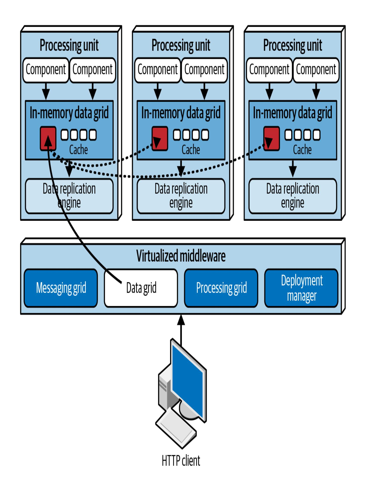

Die Daten werden zwischen Verarbeitungseinheiten synchronisiert, die das gleiche benannte Datengitter enthalten. Der folgende Java-Code verwendet Hazelcast, um ein internes repliziertes Datengitter für Verarbeitungseinheiten zu erstellen, die Kundenprofilinformationen enthalten:

```
HazelcastInstance hz = Hazelcast.newHazelcastInstance();
Map<String, CustomerProfile> profileCache =
        hz.getReplicatedMap("CustomerProfile");
```

Alle Verarbeitungseinheiten, die Zugriff auf Kundenprofilinformationen benötigen, sollten diesen Code enthalten. Wenn eine Verarbeitungseinheit Daten im CustomerProfile Cache aktualisiert, repliziert das Datengitter die Aktualisierung an alle anderen Verarbeitungseinheiten, die denselben CustomerProfile Cache enthalten. Eine Verarbeitungseinheit kann so viele replizierte In-Memory-Caches enthalten, wie sie für ihre Arbeit benötigt. Alternativ kann eine Verarbeitungseinheit einen Remote-Aufruf an eine andere Verarbeitungseinheit richten, um Daten anzufordern (Choreografie), oder das Processing Grid (im nächsten Abschnitt beschrieben) nutzen, um die Datenanforderung zu orchestrieren (weitere Informationen zu [Orchestrierung](#page--1-0) und Choreografie findest du unter ["Orchestrierung](#page--1-0) versus Choreografie" in [Kapitel](#page--1-1) 20 ).

Durch die Datenreplikation innerhalb der Verarbeitungseinheiten können zusätzliche Instanzen gestartet werden, ohne dass Daten aus der Datenbank gelesen werden müssen, solange mindestens eine Instanz den genannten replizierten Cache enthält. Wenn eine neue Verarbeitungseinheit startet, sendet sie eine Anfrage über den Caching-Anbieter (z. B. Hazelcast), um sich mit anderen Verarbeitungseinheiten mit demselben Cache zu verbinden. Sobald andere Verarbeitungseinheiten die Broadcast-Anforderung bestätigen und eine Verbindung zu der neuen Verarbeitungseinheit herstellen, sendet eine von ihnen (in der Regel die erste, die sich mit der neuen Verarbeitungseinheit verbindet) die Cache-Daten an die neue Instanz, damit sie mit allen anderen Instanzen mit demselben benannten Cache synchronisiert ist.

Jede Instanz einer Verarbeitungseinheit enthält eine *Mitgliederliste* mit den IP-Adressen und Ports aller anderen Instanzen einer Verarbeitungseinheit, die denselben Cache enthalten. Nehmen wir zum Beispiel an, es gibt eine einzige Instanz einer Verarbeitungseinheit, die die Kundenprofilfunktionalität und die im Speicher replizierten Cachedaten enthält. In diesem Fall gibt es nur eine Instanz, so dass ihre Mitgliederliste nur sie selbst enthält. Dies wird in den folgenden Logging-Anweisungen dargestellt, die mit Hazelcast erstellt wurden:

```
Instance 1:
Members {size:1, ver:1} [
        Member [172.19.248.89]:5701 - 04a6f863-dfce-41e5-9d51
]
```

Wenn eine weitere Verarbeitungseinheit mit demselben Cache gestartet wird, werden die Mitgliederlisten beider Dienste aktualisiert, um die IP-Adressen und Ports der jeweiligen Verarbeitungseinheit wiederzugeben:

```
Instance 1:
Members {size:2, ver:2} [
        Member [172.19.248.89]:5701 - 04a6f863-dfce-41e5-9d51
        Member [172.19.248.90]:5702 - ea9e4dd5-5cb3-4b27-8fe8
]
Instance 2:
Members {size:2, ver:2} [
        Member [172.19.248.89]:5701 - 04a6f863-dfce-41e5-9d51
        Member [172.19.248.90]:5702 - ea9e4dd5-5cb3-4b27-8fe8
]
```

Wenn eine dritte Verarbeitungseinheit gestartet wird, werden die Mitgliederlisten von Instanz 1 und Instanz 2 aktualisiert, um die neue dritte Instanz zu berücksichtigen:

```
Instance 1:
Members {size:3, ver:3} [
       Member [172.19.248.89]:5701 - 04a6f863-dfce-41e5-9d51
       Member [172.19.248.90]:5702 - ea9e4dd5-5cb3-4b27-8fe8
       Member [172.19.248.91]:5703 - 1623eadf-9cfb-4b83-9983
]
Instance 2:
  b { i } [
```

```
Members {size:3, ver:3} [
        Member [172.19.248.89]:5701 - 04a6f863-dfce-41e5-9d51
        Member [172.19.248.90]:5702 - ea9e4dd5-5cb3-4b27-8fe8
        Member [172.19.248.91]:5703 - 1623eadf-9cfb-4b83-9983
]
Instance 3:
Members {size:3, ver:3} [
        Member [172.19.248.89]:5701 - 04a6f863-dfce-41e5-9d51
        Member [172.19.248.90]:5702 - ea9e4dd5-5cb3-4b27-8fe8
        Member [172.19.248.91]:5703 - 1623eadf-9cfb-4b83-9983
]
```

Jetzt wissen alle drei Instanzen übereinander Bescheid (auch über sich selbst, wie das Wort this am Ende der Mitgliederzeile verdeutlicht). Angenommen, Instanz 1 erhält eine Anfrage von einem Kunden, der seine Rechnungsadresse aktualisieren möchte. Wenn Instanz 1 den Cache mit einer cache.put() oder einer ähnlichen Cache-Aktualisierungsmethode aktualisiert, aktualisiert das Datengrid (z. B. Hazelcast) die anderen replizierten Caches asynchron mit derselben Aktualisierung und stellt so sicher, dass alle drei Kundenprofil-Caches die neue Rechnungsadresse enthalten und immer mit denselben Daten synchronisiert sind.

Wenn die Instanzen einer Verarbeitungseinheit ausfallen, werden die Mitgliederlisten aller anderen Verarbeitungseinheiten automatisch aktualisiert, um die Änderung widerzuspiegeln. Wenn zum Beispiel

Instanz 2 ausfällt, aktualisiert das Caching-Produkt sofort die Mitgliederlisten von Instanz 1 und 3, um die verlorene Instanz zu entfernen:

```
Instance 1:
Members {size:2, ver:4} [
        Member [172.19.248.89]:5701 - 04a6f863-dfce-41e5-9d51
        Member [172.19.248.91]:5703 - 1623eadf-9cfb-4b83-9983
]
Instance 3:
Members {size:2, ver:4} [
        Member [172.19.248.89]:5701 - 04a6f863-dfce-41e5-9d51
        Member [172.19.248.91]:5703 - 1623eadf-9cfb-4b83-9983
]
```

#### <span id="page-18-0"></span>**Repliziertes und verteiltes Caching**

Die raumbezogene Architektur stützt sich auf das Caching, um Transaktionen in Anwendungen zu verarbeiten. Die raumbezogene Architektur macht direkte Lese- und Schreibvorgänge in einer Datenbank überflüssig und ermöglicht so eine hohe Skalierbarkeit, Elastizität und Leistung. Dieser Architekturstil stützt sich hauptsächlich auf repliziertes In-Memory-Caching, kann aber auch verteiltes Caching verwenden.

Beim *replizierten Caching*, wie in [Abbildung](#page-19-0) 16-6 dargestellt, enthält jede Verarbeitungseinheit ihr eigenes In-Memory-Datengitter, das zwischen

allen Verarbeitungseinheiten synchronisiert wird, die denselben Cache verwenden. Wenn ein Cache in einer der Verarbeitungseinheiten aktualisiert wird, werden die anderen Verarbeitungseinheiten automatisch mit den neuen Informationen aktualisiert.

<span id="page-19-0"></span>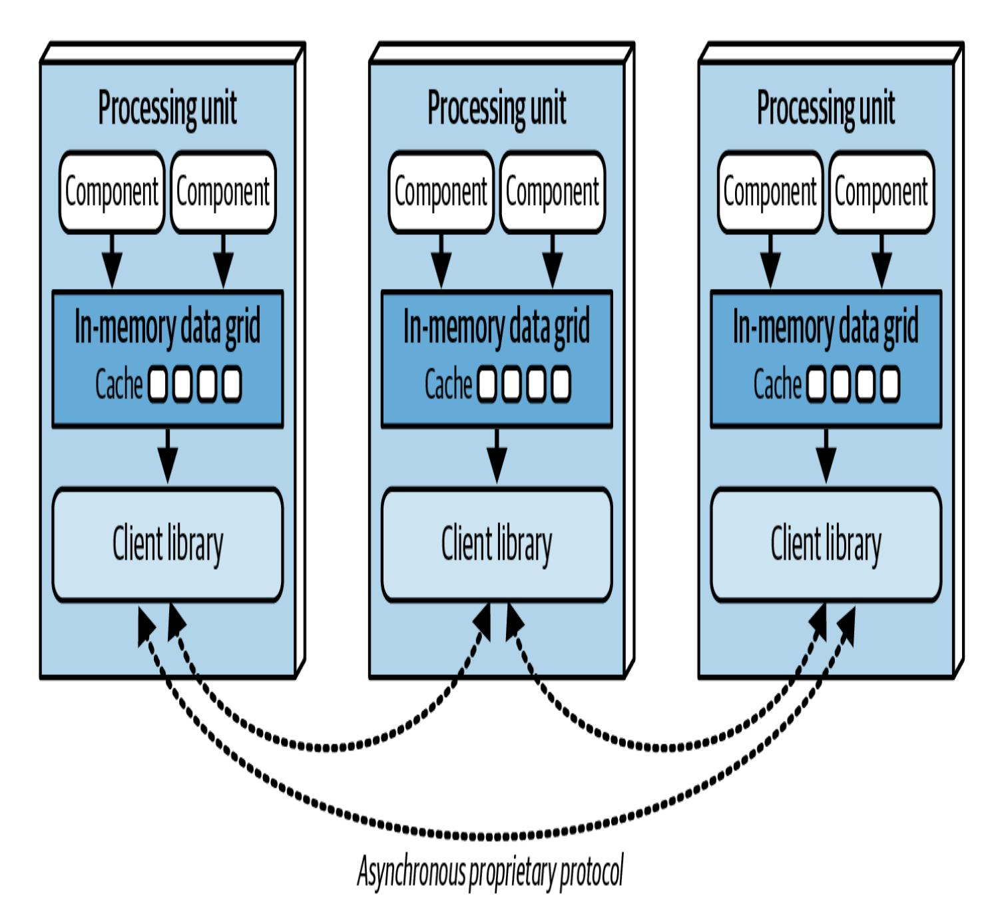

Abbildung 16-6. Repliziertes Caching synchronisiert In-Memory-Caches zwischen Verarbeitungseinheiten

Repliziertes Caching ist nicht nur extrem schnell, es bietet auch ein hohes Maß an Fehlertoleranz. Da es keinen zentralen Server gibt, der den Cache speichert, gibt es beim replizierten Caching keinen einzigen Fehlerpunkt. **[1](#page-67-0)**

<span id="page-20-0"></span>Repliziertes Caching ist zwar das Standard-Caching-Modell für raumbezogene Architekturen, aber es gibt einige Fälle, in denen es nicht verwendet werden kann. Das ist zum Beispiel der Fall, wenn das System große Datenmengen verarbeiten muss. Wenn der interne Cache-Speicher größer als 100 MB wird, muss jede Verarbeitungseinheit so viel Speicher verwenden, dass es zu Problemen mit der Elastizität und Skalierbarkeit kommen kann. Die Verarbeitungseinheiten werden in der Regel innerhalb einer virtuellen Maschine oder eines Containers (z. B. Docker) eingesetzt, die jeweils nur eine bestimmte Menge an Speicher für die interne Cache-Nutzung zur Verfügung haben. Dadurch ist die Anzahl der Instanzen der Verarbeitungseinheiten begrenzt, die für die Verarbeitung von Situationen mit hohem Durchsatz gestartet werden können.

Eine weitere Situation, in der replizierte Datencaches nicht gut funktionieren, ist, wenn die Cachedaten sehr häufig aktualisiert werden. Wie in ["Datenkollisionen"](#page-46-0) gezeigt, kann das Datengitter bei einer zu hohen Aktualisierungsrate der Cache-Daten nicht mithalten, was die Datenkonsistenz in allen Verarbeitungseinheiten beeinträchtigen kann. In solchen Situationen entscheiden sich die meisten Architekten für einen verteilten Cache.

*Verteiltes Caching*, wie in [Abbildung](#page-22-0) 16-7 dargestellt, erfordert einen externen Server oder Dienst, der einen zentralen Cache vorhält. Bei diesem Modell speichern die Verarbeitungseinheiten die Daten nicht im internen Speicher. Stattdessen verwenden sie ein eigenes Protokoll, um die Daten vom zentralen Cache-Server abzurufen. Das verteilte Caching ermöglicht ein hohes Maß an Datenkonsistenz, da die Daten an einem Ort gespeichert werden und nicht repliziert werden müssen. Allerdings ist dieses Modell nicht so leistungsfähig wie das replizierte Caching, da der Zugriff auf die Cache-Daten remote erfolgen muss, wodurch sich die Gesamtlatenz des Systems erhöht.

<span id="page-22-0"></span>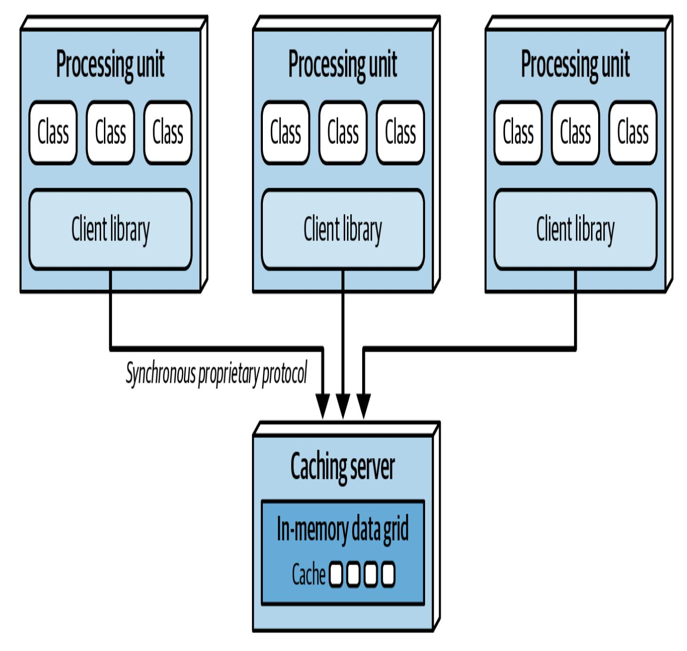

Abbildung 16-7. Verteiltes Caching schafft gute Datenkonsistenz zwischen den Verarbeitungseinheiten

Fehlertoleranz ist auch ein Problem beim verteilten Caching. Wenn der Cache-Server, der die Daten enthält, ausfällt, kann keine der Verarbeitungseinheiten auf die Daten zugreifen oder sie aktualisieren. Dieser Single Point of Failure kann durch die Spiegelung des verteilten Caches entschärft werden, aber das kann zu Konsistenzproblemen

führen, wenn der primäre Cache-Server unerwartet ausfällt und die Daten nicht auf den gespiegelten Cache-Server gelangen.

Wenn die Größe des Caches relativ klein ist (unter 100 MB) und die Aktualisierungsrate des Caches niedrig genug ist, dass die Replikations-Engine des Caching-Produkts mithalten kann, wird die Entscheidung zwischen einem replizierten Cache und einem verteilten Cache zu einer Frage der Priorisierung von Datenkonsistenz gegenüber Leistung und Fehlertoleranz. Ein verteilter Cache bietet immer eine bessere Datenkonsistenz als ein replizierter Cache, da sich die Daten an einem Ort befinden und nicht über mehrere Verarbeitungseinheiten verteilt sind. Die Leistung und Fehlertoleranz ist jedoch bei einem replizierten Cache immer besser. In vielen Fällen ist der entscheidende Faktor die *Art* der Daten, die in den Verarbeitungseinheiten zwischengespeichert werden. Wenn das System in erster Linie sehr konsistente Daten benötigt (z. B. Bestandszahlen der verfügbaren Produkte), ist ein verteilter Cache in der Regel die richtige Wahl. Wenn sich die Daten nicht oft ändern (z. B. Referenzdaten wie Name/Wert-Paare, Produktcodes und Produktbeschreibungen), solltest du einen replizierten Cache für schnelle Abfragen verwenden. [Tabelle](#page-24-0) 16-1 fasst einige Kriterien zusammen, anhand derer du entscheiden kannst, ob du einen verteilten oder einen replizierten Cache verwenden solltest.

<span id="page-24-0"></span>Tabelle 16-1. Verteiltes versus repliziertes Caching

| Entscheidungskriterien              | Replizierter<br>Cache | Verteilter<br>Cache         |
|-------------------------------------|-----------------------|-----------------------------|
| Optimierung                         | Leistung              | Konsistenz                  |
| Cache<br>Größe                      | Klein<br>(<100<br>MB) | Groß<br>(>500<br>MB)        |
| Art<br>der<br>Daten                 | Relativ<br>statisch   | Hoch<br>dynamisch           |
| Häufigkeit<br>der<br>Aktualisierung | Relativ<br>niedrig    | Hohe<br>Aktualisierungsrate |
| Fehlertoleranz                      | Hoch                  | Niedrig                     |

Bei der Wahl des Caching-Modells für die raumbezogene Architektur solltest du dich daran erinnern, dass in den meisten Fällen *beide* Modelle anwendbar sind. Mit anderen Worten: Weder das replizierte Caching noch das verteilte Caching lösen jedes Problem. Verschiedene Verarbeitungseinheiten können auch verschiedene Modelle verwenden. Anstatt einen Kompromiss zu schließen, indem du ein einziges, einheitliches Caching-Modell für die gesamte Anwendung wählst, solltest du jedes Modell für seine Stärken nutzen. Für eine Verarbeitungseinheit,

die den aktuellen Bestand verwaltet, solltest du zum Beispiel ein verteiltes Caching-Modell wählen, um die Datenkonsistenz zu gewährleisten; für eine Verarbeitungseinheit, die das Kundenprofil verwaltet, solltest du aus Gründen der Leistung und Fehlertoleranz einen replizierten Cache wählen.

#### **Near-Cache-Überlegungen**

Ein *Near-Cache* ist ein hybrides Caching-Modell, das In-Memory-Datengrids mit einem verteilten Cache verbindet. In diesem Modell (siehe [Abbildung](#page-26-0) 16-8) wird der verteilte Cache als *Full Backing Cache* bezeichnet, und jedes In-Memory-Datengitter innerhalb einer Verarbeitungseinheit wird als *Front Cache* bezeichnet. Der Front-Cache enthält immer eine kleinere Teilmenge des Full-Backing-Cache und verwendet eine *Räumungsrichtlinie*, um ältere Elemente zu entfernen, damit neue hinzugefügt werden können. Für den Front-Cache gibt es drei Möglichkeiten der Verdrängung: einen *Most Recently Used* Cache, der die zuletzt verwendeten Elemente enthält; einen *Most Frequent Used* Cache, der die am häufigsten verwendeten Elemente enthält; oder eine *Random Replacement* Eviction Policy, die Elemente nach dem Zufallsprinzip entfernt, wenn Platz benötigt wird. Die zufällige Ersetzung ist eine gute Räumungsstrategie, wenn es keine eindeutige Analyse der Daten gibt, die einen Grund liefert, entweder die zuletzt oder die am häufigsten verwendeten Elemente zu behalten.

<span id="page-26-0"></span>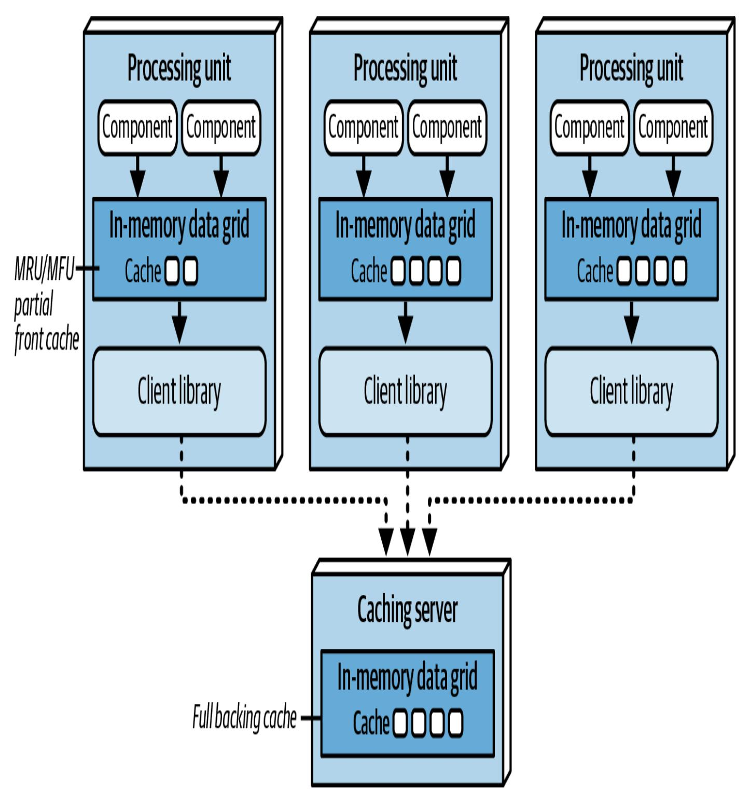

Abbildung 16-8. Das Near-Cache-Modell verwendet sowohl einen Front-Cache als auch einen Backing-Cache

Während die Front-Caches immer mit dem Full-Backing-Cache synchronisiert werden, werden die Front-Caches in den einzelnen Verarbeitungseinheiten nicht mit anderen Verarbeitungseinheiten synchronisiert, die dieselben Daten verwenden. Das bedeutet, dass mehrere Verarbeitungseinheiten, die denselben Datenkontext teilen (z. B. ein Kundenprofil), wahrscheinlich alle unterschiedliche Daten in ihren Front-Caches haben. Dies führt zu Unstimmigkeiten bei der Leistung und Reaktionsfähigkeit zwischen den Verarbeitungseinheiten. Wir empfehlen daher nicht, ein Near-Cache-Modell in einer raumbezogenen Architektur zu verwenden.

#### **Verarbeitung Raster**

Das in [Abbildung](#page-28-0) 16-9 dargestellte *Processing Grid* ist eine optionale Komponente innerhalb der virtualisierten Middleware, die die orchestrierte Verarbeitung von Anfragen verwaltet, wenn mehrere Verarbeitungseinheiten an einer einzigen Geschäftsanfrage beteiligt sind. Wenn eine Anfrage die Koordination zwischen mehr als einer Verarbeitungseinheit erfordert (z. B. zwischen einer auftragsverarbeitenden Einheit und einer zahlungsabwickelnden Einheit), vermittelt und orchestriert das Processing Grid die Anfrage zwischen diesen beiden Verarbeitungseinheiten.

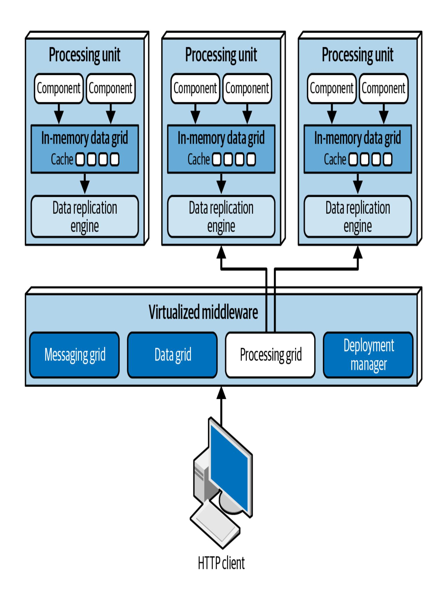

Die meisten modernen raumbasierten Implementierungen (vor allem solche mit feinkörnigen Diensten) implementieren ihre Processing-Grid-Funktionalität über separate, feinkörnige *Orchestrierungseinheiten* und nicht über eine einzige grobkörnige Orchestrierungs-Engine, wobei jede Orchestrierungseinheit einen einzelnen wichtigen Workflow abwickelt. Ein Beispiel aus dem E-Commerce: Wenn ein Kunde eine Bestellung aufgibt, müssen drei Verarbeitungseinheiten koordiniert werden: *Auftragserteilung*, *Zahlung* und *Bestandsanpassung*. Der Architekt könnte eine *Order Placement Orchestrator* Processing Unit erstellen, um diese drei Verarbeitungseinheiten zu orchestrieren. Er könnte auch separate Orchestrator-Verarbeitungseinheiten für andere wichtige Workflows erstellen, z. B. für die Bearbeitung von Auftragsrückgaben und die Wiederauffüllung des Bestands.

## **Einsatzleiter**

Die Komponente Deployment Manager verwaltet das dynamische Starten und Herunterfahren von Verarbeitungseinheiten auf der Grundlage von Lastbedingungen. Diese Komponente überwacht kontinuierlich die Antwortzeiten und die Benutzerlast, startet neue Verarbeitungseinheiten, wenn die Last steigt, und schaltet die Verarbeitungseinheiten ab, wenn die Last sinkt. Sie ist entscheidend, um eine variable Skalierbarkeit (Elastizität) innerhalb einer Anwendung zu erreichen. Die meisten Cloud-basierten Infrastrukturen übernehmen

diese Aufgabe, ebenso wie Service-Orchestrierungsprodukte wie [Kubernetes.](https://kubernetes.io/)

### **Datenpumpen**

Eine *Datenpumpe* ist eine Möglichkeit, Daten an einen anderen Prozessor zu senden, der dann eine Datenbank aktualisiert. Raumfahrtbasierte Architekturen benötigen Datenpumpen, weil die Verarbeitungseinheiten nicht direkt aus Datenbanken lesen und in sie schreiben. Datenpumpen in raumbasierten Architekturen sind immer asynchron, um die Konsistenz zwischen dem In-Memory-Cache und der Datenbank zu gewährleisten. Wenn eine Verarbeitungseinheit eine Anfrage erhält und ihren Cache aktualisiert, wird diese Verarbeitungseinheit zum Eigentümer der Aktualisierung und ist daher dafür verantwortlich, sie durch die Datenpumpe zu schicken, damit die Datenbank schließlich aktualisiert werden kann.

Datenpumpen werden in der Regel in einer raumbezogenen Architektur mit Messaging implementiert, wie in [Abbildung](#page-31-0) 16-10 dargestellt.

<span id="page-31-0"></span>

Abbildung 16-10. Datenpumpen werden verwendet, um Daten an eine Datenbank zu senden

Messaging unterstützt nicht nur die asynchrone Kommunikation, sondern auch die garantierte Zustellung, die Persistenz der Nachrichten und die Reihenfolge der Nachrichten durch die FIFO-Warteschlange (First-in, First-out). Außerdem entkoppelt Messaging die Verarbeitungseinheit und den Datenschreiber, so dass die Verarbeitung in den Verarbeitungseinheiten nicht unterbrochen wird, wenn der Datenschreiber nicht verfügbar ist.

Die meisten raumbezogenen Architekturen haben mehrere Datenpumpen. Normalerweise ist jede von ihnen für eine bestimmte Domäne oder Subdomäne (z. B. Kunde oder Inventar) zuständig, aber sie können auch für jeden Cache-Typ (z. B. CustomerProfile , CustomerWishlist , usw.) oder für eine Verarbeitungseinheit (z. B. Customer ) zuständig sein, die auch einen viel größeren allgemeinen Cache enthält.

Datenpumpen haben in der Regel Verträge, einschließlich einer Aktion, die mit den Vertragsdaten verknüpft ist (hinzufügen, löschen oder aktualisieren). Der Vertrag kann ein JSON-Schema, ein XML-Schema, ein Objekt oder sogar eine *wertgesteuerte Nachricht* (eine Map-Nachricht mit Name-Wert-Paaren) sein. Bei Aktualisierungen enthält die Nutzlast der Datenpumpe in der Regel nur die neuen Datenwerte. Wenn ein Kunde zum Beispiel die Telefonnummer in seinem Profil geändert hat, wird nur die neue Telefonnummer zusammen mit der Kunden-ID und einer Aktion zur Aktualisierung der Daten gesendet.

#### **Datenschreiber**

Die Komponente Data Writer nimmt Nachrichten von einer Datenpumpe entgegen und aktualisiert die Datenbank mit den Informationen in ihren Payloads (siehe [Abbildung](#page-31-0) 16-10). Datenschreiber können als [Dienste, Anwendungen](https://abinitio.com/) oder Datendrehscheiben (wie Ab Initio) implementiert werden. Ihre Granularität kann je nach dem Umfang der Datenpumpen und Verarbeitungseinheiten variieren.

Ein *domänenbasierter Data Writer* enthält die notwendige Datenbanklogik, um alle Aktualisierungen innerhalb einer bestimmten Domäne (z. B. Auftragsabwicklung) zu verarbeiten, unabhängig von der Anzahl der Datenpumpen, aus denen er liest. Das System in Abbildung 16-11 hat vier verschiedene [Verarbeitungseinheiten](#page-34-0) und vier verschiedene Datenpumpen, um die Kundendomänen ( Profile , WishList , Wallet und Preferences ) zu repräsentieren, aber nur einen Data Writer. Dieser einzige Data Writer hört auf alle vier Data Pumps und enthält die Datenbanklogik (z. B. SQL), um die kundenbezogenen Daten in der Datenbank zu aktualisieren.

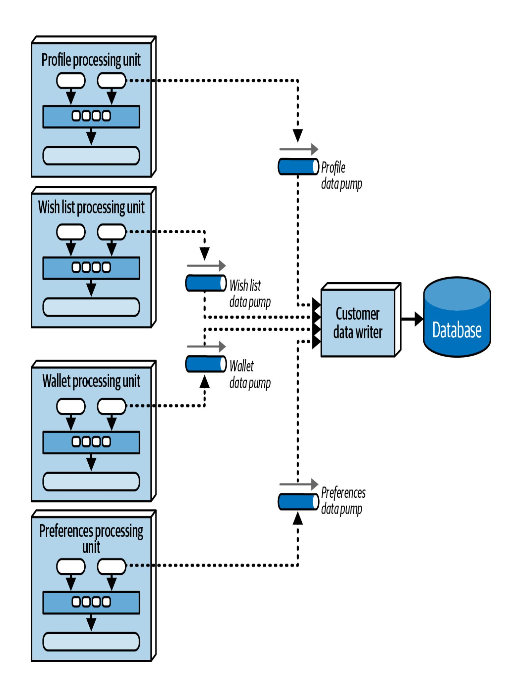

Alternativ kann jede Klasse von Verarbeitungseinheiten ihre eigene Data Writer Komponente haben, wie in [Abbildung](#page-36-0) 16-12 dargestellt. In diesem Modell ist jeder Data Writer einer entsprechenden Data Pump zugeordnet und enthält nur die Datenbankverarbeitungslogik für die jeweilige Verarbeitungseinheit (z. B. Wallet ). Dieses Modell führt zwar zu einer Vielzahl von Data-Writer-Komponenten, bietet aber eine bessere Skalierbarkeit und Agilität, weil es die Verarbeitungseinheit, die Data Pump und den Data Writer aufeinander abstimmt.


## **Datenleser**

Während die Datenschreiber für die Aktualisierung der Datenbank zuständig sind, lesen die *Datenleser* die Daten aus der Datenbank und senden sie über eine *umgekehrte Datenpumpe* (auf die wir gleich noch näher eingehen werden) an die Verarbeitungseinheiten. In raumbasierten Architekturen werden Datenleser nur in einer von drei Situationen aufgerufen: Alle Verarbeitungseinheiten desselben Named Cache stürzen ab, alle Verarbeitungseinheiten innerhalb desselben Named Cache werden umverteilt oder es müssen Archivdaten abgerufen werden, die nicht im replizierten Cache enthalten sind.

Wenn alle Instanzen aufgrund eines systemweiten Absturzes oder einer Neuverteilung ausfallen, müssen die Daten aus der Datenbank in den Cache geladen werden - etwas, das wir in einer raumbezogenen Architektur in der Regel zu vermeiden versuchen. Wenn die Instanzen einer Klasse von Verarbeitungseinheiten wieder in Betrieb genommen werden, versucht jede, eine Sperre im Cache zu erhalten. Der erste, der die Sperre erhält, wird zum vorübergehenden Besitzer des Caches; die anderen gehen in einen Wartezustand, bis die Sperre freigegeben wird. (Dies kann je nach Art der Cache-Implementierung variieren, aber in jedem Fall gibt es in diesem Szenario einen primären Besitzer des Caches). Um den Cache zu laden, sendet der temporäre Cache-Besitzer eine Nachricht an eine Warteschlange, in der er Daten anfordert. Die Komponente Data Reader nimmt die Leseanforderung an und führt

dann die notwendige Datenbankabfrage-Logik aus, um die benötigten Daten abzurufen. Sie sendet diese Daten an eine andere Warteschlange, die sogenannte Reverse Data Pump, die sie an die Verarbeitungseinheit des temporären Cache-Besitzers weiterleitet. Sobald sie den Cache geladen hat, gibt der temporäre Eigentümer die Sperre frei. Alle anderen Instanzen werden dann synchronisiert und die Verarbeitung kann beginnen. Dieser Verarbeitungsablauf ist in [Abbildung](#page-39-0) 16-13 dargestellt.

<span id="page-39-0"></span>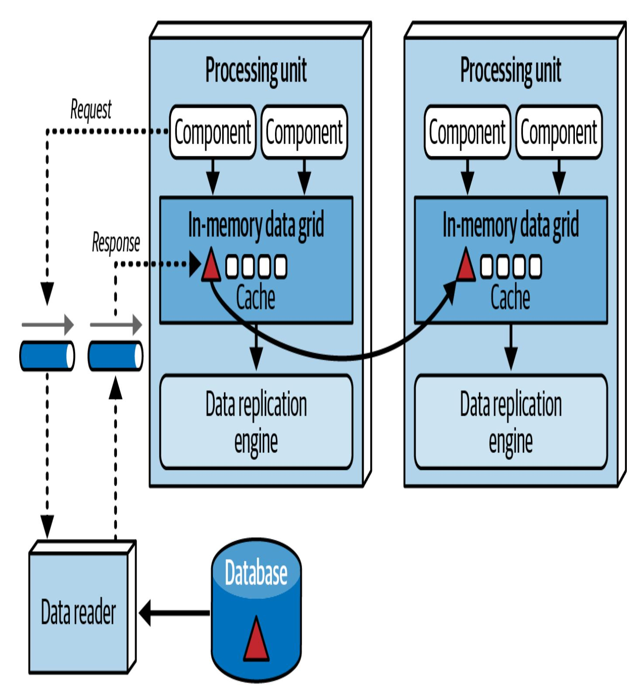

Abbildung 16-13. Datenleser senden Daten an die Verarbeitungseinheiten

Wie Datenschreiber können auch Datenleser domänenbasiert oder für eine bestimmte Klasse von Verarbeitungseinheiten bestimmt sein (letzteres ist häufiger der Fall). Auch die Implementierung ist dieselbe

wie bei den Datenschreibern - Dienst, Anwendung oder Datendrehscheibe.

Die Datenschreiber und Datenleser bilden im Wesentlichen eine *Datenabstraktionsschicht* (oder *Datenzugriffsschicht*, in einigen Fällen). Der Unterschied zwischen den beiden besteht darin, wie viel Detailwissen die Verarbeitungseinheiten über das Datenbankschema (die Struktur der Tabellen) haben. Bei einer Datenzugriffsschicht sind die Verarbeitungseinheiten an die zugrunde liegenden Datenstrukturen in der Datenbank gekoppelt und greifen nur indirekt über die Datenleser und -schreiber auf die Datenbank zu. Bei einer Datenabstraktionsschicht hingegen ist die Verarbeitungseinheit durch die Verwendung separater Verträge von den zugrunde liegenden Schemata entkoppelt.

Die raumbasierte Architektur stützt sich im Allgemeinen auf ein Datenabstraktionsschichtmodell, so dass sich das replizierte Cache-Schema in jeder Verarbeitungseinheit von den zugrunde liegenden Datenbankschemata unterscheiden kann. Das bedeutet, dass sich inkrementelle Änderungen an der Datenbank nicht unbedingt auf die Verarbeitungseinheiten auswirken. Um diese inkrementelle Änderung zu erleichtern, enthalten die Datenschreiber und -leser eine Transformationslogik. Wenn sich ein Spaltentyp ändert oder eine Spalte oder Tabelle gelöscht wird, können die Datenleser und -schreiber die Datenbankänderung puffern, bis die notwendigen Änderungen in den Caches der Verarbeitungseinheiten vorgenommen werden können.

# Daten-Topologien

Da die Verarbeitungseinheiten nicht direkt mit der Datenbank interagieren, ist die raumbezogene Architektur enorm flexibel in Bezug auf die möglichen Datenbanktopologien. Die Verwendung asynchroner Datenpumpen in Kombination mit Datenlesern und -schreibern bedeutet, dass die Anforderungsverarbeitung (transaktional) weitgehend unabhängig von der Datenbank ist, was dem Architekten eine große Auswahl an Möglichkeiten hinsichtlich der Datenbanktopologie und des Datenbanktyps bietet.

Die Wahl der Datenbanktopologie wird von einer Vielzahl von Faktoren beeinflusst. Bei einer raumbezogenen Architektur ist der wichtigste Faktor, wie das System die Datenbank nutzen wird. Wenn zum Beispiel das Berichtswesen und die Datenanalyse besonders wichtig sind, könnte eine monolithische Datenbanktopologie effektiver sein - es sei denn, das Berichtswesen und die Datenanalyse erfolgen über ein Data Mesh, in diesem Fall wäre eine domänenbasierte Datenbanktopologie besser.

Bei der Wahl der Datenbanktopologie sind auch der Durchsatz und die allgemeine Datenkonsistenz auf Domänenbasis zu berücksichtigen. Eine einzelne monolithische Datenbank könnte sich bei der Synchronisierung als Engpass erweisen, was die Synchronisierungszeit insgesamt verlangsamt und die Datenkonsistenz beeinträchtigt; eine domänenbasierte Datenbanktopologie könnte eine bessere Gesamtsynchronisierungszeit und damit Datenkonsistenz bieten, wenn die Daten sauber in Domänen partitioniert werden können. Wenn nachgelagerte Systeme die Datenbank zur weiteren Verarbeitung nutzen

müssen, ist eine monolithische Datenbanktopologie möglicherweise besser geeignet.

# Überlegungen zur Cloud

Die raumbezogene Architektur bietet einige einzigartige Optionen, wenn es um die Einsatzumgebung geht. Das gesamte System - einschließlich der Verarbeitungseinheiten, der virtualisierten Middleware, der Datenpumpen, der Datenleser und -schreiber und der Datenbank - kann in Cloud-basierten Umgebungen oder vor Ort (on-premise) eingesetzt werden. Diese Architektur kann jedoch auch in *beiden Umgebungen gleichzeitig* eingesetzt werden (siehe [Abbildung](#page-43-0) 16-14), eine einzigartige und leistungsstarke Funktion, die in anderen Architekturen nicht zu finden ist. In dieser hybriden Topologie werden die Anwendungen über Verarbeitungseinheiten und virtualisierte Middleware in verwalteten Cloud-basierten Umgebungen bereitgestellt, während die physischen Datenbanken und die entsprechenden Daten vor Ort verbleiben. Dank der asynchronen Datenpumpen und des Konsistenzmodells dieser Architektur wird eine sehr effektive Cloud-basierte Datensynchronisierung unterstützt. Die Transaktionsverarbeitung kann in dynamischen, elastischen Cloud-basierten Umgebungen stattfinden, während die physische Datenverwaltung, das Berichtswesen und die Datenanalyse in sicheren On-Premise-Umgebungen bleiben.

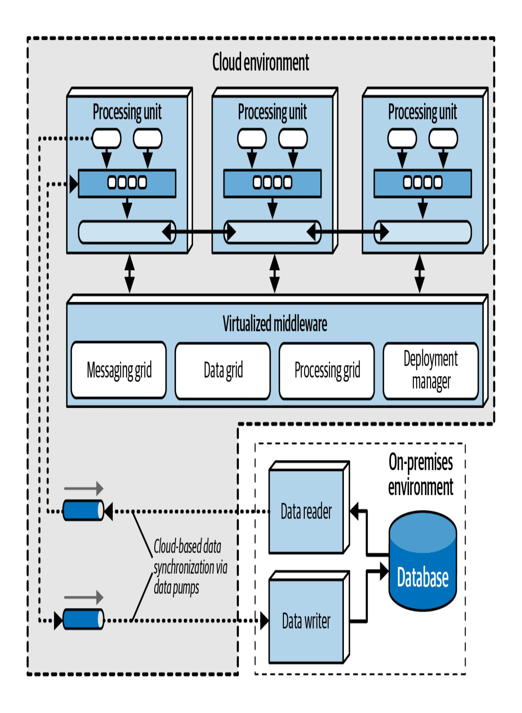

Die elastische Natur der Cloud-Infrastruktur und der Cloud-basierten Dienste - ob hybrid oder nicht - passt gut zu diesem Architekturstil und macht Cloud-basierte Umgebungen zu einer guten Wahl für raumbezogene Architekturen.

## <span id="page-44-0"></span>Gemeinsame Risiken

Es überrascht nicht, dass die meisten Risiken, die mit dem raumbezogenen Architekturstil verbunden sind, mit Daten zu tun haben, da sie im Caching und in der Hintergrundsynchronisation von Daten verwendet werden. In den folgenden Abschnitten werden einige gängige Risiken beschrieben.

## **Häufiges Auslesen der Datenbank**

Die raumbezogene Architektur erreicht eine hohe Skalierbarkeit und Gleichzeitigkeit, indem sie alle Transaktionsdaten zwischenspeichert. Dadurch wird verhindert, dass das System übermäßig viele Lese- und Schreibvorgänge in der Datenbank durchführt, was die Skalierbarkeit, Elastizität und Reaktionsfähigkeit des Systems insgesamt beeinträchtigen kann, so dass die Vorteile dieses Architekturstils nur schwer genutzt werden können.

Datenbanklesungen kommen in der Regel nur in zwei Fällen vor: beim Lesen archivierter Daten (z. B. Auftragshistorie oder vergangene

Kontoauszüge) oder beim *Kaltstart* einer Verarbeitungseinheit (dem ersten Start einer Verarbeitungseinheit, wenn keine anderen Instanzen laufen). Wenn die zwischengespeicherten Datenmengen so groß sind, dass die meisten Daten archiviert und aus der Backup-Datenbank abgerufen werden müssen, oder wenn die Verarbeitungseinheiten abstürzen oder häufig neu eingesetzt werden, ist dies möglicherweise nicht die richtige Architektur für den Problembereich.

## **Datensynchronisation und -konsistenz**

Da Datenpumpen und Datenschreiber die Daten zwischen dem In-Memory-Cache und der Datenbank synchronisieren, sind die Daten in einer raumbasierten Architektur letztendlich immer konsistent. Da dieser Stil jedoch in der Regel in Situationen mit einer sehr hohen gleichzeitigen Benutzerlast eingesetzt wird, kommt es häufig zu Engpässen in der Datenpumpe. Diese Engpässe können dazu führen, dass die Daten nur mit erheblicher Verzögerung in der Backup-Datenbank ankommen. Dies kann ein erhebliches Risiko darstellen, wenn nachgelagerte Systeme schnell auf aktualisierte Daten angewiesen sind.

Ein weiteres inhärentes Risiko bei der Datensynchronisierung ist der Datenverlust innerhalb der Datenpumpe. Dieses Risiko wird in der Regel durch die Verwendung von *persistenten Warteschlangen* (bei denen die Daten in einer Warteschlange nicht nur im Speicher, sondern auch auf der Festplatte gespeichert werden) und die Verwendung des Client-Acknowledgment-Modus in den Datenschreibern beim Lesen aus der

Datenpumpe gemindert. Im Client-Acknowledgment-Modus bleibt die Nachricht so lange in der Warteschlange, bis der Datenschreiber dem Message Broker bestätigt, dass er die Verarbeitung abgeschlossen hat. Während der Verarbeitung der Nachricht stellt der Message Broker sicher, dass kein anderer Datenschreiber die in Bearbeitung befindliche Nachricht lesen kann. Diese Techniken helfen zwar dabei, Datenverluste in der Datenpumpe zu verhindern, können aber auch die Reaktionsfähigkeit insgesamt verlangsamen und die Datenkonsistenz beeinträchtigen.

## **Hohe Datenvolumina**

Da der gesamte Transaktionsspeicher in den Verarbeitungseinheiten zwischengespeichert wird, muss das Datenvolumen relativ gering bleiben, insbesondere wenn mehr Instanzen einer Verarbeitungseinheit hinzugefügt werden. Deshalb ist es wichtig, die Größe des In-Memory-Cache genau zu beachten, um zu verhindern, dass einer Verarbeitungseinheit der Speicher ausgeht und sie dadurch abstürzt.

#### <span id="page-46-0"></span>**Datenkollisionen**

Eine *Datenkollision* tritt auf, wenn Daten in einer Cache-Instanz (Cache A) aktualisiert werden und während der Replikation in eine andere Cache-Instanz (Cache B) die gleichen Daten von diesem Cache (Cache B) aktualisiert werden. Das kann passieren, wenn repliziertes Caching im *Aktiv/Aktiv-Zustand* verwendet wird, d.h. wenn mehrere Verarbeitungseinheiten dieselben Daten gleichzeitig aktualisieren

können. Zu Kollisionen kommt es in der Regel, wenn die Aktualisierungsrate der Daten im Cache die *Replikationslatenz (RL)*übersteigt - die Zeit, die benötigt wird, um jeden gleichnamigen Cache zu synchronisieren. In diesem Fall wird die lokale Aktualisierung in Cache B durch die alten Daten aus Cache A überschrieben, und die gleichen Daten in Cache A werden durch die Aktualisierung aus Cache B überschrieben.

Um das Problem der Datenkollision zu veranschaulichen, nehmen wir an, dass es zwei Service-Instanzen (A und B) eines Bestelldienstes gibt, die jeweils einen replizierten Cache des Produktbestands (blaue Widgets) enthalten. Der Ablauf ist wie folgt:

- 1. Der aktuelle Lagerbestand beträgt 500 Einheiten in jeder Instanz A und B.
- 2. Instanz A erhält eine Anfrage von einem Kunden, der 10 Einheiten kaufen möchte, und aktualisiert den Bestandscache für blaue Widgets auf 490 Einheiten.
- 3. Bevor die Daten von Instanz A an Instanz B repliziert werden können, erhält Instanz B eine Kaufanfrage für 5 Einheiten und aktualisiert den Bestandscache für blaue Widgets auf 495 Einheiten.
- 4. Der Cache in Instanz B wird aufgrund der Replikation der Aktualisierung von Instanz A auf 490 Einheiten aktualisiert.
- 5. Der Cache in Instanz A wird durch die Replikation der Aktualisierung von Instanz B auf 495 Einheiten aktualisiert.
- 6. Beide Caches sind falsch und nicht synchron: Der Bestand sollte in jeder der Instanzen 485 Einheiten betragen.

Es gibt mehrere Faktoren, die beeinflussen, wie viele Datenkollisionen auftreten können: die Anzahl der Instanzen der Verarbeitungseinheit, die denselben Cache enthalten, die Aktualisierungsrate des Caches, die Größe des Caches und die RL des Caching-Produkts. Anhand dieser Faktoren können wir mit der folgenden Formel probabilistisch bestimmen, wie viele potenzielle Datenkollisionen auftreten können:

$$CollisionRate = N*rac{UR^2}{S}*RL$$

Dabei steht *N* für die Anzahl der Service-Instanzen, die denselben Cache verwenden. *UR* steht für die Aktualisierungsrate in Millisekunden (zum Quadrat), *S* für die Cache-Größe (in Anzahl der Zeilen) und *RL* für die Replikationslatenz des Caching-Produkts (in Millisekunden).

Diese Formel ist nützlich, um den Prozentsatz der Datenkollisionen zu bestimmen, die bei Aktualisierungen innerhalb eines bestimmten Zeitrahmens (z. B. jede Stunde) wahrscheinlich auftreten werden, und um festzustellen, wie praktikabel es für dieses System wäre, das replizierte Caching zu verwenden. Betrachte zum Beispiel die Werte in [Tabelle](#page-49-0) 16-2 für die Faktoren, die bei dieser Berechnung eine Rolle spielen.

<span id="page-49-0"></span>Tabelle 16-2. Basiswerte

Aktualisierungsrate (UR): 20 Aktualisierungen/Sekunde

Anzahl der Instanzen (N): 5

Cache-Größe (S): 50.000 Zeilen

Replikationslatenz (RL): 100 Millisekunden

Updates: 72.000 pro Stunde

Kollisionsrate: 14,4 pro Stunde

Prozentsatz: 0.02%

Wendet man diese Faktoren auf die Formel an, erhält man 72.000 Aktualisierungen pro Stunde, wobei die Wahrscheinlichkeit hoch ist, *dass* 14 Aktualisierungen der gleichen Daten aufeinandertreffen. Angesichts des geringen Prozentsatzes (0,02%) wäre eine Replikation eine praktikable Option.

Schwankungen in der RL können erhebliche Auswirkungen auf die Datenkonsistenz haben. Die Replikationslatenz hängt von vielen Faktoren ab, darunter die Art des Netzwerks und die physische Entfernung zwischen den Verarbeitungseinheiten. RL-Werte müssen berechnet und aus tatsächlichen Messungen in einer Produktionsumgebung abgeleitet werden, weshalb sie selten veröffentlicht werden. Der im vorherigen Beispiel verwendete Wert von 100 ms ist eine gute Planungsgröße, wenn die tatsächliche RL nicht verfügbar ist. Wenn du die RL von 100 ms auf 1 ms änderst, erhältst du die gleiche Anzahl an Aktualisierungen (72.000 pro Stunde), aber die Wahrscheinlichkeit, dass es zu Kollisionen kommt, ist viel geringer (0,1 Kollisionen pro Stunde). Dieses Szenario ist in [Tabelle](#page-50-0) 16-3 dargestellt.

<span id="page-50-0"></span>Tabelle 16-3. Auswirkungen auf die Replikationslatenz

| Aktualisierungsrate | 20                       |
|---------------------|--------------------------|
| (UR):               | Aktualisierungen/Sekunde |
|                     |                          |

| Anzahl<br>der<br>Instanzen<br>(N): | 5 |
|------------------------------------|---|
|------------------------------------|---|

| Cache-Größe | 50.000 |
|-------------|--------|
| (S):        | Zeilen |

Replikationslatenz (RL): 1 Millisekunde (geändert von 100)

Updates: 72.000 pro Stunde

Kollisionsrate: 0,1 pro Stunde

Prozentsatz: 0.0002%

Die Anzahl der Verarbeitungseinheiten, die denselben benannten Cache enthalten (dargestellt durch *N*), steht ebenfalls in direktem Verhältnis zur Anzahl der möglichen Datenkollisionen. Wenn du zum Beispiel die Anzahl der Verarbeitungseinheiten von 5 Instanzen auf 2 Instanzen reduzierst, ergibt sich eine Datenkollisionsrate von nur 6 pro Stunde, bei 72.000 Aktualisierungen pro Stunde, wie in [Tabelle](#page-51-0) 16-4 dargestellt.

<span id="page-51-0"></span>Tabelle 16-4. Auswirkungen auf die Anzahl der Instanzen von Verarbeitungseinheiten

| Aktualisierungsrate | 20                       |
|---------------------|--------------------------|
| (UR):               | Aktualisierungen/Sekunde |
|                     |                          |

| Anzahl    | 2         |
|-----------|-----------|
| der       | (geändert |
| Instanzen | von       |
| (N):      | 5)        |

Replikationslatenz (RL): 100 Millisekunden

Updates: 72.000 pro Stunde

Kollisionsrate: 5,8 pro Stunde

Prozentsatz: 0.008%

Die Cache-Größe ist der einzige Faktor, der sich umgekehrt proportional zur Kollisionsrate verhält: Wenn die Cache-Größe abnimmt, steigt die

Kollisionsrate. Wenn du in diesem Beispiel die Cache-Größe von 50.000 Zeilen auf 10.000 Zeilen reduzierst (und alles andere wie im ersten Beispiel beibehältst), ergibt sich eine Kollisionsrate von 72 pro Stunde, also deutlich mehr als bei 50.000 Zeilen (siehe [Tabelle](#page-52-0) 16-5).

<span id="page-52-0"></span>Tabelle 16-5. Auswirkungen auf die Cache-Größe

| Aktualisierungsrate<br>(UR):       | 20<br>Aktualisierungen/Sekunde                  |
|------------------------------------|-------------------------------------------------|
| Anzahl<br>der<br>Instanzen<br>(N): | 5                                               |
| Cache-Größe<br>(S):                | 10.000<br>Zeilen<br>(geändert<br>von<br>50.000) |
| Replikationslatenz<br>(RL):        | 100<br>Millisekunden                            |
|                                    |                                                 |
| Updates:                           | 72.000<br>pro<br>Stunde                         |
| Kollisionsrate:                    | 72,0<br>pro<br>Stunde                           |
| Prozentsatz:                       | 0.1%                                            |

Unter normalen Umständen haben die meisten Systeme keine konstanten Aktualisierungsraten über einen langen Zeitraum (z. B. einen Acht-Stunden-Tag). Wenn du diese Berechnung verwendest, empfehlen wir dir, die maximale Aktualisierungsrate deines Systems während der

Spitzenlast zu kennen und die minimalen, normalen und maximalen Kollisionsraten zu berechnen.

## Governance

Die raumbasierte Architektur mit ihren vielen beweglichen Teilen ist ein komplizierter Architekturstil, den es zu entwerfen und umzusetzen gilt. Eine ordnungsgemäße Verwaltung ist entscheidend für den Erfolg insbesondere für die Kontrolle des Speicherverbrauchs, da es bei dieser Art von Architektur Probleme mit der internen Speichernutzung gibt (wie wir bereits im Abschnitt ["Allgemeine](#page-44-0) Risiken" erwähnt haben [\).](#page-44-0)

Um diese Speicherprobleme zu lösen, empfehlen wir, eine kontinuierliche, automatisierte Governance-Fitnessfunktion zu schreiben, damit jede Instanz einer Verarbeitungseinheit ihre aktuelle Speichernutzung regelmäßig meldet. Da alle Instanzen einer Verarbeitungseinheit über denselben replizierten Cache verfügen, muss die Fitnessfunktion nur den Namen der Verarbeitungseinheit melden. Verwende eine separate Fitnessfunktion, um die Anzahl der Instanzen für jede Verarbeitungseinheit zu erfassen, damit du den gesamten Speicherverbrauch pro Verarbeitungseinheit berechnen kannst. [Abbildung](#page-54-0) 16-15 zeigt ein Beispiel für die Ausgabe einer solchen kontinuierlichen Fitnessfunktion.

<span id="page-54-0"></span>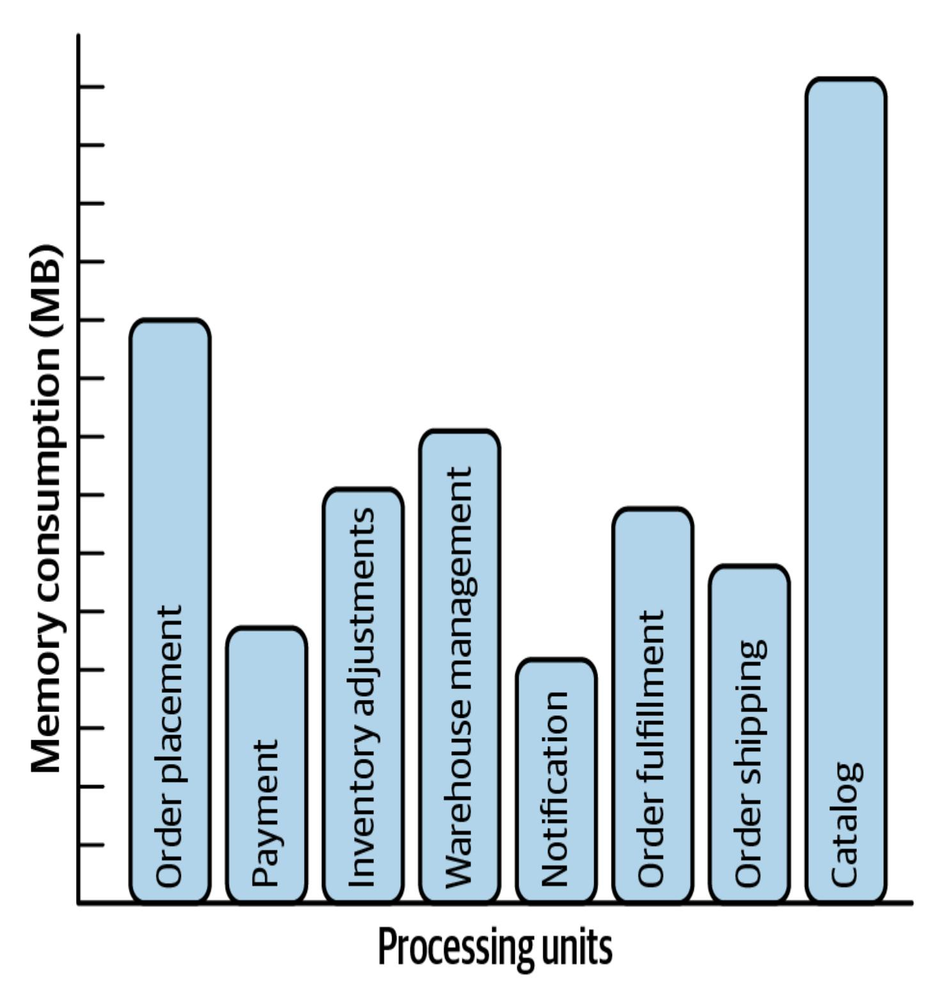

Abbildung 16-15. Ein Beispiel für eine Fitnessfunktion zum Verfolgen des Speicherverbrauchs

Eine weitere nützliche Governance-Strategie zur Aufrechterhaltung der allgemeinen Datenkonsistenz ist die Verfolgung und Messung der Synchronisationszeit - also der Zeit, die eine Cache-Aktualisierung für die Synchronisation mit der entsprechenden Datenbank benötigt. Eine gute Methode besteht darin, dass jede Verarbeitungseinheit die Anforderungs-ID einer Aktualisierung zusammen mit dem entsprechenden Zeitstempel überträgt und dass jeder Datenschreiber dieselbe Anforderungs-ID zusammen mit dem Zeitstempel nach der Datenbankübertragung überträgt. Dann schreibst du eine Fitnessfunktion, die diese Anfrage-IDs miteinander verknüpft und die Zeitstempel subtrahiert, um die Synchronisationszeit zu berechnen. Die Fitnessfunktion könnte dies auf atomarer Ebene verfolgen, indem sie die Zeiten einer bestimmten Verarbeitungseinheit verwendet, oder ganzheitlich, indem sie den Durchschnitt der gesamten Synchronisationszeiten bildet. Die Analyse dieser Trends hilft den Architekten, die Auswirkungen von Änderungen an der Architektur zu verfolgen, z. B. ob sich die Synchronisationszeiten durch die Änderungen verbessern oder verschlechtern und ob die Architektur die Ziele des Unternehmens in Bezug auf die Synchronisationszeiten erfüllt. [Abbildung](#page-56-0) 16-16 veranschaulicht diese Art der Steuerung anhand einer kontinuierlichen Fitnessfunktion.

<span id="page-56-0"></span>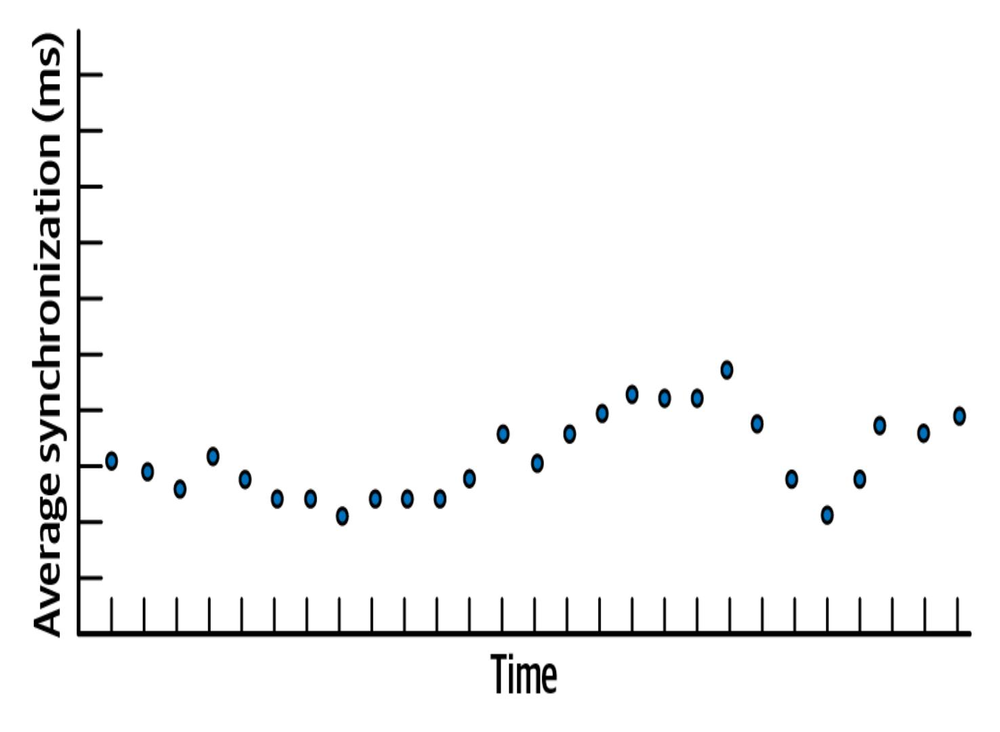

Abbildung 16-16. Ein Beispiel für eine Fitnessfunktion zur Verfolgung der durchschnittlichen Synchronisationszeiten

Wie wir bereits festgestellt haben, können Datenpumpen einen Engpass im Gesamtsystem bilden, weil sie in einer raumbezogenen Architektur als Rückstau fungieren und weil Datenbankschreibvorgänge länger dauern als Cache-Schreibvorgänge. Um dies zu verhindern, empfehlen wir, diese Art von Engpass zu verfolgen und zu messen, wenn er auftritt. Um das Ausmaß des Engpasses festzustellen, schreibe zunächst eine Fitnessfunktion, um die Tiefe der Warteschlange in den Datenpumpen

zu verfolgen. Ein zu großer Engpass erhöht die Synchronisationszeit (und damit die Datenkonsistenz) und erhöht auch die Wahrscheinlichkeit von Datenverlusten und Datenkollisionen, insbesondere in Zeiten hoher Benutzer-Concurrency. Wie die vorherige Fitnessfunktion kann diese Funktion atomare Berichte über jede einzelne Datenpumpen-Warteschlange erstellen oder den Gesamtdurchschnitt des Systems aggregieren. [Abbildung](#page-58-0) 16-17 zeigt eine Engpassanalyse für eine *Auftragsbearbeitungseinheit* und die dazugehörige Datenpumpe in einem typischen Auftragsbearbeitungssystem.

<span id="page-58-0"></span>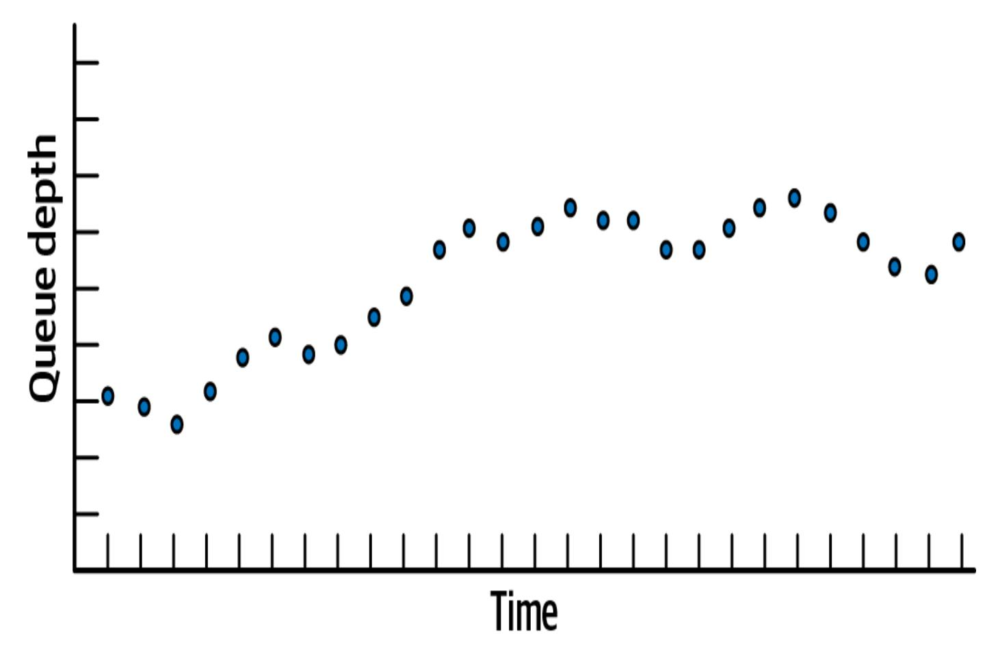

Abbildung 16-17. Ein Beispiel für eine Fitnessfunktion zur Verfolgung von Engpässen bei der Datenpumpe

Andere Governance-Fitnessfunktionen für eine raumbezogene Architektur könnten die Häufigkeit von Lesevorgängen in der Datenbank (Anfragen an Datenleser) erfassen, die sich auf Skalierbarkeit, Elastizität und Reaktionsfähigkeit auswirken können. Es ist auch eine gute Idee, Fitnessfunktionen zu verwenden, um Skalierbarkeit, Elastizität und Reaktionsfähigkeit zu messen: Da diese architektonischen Merkmale die Hauptgründe für den Einsatz einer

raumbasierten Architektur sind, ist es sinnvoll, sie zu verfolgen und zu messen.

# Überlegungen zur Team-Topologie

Obwohl die raumbasierte Architektur aufgrund der vielen Artefakte, die eine bestimmte Domäne oder Subdomäne ausmachen, weitgehend als technisch partitionierte Architektur gilt, ist sie am effektivsten mit technisch partitionierten Teams, die auf die technischen Bereiche ausgerichtet sind (z. B. Funktionalität, Datenpumpen, Datenleser und schreiber und Backend-Datenbankmanagement). Es kann aber auch gut funktionieren, wenn Teams nach Bereichen ausgerichtet sind (z. B. funktionsübergreifende Teams mit Spezialisierung). Hier sind einige Punkte, die du beachten solltest, wenn du die spezifischen Teamtopologien, die in ["Teamtopologien](#page--1-2) und Architektur" beschrieben sind, mit der raumbasierten Architektur in Einklang bringst:

#### *Auf den Strom ausgerichtete Teams*

Je nach Größe des Systems können Teams, die sich an Streams orientieren, Schwierigkeiten haben, domänenbasierte Änderungen aufgrund der technischen Partitionierung in diesem Architekturstil umzusetzen. Eine Stream-basierte Änderung kann sich zum Beispiel auf eine oder mehrere Verarbeitungseinheiten, Datenpumpen, Datenleser, Datenschreiber, Cache-Verträge oder Orchestratoren sowie auf die Datenbank auswirken. Das kann für ein einzelnes Streambasiertes Team eine Menge sein, vor allem, wenn diese Artefakte von anderen Teams genutzt werden. Je größer und komplexer das System

ist, desto weniger effektiv sind Stream-basierte Teams mit einer Spacebasierten Architektur.

#### *Teams befähigen*

Da einige der Artefakte dieses Stils (Datenpumpen, Datenleser, Datenschreiber und virtualisierte Middleware) gemeinsam genutzt werden oder übergreifend sind, eignet er sich gut für Enabling Teams. Wenn sich ein Team einem bestimmten Artefakt widmet (z. B. einem Datenschreiber und der dazugehörigen Datenpumpe), können die Teammitglieder experimentieren und Wege finden, diese Artefakte effizienter zu gestalten, unabhängig von dem Team, das an der Hauptfunktionalität in einer bestimmten Verarbeitungseinheit arbeitet.

#### *Teams mit komplizierten Subsystemen*

Teams für komplizierte Systeme können die technische Partitionierung des raumbezogenen Architekturstils nutzen, um sich auf einen Teil des Systems zu konzentrieren (z. B. das Datengitter oder die Datenpumpen). Einige dieser Artefakte können sehr komplex werden und eignen sich daher gut für die Topologie von Teams für komplizierte Teilsysteme. Der Umgang mit Datenkollisionen (siehe ["Datenkollisionen"\)](#page-46-0) und anderen Arten von asynchronen Datensynchronisationsfehlern in den Datenschreibern ist ziemlich komplex; dies ist ein gutes Beispiel für ein kompliziertes Subsystem, um das sich funktionale domänenbasierte Teams, die an Verarbeitungseinheiten arbeiten, nicht kümmern müssen.

#### *Plattform-Teams*

Wie bei den meisten Architekturstilen können Entwickler, die an einer raumbasierten Architektur arbeiten, die Vorteile der Plattformteam-Topologie nutzen, indem sie gemeinsame Tools, Dienste, APIs und Aufgaben verwenden, insbesondere wenn die infrastrukturbezogenen Teile der Architektur (wie die Datenpumpen und die virtualisierte Middleware) als plattformbezogen gelten.

## Stilmerkmale

Eine Ein-Stern-Bewertung in der Tabelle zur Bewertung der Merkmale in [Abbildung](#page-62-0) 16-18 bedeutet, dass das spezifische Architekturmerkmal in der Architektur nicht gut unterstützt wird, während eine Fünf-Stern-Bewertung bedeutet, dass das Architekturmerkmal eines der stärksten Merkmale des Architekturstils ist. Definitionen für jedes in der Scorecard genannte Merkmal findest du in [Kapitel](#page--1-1) 4.

|             | Architectural characteristic | Star rating                 |
|-------------|------------------------------|-----------------------------|
|             | Overall cost                 | \$\$\$\$                    |
|             | Partitioning type            | Technical                   |
| Structural  | Number of quanta             | 1 to many                   |
| truc        | Simplicity                   | $\bigstar$                  |
|             | Modularity                   | <b>☆☆☆</b>                  |
| lg ]        | Maintainability              | <b>☆☆☆</b>                  |
| Engineering | Testability                  | $\stackrel{\bigstar}{\sim}$ |
| ngin        | Deployability                | ***                         |
| E           | Evolvability                 | ***                         |
| al l        | Responsiveness               | ***                         |
| tion        | Scalability                  | ****                        |
| Operational | Elasticity                   | ***                         |
| 0           | Fault tolerance              | <b>☆☆</b>                   |

Die raumbezogene Architektur maximiert die Elastizität, Skalierbarkeit und Leistung - deshalb haben wir alle diese Eigenschaften mit fünf Sternen bewertet. Dies sind die wichtigsten Merkmale und Vorteile dieser Architektur. Durch die Nutzung von In-Memory-Daten-Caching und die Abschaffung der Datenbank als Einschränkung können Systeme, die mit diesem Architekturstil aufgebaut sind, das hohe Maß an Elastizität, Skalierbarkeit und Leistung erreichen, das sie benötigen, um Millionen von gleichzeitigen Nutzern zu verarbeiten.

Die Kompromisse, die für diese Vorteile eingegangen werden müssen, betreffen die Einfachheit und Prüfbarkeit des Systems. Raumfahrtbasierte Architekturen sind sehr kompliziert, da sie Caching und die Konsistenz des primären Datenspeichers, der das ultimative System der Aufzeichnung ist, nutzen. Angesichts der zahlreichen beweglichen Teile sollten Architekten besonders darauf achten, [Datenverluste](#page--1-3) im Falle eines Absturzes zu vermeiden (siehe "Verhindern von Datenverlust" in [Kapitel](#page--1-1) 15).

Die Testbarkeit wird mit einem Stern bewertet, da es sehr komplex ist, die hohe Skalierbarkeit und Elastizität zu simulieren, die dieser Stil unterstützt. Das Testen von Hunderttausenden von gleichzeitigen Nutzern bei Spitzenlast ist eine sehr komplizierte und teure Aufgabe. Daher finden die meisten Tests mit hohem Volumen in Produktionsumgebungen statt, in denen die Last tatsächlich extrem ist, was ein erhebliches Risiko für den normalen Betrieb darstellt.

Die Kosten sind ein weiterer Kompromiss. Eine raumbezogene Architektur ist relativ teuer, vor allem aufgrund ihrer Gesamtkomplexität, der Lizenzgebühren für Caching-Produkte und der Ressourcennutzung, die in Cloud- und On-Premise-Systemen erforderlich ist, um ihre hohe Skalierbarkeit und Elastizität zu unterstützen.

Während sich Verarbeitungseinheiten, die separat eingesetzt werden, für eine gewisse Partitionierung der Domäne eignen, haben wir die raumbezogene Architektur als eine technisch partitionierte Architektur identifiziert, da eine bestimmte Domäne durch verschiedene technische Komponenten wie Verarbeitungseinheiten, Datenpumpen, Datenleser und -schreiber sowie dieDatenbank repräsentiert wird.

Die Anzahl der Quanten innerhalb einer raumbezogenen Architektur kann variieren, je nachdem, wie die Benutzeroberfläche gestaltet ist und wie die Verarbeitungseinheiten kommunizieren. Da die Verarbeitungseinheiten nicht synchron mit der Datenbank kommunizieren, ist die Datenbank selbst nicht Teil der Quantengleichung. Daher werden die Quanten in einer raumbezogenen Architektur in der Regel durch die Verbindungen zwischen den verschiedenen Benutzeroberflächen und den Verarbeitungseinheiten definiert. Verarbeitungseinheiten, die synchron miteinander kommunizieren (untereinander oder über das Processing Grid zur Orchestrierung), wären alle Teil desselben architektonischen Quants.

# Beispiele und Anwendungsfälle

Die Space-basierte Architektur eignet sich gut für Anwendungen, bei denen das Nutzer- oder Anfragevolumen stark ansteigt, und für Anwendungen mit einem Durchsatz von mehr als 10.000 gleichzeitigen Nutzern. Wir werden uns hier zwei Anwendungsfälle für eine Spacebasierte Architektur ansehen: eine Online-Anwendung für Konzerttickets und ein Online-Auktionssystem. Beide erfordern ein hohes Maß an Leistung, Skalierbarkeit und Elastizität.

## **Konzertticket-System**

Konzertticketsysteme sind ein einzigartiges Problemfeld, da das gleichzeitige Nutzeraufkommen relativ gering ist, bis ein beliebtes Konzert angekündigt wird. Sobald die Tickets für einen besonders beliebten Entertainer in den Verkauf gehen, steigt die Anzahl der gleichzeitigen Nutzer je nach Konzert auf mehrere Tausend oder sogar Zehntausende an, die alle versuchen, gute Plätze zu ergattern! Die Tickets sind in der Regel innerhalb weniger Minuten ausverkauft, so dass diese Systeme die Eigenschaften einer raumbezogenen Architektur benötigen.

Mit dieser Art von System sind viele Herausforderungen verbunden. Erstens ist insgesamt nur eine bestimmte Anzahl von Tickets verfügbar, unabhängig von den Sitzplatzpräferenzen. Die Sitzplatzverfügbarkeit muss ständig und so schnell wie möglich aktualisiert werden, da es viele gleichzeitige Anfragen gibt. Ein ständiger synchroner Zugriff auf eine zentrale Datenbank würde wahrscheinlich nicht funktionieren - es wäre sehr schwierig für eine typische Datenbank, Zehntausende von

gleichzeitigen Anfragen durch Standardtransaktionen in dieser Größenordnung und mit dieser Aktualisierungshäufigkeit zu verarbeiten.

Eine raumbezogene Architektur würde sich aufgrund der hohen Elastizitätsanforderungen gut für ein Konzertticketsystem eignen. Der *Deployment Manager* würde einen plötzlichen Anstieg der Zahl der gleichzeitigen Nutzer sofort erkennen und viele Verarbeitungseinheiten starten, um die große Menge an Ticketkaufanfragen zu bearbeiten. Optimal wäre es, wenn der Deployment Manager so konfiguriert wäre, dass er die erforderliche Anzahl an Verarbeitungseinheiten kurz *vor dem* Verkauf der Tickets in Betrieb nimmt, damit sie in Bereitschaft sind, bevor die Nutzerzahl stark ansteigt.

## **Online-Auktionssystem**

Online-Auktionssysteme (Websites, auf denen man auf Artikel innerhalb einer Auktion bieten kann, wie z. B. eBay) haben viele Merkmale mit den eben beschriebenen Online-Konzertkartenverkaufssystemen gemeinsam. Beide erfordern ein hohes Maß an Leistung und Elastizität, und beide haben unvorhersehbare Spitzen in der Benutzer- und Anfragebelastung. Wenn eine Auktion beginnt, lässt sich nicht vorhersagen, wie viele Personen teilnehmen oder wie viele gleichzeitige Gebote für einen bestimmten Preis abgegeben werden.

Die raumbasierte Architektur eignet sich gut für dieses Problemfeld, da sie es ermöglicht, mehrere Verarbeitungseinheiten zu starten, wenn die Last steigt, und sie dann zu zerstören, wenn die Auktion zu Ende ist und sie nicht mehr benötigt werden. Jeder Auktion kann eine eigene Verarbeitungseinheit gewidmet werden, um die Konsistenz der Gebotsdaten zu gewährleisten. Die asynchrone Natur der Datenpumpen bedeutet auch, dass die Gebotsdaten ohne große Latenz an andere Verarbeitungsprozesse (wie Gebotsverlauf, Gebotsanalyse und Audit) gesendet werden können, was die Gesamtleistung des Bietprozesses erhöht.

Die raumbezogene Architektur ist ein komplizierter, aber sehr leistungsfähiger Architekturstil. Sie ist der einzige Architekturstil, der die Kombination aus Reaktionsfähigkeit, Skalierbarkeit und Elastizität maximiert, vor allem aufgrund der Art und Weise, wie sie Caching einsetzt und weil sie keinen direkten Datenbankzugriff hat. Daher kann sie als spezialisierter Architekturstil betrachtet werden, der in Situationen eingesetzt wird, in denen diese besonderen Architektureigenschaften maximiert werden müssen.

<span id="page-67-0"></span>Je nach der Implementierung des verwendeten Caching-Produkts kann es Ausnahmen von dieser Regel geben. Einige Caching-Produkte benötigen einen externen Controller, um die Datenreplikation zwischen den Verarbeitungseinheiten zu überwachen und zu steuern, aber die meisten kommen von diesem Modell weg. **[1](#page-20-0)**