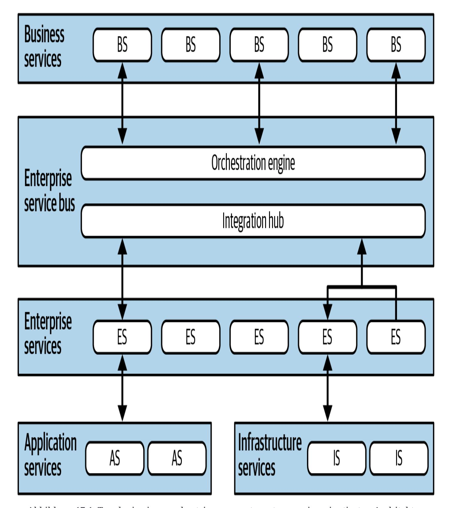
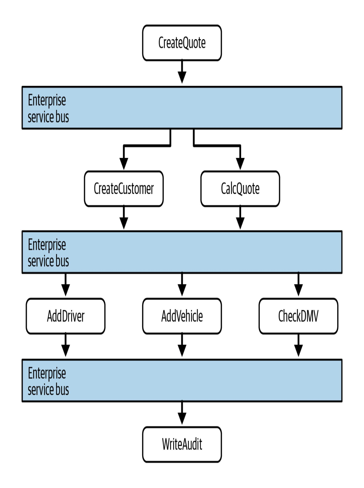
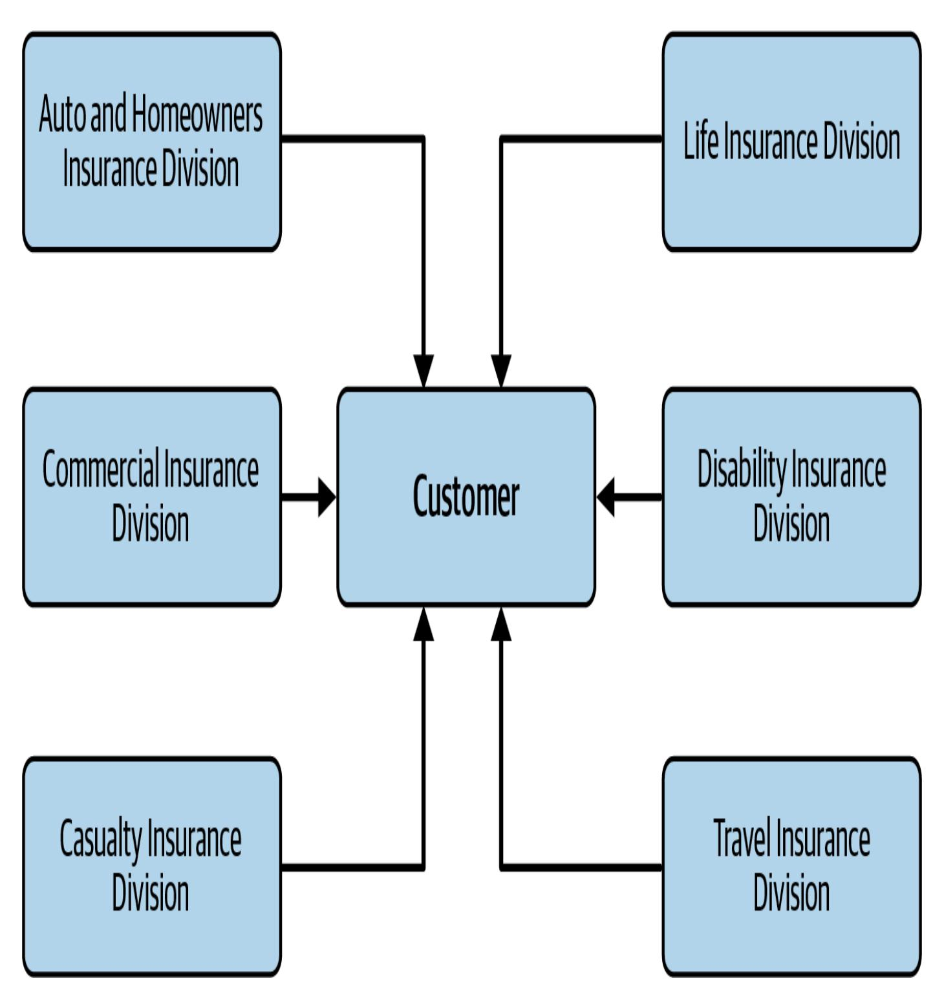
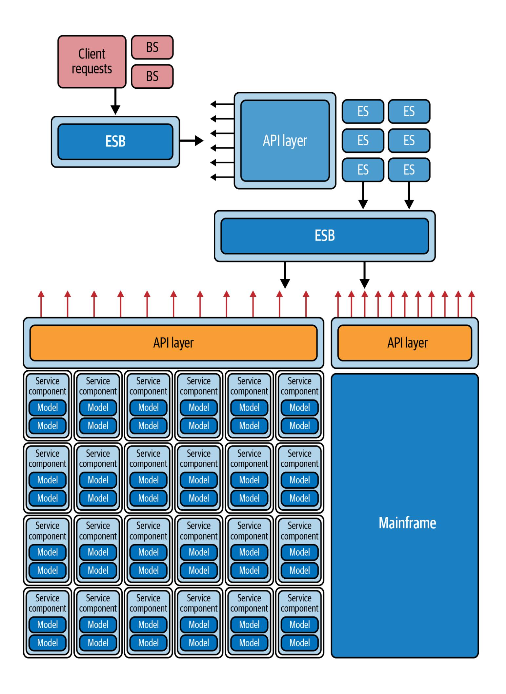

# Kapitel 17. OrchestrierungsgesteuerteServiceorientierte Architektur

Diese Arbeit wurde mithilfe von KI übersetzt. Wir freuen uns über dein Feedback und deine Kommentare: [translation-feedback@oreilly.com](mailto:translation-feedback@oreilly.com)

Architekturstile sind für Architekten im Kontext der Zeit, in der sie entstanden sind, sinnvoll, verlieren aber in späteren Epochen an Bedeutung, ähnlich wie Kunstströmungen. *Die serviceorientierte Architektur* (SOA) *, die sich an der Orchestrierung orientiert*, ist ein Beispiel für diese Tendenz. Die externen Kräfte, die Architekturentscheidungen oft beeinflussen, in Kombination mit einer logischen, aber letztlich desaströsen Organisationsphilosophie, haben diese Architektur zur Bedeutungslosigkeit verdammt. Sie ist jedoch ein gutes Beispiel dafür, wie eine bestimmte organisatorische Idee zwar logisch sinnvoll sein kann, aber die wichtigsten Teile des Entwicklungsprozesses behindert. Es verdeutlicht eine der Gefahren, wenn man unser erstes Gesetz ignoriert: *Alles in der Softwarearchitektur ist ein Kompromiss*.

## Topologie

Die Topologie einer [orchestrierungsgesteuerten](#page-2-0) SOA ist in Abbildung 17- 1 dargestellt.

Nicht alle Beispiele für diese Art von Architektur haben genau diese Schichten, aber sie folgen alle der gleichen Idee, eine Taxonomie von Diensten innerhalb der Architektur zu erstellen, wobei jede Schicht eine bestimmte, klar definierte Verantwortung hat.

Die serviceorientierte Architektur ist eine verteilte Architektur. Die genaue Abgrenzung ist in [Abbildung](#page-2-0) 17-1 nicht dargestellt, da sie je nach Organisation und Tools variiert: Einige der Teile der Taxonomie können innerhalb eines Anwendungsservers existieren.

Orchestrierungsgesteuerte SOA konzentriert sich auf eine bestimmte Taxonomie von Diensten, mit unterschiedlichen technischen Verantwortlichkeiten innerhalb der Architektur und Rollen, die bestimmten Schichten zugeordnet sind.

<span id="page-2-0"></span>

Abbildung 17-1. Topologie einer orchestrierungsgesteuerten serviceorientierten Architektur

### Stil Besonderheiten

Orchestrierungsgetriebene SOA ist für heutige Architekten meist von historischem Interesse; die Lektionen, die beim Aufbau dieser Architekturen gelernt wurden, sind ein wichtiger Teil der Entwicklung des Fachgebiets. Dennoch sind Teile davon für Architekten in einigen Szenarien der Integrationsarchitektur immer noch von Bedeutung.

Die serviceorientierte Architektur kam in den späten 1990er Jahren auf, als kleine Unternehmen aller Art in rasantem Tempo zu Konzernen heranwuchsen, mit kleineren Unternehmen fusionierten und eine anspruchsvollere IT benötigten, um dieses Wachstum zu bewältigen. Doch die Rechenressourcen waren knapp, kostbar und kommerziell. Verteiltes Rechnen war gerade erst möglich und notwendig geworden, und viele Unternehmen brauchten seine Skalierbarkeit und andere vorteilhafte Eigenschaften.

Viele externe Faktoren zwangen die Architekten in dieser Zeit zu verteilten Architekturen mit erheblichen Systembeschränkungen. Bevor Open-Source-Betriebssysteme als zuverlässig genug für ernsthafte Arbeit galten, waren Betriebssysteme teuer und wurden pro Rechner lizenziert. Auch kommerzielle Datenbankserver hatten ein kompliziertes Lizenzierungssystem, was manchmal dazu führte, dass die Anbieter von Anwendungsservern (die das Pooling von Datenbankverbindungen anboten) mit den Datenbankanbietern in Konflikt gerieten. Da so viele Ressourcen im großen Maßstab teuer waren, verfolgten die Architekten die Philosophie, so viel wie möglich wiederzuverwenden.

Diese technischen Bedenken verbanden sich mit organisatorischen Bedenken hinsichtlich der Duplizierung von Informationen und

Arbeitsabläufen - aufgrund der häufigen Fusionen und des Wachstums kämpften dieUnternehmen mit der Vielfalt und den Inkonsistenzen zwischen den zentralen Geschäftseinheiten. Das machte die Ziele von SOA attraktiv. Folglich machten die Architekten die *Wiederverwendung* in allen Formen zur vorherrschenden Philosophie dieser Architektur, deren Nebeneffekte wir in ["Wiederverwendung](#page-12-0) ... und Kopplung" behandeln [.](#page-12-0) Dieser Architekturstil ist auch ein Beispiel dafür, wie weit Architekten die Idee der technischen Partitionierung treiben können, die zwar gute Beweggründe haben kann, aber zu schlechten Konsequenzen führt, wenn man sie auf die Spitze treibt.

#### **WARUM SO VIELE SERVICENAMEN?**

Architekten sind oft verwirrt von der Vielzahl der Dinge in der Softwarearchitektur, die als *Dienste* bezeichnet werden. Wir behandeln in diesem Buch gleich drei verschiedene Arten von "Services": SOA in diesem Kapitel, Microservices in [Kapitel](#page--1-0) 18 und servicebasierte Architekturen in [Kapitel](#page--1-0) 14. Ein Teil des Problems ist die Unflexibilität der Sprache zur Beschreibung von Architekturen. Der andere Teil liegt in der ständigen Weiterentwicklung des Ökosystems der Software-Entwicklung. *Service* ist ein netter allgemeiner Name für etwas, das einen, nun ja, Service bietet, also neigen Architekten dazu, den Namen weiter zu verwenden. Wenn sich die Stile weiterentwickeln, ändern wir auch, was wir mit *Service* meinen. Ein *Entity Service* in einer orchestrierungsgetriebenen SOA unterscheidet sich zum Beispiel in praktisch jeder Hinsicht von einem Service in einer Microservices-Architektur (die sich von einer servicebasierten Architektur unterscheidet). So ärgerlich es auch ist, Architekten müssen oft den Kontext analysieren, wenn das Wort *Service* in einem Namen auftaucht; der Begriff selbst hat unter der [semantischen](https://oreil.ly/9oQNq) Diffusion gelitten.

### **Taxonomie**

Die treibende Philosophie hinter dieser Architektur ist eine bestimmte Art von Abstraktion und Wiederverwendung auf Unternehmensebene. Viele große Unternehmen ärgerten sich darüber, dass sie ihre Software ständig neu schreiben mussten. Sie kamen zu einer Strategie, die dieses Problem allmählich zu lösen schien, indem sie eine strenge

*Servicetaxonomie* mit klar definierten Schichten und entsprechenden Verantwortlichkeiten schufen. Jede Schicht der Taxonomie unterstützt die beiden Ziele der ultimativen Abstraktion und Wiederverwendung.

#### **Dienstleistungen für Unternehmen**

*Geschäftsdienste* stehen an der Spitze dieser SOA und bilden den Einstiegspunkt für Geschäftsprozesse. Zum Beispiel stellen Dienste wie ExecuteTrade oder PlaceOrder den richtigen Verhaltensbereich für diese Dienste dar. Ein damals üblicher Lackmustest lautete: Kann ein Architekt die Frage "Sind wir in der Lage,..." für jeden dieser Dienste mit "Ja" beantworten? Wenn ja, dann ist der Dienst auf der richtigen Granularitätsebene. Ein Entwickler braucht vielleicht eine Methode wie CreateCustomer , um einen Geschäftsprozess wie ExecuteTrade auszuführen, aber CreateCustomer ist auf der falschen Abstraktionsebene für einen Geschäftsdienst. Das Unternehmen hat nicht die *Aufgabe*, Kunden anzulegen, aber es muss Kunden anlegen, um Geschäfte zu tätigen.

Diese Servicedefinitionen enthalten keinen Code, sondern nur Eingabe-, Ausgabe- und manchmal Schemainformationen. Geschäftsanwender und/oder Analysten definieren diese Servicesignaturen, daher der Name *Business Services*.

#### **Unternehmensdienstleistungen**

Die *Unternehmensdienste* enthalten feinkörnige gemeinsame Implementierungen. In der Regel erstellt ein Entwicklerteam ein atomares Verhalten für bestimmte Geschäftsbereiche wie CreateCustomer oder CalculateQuote und transaktionale Entitäten wie Customer , Order und Lineitem . Diese Unternehmensdienste sind die Bausteine, aus denen die Geschäftsdienste bestehen, die über die Orchestrierungs-Engine miteinander verbunden sind.

Es lohnt sich, die Unterschiede in der Abstraktion zwischen Geschäftsund Unternehmensdiensten zu beachten. Während Business Services recht grobkörnig sind, sind Enterprise Services feinkörnig und dazu gedacht, verschiedene Arten von Abstraktionen, Workflows und Entitäten zu erfassen. Das Ziel des Architekten bei der Entwicklung von Unternehmensdiensten ist es, perfekt gekapselte Bausteine mit isolierten Geschäftsfunktionen zu schaffen, die frei zu komplexeren Geschäftsabläufen zusammengesetzt werden können.

Das ist zwar ein lobenswertes Ziel, aber die Architekten stellen fest, dass der ideale Sweet Spot der Abstraktion zwischen all diesen Kräften bestenfalls schwer zu finden und aufgrund zahlreicher konkurrierender Kompromisse wahrscheinlich unmöglich ist. Letztlich versucht diese Architektur, wie andere technisch partitionierte Architekturen, eine strikte Trennung der Verantwortlichkeiten, die sich aus dem Gebot der Wiederverwendung ergibt. Der Gedanke dahinter ist, dass das Unternehmen diesen Teil des Geschäftsablaufs nicht noch einmal neu schreiben muss, wenn die Entwickler feinkörnige Unternehmensdienste auf der richtigen Granularitätsebene erstellen können. Nach und nach wird das Unternehmen eine Sammlung von wiederverwendbaren

Ressourcen in Form von wiederverwendbaren Unternehmensdiensten aufbauen - zumindest theoretisch.

Leider widersetzen sich die dynamische Natur der Realität und die evolutionären Auswirkungen des Ökosystems der Softwareentwicklung diesen Versuchen. Geschäftskomponenten sind nicht wie Baumaterialien, deren Lösungen Jahrzehnte überdauern. Märkte, technologische Veränderungen, technische Praktiken und eine Vielzahl anderer Faktoren machen den Versuch, der Softwarewelt Stabilität zu verleihen, zunichte.

#### **Anwendungsdienste**

Nicht alle Dienste in der Architektur erfordern den gleichen Grad an Granularität oder Wiederverwendung wie die Unternehmensdienste. *Anwendungsdienste* sind einmalige Dienste, die nur einmal implementiert werden. Vielleicht braucht eine Anwendung zum Beispiel Geolokalisierung, aber das Unternehmen möchte sich nicht die Zeit und Mühe machen, diesen Dienst wiederverwendbar zu machen. Ein Anwendungsdienst, der in der Regel von einem einzigen Anwendungsteam betrieben wird, löst dieses Problem.

### **Infrastrukturdienste**

*Infrastrukturdienste* sorgen für betriebliche Belange wie Überwachung, Protokollierung, Authentifizierung, Autorisierung und so weiter. Bei diesen Diensten handelt es sich in der Regel um konkrete Implementierungen, für die ein gemeinsames Infrastrukturteam

zuständig ist, das eng mit dem Betrieb zusammenarbeitet. Die Philosophie der Architekten beim Aufbau dieser Architektur dreht sich um die technische Partitionierung, daher ist es sinnvoll, dass sie separate Infrastrukturdienste aufbauen.

### **Orchestrierungs-Engine und Nachrichtenbus**

Die *Orchestrierungs-Engine* bildet das Herzstück dieser verteilten Architektur. Sie fügt die Implementierungen der Unternehmensdienste mithilfe der Orchestrierung zusammen und bietet Funktionen wie Transaktionskoordination und Nachrichtentransformation. Die Orchestrierungs-Engine definiert die Beziehung zwischen den Geschäftsund Unternehmensdiensten, wie sie miteinander verbunden sind und wo die Transaktionsgrenzen liegen. Sie fungiert auch als Integrationsdrehscheibe, die es Architekten ermöglicht, benutzerdefinierten Code in Paket- und Legacy-Software-Systeme zu integrieren. Diese Kombination von Funktionen verdeutlicht den modernen Einsatz von Tools wie Enterprise Service Bussen (ESBs). Obwohl die meisten Architekten es für eine schlechte Idee halten, eine ganze Architektur um ESBs herum aufzubauen, sind sie in integrationsintensiven Umgebungen ungemein nützlich. Wenn Architekten einen Integrations-Hub und eine Orchestrierungs-Engine kombinieren müssen, warum dann nicht ein Tool verwenden, das beides bereits enthält? (Hier zeigt sich eine weitere wichtige Fähigkeit, die man als Architekt entwickeln sollte - die Fähigkeit, den wahren Nutzen von Tools zu erkennen und sich von dem Hype um sie zu unterscheiden).

Da der Nachrichtenbus das Herzstück der Architektur bildet, sagt Conway's Law (siehe ["Conway's](#page--1-1) Law") richtig voraus, dass das Team von Integrationsarchitekten, das für diesen Motor verantwortlich ist, dazu neigt, zu einer politischen Kraft innerhalb einer Organisation zu werden - und schließlich zu einem bürokratischen Engpass.

Dieser zentralisierte, taxonomische Ansatz mag zwar verlockend klingen, aber in der Praxis hat er sich meist als Desaster erwiesen. Das Auslagern des Transaktionsverhaltens an ein Orchestrierungstool klingt gut, aber Architekten haben Schwierigkeiten, die richtige Granularität zu finden. Sie können zwar ein paar Dienste bauen, die in einer verteilten Transaktion verpackt sind, aber die Architektur wird immer komplexer. Die Entwickler müssen herausfinden, wo die richtigen Transaktionsgrenzen zwischen den Diensten liegen, wenn Entitäten in zahlreiche Workflows eingebunden werden. Obwohl Manager vorausgesagt und gehofft hatten, dass Unternehmen erfolgreich transaktionale Bausteine als Unternehmensdienste aufbauen könnten, hat sich dies in der Praxis als schwierig erwiesen.

#### **Nachrichtenfluss**

Alle Anfragen laufen über die Orchestration Engine, in der die Logik dieser Architektur untergebracht ist. Der Nachrichtenfluss läuft also auch bei internen Aufrufen über die Engine, wie in [Abbildung](#page-11-0) 17-2 dargestellt.



In [Abbildung](#page-11-0) 17-2 ruft der Business-Level-Service CreateQuote den Service Bus auf, der den Workflow definiert. Der Arbeitsablauf besteht aus Aufrufen der Dienste CreateCustomer und CalculateQuote die jeweils auch die Anwendungsdienste aufrufen. Der Service Bus fungiert als Vermittler für alle Aufrufe innerhalb dieser Architektur und dient sowohl als Integrationsdrehscheibe als auch als Orchestrierungsmaschine.

### <span id="page-12-0"></span>**Wiederverwendung...und Kopplung**

Eines der Hauptziele der Architekten, die diese Architektur zum ersten Mal einsetzten, war die Wiederverwendung auf der Service-Ebene - die Fähigkeit, schrittweise ein Geschäftsverhalten aufzubauen, das sie im Laufe der Zeit immer wieder verwenden können. Sie wurden angewiesen, so aggressiv wie möglich nach Wiederverwendungsmöglichkeiten zu suchen.

Betrachten wir zum Beispiel die in [Abbildung](#page-13-0) 17-3 dargestellte Situation: Ein Architekt stellt fest, dass jede der sechs Abteilungen eines Versicherungsunternehmens einen Begriff von Customer .

<span id="page-13-0"></span>

Abbildung 17-3. Suche nach Wiederverwendungsmöglichkeiten in der serviceorientierten Architektur

Die richtige SOA-Strategie besteht daher darin, die Teile von Customer in einen wiederverwendbaren Dienst zu extrahieren und dann den ursprünglichen Diensten zu erlauben, den kanonischen Customer Dienst zu referenzieren. Dies ist in [Abbildung](#page-14-0) 17-4 zu sehen: Hier hat der Architekt das gesamte Kundenverhalten in einem einzigen Customer

Dienst isoliert und damit die offensichtlichen Wiederverwendungsziele erreicht.

<span id="page-14-0"></span>

Abbildung 17-4. Aufbau kanonischer Darstellungen in einer serviceorientierten Architektur

Die Architekten erkannten nur langsam die negativen Kompromisse dieses Designs. Erstens: Wenn ein Team ein System in erster Linie auf der Grundlage von Wiederverwendung aufbaut, führt dies auch zu einer starken Kopplung zwischen den Komponenten. Schließlich wird die Wiederverwendung *durch* Kopplung realisiert. In [Abbildung](#page-14-0) 17-4 zum Beispiel wirkt sich eine Änderung am Dienst Customer auf alle anderen Dienste aus. Das macht selbst inkrementelle Änderungen risikoreich: Jede Änderung hat einen potenziell großen Ripple-Effekt. Das wiederum erfordert koordinierte Einsätze, ganzheitliche Tests und andere Hemmnisse für die technische Effizienz.

Ein weiterer negativer Nebeneffekt der Konsolidierung von Verhalten an einem einzigen Ort: Betrachte den Fall der Auto- und Invaliditätsversicherung in [Abbildung](#page-14-0) 17-4. Um einen einzigen Customer Service zu unterstützen, muss jede Abteilung alle Details enthalten, die das Unternehmen über seine Kunden kennt. Für eine Autoversicherung ist ein Führerschein erforderlich, der eine Eigenschaft der Person und nicht des Fahrzeugs ist. Daher muss der Dienst Customer Details über Führerscheine enthalten, die der Abteilung für Berufsunfähigkeitsversicherungen egal sind. Das Team der Berufsunfähigkeitsversicherung muss sich jedoch mit der zusätzlichen Komplexität einer einzigen Kundendefinition auseinandersetzen. In vielerlei Hinsicht ist das Beharren von DDD auf der *Vermeidung einer* ganzheitlichen Wiederverwendung auf die Erfahrungen mit dieser Art von Architekturen zurückzuführen.

Die vielleicht schädlichste Erkenntnis über die orchestrierungsgetriebene SOA ist die Unpraktikabilität einer Architektur, die sich so sehr auf die technische Partitionierung konzentriert. Während dies aus Sicht der Philosophie der Trennung und Wiederverwendung sinnvoll ist, ist es in der Praxis ein Albtraum.

Zum Beispiel arbeiten Entwickler häufig an Aufgaben wie "füge eine neue Adresszeile zu CatalogCheckout hinzu". Domänenkonzepte wie CatalogCheckout sind in dieser Architektur so dünn verteilt, dass sie praktisch zu Staub zermahlen wurden. In einer SOA könnte diese Aufgabe Dutzende von Diensten auf verschiedenen Ebenen sowie Änderungen an einem einzigen Datenbankschema umfassen. Und wenn die aktuellen Unternehmensdienste nicht mit der richtigen Transaktionsgranularität definiert sind, müssen die Entwickler entweder ihr Design ändern oder einen fast identischen neuen Dienst erstellen, um das Transaktionsverhalten zu ändern. So viel zur Wiederverwendung.

## Daten-Topologien

Im Gegensatz zu vielen anderen Architekturen, die wir in diesem Buch besprechen, sind die Datentopologien für orchestrierungsgetriebene SOA nicht sehr interessant, wenn man die historischen Ursprünge dieses Stils bedenkt. Obwohl es sich um eine verteilte Architektur handelt, die aus vielen Teilen besteht, wird in der Regel eine einzige (oder einige wenige) relationale Datenbank verwendet, wie es in den späten 1990er Jahren in allen verteilten Architekturen üblich war. Sogar die

Transaktionsfähigkeit wurde im Allgemeinen in diese Architektur verlagert und von den Datenbanken entfernt: Der Nachrichtenbus enthielt oft deklarative transaktionale Interaktionen für jede der Entitäten innerhalb der Topologie, so dass Entwickler, Architekten oder andere Personen das transaktionale Verhalten unabhängig von der Datenbank oder sogar von der situativen Wiederverwendung der Entität festlegen konnten.

Für die Architekten dieser Zeit waren Daten ein fremdes Land. Obwohl sie sowohl in SOA- als auch in ereignisgesteuerten Architekturen ein unverzichtbarer Bestandteil des Systems sind, behandelten sie sie damals eher als Integrationspunkt denn als Teil der Problemdomäne.

#### **WIRKLICH? DEKLARATIVE VORGÄNGE?!?**

Ja, wirklich. Eines der "Features" vieler Anwendungsserver in der Blütezeit der orchestrierungsgesteuerten SOA war die Möglichkeit für Konfigurationsmanager, den Transaktionsbereich einzelner Entitäten zu ändern, je nachdem, in welchem Transaktionskontext sie arbeiten wollten. (Dies wurde natürlich in XML deklariert, da die damalige Zeit wortreiche, aber leicht zu parsierende Konfigurationsformate liebte.) Ein Teil der Deklaration einer Entität (genannt EntityBeans , ein spezieller Typ von JavaBean) bestimmt den Transaktionsbereich, wenn sie an Workflows teilnimmt, die die Architekten selbst als transaktionsfähig oder nicht deklarieren. Der Anwendungsserver wiederum interagiert mit der Datenbank, um Datenbanktransaktionen zu erstellen und zu verwalten, die dem gewünschten Verhalten der Entitäten und/oder Workflows entsprechen.

Das hat aus zwei Gründen weitgehend fehlgeschlagen. Erstens: Wenn ein Entwickler nicht weiß, wie das Transaktionsverhalten zur Laufzeit aussehen wird, werden Entitäten und Abhängigkeiten erheblich komplexer. Dies zwingt Entwickler dazu, fast identische Versionen der Entitäten zu erstellen, die sich nur in ihrem Transaktionsumfang unterscheiden. Zweitens: Egal, wie ausgeklügelt die Anbieter ihre Nachrichtenbusse gestalten, es treten immer wieder Kanten auf, bei denen die unzähligen Fehlermodi das System daran hindern, Transaktionen sauber zu verwalten, und so ein Wirrwarr von Inkonsistenzen schaffen, das der Mensch entwirren muss. Einige komplexe, vielschichtige Funktionen von Systemen (wie Transaktionen) können nicht sauber abstrahiert werden. Zu viele undichte Stellen in der Abstraktion verhindern, dass sie zuverlässig ist.

## Überlegungen zur Cloud

Orchestrierungsgesteuerte SOA ist mehrere Jahrzehnte älter als die Cloud, daher gibt es keine Überlegungen, diese Architektur (in ihrer ursprünglichen Form) in der Cloud aufzubauen.

Die heutige Verwendung dieses Stils macht ihn jedoch zu einer guten Integrationsarchitektur für Cloud- und On-Premises-Dienste, die integriert werden und an Arbeitsabläufen teilnehmen müssen. Da es sich in erster Linie um eine Integrationsarchitektur handelt, funktioniert sie gut mit Cloud-basierten Diensten und Einrichtungen.

### Gemeinsame Risiken

Am Ende des letzten und zu Beginn dieses Jahrhunderts waren die großen Risiken für diese Architektur vor allem die Kosten, die Dauer der Implementierung und (eine schockierende Überraschung) die Schwierigkeit, diese Systeme zu warten und zu aktualisieren. Viele dieser Projekte waren sehr teure, mehrjährige Unternehmungen, bei denen kritische Entscheidungen auf hoher Ebene der Unternehmenshierarchie getroffen wurden. Anstatt diese Projekte als "Fehlschläge" zu bezeichnen, haben die Unternehmen sie meist einfach

in Integrationsarchitekturen mit besseren Grenzen umgewandelt, die sich stärker an den Ideen von DDD orientieren.

Wenn Architekten einen ESB in einem modernen System als Integrationseinrichtung verwenden, besteht das größte Risiko darin, dass der ESB nach und nach die gesamte Architektur kapselt. Dies wird als *Accidental SOA* bezeichnet: Ein Architekt baut schrittweise und unbeabsichtigt eine vollständig orchestrierte SOA auf, ohne es zu merken. Um eine Accidental SOA zu vermeiden, muss ein Architekt für vernünftige Kapselungsgrenzen für die Orchestrierung sorgen und auf Themen wie Transaktionsgrenzen achten.

### <span id="page-20-0"></span>Governance

Als diese Architektur populär war, war modernes ganzheitliches Testen unüblich. Die Teams testeten SOA nur selten außerhalb der formalen Qualitätssicherungsebene, so dass die Entwickler von Tools und Frameworks kaum darauf achteten, das Testen der einzelnen Teile zu erleichtern. Es gab zwar einige Test-Frameworks, die Mocks und Stubs für die gewaltige Maschinerie des Nachrichtenbusses und die damit verbundenen beweglichen Teile erstellten, aber sie waren immer umständlich und inkonsistent.

Die Governance litt unter den gleichen Einschränkungen. Die Idee, die architektonische Steuerung zu automatisieren, war sogar noch fremder als die Automatisierung von Tests. In dieser Zeit bedeutete "Governance" schwergewichtige Frameworks, Meetings und Codeüberprüfungen alles manuell.

Dennoch setzen Architekten ESBs strategisch in Unternehmen ein, die den besonderen Mix an Funktionen benötigen, den sie bieten. Insbesondere haben viele Unternehmen Altsysteme, die mit moderneren Systemen interagieren müssen und dabei oft Ergebnisse kombinieren und Verhalten aggregieren - all das beschreibt die zentrale Funktionalität eines ESB. In diesen Szenarien können Fitnessfunktionen eine entscheidende Rolle spielen, wenn es darum geht, zu verhindern, dass Daten oder begrenzte Kontexte in Teile des Ökosystems "durchsickern", in denen sie nicht auftauchen sollten.

Betrachten wir zum Beispiel ein System, das einen ESB nutzt, um sich zwischen einem Enterprise Resource Planning (ERP)-Paket, einem Online-Verkaufstool und moderneren, auf Microservices basierenden Accounting Diensten zu koordinieren. In diesem Szenario soll das System nur von den ERP- und Vertriebssystemen lesen und in die Accounting Microservices schreiben. Architekten können zunächst eine Fitnessfunktion erstellen, die sicherstellt, dass die gesamte Kommunikation konsistent in Protokolle geschrieben wird, und dann so etwas wie die folgende Fitnessfunktion schreiben (hier in Pseudocode):

```
READ logs for ERP into ERP-logs for past 24 hours
READ logs for Sales into Sales-logs for past 24 hours
FOREACH entry IN ERP-logs
   IF 'operation' is 'update' and 'target' != 'accounting' T
      raise fitness function violation
            "I lid i ti b t i t ti i t
```

```
"Invalid communication between integration point
    END IF
FOREACH entry IN Sales-logs
    IF 'operation' is 'update' and 'target' != 'accounting' T
       raise fitness function violation
             "Invalid communication between integration point
    END IF
```

Diese Fitnessfunktion liest die Log-Einträge von beiden Integrationspunkten, um sicherzustellen, dass keine Aktualisierungsvorgänge stattfinden, deren Ziel nicht das System Accounting ist.

Mithilfe solcher Fitnessfunktionen können Architekten Werkzeuge wie ESBs strategisch einsetzen und gleichzeitig Leitplanken um die Stellen herum bauen, an denen Teams sie typischerweise falsch einsetzen.

## Überlegungen zur Team-Topologie

Genauso wie Architekten keine Datentopologien für die orchestrierungsgetriebene SOA in Betracht gezogen haben, gilt das Gleiche für Teamtopologien, die ein unbekanntes Thema waren, als dieser Architekturstil populär wurde.

Tatsächlich dient die strenge Taxonomie dieses Stils als Kommunikationsmuster, das Architekten *dazu veranlasste*, die Prinzipien der Teamtopologien zu entwickeln. Das *Ziel* dieser Architektur ist eine extreme Trennung der Verantwortlichkeiten und eine entsprechende Trennung der Teammitglieder. In den Unternehmen, die diese Architektur eingeführt haben, war es in der Tat selten, dass sich jemand, der *Geschäftsdienste* entwickelt, mit jemandem unterhielt, der *Unternehmensdienste* entwickelt. Es wurde erwartet, dass sie über technische Artefakte wie Verträge und Schnittstellen kommunizieren. Die Abstraktionsebene dieses Stils schafft viele Integrationsschichten, die jeweils von verschiedenen Teams implementiert werden, die für die Kommunikation Ticketing-Tools auf Unternehmensebene verwenden. Es ist leicht zu verstehen, warum es für Entwickler zeitaufwändig ist, Funktionen in diesem Stil zu entwickeln.

### Stilmerkmale

Viele der Kriterien, die wir heute zur Bewertung von Architekturstilen verwenden, hatten keine Priorität, als die orchestrierte SOA populär war. Die Agile Software-Bewegung hatte gerade erst begonnen und war noch nicht in die großen Organisationen vorgedrungen, die diese Architektur wahrscheinlich nutzen würden.

Eine Ein-Stern-Bewertung in der Tabelle in [Abbildung](#page-25-0) 17-5 bedeutet, dass ein bestimmtes Architekturmerkmal in der Architektur nicht gut unterstützt wird, während eine Fünf-Stern-Bewertung bedeutet, dass das Architekturmerkmal eines der stärksten Merkmale des Stils ist. Definitionen für die in der Scorecard genannten Merkmale findest du in [Kapitel](#page--1-0) 4.

SOA ist vielleicht die technisch am stärksten partitionierte Allzweckarchitektur, die je versucht wurde! Tatsächlich führte der Widerstand gegen die Nachteile dieser Struktur zu moderneren Architekturen, wie z. B. Microservices. Obwohl es sich bei SOA um eine verteilte Architektur handelt, hat sie aus zwei Gründen ein einziges Quantum. Erstens wird in der Regel eine einzige oder wenige Datenbanken verwendet, wodurch Kopplungspunkte zwischen vielen verschiedenen Anliegen entstehen. Zweitens, und das ist noch wichtiger, fungiert die Orchestrierungs-Engine als ein riesiger Kopplungspunkt kein Teil der Architektur kann andere Eigenschaften haben als der Mediator, der das gesamte Verhalten orchestriert. So schafft es diese Architektur, die Nachteile von monolithischen *und* verteilten Architekturen zu vereinen.

|             | Architectural characteristic | Star rating                      |
|-------------|------------------------------|----------------------------------|
|             | Overall cost                 | \$\$\$\$                         |
| Structural  | Partitioning type            | Technical                        |
|             | Number of quanta             | 1 to many                        |
|             | Simplicity                   | $\stackrel{\bigstar}{\sim}$      |
|             | Modularity                   | ***                              |
| Engineering | Maintainability              | $\bigstar$                       |
|             | Testability                  | $\stackrel{\bigstar}{\sim}$      |
|             | Deployability                | $\stackrel{\bigstar}{\sim}$      |
|             | Evolvability                 | $\stackrel{\bigstar}{\sim}$      |
| Operational | Responsiveness               | $\stackrel{\wedge}{\Rightarrow}$ |
|             | Scalability                  | ***                              |
|             | Elasticity                   | <b>☆☆☆</b>                       |
|             | Fault tolerance              | ***                              |

Moderne technische Ziele wie Verteilbarkeit und Testbarkeit schneiden in dieser Architektur katastrophal ab, sowohl weil sie schlecht unterstützt werden als auch weil diese Ziele bei ihrer Entwicklung nicht wichtig waren (oder nicht einmal angestrebt wurden).

Diese Architektur unterstützt einige Ziele wie Elastizität und Skalierbarkeit, auch wenn es schwierig ist, sie umzusetzen. Die Anbieter von Tools haben enorme Anstrengungen unternommen, um diese Systeme skalierbar zu machen, indem sie Sitzungsreplikationen über Anwendungsserver hinweg und andere Techniken entwickelt haben. Da es sich jedoch um eine verteilte Architektur handelt, war die Leistung noch nie ein Highlight, da jede Geschäftsanfrage auf so viele Teile der Architektur verteilt ist.

Aufgrund all dieser Faktoren stehen Einfachheit und Kosten in einem umgekehrten Verhältnis zueinander, wie es die meisten Architekten bevorzugen würden. Die orchestrierungsgetriebene SOA war ein wichtiger Meilenstein, weil sie den Architekten die praktischen Grenzen der technischen Partitionierung aufzeigte und zeigte, wie schwierig verteilte Transaktionen in der realen Welt sein können.

## Beispiele und Anwendungsfälle

Die ersten Beispiele für diese Architektur gab es in den späten 1990er und frühen 2000er Jahren in vielen großen Unternehmen. Sie wurden nach und nach von agilen und domänenbasierten verteilten Architekturen wie Microservices verdrängt. Selbst große Unternehmen haben erkannt, dass Veränderungen unvermeidlich sind und dass Software nicht statisch ist und sich mit den Marktkräften und neuen Möglichkeiten verändern muss.

Architekten haben orchestrierungsgesteuerte SOA-Architekturen entwickelt, um eine effektive Wiederverwendung in großen Organisationen zu erreichen, aber sie haben irgendwann gemerkt, wie schwierig ihre strenge und ausgefeilte Taxonomie die Umsetzung gemeinsamer Änderungen und Aktualisierungen macht. Eine häufige Änderung in einer Domäne kann zum Beispiel darin bestehen, Details über eine einzelne Entität zu aktualisieren. Wenn die Entwickler Glück haben, müssen sie dafür nur Komponenten in der Enterprise Services-Schicht ändern. An einem schlechten Tag (an dem die Unternehmensarchitekten und/oder Stakeholder diese Art von Änderung nicht vorhergesehen haben), müssen die Entwickler vielleicht vier oder fünf Schichten der Architektur aktualisieren und in jeder Schicht stark gekoppelte Änderungen vornehmen. Architekten, die in diesem Stil arbeiten, fürchten sich davor, das Wort " *Veränderung"* zu hören, weil es eine gründliche Analyse erfordert und der Umfang der Arbeit so variabel ist.

Wie wir in ["Governance"](#page-20-0) erwähnt haben [,](#page-20-0) verwenden Architekten immer noch die Bausteine der orchestrierten SOA (wie den ESB), insbesondere für Integrationsarchitekturen. Ein ESB umfasst beispielsweise sowohl einen Integrations-Hub (zur Erleichterung der Kommunikation, des Protokolls und der Vertragsumwandlung) als auch eine Orchestrierungs-Engine (damit Architekten Workflows zwischen verschiedenen Integrationsendpunkten erstellen können). Da die orchestrierungsgesteuerte SOA viele indirekte Ebenen umfasst, können Architekten Enterprise Services als Integrationspunkte, als Paketsoftware oder als maßgeschneiderten Code implementieren, wie in [Abbildung](#page-29-0) 17-6 dargestellt.

Client-Anfragen verwenden den Nachrichtenbus, um zu bestimmen, welche Unternehmensdienste in welcher Reihenfolge aufgerufen werden sollen und welche Informationen gesammelt werden sollen. Die Unternehmensdienste wiederum kommunizieren über APIs mit benutzerdefiniertem Code, alten Systemen oder Paketsoftware und so weiter.

Orchestrierungsgesteuerte SOA stellt eine interessante Innovation für die Art und Weise dar, wie Architekten mit Problemen der Integration im Rahmen ihres Ökosystems umgehen. Da die meisten Unternehmen zum Beispiel noch keine Open-Source-Betriebssysteme verwendeten, als diese Architektur populär war, waren alternative Architekturen wie Microservices unerschwinglich. Architekten sollten aus den Ansätzen der Vergangenheit lernen. Wir können die Teile weiterverwenden, die noch Sinn machen, und gleichzeitig die Lehren daraus ziehen, was fehlgeschlagen ist und warum.



Abbildung 17-6. Die Abstraktionsschichten in diesem Architekturstil ermöglichen eine flexible Implementierung