## Kapitel 18. Microservices-Architektur

Diese Arbeit wurde mithilfe von KI übersetzt. Wir freuen uns über dein Feedback und deine Kommentare: [translation-feedback@oreilly.com](mailto:translation-feedback@oreilly.com)

*Microservices* sind ein äußerst beliebter Architekturstil, der in den letzten Jahren stark an Dynamik gewonnen hat. In diesem Kapitel geben wir einen Überblick über die wichtigen Merkmale, die diese Architektur sowohl topologisch als auch philosophisch auszeichnen.

Die meisten Architekturstile werden nach Architekten benannt, die feststellen, dass ein bestimmtes Muster immer wieder auftaucht. Es gibt keine geheime Gruppe von Architekten, die entscheidet, was die nächste große Bewegung sein wird - Architekten treffen Entscheidungen, wenn sich das Ökosystem der Softwareentwicklung verschiebt und verändert, und von den häufigsten Möglichkeiten, mit diesen Veränderungen umzugehen und von ihnen zu profitieren, werden diejenigen, die sich als die besten herausstellen, zu Architekturstilen, denen andere nacheifern.

Microservices unterscheiden sich in dieser Hinsicht - sie wurden schon recht früh benannt. Martin Fowler und James Lewis machten ihn in einem berühmten [Blogbeitrag](https://oreil.ly/Px3Wk) aus dem Jahr 2014 bekannt, in dem sie die Merkmale dieses relativ neuen Architekturstils erkannten und beschrieben. Ihr Blogbeitrag prägte die Definition der Architektur und

half neugierigen Architekten, die zugrunde liegende Philosophie zu verstehen.

Microservices ist stark von den Ideen des Domain-Driven Design (DDD) inspiriert, einem logischen Designprozess für Softwareprojekte. Insbesondere ein Konzept aus DDD, der *Bounded Context*, hat Microservices entscheidend inspiriert. Das Konzept des begrenzten Kontexts steht für einen Entkopplungsstil (wie in [Kapitel](#page--1-0) 7 unter ["Domain-Driven](#page--1-1) Design's Bounded Context" beschrieben), weshalb Microservices auch als "Share Nothing"-Architektur bezeichnet werden.

Wenn ein Entwickler eine Domäne definiert, umfasst diese Domäne viele Entitäten und Verhaltensweisen, die in Artefakten wie Code und Datenbankschemata identifiziert werden. Eine Anwendung könnte zum Beispiel eine Domäne namens CatalogCheckout haben, die Begriffe wie Katalogartikel, Kunden und Bezahlung umfasst. In einer traditionellen monolithischen Architektur würden die Entwickler viele dieser Konzepte gemeinsam nutzen und wiederverwendbare Klassen und verknüpfte Datenbanken erstellen. Innerhalb eines Bounded Contexts können interne Teile wie Code und Datenschemata miteinander gekoppelt werden, um Arbeit zu produzieren, aber sie sind *nie* mit etwas außerhalb des Bounded Contexts gekoppelt, z. B. mit einer Datenbank oder Klassendefinition aus einem anderen Bounded Context. Auf diese Weise kann jeder Kontext nur das definieren, was er braucht, und muss nicht auf andere Komponenten eingehen, was die Wiederverwendung zwischen gebundenen Kontexten einschränkt.

Wiederverwendung ist zwar generell von Vorteil, aber erinnere dich an das erste Gesetz der Softwarearchitektur. Alles ist ein Kompromiss. Der Nachteil der Wiederverwendung ist, dass sie in der Regel eine stärkere Kopplung des Systems erfordert, entweder durch Vererbung oder Komposition.

Wenn das Ziel des Architekten ein hochgradig entkoppeltes System ist das Hauptziel von Microservices -, wird er die Duplizierung der Wiederverwendung vorziehen und den logischen Begriff des begrenzten Kontexts physisch so modellieren, dass er einen Service und die dazugehörigen Daten umfasst.

## Topologie

Die grundlegende Topologie von Microservices ist in [Abbildung](#page-4-0) 18-1 dargestellt. Aufgrund ihres Einzweckcharakters sind die Dienste in diesem Architekturstil viel kleiner als in anderen verteilten Architekturen, wie z.B. der orchestrierungsgetriebenen SOA[\(Kapitel](#page--1-0) 17), der ereignisgesteuerten Architektur[\(Kapitel](#page--1-0) 15) und der servicebasierten Architektur[\(Kapitel](#page--1-0) 14). Die Architekten erwarten, dass jeder Dienst alle Teile enthält, die er braucht, um unabhängig zu arbeiten, einschließlich Datenbanken und anderer abhängiger Komponenten.

Microservices sind eine *verteilte* Architektur: Jeder Dienst wird in einem eigenen Prozess ausgeführt, entweder in einer virtuellen Maschine oder in einem Container. Eine solche Entkopplung der Dienste ermöglicht eine einfache Lösung für ein häufiges Problem in Architekturen, die stark auf

eine mandantenfähige Infrastruktur für das Hosting von Anwendungen setzen. Wenn das System z. B. einen Anwendungsserver verwendet, um mehrere laufende Anwendungen zu verwalten, ermöglicht der Anwendungsserver u. a. die betriebliche Wiederverwendung von Netzwerkbandbreite, Speicher und Festplattenplatz. Wenn jedoch alle unterstützten Anwendungen weiter wachsen, werden einige Ressourcen der gemeinsam genutzten Infrastruktur irgendwann knapp.

Ein weiteres Problem ist die unsachgemäße Isolierung zwischen gemeinsam genutzten Anwendungen. Die Trennung jedes Dienstes in einen eigenen Prozess löst alle Probleme, die durch die gemeinsame Nutzung entstehen. Vor der Entwicklung von frei verfügbaren Open-Source-Betriebssystemen und der automatischen Bereitstellung von Maschinen war es unpraktisch, dass jeder Bereich seine eigene Infrastruktur hatte. Mit Cloud-Ressourcen und der Container-Technologie (siehe ["Überlegungen](#page-45-0) zur Cloud") können Teams nun die Vorteile einer extremen Entkopplung nutzen, sowohl auf der Ebene der Bereiche als auch auf der operativen Ebene.

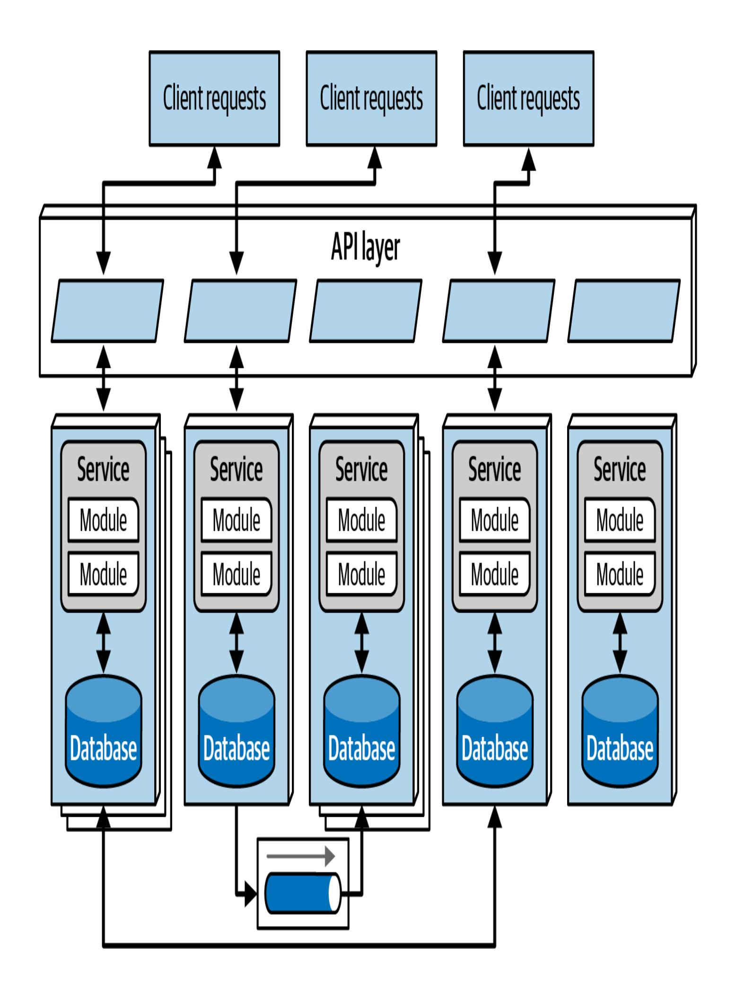

Die Leistung ist oft die Kehrseite der verteilten Natur von Microservices. Netzwerkaufrufe dauern viel länger als Methodenaufrufe, und Sicherheitsüberprüfungen an jedem Endpunkt führen zu zusätzlicher Verarbeitungszeit, so dass Architekten sorgfältig über die Auswirkungen der Granularität nachdenken müssen.

Da es sich bei Microservices um eine verteilte Architektur handelt, raten erfahrene Architekten davon ab, Transaktionen über Dienstgrenzen hinweg zu verwenden. Die Festlegung der Granularität der Dienste ist der Schlüssel zum Erfolg in dieser Architektur.

## Stil Besonderheiten

Die folgenden Abschnitte sind zwar nicht erschöpfend, beschreiben aber einige wichtige Aspekte der Microservices-Topologie, einschließlich einiger einzigartiger Elemente, die es nur bei Microservices gibt.

### **Begrenzter Kontext**

Gehen wir näher auf den Begriff des *begrenzten Kontexts* ein, den wir als die treibende Philosophie von Microservices erwähnt haben. Jeder Dienst modelliert eine bestimmte Funktion, eine Teildomäne oder einen Arbeitsablauf. Jeder Bounded Context umfasst also alles, was für die Ausführung dieser Funktion oder Teildomäne notwendig ist einschließlich der Dienste, die aus logischen Komponenten und Klassen,

Datenbankschemata und der entsprechenden Datenbank bestehen, die der Dienst zur Ausführung seiner Funktionen benötigt. Jeder Dienst steht für eine bestimmte Teildomäne oder Funktion.

Diese Philosophie bestimmt viele der Entscheidungen, die Architekten innerhalb von Microservices treffen. In einem Monolithen ist es zum Beispiel üblich, dass Entwickler gemeinsame Klassen wie Address zwischen verschiedenen Teilen der Anwendung teilen. Da Microservices-Architekturen jedoch versuchen, Kopplung zu vermeiden, würde ein Architekt, der in diesem Architekturstil baut, eher auf Duplizierung als auf Kopplung zurückgreifen, um den *gesamten* Code innerhalb des begrenzten Kontexts der jeweiligen Funktion oder Subdomäne zu halten.

Microservices treiben das Konzept einer domänenaufgeteilten Architektur auf die Spitze. In vielerlei Hinsicht verkörpert diese Architektur die logischen Konzepte des domänenorientierten Designs.

### **Granularität**

Architekten, die Microservices entwerfen, tun sich oft schwer, die richtige Granularität zu finden, und machen ihre Dienste am Ende zu klein, indem sie den Begriff *Mikro* wörtlich nehmen. Dann müssen sie Kommunikationsverbindungen zwischen den Diensten aufbauen, um sinnvolle Arbeit zu leisten, was den Sinn des Ganzen zunichte macht und zu einem großen Ball aus verteiltem Schlamm führt.

*Der Begriff Microservice ist eine Bezeichnung, keine Beschreibung.*

### —Martin Fowler

Mit anderen Worten: Die Erfinder des Begriffs mussten diesem neuen Stil *einen* Namen geben und wählten *Microservices*, um ihn von dem damals (ca. 2007) vorherrschenden Architekturstil, der serviceorientierten Architektur, abzugrenzen, die man auch "gigantische Dienste" hätte nennen können. Viele Entwicklerinnen und Entwickler nehmen den Begriff *Microservices* jedoch als Gebot und nicht als Beschreibung und erstellen zu feinkörnige Dienste.

Der Zweck von Servicegrenzen in Microservices ist es, eine Domäne oder einen Workflow zu erfassen. In manchen Anwendungen können diese natürlichen Grenzen für Teile des Systems sehr groß sein, einfach weil einige Geschäftsprozesse stärker gekoppelt sind als andere. Hier sind einige Richtlinien, die Architekten helfen können, die richtigen Grenzen zu finden:

#### *Zweck*

Die offensichtlichste Grenze liegt in der Inspiration für den Architekturstil: die Problemdomäne. Im Idealfall sollte jeder Microservice funktional zusammenhängend sein und ein wichtiges Verhalten für die Gesamtanwendung beisteuern.

#### *Transaktionen*

Begrenzte Kontexte sind Geschäftsabläufe, und oft legen die Entitäten, die in einer Transaktion zusammenarbeiten müssen, eine gute

Dienstgrenze nahe. Da Transaktionen in verteilten Architekturen Probleme verursachen, führt der Entwurf von Systemen mit dem Ziel, sie zu vermeiden, in der Regel zu besseren Designs.

### *Choreografie*

Eine Reihe von Diensten bietet eine hervorragende Domänenisolierung, erfordert aber eine umfangreiche Kommunikation, um zu funktionieren. Der Architekt kann in Erwägung ziehen, diese Dienste in einem größeren Dienst zu bündeln, um den Kommunikationsaufwand zu vermeiden.

Iteration ist der einzige Weg, um ein gutes Service-Design zu gewährleisten. Architekten entdecken selten die perfekte Granularität, Datenabhängigkeiten und Kommunikationsstile auf Anhieb: Sie iterieren über die Optionen, um ihre Entwürfe zu verfeinern, insbesondere wenn sie mehr über das System und seine Geschäftsfunktionen erfahren.

### **Datenisolierung**

Eine weitere Anforderung an Microservices, die ebenfalls auf dem Konzept des begrenzten Kontexts beruht, ist die *Datenisolierung*. Viele Architekturen verwenden eine einzige Datenbank für die Persistenz. Bei Microservices wird jedoch versucht, *jede* Art von Kopplung zu vermeiden, *einschließlich der* Verwendung gemeinsamer Schemata und Datenbanken als Integrationspunkte.

Die Datenisolierung ist ein weiterer Faktor, der bei der Granularität von Diensten zu berücksichtigen ist. Hüte dich vor der Entitätsfalle (siehe

"Die [Entitätsfalle"\):](#page--1-2) Modelliere Dienste nicht einfach so, dass sie einzelnen Entitäten in einer Datenbank ähneln. Architekten sind daran gewöhnt, relationale Datenbanken zu verwenden, um Werte innerhalb eines Systems zu vereinheitlichen und eine einzige Quelle der Wahrheit zu schaffen, aber das ist keine Option mehr, wenn du Daten über die gesamte Architektur verteilst. Jeder Architekt muss also entscheiden, wie er mit diesem Problem umgehen will: Entweder er identifiziert eine Domäne als die Quelle der Wahrheit für eine bestimmte Tatsache und koordiniert sich mit ihr, um Werte abzurufen, oder er verteilt Informationen durch Datenbankreplikation oder Caching.

Dieser Grad der Datenisolierung bereitet zwar Kopfzerbrechen, bietet aber auch Chancen. Da sie nun nicht mehr gezwungen sind, sich auf eine einzige Datenbank zu konzentrieren, kann jedes Team die Datenbanktechnologie wählen, die für das Budget, die Speicherstruktur, die betrieblichen Merkmale, die Prozessmerkmale usw. des Dienstes am besten geeignet ist. Ein weiterer Vorteil eines hochgradig entkoppelten Systems ist, dass jedes Team den Kurs ändern und eine geeignetere Datenbank (oder eine andere Abhängigkeit) wählen kann, ohne dass dies Auswirkungen auf die anderen Teams hat, die sich nicht in die Implementierungsdetails einmischen dürfen. (Auf die Datenisolierung und Datenbanküberlegungen gehen wir im Abschnitt ["Datentopologien"](#page-38-0) näher ein) [.](#page-38-0)

### **API-Schicht**

Die meisten Microservices-Architekturen enthalten eine API-Schicht (in der Regel als *API-Gateway* bezeichnet) zwischen den Verbrauchern des Systems (entweder Benutzeroberflächen oder Aufrufe von anderen Systemen) und den Microservices. Die API-Schicht kann als einfacher Reverse-Proxy oder als anspruchsvolleres Gateway implementiert werden, das übergreifende Aspekte wie Sicherheit, Namensdienste usw. beinhaltet (diese werden in "Operative [Wiederverwendung"](#page-10-0) ausführlicher behandelt [\).](#page-10-0)

API-Schichten haben zwar viele Einsatzmöglichkeiten, aber um der Philosophie dieser Architektur treu zu bleiben, sollten sie nicht als Mediatoren oder Orchestratoren verwendet werden. Alle interessanten Geschäftslogiken in dieser Architektur sollten innerhalb eines begrenzten Kontexts angesiedelt sein, und die Einbindung von Orchestrierung oder anderer Geschäftslogik in einen Mediator verstößt gegen diese Regel. Architekten verwenden Mediatoren typischerweise in technisch partitionierten Architekturen, wohingegen Microservices fest in Domänen partitioniert sind.

#### **TIPP**

Wenn du eine API-Schicht in einer Microservices-Architektur verwendest, solltest du nur das Routing von Anfragen und übergreifende Aspekte wie Sicherheit, Überwachung, Protokollierung usw. einbeziehen. Achte darauf, keine geschäftsbezogene Logik in die API-Schicht einzubauen.

## **Betriebliche Wiederverwendung**

Angesichts der Tatsache, dass Microservices die Duplizierung der Kopplung vorziehen, stellt sich die Frage, wie Architekten mit den Teilen dieser Architektur umgehen, die wirklich von der Kopplung profitieren, wie z. B. betriebliche Belange wie Überwachung, Protokollierung und Stromkreisunterbrechungen? Die traditionelle Philosophie der serviceorientierten Architektur bestand darin, so viele Funktionen wie möglich wiederzuverwenden, sowohl im Bereich als auch im Betrieb. Bei Microservices versuchen die Architekten jedoch, diese beiden Anliegen zu trennen.

Sobald ein Team mehrere Microservices aufgebaut hat, stellen seine Mitglieder fest, dass jeder Microservice gemeinsame Elemente hat, die von der Ähnlichkeit profitieren. Wenn eine Organisation zum Beispiel jedem Serviceteam erlaubt, die Überwachung unabhängig voneinander zu implementieren, wie kann sie dann sicherstellen, dass jedes Team dies auch tut? Und wie geht die Organisation mit Problemen wie Upgrades um - ist jedes Team für das Upgrade auf die neue Version des Überwachungs-Tools verantwortlich und wie lange wird das dauern? Das *Sidecar-Muster* bietet eine Lösung für dieses Problem[\(Abbildung](#page-12-0) 18-2).

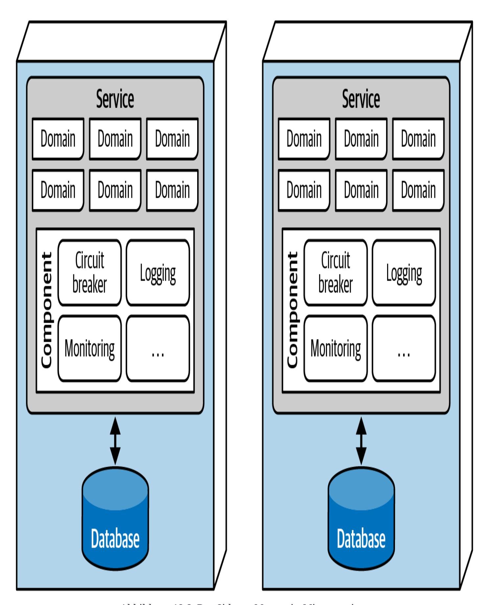

Abbildung 18-2. Das Sidecar-Muster in Microservices

In [Abbildung](#page-12-0) 18-2 werden die gemeinsamen betrieblichen Belange (Stromkreisunterbrecher, Protokollierung, Überwachung) in jedem Dienst als separate Komponenten angezeigt, die jeweils einzelnen Teams oder einem gemeinsamen Infrastrukturteam gehören können. Die Komponente Sidecar kümmert sich um alle betrieblichen Belange, die von der Kopplung profitieren. Wenn es also an der Zeit ist, das Monitoring-Tool zu aktualisieren, kann das gemeinsame Infrastrukturteam den Beiwagen aktualisieren, und jeder Microservice erhält die neue Funktionalität (siehe ["Überlegungen](#page-51-0) zur Team-Topologie").

Wenn jeder Dienst eine gemeinsame Sidecar Komponente enthält, kann der Architekt ein *Dienstnetz* aufbauen, um den Teams eine einheitliche Kontrolle über diese gemeinsamen Belange in der gesamten Architektur zu ermöglichen. Die Sidecar-Komponenten verbinden sich zu einer einheitlichen Betriebsschnittstelle für alle Microservices, wie in [Abbildung](#page-14-0) 18-3 dargestellt.

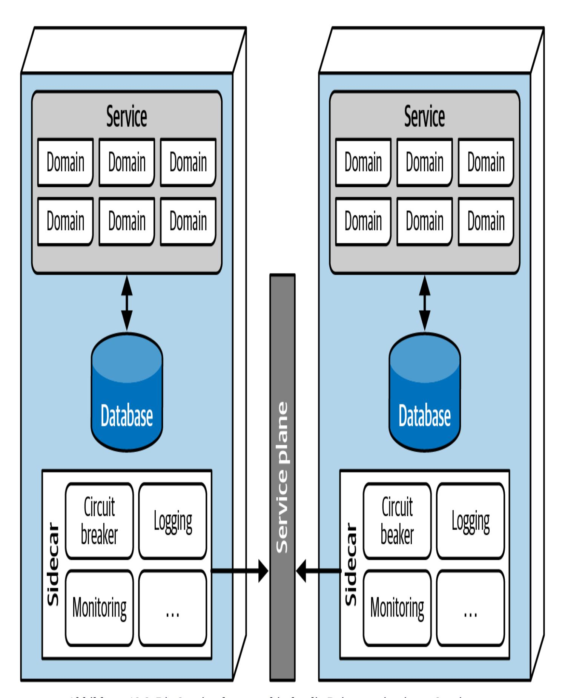

Abbildung 18-3. Die Serviceebene verbindet die Beiwagen in einem Servicenetz

In [Abbildung](#page-14-0) 18-3 ist jeder Sidecar mit der *Serviceebene* verdrahtet. Eine Serviceebene ist eine Integrationssoftware (in der Regel in Form eines Produkts wie [Istio\)](https://oreil.ly/cohCg), die die einzelnen Sidecars über eine einheitliche Schnittstelle verbindet und so das Service-Netz bildet.

Jeder Dienst bildet einen Knoten im Gesamtnetz, wie in [Abbildung](#page-16-0) 18-4 dargestellt. Das Servicenetz bildet eine Konsole, über die die Teams die betriebliche Kopplung global steuern können, z. B. Überwachungsstufen, Protokollierung und andere übergreifende betriebliche Belange.

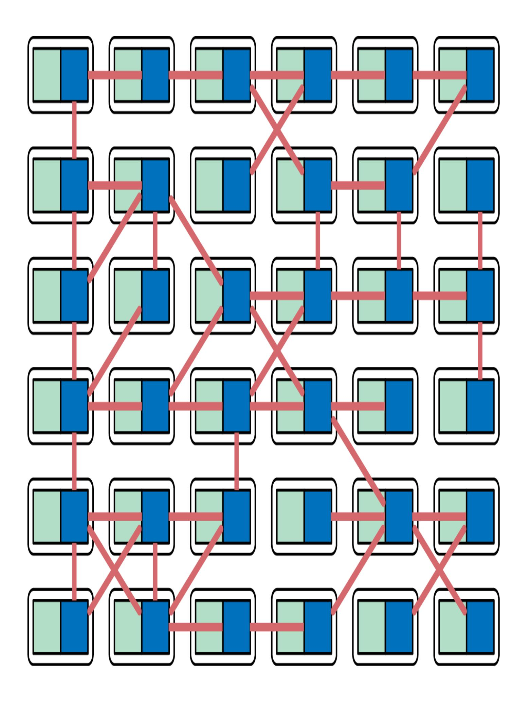

Architekten nutzen Service [Discovery](https://oreil.ly/IvPCO), um die Elastizität von Microservices-Architekturen zu erhöhen. *Service Discovery* ist eine Methode zur automatischen Erkennung und Lokalisierung von Diensten innerhalb eines Netzwerks. Wenn eine Anfrage eingeht, wird nicht nur ein einzelner Dienst aufgerufen, sondern ein Service Discovery Tool, das die Anzahl und Häufigkeit der Anfragen überwacht und neue Instanzen von Diensten aufbaut, um Skalierungs- oder Elastizitätsprobleme zu lösen. Architekten binden die Service Discovery oft in das Service Mesh ein und machen sie so zu einem Teil jedes Microservices. Die API-Schicht wird oft als Host für die Service Discovery verwendet, so dass Benutzeroberflächen oder andere aufrufende Systeme an einer einzigen Stelle Services auf elastische und konsistente Weise finden und erstellen können.

### **Frontends**

Microservices begünstigen eine Entkopplung, die idealerweise sowohl die Benutzeroberflächen als auch die Backend-Anliegen umfasst. Tatsächlich sah die ursprüngliche Vision für Microservices die Benutzeroberfläche als Teil des begrenzten Kontexts vor, getreu dem Prinzip des begrenzten Kontexts in DDD. Die praktische Umsetzung der für Webanwendungen erforderlichen Partitionierung (und andere externe Zwänge) machen dies jedoch zu einem schwierigen Ziel. Deshalb gibt es für Microservices-Architekturen in der Regel zwei UI-Stile.

Der erste Stil, der in [Abbildung](#page-19-0) 18-5 dargestellt ist, ist das *monolithische Frontend* mit einer einzigen Benutzeroberfläche, die die API-Schicht aufruft, um Benutzeranfragen zu erfüllen. Bei diesem Frontend kann es sich um eine Desktop-, Mobil- oder Webanwendung handeln. Viele Webanwendungen verwenden heute zum Beispiel ein JavaScript-Webframework, um eine einzige Benutzeroberfläche zu erstellen.

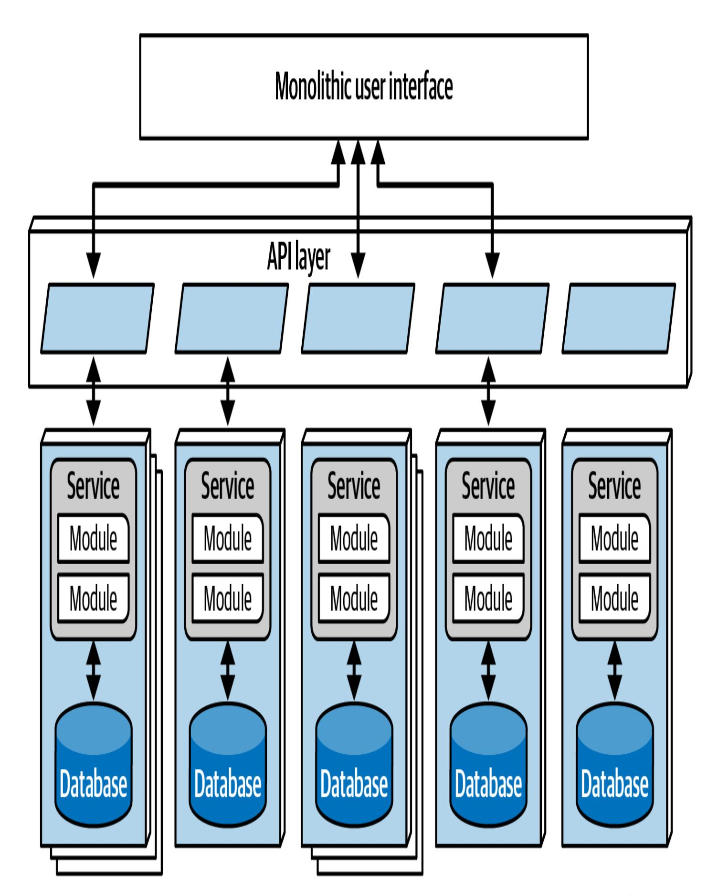

Abbildung 18-5. Microservices-Architektur mit einer monolithischen Benutzeroberfläche

Die zweite UI-Option sind *Mikro-Frontends*, wie in [Abbildung](#page-21-0) 18-6 dargestellt.

Der Micro-Frontend-Ansatz verwendet Komponenten auf der UI-Ebene, um eine synchrone Granularität und Isolierung in der UI und den Backend-Diensten zu schaffen und so Beziehungen zwischen den UI-Komponenten und den entsprechenden Backend-Diensten herzustellen.

Um mehr über Micro-Frontends zu erfahren, empfehlen wir das Buch *Building [Micro-Frontends](https://learning.oreilly.com/library/view/building-micro-frontends-2nd/9781098170776/)*, 2nd Edition, von Luca Mezzalira (O'Reilly, 2025).

### **Kommunikation**

Bei Microservices kämpfen Architekten und Entwickler um die richtige Service-Granularität, die sowohl die Datenisolierung als auch die Kommunikation beeinflusst. Der richtige Kommunikationsstil hilft den Teams, die Dienste entkoppelt zu halten und sie dennoch sinnvoll zu koordinieren.

Grundsätzlich müssen sich Architekten für eine *synchrone* oder *asynchrone* Kommunikation entscheiden. Bei der synchronen Kommunikation muss der Sender auf eine Antwort des Empfängers warten. Microservices-Architekturen nutzen in der Regel eine *protokollbasierte heterogene Interoperabilität* für die Kommunikation mit und zwischen den Diensten. Lass uns diesen komplizierten Begriff in seine Bestandteile zerlegen, um besser zu verstehen, was er bedeutet und warum er wichtig ist:

### *Protokollabhängig*

Da Microservices keinen zentralen Integrationsknotenpunkt enthalten, muss jeder Dienst wissen, wie er andere Dienste aufrufen kann. Daher legen Architekten in der Regel fest, *wie* bestimmte Dienste einander aufrufen: eine bestimmte REST-Stufe, Nachrichtenwarteschlangen und so weiter. Das bedeutet, dass die Dienste wissen (oder herausfinden) müssen, welches Protokoll sie verwenden müssen, um andere Dienste aufzurufen.

### *Heterogenes*

Da es sich bei Microservices um eine verteilte Architektur handelt, kann jeder Dienst in einem anderen Technologie-Stack geschrieben werden. *Heterogen* bedeutet, dass Microservices polyglotte Umgebungen, in denen verschiedene Dienste unterschiedliche Plattformen nutzen, vollständig unterstützen.

### *Interoperabilität*

Beschreibt Dienste, die sich gegenseitig aufrufen. Während die Architekten von Microservices versuchen, transaktionale Methodenaufrufe zu vermeiden, rufen Dienste häufig andere Dienste über das Netzwerk auf, um zusammenzuarbeiten und Informationen auszutauschen.

#### **ERZWUNGENE HETEROGENITÄT**

Ein bekannter Architekt, der ein Pionier des Microservices-Stils war, war Chefarchitekt eines Start-ups, das Software zur Verwaltung persönlicher Informationen für mobile Geräte entwickelte. Da es sich bei mobilen Geräten um ein so schnelllebiges Problemfeld handelt, wollte der Architekt sicherstellen, dass keines der Entwicklungsteams versehentlich Kopplungspunkte schafft, die seine Fähigkeit, sich unabhängig zu bewegen, behindern könnten. Es stellte sich heraus, dass die Teams über eine große Bandbreite an technischen Fähigkeiten verfügten, so dass der Architekt eine neue Regel aufstellte: Jedes Entwicklungsteam musste einen *anderen* Technologie-Stack verwenden. Wenn ein Team mit Java und das andere mit .NET arbeitete, war es unmöglich, dass sie versehentlich Klassen gemeinsam nutzten!

Dieser Ansatz ist das genaue Gegenteil der meisten Unternehmensrichtlinien, die auf der Standardisierung eines einzigen Technologie-Stacks bestehen. In der Welt der Microservices geht es nicht darum, ein möglichst komplexes Ökosystem zu schaffen, sondern darum, die richtige Technologie für den engen Umfang des Problems zu wählen. Nicht jeder Dienst braucht eine große relationale Datenbank, und einem kleinen Team eine solche aufzudrängen, verlangsamt es wahrscheinlich eher, als dass es ihm nützt. Dieses Konzept macht sich die hohe Entkopplung von Microservices zunutze.

Für die asynchrone Kommunikation verwenden Architekten oft Ereignisse und Nachrichten, ähnlich wie bei der ereignisgesteuerten Architektur in [Kapitel](#page--1-0) 15 beschrieben.

### **Choreografie und Inszenierung**

*Die Choreografie* verwendet denselben Kommunikationsstil wie die EDA. Choreografische Architekturen haben keinen zentralen Koordinator, was die Philosophie des begrenzten Kontexts respektiert und es natürlich macht, entkoppelte Ereignisse zwischen den Diensten zu implementieren.

Bei der Choreografie ruft jeder Dienst andere Dienste nach Bedarf auf, ohne einen zentralen Vermittler. Betrachte zum Beispiel das in [Abbildung](#page-26-0) 18-7 dargestellte Szenario. Der Nutzer fragt nach Details über die Wunschliste eines anderen Nutzers. Da der Dienst CustomerWishList nicht alle benötigten Informationen enthält, ruft er CustomerDemographics auf, um die fehlenden Informationen abzurufen, und gibt das Ergebnis dann an den Nutzer zurück.

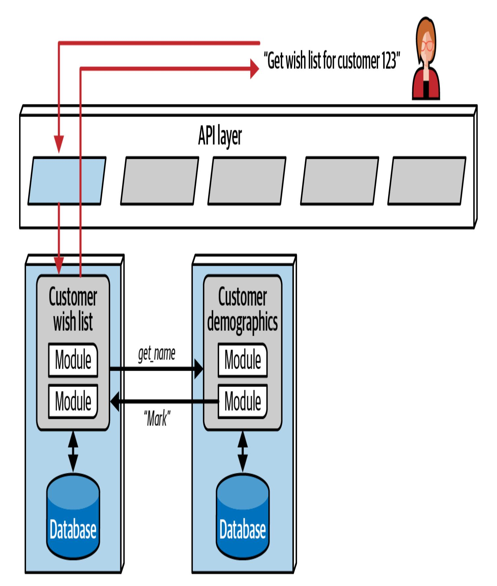

Abbildung 18-7. Einsatz von Choreografie in Microservices für die Koordination

Da Microservices-Architekturen im Gegensatz zu anderen serviceorientierten Architekturen keinen globalen Mediator enthalten, kann ein Architekt, der mehrere Dienste koordinieren muss, seinen eigenen lokalisierten Mediator (normalerweise ein *Orchestrierungsdienst* genannt) erstellen.

In [Abbildung](#page-28-0) 18-8 erstellen die Entwickler einen Dienst, dessen einzige Aufgabe es ist, die Aufrufe zu koordinieren. So ruft der Nutzer beispielsweise den ReportCustomerInformation Mediator auf, der alle notwendigen anderen Dienste aufruft, um die gewünschten Informationen zu erhalten.

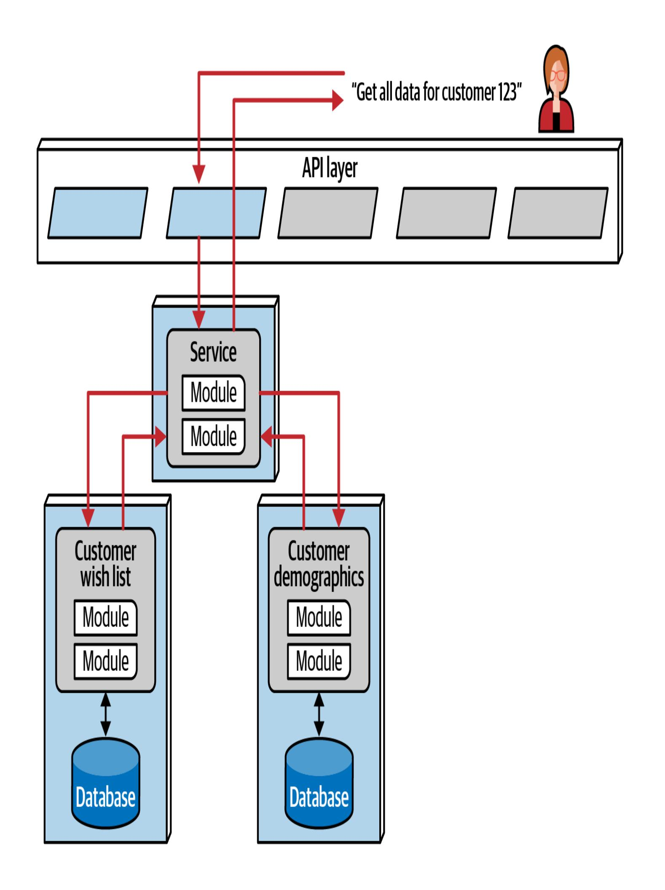

Das erste Gesetz der Softwarearchitektur besagt, dass keine dieser Lösungen perfekt ist - jede hat ihre Kompromisse. Die Choreografie bewahrt die hochgradig entkoppelte Philosophie der Microservices, um deren maximale Vorteile zu nutzen. Sie macht aber auch häufige Probleme wie Fehlerbehandlung und Koordination komplexer.

Betrachten wir ein Beispiel mit einem komplexeren Arbeitsablauf. In [Abbildung](#page-30-0) 18-9 muss der erste aufgerufene Dienst eine Vielzahl von anderen Diensten koordinieren und fungiert im Grunde genommen als Vermittler zusätzlich zu seinen anderen Aufgaben. Dies wird als *Front-Controller-Muster* bezeichnet, bei dem ein nominell choreografierter Dienst zu einem komplexeren Vermittler für ein Problem wird. Der Nachteil dieses Musters ist, dass der Dienst, der mehrere Rollen übernimmt, die Komplexität erhöht.

Abbildung 18-9. Verwendung der Choreografie für einen komplexen Geschäftsprozess

Alternativ kann der Architekt die Orchestrierung für komplexe Geschäftsprozesse nutzen, wie in [Abbildung](#page-32-0) 18-10 dargestellt. Der Architekt erstellt einen Vermittlungsdienst, um den Geschäftsablauf zu koordinieren. Dadurch entsteht eine Kopplung zwischen diesen Diensten, aber der Architekt kann die Koordinierung auch auf einen einzigen Dienst konzentrieren, so dass die anderen weniger betroffen sind. Da die Arbeitsabläufe in der Domäne oft von Natur aus gekoppelt sind, besteht die Aufgabe des Architekten darin, einen Weg zu finden, diese Kopplung so darzustellen, dass die Ziele der Domäne und der Architektur bestmöglich unterstützt werden.

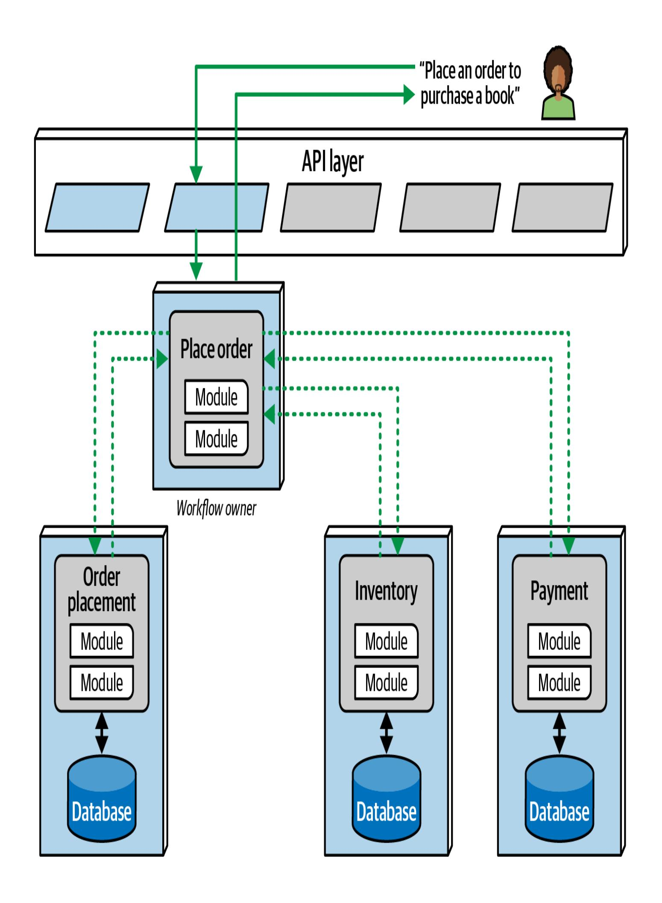

## **Transaktionen und Sagen**

Architekten streben eine extreme Entkopplung in Microservices an, stoßen aber oft auf das Problem, wie sie Transaktionen über Dienste hinweg koordinieren können. Da Microservices das gleiche Maß an Entkopplung in den Datenbanken wie in der Architektur fördern, wird die Atomarität, die in monolithischen Anwendungen trivial war, in verteilten Anwendungen zu einem Problem.

Der Aufbau von Transaktionen über Service-Grenzen hinweg verstößt gegen das zentrale Entkopplungsprinzip von Microservices und schafft außerdem die schlimmste Art der dynamischen Konnaszenz, die *Connascence of Values* (siehe ["Connascence"\).](#page--1-3) Der beste Rat, den wir Architekten geben können, die serviceübergreifende Transaktionen durchführen wollen, ist: *Lass es!* Lege stattdessen die Granularität der Dienste fest. Wenn du feststellst, dass du deine Microservices-Architektur mit Transaktionen verknüpfen musst, ist das ein Zeichen dafür, dass dein Design zu granular ist.

#### **TIPP**

Versuche, Transaktionen zu vermeiden, die sich über mehrere Microservices erstrecken - fixiere stattdessen die Granularität der Services!

Gemäß der Regel "Es kommt darauf an" gibt es immer Ausnahmen. Es kann zum Beispiel eine Situation entstehen, in der zwei verschiedene

Dienste sehr unterschiedliche Architekturmerkmale benötigen, die unterschiedliche Dienstgrenzen erfordern, aber dennoch eine Transaktionskoordination benötigen. In diesem Fall könnte der Architekt nach sorgfältiger Abwägung der Kompromisse bestimmte Transaktionsmuster nutzen, um Transaktionen zu orchestrieren.

Verteilte Transaktionen in Microservices werden in der Regel durch ein sogenanntes *Saga-Muster* abgewickelt. In der Literatur ist eine *Saga* eine epische Geschichte, die eine lange Abfolge von Ereignissen beschreibt, die zu einer Art heldenhaftem Ende führt. Daher der Name dieses Transaktionsmusters.

In [Abbildung](#page-35-0) 18-11 fungiert ein Dienst als Vermittler zwischen mehreren Dienstaufrufen, um eine Transaktion zu koordinieren. Der Vermittler ruft jeden Teil der Transaktion auf, registriert Erfolg oder Misserfolg und koordiniert die Ergebnisse. Wenn alles wie geplant läuft, werden alle Werte in den Diensten und den darin enthaltenen Datenbanken synchron aktualisiert. Wenn ein Fehler auftritt und ein Teil der Transaktion fehlschlägt, muss der Mediator sicherstellen, dass kein Teil der Transaktion erfolgreich ist. Betrachte die in [Abbildung](#page-37-0) 18-12 dargestellte Situation.

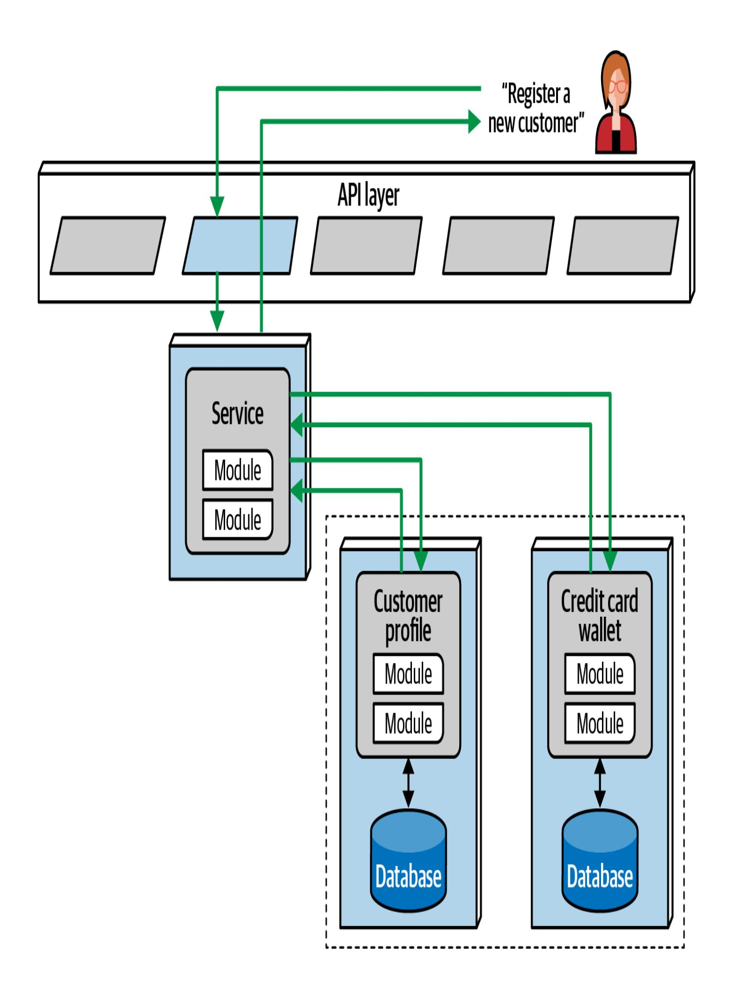

Wenn der erste Teil der Transaktion erfolgreich ist, der zweite Teil aber fehlschlägt, muss der Vermittler eine Anfrage an alle anderen teilnehmenden Dienste der Transaktion senden, die erfolgreich waren, und sie auffordern, die vorherige Anfrage rückgängig zu machen. Diese Art der Transaktionskoordination wird als *kompensierender Transaktionsrahmen* bezeichnet. In der Regel implementieren die Entwickler dieses Muster, indem sie jede Anfrage des Vermittlers in den Zustand pending überführen, bis der Vermittler den Gesamterfolg anzeigt. Das Jonglieren mit asynchronen Anfragen kann jedoch sehr komplex werden, vor allem wenn neue Anfragen auftauchen, die von einem ausstehenden Transaktionsstatus abhängig sind. Unabhängig vom verwendeten Protokoll verursachen kompensierende Transaktionen einen hohen Koordinationsaufwand auf der Netzwerkebene.

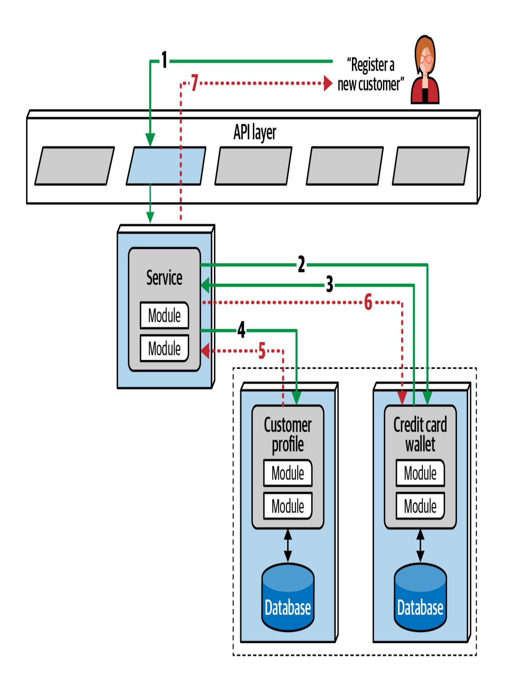

#### **TIPP**

Manchmal ist es notwendig, dass einige wenige Transaktionen dienstübergreifend sind. Wenn dies jedoch das Hauptmerkmal der Architektur ist, dann sind Microservices wahrscheinlich nicht die richtige Wahl!

Die Verwaltung von Transaktionen in Microservices ist kompliziert, und du kannst viel tiefer eintauchen. Wir haben acht verschiedene transaktionale Saga-Muster identifiziert, um eine Vielzahl von Szenarien zu lösen, die du in Kapitel 12 unseres Buches *[Softwarearchitektur](https://www.amazon.com/Software-Architecture-Trade-Off-Distributed-Architectures/dp/1492086894)* findest *[:](https://www.amazon.com/Software-Architecture-Trade-Off-Distributed-Architectures/dp/1492086894) The Hard [Parts](https://www.amazon.com/Software-Architecture-Trade-Off-Distributed-Architectures/dp/1492086894)* (O'Reilly, 2021), das wir gemeinsam mit Pramod Sadalage und Zhamak Dehghani verfasst haben.

## Daten-Topologien

Wie wir in diesem Kapitel bereits besprochen haben, spielen Daten in Microservices-Architekturen eine entscheidende Rolle. Tatsächlich ist Microservices der einzige Architekturstil, der *von* den Architekten *verlangt,* die Daten zu zerlegen. Während es in anderen verteilten Architekturen *möglich* (wenn auch nicht immer effektiv) ist, eine monolithische Datenbank zu verwenden, ist dies bei Microservices einfach keine Option. Genauso wenig wie Domain-Datenbanken, wie wir in ["Datentopologien"](#page--1-4) und auch in ["Datentopologien"](#page--1-5) besprechen [.](#page--1-5) Das liegt an der Feinkörnigkeit von Microservices, dem begrenzten Kontext

und der großen Anzahl von Diensten, die in den meisten Microservices-Ökosystemen zu finden sind.

Um zu verdeutlichen, warum eine monolithische Datenbank in Microservices nicht praktikabel ist, betrachten wir ein Szenario, in dem 60 Dienste dieselbe Datenbank nutzen. Das erste Problem, das sich stellt, ist die Kontrolle von Änderungen innerhalb der Architektur. Wie [Abbildung](#page-40-0) 18-13 zeigt, würde eine Änderung der Datenbankstruktur (z. B. die Änderung eines Spaltennamens oder das Löschen einer Tabelle) entsprechende Änderungen bei allen 60 Diensten erfordern, die diese Daten nutzen. Stell dir vor, du müsstest die Wartung, das Testen und die Freigabe von fünf Dutzend separat bereitgestellten Diensten koordinieren und gleichzeitig die Datenbankänderungen freigeben! Diese Aufgabe wäre, gelinde gesagt, entmutigend und würde wahrscheinlich in einem Desaster enden.

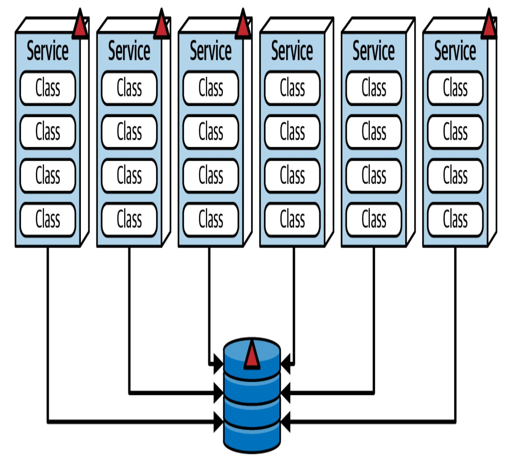

Abbildung 18-13. Die Steuerung von Änderungen mit einer monolithischen Datenbank ist eine sehr anspruchsvolle Aufgabe

Das vielleicht größte Problem bei der Kombination einer monolithischen Datentopologie mit Microservices besteht darin, dass das Konzept eines physisch begrenzten Kontexts nicht mehr funktioniert. Der Bounded Context umfasst *alle* Funktionen, die zur Ausführung einer bestimmten Geschäftsfunktion oder eines Teilbereichs erforderlich sind, *einschließlich der Datenbank und der entsprechenden Datenstrukturen*.

Wenn jeder Dienst die gleiche Datenbank und die gleichen Datenstrukturen nutzt, verschwindet der Bounded Context.

Ein weiteres Problem bei monolithischen Daten ist die Skalierbarkeit und Elastizität. Während viele Betriebs-Tools und -Produkte die gleichzeitige Last automatisch überwachen und die Anzahl der Service-Instanzen entsprechend anpassen, gibt es nicht viele Datenbanken, die sich entsprechend skalieren lassen. Dieses Ungleichgewicht kann zu Problemen bei der Reaktionsfähigkeit und zu Zeitüberschreitungen bei Anfragen führen. Die Verwaltung der Datenbankverbindungen, die sich in der Regel in jeder *Service-Instanz* befinden, ist ein weiteres Problem. Wenn die Zahl der Dienste und Dienstinstanzen steigt, können die Dienste schnell keine Datenbankverbindungen mehr haben, was zu weiteren Wartezeiten und Timeouts führt.

Wenn die Datenbank aufgrund eines Absturzes, einer geplanten Wartung oder eines Backups nicht mehr verfügbar ist, fällt das gesamte Microservices-Ökosystem aus - wie bei jeder Architektur mit einer monolithischen Datenbank. Eine domänenbasierte Datenbanktopologie ist zwar nicht so extrem, kann aber unter denselben Problemen wie Skalierbarkeit, Verwaltung von Datenbankverbindungspools, Verfügbarkeit und Fehlertoleranz leiden.

Aus diesen Gründen ist die Standard-Datenbanktopologie für Microservices das *Database-per-Service-Muster*. Bei dieser Datenbanktopologie besitzt jeder Microservice seine eigenen Daten, die als Tabellen in einer separaten Datenbank oder einem Schema enthalten sind (siehe [Abbildung](#page-42-0) 18-14).

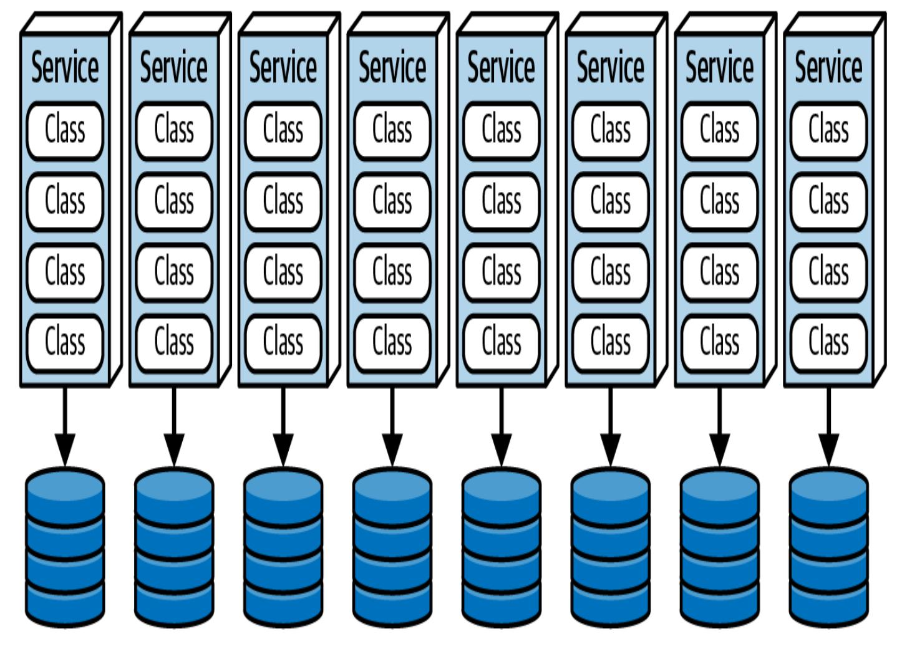

Abbildung 18-14. Das Datenbank-per-Service-Muster ist die typische Datenbanktopologie für Microservices

Diese Topologie bewahrt den begrenzten Kontext und macht es für Architekten einfacher, Änderungen zu kontrollieren. Da andere Dienste, die Daten benötigen, diese über eine Art Vertrag vom besitzenden Dienst anfordern müssen, sind sie von der internen Struktur der Daten entkoppelt. Änderungen an der Datenbankstruktur wirken sich nur auf den eigenen Dienst innerhalb des begrenzten Kontexts aus. Das gibt Architekten die Freiheit, den Datenbanktyp zu ändern (z. B. von einer relationalen Datenbank zu einer Dokumentendatenbank), ohne andere Dienste zu beeinträchtigen.

Die Datenbank-per-Service-Topologie bietet außerdem eine hervorragende Skalierbarkeit, Elastizität, Verfügbarkeit und Fehlertoleranz - architektonische Eigenschaften, die bei monolithischen oder domänenbasierten Datenbanktopologien leiden. Außerdem ist die Verwaltung von Verbindungen zur Datenbank innerhalb eines begrenzten Kontexts viel einfacher als bei einer monolithischen oder domänenbasierten Datenbank.

Die Datenbank-per-Service-Topologie wird zwar häufig in Microservices verwendet, hat aber auch ihre Nachteile. Was ist zum Beispiel, wenn zwei oder mehr Dienste in dieselbe Datenbanktabelle schreiben? Was ist, wenn ein Dienst außerhalb des begrenzten Kontexts die Datenbank aus Leistungsgründen direkt abfragen *muss*? In diesen Fällen (die ziemlich häufig vorkommen) ist es möglich, dass sich mehrere Dienste eine Datenbank teilen, wie in [Abbildung](#page-44-0) 18-15 dargestellt. Wir empfehlen, dass sich nicht mehr als fünf oder sechs Dienste eine einzige Datenbank (oder ein Schema) teilen. Bei mehr als fünf oder sechs Diensten treten die gleichen Probleme mit der Änderungskontrolle, Skalierbarkeit, Elastizität, Verfügbarkeit, Fehlertoleranz usw. auf.

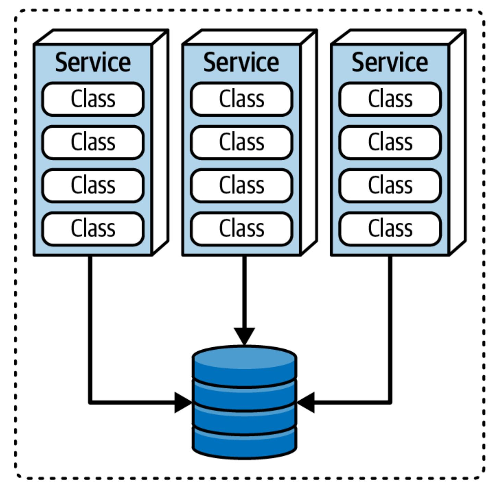

Abbildung 18-15. Es ist möglich, Daten zwischen mehreren Microservices zu teilen

Der Rahmen um die Dienste und die Datenbank in [Abbildung](#page-44-0) 18-15 stellt den begrenzten Kontext dar. Nur weil sich die Dienste eine Datenbank teilen, bedeutet das nicht, dass es keinen begrenzten Kontext gibt; es bedeutet nur, dass der Architekt einen *breiteren* begrenzten Kontext gebildet hat. Zum Beispiel kann es gute Gründe dafür geben, die

Zahlungsabwicklung in verschiedene Zahlungsarten aufzuteilen (z. B. Kreditkarte, Geschenkkarte, PayPal, Prämienpunkte usw.), aber diese einzelnen Dienste müssen trotzdem dieselben Daten aktualisieren und darauf zugreifen. Genauso kann ein Architekt einen einzigen Versanddienst in verschiedene Dienste aufteilen, einen für jede Versandart, aber diese Dienste müssen immer noch dieselben Daten aktualisieren und darauf zugreifen.

Der wichtigste Kompromiss bei der gemeinsamen Nutzung von Daten zwischen Microservices in einem breiteren Kontext ist die Kontrolle von Datenbankänderungen. Wenn sich das Datenbankschema ändert, muss der Architekt nun die Änderung und den Einsatz mehrerer Dienste koordinieren, was Datenbankänderungen riskanter und weniger agil macht. Je nach Geschäftsproblem und Situation kann dies auch negative Folgen für die Skalierbarkeit, Elastizität und Fehlertoleranz haben.

# Überlegungen zur Cloud

Microservices können zwar auch in On-Premise-Systemen eingesetzt werden, insbesondere mit der Popularität von Service-Orchestrierungsplattformen wie [Kubernetes](https://kubernetes.io/) und Cloud [Foundry](https://cloudfoundry.org/), aber dieser Architekturstil eignet sich auch sehr gut für Cloud-basierte Implementierungen - so sehr, dass Microservices manchmal auch als "Cloud-native" Architektur bezeichnet werden. Die bedarfsgerechte Bereitstellung von virtuellen Maschinen, Containern und Datenbanken in Kombination mit dem dienstbasierten Ansatz in Cloud-Umgebungen (wie AWS) passt gut zum Architekturstil der Microservices.

Der aufmerksame Leser fragt sich vielleicht, warum wir [Serverless](https://oreil.ly/Oltzv) nicht als Architekturstil aufgenommen haben. *Serverless* bezieht sich auf ein Cloud-Computing-Modell, bei dem Funktionen auf Anfrage ausgelöst werden und die erforderlichen Maschinenressourcen auf Abrufbasis zugewiesen werden. Zu den serverlosen Funktionen gehören Artefakte wie AWS [Lambdas,](https://aws.amazon.com/lambda) Google Cloud [Functions](https://cloud.google.com/functions) und Azure Cloud [Functions](https://oreil.ly/wzcp3). Wir glauben, dass Serverless kein Architekturstil ist, sondern ein *Bereitstellungsmodell* des Microservices-Architekturstils.

Wie bereits weiter oben im Kapitel erwähnt, wird ein *Microservice* als eine separat bereitgestellte Softwareeinheit definiert, die nur *einen* einzigen Zweck erfüllt (daher das Präfix *micro*). Daher sind Microservices in der Regel relativ feinkörniger als Services in anderen Architekturstilen. Dies beschreibt im Wesentlichen auch eine *serverlose Funktion*, weshalb wir Serverless als Teil von Microservices betrachten.

Allerdings *müssen* Microservices in Cloud-Umgebungen nicht zwangsläufig als serverlose Funktionen bereitgestellt werden, sondern können genauso gut als containerisierte Dienste implementiert werden. Die meisten Cloud-Anbieter haben Kubernetes (oder eine Form der Kubernetes-Plattform) eingeführt, so dass Entwicklerinnen und Entwickler Microservices in Containern genauso einfach bereitstellen können wie serverlose Dienste.

## Gemeinsame Risiken

Eines der größten Risiken bei Microservices ist es, die Dienste *zu* klein zu machen. Im Jahr 2016 prägte einer deiner Autoren (Mark) den Namen *Grains of Sand (Sandkörner* ) für das Verhaltensmuster, Dienste zu feinkörnig zu gestalten, so wie Sandkörner an einem Strand. Wie wir bereits erwähnt haben, bezieht sich das *Mikro* in Microservices darauf, *was* der Dienst tut, nicht wie *groß* er ist. Die Granularität von Diensten ist ein so wichtiger Aspekt von Microservices, dass wir ihr ein ganzes Kapitel (Kapitel 7) in unserem Buch *[Softwarearchitektur](https://www.amazon.com/Software-Architecture-Trade-Off-Distributed-Architectures/dp/1492086894) widmen: The Hard Parts*.

Ein weiteres häufiges Risiko bei Microservices ist, dass zu viel Kommunikation zwischen den Diensten stattfindet. Die feinkörnige Natur von Microservices in Kombination mit eng begrenzten Kontexten macht es erforderlich, dass Services innerhalb eines Microservices-Ökosystems unweigerlich miteinander kommunizieren müssen. Diese Kommunikation kann durch die Verarbeitung von Arbeitsabläufen (z. B. Choreografie oder AWS-Schrittfunktionen für serverlose Microservices) oder durch den Bedarf an den Daten eines anderen Dienstes (aufgrund des begrenzten Kontexts innerhalb jedes Dienstes und seiner Daten) bedingt sein. Unabhängig vom Grund solltest du darauf achten, zu viel dynamische Kopplung und Kommunikation zwischen den Services zu vermeiden. Auch dies ist oft das Ergebnis von zu feinkörnigen Diensten und kann durch die Kombination von Diensten zu grobkörnigeren Microservices behoben werden.

Ein weiteres Risiko bei Microservices besteht darin, es mit der gemeinsamen Nutzung von Daten zu übertreiben. Wir haben zwar bereits erwähnt, dass es möglich (und manchmal notwendig) ist, Daten in Microservices gemeinsam zu nutzen, aber zu viel gemeinsame Nutzung von Daten gefährdet die Änderungskontrolle, Skalierbarkeit, Fehlertoleranz und allgemeine Agilität des Systems - alles Dinge, die Microservices besonders gut können (siehe ["Stilmerkmale"\).](#page-53-0) Erkenne, wann es notwendig ist, Daten gemeinsam zu nutzen und wann du die gemeinsame Nutzung von Daten durch eine Servicekonsolidierung verhindern solltest.

Ein letztes Risiko, das bei der Microservices-Architektur oft übersehen wird, ist die Wiederverwendung von Code und die gemeinsame Nutzung von Funktionen. Die Wiederverwendung von Code ist ein notwendiger Bestandteil der Softwareentwicklung. Die Wiederverwendung von Code und Funktionen steht jedoch im direkten Widerspruch zu den Grundsätzen von Microservices, daher der Begriff "Share Nothing"- Architektur, der weiter oben in diesem Kapitel beschrieben wurde. Wenn ein Architekt gemeinsame Funktionen zwischen Diensten durch benutzerdefinierte Bibliotheken (z. B. JAR-Dateien oder DLLs) teilt, fällt ein Teil des begrenzten Kontexts auseinander. Mit anderen Worten: Wiederverwendeter Code ist über mehrere Bounded Contexts verteilt, was bedeutet, dass nicht *alle* Funktionen für eine bestimmte Funktion oder Subdomain in ihrem Bounded Context enthalten sind und daher eine Änderung am gemeinsam genutzten Code Dienste in anderen Bounded Contexts stören könnte. Die Versionierung hilft zwar dabei, dieses Problem zu lösen, aber die gemeinsame Nutzung von Code verkompliziert das Ökosystem der Microservices dennoch erheblich.

## Governance

Viele der Governance-Regeln und -Techniken, die in Microservices zum Einsatz kommen, zielen auf die allgemeinen Risiken ab, die wir im vorherigen Abschnitt beschrieben haben. Bei der Governance in einer Microservices-Architektur geht es vor allem darum, einen strukturellen Verfall zu vermeiden.

In erster Linie sollten Architekten die statische und dynamische Kopplung zwischen den Diensten überwachen und kontrollieren. Wir erinnern uns an [Kapitel](#page--1-0) 7: Statische Kopplung tritt auf, wenn Microservices gemeinsame benutzerdefinierte Bibliotheken oder Bibliotheken von Drittanbietern nutzen, sowie in Form von Verträgen, wenn Dienste miteinander kommunizieren müssen. Verträge sind besonders wichtig: Obwohl Architekten asynchroneKommunikationsprotokolle verwenden können, um Dienste *dynamisch* zu entkoppeln, können sie dennoch durch den zwischen ihnen verwendeten Vertrag *statisch* gekoppelt sein (unabhängig vom Kommunikationstyp).

Eine Software-Stückliste, Deployment-Skripte und Tools für das Abhängigkeitsmanagement können Architekten dabei helfen, die Anzahl der Artefakte, die zwischen den Diensten ausgetauscht werden, besser zu verstehen und zu steuern. Wir können zwar nicht genau vorschreiben, wie viel statische Kopplung *zu viel* ist, aber wir empfehlen, die Kopplung zwischen den Diensten zu minimieren.

Die Regelung der dynamischen Kopplung ist viel schwieriger als die Regelung der statischen Kopplung. Das Sammeln geeigneter Metriken erfordert etwas Kreativität und Konsistenz. Eine gängige Methode zur Steuerung ist die Verwendung von Protokollen, um Aufrufe an andere Dienste zu identifizieren. Wenn Dienste interne Dienste oder Dienste von Drittanbietern aufrufen, protokollieren diese Dienste die Interaktionen zusammen mit Informationen darüber, welcher Dienst aufgerufen wird, welches Protokoll verwendet wird und so weiter. Architekten können diese Informationen mit Hilfe von Fitnessfunktionen analysieren, um die dynamische Kopplung im gesamten Ökosystem der Microservices besser zu verstehen. Dieser Ansatz erfordert jedoch eine strenge Kontrolle, um sicherzustellen, dass jeder Dienst diese Informationen durch die Protokollierung auf konsistente Weise offenlegt. Eine benutzerdefinierte Bibliothek (z. B. eine JAR-Datei oder DLL) ist eine Möglichkeit, eine einheitliche API bereitzustellen, an die sich alle Dienste zur Kompilierungszeit binden können, um eine einheitliche Protokollierung zu gewährleisten.

Eine weitere Möglichkeit, dynamische Kopplungsdaten in Microservices zu erfassen, sind Registry-Einträge. Wenn die erste Instanz eines Dienstes gestartet wird, registriert dieser Dienst seine Interservice-Aufrufe über eine Art Vertrag (z. B. JSON) bei einem benutzerdefinierten Konfigurationsdienst oder [Konfigurationsserver, wie](https://zookeeper.apache.org/) z. B. Apache ZooKeeper. Der Architekt kann dann den Konfigurationsserver abfragen, um eine Karte aller Interservice-Aufrufe im gesamten Microservices-Ökosystem zu erhalten, mit der er die Kommunikation zwischen den Diensten steuern und kontrollieren kann.

# Überlegungen zur Team-Topologie

Da Microservices-Architekturen nach Domänen aufgeteilt sind, funktionieren sie am besten, wenn die Teams auch nach Domänenbereichen ausgerichtet sind (z. B. funktionsübergreifende Teams mit Spezialisierung). Wenn eine bereichsbezogene Anforderung auftaucht, kann ein bereichsbezogenes funktionsübergreifendes Team gemeinsam an dieser Funktion innerhalb eines bestimmten Bereichsdienstes arbeiten, ohne andere Teams oder Dienste zu beeinträchtigen. Umgekehrt funktionieren technisch partitionierte Teams (wie UI-Teams, Backend-Teams, Datenbank-Teams usw.) aufgrund der Domänenpartitionierung nicht gut mit diesem Architekturstil. Die Zuweisung von fachlichen Anforderungen an ein technisch organisiertes Team erfordert ein Maß an teamübergreifender Kommunikation und Zusammenarbeit, das sich in den meisten Unternehmen als schwierig erweist.

Hier sind einige Überlegungen für Architekten, die eine Microservices-Architektur mit den spezifischen Teamtopologien, die in ["Teamtopologien](#page--1-6) und Architektur" beschrieben sind, in Einklang bringen wollen [:](#page--1-6)

#### *Auf den Strom ausgerichtete Teams*

Wenn die Domänengrenzen richtig ausgerichtet sind, arbeiten Teams, die sich an Streams orientieren, gut mit diesem Architekturstil, insbesondere wenn ihre Streams auf einebestimmte Domäne ausgerichtet sind. Die Microservices-Architektur wird jedoch für

Teams schwieriger, deren Streams mehrere begrenzte Kontexte und Dienste außerhalb einer bestimmten Subdomäne oder Domäne umfassen. In diesem Fall empfehlen wir, die Kontexte und die Granularität der Microservices zu analysieren und sie entweder neu auf die Streams auszurichten oder einen anderen Architekturstil zu wählen.

### *Teams befähigen*

Enabling Teams sind in einer Microservices-Architektur am effektivsten, wenn sie gemeinsam genutzte Dienste für spezielle oder übergreifende Belange nutzen können. Aufgrund der hohen Modularität von Microservices können Enabling-Teams unabhängig von den Stream-Teams arbeiten, um zusätzliche spezialisierte und gemeinsam genutzte Funktionen bereitzustellen, ohne dabei im Weg zu stehen. In Zusammenarbeit mit den Plattformteams können sie auch bei der Erstellung der Sidecar-Komponenten helfen, die ein Service-Mesh bilden (siehe "Operative [Wiederverwendung"\).](#page-10-0)

#### *Teams mit komplizierten Subsystemen*

Teams, die mit komplizierten Subsystemen arbeiten, können die Modularität dieses Architekturstils auf Serviceebene nutzen, um sich auf die Bearbeitung komplizierter Domänen oder Subdomänen zu konzentrieren und dabei unabhängig von anderen Teammitgliedern (und Services) zu bleiben.

#### *Plattform-Teams*

Der hohe Grad an Modularität, der in Microservices zu finden ist, hilft den Stream-Teams, die Vorteile der Plattform-Teams-Topologie zu

nutzen, indem sie gemeinsame Tools, Dienste, APIs und Aufgaben verwenden. In vielen Fällen konzentrieren sich Plattformteams (manchmal in Zusammenarbeit mit Enabling-Teams) auf die Erstellung und Pflege der übergreifenden betrieblichen Funktionen, die in Sidecars (siehe "Betriebliche [Wiederverwendung"\)](#page-10-0) und dem Service Mesh zu finden sind, und befreien die an den Streams orientierten Teams von diesen betrieblichen Aufgaben.

## Stilmerkmale

Der Microservices-Architekturstil bietet mehrere Extreme auf unserer Standardbewertungsskala, die in [Abbildung](#page-54-0) 18-16 dargestellt ist. Eine Ein-Stern-Bewertung bedeutet, dass das spezifische Architekturmerkmal in der Architektur nicht gut unterstützt wird, während eine Fünf-Stern-Bewertung bedeutet, dass das Architekturmerkmal eines der stärksten Merkmale des Architekturstils ist. Definitionen für jedes in der Scorecard genannte Merkmal findest du in [Kapitel](#page--1-0) 4.

Microservices bieten eine bemerkenswert hohe Unterstützung für moderne Entwicklungspraktiken wie automatisierte Bereitstellung und Testbarkeit. Microservices wären ohne die DevOps-Revolution mit ihrem unaufhaltsamen Vormarsch in Richtung Automatisierung der betrieblichenAbläufe nicht denkbar.

|             | Architectural characteristic | Star rating                      |
|-------------|------------------------------|----------------------------------|
|             | Overall cost                 | \$\$\$\$\$                       |
| Structural  | Partitioning type            | Domain                           |
|             | Number of quanta             | 1 to many                        |
|             | Simplicity                   | $\stackrel{\bigstar}{\sim}$      |
|             | Modularity                   | ***                              |
| Engineering | Maintainability              | ***                              |
|             | Testability                  | ***                              |
|             | Deployability                | ***                              |
|             | Evolvability                 | ***                              |
| Operational | Responsiveness               | $\stackrel{\wedge}{\Rightarrow}$ |
|             | Scalability                  | ****                             |
|             | Elasticity                   | ***                              |
|             | Fault tolerance              | ***                              |

Die unabhängige, zweckgebundene und damit feinkörnige Natur der Dienste in diesem Architekturstil führt im Allgemeinen zu einer hohen Fehlertoleranz, daher die hohe Bewertung für dieses Merkmal.

Die weiteren Pluspunkte dieser Architektur sind Skalierbarkeit, Elastizität und Entwicklungsfähigkeit. Einige der skalierbarsten Systeme, die je entwickelt wurden, haben Microservices mit großem Erfolg eingesetzt. Da diese Art von Architektur stark auf Automatisierung und intelligente Integration mit dem Betrieb setzt, können Architekten auch Elastizität einbauen. Da diese Architektur eine hohe Entkopplung auf inkrementeller Ebene begünstigt, unterstützt sie auch die moderne Geschäftspraxis des evolutionären Wandels, sogar auf der Architekturebene. Moderne Unternehmen entwickeln sich schnell, und die Softwareentwicklung hat es schwer, damit Schritt zu halten. Eine Architektur mit extrem kleinen, hochgradig entkoppelten Einsatzeinheiten kann eine schnellere Änderungsrate unterstützen.

Die Leistung ist bei Microservices oft ein Problem. Verteilte Architekturen müssen viele Netzwerkaufrufe tätigen, um die Arbeit zu erledigen, und das hat einen hohen Leistungs-Overhead zur Folge. Außerdem müssen sie Sicherheitsprüfungen durchführen, um die Identität und den Zugriff für jeden Endpunkt zu verifizieren, was zu weiteren Latenzzeiten führt. Microservices leiden auch unter *Datenlatenz*: Wenn eine Anfrage von mehreren Diensten koordiniert werden muss, bedeutet das mehrere Datenbankaufrufe.

Aus diesem Grund gibt es in der Welt der Microservices viele Architekturmuster, die die Leistung steigern, wie z. B. intelligentes Daten-Caching und Replikation, um ein Übermaß an Netzwerkaufrufen zu vermeiden. Die Leistung ist ein weiterer Grund dafür, dass Microservices oft Choreografie statt Orchestrierung verwenden: Weniger Kopplung ermöglicht eine schnellere Kommunikation und weniger Engpässe.

Bei Microservices handelt es sich eindeutig um eine Architektur mit Domänenunterteilung, bei der jede Dienstgrenze einer Domäne entsprechen sollte. Dank des begrenzten Kontexts hat sie auch die ausgeprägtesten Quanten aller modernen Architekturen - in vielerlei Hinsicht veranschaulicht sie, was das Quantenmaß bewertet. Die Philosophie der extremen Entkopplung bereitet zwar Kopfzerbrechen, bringt aber enorme Vorteile mit sich, wenn sie gut umgesetzt wird. Wie bei jeder Architektur müssen Architekten die Regeln verstehen, um sie auf intelligente Weise zu brechen.

# Beispiele und Anwendungsfälle

Systeme , die ein hohes Maß an funktionaler und datenbezogener Modularität aufweisen, sind gute Kandidaten für die Microservices-Architektur. Ein gutes Beispiel für die Leistungsfähigkeit dieses Stils ist ein medizinisches Überwachungssystem, das die Vitalparameter eines Patienten überwacht: Herzfrequenz, Blutdruck, Sauerstoffgehalt usw. Jedes Vitalzeichen, das das System überwacht, ist eine separate, unabhängige Funktion, die ihre eigenen Daten verwaltet, was gut zu diesem Architekturstil und dem Konzept des begrenzten Kontexts passt. Dieses Patientenüberwachungssystem liest Eingaben von Patientenüberwachungsgeräten, zeichnet Vitalwerte auf, analysiert diese Vitalwerte auf Probleme oder Unstimmigkeiten und alarmiert medizinisches Fachpersonal, wenn es Probleme findet. Jedes Vitalzeichen kann durch einen eigenen Microservice dargestellt werden, der weitgehend unabhängig von anderen Diensten und Daten ist. Eine Ausnahme von dieser Unabhängigkeit wäre jedoch, wenn ein bestimmtes Vitalzeichen (z. B. die Herzfrequenz) zusätzliche Informationen von einem anderen Vitalzeichen (z. B. einem Schlafüberwachungsdienst) benötigt, um sein Vitalzeichen auf Warnungen oder Probleme zu analysieren.

[Abbildung](#page-58-0) 18-17 zeigt, wie dieses System mit Hilfe einer Microservice-Architektur gestaltet werden könnte. Beachte, dass jedes Vitalzeichen als separater Microservice implementiert ist, der seinen eigenen Datenspeicher für Vitalzeichenwerte und historische Daten unterhält.

Die Alarmfunktionalität, die allen Vitalzeichendiensten gemeinsam ist, wird durch einen *gemeinsamen Dienst* namens Alert Staff repräsentiert. Er benachrichtigt eine Krankenschwester oder einen Arzt, wenn ein bestimmter Dienst feststellt, dass mit einem Wert etwas nicht stimmt. Jeder Dienst sendet asynchron seine neuesten Vitalwerte an einen Monitor im Patientenzimmer, der durch den gemeinsamen Dienst Display Vital Signs repräsentiert wird.

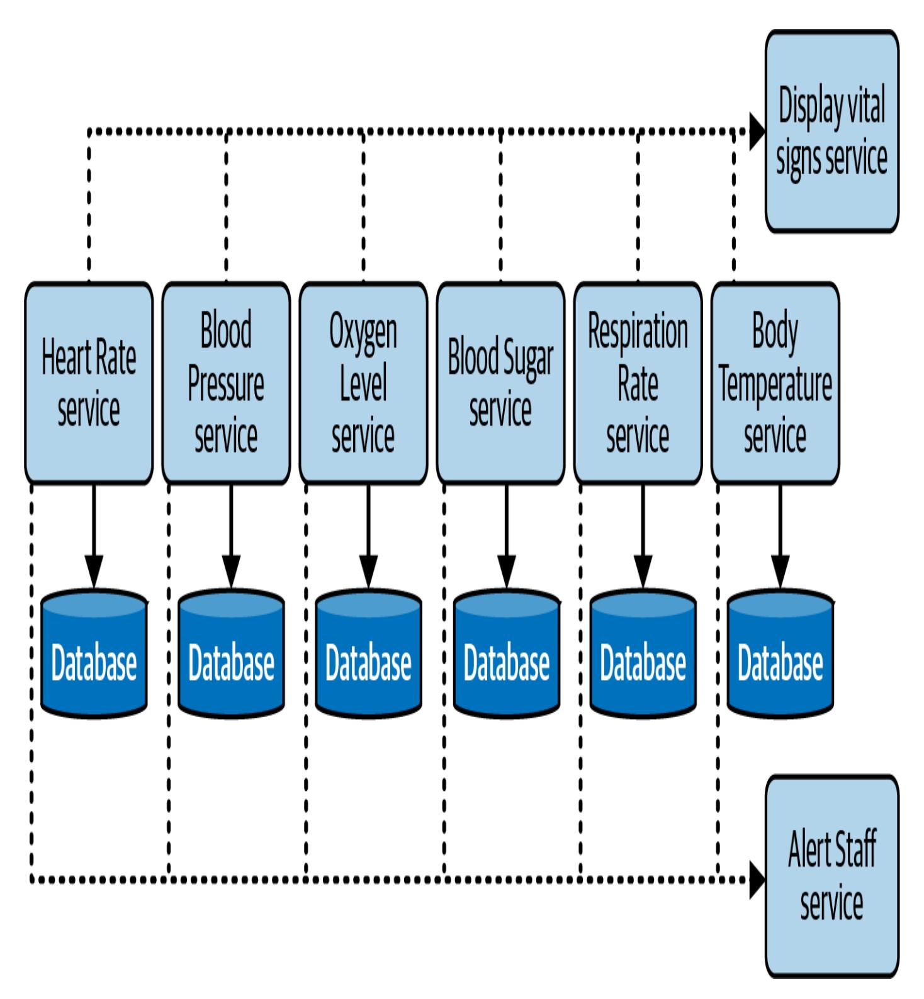

Abbildung 18-17. Ein medizinisches Überwachungssystem für Patienten, das mit einer Microservices-Architektur implementiert wurde

Dieses Beispiel verdeutlicht einige der Stärken und Vorteile der Microservices-Architektur. Beispiel *Fehlertoleranz*: Wenn einer der Vitalzeichen-Dienste ausfällt oder nicht mehr reagiert, bleiben alle

anderen Vitalzeichen-Überwachungsdienste voll funktionsfähig. Das ist besonders wichtig für die medizinische Überwachung. Eine weitere Superkraft ist die *Testbarkeit*. Wenn ein Entwickler einige Wartungsarbeiten am Blutdrucküberwachungsdienst durchführt, ist der Umfang der Tests so gering, dass er sicher sein kann, dass dieses spezielle Vitalzeichen vollständig getestet ist und die Wartung keine Auswirkungen auf andere Vitalzeichendienste hat. Und schließlich ist es ein Zeichen von *Evolvierbarkeit* (eine weitere Superkraft von Microservices), dass der Architekt problemlos einen weiteren Vitalzeichen-Monitor hinzufügen kann, ohne die anderen Dienste zu beeinträchtigen.

Wir haben in diesem Kapitel viele wichtige Aspekte der Microservices-Architektur angesprochen, und es gibt viele hervorragende Ressourcen, die du nutzen kannst, um mehr zu erfahren. Für einen tieferen Einblick in Microservices empfehlen wir Folgendes:

- *Aufbau von [Microservices](https://learning.oreilly.com/library/view/building-microservices-2nd/9781492034018/)*, 2. Auflage, von Sam Newman (O'Reilly, 2021)
- *Building [Micro-Frontends](https://learning.oreilly.com/library/view/building-micro-frontends-2nd/9781098170776/)*, 2. Auflage, von Luca Mezzalira (O'Reilly, 2025)
- *Microservices [vs. Service-Oriented](https://learning.oreilly.com/library/view/microservices-vs-service-oriented/9781491975657) Architecture* von Mark Richards (O'Reilly, 2016)
- *[Microservices](https://learning.oreilly.com/library/view/microservices-antipatterns-and/9781492042716) AntiPatterns and Pitfalls* von Mark Richards (O'Reilly, 2016)