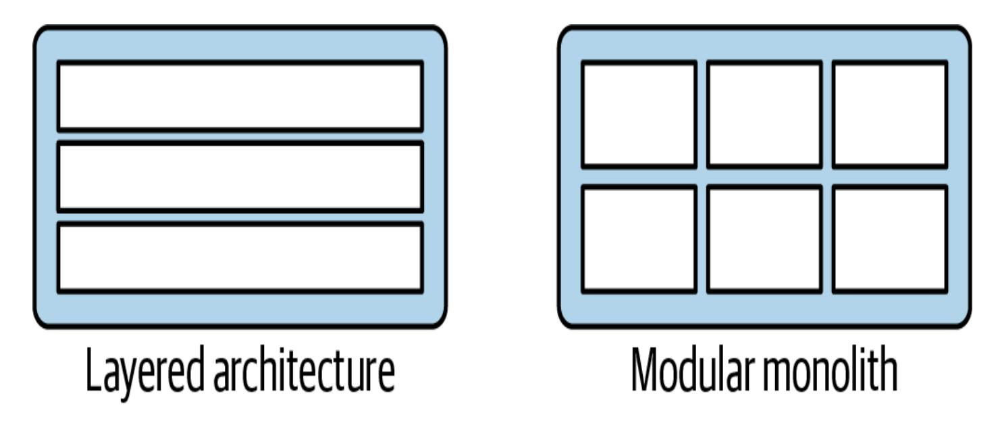
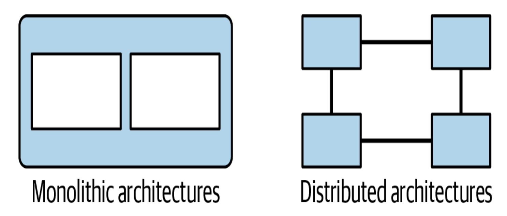
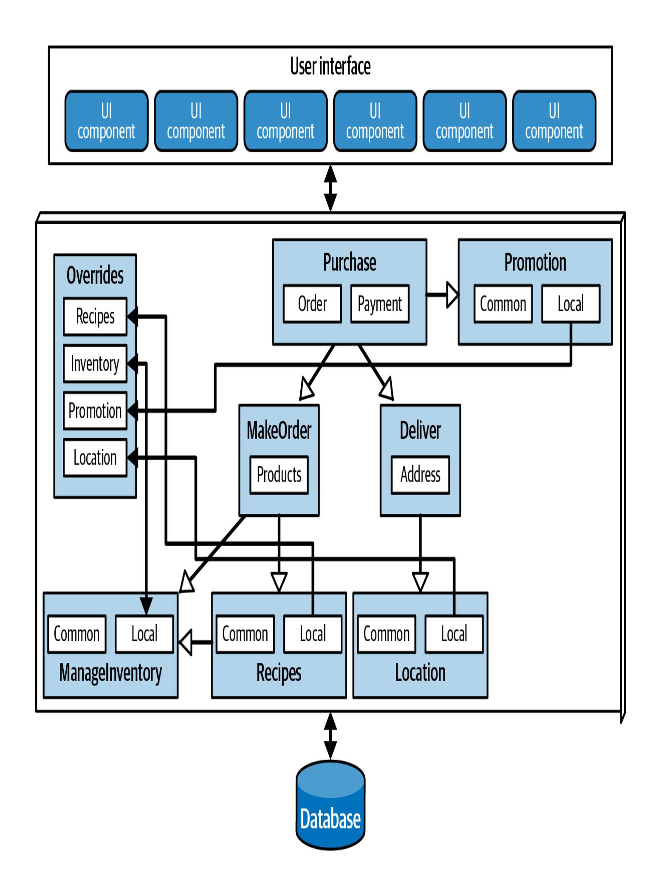
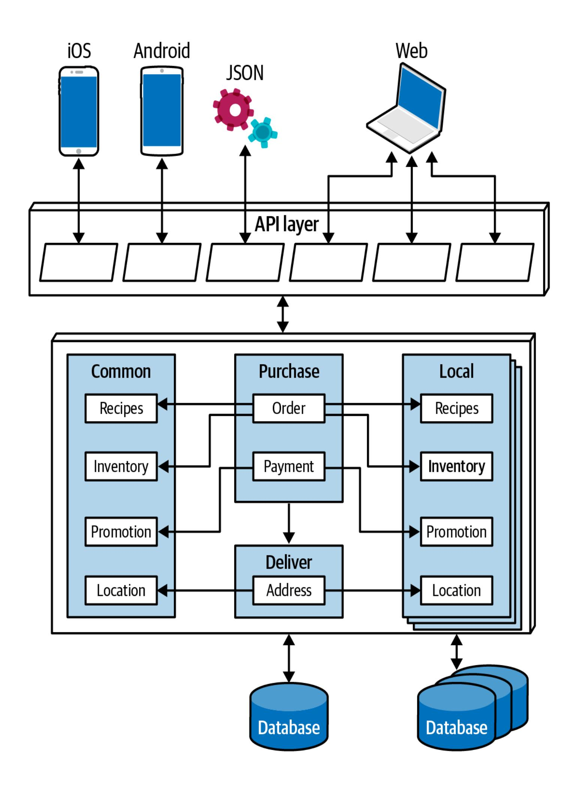
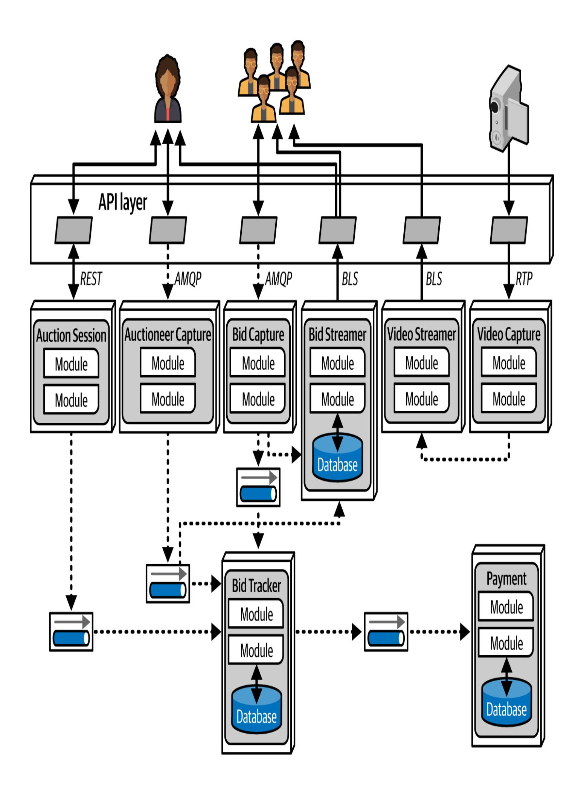
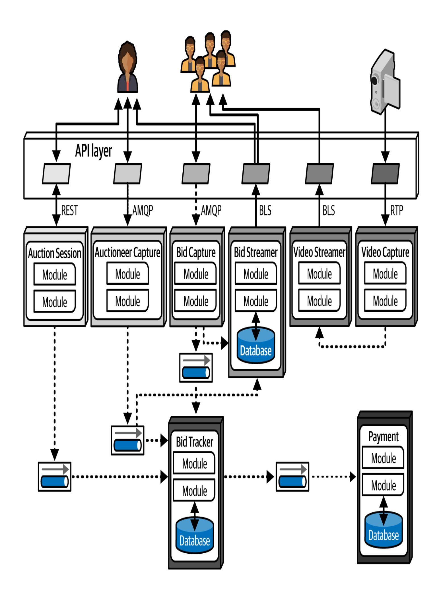

# Kapitel 19. Die Wahl des geeignetenArchitekturstils

Diese Arbeit wurde mithilfe von KI übersetzt. Wir freuen uns über dein Feedback und deine Kommentare: [translation-feedback@oreilly.com](mailto:translation-feedback@oreilly.com)

Es kommt darauf an! Bei all den Möglichkeiten, die es gibt (und es kommen fast täglich neue hinzu), würden wir dir gerne sagen, welchen Architekturstil du verwenden solltest - aber das können wir nicht. Nichts hängt so sehr von einer Reihe von Faktoren innerhalb eines Unternehmens und der Software ab, die es entwickelt. Die Entscheidung für einen Architekturstil ist der Höhepunkt eines ganzen Prozesses der Analyse und des Nachdenkens über Kompromisse bei Architekturmerkmalen, Überlegungen zur Domäne, strategischen Zielen und einer Vielzahl anderer Dinge. Wie wir bereits in [Kapitel](#page--1-0) 2 gesagt haben, kommt es also darauf an.

Wie kontextabhängig die Entscheidung auch sein mag, dieses Kapitel bietet einige allgemeine Ratschläge für die Wahl eines geeigneten Architekturstils.

## Wechselnde "Mode" in der Architektur

Die Vorlieben der Softwarebranche für Architekturstile ändern sich im Laufe der Zeit, was auf eine Reihe von Faktoren zurückzuführen ist.

## Dazu gehören:

## *Beobachtungen aus der Vergangenheit*

Neue Architekturstile entstehen in der Regel aus Beobachtungen vergangener Erfahrungen, insbesondere aus Beobachtungen von Schmerzpunkten. Die Erfahrungen, die Architekten bei der Arbeit mit Systemen machen - und die uns oft dazu bringen, Architekten zu werden - beeinflussen unsere Gedanken über zukünftige Systeme. Neue Architekturentwürfe spiegeln oft die Behebung spezifischer Unzulänglichkeiten vergangener Architekturstile wider. Nachdem wir zum Beispiel Architekturen entwickelt hatten, die sich auf die Wiederverwendung von Code konzentrierten, erkannten die Architekten die negativen Kompromisse und überdachten die Auswirkungen der Wiederverwendung von Code ernsthaft.

## *Veränderungen im Ökosystem*

Im Ökosystem der Softwareentwicklung ändert sich alles ständig. Dieser ständige Wandel ist so chaotisch, dass man nicht einmal vorhersagen kann, welche Art von Veränderung als nächstes kommt. Vor nicht allzu vielen Jahren wusste noch niemand, was Kubernetes ist, und jetzt gehört es zum Alltag vieler Entwickler/innen. In ein paar Jahren wird Kubernetes vielleicht durch ein anderes Tool ersetzt, das noch gar nicht geschrieben wurde.

## *Neue Fähigkeiten*

Architekten müssen nicht nur nach neuen Werkzeugen Ausschau halten, sondern auch nach neuen Paradigmen. Wenn neue Möglichkeiten auftauchen, kann die Architektur zu einem völlig

neuen Paradigma übergehen, anstatt nur ein Werkzeug durch ein anderes zu ersetzen. Nur wenige haben zum Beispiel die tektonische Verschiebung in der Welt der Softwareentwicklung vorausgesehen, die durch das Aufkommen von Containern wie Docker verursacht wurde. Obwohl dies ein evolutionärer Schritt war, hatte er erstaunliche Auswirkungen auf Architekten, Werkzeuge, technische Verfahren und vieles mehr. Der ständige Wandel im Ökosystem bringt auch regelmäßig neue Tools und Funktionen hervor. Selbst etwas, das wie ein neues Etwas aussieht, das wir schon haben, kann Nuancen enthalten, die es zu einem Game Changer machen. Neue Funktionen müssen nicht einmal die gesamte Entwicklungswelt auf den Kopf stellen: Eine kleine Änderung, die genau auf die Ziele eines Architekten abgestimmt ist, kann alles verändern.

## *Beschleunigung*

Das Ökosystem ändert sich nicht nur ständig, sondern der Wandel wird auch immer schneller und allgegenwärtiger. Neue Werkzeuge schaffen neue Entwicklungsmethoden, die zu neuen Designs und Fähigkeiten führen und Softwarearchitekten in einem ständigen Wandel halten. Der Aufstieg und Einfluss der generativen KI ist ein hervorragendes Beispiel für diese ständige Entwicklung und die damit verbundene Unvorhersehbarkeit.

## *Domänenänderungen*

Die Bereiche, für die wir Software schreiben, verändern sich ständig, wenn sich Unternehmen weiterentwickeln oder mit anderen Unternehmen fusionieren.

## *Technologieänderungen*

Unternehmen versuchen, zumindest mit einigen technologischen Veränderungen Schritt zu halten, vor allem mit denen, die offensichtliche Vorteile für den Gewinn bringen.

## *Externe Faktoren*

Viele externe Faktoren, die nur am Rande mit der Softwareentwicklung zu tun haben, können Veränderungen innerhalb eines Unternehmens bewirken. Zum Beispiel können Architekten und Entwickler mit einem bestimmten Tool sehr zufrieden sein, aber wenn die Lizenzkosten zu hoch werden, kann das Unternehmen gezwungen sein, auf eine andere Option umzusteigen.

Architekten sollten die aktuellen Branchentrends verstehen, damit sie intelligente Entscheidungen darüber treffen können, welchen Trends sie folgen und wann sie Ausnahmen machen sollten, unabhängig davon, wie sehr ihr Unternehmen der aktuellen Architekturmode folgt.

## Entscheidungskriterien

Bei der Wahl eines Architekturstils müssen Architekten alle verschiedenen Faktoren berücksichtigen, die zur Struktur des Domänenentwurfs beitragen. Grundsätzlich entwirft ein Architekt zwei Dinge: den Bereich, der festgelegt wurde, und die Strukturelemente, die für den Erfolg des Systems erforderlich sind (die durch die architektonischen Merkmale bereitgestellt werden).

Entscheide dich erst dann für einen Baustil, wenn du über die folgenden Faktoren ausreichend Bescheid weißt:

## *Die Domäne*

Verstehe so viele wichtige Aspekte des Geschäftsbereichs wie möglich, insbesondere diejenigen, die sich auf die Merkmale der operativen Architektur auswirken. Architekten müssen keine Fachexperten sein, sollten aber zumindest ein gutes Allgemeinwissen über die wichtigsten Aspekte des zu planenden Bereichs haben. Andere Spezialisten, wie z. B. Business Analysten, können dir helfen, Lücken in deinem Fachwissen zu schließen.

*Architekturmerkmale, die strukturelle Entscheidungen beeinflussen* Identifiziere und erkläre, welche Architekturmerkmale benötigt werden, um die Domäne und andere externe Faktoren zu unterstützen, indem du eine Analyse der Architekturmerkmale durchführst, eine der wichtigsten Aktivitäten bei der Auswahl eines Stils.

Es ist möglich, jeden der generischen Architekturstile in so gut wie jeder Problemdomäne zu implementieren - *generisch* bedeutet schließlich, dass sie universell einsetzbar sind. Ausnahmen sind Bereiche, die besondere betriebliche Architekturmerkmale erfordern, wie z. B. eine hoch skalierbare Auktionsseite. In den meisten Fällen geht es bei den Unterschieden zwischen den Architekturstilen jedoch nicht um die Domäne, sondern darum, wie gut jeder Stil verschiedene Architekturmerkmale unterstützt.

Du hast vielleicht bemerkt, dass die Sterndiagramme, die wir in Teil II dieses Buches zum Vergleich der einzelnen Architekturstile verwendet haben, sich auf architektonische *Merkmale* und nicht auf Domänen konzentrieren. Das zeigt, wie wichtig es ist, die architektonischen Merkmale zu verstehen, wenn man sich für einen Stil entscheidet.

## *Datenarchitektur*

Architekten und Datenentwickler müssen bei Datenbanken, Schemata und anderen datenbezogenen Themen zusammenarbeiten. Die Datenarchitektur ist ein eigenständiges Fachgebiet und wird in diesem Buch nur am Rande behandelt, abgesehen von stilistischen Überlegungen. Du musst jedoch wissen, wie sich ein bestimmtes Datendesign auf deine Architektur auswirkt, insbesondere wenn das neue System mit einer älteren oder bereits verwendeten Datenarchitektur interagieren muss.

## *Cloud-Einsätze*

Die Nutzung der Cloud als architektonisches Ziel ist die jüngste in einer langen Reihe grundlegender Veränderungen in Bezug auf den Ort, an dem Berechnungen und Daten gespeichert werden. Die Kompromisse, die bei der Entwicklung einer Anwendung für den Betrieb vor Ort eingegangen werden müssen, sind ganz anders als bei der Entwicklung einer Anwendung für die Cloud. Es ist wichtig zu wissen, wie viele Daten die Anwendung speichern muss und wie viele Daten verschoben werden können (was zu erheblichen Kosten führen kann).

Die Cloud ist ein großartiges Beispiel dafür, wie hochentwickelte Fähigkeiten mit der Zeit zu Gebrauchsgegenständen werden. Vor einem Jahrzehnt erforderte der Aufbau eines hochelastischen und skalierbaren On-Premise-Systems esoterische Fähigkeiten und galt als fast magisch. Heute können Architekten die gleichen Ergebnisse erzielen, indem sie einfach die Konfigurationsparameter ihres Cloud-Providers ändern.

## *Organisatorische Faktoren*

Viele externe Faktoren beeinflussen das Design. Zum Beispiel können die Kosten eines bestimmten Cloud-Anbieters ein Unternehmen davon abhalten, das ansonsten ideale Design zu übernehmen. Ebenso kann das Wissen, dass das Unternehmen Fusionen und Übernahmen plant, einen Architekten dazu bewegen, sich für offene Lösungen und Integrationsarchitekturen zu entscheiden.

*Kenntnisse über Prozesse, Teams und betriebliche Belange* Viele projektspezifische Faktoren beeinflussen die Entwürfe der Architekten: der Softwareentwicklungsprozess, die Interaktion (oder das Fehlen) des Architekten mit dem Betrieb und der Qualitätssicherungsprozess. Wenn es einem Unternehmen zum Beispiel an Reife in Bezug auf Agile Entwicklungspraktiken mangelt, werden Architekturen, die für den Erfolg auf diese Praktiken angewiesen sind (wie Microservices), Schwierigkeiten bereiten.

## *Bereich/Architektur-Isomorphismus*

*Architektur-Isomorphismus* ist ein schicker Begriff für die allgemeine "Form" einer Architektur - mit anderen Worten, die Art und Weise, wie ihre Komponenten innerhalb der Gesamttopologie voneinander abhängen. Das Wort *Isomorphie* bedeutet "eine Abbildung, die Mengen und Beziehungen zwischen Elementen bewahrt"; es leitet sich vom griechischen *isos* ab, was "gleich" bedeutet, und *morph*, was "Form" oder "Gestalt" bedeutet.

Architekten denken über die generische Form der Architektur nach, wenn sie überlegen, wie geeignet sie ist. Betrachte zum Beispiel die Unterschiede zwischen den beiden Architektur-Isomorphismus-Diagrammen für den schichtweisen und den modularen monolithischen Architekturstil in [Abbildung](#page-7-0) 19-1. Die innere Form der beiden Architekturen ist offensichtlich: Trennung nach Schichten und nach Domänen.

Abbildung 19-1. Vergleich zwischen den isomorphen Darstellungen von geschichteten und modularen Monolithen

Der Unterschied zwischen monolithischer und verteilter Architektur wird auch in isomorphen Zeichnungen deutlich, wie in [Abbildung](#page-8-0) 19-2 dargestellt. Hier macht die Verteilung der Kernkomponenten die Makroebene der Architektur deutlich.

Abbildung 19-2. Vergleich der isomorphen Darstellungen von monolithischen und verteilten Architekturen

Einige Problemdomänen passen zur Topologie der Architektur. Die Mikrokernel-Architektur eignet sich zum Beispiel perfekt für Systeme, die individuell angepasst werden müssen - der Architekt kann Anpassungen als Plug-ins entwickeln. Ein anderes Beispiel: Ein System, das für die Genomanalyse entwickelt wurde, die eine große Anzahl diskreter Operationen erfordert, könnte gut zu einer raumbasierten Architektur passen, die eine große Anzahl diskreter Prozessoren bietet.

Ebenso sind manche Problembereiche für bestimmte Architekturen besonders schlecht geeignet. Hoch skalierbare Systeme haben Schwierigkeiten mit großen monolithischen Designs, weil es für eine stark gekoppelte Codebasis schwierig ist, eine große Anzahl gleichzeitiger Benutzer zu unterstützen. Eine Problemdomäne, die ein hohes Maß an semantischer Kopplung aufweist, würde schlecht zu einer stark entkoppelten, verteilten Architektur passen: Eine Versicherungsanwendung, die aus mehrseitigen Formularen besteht, von denen jedes auf dem Kontext der vorangegangenen Seiten basiert, ist beispielsweise ein stark gekoppeltes Problem. Es wäre schwierig, es in einer entkoppelten Architektur wie Microservices zu modellieren. Eine absichtlich gekoppelte Architektur wie die servicebasierte Architektur wäre für dieses Problem besser geeignet.

Wenn du all diese Dinge berücksichtigst, musst du bei der Wahl eines Architekturstils mehrere Entscheidungen treffen:

### *Monolithisch oder verteilt?*

Reicht ein einziger Satz von Architekturmerkmalen für den Entwurf aus, oder benötigen verschiedene Teile des Systems unterschiedliche Architekturmerkmale? Ein einziger Satz bedeutet, dass ein Monolith geeignet wäre (auch wenn andere Faktoren für eine verteilte Architektur sprechen); unterschiedliche Sätze von Architekturmerkmalen bedeuten eine verteilte Architektur. Das Konzept des Architekturquantums[\(Kapitel](#page--1-0) 7) ist bei dieser Entscheidung hilfreich.

## *Wo sollen Daten leben?*

Bei einer monolithischen Architektur gehen Architekten in der Regel davon aus, dass sie eine einzige relationale Datenbank oder vielleicht ein paar davon verwenden werden. Bei einer verteilten Architektur musst du entscheiden, welche Dienste Daten aufbewahren sollen, was auch bedeutet, dass du dir Gedanken darüber machen musst, wie die

Daten durch die Architektur fließen, um Workflows zu erstellen. Berücksichtige sowohl die Struktur als auch das Verhalten, wenn du die Architektur entwirfst, und scheue dich nicht davor, dein Design zu iterieren, um bessere Kombinationen zu finden.

*Sollten Dienste synchron oder asynchron kommunizieren?* Sobald du festgelegt hast, wo die Daten gespeichert werden sollen, ist die nächste Überlegung die Kommunikation zwischen den Diensten soll sie synchron oder asynchron sein? Die synchrone Kommunikation ist oft bequemer, aber sie kann Kompromisse bei der Skalierbarkeit, Zuverlässigkeit und anderen wünschenswerten Eigenschaften bedeuten. Asynchrone Kommunikation kann einzigartige Vorteile in Bezug auf Leistung und Skalierbarkeit bieten, aber auch jede Menge Probleme mit der Datensynchronisation, Deadlocks, Race Conditions, Debugging usw. (Wir behandeln viele dieser Probleme in [Kapitel](#page--1-0) 15.)

Da die synchrone Kommunikation weniger Probleme beim Design, der Implementierung und der Fehlersuche mit sich bringt, empfehlen wir, wenn möglich auf synchrone Kommunikation zu setzen und nur bei Bedarf asynchrone Kommunikation zu verwenden.

#### **TIPP**

Verwende standardmäßig synchrone Kommunikation, asynchrone wenn nötig.

Das Ergebnis dieses Entwurfsprozesses ist eine *Architekturtopologie*, die den gewählten Architekturstil (und etwaige Hybridisierungen), Architectural Decision Records (ADRs) über die Teile des Entwurfs, die den größten Aufwand erfordern, und Architektur-Fitnessfunktionen zum Schutz wichtiger Prinzipien und operativerArchitektureigenschaften umfasst.

# Monolith Fallstudie: Silizium-Sandwiches

In der Silicon-Sandwiches-Architektur-Kata in [Kapitel](#page--1-0) 5 haben wir nach unserer Analyse der Architektureigenschaften festgestellt, dass ein einziger Quantum ausreicht, um das System zu implementieren. Da wir es mit einer einfachen Anwendung ohne großes Budget zu tun hatten, war die Einfachheit eines Monolithen verlockend.

Wir haben jedoch zwei verschiedene Komponentendesigns für Silicon Sandwiches erstellt: eines mit Domänenpartitionierung und ein anderes mit technischer Partitionierung - du solltest vielleicht noch einmal zu [Kapitel](#page--1-0) 5 zurückblättern, wenn du eine Auffrischung brauchst. In diesem Kapitel kehren wir zu diesen einfachen Lösungen zurück, um Designs für jede Option zu erstellen und ihre Kompromisse zu diskutieren. Wir beginnen mit einer monolithischen Architektur.

## **Modularer Monolith**

Ein modularer Monolith baut domänenzentrierte Komponenten mit einer einzigen Datenbank auf, die als ein einziges Quantum eingesetzt wird; das modulare Monolith-Design für Silicon Sandwiches ist in [Abbildung](#page-13-0) 19-3 dargestellt.

Es handelt sich um einen Monolithen mit einer einzigen relationalen Datenbank, der mit einer einzigen webbasierten Benutzeroberfläche implementiert wurde (mit sorgfältigen Designüberlegungen für mobile Geräte), um die Gesamtkosten niedrig zu halten. Jeder der von uns identifizierten Bereiche erscheint als eine Komponente. Wenn die Zeit und die Ressourcen ausreichen, solltest du in Erwägung ziehen, die Tabellen und andere Datenbankbestandteile genauso wie die Domänenkomponenten zu trennen. Das würde es viel einfacher machen, diese Architektur auf eine verteilte Architektur zu migrieren, wenn künftige Anforderungen dies rechtfertigen.

Da der Architekturstil selbst keine Anpassungen zulässt, sollte diese Funktion Teil des Domaindesigns werden. In diesem Fall entwirft der Architekt einen Override Endpunkt, an dem Entwickler individuelle Anpassungen hochladen können. Dementsprechend müssen sie sicherstellen, dass jede Domänenkomponente die Override Komponente für jedes anpassbare Merkmal referenziert. (Dies zu überprüfen, wäre eine perfekte Aufgabe für eine architektonische Fitnessfunktion).

## **Mikrokernel**

Eines der Architekturmerkmale, die wir in Silicon Sandwiches identifiziert haben, ist die Anpassbarkeit. [Abbildung](#page-15-0) 19-4 zeigt anhand der Isomorphie zwischen Domäne und Architektur, wie dies mit einer Mikrokernel-Architektur umgesetzt werden kann.

In [Abbildung](#page-15-0) 19-4 besteht das Kernsystem aus den

Domänenkomponenten und einer einzigen relationalen Datenbank. Wie beim modularen monolithischen Design erleichtert eine sorgfältige Synchronisierung zwischen den Domänen und dem Datendesign die Migration des Kerns zu einer verteilten Architektur in der Zukunft. Jede Anpassung erscheint in einem Plug-in; die allgemeinen Plug-ins erscheinen in einem einzigen Satz von Plug-ins (mit einer entsprechenden Datenbank) und einer Reihe von lokalen Plug-ins, jedes mit seinen eigenen Daten. Da keines der Plug-ins mit den anderen Plugins gekoppelt sein muss, kann jedes seine Daten behalten und entkoppelt bleiben.

Das andere einzigartige Element dieses Designs ist, dass es das Backends for Frontends (BFF)-Muster [verwendet, wodurch](https://oreil.ly/i3Hsc) die API-Schicht zusätzlich zur Kernarchitektur zu einem dünnen Mikrokernel-Adapter wird. Die API-Schicht liefert allgemeine Informationen vom Backend, die die BFF-Adapter in ein geeignetes Format für das Frontend-Gerät übersetzen. Die BFF für iOS nimmt zum Beispiel die allgemeine Backend-Ausgabe und passt das Datenformat, die Paginierung, die Latenzzeit und andere Faktoren an die Erwartungen der nativen iOS-Anwendung an. Die Entwicklung jedes BFF-Adapters ermöglicht eine möglichst vielfältige Benutzeroberfläche und macht es möglich, die Architektur zu erweitern, um in Zukunft auch andere Geräte zu unterstützen - einer der Vorteile des Mikrokernel-Stils.

Die Kommunikation innerhalb einer dieser beiden Silicon Sandwich Architekturen kann synchron erfolgen, da die Architektur keine extremen Leistungs- oder Elastizitätsanforderungen stellt und keine der Operationen langwierig ist .

# Verteilte Fallstudie: Going, Going, Going

Die Going, Going, Gone (GGG) Kata aus [Kapitel](#page--1-0) 8 stellt einige weitere interessante architektonische Herausforderungen dar. Anhand der Komponentenanalyse in "Fallstudie: [Going, Going, Gone-Discovering](#page--1-1) Components" wissen wir, dass verschiedene Teile dieser Architektur unterschiedliche Eigenschaften benötigen. Zum Beispiel sind die Anforderungen an Verfügbarkeit und Skalierbarkeit je nach Rolle (Auktionator und Bieter) unterschiedlich.

In den Systemanforderungen für GGG werden auch einige ehrgeizige Erwartungen in Bezug auf Skalierbarkeit, Elastizität, Leistung und andere schwierige operative Architektureigenschaften formuliert. Das Architekturmuster sollte ein hohes Maß an Anpassung auf einer feinkörnigen Ebene ermöglichen. Von den in Frage kommenden verteilten Architekturen sind die ereignisgesteuerte Low-Level-Architektur und die Microservices die beiden, die die meisten der geforderten Architekturmerkmale am besten erfüllen. Microservices sind besser geeignet, um Variationen bei den operativen Architekturmerkmalen zu unterstützen. (Bei rein ereignisgesteuerten

Architekturen werden die Teile in der Regel nicht nach ihren Architekturmerkmalen getrennt, sondern danach, ob sie orchestrierte oder choreografierte Kommunikation verwenden).

Das erklärte Leistungsziel zu erreichen, wäre bei Microservices eine Herausforderung, aber der beste Weg, eine Schwachstelle in einer Architektur zu beheben, ist, sie zu berücksichtigen. Obwohl Microservices von Natur aus ein hohes Maß an Skalierbarkeit bieten, kommt es häufig zu spezifischen Leistungsproblemen, die u. a. durch zu viel Orchestrierung oder zu aggressive Datentrennung verursacht werden.

In [Abbildung](#page-19-0) 19-5 wird jede identifizierte Komponente zu einem Dienst in der Architektur, wobei die Komponenten mit der Granularität der Dienste übereinstimmen. GGG hat drei verschiedeneBenutzeroberflächen:

*Bieter*

Die zahlreichen Bieter bei der Online-Auktion.

*Auktionator*

Eine pro Auktion.

*Streamer*

Ein Dienst, der für das Streaming von Videos und Geboten an die Bieter zuständig ist. Dies ist ein schreibgeschützter Stream, der Optimierungen ermöglicht, die bei einer Aktualisierung nicht möglich wären.

Die folgenden Dienste erscheinen in diesem Entwurf für die GGG-Architektur:

*Bid Capture*

Erfasst die Einträge von Online-Bietern und sendet sie asynchron an Bid Tracker . Dieser Dienst benötigt keine Persistenz, da er als Kanal für die Online-Gebote dient.

*Bid Streamer*

Überträgt die Gebote in einem leistungsstarken, schreibgeschützten Stream an die Online-Teilnehmer.

#### *Bid Tracker*

Verfolgt Gebote sowohl von Auctioneer Capture als auch von Bid Capture , vereinheitlicht diese beiden Informationsströme und ordnet die Gebote so nah wie möglich an der Echtzeit. Beide eingehenden Verbindungen zu diesem Dienst sind asynchron, so dass die Entwickler Nachrichtenwarteschlangen als Puffer verwenden können, um sehr unterschiedliche Nachrichtenflussraten zu bewältigen.

#### *Auctioneer Capture*

Erfasst Gebote für den Auktionator. Die Analyse in "Fallstudie: Going, [Going, Gone-Discovering](#page--1-1) Components" hat gezeigt, dass die Architekturmerkmale von Bid Capture und Auctioneer Capture sehr unterschiedlich sind, was uns dazu veranlasst hat, sie zu trennen.

## *Auction Session*

Verwaltet den Arbeitsablauf der einzelnen Auktionen.

#### *Payment*

Dritter Zahlungsanbieter, der die Zahlungsinformationen bearbeitet, nachdem Auction Session die Auktion abgeschlossen hat.

#### *Video Capture*

Nimmt den Videostream der Live-Auktion auf.

## *Video Streamer*

Streamt das Auktionsvideo zu den Online-Bietern.

Wir haben darauf geachtet, in dieser Architektur sowohl synchrone als auch asynchrone Kommunikationsformen zu verwenden. Die Wahl der asynchronen Kommunikation diente in erster Linie dazu, die unterschiedlichen Merkmale der Betriebsarchitektur der einzelnen Dienste zu berücksichtigen. Wenn der Dienst Payment beispielsweise nur alle 500 ms eine neue Zahlung verarbeiten kann und eine große Anzahl von Auktionen gleichzeitig endet, würde die synchrone Kommunikation zwischen den Diensten zu Zeitüberschreitungen und anderen Problemen mit der Zuverlässigkeit führen. Nachrichtenwarteschlangen erhöhen die Zuverlässigkeit eines

kritischen, aber anfälligen Teils der Architektur.

Letztendlich hat sich dieses Design in fünf Quanten aufgelöst, die in [Abbildung](#page-23-0) 19-6 dargestellt sind und ungefähr den Diensten entsprechen: Payment , Auctioneer , Bidder , Bidder Streams und Bid Tracker . Mehrere Instanzen werden im Diagramm durch Stapel von Containern angezeigt. Die Anwendung der Quantenanalyse in der Phase des Komponentenentwurfs erleichterte es, die Grenzen zwischen Diensten, Daten und Kommunikation zu erkennen.

Beachte, dass dies nicht das "richtige" Design für GGG ist, und es ist sicherlich nicht das einzige. Wir behaupten nicht einmal, dass es das bestmögliche Design ist, aber es scheint die *am wenigsten schlechten* Kompromisse zu haben. Durch die Wahl von Microservices und den intelligenten Einsatz von Ereignissen und Nachrichten kann diese Architektur das Beste aus einem generischen Architekturmuster herausholen und gleichzeitig eine Grundlage für zukünftige Entwicklungen und Erweiterungen schaffen .