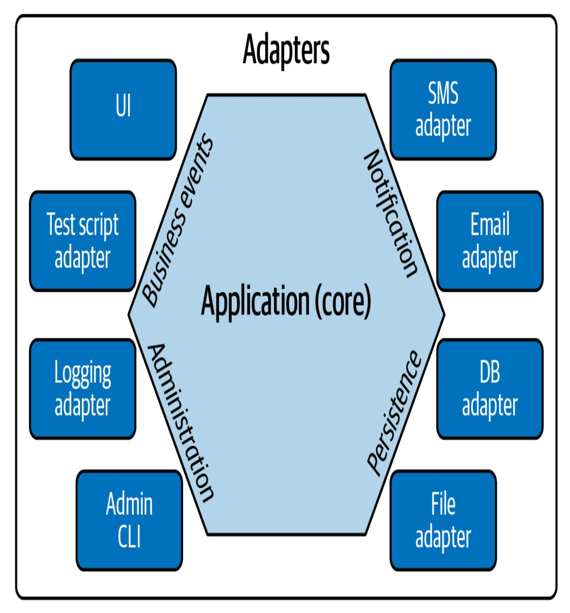
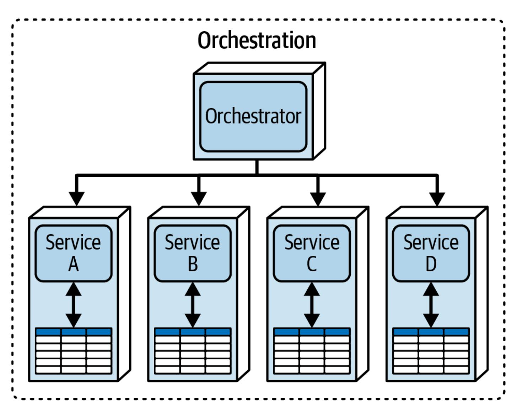
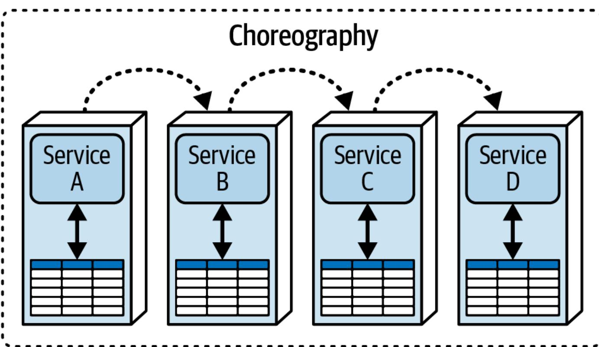
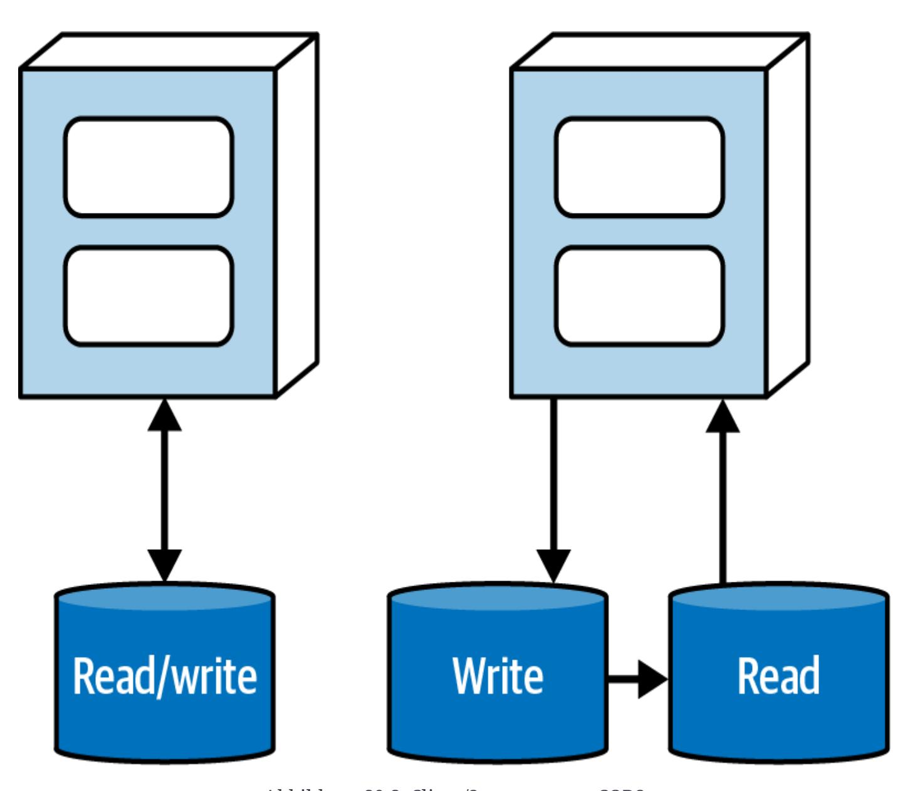
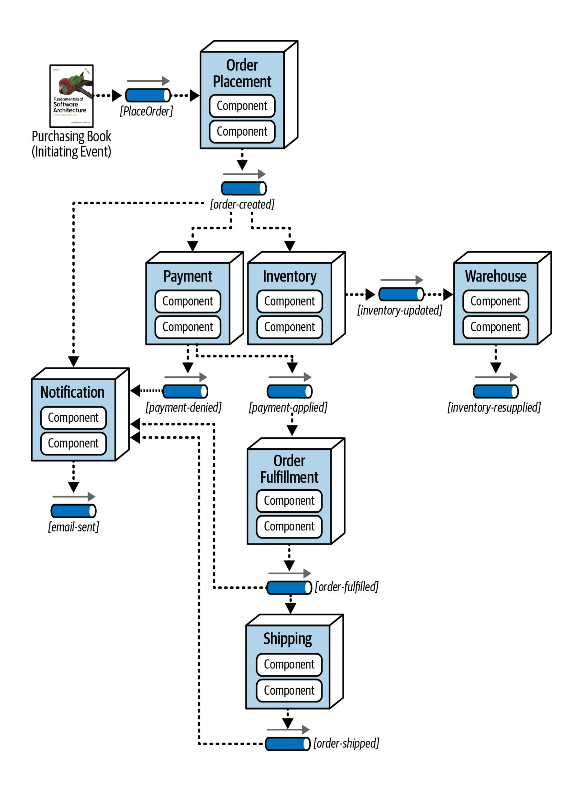
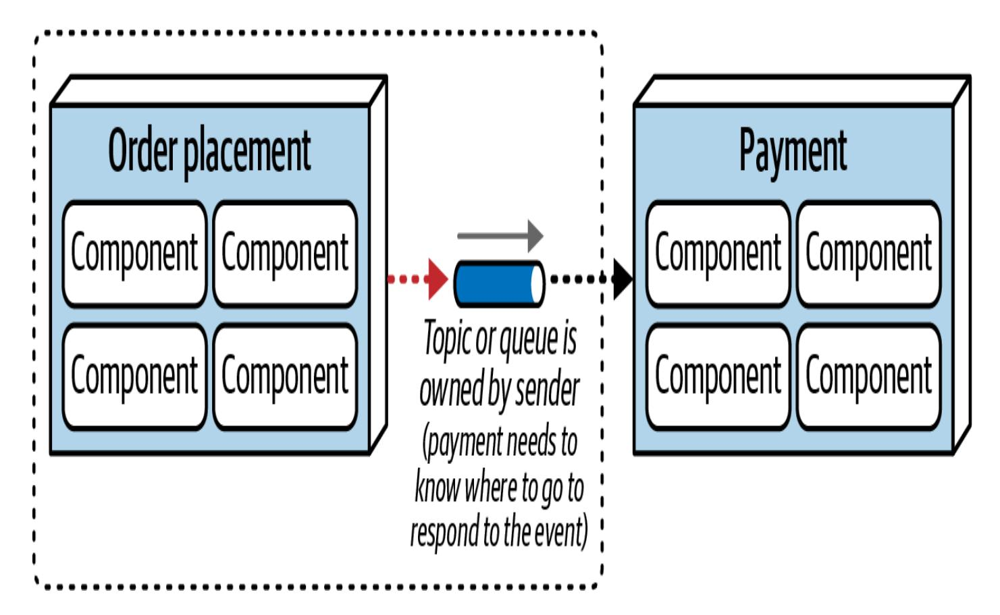
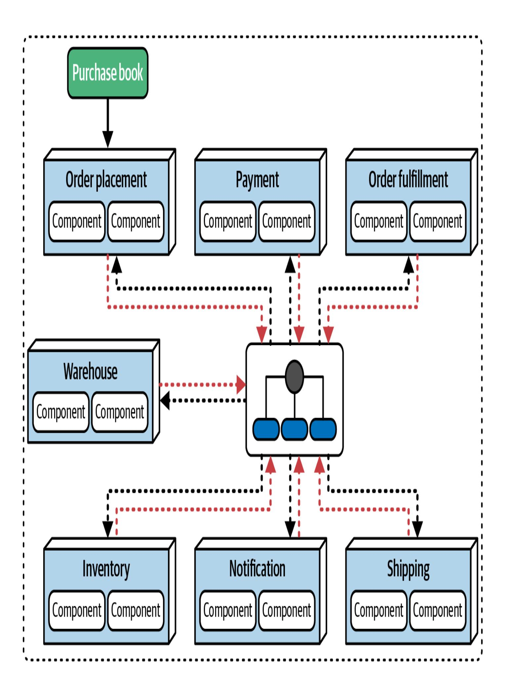
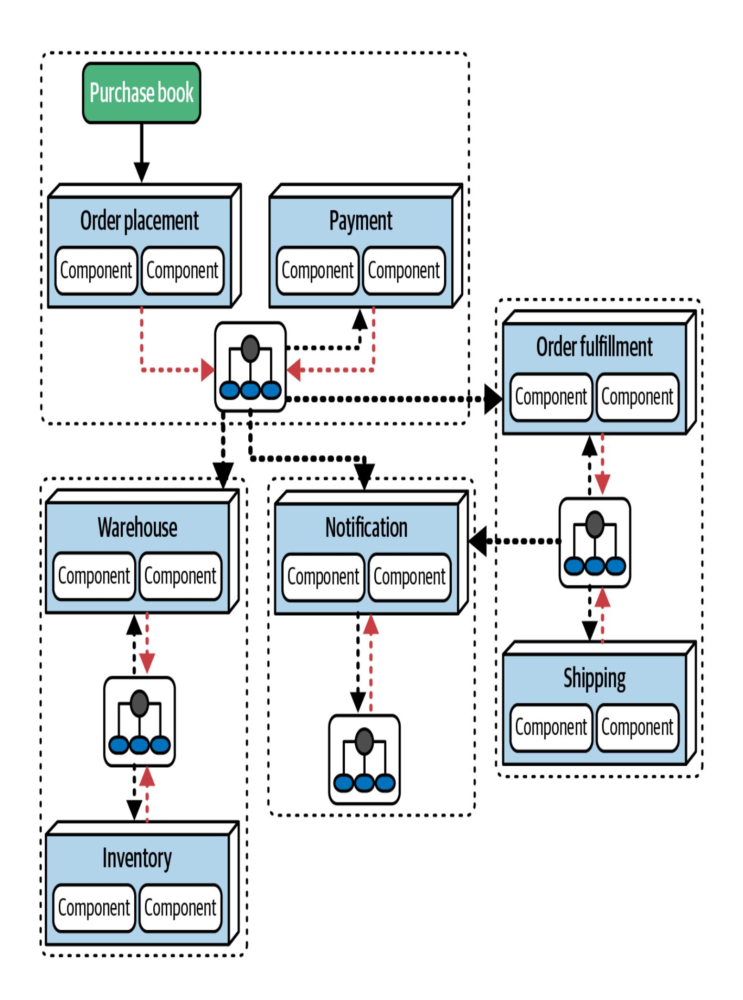

# Kapitel 20. Architektonische Muster

Diese Arbeit wurde mithilfe von KI übersetzt. Wir freuen uns über dein Feedback und deine Kommentare: [translation-feedback@oreilly.com](mailto:translation-feedback@oreilly.com)

Wir unterscheiden in [Kapitel](#page--1-0) 9 zwischen Architekturstilen und Architekturmustern: Zur Erinnerung: *Stile* sind benannte Topologien, die Architekten durch Unterschiede in Topologien, physischen Architekturen, Implementierungen, Kommunikationsstilen und Datentopologien unterscheiden. *Architekturmuster*, inspiriert durch das oft zitierte Buch *Design [Patterns](https://www.oreilly.com/library/view/design-patterns-elements/0201633612)*, sind kontextualisierte Problemlösungen.

Es ist wichtig, zwischen Architekturmustern und "bewährten Methoden" zu unterscheiden (mehr dazu in [Kapitel](#page--1-0) 21). Etwas als "bewährte Methode" zu bezeichnen, bedeutet, dass der Architekt verpflichtet ist, diese Methode immer dann anzuwenden, wenn eine bestimmte Situation eintritt. Wenn man es eine *bessere* Methode nennen würde, könnte man zumindest darüber streiten, aber nein - wir nennen es die *bewährte* Methode, die es Architekten ermöglicht, ihr Gehirn auszuschalten und immer der gleichen Lösung zu folgen.

Es ist auch wichtig, zwischen Mustern und *Lösungen* zu unterscheiden. Viele Tools, Frameworks, Bibliotheken und andere Artefakte der Softwareentwicklung kapseln ein oder mehrere Muster - je nachdem, wie sie implementiert werden, mit unterschiedlichem Grad an Treue und Vermischung mit anderen Mustern. Konzentriere dich zunächst darauf, das am besten geeignete Muster zu identifizieren und wähle dann die am besten geeignete Implementierung dafür.

In diesem Kapitel stellen wir einige repräsentative Muster vor, um die Stile, die wir in Teil II dieses Buches vorgestellt haben, zu kontrastieren und in einen Kontext zu stellen. Unser erstes Beispiel, ein Architektur-Wiederverwendungsmuster, verdeutlicht den Unterschied zwischen Mustern und Implementierungen.

# Wiederverwendung

Die Trennung zwischen Domänenkopplung und operativer Kopplung ist ein häufiges architektonisches Problem in verteilten Architekturen wie Microservices.

## **Trennung von Bereich und operativer Kopplung**

Eines der Designziele von Microservices-Architekturen ist ein hohes Maß an Entkopplung, was sich oft in dem Ratschlag ausdrückt: "Duplizierung ist der Kopplung vorzuziehen."

Angenommen, zwei Dienste müssen Informationen über Kundenprofile hin- und herübertragen, aber der domänengesteuerte Bounded Context der Architektur besteht darauf, dass die Implementierungsdetails jedem Dienst vorbehalten bleiben müssen. Eine gängige Lösung besteht darin, jedem Dienst eine eigene interne Darstellung von Entitäten wie Profile zu geben und diese Informationen dann auf lose gekoppelte Weise

weiterzugeben, z. B. als Name-Wert-Paare in JSON. Auf diese Weise kann jeder Dienst seine interne Repräsentation - einschließlich des Technologie-Stacks - nach Belieben ändern, ohne die Integration zu unterbrechen. Entwickler sind im Allgemeinen gegen die Duplizierung von Code, da dies zu Problemen bei der Synchronisierung, semantischem Drift und vielem mehr führen kann, aber manche Dinge sind schlimmer als Duplizierung... und bei Microservices gehört dazu die Kopplung.

Architekten, die Microservices entwerfen, finden sich in der Regel mit der Tatsache ab, dass sie manchmal Implementierungen duplizieren müssen, um die Entkopplung zu erhalten. Aber was ist mit den Fähigkeiten, die von einer hohen Kopplung *profitieren*? Jeder Dienst sollte über bestimmte gemeinsame Betriebsfunktionen verfügen, z. B. Überwachung, Protokollierung, Authentifizierung und Autorisierung sowie Stromkreisunterbrechungen. Wenn jedoch jedes Team diese Abhängigkeiten selbst verwalten kann, entsteht oft ein Chaos.

Nehmen wir an, ein Unternehmen versucht, eine Standardüberwachungslösung für alle seine Dienste zu wählen, um deren Betrieb zu erleichtern. Der Architekt beschließt, jedes Team für die Implementierung der Überwachung seines Dienstes verantwortlich zu machen: das Payment Serviceteam, das Inventory Serviceteam, und so weiter. Aber wie kann das Betriebsteam sicher sein, dass jedes Team dies auch wirklich getan hat? Und was ist mit Problemen wie einheitlichen Upgrades? Wenn das standardisierte Überwachungs-Tool

unternehmensweit aktualisiert werden muss, wie sollen die Teams das koordinieren?

## **Sechseckige Architektur**

Beim *hexagonalen* Architekturmuster, das in [Abbildung](#page-4-0) 20-1 dargestellt ist, befindet sich die Domänenlogik im Zentrum des Sechsecks, das von Ports und Adaptern umgeben ist, die mit anderen Teilen des Ökosystems verbunden sind (dieses Muster wird auch als *Ports and Adapters* [bezeichnet\). Eine](#page-4-0) visuelle Darstellung dieses Musters ist in Abbildung 20- 1 zu sehen.

Abbildung 20-1. Das sechseckige Architekturmuster

Aufmerksamen Lesern wird auffallen, dass nur vier der sechs Seiten des Sechsecks verwendet werden. Der Erfinder dieses Musters, Alistair Cockburn, zeichnete es zunächst als Sechseck und nannte es

Hexagonales Architekturmuster. Er bereute es fast sofort, denn der Name Ports and Adapters ist viel aussagekräftiger, aber es war zu spät. Zu viele Architekten fanden, dass "Hexagonal" cool klingt, also blieb der Name bestehen.

Die Verwechslung des Musters mit der Implementierung ist eine häufige Gefahr, und dies ist ein gutes Beispiel dafür. Die hexagonale Architektur hat einen potenziell schwerwiegenden Fehler, wenn sie zur Beschreibung von Microservices verwendet wird, aber nur für diejenigen, die die ursprüngliche Absicht des Musters verstehen. Die hexagonale Architektur ist älter als die modernen Microservices, aber es gibt viele Ähnlichkeiten zwischen ihnen. Es gibt auch einen wichtigen Unterschied: die Datentreue. Bei der hexagonalen Architektur wird die Datenbank nur als ein weiterer Adapter betrachtet, der angeschlossen werden kann. Das Datenschema wurde nicht in die Geschäftslogik einbezogen, weil man zu der Zeit, als der Name Hexagonal geprägt wurde, fälschlicherweise annahm, dass die Datenbank eine völlig separate Maschine sei. Eric Evans hat diesen Fehler in seinem Buch *Domain-Driven Design* korrigiert, indem er erkannte, dass sich Datenbankschemata unabhängig von ihrem Speicherort ändern müssen, um die Geschäftslogik des Systems widerzuspiegeln.

Das macht das hexagonale Muster zu einer ständigen Quelle der Verwirrung unter Architekten. Wenn jemand es verwendet, beschreibt er dann die Trennung von betrieblichen und fachlichen Belangen oder bezieht er sich auf das wörtliche Muster, das die Daten isoliert und damit gegen ein zentrales Designprinzip von Microservices verstoßen würde?

Die Verwendung des Pattern-Namens als Abkürzung für "Trennung von Domänen- und Betriebsbelangen" ist in Ordnung, solange sie im Kontext nicht irreführend ist. Architekten haben heute jedoch keine Notwendigkeit für diese Implementierung. Es gibt jetzt einen geeigneteren Mechanismus zur Umsetzung des Hexagonal-Patterns: das *Service Mesh-Pattern*.

### **Service Mesh**

Bereits in ["Operational](#page--1-1) Reuse" haben wir den gängigen architektonischen Ansatz zur Trennung von technischen Belangen und Domänenbelangen beschrieben: die Verwendung der Sidecar- und Service Mesh-Muster.

Das Sidecar-Pattern ist nicht nur eine Möglichkeit, operative Fähigkeiten von Domänen zu entkoppeln - es ist ein orthogonales Wiederverwendungsmuster, das eine bestimmte Art von Kopplung anspricht (siehe ["Orthogonale](#page-7-0) Kopplung"). Oftmals erfordern architektonische Lösungen mehrere Arten der Kopplung, wie z. B. unser aktuelles Beispiel der Kopplung zwischen Domäne und Betrieb. Ein *orthogonales Wiederverwendungsmuster* bietet eine Möglichkeit, einen Aspekt wiederzuverwenden, der durch einen oder mehrere Belange in der Architektur repräsentiert wird und nicht in die bevorzugte hierarchische Organisation passt. Zum Beispiel sind Microservices-Architekturen um Domänen herum organisiert, aber die operative Kopplung erfordert einen Schnitt durch diese Domänen. Ein Sidecar

ermöglicht es dem Architekten, diese Belange in einer übergreifenden, aber konsistenten Schicht der Architektur zu isolieren.

#### **ORTHOGONALE KOPPLUNG**

In der Mathematik sind zwei Linien *orthogonal*, wenn sie sich im rechten Winkel schneiden, was auch Unabhängigkeit impliziert. In der Softwarearchitektur können zwei Teile einer Architektur *orthogonal gekoppelt* sein: Sie können zwei unterschiedliche Zwecke haben, die sich dennoch überschneiden müssen, um eine vollständige Lösung zu bilden. Das offensichtliche Beispiel aus diesem Kapitel ist ein betriebliches Anliegen wie die Überwachung, die notwendig, aber unabhängig vom Verhalten der Domäne ist, z. B. das Auschecken des Katalogs. Das Erkennen orthogonaler Kopplung ermöglicht es Architekten, die Schnittpunkte zu finden, die die geringste Verflechtung zwischen den Anliegen verursachen.

Das Sidecar-Pattern bietet zwar eine schöne Abstraktion, hat aber wie alle anderen Architekturansätze auch Kompromisse, wie in [Tabelle](#page-8-0) 20-1 dargestellt.

Tabelle 20-1. Kompromisse für die Muster Sidecar und Service Mesh

| Vorteile                                                                                | Benachteiligungen                                                       |
|-----------------------------------------------------------------------------------------|-------------------------------------------------------------------------|
| Bietet eine konsistente Möglichkeit, isolierte Kopplungen zu schaffen | Muss einen Beiwagen pro Plattform implementieren         |
| Ermöglicht eine einheitliche Koordination der Infrastruktur              | Seitenwagen-Komponente kann groß/komplex werden                |
| Eigenverantwortung pro Team, zentral oder eine Kombination            | "Drift" bei der Umsetzung zwischen unabhängigen Teams |

Sowohl das Hexagonal- als auch das Service Mesh-Muster zeigen, wie das Wiederverwendungsmuster implementiert werden kann, um fachliche von betrieblichen Belangen zu trennen. Die Hexagonal-Implementierung ist universell einsetzbar, während das Service Mesh gut für Microservices und andere verteilte Architekturen geeignet ist. Der Schlüssel für Architekten liegt darin, das Muster zuerst zu identifizieren - die Trennung - und dann zu entscheiden, wie sie es am besten in ihrer Architektur implementieren können.

# Kommunikation

Viele Architekturmuster, darunter auch Kommunikationsmuster, stammen aus der ereignisgesteuerten Architektur und gelten für jede verteilte Architektur, die über Nachrichten und/oder Ereignisse kommuniziert, wie in den Kapiteln [15](#page--1-0) und [18](#page--1-0) beschrieben. Tatsächlich hast du in jedem dieser Kapitel Beispiele für Kommunikation gesehen wir haben sie nur nicht als spezielle Muster identifiziert, weil Architekten häufig Muster implementieren, ohne sich dessen bewusst zu sein. Muster sind schließlich Lösungen für allgemeine Probleme.

# **Orchestrierung versus Choreografie**

Betrachte zwei [Kommunikationsmuster, die](#page--1-2) du bereits in "Vermittelte ereignisgesteuerte Architektur" und "Choreografie und [Orchestrierung"](#page--1-3) kennengelernt hast [:](#page--1-3) Choreografie und [Orchestrierung, wie](#page-10-0) in Abbildung 20-2 zusammengefasst.

In jedem der in [Abbildung](#page-10-0) 20-2 dargestellten isomorphen Workflows müssen vier Domänendienste (Dienste A bis D) zusammenarbeiten, um einen Workflow zu bilden. Im Fall der Orchestrierung gibt es außerdem einen separaten Dienst, der als Koordinator für den Workflow fungiert: den *Orchestrator*.

Wir haben diese Kommunikation sowohl als *Orchestrierung* als auch als *Mediation* beschrieben, aber das Muster bleibt das gleiche. Für Architekten ist es von Vorteil, wenn sie die Muster erkennen können, die in den Implementierungen lauern, denn dann werden die Kompromisse deutlicher.

Als wir die Kompromisse für Mediation und Orchestrierung beschrieben haben, haben wir viele der gleichen Punkte angesprochen. Wir fassen die Vorteile hier noch einmal zusammen:

### *Zentraler Arbeitsablauf*

Wenn die Komplexität zunimmt, profitieren Architekten von einer einheitlichen Komponente für Zustand, Verhalten und Randbedingungen.

#### *Fehlerbehandlung*

Die Fehlerbehandlung, ein wichtiger Teil vieler Domain-Workflows, wird durch einen Zustandsbesitzer für den Workflow unterstützt.

#### *Wiederherstellbarkeit*

Da ein Orchestrator den Status des Workflows überwacht, kann der Architekt bei einem kurzfristigen Ausfall eines oder mehrerer Domänen-Services eine Logik für einen erneuten Versuch hinzufügen.

### *Staatliches Management*

Ein Orchestrator macht den Zustand des Workflows abfragbar und bietet einen Platz für andere Workflows und andere vorübergehende Zustände.

Zu den allgemeinen Nachteilen der Orchestrierung gehören:

### *Reaktionsfähigkeit*

Die gesamte Kommunikation muss über den Orchestrator laufen, was zu einem Durchsatzengpass führen kann, der die Reaktionsfähigkeit beeinträchtigt.

#### *Fehlertoleranz*

Die Orchestrierung verbessert zwar die Wiederherstellbarkeit der Domänendienste, schafft aber einen potenziellen Single Point of Failure für den Workflow. Dieses Problem kann durch Redundanz gelöst werden, aber das erhöht auch die Komplexität.

#### *Skalierbarkeit*

Dieser Kommunikationsstil lässt sich nicht so gut skalieren wie eine Choreografie, weil der Orchestrator mehr Koordinationspunkte hinzufügt, was die potenzielleParallelität einschränkt.

#### *Dienstleistungskupplung*

Ein zentraler Orchestrator schafft eine engere Kopplung zwischen ihm und den Domänenkomponenten, was manchmal notwendig ist, aber in Microservices-Architekturen verpönt ist.

In ähnlicher Weise haben wir die Choreografie sowohl in Microservices als auch in ereignisgesteuerten Architekturen diskutiert. Zu den Kompromissen für choreografierte Workflows gehören:

#### *Reaktionsfähigkeit*

Diese Art der Kommunikation hat weniger einzelne Engpässe und bietet daher mehr Möglichkeiten zur Parallelität.

#### *Skalierbarkeit*

Das Fehlen von Koordinationspunkten wie Orchestrierern ermöglicht eine unabhängigere Skalierung.

#### *Fehlertoleranz*

Da es keinen einzigen Orchestrator gibt, kann der Architekt mehrere Instanzen verwenden, um die Fehlertoleranz zu erhöhen. Sie könnten natürlich auch mehrere Orchestratoren erstellen, aber da die gesamte Kommunikation über sie laufen muss, sind mehrere Orchestratoren empfindlicher für die Fehlertoleranz des gesamten Workflows.

#### *Entkopplung von Diensten*

Kein Orchestrator bedeutet weniger Kopplung.

Zu den Nachteilen des Kommunikationsstils der Choreografie gehören:

### *Verteilter Arbeitsablauf*

Da es keinen Workflow-Eigentümer gibt, wird die Verwaltung von Fehlern und anderen Randbedingungen erschwert.

### *Staatliches Management*

Das Fehlen eines zentralen Zustandshalters erschwert die laufende Zustandsverwaltung.

#### *Fehlerbehandlung*

Die Fehlerbehandlung ist ohne einen Orchestrator schwieriger, weil die Domänendienste mehr Workflow-Wissen haben müssen.

#### *Wiederherstellbarkeit*

Ohne einen Orchestrator, der Wiederholungsversuche und andere Abhilfemaßnahmen durchführt, wird die Wiederherstellbarkeit schwieriger.

Diese beiden Muster veranschaulichen unsere Unterscheidung zwischen Stilen und Mustern sehr gut. Jede verteilte Architektur kann eines dieser Kommunikationsmuster verwenden, und Architekten sollten wissen, wie sie ihre Kompromisse bewerten können. Erinnere dich an unser zweites Gesetz der Softwarearchitektur: *Du kannst die Analyse von Kompromissen nicht nur einmal durchführen und damit fertig werden*. Sie veranschaulichen auch, dass es überall gemeinsame Muster gibt, deshalb sind sie auch allgemein .

# CQRS

Ein weiteres gängiges Kommunikationsmuster, das in vielen verteilten Architekturen (und einigen wenigen monolithischen) vorkommt, ist die *Command-Query-Responsibility-Segregation* (CQRS). Dieses einfache Kommunikations- und Datenmuster teilt eine üblicherweise monolithische Kommunikation mit einer Datenbank in zwei Teile auf, wie in [Abbildung](#page-15-0) 20-3 dargestellt.

Abbildung 20-3. Client/Server versus CQRS

In [Abbildung](#page-15-0) 20-3 zeigt die Struktur auf der linken Seite eine übliche *Client/Server-Dateninteraktion*, bei der die Anwendung die Datenbank abfragt und transaktionale Schreibvorgänge durchführt, indem sie die Datenbank als Teil der Anwendungsinfrastruktur nutzt. Auch wenn dies ein gängiges Muster ist, gibt es Systeme, bei denen es große Unterschiede zwischen Lese- und Schreibvolumina gibt oder die aus Sicherheits- und anderen Gründen Lese- und Schreibvorgänge voneinander trennen wollen. Für diese Systeme löst CQRS, wie in [Abbildung](#page-15-0) 20-3 rechts dargestellt, dieses Problem.

CQRS isoliert Schreibvorgänge in einem Datenspeicher (in der Regel eine Datenbank; manchmal auch eine andere Infrastruktur, wie z.B. eine dauerhafte Warteschlange), die die Daten mit einer anderen Datenbank synchronisiert (in der Regel asynchron), die Leseanfragen bearbeitet.

Durch die Trennung von Lese- und Schreibvorgängen können Architekten je nach Daten unterschiedliche Architekturmerkmale isolieren. So können sie bei Bedarf auch unterschiedliche Datenmodelle für jede Datenbank verwenden.

CQRS ist ein gutes Beispiel für ein Datenkommunikationsmuster, das unterschiedliche architektonische Merkmale für verschiedene Arten von Datenfähigkeiten, Sicherheitsbelange oder andere Faktoren ermöglicht, die von einer physischen Trennung profitieren.

# Infrastruktur

In der Softwarearchitektur gibt es überall dort Muster, wo Teams nützliche kontextualisierte Lösungen für gemeinsame Probleme gefunden haben, und diese Muster überschneiden sich oft mit anderen Teilen des Ökosystems (siehe [Kapitel](#page--1-0) 26 für eine vollständige Diskussion).

Architekten achten auf die Kopplung: zwischen Komponenten, Datenelementen, APIs ... und der Infrastruktur, wie das *Broker-Domain-Muster* zeigt.

## **Broker-Domain-Muster**

In diesem Abschnitt sehen wir uns denselben Arbeitsablauf an, der diesmal mit einer ereignisgesteuerten Architektur implementiert wurde (siehe [Abbildung](#page-18-0) 20-4).

Wie du gesehen hast, verwendet EDA Ereignisse, um zwischen den Diensten zu kommunizieren. Daher müssen Event-Handler die richtigen Dienste abonnieren, um den Workflow aufzubauen. Event-Handler werden von *Brokern* implementiert, die Teil der Infrastruktur der Architektur sind. In der EDA gehört das Topic oder die Warteschlange in der Regel dem Absender: Payment muss zum Beispiel die Adresse eines Topics kennen, um es zu abonnieren.

In [Abbildung](#page-20-0) 20-5"besitzt" OrderPlacement den Broker, den andere Prozessoren abonnieren; mit anderen Worten: Die Infrastruktur, die zur Unterstützung dieses Dienstes erforderlich ist, umfasst den Broker. Wenn ein System nur einen Broker für die gesamte Kommunikation verwendet, hängen alle seine Dienste von einem einzigen Teil der Infrastruktur ab.

Abbildung 20-5. Bei der ereignisgesteuerten Choreografie gehört das Topic oder die Warteschlange in der Regel dem Absender

Die Infrastruktur des in [Abbildung](#page-21-0) 20-6 dargestellten Workflows umfasst einen einzigen Broker, d.h. jeder Ereignisbearbeiter "weiß", wohin er gehen muss, um sich bei Workflow-Kollaborateuren anzumelden. Ein einziger Broker ermöglicht auch eine zentrale Stelle für die Protokollierung, Überwachung und andere Governance-Funktionen.

Eines der Ziele einer verteilten Architektur ist es jedoch, die Fehlertoleranz zu verbessern. Was passiert, wenn der einzelne Broker in [Abbildung](#page-21-0) 20-6 ausfällt? Dann funktioniert der gesamte Workflow nicht mehr. Ein weiteres potenzielles Problem ist die Größe. Wenn alle Nachrichten über einen einzigen Broker laufen müssen, besteht die Gefahr, dass der Broker überlastet wird, wenn das Nachrichtenaufkommen steigt.

Ein alternativer Ansatz ist das *Domain-Broker-Muster*, das die Infrastruktur ähnlich wie die Granularität von Domains behandelt. Siehe [Abbildung](#page-23-0) 20-7.

In der in [Abbildung](#page-23-0) 20-7 gezeigten alternativen Architektur teilt sich jede Gruppe zusammengehöriger Dienste einen Broker, was die gesamte Domänenpartitionierung der Architektur widerspiegelt. Diese Lösung ermöglicht immer noch eine gute Erkennung und erhöht gleichzeitig die Fehlertoleranz, Skalierbarkeit, Elastizität und eine Reihe anderer betrieblicher Architektureigenschaften. Allerdings ist keiner dieser Ansätze eine bewährte Methode. Die Kompromisse des Single-Broker-Patterns sind in [Tabelle](#page-24-0) 20-2 aufgeführt.

Tabelle 20-2. Kompromisse bei Single-Broker-Mustern

| Vorteile                          | Benachteiligungen |
|-----------------------------------|-------------------|
| Zentralisierte Entdeckung      | Fehlertoleranz    |
| Geringstmögliche Infrastruktur | Durchsatzgrenzen  |

Auch beim [Domain-Broker-Muster](#page-25-0) gibt es Kompromisse, die in Tabelle 20-3 dargestellt sind.

Tabelle 20-3. Domänen-Broker-Muster - Kompromisse

| Vorteile                      | Benachteiligungen                                                |
|-------------------------------|------------------------------------------------------------------|
| Bessere Isolierung         | Schwierigere Entdeckung von Warteschlangen/Themen       |
| Passt zu Domänengrenzen | Mehr Infrastruktur = teurer                             |
| Besser skalierbar          | Mehr bewegliche Teile, die gewartet werden müssen |

Architekten müssen bei der Entscheidung, welche dieser Infrastrukturmuster für ihr jeweiliges System am sinnvollsten sind, ein Gleichgewicht zwischen der Entdeckung und der Notwendigkeit, Domänen zu isolieren, finden.