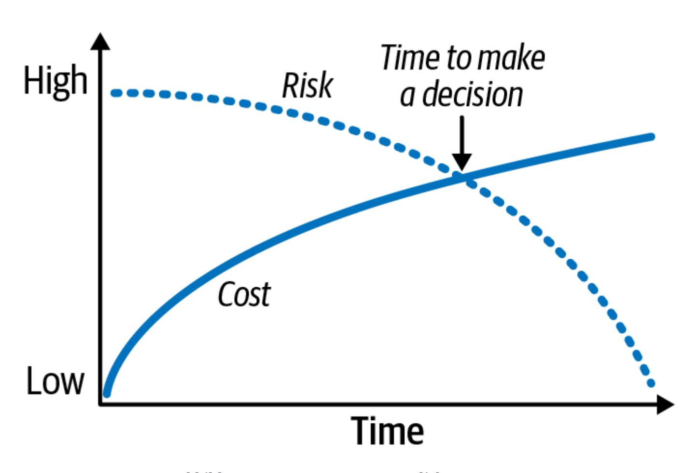
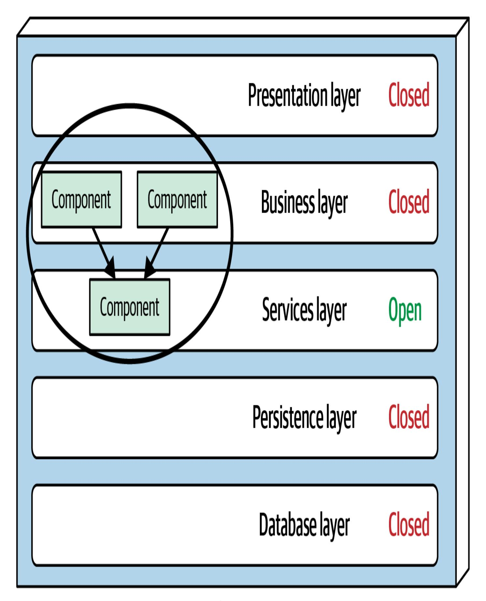
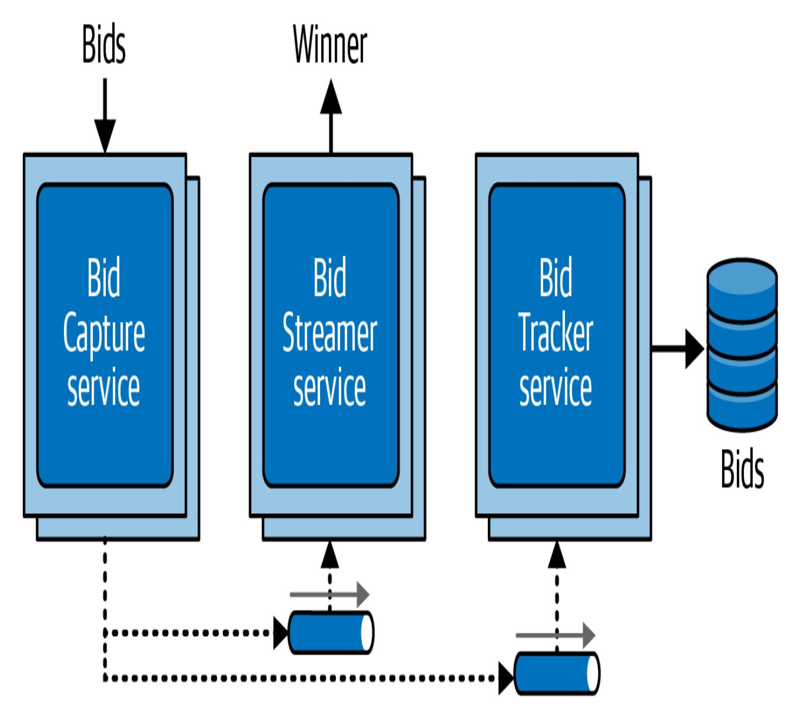
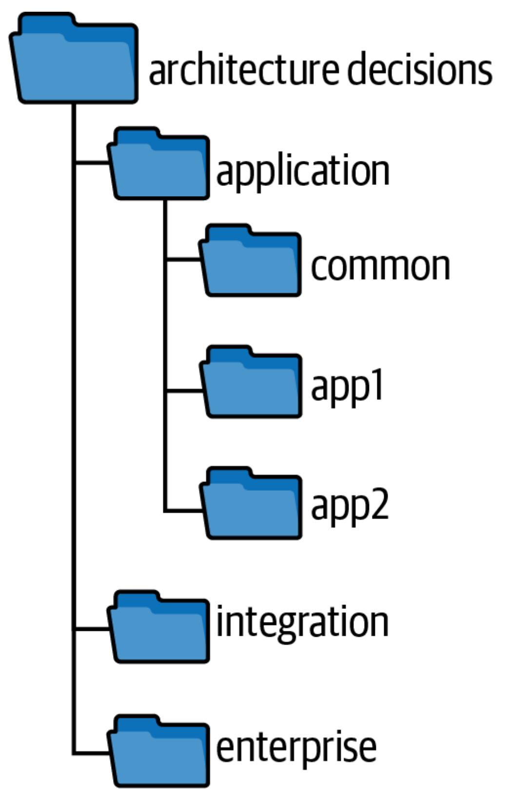

# 21장. 아키텍처 결정 (Kapitel 21. Architektonische Entscheidungen)

이 문서는 AI를 활용해 번역되었습니다. 여러분의 피드백과 의견을 환영합니다: [translation-feedback@oreilly.com](mailto:translation-feedback@oreilly.com)

아키텍트에게 요구되는 가장 중요한 기대 가운데 하나는 아키텍처 결정(Architekturentscheidungen)을 내리는 일입니다. 아키텍처 결정은 일반적으로 애플리케이션이나 시스템의 구조를 다루지만, 기술 선택이 아키텍처 특성에 영향을 미치는 경우에는 기술 결정까지 포함할 수 있습니다. 맥락이 어떠하든 좋은 아키텍처 결정은 개발 팀이 올바른 기술적 결정을 내릴 수 있도록 도와줍니다. 이를 위해서는 충분한 관련 정보를 수집하고, 결정을 정당화하며, 문서화하고, 적절한 이해관계자에게 효과적으로 전달해야 합니다.

# 아키텍처 결정 안티패턴 (Antipatterns für architektonische Entscheidungen)

프로그래머 [Andrew](https://oreil.ly/p9i_Y) Koenig은 *안티패턴(Antipattern)* 을 처음엔 좋은 생각처럼 보이지만 결국 문제를 일으키는 것으로 정의합니다. 또 다른 정의는 반복 가능하지만 부정적인 결과를 낳는 프로세스입니다. 아키텍트가 결정을 내릴 때 가장 흔하게 발생하는 아키텍처 결정 안티패턴은 Covering Your Assets 안티패턴, Groundhog Day 안티패턴, Email-Driven Architecture 안티패턴 세 가지입니다. 이 세 가지는 보통 연속적인 흐름으로 나타납니다. "Covering Your Assets"를 극복하면 "Groundhog Day"가 드러나고, 그것을 넘어서면 "Email-Driven Architecture"가 나타납니다. 효과적이고 정확한 아키텍처 결정을 내리려면 세 가지 모두를 극복해야 합니다.

### **"Covering Your Assets" 안티패턴**

"Covering Your Assets" 안티패턴은 아키텍트가 잘못된 결정을 내릴까 두려워 아키텍처 결정을 회피하거나 미루는 상황에서 발생합니다. 이를 극복하는 방법은 두 가지가 있습니다. 첫 번째는 중요한 아키텍처 결정을 *마지막 책임 순간(letzter verantwortlicher Moment)* 까지 미루는 것입니다. 즉, 결정을 정당화하고 검증할 만큼 정보는 충분히 모았지만, 개발 팀을 멈춰 세우거나 *분석 마비(Analyse-Lähmung)* 에 빠질 정도로 늦지 않은 시점입니다. 마지막 책임 순간을 판단하는 좋은 방법은 결정을 미루는 비용이 해당 결정과 연관된 위험을 넘어서는 시점을 찾는 것입니다. [그림](#page-2-0) 21-1에서 볼 수 있듯이 비용(실선으로 표시)은 의사결정 초기에는 투입 시간이 적어 낮지만, 위험(점선)은 문제나 해법에 대해 아는 것이 적기 때문에 높습니다. 결정을 오랫동안 미루면 비용은 증가하지만, 문제와 대안에 대해 더 완전한 분석을 할 수 있으므로 위험은 줄어듭니다. 두 곡선이 교차하는 지점이 바로 결정 지연으로 인한 비용 증가가 위험 감소 효과를 넘어서는 시점입니다.

<span id="page-2-0"></span>

그림 21-1. 마지막 책임 순간

이 패턴을 피하는 또 다른 방법은 개발 팀과 긴밀히 협력해 결정이 의도대로 구현될 수 있는지 확인하는 것입니다. 특정 기술과 관련된 문제를 아키텍트가 전부 파악할 수는 없습니다. 개발 팀과 가까이에서 일하면 빠르게 대응하고 더 많은 통찰을 얻어 잘못된 결정을 내릴 위험을 줄일 수 있습니다.

예를 들어, 아키텍트인 당신이 제품 설명, 무게, 치수와 같은 모든 제품 참조 데이터를 그러한 정보를 필요로 하는 각 서비스 인스턴스에 캐시하도록 하기로 결정했다고 가정해 봅시다. 기본 캐시는 Catalog 서비스가 소유하고, 읽기 전용 복제 캐시를 사용하기로 했습니다. (*복제 캐시* 또는 *인메모리 캐시*란 Catalog 서비스가 제품 정보가 변경되거나 새 제품이 추가될 때 자신의 캐시를 업데이트하고, 이 변경 사항이 복제 캐시 제품을 통해 해당 데이터를 필요로 하는 다른 모든 서비스에 전파되는 방식을 말합니다.) 당신은 이 결정을 통해 서비스 간 결합도를 낮추고 서비스 간 호출 없이 데이터를 효과적으로 공유할 수 있다고 정당화했습니다. 그러나 이 결정을 구현해야 하는 개발 팀은 일부 서비스의 확장성 요구 때문에 이용 가능한 것보다 더 많은 프로세스 내 메모리가 필요하다는 사실을 발견합니다. 당신이 이 팀들과 긴밀히 협력하고 있었기 때문에 곧바로 문제를 인지하고 아키텍처 결정을 그에 맞게 조정할 수 있었습니다.

### **Groundhog Day 안티패턴**

Groundhog Day 안티패턴은 사람들이 아키텍트가 특정 결정을 왜 내렸는지 알지 못해 같은 이야기를 끝없이 반복하면서도 결론이나 합의를 얻지 못할 때 발생합니다. 이름은 1993년 영화 *Groundhog Day*에서 따왔는데, 이 영화에서 빌 머레이가 연기한 주인공은 2월 2일 하루를 끝없이 반복해서 경험합니다.

이 패턴은 아키텍트가 결정을 정당화하지 않거나 정당화를 충분히 하지 않을 때 발생합니다. 아키텍처 결정을 기술적 측면뿐 아니라 비즈니스 측면에서도 정당화하는 것이 중요합니다.

가령 당신이 모놀리식 애플리케이션을 여러 개의 서비스로 분할하기로 했다고 합시다. 이 결정을 애플리케이션의 기능적 측면을 분리해 각 부분이 더 적은 가상 머신 리소스를 사용하며 개별적으로 유지보수·배포될 수 있게 하기 위한 것이라고 설명합니다. 이는 훌륭한 기술적 근거지만, 비즈니스적인 정당성이 빠져 있습니다. 다시 말해, 기업이 왜 이런 아키텍처 재구축에 비용을 지불해야 하는지 설명되지 않았습니다. 가능한 비즈니스 근거로는 새로운 비즈니스 기능을 더 빠르게 제공해 출시 시간을 단축한다거나, 새로운 기능을 개발하고 릴리스하는 비용을 낮춘다는 점 등을 들 수 있습니다.

비즈니스 가치를 제시하는 일은 아키텍처 결정을 정당화할 때 결정적으로 중요합니다. 동시에 해당 아키텍처 결정을 정말 내려야 하는지 확인하는 시금석이 되기도 합니다. 비즈니스 가치가 없다면 아키텍트는 결정을 재고해야 합니다.

가장 흔한 비즈니스 정당화 요소 네 가지는 비용, 출시까지 걸리는 시간, 사용자 만족도, 전략적 위치입니다. 이해관계자에게 무엇이 중요한지 생각하세요. 이해관계자들이 출시 속도를 더 중시한다면 단순히 비용 절감만으로 결정을 정당화하는 것은 적절하지 않을 수 있습니다.

### **Email-Driven Architecture 안티패턴**

아키텍트가 결정을 내리고 정당화한 뒤에는 종종 또 다른 안티패턴이 등장합니다. 바로 Email-Driven Architecture입니다. 이 패턴은 사람들이 아키텍처 결정을 잃어버리거나 잊어버리거나, 애초에 그런 결정이 있었다는 사실을 몰라 결코 구현할 수 없는 상황에서 나타납니다. 이를 극복하려면 아키텍처 결정을 효과적으로 커뮤니케이션해야 합니다. 이메일은 훌륭한 커뮤니케이션 수단이지만, 문서를 저장하기에는 부적절한 시스템입니다.

다행히도 아키텍트는 아키텍처 결정을 효과적으로 전달하는 방법을 익혀 Email-Driven Architecture 안티패턴을 쉽게 피할 수 있습니다. 먼저 결정을 이메일 본문에만 쓰지 마십시오. 그렇게 하면 모든 사람이 서로 다른 시스템에 결정을 저장하게 만들어 버립니다. 어떤 사람은 이메일을 다른 폴더에 옮기고, 어떤 사람은 삭제할 수도 있습니다. 이메일에 전적으로 의존하면 아키텍처 결정을 잃어버릴 가능성이 커집니다.

다음으로, 결정을 전달할 때 언제, 어디서, 어떻게 조회할 수 있는지를 명확히 하십시오. 아키텍트는 종종 아키텍처 결정 보고서나 ADR(Architecture Decision Record) 문서를 첨부하고, "궁금한 사항이 있으면 알려 주세요"라는 말과 함께 이메일을 보낸 후 이를 완료했다고 생각합니다. 하지만 이는 좋은 방법이 아닙니다. 먼저 이메일을 통해 결정을 알리고, 이어서 종합적인 발표나 워크숍 또는 브라운백 세션을 열어 내용을 설명하세요. 그리고 이메일에는 결정을 저장한 위치를 명시하고, 업데이트나 변경 사항이 있을 때마다 그 위치를 제시하십시오. 그래야 사람들이 해당 내용을 쉽게 찾아보고 참조할 수 있습니다.

보다 나은 접근법은 이메일 본문에는 결정의 유형과 맥락만 간단히 언급하고, 아키텍처 결정과 상세 정보가 저장된 시스템(위키 링크든 파일 시스템의 문서 경로든)에 대한 링크를 제공하는 것입니다.

예를 들어 다음과 같은 이메일을 보낼 수 있습니다.

*"샌드라님, 서비스 간 통신과 관련해 중요한 결정을 내렸으며 이 결정이 직접적인 영향을 미칩니다. 아래 링크에서 내용을 확인할 수 있습니다: ...."*

첫 문장의 앞부분에서 맥락(서비스 간 통신)을 언급하되, 구체적인 결정 내용은 밝히지 않는다는 점에 주목하십시오. 또한 특정 아키텍처 결정이 누군가에게 직접적인 영향을 미치지 않는다면 굳이 그 사람에게 알릴 필요가 있는지 자문해 보세요. 이는 어떤 이해관계자(개발자를 포함)가 해당 결정을 직접 통지받아야 하는지 판단하는 좋은 시금석입니다. 예시의 두 번째 문장에 포함된 링크는 아키텍처 결정이 저장된 위치를 가리키므로 모든 결정을 한 시스템에서 추적할 수 있게 해 줍니다.

## 아키텍처적 중요성 (Architektonische Bedeutung)

많은 아키텍트는 특정 기술을 포함하는 결정은 기술적인 결정일 뿐 아키텍처 결정이 아니라고 여깁니다. 하지만 항상 그런 것은 아닙니다. 어떤 기술을 선택하는 이유가 성능이나 확장성처럼 특정 아키텍처 특성을 직접 지원하기 위한 것이라면, 그것 역시 아키텍처 결정입니다.

[Michael](https://michaelnygard.com/) Nygard는 *Release It!* 2판(Pragmatic Bookshelf, 2018)의 저자로 잘 알려진 소프트웨어 아키텍트입니다. 그는 아키텍트가 어떤 결정에 책임을 져야 하는지(따라서 무엇이 아키텍처 결정인지)를 설명하기 위해 "*아키텍처적으로 중요한(architektonisch bedeutsam)*"이라는 용어를 만들었습니다. Nygard에 따르면 아키텍처적으로 중요한 결정은 시스템의 구조, 비기능 특성, 의존성, 인터페이스 또는 구현 기법에 영향을 주는 결정을 뜻합니다.

이 맥락에서 *구조*는 사용되는 아키텍처 패턴이나 스타일에 영향을 미치는 결정을 의미합니다. 예를 들어 여러 마이크로서비스 사이에서 코드를 공유하기로 한 아키텍처 결정은 각 마이크로서비스의 경계를 바꾸어 시스템 구조에 영향을 줍니다.

시스템의 *비기능 특성*은 개발 또는 운영하려는 시스템에서 중요한 아키텍처 특성을 의미합니다. 특정 기술 선택이 성능에 영향을 주고, 성능이 애플리케이션에 중요한 특성이라면 비록 구체적인 제품·프레임워크·기술을 지정하더라도 이는 아키텍처 결정이 됩니다.

*의존성*은 시스템 내부의 컴포넌트나 서비스 사이 결합 지점을 나타냅니다. 의존성은 확장성, 모듈성, 민첩성, 테스트 용이성, 신뢰성 등 다양한 아키텍처 특성에 영향을 미칠 수 있으므로 의존성을 다루는 결정은 아키텍처 결정입니다.

*인터페이스*는 서비스와 컴포넌트에 어떻게 접근하고 이를 어떻게 오케스트레이션하는지를 말합니다. 대개 게이트웨이, 통합 허브, 서비스 버스, 어댑터, API 프록시 등을 통해 이루어집니다. 인터페이스에 관한 결정을 내리려면 인터페이스 버전 관리나 종료 전략 같은 계약을 정의해야 하며, 이는 다른 시스템 사용자에게 영향을 주기 때문에 아키텍처적으로 중요합니다.

마지막으로 *구현 기법*은 플랫폼, 프레임워크, 도구, 심지어 프로세스에 대한 결정을 뜻합니다. 겉보기에는 기술적 선택처럼 보여도 아키텍처의 특정 측면에 영향을 준다면 아키텍처적으로 중요합니다.

## 아키텍처 결정 기록 (Architecture Decision Records)

아키텍처 결정을 문서화하는 가장 효과적인 방법 중 하나는 *Architecture Decision Records(ADRs)* 입니다. Michael Nygard는 2011년 [블로그 글](https://oreil.ly/yDcU2)에서 ADR을 처음 소개했고, 2017년에는 [Thoughtworks](https://oreil.ly/0nwHw) Technology Radar가 이 기법을 폭넓게 사용할 것을 권장했습니다.

ADR은 특정 아키텍처 결정을 설명하는 짧은 텍스트 파일(보통 한두 페이지)입니다. ADR은 일반 텍스트나 위키 페이지 템플릿으로 작성할 수 있지만 대개 [AsciiDoc](http://asciidoc.org/)이나 [Markdown](https://markdownguide.org/) 같은 텍스트 문서 형식을 사용합니다.

ADRs를 관리하기 위한 도구도 존재합니다. *Growing Object-Oriented Software, Guided by Tests*(Addison-Wesley, 2009)의 공동 저자인 Nat Pryce는 ADR [Tools](https://oreil.ly/6d8LN)라는 오픈소스 도구를 만들어 번호 체계, 저장 위치, 폐기된 로직 등을 포함해 ADR을 관리할 수 있는 커맨드라인 인터페이스를 제공합니다. 독일의 소프트웨어 개발자인 Micha Kops 역시 ADR 도구를 활용해 아키텍처 결정 기록을 관리하는 [멋진](https://oreil.ly/OgBZK) 예시를 제공합니다.

### **기본 구조**

ADR의 기본 구조는 *제목*, *상태*, *맥락*, *결정*, *결과* 다섯 부분으로 이뤄져 있습니다. 여기에 우리는 보통 *준수*와 *비고* 두 섹션을 추가합니다. 준수 섹션에서는 아키텍처 결정을 어떻게 규제하고 집행할지(수동 또는 자동 피트니스 함수)를 고민하고 문서화합니다. 비고 섹션에서는 작성자, 승인자, 작성일 등 결정에 관한 메타데이터를 담을 수 있습니다.

[그림](#page-11-0) 21-2에 나와 있듯이 필요한 경우 기본 구조를 확장해 다른 섹션을 추가해도 좋습니다. 단, 템플릿을 일관되고 간결하게 유지하십시오. 예를 들어 모든 다른 가능한 해법을 분석하는 *대안* 섹션을 추가하는 것이 좋은 사례입니다.

| ADR 형식                                              |
|-------------------------------------------------------|
| 아키텍처 결정 기록 형식                               |
| 제목                                                  |
| 아키텍처 결정을 간략히 설명하는 문장                 |
|                                                       |
| 상태                                                  |
| 제안됨, 승인됨, 대체됨                                |
|                                                       |
| 맥락                                                  |
| 왜 이 결정을 내려야 하는가?                          |
|                                                       |
| 결정                                                  |
| 결정 내용과 해당 정당성                              |
|                                                       |
| 결과                                                  |
| 이 결정이 가져오는 영향은 무엇인가?                 |
|                                                       |
| 준수                                                  |
| 이 결정을 어떻게 준수하게 만들 것인가?              |
|                                                       |
| 비고                                                  |
| 이 결정의 메타데이터(작성자 등)                      |

#### **제목**

ADR 제목은 보통 순차적으로 번호를 매기고, 아키텍처 결정을 설명하는 짧은 문장을 포함합니다. 예를 들어 주문 서비스와 결제 서비스 사이에서 비동기 메시지를 사용하기로 한 결정을 다루는 ADR 제목은 "42. 주문 및 결제 서비스 간 비동기 메시지 사용"이 될 수 있습니다. 제목은 짧고 간결하되, 결정의 성격과 맥락을 명확하게 알 수 있도록 해야 합니다.

#### **상태**

ADR의 상태는 *제안됨*, *승인됨*, *대체됨* 세 가지 중 하나입니다. "제안됨"은 결정이 상위 의사결정자나 건축 검토 위원회 같은 조직의 승인 대상임을 의미합니다. "승인됨"은 결정이 승인되어 구현할 준비가 되었음을 의미합니다. "대체됨"은 결정이 변경되어 다른 ADR로 교체되었음을 뜻합니다. "대체됨" 상태가 되려면 이전 ADR 상태가 반드시 "승인됨"이어야 합니다. 다시 말해 아직 승인되지 않은 제안 상태의 ADR이 다른 ADR로 교체되는 일은 없으며, 승인될 때까지 수정이 이루어집니다.

"대체됨" 상태는 그동안 어떤 결정을 내렸는지, 왜 그런 결정을 내렸는지, 새로운 결정은 무엇이고 왜 변경했는지를 역사적으로 기록하는 좋은 방법입니다. 결정을 대체하는 경우 보통 대체된 결정의 번호를 함께 표기합니다. 반대로 다른 ADR을 대체하는 결정에도 해당 ADR 번호를 명시합니다.

예를 들어 ADR 42("주문 및 결제 서비스 간 비동기 메시지 사용")가 "승인됨" 상태였다고 합시다. 이후 Payment 서비스의 구현과 위치가 변경되면서 두 서비스 간 통신을 REST로 바꾸기로 결정했습니다. 이 변경을 문서화하기 위해 새로운 ADR(번호 68)을 작성합니다. 상태는 다음과 같습니다.

*ADR 42. 주문 및 결제 서비스 간 비동기 메시지 사용*

*상태: 68에 의해 대체됨*

*ADR 68. 주문 및 결제 서비스 간 REST 사용*

*상태: 승인됨, 42를 대체함*

이처럼 ADR 42와 68 사이에 연결과 이력이 남아 있으면 "메시지를 사용하던 건 어떻게 됐지?"와 같은 질문을 피할 수 있습니다.

#### **ADR과 RFC(Request for Comments)**

ADR 초안이나 의견을 배포하면 더 많은 이해관계자에게 가정을 검증받고 주장을 확인하는 데 도움이 됩니다. 개발자를 참여시키고 협업을 촉진하는 효과적인 방법 중 하나는 *Request for Comments(RFC)* 라는 새로운 상태를 만들고, 검토자가 피드백을 제공해야 하는 마감일을 정하는 것입니다. 마감일이 지나면 아키텍트는 피드백을 분석하고 필요한 조정을 반영한 뒤 최종 결정을 내리고 상태를 "제안됨"(또는 아키텍트에게 승인 권한이 있다면 "승인됨")으로 변경할 수 있습니다.

RFC 상태를 사용하는 ADR 예시는 다음과 같습니다.

*상태*

*의견 요청, 마감 2026년 1월 9일*

ADR 상태 섹션이 중요한 또 다른 이유는 아키텍트와 그 상급자 또는 수석 아키텍트가 아키텍처 결정을 승인하기 위한 기준을 논의하고, 아키텍트가 독자적으로 결정을 내릴 수 있는지 아니면 상위 아키텍트나 아키텍처 검토 위원회 등 다른 기구의 승인을 받아야 하는지를 정하게 하기 때문입니다.

이 대화를 시작하기 좋은 기준은 비용, 팀 간 영향, 보안 세 가지입니다. 비용에는 소프트웨어나 라이선스 구매, 추가 하드웨어 비용, 아키텍처 결정을 구현하는 데 드는 총 노동 비용이 포함됩니다. 노동 비용을 추정하려면 아키텍처 결정을 구현하기 위해 필요한 예상 시간을 회사의 *정규직 환산율(FTE 표준 요율)* 과 곱하면 됩니다. 프로젝트 책임자나 프로젝트 매니저가 보통 이 값을 가지고 있습니다. 이 대화에서 예를 들어 아키텍처 결정 비용이 특정 금액을 넘으면 "제안됨" 상태로 전환해 다른 사람의 승인을 받아야 한다는 식의 합의를 할 수 있습니다. 아키텍처 결정이 다른 팀이나 시스템에 영향을 주거나 보안과 연관된다면 상위 조직이나 수석 아키텍트의 승인을 받아야 합니다.

팀이 기준과 임계값(예: "비용이 5,000달러를 넘는 아키텍처 결정은 아키텍처 검토 위원회의 승인을 받아야 한다")에 합의했다면 이를 명확히 문서화해 모든 아키텍트가 언제 스스로 결정을 승인할 수 있고 언제는 그렇지 않은지 알 수 있도록 하십시오.

#### **맥락**

ADR의 맥락 섹션은 현재 작용하는 힘을 정의합니다. 다시 말해 "어떤 상황 때문에 이 결정을 내려야 하는가?"를 설명합니다. 이 섹션을 통해 아키텍트는 특수한 상황을 기술하고 가능한 대안을 간결하게 설명할 수 있습니다. 만약 각 대안에 대한 심층 분석을 기록해야 한다면, 맥락 섹션 대신 별도의 *대안* 섹션을 만들어 그곳에 분석을 담으세요.

맥락 섹션은 아키텍처의 특정 영역을 기록하는 공간이기도 합니다. 맥락을 설명하는 과정에서 자연스럽게 아키텍처도 설명하게 됩니다. 앞선 예시를 다시 사용하면, 맥락 섹션은 "주문 서비스는 방금 생성된 주문을 결제하기 위해 결제 서비스로 정보를 전달해야 한다. 이는 REST나 비동기 메시징으로 구현할 수 있다"처럼 작성될 수 있습니다. 간결한 이 문장은 시나리오뿐 아니라 고려 중인 대안도 함께 제시합니다.

#### **결정**

결정 섹션에는 아키텍처 결정과 그 정당성을 기술합니다. "무엇"만큼이나 "왜"가 중요합니다. 기술적 근거뿐 아니라 비즈니스적인 이유도 명확히 설명하세요. 앞에서 살펴본 Groundhog Day 안티패턴을 피하려면 결정을 내린 목적과 기대하는 결과를 투명하게 적어야 합니다.

#### **결과**

아키텍트가 내리는 모든 결정은 긍정적이든 부정적이든 어떤 영향을 줍니다. ADR의 결과 섹션은 해당 아키텍처 결정의 총체적 영향을 설명하도록 강제합니다. 이를 통해 부정적 효과가 긍정적 이득을 상회하는지 곰곰이 생각해 볼 수 있습니다.

이 섹션은 의사결정 과정에서 수행한 트레이드오프 분석을 기록하기에도 좋습니다. 예를 들어 웹사이트의 후기 게시 기능에 대해 비동기 메시지(fire-and-forget)를 사용하기로 했다면, 사용자가 실제 게시 완료를 기다릴 필요 없이 메시지가 큐에 전달되기만 하면 되므로 반응 시간을 3,100밀리초에서 25밀리초로 줄인다는 점을 근거로 들 수 있습니다. 개발 팀원 중 한 명이 비동기 요청의 오류 처리가 너무 복잡하다는 이유로 반대할 때, 비즈니스 이해관계자와 다른 아키텍트들과 이미 이 트레이드오프에 대해 논의했고, 반응성을 높이고 복잡한 오류 처리를 감당하는 편이 대기 시간을 늘리고 성공 여부를 즉시 알려주는 것보다 낫다고 함께 합의했음을 설명할 수 있습니다. 이런 논의를 ADR 결과 섹션에 문서화해 두면 유사한 이견을 예방할 수 있습니다.

#### **준수**

준수 섹션은 표준 ADR 구성에는 없지만 추가하기를 강력히 권장합니다. 여기에서는 해당 아키텍처 결정을 어떻게 측정하고 통제할지 정의합니다. 준수 여부를 수동으로 점검할 것인지, 아니면 피트니스 함수를 통해 자동화할 수 있을지를 결정하세요. 자동화가 가능하다면 피트니스 함수를 어떻게 작성하고 코드베이스에 어떤 추가 변경이 필요한지 명시해 둘 수 있습니다.

예를 들어 [그림](#page-21-0) 21-3과 같은 전통적인 n계층 아키텍처에서 비즈니스 계층의 비즈니스 객체가 사용하는 모든 공유 객체는 공통 기능을 캡슐화하기 위해 Shared Services 계층에 위치해야 한다고 결정했다고 가정합시다.

<span id="page-21-0"></span>

그림 21-3. 아키텍처 결정 예시

이 아키텍처 결정은 Java의 [ArchUnit](https://archunit.org/), C#의 [NetArchTest](https://oreil.ly/0J5fN) 등 다양한 자동화 도구로 측정하고 제어할 수 있습니다. Java에서 ArchUnit을 사용한다면 해당 아키텍처 결정을 위한 자동 피트니스 함수 테스트는 다음과 같이 작성할 수 있습니다.

```
@Test
public void shared_services_should_reside_in_services_layer()
    classes().that().areAnnotatedWith(SharedService.class)
        .should().resideInAPackage("..services..")
        .check(myClasses);
}
```

이 자동 피트니스 함수를 위해서는 Java 애너테이션(@SharedService)을 만들고 모든 공유 클래스에 추가하는 등의 새 작업을 작성해야 합니다.

#### **비고**

표준 ADR에는 포함되지 않지만 반드시 추가하길 권장하는 또 다른 섹션은 비고입니다. 이곳에는 ADR에 관한 다양한 메타데이터를 담습니다. 예를 들어 다음과 같은 항목을 포함할 수 있습니다.

- 원 작성자
- 승인 날짜
- 승인 주체
- 대체된 날짜
- 마지막 수정 날짜
- 수정자
- 최종 변경 내용

ADRs를 Git 같은 버전 관리 시스템에 보관하더라도 저장소에서 지원하는 정보 이상의 메타데이터를 갖추는 것이 유용합니다. ADR을 어디에 저장하든 이 섹션을 추가하도록 권장합니다.

### **예시**

우리의 Going, Going, Gone(GGG) 경매 시스템 사례에는 수십 건의 아키텍처 결정이 포함되어 있습니다. 입찰자와 경매사의 사용자 인터페이스를 분리할지, 이벤트 기반과 마이크로서비스를 혼합한 하이브리드 아키텍처를 사용할지, 비디오 캡처에 실시간 전송 프로토콜(RTP)을 활용할지, API 게이트웨이를 단일화할지, 메시징을 위해 개별 큐를 사용할지 등은 모두 아키텍트가 내려야 할 결정입니다. 얼마나 자명해 보이는 결정이든 모든 아키텍처 결정은 문서화되고 정당화되어야 합니다.

[그림](#page-24-0) 21-4는 GGG 경매 시스템 내 아키텍처 결정 가운데 하나를 보여 줍니다. Bid Capture, Bid Streamer, Bid Tracker 서비스 사이에서 단일 pub/sub 토픽(또는 REST 호출)을 사용하는 대신 서비스 간에 별도의 포인트 투 포인트 큐를 구축한 사례입니다.

<span id="page-24-0"></span>

그림 21-4. 서비스 간 pub/sub 사용 예시

이 결정을 정당화하는 ADR이 없다면 시스템 설계와 개발에 참여한 다른 사람들이 다른 구현을 선택하자고 주장할 수도 있습니다.

다음은 해당 아키텍처 결정을 위한 ADR 예시입니다.

### **ADR 76. Bid Streamer와 Bidder Tracker 서비스를 위한 별도 큐**

#### **상태**

*승인됨*

#### **맥락**

*Bid Capture 서비스가 입찰을 수신하면 Bid Streamer와 Bidder Tracker 서비스에 전달해야 한다. 이를 단일 토픽(pub/sub)으로 처리할 수도 있고, 각 서비스를 위한 별도 큐(포인트 투 포인트)를 만들 수도 있으며, 온라인 경매 API 계층을 통한 REST로 처리할 수도 있다.*

#### **결정**

*Bid Streamer와 Bidder Tracker 서비스에는 별도 큐를 사용한다.*

*Bid Capture 서비스는 Bid Streamer나 Bidder Tracker 서비스에서 정보를 받을 필요가 없다(통신은 단방향이다).* 

*Bid Streamer 서비스는 Bid Capture 서비스가 수락한 순서대로 입찰을 받아야 한다. 메시지와 큐를 사용하면 FIFO(선입선출) 큐 덕분에 스트림용 입찰 순서가 자동으로 보장된다.*

*동일한 금액의 입찰이 여러 건 들어온다(예: "100달러 나오나요?"). Bid Streamer 서비스는 해당 금액의 첫 번째 입찰만 필요하지만 Bidder Tracker 서비스는 모든 입찰을 필요로 한다. 토픽(pub/sub)을 사용할 경우 Bid Streamer는 이전 금액과 일치하는 입찰을 무시해야 하며, 이때 각 인스턴스 간에 공유 상태를 유지해야 하는 문제가 생긴다.*

*Bid Streamer 서비스는 품목별 입찰을 인메모리 캐시에 저장하는 반면 Bidder Tracker 서비스는 데이터베이스에 저장한다. 따라서 Bidder Tracker 서비스가 더 느리고 때때로 역압이 필요하다. 별도의 Bidder Tracker 큐는 이러한 역압을 제공한다.*

#### **결과**

*메시지 큐에 대한 클러스터링과 고가용성이 필요하다.*

*이 결정으로 Bid Capture 서비스는 동일한 정보를 여러 큐에 전송해야 한다.*

*내부 입찰 이벤트는 API 계층의 보안 검사를 우회한다.*

*업데이트: 2025년 1월 14일 ARB 회의를 통해 해당 트레이드오프가 허용 가능한 것으로 판정되었으며, 이들 서비스 간 입찰 이벤트에 추가적인 보안 검사를 적용할 필요는 없다고 결정했다.*

#### **준수**

*Bid Capture, Bid Streamer, Bidder Tracker 서비스 사이에서 비동기 pub/sub 메시지가 사용되는지 확인하기 위해 정기적인 수동 코드 리뷰를 수행한다.*

#### **비고**

*작성자: Subashini Nadella*

*승인: ARB 회의 구성원, 2025년 1월 14일*

*최종 업데이트: 2025년 1월 14일*

### **ADR 저장 방식**

아키텍트가 ADR을 만들었다면 어디엔가 저장해야 합니다. 어디에 저장하든 각 아키텍처 결정은 고유한 파일이나 위키 페이지를 가져야 합니다. 일부 아키텍트는 팀이 소스 코드와 동일한 방식으로 버전 관리하고 추적할 수 있도록 ADR을 소스 코드와 같은 Git 저장소에 함께 보관하는 것을 선호하기도 합니다.

그러나 대규모 조직에서는 이런 방식을 권장하지 않습니다. 첫째, 아키텍처 결정을 확인해야 하는 사람이 모두 해당 Git 저장소에 접근할 수 있는 것은 아닙니다. 둘째, 애플리케이션의 Git 저장소는 다른 맥락(예: 통합 아키텍처, 엔터프라이즈 아키텍처, 모든 애플리케이션에 적용되는 결정)에 속한 ADR을 저장하기에 적절하지 않습니다. 이런 이유로 우리는 누구나 접근할 수 있는 전용 ADR Git 저장소, 위키(위키 템플릿 포함), 혹은 문서 표시 소프트웨어가 쉽게 접근할 수 있는 공용 파일 서버 내 공유 디렉터리에 ADR을 저장할 것을 추천합니다.

[그림](#page-30-0) 21-5는 이러한 디렉터리 구조(또는 위키 페이지의 내비게이션 구조)가 어떻게 구성될 수 있는지를 보여 줍니다.

<span id="page-30-0"></span>

그림 21-5. ADR 저장소 디렉터리 구조 예시

*애플리케이션 디렉터리*에는 특정 애플리케이션(또는 제품) 맥락에 특화된 아키텍처 결정이 담깁니다. 이 디렉터리는 다시 여러 하위 디렉터리로 나뉩니다.

#### *공통*

*공통* 하위 디렉터리는 모든 애플리케이션에 적용되는 아키텍처 결정을 보관합니다. 예를 들어 "프레임워크 관련 클래스는 프레임워크 코드에 속함을 나타내기 위해 Java에서는 @Framework 애너테이션을, C#에서는 [Framework] 특성을 포함해야 한다"와 같은 규칙이 여기에 해당합니다.

#### *애플리케이션*

*애플리케이션* 하위 디렉터리 아래에는 특정 애플리케이션이나 시스템 맥락에 해당하는 디렉터리가 위치하며, 각 디렉터리에는 그 애플리케이션이나 시스템에 특화된 아키텍처 결정이 포함됩니다(예: app1, app2 등).

#### *통합*

*통합* 디렉터리에는 애플리케이션, 시스템, 서비스 간 통신에 관한 ADR이 포함됩니다.

#### *엔터프라이즈*

엔터프라이즈 아키텍처 ADR은 *엔터프라이즈 디렉터리*에 저장됩니다. 이는 모든 시스템과 애플리케이션에 영향을 미치는 글로벌 아키텍처 결정을 의미합니다. "어떤 시스템이든 데이터베이스에 접근할 수 있는 것은 해당 시스템뿐"과 같이 여러 시스템이 데이터베이스를 공유하지 못하게 하는 규칙이 한 예입니다.

ADR을 위키에 저장할 때도 동일한 구조를 적용하되, 각 디렉터리 구조가 내비게이션 랜딩 페이지 역할을 합니다. 각 ADR은 애플리케이션, 통합, 엔터프라이즈 등 해당 랜딩 페이지 아래의 개별 위키 페이지로 표현됩니다.

이 섹션에서 제시한 디렉터리와 랜딩 페이지 이름은 추천과 예시에 불과합니다. 조직의 상황에 맞는 이름을 사용하되, 모든 팀에서 일관되게 사용할 수 있도록 하십시오.

### **문서로서의 ADR**

소프트웨어 아키텍처를 문서화하는 일은 늘 어려웠습니다. [Simon Brown](https://c4model.com/)의 C4 모델이나 Open Group의 [ArchiMate 표준](https://oreil.ly/gbNQG)처럼 아키텍처를 표현하기 위한 특정 표준은 있지만, 소프트웨어 아키텍처 문서화를 위한 단일 표준은 없습니다. 이 지점에서 ADR이 빛을 발합니다.

ADR은 소프트웨어 아키텍처를 문서화하는 효과적인 수단이 될 수 있습니다. 맥락 섹션은 아키텍처 결정을 요구하는 시스템 영역을 설명하고 가능한 대안을 기술할 훌륭한 기회를 제공합니다. 무엇보다도 결정 섹션은 특정 결정을 내린 이유를 서술하며, 이는 최고의 아키텍처 문서화 방식입니다. 결과 섹션은 해당 결정을 둘러싼 트레이드오프 분석—예컨대 왜 성능을 확장성보다 우선했는지—을 설명하며 마지막 퍼즐 조각을 채워 줍니다.

### **표준을 위한 ADR 활용**

표준을 좋아하는 개발자는 많지 않습니다. 표준이 때로는 실질적인 목적보다 통제를 위한 수단처럼 느껴지기 때문입니다. 하지만 표준을 ADR로 다루면 이런 잘못된 관행을 바꿀 수 있습니다. 예를 들어 ADR의 맥락 섹션은 조직이 특정 표준을 도입해야 하는 상황을 설명합니다. 따라서 ADR의 결정 섹션에는 표준이 무엇인지뿐 아니라, 왜 그 표준이 필요한지도 담겨야 합니다.

이 방식은 특정 표준이 정말 필요했는지를 검증하는 좋은 수단입니다. 아키텍트가 표준을 정당화하지 못한다면, 그 표준은 설정·집행할 만한 가치가 없을지도 모릅니다. 그리고 개발자가 왜 특정 표준이 존재하는지 이해할수록 준수할 가능성이 높아지며, 의문을 제기할 가능성은 줄어듭니다. ADR의 결과 섹션 역시 표준이 유효한지 확인하는 좋은 공간입니다. 이곳에서 아키텍트는 표준의 영향과 결과를 숙고하고, 표준을 실행할지 여부를 문서화해야 합니다.

## **기존 시스템에서 ADR 사용하기**

많은 아키텍트는 기존 시스템에 ADR을 적용할 가치가 있는지 의문을 품습니다. 어차피 아키텍처 결정은 이미 내려졌고 시스템은 운영 중이기 때문입니다. 그럼에도 ADR은 의미가 있습니다. 기억하세요. ADR은 단순한 문서 이상의 역할을 합니다. 결정을 내린 이유와 최선의 선택이었는지를 아키텍트와 개발자가 이해하도록 돕습니다.

가장 중요한 아키텍처 결정부터 ADR을 작성해 보세요. 그런 다음 해당 결정이 올바른지 검증해 보십시오. 예를 들어 여러 서비스가 단일 데이터베이스를 공유한다면 왜 그런 선택을 했는지, 타당한 이유가 있는지, 데이터를 분할해야 하는지 등을 스스로 묻는 것입니다.

기존 시스템에 ADR을 도입하려면 이러한 질문에 답하기 위해 조사해야 합니다. 불행히도 초기 결정을 내린 사람이 오래전에 회사를 떠났을 수도 있고, 그래서 아무도 이유를 알지 못할 수 있습니다. 이런 경우 아키텍트는 각 옵션의 대안과 트레이드오프를 파악하고 분석해 기존 결정을 확인(또는 반박)해야 합니다. 어떤 경우든 중요한 결정에 대한 ADR을 작성하면 시스템에 대한 근거와 논리, 집단 지성을 축적하고, 아키텍처 비효율이나 잘못된 설계를 발견하는 데 도움이 됩니다.

## **아키텍처 결정을 위한 생성형 AI와 LLM 활용**

생성형 AI의 흥미로운 측면 중 하나는 아키텍트가 이를 활용해 결정을 내리고 검증할 수 있는지 여부입니다. 예를 들어 데이터가 다운스트림으로 전달될 때 메시징, 스트리밍, 이벤트 소싱 가운데 무엇을 사용해야 할까요? 데이터베이스를 단일 모놀리스로 유지해야 할까요, 아니면 도메인별 데이터베이스로 분리해야 할까요? 결제 처리를 단일 서비스로 둘까요, 아니면 결제 수단별로 서비스를 분리해야 할까요?

대부분의 아키텍트는 이미 알고 있듯이 이런 질문의 답은 "상황에 따라 다르다"입니다. 소프트웨어 아키텍처의 첫 번째 법칙을 떠올려 보십시오. *소프트웨어 아키텍처에서 모든 것은 트레이드오프* 입니다. 이런 결정은 결정이 내려지는 특정 맥락을 포함해 많은 요인에 좌우됩니다. 상황과 환경은 모두 다르기 때문에 이런 구조적 질문에 통용되는 "모범 사례"는 존재하지 않습니다.

대다수 LLM은 결과를 생성할 때 확률에 크게 의존합니다. 즉, 주어진 프롬프트 맥락에서 가장 그럴듯한 답이 무엇인지, 이 문제에 대한 "모범 사례"가 무엇인지에 초점을 맞춥니다. 하지만 확률과 모범 사례는 아키텍처 결정에는 적합하지 않습니다. 아키텍처 질문을 해결하려면 관련된 트레이드오프를 면밀히 분석하고 특정 비즈니스·기술 맥락을 적용해 가장 적합한 선택을 내려야 합니다. 예를 들어 기업이 변경 사항과 새로운 기능을 가능한 한 빨리 시장에 내놓고자 한다면, *유지보수성* 이 *성능* 보다 훨씬 중요해지며 의사결정의 대부분을 좌우합니다.

아키텍처 결정을 내릴 때는 출시 속도나 지속 가능한 성장 같은 비즈니스 고려 사항을 유지보수성, 테스트 용이성, 배포 용이성 등 아키텍처 특성으로 번역해야 합니다. 이 번역은 항상 명확하지 않으며, 제대로 수행하려면 수년간의 경험이 필요합니다. 번역이 끝나면 그 결과가 트레이드오프 분석의 토대가 됩니다. 예를 들어 결제 처리를 단일 서비스로 둘지, 결제 수단별 서비스로 나눌지에 관한 결정은 유지보수성과 성능 사이의 트레이드오프입니다. 단일 서비스는 성능이 더 좋지만, 여러 서비스는 유지보수성이 더 뛰어납니다. 기업이 출시 속도를 최우선으로 여긴다면 이 맥락에서는 유지보수성이 더 중요하므로 별도의 서비스가 올바른 선택이 됩니다.

이처럼 트레이드오프 분석과 비즈니스 맥락은 매우 구체적이고 개별적이기 때문에, 현재의 생성형 AI가 최적의 아키텍처 결정을 내려 주기는 어렵습니다. 이 책의 저자들이 수행한 최근 실험에 따르면, 생성형 AI 도구는 최선의 경우 특정 결정의 가능한 트레이드오프를 나열하고 간과했을 수 있는 트레이드오프를 식별하는 데 도움을 주는 정도입니다. 생성형 AI 도구는 방대한 *지식* 을 보유하고 있지만, 최선의 아키텍처 결정을 내리기 위해 필요한 *지혜* 는 아직 부족합니다.
