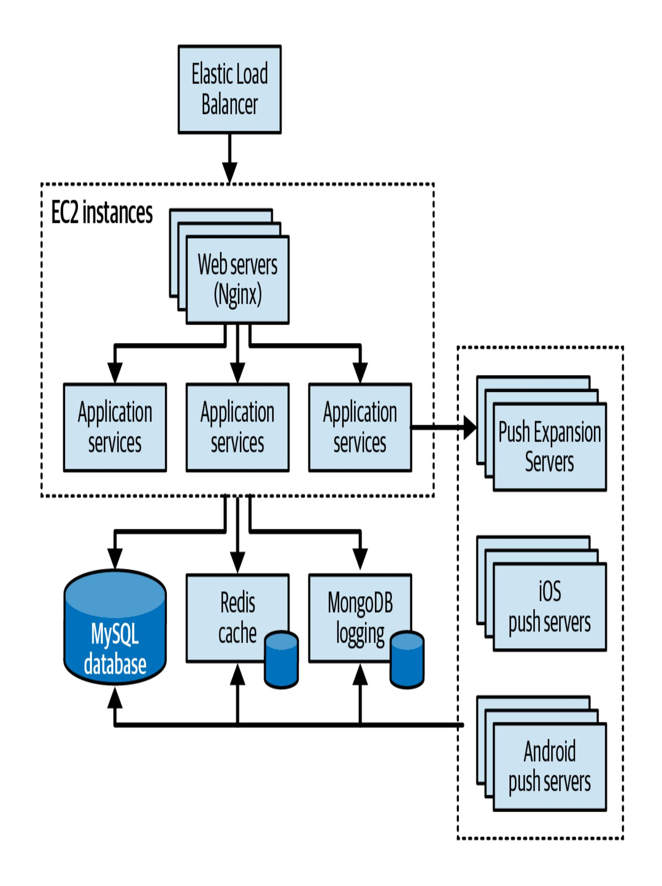
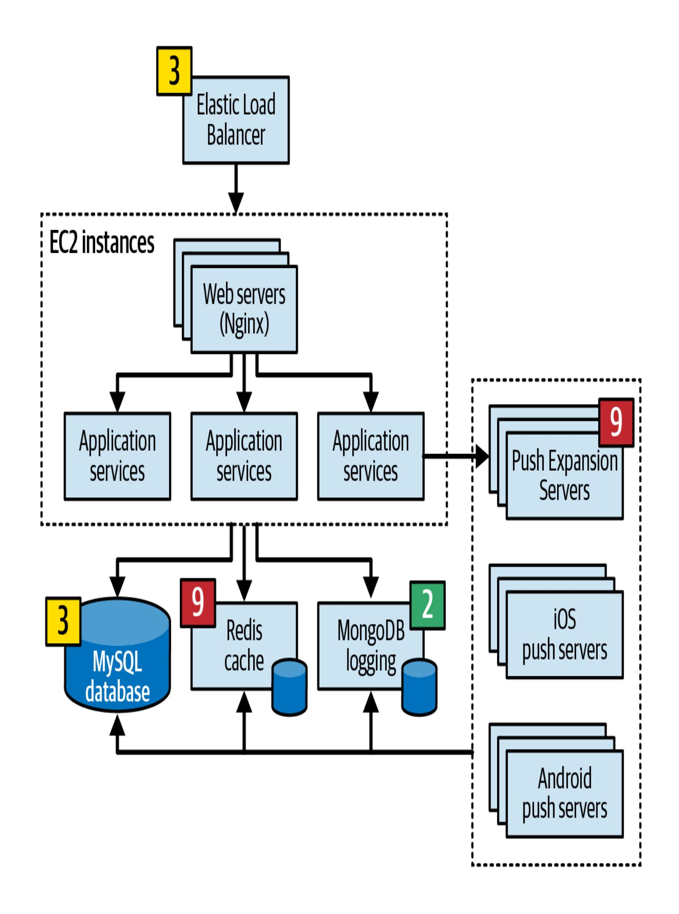
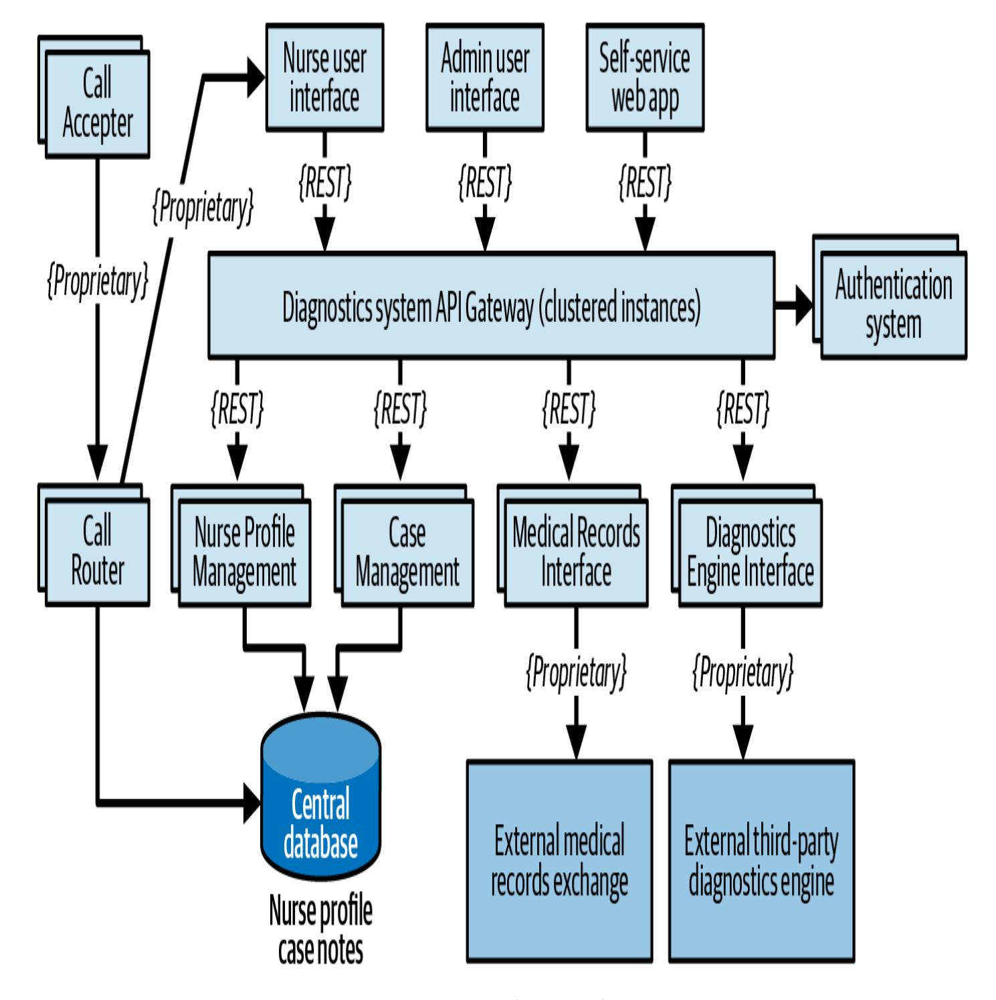
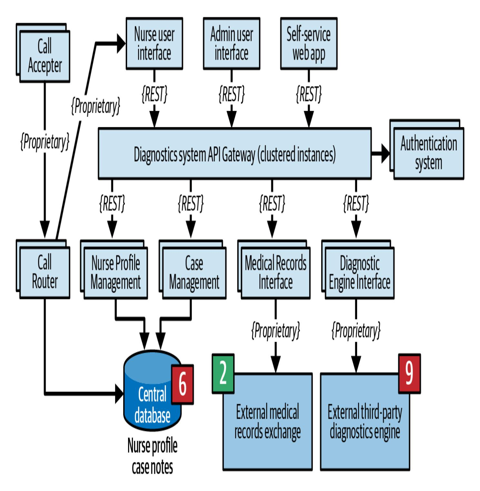
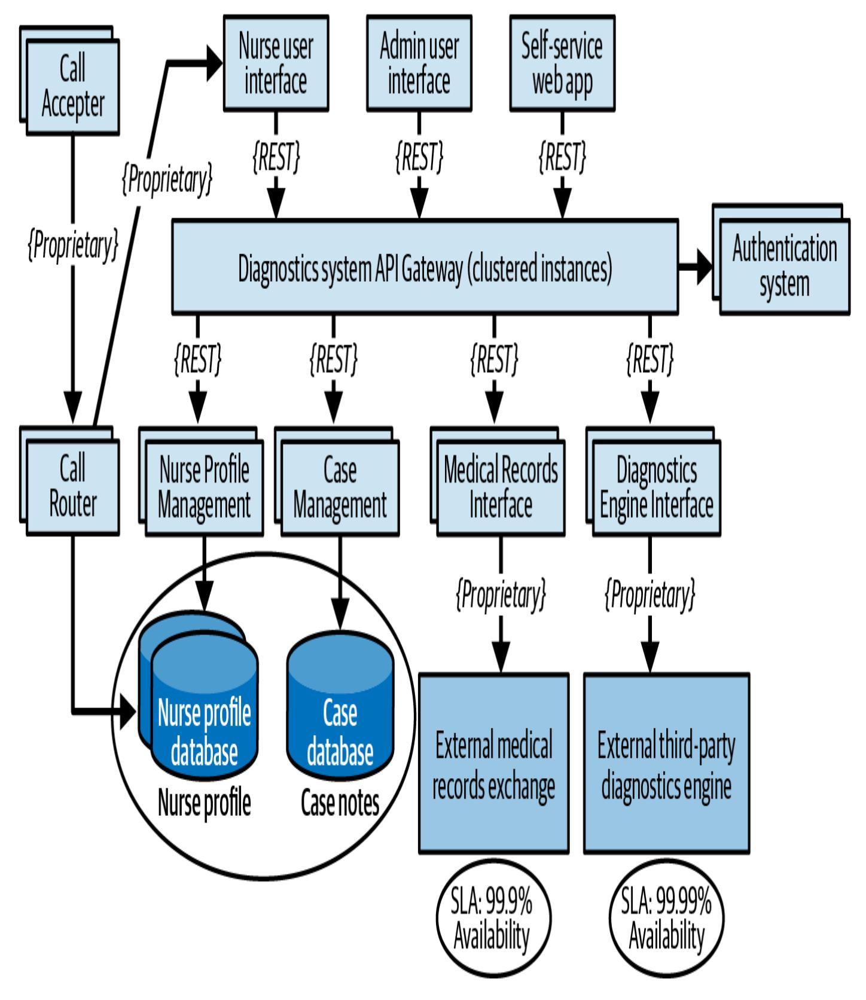
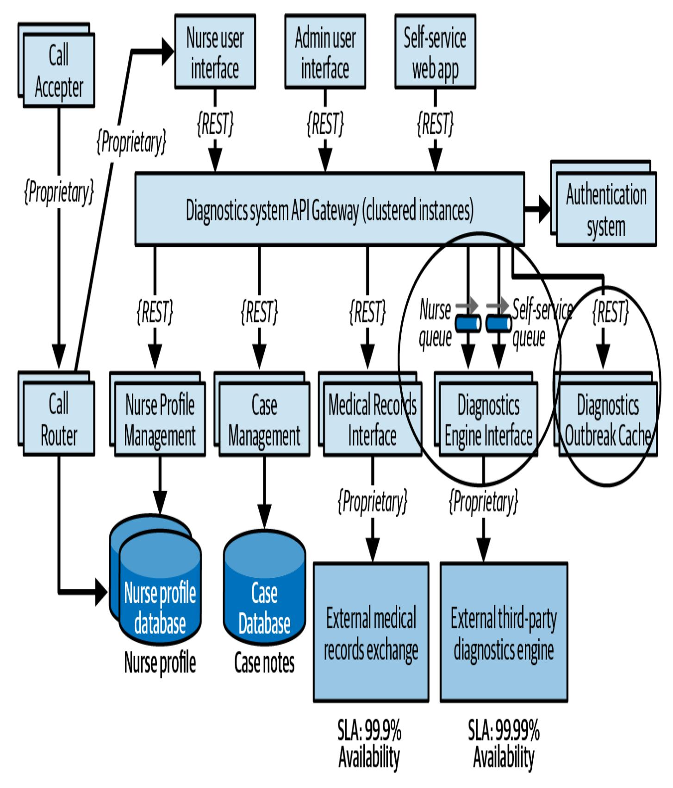
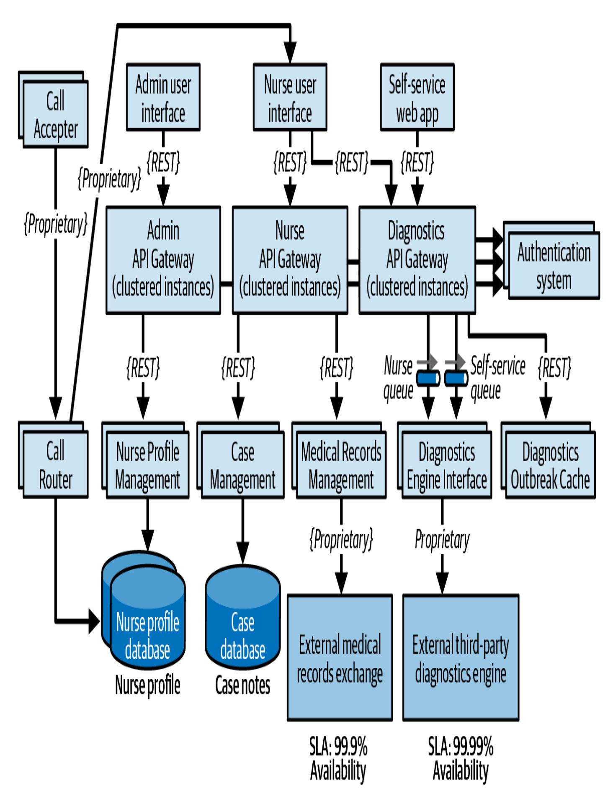

# 22장. 아키텍처 리스크 분석

이 작업은 AI의 도움을 받아 번역되었습니다. 여러분의 피드백과 의견을 환영합니다: translation-feedback@oreilly.com

모든 아키텍처에는 위험이 내재되어 있습니다. 일부는 운영적(가용성, 확장성, 데이터 무결성 등)이고, 일부는 구조적(논리적 구성 요소 간의 정적 결합 등)입니다. 아키텍처 위험 분석은 아키텍트의 가장 중요한 업무 중 하나입니다. 이를 통해 아키텍처 내의 약점과 구조적 퇴화를 식별하고 시정 조치를 취할 수 있습니다. 이 장에서는 위험을 정량화하고 평가하며 식별하기 위한 몇 가지 핵심 기술과 실용적인 방법을 소개하고, *리스크 스토밍(Risk Storming)*이라고 불리는 활동을 제시합니다.

## 리스크 매트릭스

아키텍처 위험을 평가할 때, 먼저 아키텍처의 특정 부분에 대한 위험의 정도를 결정해야 합니다. 즉, 위험이 낮음, 중간 또는 높음인지를 판단해야 합니다. 여기서 어려운 점은 위험 평가가 *주관적*일 수 있다는 것입니다. 한 아키텍트는 아키텍처의 특정 측면이 높은 위험을 초래한다고 *생각*할 수 있지만, 다른 아키텍트는 동일한 측면을 중간 위험으로 *간주*할 수 있습니다. 우리는 여기서 *생각*이라는 단어를 이탤릭체로 강조하여 위험 평가의 주관성을 강조합니다. 다행히도 아키텍트들에게는 위험을 측정 가능하게 하는 데 도움이 되는 유용한 위험 평가 매트릭스가 있습니다.

아키텍처 위험 평가 매트릭스(그림 22-1)는 두 가지 차원을 사용하여 위험을 평가합니다. 즉, 해당 위험의 전체 영향과 위험 발생 확률입니다. 아키텍트는 각 차원을 낮음(1), 중간(2) 또는 높음(3)으로 분류한 다음, 매트릭스의 각 교차점에서 숫자를 곱합니다. 이 방법은 위험을 수치적으로 표현하여 위험 분류 과정을 *객관적*으로 만듭니다. 숫자 1과 2는 낮은 위험(일반적으로 녹색), 숫자 3과 4는 중간 위험(일반적으로 노란색), 숫자 6에서 9는 높은 위험(일반적으로 빨간색)으로 간주됩니다. 음영을 사용하면 흑백으로 표현하거나 색을 구분하지 못하는 사람들에게 도움이 될 수 있습니다.

|                        |            | 낮음 (1) | 중간 (2) | 높음 (3) |
|------------------------|------------|---------|------------|----------|
| tofrisk                | 낮음 (1)    | 1       | 2          | 3        |
| 위험의 전체 영향      | 중간 (2)   | 2       | 4          | 6        |
| Ove                    | 높음 (3)   | 3       | 6          | 9        |

그림 22-1. 아키텍처 위험 결정 매트릭스

이 유용성을 설명하기 위해 예시에서 위험 매트릭스를 사용하겠습니다. 애플리케이션의 핵심 중앙 데이터베이스의 가용성에 대해 걱정하고 있다고 가정해 봅시다.

#### **팁**

이 매트릭스를 사용하여 위험을 평가할 때는 먼저 영향을 고려한 다음 확률을 고려해야 합니다. 확률이 확실하지 않다면, 확인될 때까지 높은 평가(3)를 사용하십시오.

먼저 전체 영향을 고려해 봅시다. 데이터베이스가 실패하거나 사용할 수 없게 되면 어떻게 될까요? 영향을 높은 위험으로 평가하고 이 위험을 그림 22-1의 매트릭스 마지막 행에서 3(중간), 6(높음) 또는 9(높음)로 분류한다고 가정해 봅시다. 그러나 이 위험이 발생할 확률이라는 두 번째 차원을 고려하면, 데이터베이스가 클러스터 구성의 고가용성 서버에 있으며 데이터베이스를 사용할 수 없을 *확률*은 낮음(매트릭스의 첫 번째 열)입니다. 높은 영향과 낮은 확률의 교차점은 주 중앙 데이터베이스의 가용성에 대한 전체 위험 평가를 3(중간 위험)으로 만듭니다.

## 위험 평가

위험 매트릭스를 사용하여 *위험 평가*라고 불리는 것을 만들 수 있습니다. 이는 컨텍스트(서비스, 하위 도메인 영역 또는 시스템의 도메인 영역)를 기반으로 한 의미 있는 평가 기준을 포함하는 아키텍처의 전체 위험에 대한 요약 보고서입니다. 우리는 이미 많은 위험 평가를 수행했으며,

아키텍처 특성이 위험 평가 기준으로서 탁월하다는 것을 발견했습니다. 시스템의 중요한 아키텍처 특성이 확장성, 탄력성 및 데이터 무결성이라면 성능 위험을 분석하는 데 시간을 소비할 이유가 무엇일까요? 4장에서 설명된 것과 같은 특성들에 대한 지식은 아키텍처 위험 분석의 첫 번째 단계입니다.

#### **팁**

아키텍처를 지원하는 데 가장 중요한 아키텍처 특성은 위험 평가를 위한 훌륭한 기준입니다.

그림 22-2에는 위험 평가 보고서의 기본 형식이 제시되어 있습니다. 여기서 1과 2는 낮은 위험, 3과 4는 중간 위험, 6과 9는 높은 위험을 나타냅니다. 위험 기준은 워크시트 왼쪽에 있고 컨텍스트는 상단에 있습니다.

| 위험 기준         | 고객 등록       | 카탈로그 체크아웃 | 주문 처리       | 주문 배송       | 총 위험 |
|-------------------|-------------------|-------------------|-------------------|-------------------|---------------|
| 확장성           | 2                 | 6                 |                   | 2                 | 11            |
| 가용성           | 3                 | 4                 | 2                 | 1                 | 10            |
| 성능             | 4                 | 2                 | 3                 | 6                 | 15            |
| 보안             | 6                 | 3                 | 1                 | 1                 | 11            |
| 데이터 무결성 | 9                 | 6                 | 1                 | 1                 | 17            |
| 총 위험          | 24                | 21                | 8                 | 11                |               |

그림 22-2. 표준 위험 평가 예시

이 위험 평가의 예시로 전자상거래 주문 시스템을 사용합니다. 시스템의 중요한 아키텍처 특성을 나타내는 다섯 가지 기준이 평가됩니다. 상단에는 각각 자체 도메인을 나타내는 네 가지 다른 컨텍스트가 있습니다(고객 등록, 카탈로그 체크아웃, 주문 처리 및 주문 배송). 도메인 또는 하위 도메인 컨텍스트가 적합합니다. 서비스 수준의 위험 분석은 일반적으로 너무 세분화되어 여러 서비스 간의 통신 또는 조정과 관련된 위험을 고려하지 않습니다.

정량화된 위험을 사용하는 장점은 위험 기준과 컨텍스트를 모두 고려한다는 것입니다. 그림 22-2에서 데이터 무결성에 대한 누적 총 위험은 예를 들어 17이며, 이는 기준 관점에서 가장 높은 위험 영역입니다. 가용성에 대한 누적 위험은 10에 불과합니다(기준에 따른 가장 낮은 위험). 개별 컨텍스트 영역의 상대적 위험에 관해서는 고객 등록이 가장 높은 위험 영역이고, 주문 처리는 가장 낮은 위험을 나타냅니다. 이는 우선순위를 정하고 위험 완화를 위한 추가 노력이 필요한 곳을 결정할 때 유용한 정보입니다.

이 위험 평가 예시는 위험 분석의 모든 결과를 포함하지만, 때로는 특정 문제를 강조하기 위해 세부 정보를 필터링하는 것이 유용합니다. 예를 들어, 시스템의 아키텍트로서 회의에 참석하여 이해관계자들에게 시스템의 위험한 영역을 제시한다고 가정해 봅시다. 그림

22-2와 같이 전체 위험 평가를 제시하는 대신, 낮은 위험과 중간 위험 영역(노이즈)을 필터링하여 높은 위험 영역(신호)을 강조할 수 있습니다. 신호 대 잡음비를 개선함으로써 더 효과적이고 덜 산만한 메시지를 전달할 수 있습니다. 그림 22-3은 동일한 위험 평가의 필터링된 버전을 보여줍니다. 두 이미지를 비교하여 두 번째 필터링된 평가에서 메시지가 얼마나 명확해지는지 확인하십시오.

| 위험 기준         | 고객 등록       | 카탈로그 체크아웃 | 주문 처리       | 주문 배송       | 총 위험 |
|-------------------|-------------------|-------------------|-------------------|-------------------|---------------|
| 확장성           |                   | (**5** )          |                   |                   | 6             |
| 가용성           |                   |                   |                   |                   | 0             |
| 성능             |                   |                   |                   | 6                 | 6             |
| 보안             | 6                 |                   |                   |                   | 6             |
| 데이터 무결성 | 9                 | 6                 |                   |                   | 15            |
| 총 위험          | 15                | 12                | 0                 | 6                 |               |

그림 22-3. 높은 위험만 표시하도록 위험 평가 필터링

위험 평가의 전체 버전에서 문제가 되는 점은 그것이 단지 스냅샷일 뿐이며 상황이 개선되었는지 또는 악화되었는지 보여주지 않는다는 것입니다. 다시 말해,

그림 22-2는 *위험의 방향*을 보여주지 않습니다. 6장에서 설명된 대로 피트니스 함수를 사용하여 지속적인 측정을 수행함으로써 위험의 방향을 결정할 수 있습니다. 각 위험 기준을 객관적으로 분석하면 추세를 관찰하여 각 위험 기준의 방향을 파악할 수 있습니다.

그림 22-4에서는 위험 평가에 세 번째 차원인 *방향*을 추가합니다. 뒤집힌 삼각형은 특정 기준 및 컨텍스트에 대한 위험이 악화되고 있음을 의미합니다. 삼각형의 꼭대기가 위로 향하여 *더 높은* 숫자를 가리킵니다. 반대로, 거꾸로 된 삼각형은 위험이 감소하고 있음을 나타냅니다(따라서 꼭대기는 *더 낮은* 숫자를 가리킵니다). 마지막으로 원은 위험이 개선되지도 악화되지도 않았음을 나타냅니다. 혼란스러울 수 있으므로 방향을 나타내는 기호를 사용할 때는 항상 범례를 사용하는 것이 좋습니다.

| 위험 기준         | 고객 등록       | 카탈로그 체크아웃 | 주문 처리       | 주문 배송       | 총 위험 |
|-------------------|-------------------|-------------------|-------------------|-------------------|---------------|
| 확장성           | 2                 | 6                 |                   | 2                 | 11            |
| 가용성           | 3                 | 4                 | 2                 | 1                 | 10            |
| 성능             | 4                 | 2                 | 3                 | 6                 | 15            |
| 보안             | 6                 | 3                 | 1                 | 1                 | 11            |
| 데이터 무결성 | 9                 | 6                 | 1                 | 1                 | 17            |
| 총 위험          | 24                | 21                | 8                 | 11                |               |

그림 22-4. 삼각형으로 위험 방향을 나타내기

이제 방향을 나타내는 수정된 아키텍처 위험 평가는 원본과 다른 이야기를 들려줍니다. 첫째, 지속적인 측정(삼각형이 위를 향함)에서 카탈로그 체크아웃, 주문 처리 및 주문 배송의 데이터 무결성이 악화되고 있음을 알 수 있으며, 이는 데이터베이스 문제를 시사할 수 있습니다. 반면, 고객 등록 및 카탈로그 체크아웃에서는 보안 및 가용성이 전반적으로 개선되고 있으며(삼각형이 아래를 향함), 이는 이러한 영역에서의 개선을 나타냅니다.

다음으로, 우리는 *리스크 스토밍(Risk Storming)*이라고 부르는 프로세스를 설명할 것이며, 팀은 이를 사용하여 특정 컨텍스트와 기준에 대한 위험 수준을 결정할 수 있습니다.

## 리스크 스토밍

어떤 아키텍트도 홀로 시스템의 전체 위험을 결정할 수 없습니다. 두 가지 이유가 있습니다. 첫째, 홀로 작업하는 아키텍트는 위험 영역을 놓치거나 간과할 수 있고, 둘째, 모든 아키텍트가 시스템의 *모든* 부분을 아는 경우는 거의 없기 때문입니다. 바로 이 지점에서 리스크 스토밍이 도움이 될 수 있습니다.

*리스크 스토밍*은 특정 차원(컨텍스트 또는 기준) 내에서 아키텍처 위험을 결정하기 위한 협력적 연습입니다. 대부분의 리스크 스토밍에는 여러 아키텍트가 참여하지만, 선임 개발자와 기술 리더도 참여시키는 것을 강력히 권장합니다. 그들은 아키텍처 위험에 대한 구현 관점을 제공할 뿐만 아니라, 참여를 통해 아키텍처를 더 잘 이해할 수 있습니다.

리스크 스토밍은 식별, 합의, 완화의 세 단계로 구성됩니다. 개별 단계(1단계)에서 모든 참가자는 위험 매트릭스를 사용하여 아키텍처의 다양한 영역에 위험을 할당합니다. 리스크 스토밍의 이 개별 단계는 참가자들이 다른 참가자들에게 영향을 미치거나 아키텍처의 특정 영역에서 다른 사람들의 주의를 분산시키지 않도록 하는 데 중요합니다. 두 협력 단계에서 모든 참가자는 협력하여 위험 영역에 대한 합의를 도출하고 토론하고(2단계), 위험 완화 솔루션을 찾습니다(3단계).

세 단계 모두에서 포괄적이거나 컨텍스트 기반의 아키텍처 다이어그램이 사용됩니다(23장 참조). 리스크 스토밍을 주도하는 아키텍트(우리는 그를 *진행자*라고 부릅니다)는 모든 참가자가 리스크 스토밍 세션에 대한 업데이트된 다이어그램을 받도록 할 책임이 있습니다.

그림 22-5는 리스크 스토밍 프로세스를 설명하는 데 사용할 예시 아키텍처를 보여줍니다. 이 아키텍처에서 Elastic Load Balancer는 웹 서버(Nginx)와 애플리케이션 서비스를 포함하는 각 EC2 인스턴스에 요청을 전달합니다. 애플리케이션 서비스는 MySQL 데이터베이스, Redis 캐시 및 MongoDB 데이터베이스(로깅용)를 호출합니다. 또한 Push Expansion Server를 호출하며, 이 서버는 다시 MySQL 데이터베이스, Redis 캐시 및 MongoDB 로깅과 연결됩니다. (이 모든 제품과 용어를 이해하지 못해도 걱정하지 마십시오. 이 너무 모호하고 일반화된 아키텍처는 리스크 스토밍이 어떻게 작동하는지 설명하기 위한 것일 뿐입니다.)

1단계부터 시작하겠습니다.

### **1단계: 식별**

리스크 스토밍의 *식별 단계*에서 각 참가자는 아키텍처 내의 위험 영역을 개별적으로 식별합니다. 이 단계에서는 각 참가자가 다른 참가자들의 영향을 받지 않고 위험에 대한 자신의 편견 없는 시각을 기록하는 것이 중요합니다. 식별 단계는 세 단계로 구성됩니다.

- 1. 진행자는 모든 참가자에게 협력 단계에 대한 초대장을 보냅니다. 초대장에는 아키텍처 다이어그램(또는 찾을 수 있는 위치), 분석할 위험 기준 및 컨텍스트, 협력 세션의 날짜, 시간 및 장소(물리적 또는 가상) 및 기타 모든 물류 세부 정보가 포함됩니다.
- 2. 참가자는 위험 매트릭스를 사용하여 아키텍처의 위험을 개별적으로 분석합니다.
- 3. 참가자는 각 위험을 낮음(1-2), 중간(3-4) 또는 높음(6-9)으로 분류하고 숫자를 작은 녹색, 노란색 또는 빨간색 포스트잇에 적습니다.

대부분의 리스크 스토밍에서는 특정 기준이나 컨텍스트만 분석됩니다(예: "우리의 보안 위험은 어디에 있습니까?" 또는 "고객 등록 시 위험에 처한 영역은 무엇입니까?"). 그러나 인력 가용성이나 일정에 문제가 있는 경우, 위험 평가 팀은 특정 컨텍스트 내에서 여러 차원(예: 성능 및 확장성)을 분석해야 할 수도 있습니다. 이러한 경우 참가자는 위험 번호 옆에 해당 기준을 포스트잇에 적습니다. 예를 들어, 세 명의 참가자가 중앙 데이터베이스에서 위험을 본다고 가정해 봅시다. 세 명의 참가자 모두 위험을 높음(6)으로 분류하지만, 한 참가자는 이를 가용성 위험으로 보고 다른 두 참가자는 성능 위험으로 봅니다. 참가자들은 이 두 가지 기준을 개별적으로 논의해야 합니다.

#### **팁**

가능하다면 리스크 스토밍 시 단일 기준 또는 컨텍스트에 집중하십시오. 이렇게 하면 참가자들이 이 특정 차원에 집중할 수 있으며 실제 위험을 제대로 평가하지 못하는 것을 방지할 수 있습니다.

### **2단계: 합의**

리스크 스토밍의 *합의 단계*는 매우 협력적이며, 아키텍처 내의 위험에 대해 모든 참가자 간의 합의를 도출하는 것을 목표로 합니다. 이 활동은 진행자가 대형 인쇄된 아키텍처 다이어그램을 벽에 걸거나(또는 대형 화면에 전자 버전을 표시) 할 때 가장 효과적입니다. 참가자들이 리스크 스토밍에 도착하면 진행자는 그들에게 위험 수준이 적힌 포스트잇을 아키텍처 다이어그램의 해당 영역에 붙이도록 지시합니다(그림 22-6 참조).

모든 포스트잇이 붙으면 협력 단계가 시작될 수 있습니다. 여기서는 팀이 위험 영역을 분석하고 위험 수준에 대한 합의를 찾는 것이 목표입니다. 그림 22-6에 제시된 예시에서 팀은 여러 위험 영역을 식별했습니다. (실제 기준은 이 예시에서 중요하지 않습니다.) 다음을 알 수 있습니다.

- 두 참가자는 Elastic Load Balancer를 중간 위험(3)으로 분류했고, 한 참가자는 높은 위험(6)으로 분류했습니다.
- 한 참가자는 Push Expansion Server를 높은 위험(9)으로 분류했습니다.
- 세 참가자는 MySQL 데이터베이스를 중간 위험(3)으로 분류했습니다.
- 한 참가자는 Redis 캐시를 높은 위험(9)으로 분류했습니다.
- 세 참가자는 MongoDB 로깅을 낮은 위험(2)으로 분류했습니다.
- 아무도 아키텍처의 다른 영역을 위험하다고 식별하지 않았으므로, 다른 영역에는 포스트잇이 없습니다.

MySQL 데이터베이스와 MongoDB 로깅은 모든 참가자가 위험 수준에 동의했으므로 이 세션에서 더 이상 논의할 필요가 없습니다. 그러나 Elastic Load Balancer에 대해서는 의견이 엇갈리고, Push Expansion Server와 Redis 캐시는 각각 한 명의 참가자만 위험으로 분류했습니다. 이러한 불일치를 해소하기 위해 협력 단계가 필요합니다.

두 참가자(Austen과 Logan)는 Elastic Load Balancer를 중간 위험(3)으로 분류했고, 한 참가자(Addison)는 높은 위험(6)으로 분류했습니다. Austen과 Logan은 Addison에게 왜 위험을 높음으로 분류했는지 묻습니다. Addison은 Elastic Load Balancer가 실패하면 전체 시스템에 접근할 수 없게 된다고 답합니다. 이는 사실이며 *위험*을 높음으로 증가시키지만, 다른 두 참가자는 Addison에게 클러스터링으로 인해 위험이 낮다는 것을 설득합니다. Addison은 이에 동의하고 그룹은 *확률 수준*을 중간(3)으로 낮춥니다.

그러나 결과는 다르게 나올 수도 있었습니다. Austen과 Logan이 Addison이 본 Elastic Load Balancer의 특정 위험 측면을 놓쳤다면, Addison은 다른 두 참가자에게 이 위험을 중간이 아닌 높음으로 분류하도록 설득할 수 있었을 것입니다. 이것이 리스크 스토밍에서 협력 단계가 매우 중요한 이유입니다.

한 참가자는 Push Expansion Server를 높은 위험(9)으로 분류했지만, 다른 참가자는 아키텍처의 이 영역에서 전혀 위험을 보지 못했습니다. 위험을 식별한 사람은 이 아키텍처에서 발생하는 높은 부하에서 Push Expansion Server가 끊임없이 충돌하는 나쁜 경험을 했기 때문에 위험을 높음으로 분류했다고 설명합니다. 이 예시는 리스크 스토밍의 가치를 보여줍니다. 이 참가자가 없었다면, 아무도 프로덕션에 도달할 때까지 높은 위험을 인식하지 못했을 것입니다.

Redis 캐시는 흥미로운 경우입니다. Devon이라는 개발자 참가자는 이를 높은 위험(9)으로 분류했지만, 다른 누구도 이 캐시에서 위험을 보지 못했습니다. 다른 참가자들이 Devon에게 왜 이 위험을 높음으로 분류했는지 묻자, 그는 "Redis 캐시가 무엇입니까?"라고 대답합니다. 리스크 스토밍 참가자가 기술을 알 수 없다고 표현할 때마다, 이 영역은 자동으로 높은 위험(9)으로 분류됩니다.

#### **팁**

검증되지 않거나 알 수 없는 기술에는 항상 가장 높은 위험 평가(9)를 부여하십시오. 이 기준 또는 컨텍스트에 대해 위험 매트릭스를 사용할 수 없기 때문입니다.

Redis 캐시의 예시는 개발자들을 위험 회의에 참여시키는 것이 왜 중요한지 명확히 보여줍니다. 이 참가자가 특정 기술을 몰랐다는 사실은 아키텍트에게 전체 위험에 대한 귀중한 정보입니다.

아키텍트는 기술을 변경하거나 개발 팀을 최신 상태로 유지하기 위해 교육 비용을 부담하기로 결정할 수 있습니다.

이 단계는 모든 참가자가 식별된 위험 영역에 대해 합의할 때까지 계속됩니다. 모든 포스트잇이 통합되면 이 단계는 종료됩니다. 최종 결과는 그림 22-7에 제시되어 있습니다.

## **3단계: 위험 완화**

모든 이해관계자가 아키텍처의 위험 수준에 대해 합의하면 *위험 완화* 단계가 시작됩니다. 위험 완화에는 일반적으로 완벽하다고 간주되었을 아키텍처의 특정 영역을 변경해야 합니다.

이 단계는 또한 협력적으로 진행되며, 2단계에서 식별된 위험을 줄이거나 제거할 방법을 찾습니다. 식별된 위험에 따라 원래 아키텍처를 완전히 변경해야 할 수도 있고, 변경 사항이 특정 영역에서 아키텍처를 간단히 리팩토링하는 데 국한될 수도 있습니다. 예를 들어, 처리량 병목 현상을 줄이기 위해 역압력 대기열을 추가하는 것입니다.

어떤 변경이 필요하든 관계없이, 위험 완화 단계는 일반적으로 추가 비용을 발생시킵니다. 따라서 이 단계에 주요 비즈니스 이해관계자를 참여시켜 특정 위험 완화 솔루션의 비용이 위험을 상회하는지 여부를 결정할 수 있도록 하는 것이 중요합니다.

예를 들어, 우리의 예시 리스크 스토밍에서 팀이 일반적인 시스템 가용성과 관련하여 중앙 데이터베이스를 중간 위험(4)으로 분류했다고 가정해 봅시다. 참가자들은 다음과 같이 동의합니다.

데이터베이스 클러스터링과 물리적 데이터베이스를 분리하는 것이 이 위험을 완화할 것입니다. 그러나 이 솔루션은 50,000달러가 들 것입니다. 진행 아키텍트는 소유자를 포함한 주요 비즈니스 이해관계자들과 만나 가용성 위험과 비용 간의 절충안을 논의합니다. 비즈니스 소유자는 가격이 너무 높고 비용이 가용성 위험을 상회하지 않는다고 결정합니다. 아키텍트는 그런 다음 다른 접근 방식을 제안합니다. 비싼 클러스터링을 수행하는 대신 데이터베이스를 두 개의 별도 도메인 기반 데이터베이스로 분할하는 것은 어떨까요? 이 솔루션은 단 16,000달러에 불과하며 가용성 위험을 줄일 수 있습니다. 이해관계자들은 이 절충안에 동의합니다.

이 시나리오는 리스크 스토밍이 전체 아키텍처뿐만 아니라 아키텍트와 이해관계자 간의 협상에도 영향을 미치는 방식을 보여줍니다. 이 장의 시작 부분에서 설명한 위험 평가와 결합된 리스크 스토밍은 위험을 식별하고 추적하며 아키텍처를 개선하고 주요 이해관계자 간의 협상을 구조화하는 훌륭한 수단입니다.

## 사용자 스토리 위험 분석

리스크 스토밍은 아키텍처 위험을 식별하는 데 유용할 뿐만 아니라,

소프트웨어 개발의 많은 다른 측면에서도 유용합니다. 예를 들어, 개발 팀은 리스크 스토밍을 사용하여 스토리 그루밍 중에 특정 이터레이션에서 사용자 스토리 완료에 대한 전체 위험(및 해당 이터레이션의 전체 위험 평가)을 결정할 수 있습니다. 동일한 위험 매트릭스를 사용하여 팀은 스토리가 이터레이션 내에서 완료되지 않을 경우의 전체 영향과 현재 이터레이션에서 스토리가 완료되지 않을 확률을 결정함으로써 사용자 스토리의 위험을 식별할 수 있습니다. 그런 다음 팀은 위험이 높은 스토리를 식별하고, 신중하게 추적하며, 더 나은 우선순위를 정할 수 있습니다.

## 리스크 스토밍 사용 사례

리스크 스토밍이 얼마나 강력하며 전체 아키텍처를 어떻게 개선할 수 있는지 설명하기 위해, 간호사들이 환자들에게 다양한 건강 상태에 대해 조언하는 콜센터 지원 시스템의 예를 살펴보겠습니다. 시스템 요구사항은 다음과 같습니다.

- 타사 진단 엔진은 질문을 하고 간호사와 환자를 의료 문제로 안내합니다. 이 시스템은 초당 약 500개의 요청을 처리할 수 있습니다.
- 환자는 콜센터에 전화하여 간호사와 대화하거나 동일한 진단 엔진에 직접 액세스하는 셀프 서비스 웹사이트를 이용할 수 있습니다.

- 시스템은 전국적으로 250명의 간호사를 지원하고 동시에 수십만 명의 셀프 서비스 환자를 지원해야 합니다.
- 간호사는 환자 기록 교환을 통해 환자 기록에 액세스할 수 있지만, 환자는 자신의 기록에 액세스할 수 없습니다.
- 시스템은 HIPAA (Health Insurance Portability and Accountability Act)를 준수해야 합니다. 즉, 간호사 외에는 아무도 환자의 의료 기록에 액세스할 수 없어야 합니다. 셀프 서비스 옵션은 HIPAA 준수를 보장할 수 없습니다.
- 시스템은 감기, 독감 및 COVID 발생 시 높은 볼륨을 처리할 수 있어야 합니다.
- 통화는 간호사의 자격 프로필(예: 구사 언어 또는 의료 전문 분야)에 따라 이들에게 전달됩니다.

이러한 요구사항을 분석한 후, 이 시스템을 담당하는 아키텍트 로건은 그림 22-8에 제시된 상위 수준 아키텍처를 설계합니다. 이 아키텍처는 세 개의 별도 웹 기반 사용자 인터페이스로 구성됩니다. 하나는 셀프 서비스용, 다른 하나는 전화를 받는 간호사용, 그리고 간호사 프로필 및 구성 설정을 추가하고 관리하기 위한 관리 직원용입니다. 시스템의 콜센터 부분은 통화를 수신하는 Call Accepter 서비스와 간호사의 자격 프로필을 기반으로 발신자를 다음 사용 가능한 간호사에게 라우팅하는 Call Router 서비스로 구성됩니다. Call Router 서비스는 중앙 데이터베이스에 액세스하여 간호사 프로필 정보를 가져옵니다. 이 아키텍처의 핵심은 보안 검사를 수행하고 요청을 적절한 백엔드 서비스로 전달하는 진단 시스템용 API 게이트웨이입니다.

그림 22-8. 간호사 핫라인 진단 시스템의 상위 수준 아키텍처

이 시스템의 네 가지 주요 서비스는 Case Management 서비스, Nurse Profile Management 서비스, 의료 데이터를 교환하기 위한 Medical Records Interface 서비스, 그리고 외부 공급업체의 Diagnostics Engine Interface 서비스입니다. 외부 시스템 및 콜센터 서비스에 대한 독점 프로토콜을 제외하고 모든 통신은 REST를 통해 이루어집니다. 아키텍처가 지원해야 하는 영역은 요약하자면 가용성, 탄력성 및 보안입니다.

여러 검토를 거친 후 로건은 아키텍처가 구현 준비가 되었다고 생각합니다. 그러나 책임감 있고 효과적인 아키텍트로서 로건은 리스크 스토밍을 수행하기로 결정합니다.

### **가용성**

진행자로서 로건은 첫 번째 리스크 스토밍을 시스템 성공에 결정적인 가용성에 집중하기로 결정합니다. 식별 및 협력 단계를 거쳐 참가자들은 다음 위험 영역에 도달합니다(그림 22-9 참조).

- 중앙 데이터베이스의 가용성: 높은 영향(3)과 데이터베이스가 필요할 때 사용할 수 없을 중간 확률(2)로 인해 높은 위험(6).
- 진단 엔진 가용성: 높은 영향(3)과 알 수 없는 사용 불가 확률(3)로 인해 높은 위험(9).
- 의료 기록 인터페이스 가용성: 낮은 위험(2); 이 구성 요소는 특정 의료 결과를 결정하는 데 필요하지 않습니다.

아키텍처가 각 서비스의 여러 인스턴스와 API 게이트웨이의 클러스터를 포함하므로 팀은 시스템의 다른 부분을 가용성 위험으로 분류하지 않았습니다.

그림 22-9. 리스크 스토밍 팀이 식별한 가용성 위험 영역

모든 이해관계자는 데이터베이스가 실패할 경우 간호사가 수동으로 사례 노트를 작성할 수 있지만 Call Router는 작동하지 않을 것이라는 데 동의합니다. 이 위험을 최소화하기 위해 그들은 물리적 데이터베이스를 두 개의 개별 물리적 데이터베이스로 분할하기로 공동으로 결정합니다. 하나는 간호사 프로필 정보를 포함하는 클러스터 데이터베이스이고 다른 하나는 사례 노트를 위한 단일 인스턴스 데이터베이스입니다. 이 아키텍처 변경으로 데이터베이스 가용성 문제가 해결될 뿐만 아니라 사례 노트도 보호됩니다.

외부 시스템(이 경우 진단 엔진 및 의료 기록 인터페이스)의 가용성 위험을 완화하는 것은 훨씬 더 어렵습니다. 이들은 제3자가 제어하기 때문입니다. 팀은 이러한 시스템이 서비스 수준 계약(SLA) 또는 서비스 수준 목표(SLO)를 발표했는지 조사하기로 결정합니다. SLA는 일반적으로 법적 구속력이 있는 계약 합의이며, SLO는 일반적으로 법적 구속력이 없습니다. 그들은 두 시스템에 대한 SLA를 찾습니다. 진단 엔진의 SLA는 99.99%의 가용성을 보장하며(이는 연간 52.60분의 다운타임), 의료 기록 인터페이스는 99.90%의 가용성을 보장합니다(이는 연간 8.77시간의 다운타임). 이 정보는 위험 평가 팀이 식별된 위험을 제거하기에 충분했습니다.

이 리스크 스토밍 후 팀은 그림 22-10에 제시된 대로 아키텍처를 변경하고, 두 개의 데이터베이스를 생성하고, SLA를 아키텍처 다이어그램에 추가합니다.

그림 22-10. 별도의 데이터베이스 사용으로 가용성 위험 영역 완화 가능

### **탄력성**

두 번째 위험 연습은 탄력성, 즉 사용자 부하의 최고치(가변 확장성이라고도 함)에 초점을 맞춥니다. 간호사는 250명에 불과하지만(즉, 250명 이상의 간호사가 진단 엔진에 액세스하지는 않을 것임), 시스템의 셀프 서비스 영역도 진단 엔진에 액세스할 수 있어 진단 엔진 인터페이스에 대한 요청 수가 크게 증가합니다. 리스크 스토밍 참가자들은 독감 시즌과 COVID 발생으로 인해 예상되는 시스템 부하가 크게 증가할 것을 우려하고 있습니다.

참가자들은 진단 엔진 인터페이스를 만장일치로 높은 위험(9)으로 분류했습니다. 초당 500개의 요청만 처리할 수 있으므로, 특히 REST를 인터페이스 프로토콜로 사용하는 경우 예상 처리량을 따라가지 못할 높은 위험이 있다고 정당하게 평가합니다.

팀은 이 위험을 완화하는 한 가지 방법은 API 게이트웨이와 진단 엔진 인터페이스 간의 통신에 비동기 대기열(메시징)을 사용하는 것이라고 결정했습니다. 이는 진단 엔진 호출이 반환될 경우 백로그를 생성합니다. 이는 좋은 관행이지만, 위험이 완전히 완화되지는 않습니다. 간호사와 셀프 서비스 환자는 여전히 진단 엔진의 응답을 너무 오래 기다려야 할 것이며, 그들의 요청은 제때 처리되지 않을 것입니다.

참가자들은 단 하나의 메시징 채널 대신 두 개의 메시징 채널을 사용하여 이러한 요청을 분리하기 위해 Ambulance 패턴이라고 알려진 패턴을 사용하기로 결정합니다. 이를 통해 시스템은 셀프 서비스 요청보다 간호사 요청의 우선순위를 정할 수 있습니다. 이는 위험을 완화하지만 대기 시간을 줄이지는 못할 것입니다. 추가 논의 후 그룹은 특정 발생 또는 독감 관련 질문에 대한 모든 요청을 처리하는 Diagnostics Outbreak Cache Server라는 새로운 서비스를 생성하여(그림 22-11) 진단 엔진에 대한 발생 관련 호출 수를 줄이고 다른 증상에 대한 동시 요청을 더 많이 허용합니다. 리스크 스토밍이 없었다면 이 위험은 아마도 독감 시즌까지 인식되지 못했을 것입니다.

그림 22-11. 탄력성 위험에 대응하기 위한 아키텍처 변경 사항

### **보안**

이러한 성공에 고무된 아키텍트는 이 시스템에 중요한 또 다른 특징인 보안에 초점을 맞춘 마지막 위험 세션을 개최하기로 결정합니다. HIPAA 규정으로 인해 의료 기록 인터페이스는 간호사에게만 환자 의료 기록에 대한 접근을 허용해야 합니다. 아키텍트는 API 게이트웨이의 인증 및 권한 부여 검사가 이 위험을 중화시킬 것이라고 믿지만, 참가자들이 다른 보안 위험을 찾을 수 있을지 궁금해합니다.

모든 참가자는 진단 시스템의 API 게이트웨이를 높은 보안 위험(6)으로 분류했습니다. 그들은 관리 직원이나 셀프 서비스 환자가 의료 기록에 액세스할 경우 큰 영향(3)이 있을 것이라고 말했지만, 확률은 중간(2)으로 추정했습니다. 각 개별 API 호출에 대한 보안 검사는 유용하지만, 모든 호출(셀프 서비스, 관리 및 간호사)은 여전히 동일한 API 게이트웨이를 통해 이루어집니다. 그들은 이 위험을 처음에는 낮음(2)으로 분류했던 진행자를 설득하여, 위험이 실제로 높고 완화되어야 한다는 데 동의하게 만듭니다.

모든 사람은 각 사용자 유형(관리 직원, 셀프 서비스 사용자 및 간호사)에 대한 분리된 API 게이트웨이가 간호사로부터 오지 않은 호출이 의료 기록 인터페이스에 도달하는 것을 방지할 것이라는 데 동의합니다. 아키텍트 아키텍처의 최종 버전은 그림 22-12에 제시되어 있습니다.

그림 22-12. 보안 위험에 대처하기 위한 아키텍처 변경 사항

이 예시는 리스크 스토밍의 힘을 명확히 보여줍니다. 아키텍트, 개발자 및 주요 이해관계자들이 협력하여 시스템 성공에 가장 중요한 아키텍처 특성을 고려하고, 그렇지 않았다면 간과되었을 위험 영역을 식별합니다.

초기 아키텍처 그림 22-8은 리스크 스토밍 그림 22-12 후 가용성, 탄력성 및 보안에 대한 우려를 해소하고 이 아키텍처를 더 효과적이고 성공적인 것으로 만드는 방식으로 변경됩니다.

## 요약

리스크 스토밍은 일회성 프로세스가 아닙니다. 팀이 프로덕션에서 발생하기 전에 위험 영역을 식별하고 완화하기 위해 노력함에 따라 시스템의 전체 수명 주기 동안 지속됩니다. 조직이 리스크 스토밍 세션을 얼마나 자주 개최해야 하는지는 변경 빈도, 아키텍처 재작업 노력 및 아키텍처의 점진적 개발과 같은 여러 요인에 따라 달라집니다. 아키텍처가 정확하고 비즈니스 요구사항을 충족하는지 확인하기 위해 중요한 기능을 추가한 후 또는 각 이터레이션이 끝날 때 특정 차원에 대한 리스크 스토밍을 수행하는 것이 일반적입니다.
