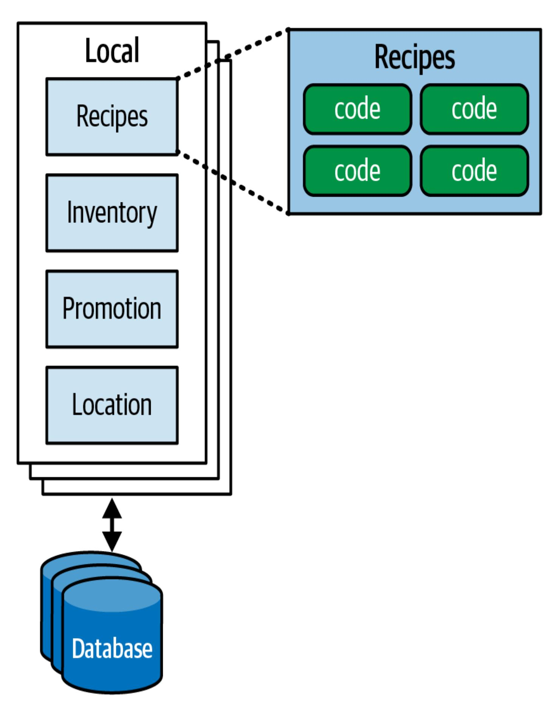
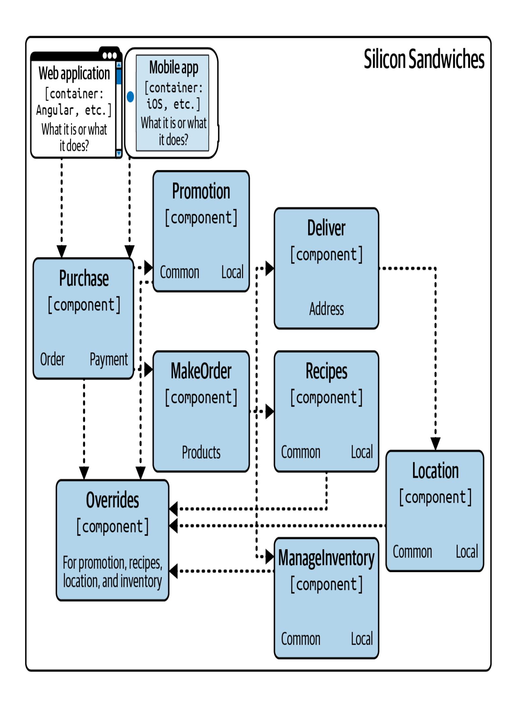
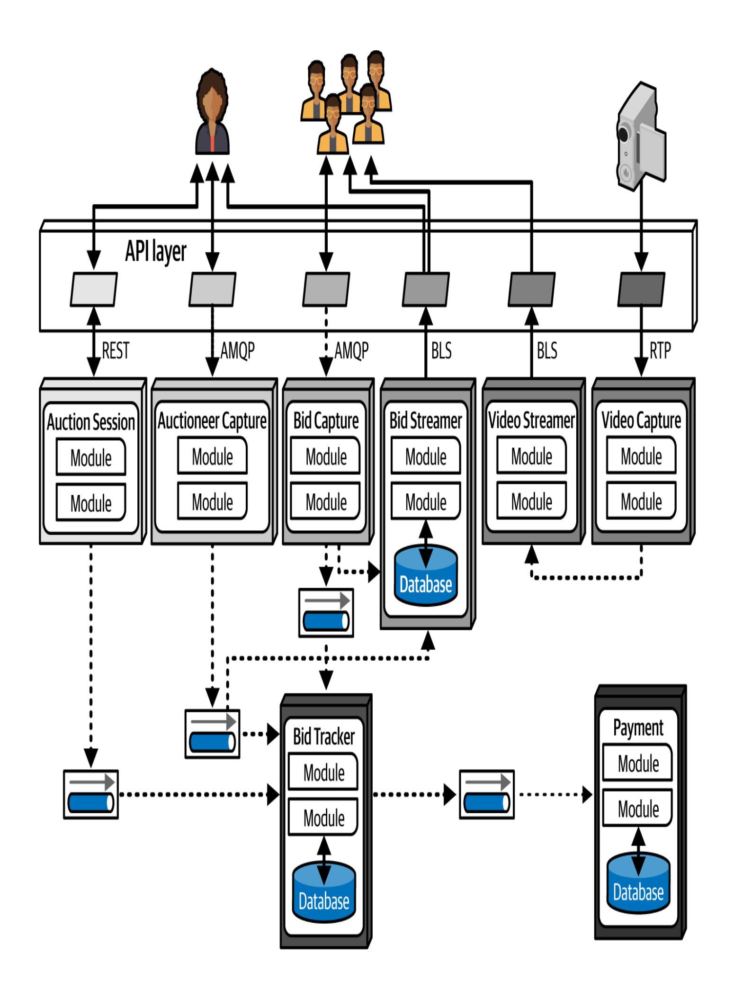

# Kapitel 23. Diagramme zur Architektur

Diese Arbeit wurde mithilfe von KI übersetzt. Wir freuen uns über dein Feedback und deine Kommentare: [translation-feedback@oreilly.com](mailto:translation-feedback@oreilly.com)

Frisch gebackene Softwarearchitekten sind oft überrascht, wie vielfältig die Arbeit ist, abgesehen von den technischen Kenntnissen und Erfahrungen, die sie zu Beginn in diese Rolle gebracht haben. Vor allem eine effektive Kommunikation ist für den Erfolg eines Architekten entscheidend. Egal, wie brillant deine technischen Ideen sind, wenn du die Manager nicht davon überzeugen kannst, diese Ideen zu finanzieren, und die Entwickler nicht davon, sie umzusetzen, wird sich deine Brillanz nie zeigen.

Die Erstellung von Diagrammen ist eine wichtige Kommunikationsfähigkeit für Architekten. Zu jedem Thema gibt es zwar ganze Bücher, aber wir stellen dir hier einige besondere Highlights vor.

Um eine Architektur visuell zu beschreiben, muss der Architekt oft verschiedene Ansichten zeigen: Er kann z. B. mit einem Überblick über die gesamte Topologie beginnen und sich dann in die Details bestimmter Teile der Architektur vertiefen. Wird jedoch ein Teil gezeigt, ohne seinen Platz innerhalb der Gesamtarchitektur zu verdeutlichen, verwirrt das die Betrachter.

*Konsistenz in der Darstellung* bedeutet, dass du immer die Beziehungen zwischen den Teilen einer Architektur aufzeigst, bevor du die Ansichten änderst, und das ist sowohl in Diagrammen als auch in Präsentationen wichtig. Wenn du z. B. beschreiben möchtest, wie die Plug-ins in der Silicon Sandwiches-Lösung im Detail zusammenhängen, würdest du mit einem Architekturdiagramm beginnen, das die gesamte Topologie des Systems und dann die Beziehung zwischen ihr und der Plug-in-Struktur zeigt, bevor du auf die Plug-in-Struktur selbst eingehst. [Abbildung](#page-2-0) 23-1 zeigt ein Beispiel.

Abbildung 23-1. Verwendung von Darstellungskonsistenz zur Angabe von Kontext in einem größeren Diagramm

Achte auf eine konsistente Darstellung, um sicherzustellen, dass die Betrachter den Umfang der dargestellten Gegenstände verstehen und eine häufige Quelle der Verwirrung beseitigen.

# Diagramme

Die Topologie einer Architektur ist für Architekten und Entwickler immer von Interesse, denn sie zeigt, wie die Struktur zusammenpasst, und ermöglicht es den Teams, ein wertvolles gemeinsames Verständnis zu entwickeln. Wir ermutigen alle Architekten, ihre Diagrammfähigkeiten zu schärfen.

## **Werkzeuge**

Die aktuelle Generation von Diagrammwerkzeugen für Architekten ist extrem leistungsfähig, und jeder Architekt sollte das Werkzeug seiner Wahl gründlich erlernen. Vernachlässige aber nicht die Low-Fidelity-Artefakte, vor allem nicht in der Anfangsphase des Entwurfsprozesses. Die frühzeitige Erstellung von sehr flüchtigen Artefakten verhindert, dass Architekten zu sehr an dem hängen, was sie geschaffen haben - ein Verhaltensmuster, das wir *Irrational Artifact Attachment* nennen.

#### **IRRATIONALE ARTEFAKTBEFESTIGUNG**

Das Muster der irrationalen Anhänglichkeit an ein Artefakt beschreibt das Verhältnis zwischen der irrationalen Anhänglichkeit einer Person an ein Artefakt und der Zeit, die sie für die Erstellung dieses Artefakts benötigt hat. Wenn ein Architekt vier Stunden damit verbringt, ein wunderschönes Diagramm in einem Tool wie Visio zu erstellen, wird er diesem Artefakt noch irrationaler anhängen, als wenn er nur zwei Stunden investiert hätte.

Ein Vorteil des agilen Ansatzes bei der Softwareentwicklung ist, dass er die Erstellung von Artefakten "just-in-time" mit so wenig Zeremonien und Ritualen wie möglich vorsieht. Das ist ein Grund, warum so viele Agilisten Karteikarten und Haftnotizen lieben: Durch die Verwendung von Low-Tech-Tools können die Leute wegwerfen, was nicht richtig ist, und so experimentieren und die wahre Natur des Artefakts durch Überarbeitung, Zusammenarbeit und Diskussion herausfinden.

Das klassische flüchtige Artefakt ist ein Handyfoto eines Whiteboard-Diagramms (zusammen mit der unvermeidlichen Aufforderung "Bitte nicht löschen"). Heutzutage haben viele Architekten das Whiteboard zugunsten eines Tablets aufgegeben, das an einen Overheadprojektor angeschlossen ist. Das bietet mehrere Vorteile. Erstens hat das Tablet eine unbegrenzte Leinwand und kann so viele Zeichnungen aufnehmen, wie das Team braucht. Zweitens kann das Team damit "Was-wäre-wenn"- Szenarien kopieren und einfügen, die auf einem Whiteboard das Original verdecken würden. Drittens sind Bilder, die auf einem Tablet

erstellt werden, bereits digitalisiert und haben nicht das unvermeidliche grelle Licht von Whiteboard-Fotos. Viertens macht die Verwendung elektronischer Bilder die Arbeit aus der Ferne viel einfacher und gemeinschaftlicher.

Irgendwann wirst du schöne Diagramme in einem schicken Tool erstellen müssen, aber bevor du diese Zeit investierst, solltest du sicherstellen, dass das Team das Design ausreichend überarbeitet hat. Unabhängig von der Plattform, die du verwendest, wirst du leistungsfähige Diagrammwerkzeuge finden. Wir haben [OmniGraffle](https://oreil.ly/fEoKR) für die ursprünglichen Versionen aller Diagramme in diesem Buch verwendet, die dann von O'Reilly-Illustratoren verfeinert wurden. Auch wenn wir nicht unbedingt ein Tool gegenüber einem anderen bevorzugen, empfehlen wir, auf die folgenden Funktionen zu achten:

#### *Lagen*

Zeichenwerkzeuge unterstützen oft Ebenen, die Architekten gut zu nutzen lernen sollten. Mit Ebenen kann man Gruppen von Elementen logisch miteinander verknüpfen und sie je nach Bedarf ein- oder ausblenden. Du kannst zum Beispiel ein umfassendes Diagramm für eine Präsentation erstellen, aber die überwältigenden Details ausblenden, wenn sie nicht direkt besprochen werden. Ebenen sind auch eine gute Möglichkeit, Bilder zu präsentieren, dieschrittweise aufgebaut werden.

#### *Schablonen/Templates*

Mit den Schablonenwerkzeugen können Benutzer eine Bibliothek allgemeiner visueller Komponenten zusammenstellen, einschließlich Kompositionen anderer Grundformen. In diesem Buch hast du zum Beispiel Standard-Symbole für einzelne Microservices gesehen, die als einzelne Elemente im Schablonen-Tool der Autoren vorhanden sind. Die Erstellung einer Reihe von Schablonen für Muster und Artefakte, die innerhalb einer Organisation üblich sind, schafft Konsistenz in allen Architekturdiagrammen und macht es schneller, neue Diagramme zu erstellen.

#### *Magnete*

Viele Zeichenwerkzeuge bieten Unterstützung beim Zeichnen von Linien zwischen Formen. *Magnete* stellen die Stellen auf den Formen dar, an denen die Linien automatisch einrasten, um sie auszurichten und andere visuelle Annehmlichkeiten zu bieten. Einige Werkzeuge ermöglichen es, weitere Magnete hinzuzufügen oder eigene Magnete zu erstellen.

#### **EBENEN SEMANTISCH NUTZEN, NICHT DEKORATIV**

Wir bevorzugen Zeichenwerkzeuge, die Ebenen unterstützen, aber wir empfehlen, sie *semantisch*zu verwenden *, d.h.*so, dass sie dem Gesamtbild eine Bedeutung verleihen. Die Basisebene jedes Diagramms sollte zum Beispiel die Topologie der Architektur darstellen: ihre Container, Datenbanken, Abhängigkeiten, Broker und andere Kernelemente. Diese Schicht sollte sich eher auf die Architektur als auf die Implementierung konzentrieren; gib zum Beispiel "synchrone Kommunikation" an, anstatt ein bestimmtes Protokoll zu nennen. Die nächste Schicht sollte Details zur Implementierung enthalten: welche Art von Datenbank, welche Kommunikationsprotokolle usw.

Die Verwendung von Schichten auf diese Weise macht Diagramme erweiterbar: Es ist möglich, weitere kontextualisierte Schichten hinzuzufügen, um domänenspezifische Designgrenzen, Transaktionsbereiche oder andere Metainformationen darzustellen, die der Architekt der Topologie der Architektur gegenüberstellen möchte.

Zusätzlich zu diesen speziellen hilfreichen Funktionen sollte das Tool natürlich auch grundlegende Funktionen wie Linien, Farben, Formen und andere visuelle Artefakte unterstützen und in eine Vielzahl von Formaten exportieren können.

**Standards für Diagramme: UML, C4 und ArchiMate**

Die Softwarebranche verwendet mehrere formale Standards für technische Diagramme. Wir werden uns hier drei der beliebtesten ansehen.

#### **UML**

Grady Booch, Ivar Jacobson und Jim Rumbaugh schufen in den 1980er Jahren den Standard der Unified Modeling Language (UML), um ihre konkurrierenden Designphilosophien zu vereinen. Er sollte das Beste aus allen Welten sein, aber wie viele andere Dinge, die von einem Ausschuss entwickelt wurden, schlug er außerhalb der Organisationen, die seine Verwendung vorschrieben, fehl. Architekten und Entwickler verwenden immer noch UML-Klassen- und Sequenzdiagramme, um Struktur und Arbeitsabläufe zu kommunizieren, aber die meisten anderen UML-Diagrammtypen sind in Vergessenheit geraten.

#### **C4**

C4 ist eine Diagrammtechnik, die von Simon Brown zwischen 2006 und 2011 entwickelt wurde, um die Unzulänglichkeiten der UML zu beheben und ihren Ansatz zu modernisieren. Die "vier Ks" in C4 sind:

#### *Kontext*

Der gesamte Kontext des Systems, einschließlich der Rollen der Nutzer und externer Abhängigkeiten.

#### *Container*

Die physischen (und oft logischen) Einsatzgrenzen und Container innerhalb der Architektur. Diese Ansicht ist ein guter Treffpunkt für Betriebsteams und Architekten.

#### *Komponente*

Die Komponentensicht des Systems; sie entspricht am ehesten der Sichtweise eines Architekten auf das System.

#### *Klasse*

C4 verwendet denselben Stil von Klassendiagrammen wie die UML, die sich bewährt haben, so dass es keinen Grund gibt, sie zu ersetzen.

C4 ist eine gute Alternative für jedes Unternehmen, das sich auf eine Diagrammtechnik festlegen möchte. Seine Macher sind seit Jahren aktiv und haben eine große Fangemeinde aufgebaut. Es hat mit den Veränderungen im Ökosystem der Softwareentwicklung Schritt gehalten und wurde erweitert, um neue Möglichkeiten zu nutzen. Viele Diagrammwerkzeuge enthalten Templates für C4-Diagramme, und das [C4-Ökosystem](https://c4model.com/) enthält Tools und Frameworks, die Architekten unterstützen. C4 definiert Standards für Komponenten, Linien, Container, Datenbanken und andere gemeinsame Artefakte.

[Abbildung](#page-10-0) 23-2 zeigt ein C4-Diagramm des modularen Silicon-Sandwich-Monolithen-Datendesigns.

### **ArchiMate**

ArchiMate (ein Portmanteau aus *Architecture* und *Animate*) ist eine Open-Source-Modellierungssprache für Unternehmensarchitekturen von The Open Group zur Beschreibung, Analyse und Visualisierung von Architekturen innerhalb und zwischen verschiedenen Geschäftsbereichen. ArchiMate bietet eine leichtere Modellierungssprache für Unternehmensökosysteme. Das Ziel dieses technischen Standards ist es, "so klein wie möglich" zu sein und nicht jeden Kanten-Fall abzudecken. Er ist eine beliebte Wahl unter Architekten.

## **Diagramm Leitlinien**

Jeder Architekt sollte seinen eigenen Diagrammstil entwickeln, egal ob er seine eigene Modellierungssprache oder eine der formalen Sprachen verwendet. Es ist in Ordnung, sich an Darstellungen zu orientieren, die du für besonders effektiv hältst. Dieser Abschnitt enthält einige allgemeine Richtlinien für die Erstellung technischer Diagramme.

#### **Titel**

Achte darauf, dass alle Elemente des Diagramms Titel haben, es sei denn, sie sind dem Publikum sehr bekannt. Nutze Rotations- und andere Effekte, damit die Titel an der richtigen Stelle "kleben" und der Platz effizient genutzt wird.

#### **Zeilen**

Die Linien sollten dick genug sein, um gut sichtbar zu sein. Wenn die Linien den Informationsfluss anzeigen, verwende Pfeile, um die Richtung oder den Verkehr in beide Richtungen zu kennzeichnen. Verschiedene Arten von Pfeilspitzen können unterschiedliche Bedeutungen haben - sei einfach konsequent.

Einer der wenigen allgemeinen Standards in Architekturdiagrammen ist, dass durchgezogene Linien fast immer synchrone Kommunikation anzeigen und gepunktete Linien asynchrone Kommunikation.

#### **Formen**

Während die von uns beschriebenen formalen Modellierungssprachen alle über Standardformen verfügen, gibt es in der Welt der Softwareentwicklung keine durchgängige Reihe von Standardformen. Die meisten Architekten erstellen ihre eigenen Standardformen; manchmal werden diese innerhalb einer Organisation übernommen, um eine Standardsprache zu schaffen.

Wir verwenden in der Regel dreidimensionale Kästchen, um verteilbare Artefakte zu kennzeichnen, Rechtecke, um Container zu kennzeichnen, und Zylinder, um Datenbanken darzustellen, aber darüber hinaus haben wir keinen besonderen Schlüssel.

### **Etiketten**

Es ist wichtig, jedes Element in einem Diagramm zu beschriften, vor allem, wenn es zu Unklarheiten kommen kann.

### **Farbe**

Architekten verwenden oft nicht genug Farbe. Viele Jahre lang wurden Bücher notgedrungen in Schwarz-Weiß gedruckt, sodass sich Architekten und Bauherren an einfarbige Zeichnungen gewöhnt haben. Wir bevorzugen zwar immer noch Schwarzweiß, aber wir verwenden Farbe, wenn sie hilft, ein Artefakt von einem anderen zu unterscheiden. Wenn wir zum Beispiel in [Kapitel](#page--1-0) 19 die Quantum Microservices-Architektur besprechen, verwenden wir in [Abbildung](#page--1-0) 19-6 (hier als [Abbildung](#page-14-0) 23-3 wiedergegeben) Grautöne, um die Gruppierung anzuzeigen.

Sei jedoch vorsichtig mit der Verwendung von Farbe, um kritische Unterschiede zu kennzeichnen. Menschen, die farbenblind sind oder andere Sehbehinderungen haben, werden den Unterschied nicht erkennen können. Wir schlagen vor, zusätzlich zur Farbe eine eindeutige Symbolik zu verwenden, so dass jemand, der die Farbe nicht unterscheiden kann, trotzdem die Bedeutung verstehen kann - so wie jede Ampel an einer Straßenkreuzung Grün für Go und Rot für Stop verwendet, aber auch eindeutige Zahlen für jede Farbe anzeigt.

#### **Schlüssel**

Wenn die Formen eines Diagramms aus irgendeinem Grund mehrdeutig sind, füge eine Legende hinzu, die klar angibt, was die einzelnen Formen darstellen. Ein Diagramm, das leicht falsch interpretiert werden kann, ist schlimmer als gar kein Diagramm.

# Zusammenfassung

Diagrammstandards sind eine nützliche Methode für Unternehmen, um eine einheitliche Kommunikation zu gewährleisten. Architekten brechen jedoch häufig die Regeln, vor allem wenn der Standard keine gute Möglichkeit bietet, den Entwurf darzustellen. Wir ermutigen Organisationen, Standards festzulegen, aber vernünftige Ausnahmen zuzulassen.

In der Vergangenheit, als schwergewichtige Werkzeuge für die computergestützte Softwareentwicklung (CASE) die Norm waren, mussten Architekten komplizierte Modelle erstellen, um einfache Dinge darzustellen. Dabei waren sie oft gezwungen, viele nutzlose Details einzubauen, die in diesem speziellen Kontext nur Lärm sind. Wir bevorzugen leichtgewichtige Diagrammwerkzeuge und schnell zu erstellende Artefakte, besonders zu Beginn des Entwurfsprozesses. Sei nur nicht so verliebt in deine Kreationen, dass du deine Objektivität verlierst.