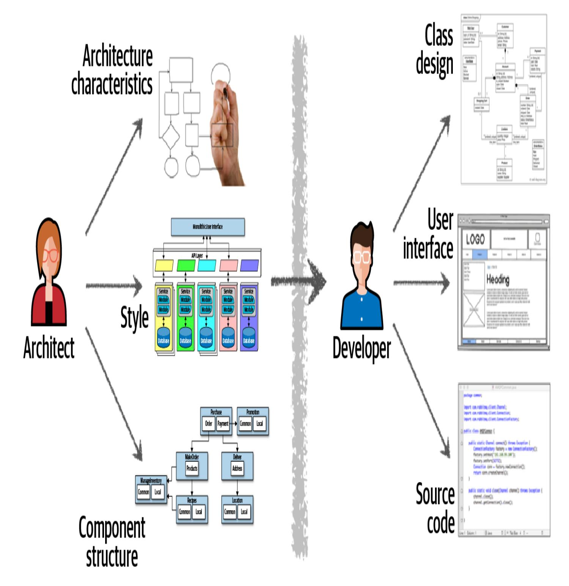
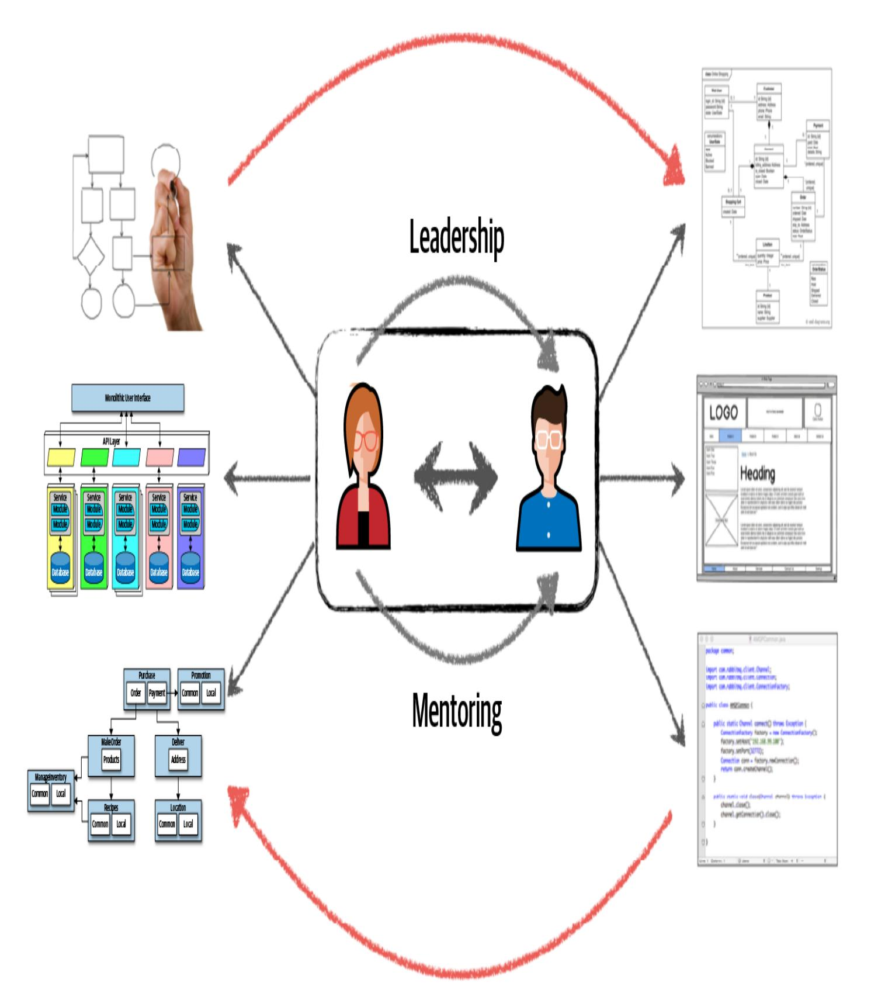
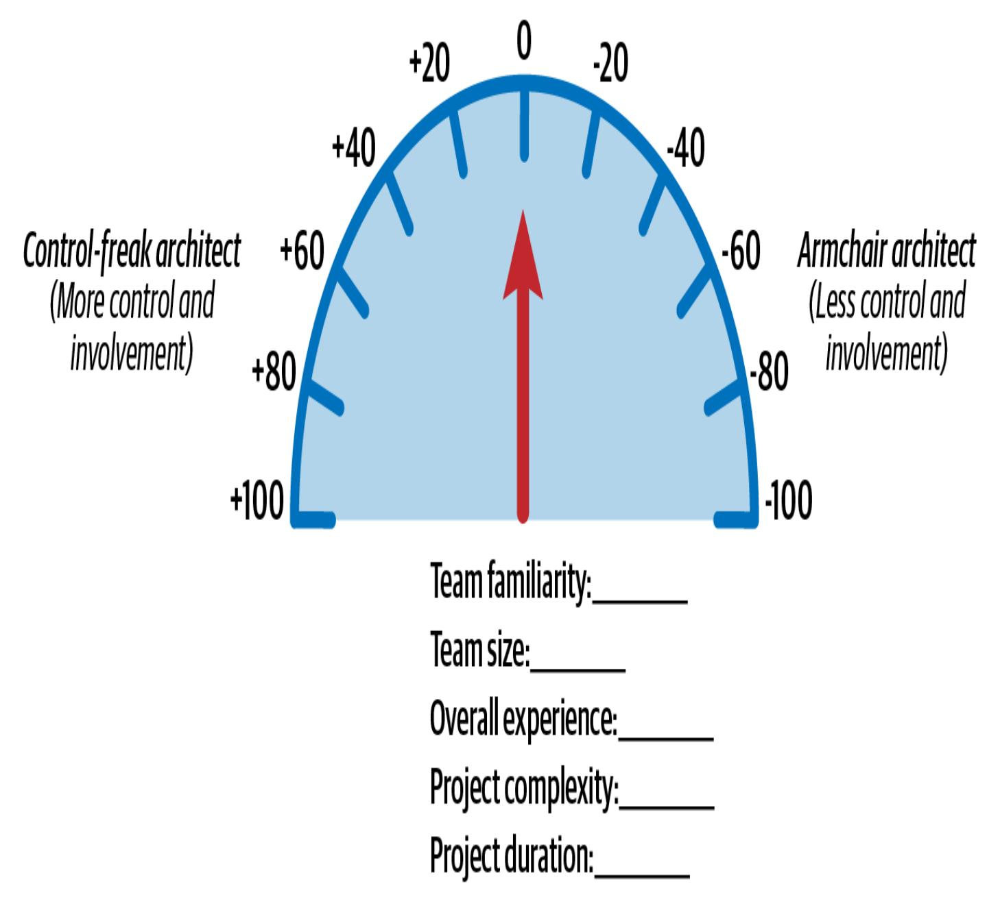
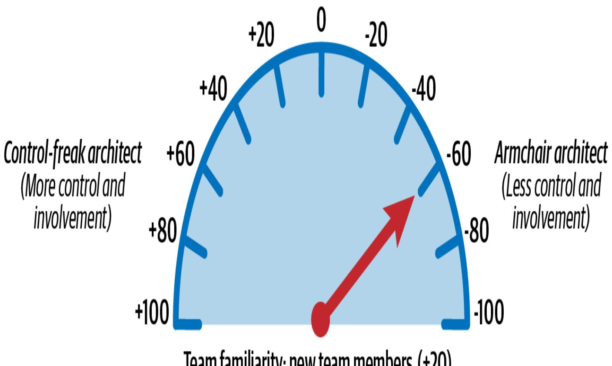
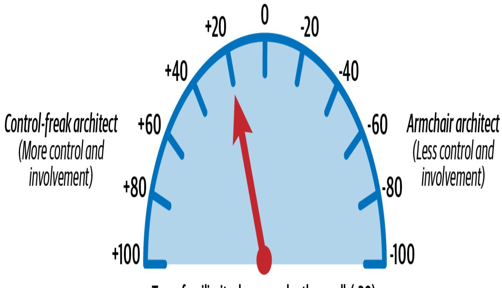
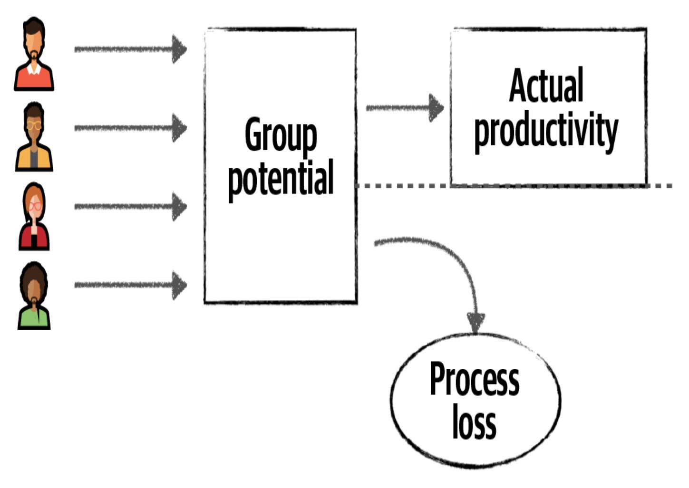
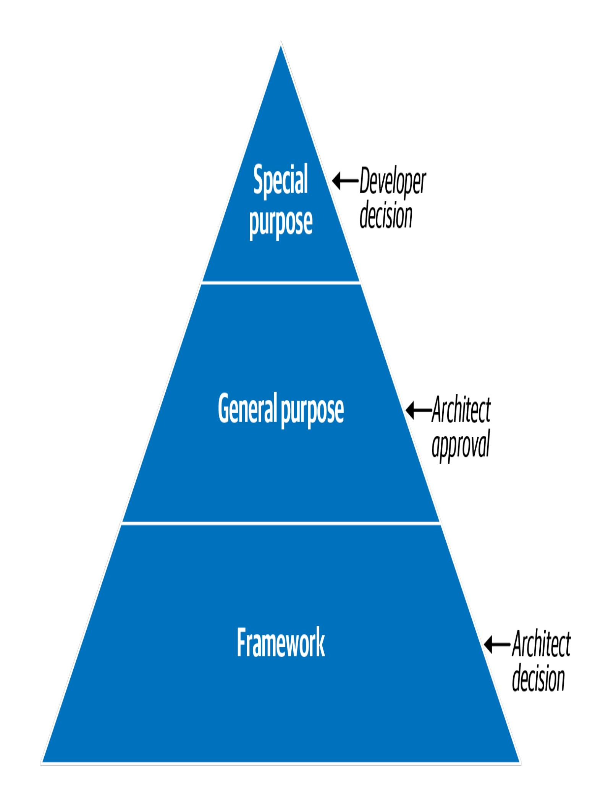

# Kapitel 24. Teams effektiv machen

Diese Arbeit wurde mithilfe von KI übersetzt. Wir freuen uns über dein Feedback und deine Kommentare: [translation-feedback@oreilly.com](mailto:translation-feedback@oreilly.com)

Softwarearchitekten erstellen nicht nur technische Architekturen und treffen Architekturentscheidungen, sondern sind auch dafür verantwortlich, das Entwicklungsteam zu leiten und es bei der Umsetzung der Architektur anzuleiten. Architekten, die dies gut machen, schaffen effektive Entwicklungsteams, die eng zusammenarbeiten, um Probleme zu lösen und erfolgreiche Lösungen zu schaffen. Das mag selbstverständlich klingen, aber wir haben schon zu oft erlebt, dass Architekten ihre Entwicklungsteams ignorieren und eine Architektur allein in einer isolierten Umgebung erstellen. Wenn diese Architektur dann an das Entwicklungsteam weitergegeben wird, haben die Entwickler/innen oft Schwierigkeiten, sie richtig umzusetzen.

Erfolgreiche Softwarearchitekten zeichnen sich dadurch aus, dass sie Teams produktiv machen. In diesem Kapitel stellen wir einige grundlegende Techniken zur Verbesserung der Effektivität von Entwicklungsteams vor.

# Kollaboration

Allzu oft werden in der Softwarebranche Architektur und Entwicklung als völlig getrennte Tätigkeiten behandelt. In [Abbildung](#page-2-0) 24-1 werden die traditionellen Aufgaben von Architekten mit denen von Entwicklern verglichen. Architekten sind für Tätigkeiten wie die Analyse der Geschäftsanforderungen, die Auswahl von Architekturmustern und stilen zur Lösung der Problemdomäne und die Erstellung logischer Komponenten verantwortlich. Das Entwicklungsteam nutzt die Artefakte, die der Architekt während dieser Aktivitäten erstellt, um Klassendiagramme für Komponenten zu erstellen, UI-Bildschirme zu bauen und Quellcode zu schreiben und zu testen.

Abbildung 24-1. Traditionelle Rollen von Architekten und Entwicklern

Das Bild in [Abbildung](#page-2-0) 24-1 veranschaulicht, warum dieser traditionelle Ansatz für die Architektur selten funktioniert. Sieh dir den einseitigen Pfeil an, der durch die virtuellen und physischen Barrieren verläuft, die den Architekten vom Entwickler trennen: Das ist die Ursache aller

Probleme. Die Entscheidungen des Architekten werden nicht immer an das Entwicklungsteam weitergegeben, und wenn das Entwicklungsteam die Architektur ändert, erhält der Architekt selten eine Rückmeldung. Weil der Architekt in diesem Modell so wenig mit dem Entwicklungsteam zu tun hat, erreicht die Architektur selten ihre Ziele.

Der Schlüssel zu einer funktionierenden Architektur liegt darin, die physischen und virtuellen Barrieren zwischen Architekten und Entwicklern abzubauen und stattdessen eine starke bidirektionale Zusammenarbeit zwischen ihnen aufzubauen. Der Architekt und das Entwicklungsteam müssen demselben virtuellen Team angehören, wie in dem in [Abbildung](#page-4-0) 24-2 dargestellten Kooperationsmodell. Dieses Modell erleichtert nicht nur eine starke bidirektionale Kommunikation und Zusammenarbeit, sondern ermöglicht es dem Architekten auch, die Entwickler zu betreuen und zu coachen.

Abbildung 24-2. Architektur durch Zusammenarbeit zum Erfolg führen

Im Gegensatz zu den statischen, starren Wasserfall-Ansätzen der alten Schule ändern und entwickeln sich die heutigen Software-Architekturen mit fast jeder Iteration oder Phase einer Produktentwicklung weiter. Eine enge Zusammenarbeit zwischen dem Architekten und dem Entwicklungsteam ist für den Erfolg unerlässlich.

Im weiteren Verlauf dieses Kapitels und in [Kapitel](#page--1-0) 25 zeigen wir dir Techniken, mit denen du gesunde, bidirektionale und kollaborative Beziehungen aufbauen kannst, die Entwicklungsteams nicht nur effektiver machen, sondern auch robustere und erfolgreichere Architekturen hervorbringen.

# Zwänge und Grenzen

Wir haben die Erfahrung gemacht, dass ein Softwarearchitekt einen großen Einfluss auf den Erfolg oder Misserfolg eines Entwicklungsteams haben kann. Teams, die sich übergangen fühlen oder sich von ihren Architekten entfremdet haben, wissen oft nicht genug über die verschiedenen Einschränkungen des Systems; ohne die richtige Anleitung fällt es ihnen schwer, die Architektur richtig umzusetzen.

Eine der Aufgaben eines Softwarearchitekten ist es, die Vorgaben zu erstellen und zu kommunizieren, innerhalb derer die Entwickler die Architektur umsetzen müssen. Diese Vorgaben bilden einen "Raum", in dem das Entwicklungsteam an der Umsetzung der Architektur arbeitet. Wie [Abbildung](#page-6-0) 24-3 zeigt, wird die erfolgreiche Umsetzung der Architektur durch zu enge oder zu lockere Grenzen direkt behindert.

Abbildung 24-3. Die Grenzen, die ein Softwarearchitekt schafft, beeinflussen die Fähigkeit des Teams, die Architektur umzusetzen

Zu viele Einschränkungen machen den Raum für das Entwicklungsteam zu klein und verhindern, dass sie auf viele der Werkzeuge, Bibliotheken und Praktiken zugreifen können, die sie für die Implementierung des Systems benötigen. Das führt zu Frustration und hat in der Regel zur Folge, dass die Entwickler das Projekt verlassen, um sich einer glücklicheren und gesünderen Umgebung zuzuwenden.

Der umgekehrte Fall kann auch eintreten. Zu lockere Vorgaben (oder gar keine Vorgaben) machen den Raum zu groß. In diesem Fall gibt es zu

viele Wahlmöglichkeiten, die das Entwicklungsteam dazu zwingen, die Rolle des Architekten zu übernehmen und alle wichtigen architektonischen Entscheidungen zu treffen. Ohne die richtige Anleitung müssen die Entwickler/innen zu viele Proofs of Concept durchführen, sich mit Designentscheidungen herumschlagen und werden unproduktiv, verwirrt und frustriert.

Effektive Softwarearchitekten bemühen sich, das richtige Maß an Anleitung und angemessenen Einschränkungen zu geben, damit das Team alles hat, was es braucht. Der Rest dieses Kapitels ist der Frage gewidmet, wie man diese angemessenen Grenzen schafft.

# Architektenpersönlichkeiten

Der Klarheit des Konzepts halber werden wir hier wild verallgemeinern und dir sagen, dass es drei Grundtypen von Architekten gibt: den *kontrollsüchtigen Architekten*, den *Sesselarchitekten* und den *effektiven Architekten*. Kontrollfreaks neigen dazu, enge Grenzen zu ziehen, Sesselarchitekten neigen dazu, lockere Grenzen zu ziehen und effektive Architekten ziehen angemessene Grenzen. In den folgenden Abschnitten werden die Details der einzelnen Architektentypen beschrieben.

## **Der kontrollsüchtige Architekt**

Der kontrollfreudige Architekt versucht, jedes Detail des Softwareentwicklungsprozesses zu kontrollieren. Jede Entscheidung, die sie treffen, ist in der Regel zu feinkörnig und zu niedrigschwellig, was zu engen Grenzen und zu vielen Zwängen für das Entwicklungsteam führt.

Ein kontrollsüchtiger Architekt könnte das Entwicklungsteam zum Beispiel daran hindern, nützliche oder sogar notwendige Open-Source-Bibliotheken oder Bibliotheken von Drittanbietern herunterzuladen, oder strenge Beschränkungen für Namenskonventionen, Klassendesigns, Methodenlängen und so weiter aufstellen. Sie können sogar so weit gehen, dass sie Pseudocode schreiben, den die Entwicklungsteams implementieren müssen, und so den Entwicklern die Kunst des Programmierens wegnehmen. Die Entwickler/innen finden das frustrierend und verlieren oft den Respekt vor dem/der Architekt/in.

Leider ist es sehr leicht, ein kontrollsüchtiger Architekt zu werden, vor allem, wenn du von der Rolle des Softwareentwicklers in die Architektur wechselst. Die Aufgabe des Architekten ist es, die Bausteine der Anwendung (die logischen Komponenten) zu entwerfen und festzulegen, wie sie zusammenwirken. Die Aufgabe der Entwickler besteht darin, mithilfe von Klassendiagrammen und Entwurfsmustern zu bestimmen, wie diese logischen Komponenten am besten implementiert werden können. Neue Architekten, die es gewohnt sind, als Entwickler die Klassendiagramme zu erstellen und die Entwurfsmuster selbst auszuwählen, können dieser Versuchung oft nur schwer widerstehen.

Nehmen wir zum Beispiel an, ein Architekt erstellt eine logische Komponente, die die Referenzdaten innerhalb des Systems verwaltet: Dinge wie die statischen Name-Wert-Paar-Daten, die auf der Website

verwendet werden, Produktcodes und Lagercodes. Die Aufgabe des Architekten besteht darin, die logische Komponente (in diesem Fall Reference Manager ) zu identifizieren, ihren Kernsatz an Operationen festzulegen (z. B. GetData , SetData , ReloadCache und NotifyOnUpdate ) und zu bestimmen, welche anderen Komponenten mit der ReferenceManager interagieren müssen. Ein kontrollfreudiger Architekt könnte denken, dass diese Komponente am besten durch ein paralleles Lademuster implementiert werden kann, das einen internen Cache mit einer bestimmten Datenstruktur nutzt. Das mag ein effektives Design sein, aber es ist nicht das einzige Design und, was noch wichtiger ist, es ist nicht die Aufgabe des Architekten, ein internes Design für die Reference Manager zu entwerfen - das ist die Aufgabe des Entwicklers.

Wie wir in diesem Kapitel besprechen werden, müssen Architekten manchmal die Rolle des Kontrollfreaks spielen, je nach Komplexität des Projekts und dem Kompetenzniveau des Teams. Meistens jedoch stört ein kontrollsüchtiger Architekt das Entwicklungsteam, gibt nicht die richtige Anleitung, steht im Weg und ist als Führungskraft generell ineffektiv.

## **Der Architekt im Sessel**

Der Sesselarchitekt ist ein Architekt, der schon sehr lange nicht mehr programmiert hat (wenn überhaupt) und bei der Erstellung einer Architektur keine Implementierungsdetails berücksichtigt. Sie haben in der Regel keine Verbindung zum Entwicklungsteam und sind nur selten

da, weil sie nach Fertigstellung der ersten Architekturdiagramme einfach zum nächsten Projekt weiterziehen.

Manche Sesselarchitekten sind einfach überfordert: Sie kennen die Technologie oder den Geschäftsbereich nicht gut genug, um eine Führungsrolle oder Anleitung zu geben. Überleg mal: Was machen Entwickler? Sie schreiben natürlich Quellcode. Quellcode zu schreiben ist wirklich schwer zu fälschen; entweder kannst du Quellcode schreiben oder nicht. Was macht ein Architekt? Keiner weiß es! Zeichnen sie viele Linien und Kästchen? Es ist viel zu einfach, das als Architekt/in vorzutäuschen.

Nehmen wir zum Beispiel an, ein Sesselarchitekt, der ein Aktienhandelssystem entwirft, ist damit völlig überfordert. Sein Architekturdiagramm enthält vielleicht nur zwei Kästchen: eines für das Handelssystem und eines für das System zur Einhaltung der Handelsregeln, mit dem es kommuniziert. An dieser Architektur ist nichts *auszusetzen* - sie ist nur zu komplex, um für irgendjemanden von Nutzen zu sein.

Sesselarchitekten schaffen lockere Grenzen um ihre Entwicklungsteams, so dass diese Teams am Ende die Arbeit machen, die eigentlich der Architekt machen sollte. Darunter leiden Geschwindigkeit und Produktivität, und alle sind verwirrt darüber, wie das System funktionieren soll.

Es ist genauso leicht, ein Sesselarchitekt zu werden, wie ein Kontrollfreak zu werden. Wenn ein Architekt feststellt, dass er keine Zeit für die Entwicklungsteams hat, die die Architektur umsetzen (oder einfach keine Zeit mit ihnen verbringt), ist das ein Anzeichen dafür, dass er zum Sesselarchitekten wird. Die Entwicklungsteams brauchen die Unterstützung und Anleitung eines Architekten, und sie brauchen den Architekten, um Fragen zu beantworten. Andere Anzeichen für einen Sesselarchitekten sind die folgenden:

- Unvollständiges Verständnis des Geschäftsbereichs, des Geschäftsproblems oder der verwendeten Technologie
- Nicht genug praktische Erfahrung in der Softwareentwicklung
- Nichtberücksichtigung der Auswirkungen, die mit einer bestimmten Umsetzung der Architekturlösung verbunden sind (z. B. Komplexität, Wartung und Tests)

Die wenigsten Architekten haben die *Absicht*, zu Sesselarchitekten zu werden; es "passiert" einfach, wenn sie sich zu sehr zwischen Projekten oder Teams aufteilen und den Kontakt zur Technologie oder zum Geschäftsfeld verlieren. Um dies zu vermeiden, empfehlen wir, sich mehr mit den Technologien des Projekts zu befassen und ein besseres Verständnis für das Geschäftsproblem und den Bereich zu entwickeln.

## **Der wirksame Architekt**

Ein *effektiver* Softwarearchitekt schafft angemessene Einschränkungen und Grenzen, sorgt dafür, dass die Teammitglieder gut zusammenarbeiten, und gibt ihnen die richtige Anleitung. Er sorgt auch dafür, dass das Team über die richtigen Werkzeuge und Technologien

verfügt und beseitigt alle anderen Hindernisse, die das Entwicklungsteam von seinen Zielen abhalten.

Das klingt zwar offensichtlich und einfach, ist es aber nicht. Es ist eine Kunst, sowohl eine effektive *Führungskraft* als auch ein effektiver Softwarearchitekt zu sein. Dazu muss man eng mit dem Entwicklungsteam zusammenarbeiten und sich dessen Respekt verschaffen. In den folgenden Abschnitten zeigen wir dir einige Techniken, mit denen du bestimmen kannst, wie stark ein Architekt in ein Entwicklungsteam eingebunden werden sollte.

# Wie viel Engagement?

Um ein effektiver Architekt zu werden, muss man wissen, wie stark man sich in ein bestimmtes Entwicklungsteam einbringt - und wann man ihm aus dem Weg geht. Dieses Konzept, das als Elastic [Leadership](https://elasticleadership.com/) bekannt ist, wird vom Autor und Berater Roy Osherove propagiert. Wir werden ein wenig von Osheroves Arbeit in diesem Bereich abweichen und uns auf Faktoren konzentrieren, die spezifisch für die Führung von Software-Architekturen sind.

Zu wissen, wie stark du dich in ein Entwicklungsteam einbringst, kann eine Herausforderung sein. Das gilt auch für die Frage, wie viele Teams oder Projekte du gleichzeitig leiten kannst. Hier sind fünf wichtige Faktoren, die du berücksichtigen solltest:

*Vertrautheit im Team*

Wie gut kennen sich die Teammitglieder untereinander? Haben sie schon einmal zusammengearbeitet? Je besser sich die Teammitglieder untereinander kennen, desto besser können sie sich selbst organisieren und desto weniger brauchen sie den Architekten. Umgekehrt gilt: Je neuer die Teammitglieder sind, desto mehr brauchen sie den Architekten, um die Zusammenarbeit zu erleichtern und Cliquen abzubauen.

## *Teamgröße*

Wir betrachten mehr als ein Team mit 12 Entwicklern als ein großes Team und eines mit 5 oder weniger als ein kleines Team. Je größer das Team, desto mehr wird der Architekt gebraucht. Wir besprechen dieses Thema ausführlicher in ["Warnzeichen](#page-23-0) für Teams".

#### *Allgemeine Erfahrung*

Wie ist die Zusammensetzung des Teams aus erfahrenen und unerfahrenen Entwicklern? Wie gut kennen sich die Teammitglieder mit der Technologie und dem Geschäftsfeld aus? (Wenn die Geschäftsdomäne besonders komplex ist, solltest du die technologische Erfahrung der Teammitglieder getrennt von ihrer Erfahrung in der Geschäftsdomäne bewerten). Teams mit vielen jüngeren Entwicklern benötigen eine stärkere Einbindung und Betreuung durch den Architekten und mehr Mentoring. In Teams mit erfahrenen Entwicklern kann der Architekt eher als Vermittler denn als Mentor fungieren.

### *Projektkomplexität*

Bei hochkomplexen Projekten muss der Architekt mehr zur Verfügung stehen, um bei Problemen zu helfen, während bei relativ einfachen, überschaubaren Projekten weniger Engagement erforderlich ist.

### *Projektdauer*

Ist das Projekt kurz (z.B. zwei Monate), lang (zwei Jahre) oder von durchschnittlicher Dauer (etwa sechs Monate)? Je länger das Projekt dauert, desto mehr muss der Architekt einbezogen werden.

Während die meisten dieser Faktoren offensichtlich erscheinen, ist die Projektdauer manchmal verwirrend. Wie wir bereits angedeutet haben, gilt: Je kürzer die Projektdauer, desto weniger Engagement ist nötig; je länger das Projekt, desto mehr Engagement ist nötig. Erscheint dir das widersinnig? Betrachte ein schnelles zweimonatiges Projekt. Zwei Monate sind nicht viel Zeit, um die Anforderungen zu qualifizieren, zu experimentieren, den Code zu entwickeln, alle Szenarien zu testen und in Produktion zu geben. In diesem Fall sollte sich der Architekt eher wie ein Sesselarchitekt verhalten; das Entwicklungsteam hat bereits einen ausgeprägten Sinn für Dringlichkeit, und ein kontrollsüchtiger Architekt würde nur im Weg stehen und das Projekt verzögern. Stell dir ein zweijähriges Projekt vor: Die Entwickler sind entspannter und haben kein Gefühl der Dringlichkeit. Sie planen wahrscheinlich ihren Urlaub und machen lange Mittagspausen. Bei Projekten mit längerer Laufzeit wird der Architekt also gebraucht, um sicherzustellen, dass das Projekt im Zeitplan vorankommt und dass das Team die komplexesten Aufgaben zuerst erledigt.

Um zu veranschaulichen, wie diese Faktoren zur Bestimmung eines angemessenen Maßes an Engagement genutzt werden können, gehen wir von einer festen Skala von 20 Punkten für jeden Faktor aus, wie in [Abbildung](#page-16-0) 24-4 dargestellt. Die Seite der Skala mit negativen Werten steht für ein geringeres Engagement und endet mit dem Extrem des Sesselarchitekten. Die positiven Werte bedeuten mehr Engagement und enden im Extrem des kontrollsüchtigen Architekten.

Abbildung 24-4. Skala zur Messung des Umfangs der Beteiligung von Architekten an Entwicklungsteams

Diese Skala ist natürlich nicht exakt, aber sie hilft dabei, den Umfang der Beteiligung des Architekten am Entwicklungsteam zu bestimmen. Betrachte zum Beispiel das Projektszenario 1, das in [Tabelle](#page-18-0) 24-1 und [Abbildung](#page-19-0) 24-5 dargestellt ist. Die Werte für die einzelnen Faktoren in der Tabelle verschieben die "Nadel" in Richtung der beiden Extreme: +20 für einen Faktor, der eine stärkere Beteiligung anzeigt, -20 für einen, der

eine geringere Beteiligung anzeigt. Die Faktorwerte für Szenario 1 belaufen sich auf insgesamt -60, was bedeutet, dass der Architekt seine Beteiligung an den täglichen Interaktionen einschränken sollte, indem er das Team unterstützt, ihm aber nicht im Weg steht. Sie werden gebraucht, um Fragen zu beantworten und sicherzustellen, dass das Team auf dem richtigen Weg ist, aber größtenteils sollte sich der Architekt zurückhalten und das erfahrene Team das tun lassen, was es am besten kann - Software schnell entwickeln.

Tabelle 24-1. Szenario 1 Beispiel für den Umfang der Beteiligung

| Faktor                     | Wert                       | Bewertung | Persönlich             |
|----------------------------|----------------------------|-----------|------------------------|
| Vertrautheit im Team | Neue Teammitglieder     | +20       | Kontrollfre            |
| Teamgröße                  | Klein (4 Mitglieder) | -20       | Lehnstuhl Architekt |
| Allgemeine Erfahrung    | Alle erfahrenen         | -20       | Lehnstuhl Architekt |
| Projektkomplexität         | Relativ einfach         | -20       | Lehnstuhl Architekt |
| Projektdauer               | 2 Monate                | -20       | Lehnstuhl Architekt |
|                            |                            |           |                        |
| Kumulierte Punktzahl    |                            | -60       | Lehnstuhl Architekt |

Abbildung 24-5. Umfang der Beteiligung für Szenario 1

Betrachten wir nun Szenario 2, das in [Tabelle](#page-21-0) 24-2 beschrieben und in [Abbildung](#page-22-0) 24-6 dargestellt ist: Die Teammitglieder kennen sich gut, aber das Team ist groß (12 Teammitglieder) und besteht hauptsächlich aus Nachwuchsentwicklern. Das Projekt ist relativ komplex und hat eine Dauer von sechs Monaten. In diesem Fall beläuft sich die Gesamtpunktzahl auf +20, was bedeutet, dass der effektive Architekt eine Mentoren- und Coaching-Rolle einnehmen und ziemlich stark in die

täglichen Aktivitäten eingebunden sein sollte, aber nicht so sehr, dass er das Team stört.

Tabelle 24-2. Beispiel für Szenario 2 zum Umfang der Beteiligung

| Faktor                     | Wert                       | Bewertung | Persönlichkei          |
|----------------------------|----------------------------|-----------|------------------------|
| Vertrautheit im Team | Einander gut kennen  | -20       | Lehnstuhl Architekt |
| Teamgröße                  | Groß (12 Mitglieder) | +20       | Kontrollfreak          |
| Allgemeine Erfahrung    | Meistens Junior         | +20       | Kontrollfreak          |
| Projektkomplexität         | Hohe Komplexität        | +20       | Kontrollfreak          |
| Projektdauer               | 6 Monate                | -20       | Lehnstuhl Architekt |
|                            |                            |           |                        |
| Kumulierte Punktzahl    |                            | +20       | Kontrollfreak          |

Abbildung 24-6. Umfang der Beteiligung für Szenario 2

Architekten nutzen diese Faktoren zu Beginn eines Projekts, um zu bestimmen, wie stark sie sich einbringen wollen, aber im Laufe des Projekts ändert sich in der Regel der Grad ihrer Beteiligung. Wir empfehlen daher, diese Faktoren während des gesamten Lebenszyklus des Projekts kontinuierlich zu analysieren.

Es ist schwierig, diese Faktoren zu objektivieren, da einige (wie z. B. die Gesamterfahrung des Teams) wichtiger sein können als andere. In diesen Fällen können die Kennzahlen leicht gewichtet oder an die jeweilige Situation angepasst werden.

Die wichtigste Botschaft ist, dass der angemessene Umfang der Beteiligung von Architekten in einem Entwicklungsteam von diesen fünf Faktoren abhängt. Indem sie anhand dieser Faktoren den Grad ihrer Beteiligung abschätzen, können Architekten die richtigen Grenzen ziehen und die richtige Größe des "Raums" für das Team schaffen.

# Team-Warnzeichen

Wir haben die Teamgröße als einen der fünf Faktoren erwähnt, die einem Architekten dabei helfen, den Grad seiner Beteiligung an einem Entwicklungsteam zu bestimmen: Je größer ein Team ist, desto mehr ist die Beteiligung des Architekten erforderlich; je kleiner das Team, desto weniger ist die Beteiligung erforderlich. Aber was macht ein "großes Team" aus? In diesem Abschnitt sehen wir uns drei Faktoren an, anhand derer ein Architekt feststellen kann, ob das Team zu groß und damit nicht so effektiv ist, wie es sein könnte.

## **Prozessverlust**

Der Begriff *Prozessverlust* wurde von Fred Brooks in seinem Buch *The Mythical Man-Month* (Addison-Wesley, 1995) geprägt. Der Grundgedanke des Prozessverlustes, auch bekannt als [Brooks'](https://oreil.ly/rZt88) Gesetz, ist, dass *ein*

*Projekt umso mehr Zeit in Anspruch nimmt, je mehr Personen daran beteiligt sind*. Wie [Abbildung](#page-24-0) 24-7 zeigt, wird das *Gruppenpotenzial* durch die kollektiven Anstrengungen aller Teammitglieder bestimmt. Brooks sagt jedoch, dass die *tatsächliche* Produktivität eines Teams immer geringer ist als seine *potenzielle* Produktivität; die Differenz wird als *Prozessverlust* des Teams bezeichnet.

Abbildung 24-7. Das Brooks'sche Gesetz besagt, dass die Größe eines Teams seine tatsächliche Produktivität beeinflusst

Prozessverlust ist ein guter Faktor, um die richtige Teamgröße für ein bestimmtes Projekt zu bestimmen, und ein effektiver Softwarearchitekt beobachtet das Entwicklungsteam, um nach Anzeichen für Prozessverlust zu suchen. Wenn die Teammitglieder zum Beispiel häufig in Konflikte geraten, wenn sie Code in ein Repository einspeisen, ist das ein Hinweis darauf, dass sie am selben Code arbeiten und sich möglicherweise gegenseitig im Weg stehen.

Um Prozessverluste zu vermeiden, empfehlen wir, nach Bereichen der Parallelität zu suchen und Teammitglieder an getrennten Diensten oder Bereichen der Anwendung arbeiten zu lassen. Immer wenn ein Projektmanager vorschlägt, ein neues Teammitglied in ein Projekt aufzunehmen, sucht ein guter Architekt nach Möglichkeiten, parallele Arbeitsabläufe zu schaffen. Wenn er keine findet, weist er den Projektleiter darauf hin, dass sich eine neue Person negativ auf das Team auswirken könnte.

## **Pluralistische Ignoranz**

*Von pluralistischer Ignoranz* spricht man, wenn alle eine Norm insgeheim ablehnen, ihr aber zustimmen, weil sie glauben, etwas Offensichtliches zu übersehen. Nehmen wir zum Beispiel an, die Mehrheit eines großen Teams ist sich einig, dass der Austausch von Nachrichten zwischen zwei Remote-Diensten die beste Lösung ist. Eine Person hält das für eine dumme Idee, weil eine sichere Firewall zwischen den beiden Diensten steht. Diese Person stimmt jedoch öffentlich mit allen anderen der Verwendung von Messaging zu. Obwohl sie die Idee insgeheim ablehnt, hat sie Angst, etwas Offensichtliches zu übersehen, wenn sie sich äußert. Je größer die Gruppe ist, desto weniger sind die Leute bereit, andere zur Rede zu stellen. In einem kleineren Team hätten sie sich vielleicht zu Wort gemeldet, um die ursprüngliche

Lösung in Frage zu stellen, was das Team dazu veranlasst hätte, ein anderes Protokoll (z. B. REST) für eine bessere Lösung zu wählen.

Das Konzept der pluralistischen Ignoranz wurde durch das dänische Kindermärchen "Des Kaisers neue [Kleider"](https://oreil.ly/ROvce) von Hans Christian Andersen bekannt. In der Geschichte überzeugen zwei Betrüger, die sich als Schneider ausgeben, den König davon, dass die neuen Kleider, die sie für ihn "genäht" haben, für jeden unsichtbar sind, der nicht würdig ist, sie zu sehen. Der König, der die Kleider nicht sehen kann, aber nicht zugeben will, dass er selbst unwürdig ist, stolziert völlig nackt herum und fragt alle seine Untertanen, wie ihnen seine neuen Kleider gefallen. Die Untertanen, die Angst haben, für unwürdig gehalten zu werden, versichern dem König, dass seine neuen Kleider das Beste sind, was es je gab. Diese Verrücktheit geht weiter, bis ein Kind dem König schließlich zuruft, dass er überhaupt keine Kleidung trägt.

Ein effektiver Softwarearchitekt beobachtet während der Besprechungen die Mimik und Körpersprache seiner Gesprächspartner und achtet darauf, ob einige ihre Skepsis aus pluralistischer Unwissenheit verbergen. Wenn der Architekt dies bemerkt, agiert er als Vermittler - vielleicht unterbricht er einen Skeptiker, um ihn zu fragen, was er von der vorgeschlagenen Lösung hält, und er unterstützt ihn, wenn er sich zu Wort meldet, auch wenn die Person im Unrecht ist. Es geht darum, dass der Architekt als Vermittler dafür sorgt, dass sich jeder sicher genug fühlt, um seine Meinung zu sagen.

Der dritte Faktor, der auf eine angemessene Teamgröße hinweist, ist die *Verteilung der Verantwortung*. Wenn Teams größer werden, wirkt sich

das Wachstum negativ auf die Kommunikation aus. Wenn die Teammitglieder nicht mehr wissen, wer wofür zuständig ist und Dinge unter den Tisch fallen gelassen werden, ist das ein gutes Zeichen dafür, dass das Team zu groß ist.

[Abbildung](#page-28-0) 24-8 zeigt jemanden, der neben einem liegengebliebenen Auto am Rande einer Landstraße steht. Wie viele Leute würden in diesem Szenario wohl anhalten und den Autofahrer fragen, ob alles in Ordnung ist? Da es sich um eine kleine Straße in einer kleinen Gemeinde handelt, wird vielleicht jeder, der vorbeikommt, anhalten. Aber was ist, wenn derselbe Autofahrer am Rande einer viel befahrenen Autobahn in einer großen Stadt festsitzt? Tausende von Autos könnten einfach vorbeifahren, ohne dass jemand anhält und fragt, ob alles in Ordnung ist. Das ist ein gutes Beispiel für die Streuung der Verantwortung. Da die Städte immer belebter und voller werden, gehen die Menschen davon aus, dass der Autofahrer bereits um Hilfe gerufen hat oder dass ein anderes Mitglied der Menge, das Zeuge des Ereignisses wird, helfen wird. In den meisten dieser Fälle ist jedoch keine Hilfe unterwegs und der Autofahrer sitzt mit einem toten oder vergessenen Handy fest.

Abbildung 24-8. Streuung der Verantwortung

Ein effektiver Architekt leitet das Entwicklungsteam nicht nur bei der Umsetzung der Architektur an, sondern sorgt auch dafür, dass seine Mitglieder gesund und glücklich sind und zusammenarbeiten, um ein gemeinsames Ziel zu erreichen. Wenn du auf diese drei Warnzeichen achtest und dabei hilfst, die Probleme, auf die sie hinweisen, zu beheben, ist das ein guter Weg, um ein effektives Entwicklungsteam zu gewährleisten.

# Checklisten nutzen

Airline-Piloten benutzen Checklisten auf jedem Flug. Selbst die erfahrensten und routiniertesten Piloten haben Checklisten für Start, Landung und tausende andere Situationen - sowohl für gewöhnliche als auch für ungewöhnliche Kantenfälle. Sie verwenden Checklisten, weil eine einzige fehlende Einstellung oder Prozedur (z.B. wenn du vergisst, die Klappen vor dem Start auf 10 Grad zu stellen) den Unterschied zwischen einem sicheren Flug und einer Katastrophe ausmachen kann.

In Dr. Atul Gawandes hervorragendem Buch *The Checklist [Manifesto](https://oreil.ly/XNcV9)* (Picador, 2011) beschreibt er die Macht von Checklisten, um chirurgische Eingriffe sicherer zu machen. Aufgeschreckt durch die hohe Rate an Staphylokokkeninfektionen in Krankenhäusern, entwickelte Dr. Gawande chirurgische Checklisten. Die Infektionsraten in Krankenhäusern, die die Checklisten verwendeten, sanken fast auf Null, während die Raten in Kontrollkrankenhäusern, die die Checklisten nicht verwendeten, weiter anstiegen.

Checklisten funktionieren. Sie sind ein hervorragendes Mittel, um sicherzustellen, dass jede Aufgabe abgedeckt und erledigt wird. Warum werden sie dann nicht auch in der Softwareentwicklung eingesetzt? Wir haben viele Jahre in dieser Branche gearbeitet und sind fest davon überzeugt, dass Checklisten einen großen Unterschied in der Effektivität von Entwicklungsteams ausmachen. Natürlich geht es bei den meisten Softwareentwicklern nicht um lebenswichtige Dinge wie das Fliegen eines Flugzeugs oder eine Operation am offenen Herzen. Mit anderen Worten: Softwareentwickler brauchen nicht für alles eine Checkliste. Der Schlüssel liegt darin, zu wissen, wann sie eingesetzt werden sollten und wann nicht.

[Abbildung](#page-31-0) 24-9 ist keine Checkliste - es handelt sich um eine Reihe von Verfahrensschritten zum Erstellen einer neuen Datenbanktabelle, daher sollte sie nicht in Form einer Checkliste dargestellt werden. Einige der Aufgaben sind von anderen abhängig, z. B. kann die Datenbanktabelle nicht überprüft werden, wenn das Formular noch nicht eingereicht wurde. Jeder Prozess mit einem Verfahrensablauf von abhängigen Aufgaben sollte nicht in einer Checkliste stehen. Auch einfache, vertraute Prozesse, die häufig und fehlerfrei ausgeführt werden, sollten nicht in eine Checkliste aufgenommen werden.

| Done | Task description                                |
|------|-------------------------------------------------|
|      | Determine database column field names and types |
|      | Fill out database table request form            |
|      | Obtain permission for new database table        |
|      | Submit request form to database group           |
|      | Verify table once created                       |

Abbildung 24-9. Beispiel für eine schlechte Checkliste

Gute Kandidaten für Checklisten sind Prozesse, die keine festgelegte Reihenfolge oder abhängige Aufgaben haben, sowie solche, bei denen häufig Schritte übersprungen oder Fehler gemacht werden. Übertreibe es nicht und mach nicht alles zu einer Checkliste. Das tun Architekten oft, wenn sie feststellen, dass Checklisten Entwicklungsteams tatsächlich effektiver machen. Sie laufen Gefahr, sich auf das so genannte *Gesetz des [abnehmenden](https://oreil.ly/px1g3) Ertrags* zu berufen. Je mehr Checklisten der Architekt erstellt, desto unwahrscheinlicher ist es, dass die Entwickler sie benutzen. Es ist außerdem ratsam, die Checklisten so klein wie möglich zu halten und trotzdem alle notwendigen Schritte zu erfassen. Entwickler/innen werden sich in der Regel nicht an zu lange Checklisten

halten. Wenn eine der aufgelisteten Aufgaben automatisiert werden kann, solltest du sie automatisieren und aus der Checkliste streichen.

#### **HINW EIS**

Mach dir keine Gedanken darüber, das Offensichtliche in einer Checkliste zu erwähnen. Das Offensichtliche ist das, was normalerweise übersehen wird.

Drei der Checklisten, die wir als besonders hilfreich empfunden haben, betreffen die Vervollständigung des Entwicklercodes, Unit- und Funktionstests und Software-Releases. Jede Checkliste wird in den folgenden Abschnitten behandelt.

#### **DER HAWTHORNE-EFFEKT**

Das Schwierigste bei der Einführung von Checklisten in einem Entwicklungsteam ist es, die Entwickler/innen dazu zu bringen, sie tatsächlich zu benutzen. Es kommt nur allzu oft vor, dass Entwickler/innen keine Zeit mehr haben und einfach alle Punkte auf einer Checkliste abhaken, ohne die Aufgaben tatsächlich auszuführen.

Eine Möglichkeit, dieses Problem anzugehen, ist, mit dem Team über den Unterschied zu sprechen, den die Verwendung von Checklisten ausmachen kann, und sie das Buch *The Checklist Manifesto* von Atul Gawande lesen zu lassen. Stelle sicher, dass jedes Teammitglied die Gründe für jede Checkliste versteht. Überlege dir, ob sie gemeinsam entscheiden sollen, welche Abläufe auf einer Checkliste stehen sollen und welche nicht - das schafft ein Gefühl der Verantwortung.

Wenn alles andere fehlschlägt, gibt es den *[Hawthorne-Effekt](https://oreil.ly/caGH_)*: Menschen, die wissen, dass sie beobachtet oder überwacht werden, neigen dazu, ihr Verhalten zu ändern, in der Regel, um das Richtige zu tun. Dieser Effekt erfordert weniger eine tatsächliche Überwachung als vielmehr eine Wahrnehmung. Viele Arbeitgeber bringen zum Beispiel nicht funktionierende Kameras in gut sichtbaren Bereichen an, während andere eine Website-Überwachungssoftware installieren, die sie nur selten überprüfen. (Wie viele dieser Berichte werden von den Führungskräften tatsächlich eingesehen?)

Um den Hawthorne-Effekt für Checklisten zu nutzen, solltest du das Team wissen lassen, dass alle Checklisten überprüft werden, um

sicherzustellen, dass die Aufgabe tatsächlich erledigt wurde, da die Verwendung von Checklisten entscheidend für die Produktivität des Teams ist. In Wirklichkeit sind nur gelegentliche Stichproben nötig; die Wahrscheinlichkeit, dass die Entwickler/innen Aufgaben auslassen oder fälschlicherweise als erledigt markieren, ist dann viel geringer.

## **Checkliste für Entwickler zur Vervollständigung des Codes**

Die Checkliste für die Fertigstellung des Codes ist ein nützliches Instrument, vor allem wenn ein Entwickler sagt, dass er mit dem Code "fertig" ist. Sie ist auch nützlich, um eine "Definition von fertig" zu finden: Wenn alles in der Checkliste vollständig ist, kann der Entwickler sagen, dass er mit dem Code, an dem er gearbeitet hat, tatsächlich fertig ist.

Hier sind einige Dinge, die in eine Checkliste für die Fertigstellung des Codes aufgenommen werden sollten:

- Kodierungs- und Formatierungsstandards, die nicht in automatischen Tools enthalten sind
- Häufig übersehene Punkte (wie z. B. absorbierte Ausnahmen)
- Projektspezifische Standards
- Besondere Teamanweisungen oder Verfahren

[Abbildung](#page-35-0) 24-10 zeigt eine Beispiel-Checkliste für die Fertigstellung von Entwickler-Code. Es gibt hier einige offensichtliche Aufgaben wie

"Codebereinigung und -formatierung durchführen" und "Sicherstellen, dass es keine absorbierten Ausnahmen gibt". Wie oft vergessen Entwickler in der Eile, die Codebereinigung und -formatierung in der IDE auszuführen? Ziemlich oft. In *The Checklist Manifesto* stellt Gawande das gleiche Phänomen bei chirurgischen Eingriffen fest - die offensichtlichen Aufgaben werden oft übersehen.

| Done | Task description                                         |
|------|----------------------------------------------------------|
|      | Run code cleanup and code formatting                     |
|      | Execute custom source validation tool                    |
|      | Verify the audit log is written for all updates          |
|      | Make sure there are no absorbed exceptions               |
|      | Check for hardcoded values and convert to constants      |
|      | Verify that only public methods are calling setFailure() |
|      | Include @ServiceEntrypoint on service API class          |

Der Architekt sollte die Checkliste immer daraufhin überprüfen, ob bestimmte Punkte automatisiert oder als Plug-ins für einen Code-Validierungs-Checker geschrieben werden können. Die projektspezifischen Aufgaben in der Checkliste (z. B. das Ausführen des benutzerdefinierten Validators, das Überprüfen des Audit-Logs, das Aufrufen der Methode setFailure() und das Einfügen der Annotation @ServiceEntrypoint ) sind zwar gut in einer Checkliste aufgehoben, aber einige davon könnten automatisiert werden. Während eine automatisierte Prüfung für " @ServiceEntrypoint in die Service-API-Klasse einbinden" vielleicht nicht machbar ist, würde sie für "Überprüfen, dass nur öffentliche Methoden setFailure() aufrufen" funktionieren - eine einfache Prüfung, die mit jedem Code-Crawling-Tool automatisiert werden kann. Die Prüfung auf automatisierbare Bereiche verkürzt den Umfang der Checkliste und verbessert das Verhältnis von Signal und Rauschen.

## **Checkliste für Unit- und Funktionstests**

Eine der besten Checklisten ist vielleicht die für Unit- und Funktionstests. Diese Checkliste enthält einige der ungewöhnlicheren Fälle und Kanten, die Softwareentwickler oft vergessen zu testen. Wenn jemand aus der Qualitätssicherung ein Codeproblem aufgrund eines bestimmten Testfalls findet, füge diesen Testfall zu dieser Checkliste hinzu.

Diese Checkliste ist normalerweise eine der längsten, da sie alle Arten von Tests umfasst, die gegen den Code durchgeführt werden können. Sie soll sicherstellen, dass die Tests so vollständig wie möglich sind, damit

der Code, wenn der Entwickler mit der Checkliste fertig ist, auch wirklich produktionsreif ist.

Hier sind einige Punkte, die in einer typischen Checkliste für Unit- und Funktionstests enthalten sind:

- Sonderzeichen in Text- und Zahlenfeldern
- Minimale und maximale Wertebereiche
- Ungewöhnliche und extreme Testfälle
- Fehlende Felder

Wie bei der Checkliste für die Fertigstellung des Codes durch den Entwickler sollten alle Punkte, die als automatisierte Tests geschrieben werden können oder bereits in der automatisierten Testsuite enthalten sind, von der Checkliste entfernt und automatisiert werden.

Entwickler/innen wissen manchmal nicht, wo sie anfangen sollen, wenn sie Unit-Tests schreiben oder wie viele sie schreiben sollen. Mit dieser Checkliste kannst du sicherstellen, dass allgemeine und spezifische Testszenarien in den Entwicklungsprozess einbezogen werden. In Unternehmen, in denen Tests und Entwicklung von getrennten Teams durchgeführt werden, hilft diese Checkliste, die Lücke zu schließen. Je mehr Entwicklungsteams vollständige Tests durchführen, desto leichter wird die Arbeit der Testteams, die sich dann auf die Geschäftsszenarien konzentrieren können, die nicht in den Checklisten enthalten sind.

## **Software-Release-Checkliste**

Die Freigabe von Software für die Produktion ist vielleicht einer der fehleranfälligsten Punkte im Lebenszyklus der Softwareentwicklung und eignet sich daher hervorragend für eine Checkliste. Diese Checkliste hilft, fehlgeschlagene Builds und Implementierungen zu vermeiden und das Risiko bei der Freigabe von Software deutlich zu verringern.

Die Software-Release-Checkliste ist in der Regel die volatilste der hier vorgestellten Checklisten, denn sie ändert sich jedes Mal, wenn ein Einsatz fehlschlägt oder Probleme auftauchen, um neue Fehler und veränderte Umstände zu berücksichtigen.

Die Software-Release-Checkliste umfasst in der Regel Folgendes:

- Konfigurationsänderungen in Servern oder externen Konfigurationsservern
- Dem Projekt hinzugefügte Bibliotheken von Drittanbietern (JAR, DLL, etc.)
- Datenbank-Updates und entsprechende Datenbank-Migrationsskripte

Jedes Mal, wenn ein Build oder eine Bereitstellung fehlschlägt, sollte der Architekt die Ursache des Fehlschlags analysieren und einen entsprechenden Eintrag in die Software-Release-Checkliste aufnehmen. Auf diese Weise wird der Eintrag beim nächsten Build oder Deployment überprüft und verhindert, dass das Problem erneut auftritt.

# Anleitung geben

Eine andere Möglichkeit, wie Softwarearchitekten Teams effektiv machen können, ist die Verwendung von Designprinzipien als Anleitung. Das hilft auch dabei, den "Raum" zu schaffen, in dem die Entwickler an der Umsetzung der Architektur arbeiten. Die Vermittlung von Entwurfsprinzipien ist einer der Schlüssel zum Erfolg eines Teams.

Um diesen Punkt zu verdeutlichen, stell dir vor, du leitest ein Entwicklungsteam bei der Verwendung des sogenannten *Layered Stack an - der*Sammlung von Bibliotheken von Drittanbietern, aus denen die Anwendung besteht. Entwicklungsteams haben in der Regel viele Fragen zum Layered Stack, z. B. welche Bibliotheken in Ordnung sind und welche nicht, und ob oder wann sie ihre eigenen Entscheidungen über Bibliotheken treffen können.

Du könntest damit beginnen, die Entwickler/innen die folgenden Fragen zu einer Bibliothek beantworten zu lassen, die sie verwenden möchten:

- Gibt es Überschneidungen zwischen der vorgeschlagenen Bibliothek und den bestehenden Funktionen des Systems?
- Was ist der Grund für die Nutzung der vorgeschlagenen Bibliothek?

Die erste Frage leitet die Entwickler dazu an, zu prüfen, ob die von der neuen Bibliothek bereitgestellte Funktionalität durch eine bestehende Bibliothek oder eine bestehende Funktionalität erfüllt werden kann. Wenn Entwickler diese Aufgabe ignorieren (was manchmal vorkommt), können sie am Ende viele doppelte Funktionen erstellen, besonders in großen Projekten und Teams.

Mit der zweiten Frage wird der Entwickler aufgefordert, sich zu fragen, ob die neue Bibliothek oder Funktionalität wirklich benötigt wird. Wir empfehlen, sowohl nach einer technischen als auch nach einer geschäftlichen Begründung zu fragen, auch weil diese Technik den Entwicklern bewusst macht, dass sie geschäftliche Begründungen liefern müssen.

#### **DIE AUSWIRKUNGEN VON UNTERNEHMENSBEGRÜNDUNGEN**

Einer eurer Autoren war der leitende Architekt eines besonders komplexen Java-basierten Projekts mit einem großen Entwicklungsteam. Ein Teammitglied war von der Programmiersprache Scala besessen und wollte sie unbedingt in dem Projekt einsetzen. Ihr Wunsch, Scala zu verwenden, wurde so störend, dass zwei wichtige Teammitglieder ihre Absicht erklärten, das Projekt zu verlassen und in eine andere, "weniger toxische" Umgebung zu wechseln. Dein Autor überzeugte sie, damit aufzuhören. Dann sagte er dem Scala-Enthusiasten, dass er den Einsatz von Scala im Projekt unterstützen würde *, wenn* der Enthusiast eine geschäftliche Rechtfertigung für die Kosten der Schulung und des Umschreibens vorlegen würde. Der Scala-Enthusiast war begeistert und sagte, sie würden sich sofort darum kümmern. Sie verließen das Treffen mit den Worten: "Danke - du bist der Beste!"

Am nächsten Tag kam der Scala-Enthusiast völlig verändert ins Büro und bat darum, mit deinem Autor zu sprechen. Er begann sofort (und bescheiden) mit einem "Danke". Der Scala-Enthusiast erklärte, dass sie alle technischen Gründe der Welt für den Einsatz von Scala gefunden hatten, aber keiner dieser technischen Vorteile hatte einen geschäftlichen Nutzen in Bezug auf Kosten, Budget und Zeitplan. Tatsächlich hatte der Scala-Enthusiast zwei Dinge erkannt: Erstens, dass die Erhöhung der Kosten, des Budgets und des Zeitplans keinerlei Nutzen bringen würde, und zweitens, dass sie das Team stören würden. Schon bald hatte sich der Scala-Enthusiast in eines der besten und hilfreichsten Teammitglieder verwandelt. Die Aufforderung, eine geschäftliche Begründung für etwas zu liefern, das sie wollten, schärfte

ihr Bewusstsein für die Bedürfnisse des Unternehmens, was sie zu besseren Softwareentwicklern machte und das Team stärker und gesünder werden ließ. Die beiden wichtigsten Entwickler, die eigentlich gehen wollten, blieben im Team.

Eine weitere gute Möglichkeit, Designprinzipien zu vermitteln, sind grafische Erklärungen darüber, welche Entscheidungen das Entwicklungsteam treffen kann und welche nicht. Die Grafik in [Abbildung](#page-43-0) 24-11 zeigt, wie dies für die Kontrolle des Schichtenstapels aussehen könnte.

Diese Kategorien sind nur Beispiele, aber es können noch viele weitere definiert werden. Wenn der Architekt dem Team [Abbildung](#page-43-0) 24-11 vorstellt, sollte er jede Kategorie auf die zur Verwendung vorgeschlagene Bibliothek eines Drittanbieters anwenden:

#### *Besonderer Zweck*

Das sind spezielle Bibliotheken, die für Dinge wie das Rendern von PDFs, das Scannen von Barcodes und andere Dinge verwendet werden, für die man keine eigene Software schreiben muss.

#### *Allgemeiner Zweck*

Bei diesen Bibliotheken handelt es sich um Wrapper, die auf der API der Sprache aufsetzen, wie z. B. Apache Commons und Guava for Java.

#### *Rahmenwerk*

Diese Bibliotheken werden für Dinge wie Persistenz (wie Hibernate) und Umkehrung der Kontrolle (wie Spring) verwendet. Mit anderen Worten: Sie bilden eine ganze Schicht oder Struktur der Anwendung und sind sehr invasiv.

Als Nächstes schafft der Architekt den "Raum" um dieses Gestaltungsprinzip herum. In [Abbildung](#page-43-0) 24-11 siehst du, dass der Architekt den Entwicklern erlaubt hat, Entscheidungen über Spezialbibliotheken zu treffen, ohne den Architekten zu konsultieren. Bei Allzweckbibliotheken können die Entwickler zwar eine Überschneidungsanalyse durchführen, Begründungen liefern und eine Empfehlung abgeben, aber diese Bibliothekskategorie muss vom Architekten genehmigt werden. Für Framework-Bibliotheken schließlich ist ausschließlich der Architekt zuständig - die Entwicklungsteams sollten für diese Art von Bibliotheken nicht einmal eine Analyse durchführen.

# Zusammenfassung

Entwicklungsteams effektiv zu gestalten ist harte Arbeit. Es erfordert viel Erfahrung und Übung sowie gute soziale Kompetenz (die wir in den folgenden Kapiteln besprechen werden). Die einfachen Techniken in diesem Kapitel zur elastischen Führung, zum Einsatz von Checklisten und zur Vermittlung von Gestaltungsprinzipien funktionieren jedoch tatsächlich. Wir haben gesehen, wie nützlich sie sind, damit Entwicklungsteams intelligenter arbeiten können.

Manche stellen die Rolle der Architekten bei solchen Aktivitäten in Frage und bestehen darauf, dass diese Arbeit dem Entwicklungsleiter oder Projektmanager übertragen werden sollte. Wir sind da ganz anderer Meinung. Softwarearchitekten leiten das Team in technischen Fragen an und führen es durch die Umsetzung der Architektur. Durch eine enge Zusammenarbeit mit dem Entwicklungsteam kann der Architekt die Teamdynamik beobachten und Änderungen vornehmen, um das Team produktiver zu machen.