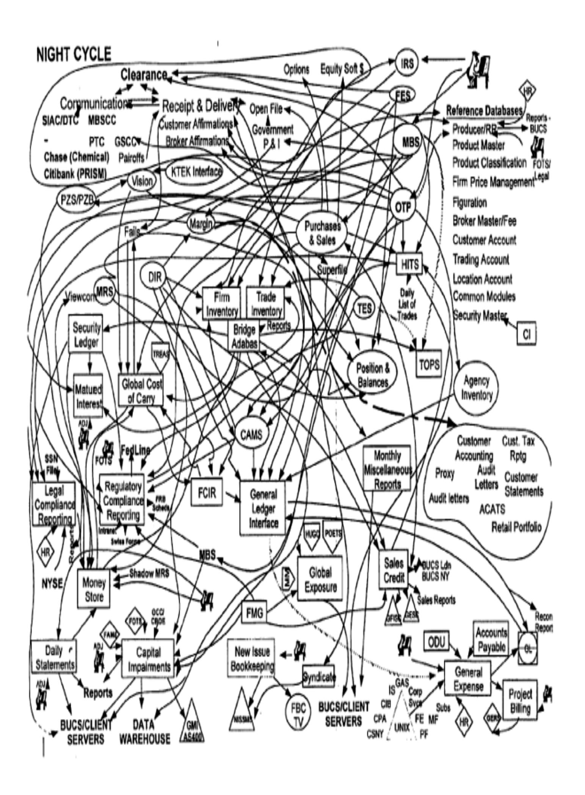
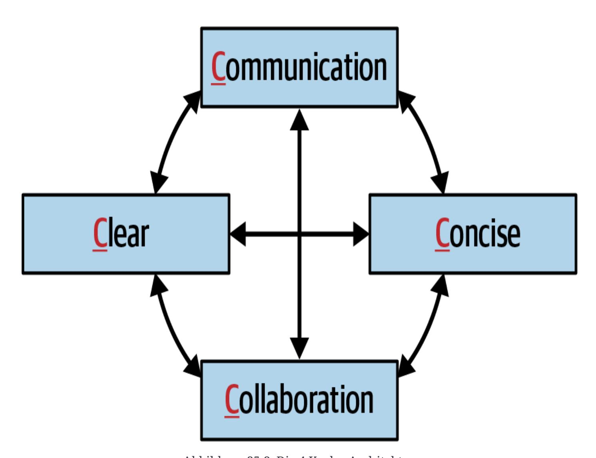
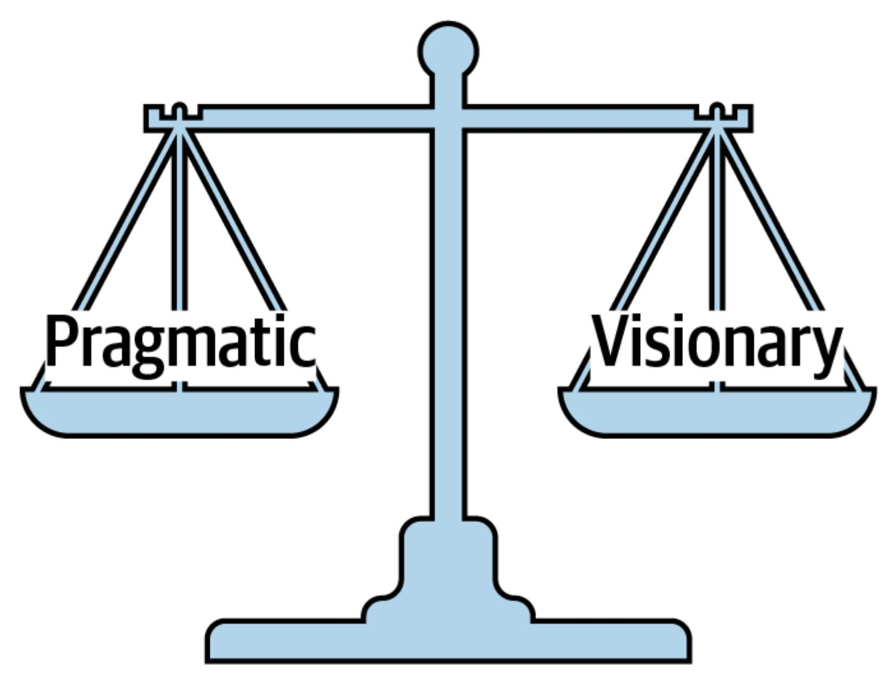
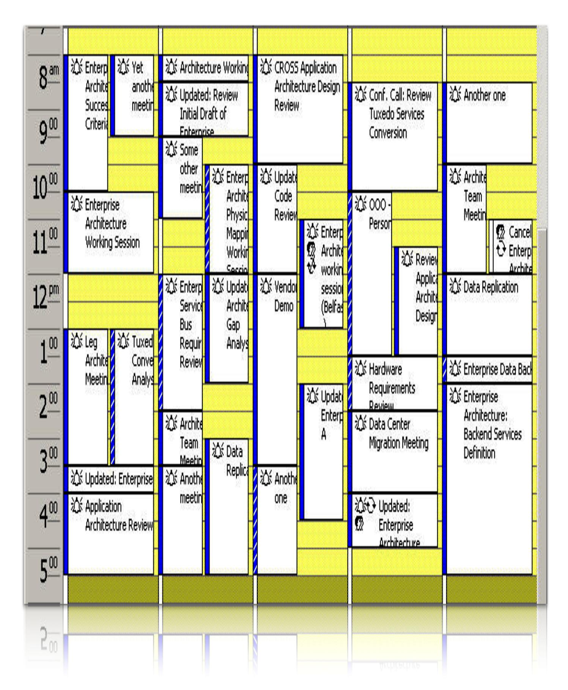

# Kapitel 25. Verhandlungs- und Führungsfähigkeiten

Diese Arbeit wurde mithilfe von KI übersetzt. Wir freuen uns über dein Feedback und deine Kommentare: [translation-feedback@oreilly.com](mailto:translation-feedback@oreilly.com)

Verhandlungs- und Führungsfähigkeiten sind harte Fähigkeiten, die man nur durch jahrelanges Lernen, Üben und Fehler erlangt - aber sie sind entscheidend, um ein effektiver Softwarearchitekt zu werden. Dieses Buch kann niemanden über Nacht zum Verhandlungs- und Führungsexperten machen, aber die Techniken, die wir in diesem Kapitel vorstellen, sind ein guter Startpunkt. Um tiefer in dieses Thema einzutauchen, empfehlen wir das Buch *The Staff [Engineer's](https://www.oreilly.com/library/view/the-staff-engineers/9781098118723) Path* von Tanya Reilly *[:](https://www.oreilly.com/library/view/the-staff-engineers/9781098118723) A Guide for Individual [Contributors](https://www.oreilly.com/library/view/the-staff-engineers/9781098118723)* (O'Reilly, 2022) und das klassische Verhandlungsbuch *Getting to Yes: Negotiating Agreement Without Giving In* (Penguin Books, 2011) von Roger Fisher, William L. Ury und Bruce Patton.

## Verhandlung und Erleichterung

In [Kapitel](#page--1-0) 1 haben wir die wichtigsten Erwartungen an Softwarearchitekten aufgeführt. Die letzte Erwartung, die wir besprochen haben, war das Verständnis und die Fähigkeit, sich in der Büropolitik deines Unternehmens zurechtzufinden. Dies ist deshalb so wichtig, weil fast jede Entscheidung, die du als Softwarearchitekt triffst, angefochten wird: von Entwicklern, die meinen, sie wüssten mehr, von anderen Architekten, die meinen, sie hätten eine bessere Idee oder eine bessere Herangehensweise an das Problem, und von Interessengruppen, die meinen, deine Lösung sei zu teuer oder würde zu viel Zeit in Anspruch nehmen.

Verhandeln ist eine der wichtigsten Fähigkeiten eines Architekten. Effektive Softwarearchitekten verstehen die Politik des Unternehmens, haben ein ausgeprägtes Verhandlungs- und Moderationsgeschick und können Meinungsverschiedenheiten überwinden, um Lösungen zu schaffen, denen alle Beteiligtenzustimmen.

### **Verhandeln mit Geschäftsinteressenten**

Stell dir folgendes Szenario vor, in dem du als leitender Architekt mit einem wichtigen Interessenvertreter des Unternehmens verhandeln musst:

#### *Szenario 1*

Parker, der Senior Vice President und Produktsponsor für dieses Projekt, besteht darauf, dass das neue globale Handelssystem eine Verfügbarkeit von "fünf Neunen" (99,999%) gewährleisten muss. Ausgehend von der Zeitspanne zwischen den globalen Märkten, in der kein Handel stattfindet (zwei Stunden), weißt du jedoch, dass eine Verfügbarkeit von drei Neunen (99,9%) ausreichen würde, um die Projektanforderungen zu erfüllen. Das Problem ist, dass du gesehen hast, dass Parker sich nicht gerne irrt und nicht gut darauf reagiert, wenn er korrigiert wird, vor allem wenn er es als herablassend

empfindet. Parker ist technisch nicht versiert, denkt aber, dass er es ist, und mischt sich deshalb oft in die nicht funktionalen Aspekte von Projekten ein. Als Architekt ist es dein Ziel, Parker durch Verhandlungen davon zu überzeugen, dass eine Verfügbarkeit von drei Neunen (99,9 %) ausreichend ist.

Du musst aufpassen, dass du in deiner Analyse nicht zu egoistisch und energisch bist, aber du musst auch sicherstellen, dass du nichts übersiehst, was dir während der Verhandlung Unrecht geben könnte. Es gibt einige wichtige Verhandlungstechniken, die dir bei dieser Art von Stakeholder-Verhandlungen helfen können. Die erste ist:

#### **TIPP**

Achte auf die Schlagworte und den Jargon, den die Leute benutzen, auch wenn sie bedeutungslos erscheinen. Sie enthalten oft Hinweise, die dir helfen können, die Situation besser zu verstehen und zu verhandeln.

Unternehmensspezifische Schlagworte sind in der Regel bedeutungslos, können aber dennoch wertvolle Informationen liefern, wenn du kurz vor Verhandlungen stehst. Angenommen, du fragst, wann eine bestimmte Funktion benötigt wird, und Parker antwortet: "Ich habe sie gestern gebraucht." Das kannst du zwar nicht wörtlich nehmen, aber es sollte dir sagen, dass die Markteinführung für diesen Stakeholder wichtig ist. Der Satz "Dieses System muss blitzschnell sein" bedeutet, dass die Leistung ein großes Anliegen ist, und "keine Ausfallzeiten" ist nicht wörtlich zu nehmen, sondern bedeutet, dass die Verfügbarkeit für diese Anwendung entscheidend ist. Effektive Softwarearchitekten lesen

zwischen den Zeilen solcher überspitzten Aussagen, um die wahren Bedenken des Stakeholders zu erkennen. Das führt zu einer zweiten Verhandlungstechnik:

#### **TIPP**

Sammle so viele Informationen wie möglich *, bevor du* in eine Verhandlung eintrittst.

Parkers Verwendung des Begriffs "fünf Neunen" deutet darauf hin, dass das System hochverfügbar sein soll (konkret: 99,999 % Betriebszeit). Es könnte jedoch sein, dass Parker nicht weiß, was "fünf Neunen" an Verfügbarkeit in Bezug auf die Anzahl der Ausfallzeiten pro Jahr tatsächlich bedeutet. [Tabelle](#page-4-0) 25-1 zeigt die Ausfallzeiten in Abhängigkeit von der Anzahl der Neunen der Verfügbarkeit.

Tabelle 25-1. Die Neuner der Verfügbarkeit

| Prozentuale Betriebszeit   | Ausfallzeit pro Jahr (pro Tag)        |
|-------------------------------|---------------------------------------------------|
| 90,0% (eins neun)       | 36 Tage 12 Stunden (2,4 Stunden)   |
| 99,0% (zwei Neunen)     | 87 Stunden 46 Minuten (14 Minuten) |
| 99,9% (drei Neunen)     | 8 Stunden 46 Minuten (86 Sekunden) |
| 99,99% (vier Neunen)    | 52 min 33 sec (7 sec)              |
| 99,999% (fünf Neunen)   | 5 min 35 sec (1 sec)               |
| 99,9999% (sechs Neunen) | 31,5 sec (86 ms)                         |

Eine Verfügbarkeit von "fünf Neunen" entspricht einer Ausfallzeit von 5 Minuten und 35 Sekunden pro Jahr oder durchschnittlich 1 Sekunde pro Tag ungeplanter Ausfallzeit. Das ist ehrgeizig, kostspielig und, wie sich herausstellt, für Szenario 1 unnötig, wenn man bedenkt, wie viel Zeit zwischen dem globalen Handel vergeht, wenn kein Handel stattfindet. Die Angabe dieser Ziele in Stunden und Minuten (oder in diesem Fall in Sekunden) ist eine viel bessere Art und Weise, das Gespräch zu führen,

als sich an die "Neuner"-Sprache zu klammern, denn so kommen echte Metriken und quantifizierte Zahlen in die Diskussion.

Bei der Verhandlung von Szenario 1 müsstest du Parkers Bedenken bestätigen ("Ich verstehe, dass die Verfügbarkeit für dieses System sehr wichtig ist") und dann die Verhandlung von der Neuner-Methode auf eine vernünftige Anzahl von Stunden und Minuten ungeplanter Ausfallzeiten umstellen. Drei Neunen (die du für gut genug hältst) entsprechen durchschnittlich 86 Sekunden ungeplanter Ausfallzeit pro Tag - im Kontext dieses globalen Handelssystems sicherlich eine vernünftige Zahl. Diese Angabe könnte ausreichen, um Parker davon zu überzeugen, dass diese ungeplante Ausfallzeit zufriedenstellend ist. Falls das nicht der Fall sein sollte, hier ein weiterer Tipp:

#### **TIPP**

Wenn alles andere fehlschlägt, gib an, wie *hoch* die Kosten und die Zeit sind.

Wir empfehlen, diese Verhandlungstaktik bis zum Schluss aufzuheben. Wir haben schon zu oft erlebt, dass Verhandlungen mit Aussagen wie "Das kostet viel Geld" oder "Dafür haben wir keine Zeit" auf dem falschen Fuß begonnen haben. Geld und Zeit (einschließlich des damit verbundenen Aufwands) sind sicherlich wichtige Faktoren in jeder Verhandlung, aber versuche es mit anderen Rechtfertigungen und Rationalisierungen, die wichtiger sind, bevor du sie vorbringst. Sie sollten ein letzter Ausweg sein. Sobald du eine Einigung mit dem

Interessenvertreter erzielt hast, kannst du Kosten und Zeit berücksichtigen, wenn sie wichtig sind.

Eine weitere wichtige Verhandlungstechnik für solche Situationen:

**TIPP**

Wenn du Forderungen oder Anforderungen qualifizieren musst, "teile und herrsche".

In *Die Kunst des Krieges* schreibt der alte chinesische Krieger Sun Tzu über den Gegner: "Wenn seine Kräfte vereint sind, trenne sie." Diese Taktik des Teilens und Eroberns kannst du auch bei Verhandlungen anwenden. In Szenario 1 besteht Parker auf einer Verfügbarkeit von fünf Neunen (99,999%) für das neue Handelssystem. Aber braucht das *gesamte System* eine fünfneunprozentige Verfügbarkeit? Du kannst die Anforderung einschränken, indem du sie auf bestimmte Bereiche des Systems beschränkst, die tatsächlich eine fünfneunprozentige Verfügbarkeit benötigen. Das reduziert den Umfang der schwierigen (und teuren) Anforderungen, ganz zu schweigen vom Umfang der Verhandlungen.

### **Mit anderen Architekten verhandeln**

Es ist nicht ungewöhnlich, dass Architekten bei einem Projekt mit anderen Architekten verhandeln müssen. Betrachte Szenario 2, in dem sich zwei Architekten nicht einig sind, welches Protokoll sie verwenden sollen:

### *Szenario 2*

Du bist der ältere von zwei Architekten in einem Projekt und glaubst, dass asynchrones Messaging der richtige Ansatz für die Kommunikation zwischen einer Gruppe von Diensten ist, um sowohl die Leistung als auch die Skalierbarkeit zu erhöhen. Addison, der andere Architekt im Projekt, ist jedoch ganz anderer Meinung. Er besteht darauf, dass REST die bessere Wahl ist, weil es immer schneller als Messaging ist und genauso gut skaliert werden kann. Sie berufen sich auf ihre Untersuchung, die aus einer Google-Suche und der Ausgabe einer Eingabeaufforderung an ein beliebtes generatives KI-Tool besteht. Dies ist nicht die erste hitzige Debatte, die du mit Addison führst, und es wird auch nicht die letzte sein. Du willst sie davon überzeugen, dass Messaging die richtige Lösung ist.

Als leitender Architekt könntest du Addison natürlich sagen, dass seine Meinung nicht zählt und sie ignorieren. Damit würdest du aber nur die Feindseligkeit zwischen euch verstärken, und eine ungesunde, nicht kooperative Beziehung zwischen den beiden Architekten des Projekts würde sich mit Sicherheit negativ auf das Entwicklungsteam auswirken.

#### **TIPP**

Erinnere dich immer daran, dass *Demonstration die Diskussion besiegt*.

Anstatt über REST oder Messaging zu streiten, solltest du Addison *zeigen,* warum Messaging in dieser speziellen Umgebung die bessere Wahl ist. Da jede Umgebung anders ist, bringt ein einfaches Googeln selten die

richtige Antwort. Aber wenn du die beiden Optionen in einer produktionsähnlichen Umgebung vergleichst und Addison die Ergebnisse zeigst, kannst du einen Streit vielleicht ganz vermeiden.

#### **TIPP**

Vermeide es, übermäßig argumentativ zu sein oder die Dinge zu persönlich werden zu lassen. Eine ruhige Führung, kombiniert mit einer klaren und präzisen Argumentation, wird eine Verhandlung fast immer gewinnen.

Dies ist eine sehr wirksame Technik, um mit kontroversen Beziehungen umzugehen. Sobald die Dinge persönlich oder hitzig werden, ist es am besten, die Verhandlung zu beenden. Nimm sie später wieder auf, wenn sich beide Parteien beruhigt haben. Architekten und Architektinnen streiten ab und zu, aber wenn du ruhig bleibst und Führungsstärke zeigst, wird die andere Person in der Regel nachgeben.

### **Mit Entwicklern verhandeln**

Effektive Softwarearchitekten verschaffen sich den Respekt des Teams, indem sie zusammenarbeiten. Wenn sie dann etwas vom Entwicklungsteam verlangen, ist es viel unwahrscheinlicher, dass es zu einem Streit oder Unmut kommt.

Wie du in [Kapitel](#page--1-0) 24 gesehen hast, kann die Zusammenarbeit mit Entwicklungsteams manchmal schwierig sein. Wenn sich die Entwicklungsteams von der Architektur (oder dem Architekten) abgekoppelt fühlen, haben sie oft das Gefühl, bei Entscheidungen außen vor zu bleiben. Dies ist ein klassisches Beispiel für das Muster der *Elfenbeinturm-Architektur*. Elfenbeinturm-Architekten diktieren von oben herab und erteilen den Entwicklungsteams Befehle, ohne sich um ihre Meinungen oder Bedenken zu kümmern. Das führt in der Regel dazu, dass das Team den Respekt vor dem Architekten verliert, und kann schließlich dazu führen, dass die Teamdynamik gänzlich zusammenbricht. Eine Verhandlungstechnik, die in dieser Situation helfen kann, ist, deine Entscheidungen immer zu begründen.

#### **TIPP**

Wenn du Entwickler davon überzeugst, eine Architekturentscheidung zu übernehmen oder eine bestimmte Aufgabe zu erledigen, solltest du das begründen und nicht "von oben herab" diktieren.

Wenn du einen Grund angibst *, warum* etwas getan werden muss, werden die Entwickler eher zustimmen. Betrachte zum Beispiel das folgende Gespräch zwischen einem Architekten und einem Entwickler über eine einfache Abfrage in einer traditionellen n-tiered Schichtenarchitektur:

**Architekt***: "Du musst durch die Geschäftsebene gehen, um diese Entscheidung zu treffen."*

**Entwickler***: "Da bin ich anderer Meinung. Es ist viel schneller, wenn du die Datenbank direkt aufrufst.*

Es gibt mehrere Dinge, die in diesem Gespräch falsch sind. Zunächst fällt auf, dass der Architekt die Worte "du musst" verwendet. Dieser

Befehlston ist nicht nur erniedrigend, er ist auch eine der schlechtesten Arten, eine Verhandlung (oder ein Gespräch) zu beginnen. Die Antwort des Entwicklers hat einen Grund: Der Weg über die Business-Ebene ist langsamer und braucht mehr Zeit.

Betrachte nun einen alternativen Ansatz:

**Architekt***: "Da die Änderungskontrolle für uns am wichtigsten ist, haben wir eine geschlossene Schichtenarchitektur gebildet. Das bedeutet, dass alle Aufrufe an die Datenbank von der Geschäftsschicht kommen müssen."*

**Entwickler***: "OK, das verstehe ich - aber wie soll ich dann mit diesen Leistungsproblemen bei einfachen Abfragen umgehen?"*

Hier *rechtfertigt* der Architekt die Forderung, dass alle Aufrufe über die Geschäftsschicht laufen. Es ist immer ein guter Ansatz, *zuerst* eine Begründung zu liefern. Die meisten Menschen hören auf zuzuhören, sobald sie etwas hören, mit dem sie nicht einverstanden sind. Wenn du den Grund vor der Forderung angibst, ist sichergestellt, dass der Entwickler die Begründung des Architekten auch hört.

Der Architekt hat auch einen weniger persönlichen Ansatz gewählt, um diese Forderung zu formulieren. Indem er "das bedeutet" statt "du musst" sagt, hat er die Forderung in eine einfache Tatsachenbehauptung verwandelt. Sieh dir jetzt die Antwort des Entwicklers an: Anstatt den Einschränkungen der Schichtenarchitektur zu widersprechen, stellt der Entwickler eine Frage zur Verbesserung der Leistung bei einfachen Aufrufen. Jetzt können die beiden in ein gemeinsames Gespräch

eintreten, um Wege zu finden, einfache Abfragen schneller zu machen und gleichzeitig die geschlossenen Schichten der Architektur zu erhalten.

Eine weitere wirksame Verhandlungstaktik besteht darin, den Entwickler selbst auf die Lösung kommen zu lassen. Nehmen wir zum Beispiel an, dass du als Architekt zwischen zwei Frameworks, Framework X und Framework Y, wählen musst. Framework Y erfüllt die Sicherheitsanforderungen für das System nicht, also entscheidest du dich natürlich für Framework X. Ein Entwickler in deinem Team ist da ganz anderer Meinung und besteht darauf, dass Framework Y trotzdem die bessere Wahl wäre. Anstatt zu argumentieren, sagst du dem Entwickler, dass das Team Framework Y verwenden wird, wenn er dir zeigen kann, wie Framework Y die Sicherheitsanforderungen erfüllt.

Als Nächstes wird eines von zwei Dingen passieren. Option 1: Der Entwickler versucht zu beweisen, dass Framework Y die Sicherheitsanforderungen erfüllt, schlägt aber fehl. Wenn er fehlschlägt, versteht er aus erster Hand, warum das Team dieses Framework nicht verwenden kann. Und weil sie selbst auf die Lösung kommen, bekommst du automatisch ihre Zustimmung für die Entscheidung, Framework X zu verwenden. Das ist ein Gewinn. Option 2 ist, dass der Entwickler einen Weg findet, die Sicherheitsanforderungen mit Framework Y zu erfüllen, und ihn dir vorstellt. Auch das ist ein Gewinn. In diesem Fall hast du bei deiner Bewertung von Framework Y etwas übersehen und hast nun eine bessere Lösung für das Problem (und der Entwickler fühlt sich immer noch in die Entscheidung einbezogen).

#### **TIPP**

Wenn ein/e Entwickler/in mit einer Entscheidung, die du getroffen hast, nicht einverstanden ist, lass ihn/sie selbst auf die Lösung kommen.

Entwicklerinnen und Entwickler sind kluge Leute mit nützlichem Wissen. Durch die Zusammenarbeit mit dem Entwicklungsteam gewinnen Architekten ihren Respekt - und ihre Unterstützung bei der Suche nach besseren Lösungen. Je mehr die Entwickler einen Architekten respektieren, desto einfacher wird es für den Architekten sein, mit ihnen zu verhandeln .

# Der Softwarearchitekt als Führungskraft

Ein Softwarearchitekt ist auch eine Führungspersönlichkeit, die ein Entwicklungsteam bei der Umsetzung der Architektur anleitet. Wir sind der Meinung, dass etwa 50 % der Arbeit eines Softwarearchitekten aus der Fähigkeit besteht, Menschen zu führen und zu leiten. In diesem Abschnitt gehen wir auf Führungstechniken für Softwarearchitekten ein.

### **Die 4 Ks der Architektur**

Wir haben schon oft gesagt, dass Veränderung eine Konstante ist - und das ist nie wahrer als dann, wenn es sich um eine Veränderung handelt, bei der die Dinge immer komplexer werden, egal ob es sich um

Geschäftsprozesse, Technologie oder sogar die Architektur selbst handelt. Wie du in [Teil](#page--1-0) III dieses Buches gesehen hast, sind einige Architekturen *sehr* komplex. Wenn eine Architektur eine Verfügbarkeit von sechs Neunen (99,9999%) gewährleisten muss, entspricht das einer ungeplanten Ausfallzeit von etwa 86 Millisekunden pro Tag oder 31,5 Sekunden pro *Jahr*. Diese Art von Komplexität wird als *essentielle Komplexität bezeichnet -*mit anderen Worten: "Wir haben ein schweres Problem".

Architekten (und Entwickler) tappen leicht in die Falle, Lösungen, Diagramme und Dokumentationen unnötig komplex zu gestalten. Um Neal zu zitieren:

*Entwickler werden von der Komplexität angezogen wie Motten vom Feuer - oft mit dem gleichen Ergebnis.*

In [Abbildung](#page-15-0) 25-1 sind die wichtigsten Informationsflüsse der Backend-Verarbeitungssysteme einer sehr großen globalen Bank dargestellt. Ist dieses System *notwendigerweise* komplex - mit anderen Worten, *muss* es komplex sein? Das weiß niemand, denn der Architekt hat es komplex *gemacht*. Diese Art von Komplexität wird als *zufällige Komplexität* bezeichnet: Kurz gesagt, "wir haben ein Problem schwer gemacht". Architekten fügen manchmal Komplexität hinzu, um ihren Wert zu beweisen, wenn die Dinge zu einfach erscheinen, oder um zu garantieren, dass sie bei Entscheidungen immer auf dem Laufenden gehalten werden, oder sogar um ihren Job zu sichern. Was auch immer der Grund sein mag, die Einführung von Komplexität in etwas, das nicht

komplex sein muss, ist einer der besten Wege, um Respekt zu verlieren und ein ineffektiver Anführer und Architekt zu werden.

Um unbeabsichtigte Komplexität zu vermeiden, verwenden wir die sogenannten *4 Ks* der Architekturführung: *Kommunikation*, *Zusammenarbeit, Klarheit* und *Prägnanz*. Diese Faktoren, die in [Abbildung](#page-16-0) 25-2 dargestellt sind (nicht zu verwechseln mit den 4 Cs des C4-Modells für Diagramme), wirken zusammen, um einen effektiven Kommunikator und Kollaborateur im Team zu schaffen.

Abbildung 25-2. Die 4 Ks der Architektur

Als Führungskraft, Vermittler und Verhandlungsführer ist es für einen Softwarearchitekten unerlässlich, *klar* und *präzise zu kommunizieren*. Genauso wichtig ist es, mit Entwicklern, Interessengruppen und anderen Architekten *zusammenzuarbeiten*. Wenn du dich auf die 4 Ks konzentrierst, verschaffst du dir den Respekt des Teams und wirst zur Ansprechperson für Fragen, Ratschläge, Mentoring, Coaching und Führung im Projekt.

### **Sei pragmatisch, aber visionär**

Ein effektiver Softwarearchitekt muss pragmatisch und gleichzeitig visionär sein. Dieses Gleichgewicht zu erreichen, ist nicht so einfach, wie es sich anhört. Es erfordert ein hohes Maß an Reife und viel Übung, um es zu erreichen.

Ein *Visionär* ist jemand, der mit Fantasie oder Weisheit über die Zukunft nachdenkt oder sie plant. Ein Visionär zu sein bedeutet, strategisches Denken auf ein Problem anzuwenden, was genau das ist, was Architekten tun. Architekten planen für die Zukunft und sorgen dafür, dass die Architektur, die sie bauen, für lange Zeit lebendig (gültig und nützlich) bleibt. Allerdings werden Architekten bei ihren Planungen und Entwürfen oft zu theoretisch und schaffen Lösungen, die zu schwer umzusetzen sind - oder sogar zu schwer zu verstehen.

Betrachte nun die andere Seite der Medaille, nämlich *pragmatisch* zu sein. Pragmatisch zu sein bedeutet, die Dinge vernünftig und realistisch anzugehen, und zwar auf der Grundlage *praktischer* und nicht

*theoretischer* Überlegungen. Architekten müssen zwar Visionäre sein, aber sie müssen auch praktische, realistische Lösungen anwenden. Pragmatisch zu sein bedeutet, bei der Entwicklung einer architektonischen Lösung Folgendes zu berücksichtigen:

- Budgetbeschränkungen und andere kostenbasierte Faktoren
- Zeitdruck und andere zeitabhängige Faktoren
- Die Fähigkeiten und das Qualifikationsniveau des Entwicklungsteams
- Die Kompromisse und Auswirkungen der einzelnen Architekturentscheidungen
- Die technischen Grenzen eines vorgeschlagenen Designs oder einer Lösung

Gute Softwarearchitekten bemühen sich um ein Gleichgewicht zwischen Pragmatismus, Vorstellungskraft und Weisheit bei der Lösung von Problemen (siehe [Abbildung](#page-19-0) 25-3).

Nehmen wir zum Beispiel einen Architekten, der aus unklaren Gründen mit einem plötzlichen, erheblichen Anstieg der gleichzeitigen Benutzerlast konfrontiert wird. Ein Visionär könnte einen ausgeklügelten Weg finden, um die Elastizität des Systems zu verbessern, indem er die Datenbanken aufbricht und ein komplexes *Data [Mesh](https://oreil.ly/6HmSp)* aufbaut: eine Sammlung verteilter, nach Domänen aufgeteilter Datenbanken, um analytische Daten von transaktionalen Daten zu trennen. Theoretisch *könnte* dieser Ansatz möglich sein, aber pragmatisch zu sein bedeutet, dass man die Lösung mit Vernunft und Sachlichkeit angehen muss. Hat das Unternehmen zum Beispiel schon einmal ein Data Mesh verwendet? Welche Kompromisse gibt es bei der

Verwendung eines Data Mesh? Würde diese Lösung das Problem wirklich lösen?

Abbildung 25-3. Gute Architekten finden das Gleichgewicht zwischen Pragmatismus undVisionärsein

Eine gute Balance zwischen Pragmatismus und Vision zu halten, ist ein guter Weg, um sich als Architekt Respekt zu verschaffen. Die Stakeholder des Unternehmens schätzen visionäre Lösungen, die sich in eine Reihe von Einschränkungen einfügen, und die Entwickler schätzen es, wenn sie eine praktische (und nicht nur theoretische) Lösung implementieren können.

Ein pragmatischer Architekt würde sich zunächst ansehen, welche Faktoren die Elastizität des Systems einschränken. Engpässe zu finden und zu isolieren, wäre ein erster praktischer Ansatz für dieses Problem. Stellt die Datenbank einen Engpass in Bezug auf einige der aufgerufenen Dienste oder andere benötigte externe Quellen dar? Wenn ja, könnten einige der Daten zwischengespeichert werden, um die Aufrufe der Datenbank zu reduzieren?

### **Teams mit gutem Beispiel voranbringen**

Schlechte Softwarearchitekten setzen ihren Titel ein, um Leute dazu zu bringen, etwas zu tun. Effektive Softwarearchitekten bringen Menschen dazu, etwas zu tun, indem sie mit gutem Beispiel vorangehen. Auch hier geht es darum, sich den Respekt der Entwicklungsteams, der Interessengruppen und anderer Personen im Unternehmen (z. B. des Betriebsleiters, der Entwicklungsmanager und der Produktverantwortlichen) zu verschaffen.

Die klassische "Führen durch Vorbild, nicht durch Titel"-Geschichte handelt von einem Hauptmann, der einen Unteroffizier während einer militärischen Schlacht befehligt. Der Hauptmann, der von der Truppe weit entfernt ist, befiehlt der gesamten Truppe, einen besonders schwierigen Hügel einzunehmen. Die Soldaten sind voller Zweifel und suchen die Bestätigung des rangniedrigeren Unteroffiziers. Der Unteroffizier, der die Situation versteht, nickt leicht mit dem Kopf und die Soldaten rücken sofort voller Zuversicht vor, um den Hügel zu erobern.

Die Moral von der Geschicht' ist, dass Rang und Titel sehr wenig bedeuten, wenn es darum geht, Menschen zu führen. Der Informatiker Gerald [Weinberg](https://oreil.ly/6fI2m) ist berühmt für seinen Ausspruch: "Egal, was das Problem ist, es ist ein Menschenproblem." Die meisten Menschen denken, dass das Lösen technischer Probleme nichts mit menschlichen Fähigkeiten und alles mit *technischem Wissen* zu tun hat. Technisches Wissen ist zwar notwendig, aber es ist nur ein Teil der Problemlösung.

Nehmen wir an, ein Architekt trifft sich mit einem Team von Entwicklern, um ein Problem zu lösen, das in der Produktion aufgetreten ist. Einer der Entwickler macht einen Vorschlag, und der Architekt antwortet: " *Das ist* eine blöde Idee. Nicht nur, dass dieser Entwickler keine weiteren Vorschläge mehr macht, jetzt traut sich auch keiner der anderen Entwickler mehr, etwas zu sagen. Der Architekt hat soeben die Zusammenarbeit im gesamten Team unterbunden.

Schauen wir uns einen weiteren Ausschnitt aus dem Dialog zwischen einem Architekten und einem Bauunternehmer an:

**Entwickler***: "Und wie lösen wir dieses Leistungsproblem?"*

**Architekt***: "Ihr müsst einen Cache verwenden. Das würde das Problem lösen."*

**Entwickler***: "Sagen Sie mir nicht, was ich tun soll."*

**Architekt***: "Was ich dir sage, ist, dass es das Problem lösen würde."*

Dies ist ein gutes Beispiel dafür, dass man kommuniziert, ohne *zusammenzuarbeiten*. Mit den Worten "Was du tun musst, ist" schließt der Architekt die Zusammenarbeit aus. Betrachte nun einen anderen Ansatz:

**Entwickler***: "Und wie lösen wir dieses Leistungsproblem?"*

**Architekt***: "Hast du daran gedacht, einen Cache zu verwenden? Das könnte das Problem lösen."*

**Entwickler***: "Hmmm, nein, darüber haben wir noch nicht nachgedacht. Was denkt ihr?"*

**Architekt***: "Nun, wenn wir hier einen Cache einbauen..."*

Die Worte "Haben Sie sich das überlegt?" verwandeln den Befehl in eine Frage und geben dem Bauherrn die Kontrolle zurück, so dass er ein gemeinsames Gespräch mit dem Architekten führen kann. Die Art und Weise, wie du deine Sprache einsetzt, ist von entscheidender Bedeutung für den Aufbau einer kollaborativen Umgebung.

Bei der Zusammenarbeit als Architekt/in geht es nicht nur darum, wie du persönlich mit anderen zusammenarbeitest - es geht auch darum, die Zusammenarbeit zwischen den Teammitgliedern zu fördern. Beobachte die Dynamik im Team und achte auf Situationen wie die in diesem Dialog. Wenn du ein Teammitglied dabei beobachtest, wie es eine fordernde oder herablassende Sprache verwendet, nimm es zur Seite und lehre es, eine kooperative Sprache zu verwenden. Das wird nicht nur die Teamdynamik verbessern, sondern auch den Respekt der Teammitglieder untereinander.

Wenn du jemanden dazu bringen musst, etwas zu tun, was er sonst vielleicht nicht tun möchte, ist es manchmal am besten, eine Bitte in einen Gefallen zu verwandeln. Im Allgemeinen mögen Menschen es nicht, wenn man ihnen sagt, was sie tun sollen, aber sie wollen anderen helfen. Betrachte die folgende Unterhaltung zwischen einem Architekten und einem Entwickler über eine Überarbeitung der Architektur während einer anstrengenden Iteration:

**Architekt***: "Ich möchte, dass du den Zahlungsdienst in fünf verschiedene Dienste aufteilst, wobei jeder Dienst die Funktionen für jede von uns akzeptierte Zahlungsart enthält, z. B. Ladenguthaben, Kreditkarte, PayPal, Geschenkkarte und Bonuspunkte. Das sorgt für eine bessere Fehlertoleranz und Skalierbarkeit der Website. Es sollte nicht allzu lange dauern."*

**Entwickler***: "Tut mir leid, dafür bin ich viel zu beschäftigt. Ich kann es wirklich nicht machen."*

**Architekt***: "Hör zu, das ist wichtig und muss in dieser Iteration erledigt werden."*

**Entwickler***: "Tut mir leid, ich kann nicht. Vielleicht kann es einer der anderen Entwickler machen. Ich bin einfach zu beschäftigt."*

Der Entwickler lehnt die Aufgabe sofort ab, obwohl der Architekt sie mit einer besseren Fehlertoleranz und Skalierbarkeit begründet hat. Der Architekt *fordert* den Entwickler auf, etwas zu tun, wofür er einfach zu beschäftigt ist - und er nennt nicht einmal den Namen der Person, um die es geht! Betrachte nun die Technik, die Forderung in einen Gefallen zu verwandeln:

**Architekt***: "Hallo, Sridhar. Hör zu, ich stecke in einer echten Zwickmühle. Ich muss den Zahlungsdienst unbedingt in separate Dienste für jede Zahlungsart aufteilen, um eine bessere Fehlertoleranz und Skalierbarkeit zu erreichen, und ich habe zu lange damit gewartet. Gibt es eine Möglichkeit, das noch in diese Iteration zu packen? Das würde mir wirklich helfen."*

**Entwickler** *(hält inne): "Ich bin in diesem Durchgang sehr beschäftigt, aber ich werde sehen, was ich tun kann.*

**Architekt***: "Danke, Sridhar, ich weiß deine Hilfe wirklich zu schätzen. Ich bin dir etwas schuldig."*

**Entwickler***: "Mach dir keine Sorgen. Ich werde dafür sorgen, dass es in diesem Durchgang erledigt wird."*

Erstens macht die Verwendung des Namens der Person das Gespräch persönlicher und vertrauter als eine unpersönliche professionelle Forderung. Die Verwendung des Namens und der richtigen Pronomen während eines Gesprächs oder einer Verhandlung kann zum Aufbau von Respekt und gesunden Beziehungen beitragen. Menschen hören nicht nur gerne ihren eigenen Namen, sondern es schafft auch ein Gefühl der Vertrautheit. Übe dich darin, dir die Namen deiner Mitmenschen zu merken, indem du sie häufig benutzt. Wenn du einen Namen schwer auszusprechen findest, recherchiere die richtige Aussprache und übe sie, bis sie perfekt ist. Wenn dir jemand seinen Namen sagt, wiederholen wir ihn gerne und fragen, ob wir ihn richtig aussprechen. Wenn er nicht richtig ist, wiederholen wir diesen Vorgang, bis wir ihn richtig aussprechen.

Zweitens gibt der Architekt im vorherigen Gespräch zu, dass er in einer "echten Zwickmühle" steckt und dass die Aufteilung der Leistungen ihm wirklich "sehr helfen würde". Das klappt nicht immer, aber wenn du den menschlichen Drang, anderen zu helfen, ausnutzt, sind die Erfolgsaussichten höher als beim ersten Gespräch. Probiere es aus, wenn du das nächste Mal in eine solche Situation gerätst.

Eine weitere effektive Führungstechnik, wenn du jemanden zum ersten Mal triffst oder jemanden begrüßt, den du nur gelegentlich siehst, ist, der Person immer die Hand zu schütteln und Augenkontakt herzustellen. Der Händedruck ist eine wichtige zwischenmenschliche Fähigkeit, die bis ins Mittelalter zurückreicht. Er lässt beide Personen wissen, dass sie Freunde und nicht Feinde sind, und schafft ein Band zwischen ihnen. Allerdings solltest du den kulturellen Aspekt des Händeschüttelns beachten. In den USA, Großbritannien, Europa und Australien ist ein Händedruck ein akzeptables Mittel zur Begrüßung, während andere Kulturen andere Begrüßungsformen verwenden (z. B. Japan, wo es auf die Verbeugung und das Timing der Verbeugung ankommt). Trotzdem kann es manchmal schwierig sein, einen einfachen Händedruck richtig hinzubekommen.

Ein Händedruck sollte fest, aber nicht übermächtig sein. Sieh der Person in die Augen. Wenn du beim Händeschütteln wegschaust, ist das ein Zeichen von Respektlosigkeit, und die meisten Menschen werden das bemerken. Außerdem solltest du den Händedruck nicht zu lange hinauszögern. Zwei oder drei Sekunden sind alles, was du brauchst. Übertreibe es auch nicht mit dem Händeschütteln. Wenn du jeden

Morgen ins Büro kommst und allen die Hand schüttelst, ist das so seltsam, dass sich die Leute unwohl fühlen. Ein monatliches Treffen mit dem Betriebsleiter ist jedoch die perfekte Gelegenheit, um aufzustehen, "Hallo, Ruth, schön, dich wiederzusehen" zu sagen und Ruth einen schnellen, festen Händedruck zu geben. Zu wissen, wann man die Hand schütteln sollte und wann nicht, ist Teil der komplexen Kunst der Menschenkenntnis.

Als Führungskraft solltest du darauf achten, persönliche Grenzen zwischen Menschen auf allen Ebenen zu respektieren und zu wahren. Der Händedruck ist ein professionelles Mittel, um eine körperliche Verbindung herzustellen. Da das eine gute Sache ist, nehmen manche Leute an, dass es noch besser und verbindlicher ist, jemanden zu umarmen. Das ist es aber nicht. Eine Umarmung in einem beruflichen Umfeld, egal in welcher Umgebung, kann unangenehm sein und könnte sogar eine Form von Belästigung am Arbeitsplatz darstellen. Das Gleiche gilt für das allgemeine Verhalten am Arbeitsplatz oder wenn du mit einem Kollegen oder einer Kollegin unterwegs bist. Verzichte auf Umarmungen, halte dich an ein vernünftiges berufliches Verhalten und bleibe bei einem Händedruck.

Eine gute Führungskraft sollte die "Go-to-Person" im Team sein - die Person, an die sich die Entwickler/innen mit Fragen und Problemen wenden. Ein effektiver Softwarearchitekt ergreift die Gelegenheit und ergreift die Initiative, das Team zu führen, unabhängig von seinem Titel oder seiner Rolle im Team. Wenn jemand mit einem technischen Problem zu kämpfen hat, ergreift er die Initiative: Er greift ein und bietet Hilfe oder Anleitung an. Das Gleiche gilt für nicht-technische Situationen. Wenn ein Teammitglied deprimiert und genervt zur Arbeit kommt und den Eindruck hat, dass etwas nicht in Ordnung ist, kann ein guter Softwarearchitekt ein Gespräch anbieten. "Hey, Antonio, ich bin auf dem Weg zum Kaffee. Warum gehen wir nicht zusammen rüber?" Während des Spaziergangs können sie dann fragen, ob alles in Ordnung ist. Das bietet die Möglichkeit für ein persönliches Gespräch und im besten Fall sogar die Chance, ein Mentor und Coach zu sein. Eine effektive Führungskraft achtet aber auch auf verbale und nonverbale Zeichen (wie Mimik und Körpersprache) und erkennt, wann es Zeit ist, sich zurückzuziehen.

Eine weitere Möglichkeit, dich als Ansprechpartner im Team zu etablieren, ist es, regelmäßig "Lunch and Learn"-Sitzungen über eine bestimmte Technik oder Technologie zu veranstalten, z. B. über Entwurfsmuster oder neue Funktionen der neuesten Programmiersprache. Wenn du dieses Buch liest, hast du bestimmte Fähigkeiten oder Kenntnisse, die andere nicht haben. Bei diesen Veranstaltungen geht es nicht nur darum, Entwicklern wertvolle Informationen zur Verfügung zu stellen oder dein technisches Können unter Beweis zu stellen - es ist auch eine Gelegenheit, deine Fähigkeiten als Mentor und Redner in der Öffentlichkeit zu trainieren, und weist dich als Führungspersönlichkeit und Mentor aus.

# Einbindung in das Entwicklungsteam

Der Kalender eines Architekten ist in der Regel mit sich überschneidenden Terminen gefüllt, wie der in [Abbildung](#page-29-0) 25-4 gezeigte Kalender. Wie finden Architekten also die Zeit, sich in das Team zu integrieren, es anzuleiten und zu betreuen und für Fragen und Anliegen zur Verfügung zu stehen?

Abbildung 25-4. Ein typischer Kalender eines Softwarearchitekten

Leider sind häufige Treffen ein notwendiges Übel. Der Schlüssel ist, sie zu kontrollieren, damit du dir Zeit für das Team nehmen kannst. Wie [Abbildung](#page-31-0) 25-5 zeigt, gibt es zwei Arten von Besprechungen: solche, die dir *aufgezwungen werden* (jemand lädt dich zu einer Besprechung ein), und solche, die *du auferlegst* (du berufst die Besprechung ein).

Abbildung 25-5. Besprechungstypen

Die Meetings, die andere einberufen, sind am schwersten zu kontrollieren. Da Softwarearchitekten mit vielen verschiedenen Interessengruppen kommunizieren und zusammenarbeiten müssen, werden sie zu fast jedem Treffen eingeladen - auch wenn ihre

Anwesenheit nicht wirklich nötig ist. Wenn du zu einem Meeting eingeladen wirst, frage den Organisator, warum du gebraucht wirst. Wenn die Einladung nur dazu dient, dich auf dem Laufenden zu halten, sind Besprechungsnotizen genau das Richtige für dich. Wenn du fragst *, warum* du bei einer Besprechung dabei sein solltest, kannst du entscheiden, an welchen Besprechungen du teilnehmen musst und welche du auslassen kannst. Ein Blick auf die Tagesordnung ist dabei ebenfalls hilfreich. Wirst du in der *ganzen* Besprechung gebraucht oder nur in dem Teil, in dem ein bestimmtes Thema besprochen wird? Kannst du nach diesem Tagesordnungspunkt gehen? Verschwende keine Zeit in einer Besprechung, die du damit verbringen könntest, dem Entwicklungsteam bei der Lösung von Problemen zu helfen.

#### **TIPP**

Erkundige dich im Voraus nach der Tagesordnung, um herauszufinden, ob du bei dem Treffen wirklich gebraucht wirst oder nicht.

Wenn Entwickler oder der technische Leiter zu einer Besprechung eingeladen werden, solltest du in Erwägung ziehen, an ihrer Stelle zu gehen, vor allem, wenn sowohl du als auch der technische Leiter eingeladen sind, damit sich das Team auf die anstehenden Aufgaben konzentrieren kann. Wenn du die Besprechungen von nützlichen Teammitgliedern ablenkst, verbringst *du* zwar mehr Zeit in den Besprechungen, aber das Entwicklungsteam ist produktiver und respektiert dich mehr.

Als Architekt/in wirst du anderen manchmal Treffen aufzwingen müssen, aber da du hier die Kontrolle hast, solltest du sie auf ein absolutes Minimum beschränken. Lege eine Tagesordnung fest und halte dich an sie. Lass nicht zu, dass ein anderes Thema, das für alle nicht relevant ist, das Treffen stört. Frag dich, ob das von dir einberufene Treffen wichtiger ist als die Arbeit, von der es das Team ablenkt. Wenn es zum Beispiel darum geht, eine wichtige Information zu übermitteln, könntest du dann nicht einfach eine E-Mail schicken, anstatt eine Besprechung einzuberufen? Wenn du dennoch eine Besprechung mit einem Entwicklungsteam ansetzen musst, versuche, die Besprechungen gleich am Morgen, nach dem Mittagessen oder gegen Ende des Tages anzusetzen, damit die Entwickler/innen während der Hauptarbeitszeit möglichst wenig gestört werden.

#### **ENTWICKLER FLOW STATE**

*Flow* ist ein Zustand, in dem sich das Gehirn zu 100% auf ein bestimmtes Problem einlässt und so die volle Aufmerksamkeit und maximale Kreativität ermöglicht. Wenn ein Entwickler zum Beispiel an einem besonders schwierigen Algorithmus oder einem Stück Code arbeitet, können sich Stunden wie Minuten anfühlen. Achte genau auf den *Produktivitätsfluss* deines Teams und achte darauf, ihn nicht zu stören. Mehr über den Flow-Zustand erfährst du in dem Buch *Flow: The Psychology of Optimal Experience* von Mihaly Csikszentmihalyi (Harper Perennial, 2008).

Eine weitere gute Möglichkeit, dich in das Entwicklungsteam zu integrieren, wenn du vor Ort arbeitest, ist, dich zu ihnen zu setzen. Wenn du in einer Kabine abseits des Teams sitzt, vermittelt das die Botschaft: "Ich bin etwas Besonderes und sollte nicht gestört werden." Wenn du neben dem Team sitzt, signalisierst du: "Ich bin ein fester Bestandteil des Teams und stehe für Fragen und Anliegen zur Verfügung." Wenn du vor Ort bist, aber nicht mit deinem Entwicklungsteam zusammensitzen kannst, ist es am besten, wenn du herumläufst und so oft wie möglich gesehen wirst. Ein Architekt, der nie zu sehen ist, auf einer anderen Etage sitzt oder immer in seinem Büro ist, kann das Team unmöglich anleiten. Nimm dir morgens, nach der Mittagspause oder am Ende des Tages Zeit, um dich zu unterhalten, bei Problemen zu helfen, Fragen zu beantworten und grundlegende Coaching- und Mentoring-Aufgaben zu übernehmen. Die Entwickler/innen wissen diese Art der Kommunikation zu schätzen und werden dich dafür respektieren, dass du dir tagsüber Zeit für sie nimmst. Das Gleiche gilt für andere Interessengruppen: Wenn du dem Betriebsleiter auf dem Weg zum Kaffee kurz Hallo sagst, ist das eine gute Möglichkeit, die Kommunikation aufrechtzuerhalten.

Manchmal, z.B. wenn du in einer entfernten Umgebung arbeitest, ist es nicht möglich, mit dem Entwicklungsteam zusammenzusitzen oder herumzulaufen und gesehen zu werden. Das macht die Zusammenarbeit sehr viel schwieriger. Für weitere Informationen zum Management von Remote-Teams empfehlen wir dir das Buch *[Communication](https://www.oreilly.com/library/view/communication-patterns/9781098140533) Patterns* von Jacqui Read (O'Reilly, 2023), dessen Teil 4 ganz den Remote-Teams gewidmet ist.

## Zusammenfassung

Die Verhandlungs- und Führungstipps, die wir in diesem Kapitel vorstellen, sollen Softwarearchitekten dabei helfen, bessere Kooperationsbeziehungen mit dem Entwicklungsteam und anderen Interessengruppen aufzubauen. Das sind notwendige Fähigkeiten. Aber nimm sie nicht nur von uns, sondern auch von Theodore [Roosevelt,](https://oreil.ly/g4ELb) dem 26. Präsidenten der Vereinigten Staaten:

*Die wichtigste Zutat in der Erfolgsformel ist das Wissen, wie man mit Menschen umgeht.*

—Theodore Roosevelt