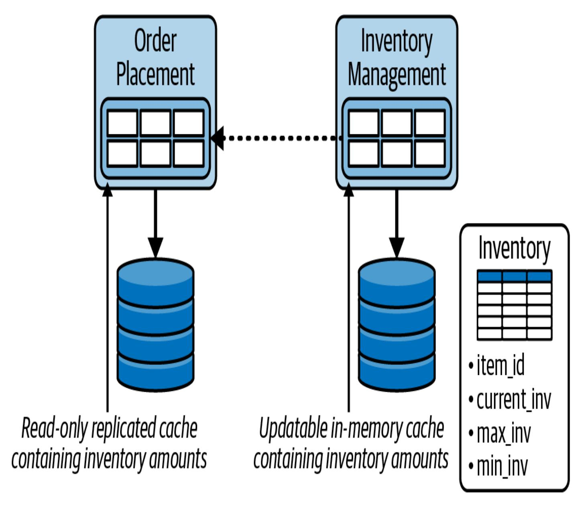
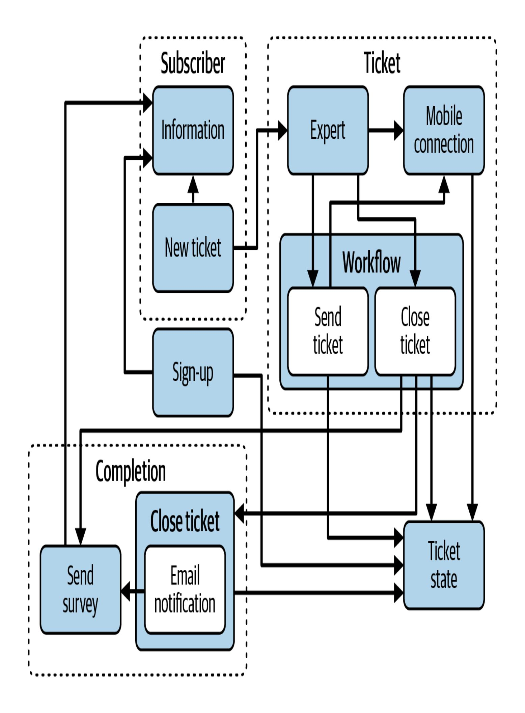
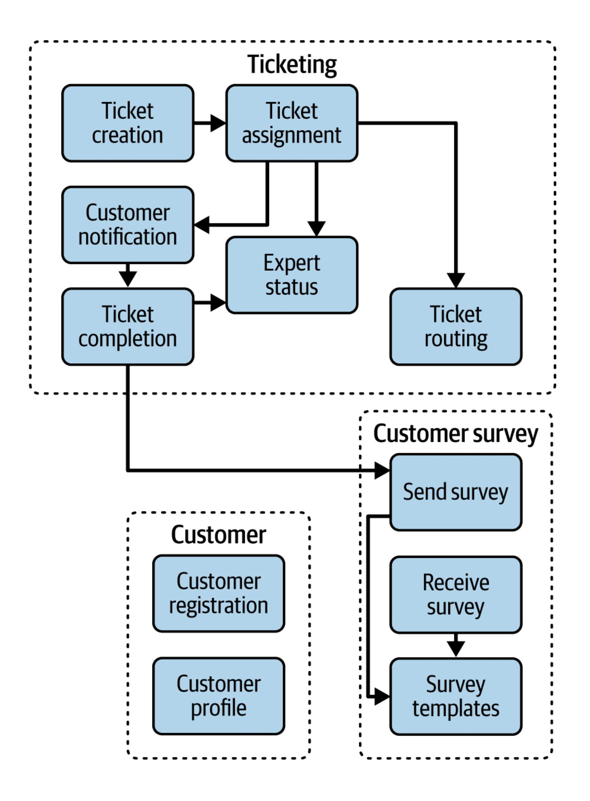
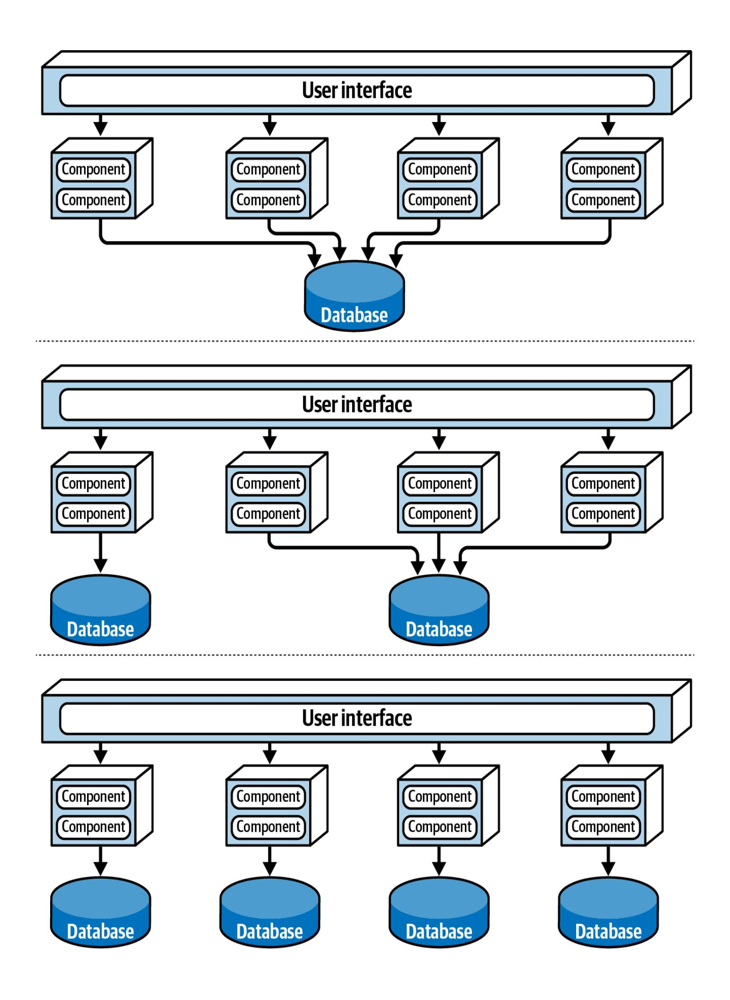

# 26장. 아키텍처적 교차점 (Architektonische Überschneidungen)

이 작업은 AI를 사용하여 번역되었습니다. 피드백 및 의견은 [translation-feedback@oreilly.com](mailto:translation-feedback@oreilly.com)으로 보내주십시오.

지금까지 이 책에서는 아키텍처가 지원해야 하는 중요한 특성을 식별하는 방법, 이러한 특성과 비즈니스 문제에 가장 적합한 아키텍처 스타일을 선택하는 방법, 효과적인 아키텍처 결정을 내리는 방법, 그리고 아키텍처 구현 시 개발 팀을 이끌고 안내하는 방법을 보여주었습니다. 그러나 아키텍처가 제대로 작동하려면 기술 및 비즈니스 환경의 다른 측면과도 조화를 이루어야 합니다. 우리는 이러한 조화를 *아키텍처의 인터페이스*라고 부릅니다.

이 장에서는 소프트웨어 아키텍처를 생성하거나 검증할 때 발생하는 몇 가지 중요한 교차점에 대해 논의합니다.

#### *구현 (Umsetzung)*

구현이 운영 특성, 아키텍처 제약 조건 및 아키텍처의 내부 구조와 관련하여 아키텍처적 관심사와 일치하는가?

### *인프라 (Infrastruktur)*

인프라와 아키텍처가 배포되는 방식이 확장성, 응답성, 내결함성 및 가용성과 같은 아키텍처의 운영적 관심사와 일치하는가?

#### *데이터 토폴로지 (Daten-Topologien)*

널리 무시되는 조화는 아키텍처와 데이터 토폴로지 및 데이터 유형 간의 조화입니다. 데이터 토폴로지(모놀리식, 도메인 데이터베이스 및 서비스당 데이터베이스)는 시스템이 작동하도록 아키텍처 스타일과 일치해야 합니다.

#### *기술적 관행 (Technische Praktiken)*

개발 팀이 소프트웨어를 생성, 유지 관리 및 테스트하는 방식이 해당 아키텍처와 일치하는가? 배포 파이프라인이 아키텍처 스타일에 적합한가?

#### *팀 토폴로지 (Team-Topologien)*

팀이 조직되는 방식은 아키텍처에 상당한 영향을 미칠 수 있으며 그 반대도 마찬가지입니다. 팀 구조가 아키텍처와 제대로 일치하지 않으면 개발 팀은 일반적으로 어려움을 겪고 가장 간단한 변경 사항조차 어렵다고 생각합니다.

#### *시스템 통합 (Systemintegration)*

아키텍처가 다른 어떤 시스템이나 서비스와 통신해야 하는가? 이 인터페이스에 주의를 기울이지 않으면 유지 관리, 신뢰성 및 확장성, 응답성, 가용성과 같은 운영 특성에 치명적인 결과를 초래할 수 있습니다.

#### *기업 (Das Unternehmen)*

아키텍처가 조직 및 기업 내의 프레임워크, 관행, 지침 원칙 및 표준과 일치하는가?

#### *비즈니스 환경 (Das Geschäftsumfeld)*

아키텍처가 비즈니스 환경 및 문제 도메인과 올바르게 일치하는가? 너무 자주 아키텍트들은 이 중요한 교차점을 무시하며, 결과적으로 아키텍처는 비즈니스의 목표나 요구 사항을 충족하지 못하게 됩니다.

#### *생성형 AI (Generative KI)*

대규모 언어 모델(LLM)의 사용 증가는 아키텍처에 어떤 영향을 미치는가? 점점 더 많은 기업이 시스템에 생성형 AI(Gen AI)를 통합함에 따라 이 인터페이스는 빠르게 중요해지고 있습니다.

다음 섹션에서는 이러한 교차점에 대해 더 자세히 설명합니다.

## 아키텍처와 구현 (Architektur und Implementierung)

소프트웨어 아키텍처의 첫 번째 법칙은 소프트웨어 아키텍트가 질문에 가장 자주 답하는 방식이기도 합니다. "그것은 상황에 따라 다르다." 두 번째로 자주 답하는 방식은 아마도 "그것은 구현 세부 사항이다."일 것입니다. 소프트웨어 아키텍처가 목표를 달성하지 못하는 경우, 종종 이 두 번째 답변이 원인입니다.

따라서 아키텍처가 제대로 작동하려면 해당 *구현* (즉, 소스 코드)이 아키텍처의 운영적 관심사(내결함성, 응답성, 확장성 등), 내부 구조 및 제약 조건의 세 가지와 조화를 이루어야 합니다. 이 섹션에서는 이 세 가지 각각을 다룹니다.

### **운영적 관심사 (Betriebliche Belange)**

*운영적 관심사*는 이 책의 [1부](#page--1-0)에서 집중적으로 다루었던 아키텍처적 특성으로, 모든 소프트웨어 아키텍처의 기초를 형성하며 해당 비즈니스 문제를 해결하기 위해 아키텍처가 지원해야 하는 특성입니다. 아키텍처적 특성은 아키텍처 결정의 기초입니다([21장](#page--1-0) 참조).

그렇다면 아키텍처와 구현이 시스템의 운영적 관심사와 관련하여 일치하지 않을 때 어떤 의미일까요? 예를 들어, 수천에서 최대 50만 명의 고객을 동시에 처리해야 하는 새로운 주문 입력 시스템에서 작업하는 아키텍트라고 가정해 봅시다. 당신은 [18장](#page--1-0)의 ["스타일 특성"](#page--1-1)에 나열된 별점 등급을 기반으로 마이크로서비스 아키텍처(Microservices-Architektur)를 선택합니다. 이는 시스템의 높은 확장성(Skalierbarkeit) 및 탄력성(Elastizität) 요구 사항에 적합합니다. 그러나 *구현* 과정에서 개발 팀은 서비스 컨텍스트가 너무 엄격하게 제한되어( [18장](#page--1-0)의 ["제한된](#page--1-2) 컨텍스트" 참조) 주문 배치 서비스가 재고 데이터베이스에 직접 접근할 수 없음을 발견합니다. 대신 고객이 구매하려는 각 품목의 현재 재고를 조회하기 위해 재고 서비스를 동기적으로 호출해야 합니다. 이 동기 호출은 두 서비스 간의 긴밀한 결합을 유발할 뿐만 아니라 시스템의 응답성을 크게 저하시킵니다.

개발 팀은 [그림](#page-5-0) 26-1에 표시된 것처럼 서비스 간에 *복제된 [인메모리 캐시](https://oreil.ly/LQNe4)*를 사용하기로 결정합니다. 데이터는 각 서비스 인스턴스의 *내부 메모리*에 있으며 캐싱을 통해 백그라운드에서 항상 동기화됩니다. 이 목적을 위한 캐싱 제품으로는 [Apache](https://ignite.apache.org/) Ignite 및 [Hazelcast](https://hazelcast.com/)가 있습니다. 이 경우 재고 서비스는 품목 ID와 현재 재고 수를 포함하는 쓰기 가능한 인메모리 캐시를 가지며, 주문 배치 서비스의 각 인스턴스는 해당 캐시의 복제된 읽기 전용 버전을 내부 메모리에 갖게 됩니다. 복제된 인메모리 캐시를 사용하면 서비스가 분리되고 응답성이 *크게* 향상됩니다.

그림 26-1. 개발 팀은 서비스 간에 인메모리 복제 캐싱을 사용하기로 결정했으며, 이는 서비스 확장에 따라 메모리 부족 조건을 유발했습니다.

프로덕션 출시 후 동시 사용자 수가 증가함에 따라 부하를 처리하기 위해 각 서비스의 더 많은 인스턴스가 필요합니다. 부하가 80,000명의 동시 고객에 도달하면 내부 캐시의 메모리 요구 사항이 너무 높아져 모든 가상 머신에서 메모리가 부족해지면서 시스템이 충돌합니다.

이 시나리오에서 아키텍처와 그 구현은 서로 조화를 이루지 못합니다. 아키텍처는 높은 수준의 *확장성*과 *탄력성*을 지원하는 데 중점을 두는 반면, 구현은 *응답성*과 *서비스 분리*에 중점을 둡니다. 두 팀 모두 좋은 결정을 내렸지만, 그들은 다른 목표를 추구하고 있습니다.

### **구조적 무결성 (Strukturelle Integrität)**

[8장](#page--1-0)에서 논리적 컴포넌트(logische Komponenten)가 모든 시스템의 빌딩 블록이며 *논리적 아키텍처*를 형성한다는 것을 배웠습니다. 이들은 일반적으로 소스 코드 저장소의 디렉터리 구조(또는 프로그래밍 언어에 따라 네임스페이스)로 표현됩니다. 논리적 아키텍처는 시스템이 어떻게 작동하고 시스템의 어떤 부분이 다른 부분과 상호 작용하는지를 설명하므로, 소스 코드의 구조가 논리적 아키텍처와 일치하는 것이 중요합니다.

적절한 지침, 지식 및 통제 없이는 개발자가 시스템의 논리적 아키텍처를 무시하고 시스템의 무결성에 미치는 영향을 고려하지 않고 임의로 디렉터리 구조와 네임스페이스를 생성하기 쉽습니다. 이러한 불일치는 유지 관리, 테스트 및 구현이 어려운 아키텍처로 이어집니다. 결과적으로 [그림](#page-7-0) 26-2에 표시된 논리적 아키텍처처럼 신뢰성이 떨어지고 새로운 기능에 따라 진화하거나 적응하기 어렵게 됩니다.

소스 코드의 구조가 논리적 아키텍처와 일치하도록 보장하기 위해 Java 플랫폼용 [ArchUnit](https://archunit.org/), .NET 플랫폼용 [ArchUnitNet](https://oreil.ly/qgPAf) 및 [NetArchTest](https://oreil.ly/2ZX8p), Python용 [PyTestArch](https://oreil.ly/NmRZI) 또는 TypeScript 및 JavaScript용 [TSArch](https://oreil.ly/4Z8Ze)와 같은 자동화된 거버넌스 도구 사용을 권장합니다. 아키텍트와 개발 팀 간의 좋은 의사소통 및 협업과 함께 이러한 자동화된 도구는 [그림](#page-9-0) 26-3에 표시된 것처럼 아키텍처에 정확하게 맞춰진 구현을 보장합니다.

[그림](#page-7-0) 26-2와 [그림](#page-9-0) 26-3을 비교하십시오. [그림](#page-9-0) 26-3의 아키텍처는 [그림](#page-7-0) 26-2의 잘못 정렬된 아키텍처보다 훨씬 더 유지 관리 가능하고, 테스트 가능하고, 배포 가능하고, 신뢰성 있고, 적응 가능하며, 확장 가능합니다. 이 비교는 이러한 유형의 구현 정렬이 얼마나 중요한지 강조합니다.

### **아키텍처 제약 조건 (Architektonische Zwänge)**

*제약 조건(Constraint)*은 목표 달성에 필요한 아키텍처 내의 특정 유형의 제한(예: REST 통신 제한 또는 특정 데이터베이스 유형 사용)을 설명하는 규칙 또는 원칙입니다. 시스템 구현이 제약 조건을 따르지 않으면 아키텍처는 실패합니다. 따라서 소프트웨어 아키텍트의 임무 중 하나는 아키텍처의 *제약 조건*을 식별하고 전달하는 것입니다.

이 특정 교차점이 의미하는 바를 명확히 하기 위해, 매우 제한된 예산과 촉박한 일정으로 새로운 시스템을 도입하려는 기업을 상상해 봅시다. 이 기업은 데이터베이스에 많은 구조적 변경을 예상하며 이러한 변경을 가능한 한 빨리 수행해야 합니다. 이 경우 전통적인 계층형 아키텍처(Schichtenarchitektur)([10장](#page--1-0) 참조)는 단순성, 비용 효율성 및

기술적 분할(Partitionierung)로 인해 탁월한 솔루션이 될 것입니다. 이 스타일에서는 계층이 분리되어 있으므로 데이터베이스 변경은 단일 계층에서만 수행될 수 있어 더 간단하고 빠릅니다.

이 특정 비즈니스 문제에서 계층형 아키텍처가 작동하려면 아키텍트가 다음 제약 조건을 정의해야 합니다.

- 모든 데이터베이스 로직은 지속성 계층(Persistenzschicht)에 있어야 합니다.
- 프레젠테이션 계층(Präsentationsschicht)은 간단한 쿼리라도 모든 계층을 통과해야 하며, 지속성 계층에 직접 접근할 수 없습니다.

이러한 제약 조건은 데이터베이스 로직이 아키텍처 전체에 확산되는 것을 방지하고, 물리적 데이터베이스 구조의 변경(예: 테이블 삭제 또는 열 이름 변경)이 지속성 계층 외부의 코드에 영향을 미치지 않도록 하는 데 필요합니다.

UI 개발자가 데이터베이스를 직접 호출하는 것이 더 빠르다고 판단하고 대신 이러한 방식으로 아키텍처를 구현한다고 가정해 봅시다. 또한 백엔드 개발자는 비즈니스 로직과 데이터베이스 로직이 함께 있을 때 코드를 유지 관리하고 테스트하는 것이 훨씬 쉽다고 판단하여 이러한 제약 조건을 무시하고 아키텍처의 비즈니스 계층(Geschäftsschicht)에서 이러한 관심사를 결합합니다. 이 구현은 아키텍처의 제약 조건과 일치하지 않아 데이터베이스 변경이 모든 계층의 전체 코드에 영향을 미치고, 너무 오래 걸리며, 시스템이 비즈니스 목표를 달성하지 못하게 됩니다.

아키텍처 도구는 아키텍처 제약 조건을 관리하는 데도 유용합니다.

## 아키텍처와 인프라 (Architektur und Infrastruktur)

소프트웨어 아키텍처의 범위는 지난 수십 년 동안 확장되어 더 많은 책임과 관점을 포함하게 되었습니다. 2000년대 중반에는 아키텍처와 운영 간의 전형적인 관계는 계약적이고 공식적이었으며 많은 관료주의가 있었습니다. 대부분의 회사는 운영 시간, 확장, 응답성 및 기타 중요한 특성에 대한 SLA(Service Level Agreement)를 통해 자체 운영의 복잡성을 피하기 위해 운영을 제3자에게 아웃소싱했습니다. 그러나 오늘날 마이크로서비스(Microservices)와 같은 아키텍처는 과거에는 전적으로 운영적이었던 특성을 사용합니다. 예를 들어, 탄력적 확장성(elastische Skalierbarkeit)은 이전에는 공간 기반 아키텍처([16장](#page--1-0) 참조)에 내장되었지만, 오늘날 마이크로서비스에서는 아키텍트와 DevOps 간의 긴밀한 협력을 통해 덜 고통스럽게 다루어집니다.

#### **역사: PETS.COM이 우리에게 탄력적 확장성을 선사한 방법 (GESCHICHTE: WIE PETS.COM UNS EINE ELASTISCHE WAAGE SCHENKTE)**

사람들은 종종 오늘날의 기술적 능력(탄력적 확장성 등)이 언젠가 영리한 개발자에 의해 발명되었다고 가정합니다. 그러나 현실에서는 최고의 아이디어가 종종 힘든 교훈에서 탄생합니다. Pets.com은 초기 사례입니다. 이 전자상거래 웹사이트는 1998년에 애완동물 용품 분야의 Amazon.com이 되겠다는 희망으로 시작되었습니다. 뛰어난 마케팅 부서는 설득력 있는 마스코트를 만들었습니다. 무례한 말을 하는 마이크가 달린 양말 인형이었습니다. 이 마스코트는 슈퍼스타가 되어 퍼레이드와 전국 스포츠 행사에서 대중 앞에 나타났습니다.

불행히도 Pets.com 경영진은 마스코트에 모든 돈을 쏟아붓고 인프라에는 투자하지 않은 것으로 보입니다. 주문이 밀려들자 그들은 준비되지 않았습니다. 웹사이트는 느렸고, 거래는 손실되었고, 배송은 지연되었습니다... 거의 최악의 시나리오였습니다. 재앙적인 크리스마스 판매 직후 Pets.com은 문을 닫고 유일한 귀중한 자산인 마스코트를 팔았습니다.

Pets.com에 필요했던 것은 *탄력적 확장성(elastische Skalierbarkeit)*이었습니다. 즉, 필요할 때 더 많은 리소스 인스턴스를 시작할 수 있는 능력이었습니다. 클라우드 제공업체는 오늘날 이 기능을 표준으로 제공하지만, 초기 전자상거래 회사들은 자체 인프라를 관리해야 했으며, 많은 회사들이 이전에는 알려지지 않았던 현상의 희생양이 되었습니다. 즉, 너무 많은 성공이 회사를 망칠 수 있다는 것이었습니다. Pets.com의 사례와 다른 유사한

끔찍한 이야기들은 아키텍트들이 소프트웨어 아키텍처를 개발할 때 이러한 교차점에 더 많은 주의를 기울이도록 만들었습니다.

아키텍처와 인프라의 교차점은 운영 아키텍처 특성을 가능하게 하기 때문에 중요합니다. *아키텍처*가 높은 확장성(Skalierbarkeit)을 지원할 수 있다고 해서 반드시 그렇게 하는 것은 아닙니다. 해당 *인프라*가 이를 지원하지 않으면 그렇게 하지 않을 것입니다(Pets.com 사례에서 알 수 있듯이). 우리 고객의 경우, 아키텍트와 개발자가 아키텍처의 오류에 대해 비난받는 경우가 너무 많았는데, 이는 실제로는 아키텍처와 인프라 간의 잘못된 조화 때문이었습니다.

대부분의 경우 이러한 불일치는 아키텍트와 인프라 및 운영 담당자 간의 의사소통 및 협업 부족 때문입니다. 아키텍트는 확장성, 응답성, 내결함성, 성능, 가용성, 탄력성 등과 같은 특성에 대한 인프라의 영향에 대한 인식이 부족한 경우가 많습니다. 이러한 불일치로 인해 DevOps 분야가 탄생했습니다.

수년 동안 많은 기업은 운영을 소프트웨어 개발과 분리된 것으로 간주하고 종종 비용 절감을 위해 제3자 회사에 아웃소싱했습니다. 1990년대와 2000년대에는 운영이 아웃소싱되어 아키텍트의 통제 범위를 벗어난다는 가정하에 많은 아키텍처가 설계되었습니다. (이에 대한 좋은 예는 [16장](#page--1-0)에서 찾을 수 있습니다.) 그러나 2000년대 중반부터 기업들은 많은 운영적 관심사를 통합하는 새로운 형태의 아키텍처를 실험하기 시작했습니다. 오케스트레이션된 SOA와 같은 이전 아키텍처는 확장성 및 탄력성과 같은 기능을 지원하기 위해 복잡한 도구와 프레임워크가 필요하여 구현이 상당히 어려웠습니다. 따라서 아키텍트들은 확장, 성능, 탄력성 및 기타 다양한 기능을 *내부적으로* 처리할 수 있는 아키텍처를 구축했습니다. 부작용은 이러한 아키텍처가 훨씬 더 복잡해졌다는 것입니다.

마이크로서비스 아키텍처의 창시자들은 운영적 관심사를 운영 팀이 더 잘 처리할 수 있다는 것을 인식했습니다. 아키텍처와 운영 간의 협력을 통해 아키텍트들은 설계 단순화하고 운영 팀이 가장 잘하는 일에 의존할 수 있다는 것을 깨달았습니다. 그들은 운영 팀과 협력하여 마이크로서비스를 개발하고 이후 DevOps 운동의 기반을 마련했습니다. DevOps가 도움이 되었지만, 아키텍처와 인프라의 교차점은 대부분의 기업에서 여전히 문제입니다.

인프라가 덜 문제가 되더라도 클라우드 환경은 여전히 아키텍처와 잘못 정렬될 수 있습니다. 예를 들어, 지역 또는 가용 영역에 걸쳐 서비스를 배포하면 복제된 인메모리 캐시 및 분산 캐시의 성능 및 데이터 무결성 이점이 감소하거나 심지어 사라질 수 있습니다. 마찬가지로, 동일한 가상 머신에서 서비스, 컨테이너 또는 심지어 Kubernetes Pod를 공유하면 성능이 크게 향상될 수 있지만, 확장성, 내결함성, 가용성 및 탄력성이 손상될 수도 있습니다.

아키텍처와 인프라의 조화는 아키텍트와 인프라 팀 구성원 간의 긴밀한 의사소통 및 협업 또는 심지어 DevOps 관행 도입을 통해 모든 관련자가 중요한 운영적 관심사를 이해하도록 요구합니다. 그래야만 아키텍트가 선택한 아키텍처의 운영적 이점, 즉 우리가 이 멋진 별 다섯 개 평가를 받게 된 이점을 진정으로 인식할 수 있습니다.

## 아키텍처와 데이터 토폴로지 (Architektur und Datentopologien)

아키텍처와 데이터 토폴로지의 교차점은 종종 간과됩니다. 잘못된 데이터베이스 유형이나 잘못된 토폴로지를 선택하면 아키텍처에 해를 끼치고 최고의 아키텍처적 특성을 망칠 수 있습니다. 예를 들어, 모놀리식 데이터베이스는 좋은 데이터 일관성(Datenkonsistenz)과 트랜잭션 지원을 제공하지만, 확장성(Skalierbarkeit)과 내결함성(Fehlertoleranz)을 저해할 수 있습니다. 마찬가지로, 분산 데이터베이스 토폴로지는 확장성 및 변경 제어에 적합하지만, 시스템의 데이터 무결성(Datenintegrität), 데이터 일관성 및 성능에 영향을 미칠 수 있습니다.

다음 섹션에서는 아키텍처와 데이터 토폴로지의 교차점에 대해 설명합니다.

### **데이터베이스 토폴로지 (Datenbank-Topologie)**

[15장](#page--1-0)에서 논의한 데이터베이스의 *토폴로지(Topologie)*는 아키텍처 내에서 물리적 데이터베이스가 어떻게 구성되는지를 나타냅니다. 세 가지 기본 토폴로지가 있습니다: 모놀리식 데이터베이스, 분산 도메인 기반 데이터베이스 또는 분산 서비스당 데이터베이스 토폴로지. [그림](#page-18-0) 26-4는 이러한 기본 데이터베이스 토폴로지를 보여줍니다.

데이터베이스 토폴로지는 제대로 작동하려면 아키텍처와 일치해야 합니다. 예를 들어, 마이크로서비스 아키텍처는 엄격하게 제한된 컨텍스트를 유지하기 위해 일반적으로 서비스당 데이터베이스 패턴을 사용합니다. 이러한 정렬이 없으면 아키텍트가 변경 사항을 제어하기가 매우 어려워지며, 내결함성, 확장성, 탄력성, 유지 관리 가능성, 테스트 가능성 및 배포 가능성과 같은 시스템의 운영 특성이 저하될 것입니다. 그러나 서비스 기반 아키텍처([14장](#page--1-0) 참조)와 같은 일부 스타일은 물리적 데이터베이스 토폴로지에 더 유연합니다.

### **아키텍처 특성 (Architektonische Merkmale)**

이 책의 [2부](#page--1-0)에서 우리는 모든 아키텍처 스타일이 고유한 강점(4~5점)과 약점(1~2점)을 가지고 있음을 보여주었습니다. 이는 데이터베이스 유형에도 적용되며, 시스템의 아키텍처적 강점과 해당 데이터베이스 유형의 강점을 일치시키는 것이 중요합니다. 우리 책 *Softwarearchitektur: The Hard Parts*에서 저자들은 관계형(relational), 키-값(Key-Value), 문서(Document), 칼럼형(Columnar), 그래프(Graph), NoSQL의 여섯 가지 다른 데이터베이스 유형의 특성을 평가했습니다. 확장성(Skalierbarkeit)과 탄력성(Elastizität)이 마이크로서비스, 이벤트 기반 및 공간 기반 아키텍처의 강점이라는 것을 기억할 것입니다. 이는 키-값 및 칼럼형 데이터베이스에도 적용됩니다. 이는 이러한 데이터베이스 유형이 이러한 아키텍처 특성을 강화하는 데 좋은 선택임을 의미합니다.

### **데이터 구조 (Datenstruktur)**

저장되고 접근되는 데이터의 구조 또한 이 교차점의 요소입니다. *데이터 구조*가 관계형, 즉 상호 의존적인 관계 계층을 기반으로 하는 경우 관계형 데이터베이스가 적합합니다. 그러나 관계형 데이터베이스에 키-값 쌍을 저장하는 것은 데이터베이스와 아키텍처 모두에서 비효율성을 초래할 수 있는 불일치입니다. 모든 데이터가 동일한 구조를 갖는 것은 아니므로 이 점을 명심하십시오. 일부 데이터는 관계형일 수 있고, 다른 데이터는 문서 기반일 수 있으며(특히 JSON 기반 이벤트 또는 요청 페이로드를 저장할 때), 또 다른 데이터는 키-값 기반일 수 있습니다. 특정 아키텍처 내에서 데이터 구조의 잠재적 다양성을 고려할 때, 가능하면 다중 언어 데이터베이스(polyglotte Datenbanken)를 사용하는 것을 권장합니다.

### **읽기/쓰기 우선순위 (Lese-/Schreibpriorität)**

비즈니스 문제가 높은 읽기 또는 쓰기 볼륨을 요구하는 경우, 이는 데이터베이스 토폴로지를 아키텍처에 맞추는 데 중요한 정보입니다. 예를 들어, 아키텍처가 드문 읽기 작업에 비해 높은 쓰기 볼륨을 요구하는 경우 칼럼형 데이터베이스(spaltenbasierte Datenbank)가 좋은 솔루션이 될 것입니다. 그 반대

경우, 즉 높은 읽기 볼륨이 우선순위인 경우 키-값 데이터베이스, 문서 데이터베이스 또는 그래프 데이터베이스가 더 적합할 것입니다. 시스템이 읽기 및 쓰기 작업을 거의 동일하게 가중치를 두는 경우 관계형 및 NewSQL 데이터베이스가 좋은 선택입니다. 이 요소를 고려하지 않으면 시스템이 제대로 작동하지 않을 수 있습니다.

## 아키텍처와 엔지니어링 관행 (Architektur- und Ingenieurpraktiken)

20세기 후반에는 워터폴(Waterfall)과 애자일(Agile)의 많은 변형(스크럼(Scrum), 익스트림 프로그래밍(Extreme Programming), 린(Lean) 및 크리스탈(Crystal) 등)을 포함하여 수십 가지의 소프트웨어 개발 방법론이 인기를 얻었습니다. 당시 대부분의 아키텍트들은 개발을 완전히 별개의 프로세스로 보았기 때문에 이 모든 것이 소프트웨어 아키텍처에 영향을 미치지 않는다고 생각했습니다. 그러나 최근 몇 년 동안 기술의 발전으로 소프트웨어 아키텍처도 프로세스의 영향을 받게 되었습니다. *소프트웨어 개발 프로세스*와 *기술적 방법*을 분리하는 것이 합리적입니다. *프로세스*는 팀이 구성되고 관리되는 방식, 회의가 진행되는 방식, 워크플로가 조직되는 방식, 즉 사람들이 자신을 조직하고 협력하는 메커니즘을 의미합니다. 반면 *개발 관행*은 팀이 소프트웨어를 개발하고 출시하는 데 사용하는 프로세스 독립적인 기술과 도구를 나타냅니다. 예를 들어, 익스트림 프로그래밍(XP), 지속적 통합(CI), 지속적 배포(CD) 및 테스트 주도 개발(TDD)은 특정 프로세스에 의존하지 않는 입증된 기술적 *방법*입니다. 따라서 *소프트웨어 개발*이라는 용어는 소프트웨어 개발과 이러한 관행을 모두 포함합니다.

기술적 관행에 집중하는 것은 중요합니다. 소프트웨어 개발은 더 성숙한 엔지니어링 분야의 많은 특성이 부족합니다. 예를 들어, 건축 엔지니어는 소프트웨어 개발자가 소프트웨어 구조의 유사한 측면을 예측하는 것보다 훨씬 더 정확하게 구조적 변화를 예측할 수 있습니다. 이는 소프트웨어 개발의 아킬레스건이 추정이라는 것을 의미합니다. 즉, 시간, 리소스, 비용은 얼마나 들까요? 이러한 어려움의 한 가지 이유는 전통적인 추정 방법이 소프트웨어 개발의 탐색적 특성과 소프트웨어 개발에서 일반적으로 발생하는 미지의 요소를 적절하게 다루지 못하기 때문입니다.

프로세스는 대부분 아키텍처와 분리되어 있지만, 반복적인 프로세스가 그 본질에 더 잘 맞습니다. 마이크로서비스(Microservices)와 같은 현대적인 시스템을 워터폴(Waterfall)과 같은 오래된 프로세스로 구축하려고 시도하면 큰 마찰이 발생할 것입니다. 애자일(Agile) 방법론이 진정으로 빛을 발하는 아키텍처의 한 측면은 한 아키텍처 스타일에서 다른 아키텍처 스타일로의 마이그레이션입니다. 애자일 방법론은 긴밀한 [피드백 루프](https://oreil.ly/ZRpCc)를 가지며 스트랭글러 패턴(Strangler Pattern) 및 [기능 토글](https://oreil.ly/dqpyK)과 같은 기술을 장려하므로 계획 중심적인 프로세스보다 이러한 변화를 더 잘 지원합니다.

아키텍트(Architekt)는 종종 프로젝트의 기술 리더 역할도 수행하므로 팀이 어떤 기술적 방법을 사용하는지 결정합니다. 아키텍처를 선택하기 전에 문제 도메인(Problemdomäne)을 신중하게 검토해야 하는 것과 마찬가지로, 아키텍트도 아키텍처 스타일과 기술적 관행이 서로 조화를 이루는지 확인해야 합니다. 예를 들어, 마이크로서비스(Microservices) 아키텍처 철학은 팀이 배포(Bereitstellung), 테스트(Testen) 및 머신 배포(Deployment)와 같은 작업을 자동화할 것이라고 가정합니다. 오래된 운영 그룹, 수동 프로세스, 적은 테스트로 마이크로서비스 아키텍처를 구축하려고 시도하면 실패할 가능성이 높습니다. 특정 아키텍처에 적합한 다양한 문제 영역이 있듯이 다양한 기술적 방법도 마찬가지입니다.

기술적 관행의 발전이 새로운 아키텍처 기능을 가능하게 함에 따라 익스트림 프로그래밍(Extreme Programming)부터 지속적 배포(Continuous Delivery)에 이르기까지 사고의 진화는 계속됩니다. Neal의 저서 *Building Evolutionary [Architectures](https://learning.oreilly.com/library/view/building-evolutionary-architectures/9781492097532)*는 아키텍처 제어를 자동화하는 기술적 관행과 아키텍처의 교차점에 대한 새로운 사고방식을 제시합니다. 이 책은 아키텍처 특성에 대한 중요한 새로운 명명법과 사고방식을 제공하고 시간이 지남에 따라 우아하게 변화하는 아키텍처를 구축하기 위한 기술을 다룹니다.

소프트웨어 개발 세계에서는 아무것도 정적이지 않습니다. 아키텍트(Architekt)는 특정 기준을 충족하도록 시스템을 설계할 수 있지만, 설계가 구현과 불가피한 변화를 모두 견딜 수 있도록 하려면 *진화하는 아키텍처(evolutionäre Architektur)*가 필요합니다.

*Building Evolutionary Architectures*는 시간이 지남에 따라 아키텍처 특성을 보호하고(제어하고) 변화시킬 수 있도록 *아키텍처 피트니스 기능(architektonische Fitnessfunktionen)*을 사용하는 개념을 소개합니다. [6장](#page--1-0)에서 우리는 아키텍처 피트니스 기능이 특정 아키텍처 특성의 무결성에 대한 객관적인 평가를 얻는 방법이라는 것을 알고 있습니다. 이 평가는 메트릭, 단위 테스트, 모니터 및 카오스 엔지니어링(Chaos Engineering)과 같은 다양한 메커니즘을 포함할 수 있습니다.

피트니스 기능이 이 교차점을 정렬하는 데 어떻게 도움이 되는지 보려면 짧은 시장 출시 시간(Markteinführungszeit)이라는 비즈니스 문제를 고려해 보십시오. 시장 출시 시간은 *민첩성(Agilität)*, 즉 변화에 신속하게 대응하는 시스템의 능력과 동일합니다. 민첩성은 유지 관리 가능성(Wartbarkeit), 테스트 가능성(Testbarkeit) 및 배포 가능성(Einsatzfähigkeit)으로 구성된 복합 아키텍처 특성입니다([6장](#page--1-0) 참조). 이 세 가지 아키텍처 특성 모두 기술적 관행과 절차의 영향을 받으며 피트니스 기능을 통해 측정하고 추적할 수 있습니다. 예를 들어, 마이크로서비스(Microservices)와 서비스 기반 아키텍처(servicebasierte Architekturen)는 모두 높은 수준의 민첩성을 지원합니다. 그러나 이러한 아키텍처 특성을 둘러싼 기술적 절차가 아키텍처와 일치하지 않으면 시스템은 민첩성 목표 및 요구 사항을 충족하지 못할 것입니다. 피트니스 기능을 사용하면 불일치를 감지하고 아키텍트가 아키텍처에 엔지니어링 관행을 조정하거나(또는 그 반대로) 조치를 취하도록 요청할 수 있습니다.

## 아키텍처와 팀 토폴로지 (Architektur und Team-Topologien)

이 책의 [2부](#page--1-0)에서 논의한 바와 같이, 팀 토폴로지는 소프트웨어 아키텍처에 직접적인 영향을 미칠 수 있으며 그 반대도 마찬가지입니다. 이러한 조화는 매우 중요하므로 이 책에서 소개하는 각 아키텍처 스타일에 팀 토폴로지에 대한 섹션을 포함했습니다.

팀 토폴로지가 아키텍처와 일치할 수 있는 가장 기본적인 방법 중 하나는 분할(Partitionierung) 유형입니다. 아키텍처와 마찬가지로 팀도 도메인별 또는 기술적 영역으로 나눌 수 있습니다. 도메인별로 구조화된 팀은 전문 분야에 따라 조직되며 일반적으로 팀 내에서 전문성을 갖춘 교차 기능(funktionsübergreifend) 팀입니다. 예를 들어, 도메인별로 구조화된 팀은 시스템의 고객 중심 부분에 집중하고 사용자 인터페이스에서 데이터베이스에 이르는 고객 관련 기능의 엔드투엔드 처리를 담당할 수 있습니다. 반면 기술적으로 분할된 팀은 각각 아키텍처의 특정 기술 기능에 집중하며 일반적으로 기술 범주에 따라 조직됩니다. UI 팀, 백엔드 처리 팀, 공유 서비스 팀 및 데이터베이스 팀은 계층형 아키텍처(Schichtenarchitektur) 스타일에 매우 잘 맞을 것입니다. 또는 이러한 팀은 기술적으로 비즈니스 기능 팀과 데이터 동기화 팀으로 나눌 수 있으며, 이는 공간 기반 아키텍처(raumbezogener Architekturstil) 스타일에 잘 맞을 것입니다.

시스템의 성공을 보장하기 위해서는 팀이 어떻게 조직되는지 이해하는 것이 중요합니다. 조직의 팀 토폴로지가 아키텍처와 일치하지 않으면 팀은 아키텍처를 구현하고 유지 관리하는 데 어려움을 겪을 것이며, 비즈니스 목표를 달성할 가능성이 낮습니다.

## 아키텍처와 시스템 통합 (Architektur und Systemintegration)

시스템은 거의 고립되어 존재하지 않습니다. 대부분은 다른 시스템의 추가 처리 및 데이터를 필요로 하며, 이는 우리를 아키텍처와 시스템 통합의 교차점으로 이끌니다. 시스템이 추가 처리를 수행하거나 데이터를 검색하기 위해 다른 시스템과 통신해야 할 때, 아키텍트는 일련의 도전 과제와 영향을 마주하게 됩니다. 예를 들어, 호출되는 시스템이 사용 가능한가? 호출하는 시스템의 요구 사항을 충족할 만큼 확장 가능하고 강력한가?

아키텍트가 시스템 통합에 충분한 주의를 기울이지 않으면, 시스템의 정적 및 동적 결합(Kopplung)으로 인해 확장 불가능하고, 응답성이 떨어지고, 유연성이 부족한 아키텍처가 자주 발생합니다. 다른 시스템과 통합할 때는 어떤 통신 프로토콜을 사용할지, 시스템 간에 어떤 유형의 계약을 맺어야 할지, 시스템의 아키텍처 특성이 호환되는지, 그리고 통합이 각 시스템의 아키텍처적 퀀텀(Quantum)을 보존하는지 고려해야 합니다.

## 아키텍처와 기업 (Architektur und das Unternehmen)

모든 기업에는 일련의 표준과 지침 원칙이 있습니다. *기업(Unternehmen)*이란 기업 내의 모든 시스템과 제품(또는 기업 내의 부서나 영역)의 총체를 의미합니다. 예를 들어, 많은 기업은 시스템 유형에 관계없이 아키텍처 솔루션에 대한 특정 보안 표준, 관행 또는 절차를 규정합니다. 기업 표준에는 플랫폼, 기술, 문서화 표준 및 다이어그램 표준 등이 포함될 수 있습니다. 기업 수준의 표준 및 관행에 주의를 기울이고 아키텍처가 이들과 일치하는지 확인하십시오.

우리는 아키텍트가 기업 수준의 관행, 표준 및 절차를 무시한 많은 상황을 목격했습니다. 그 결과는 일반적으로 아키텍처 솔루션이 아무리 효과적이라도 실패한 "단독 솔루션"으로 간주되어 폐기되었습니다. 아키텍처의 성공을 보장하기 위해 아키텍처를 기업의 관행과 조화시키는 것이 얼마나 중요한지 아무리 강조해도 지나치지 않습니다.

# 아키텍처와 경제 환경 (Architektur und das wirtschaftliche Umfeld)

기업 환경은 시스템 아키텍처에 상당하고 *직접적인* 영향을 미치며(그 반대도 마찬가지), 기업 환경은 끊임없이 변화합니다. 기업은 생존을 위해 엄격한 비용 절감 조치를 취해야 하는가, 아니면 공격적으로 확장하고 있는가? 기업은 급변하고 경쟁이 치열한 시장에서 틈새시장을 찾기 위해 매 분기마다 스스로를 재정비해야 하는가, 아니면 안정적인 위치에 있는가? 효과적인 소프트웨어 아키텍트(Softwarearchitekt)는 기업의 위치와 방향을 이해하고 중요한 시스템의 아키텍처를 비즈니스 환경에 맞게 조정합니다.

우리는 이러한 정렬을 *도메인-아키텍처 동형성(Domänen-zu-Architektur-Isomorphismus)*이라고 부릅니다. 예를 들어, 극단적인 비용 절감 조치를 취하는 기업은 마이크로서비스(Microservices) 또는 공간 기반 아키텍처(raumbezogenen Architekturen)와 잘 맞지 않을 것입니다. 왜냐하면 이러한 아키텍처는 구축 및 유지 관리 비용이 매우 많이 들기 때문입니다. 반대로, 인수합병을 통해 공격적으로 확장하는 기업은 진화하고 적응할 수 없는 모놀리식 아키텍처(monolithischen Architekturen)로는 제대로 운영되지 않을 것입니다.

아키텍트가 이 교차점에서 직면하는 전형적인 문제는 기업의 변화, 특히 *알 수 없는 변화*입니다. 전 미국 국방부 장관 도널드 럼즈펠드(Donald Rumsfeld)는 언젠가 [이렇게 말했습니다.](https://oreil.ly/PQCJk)

*우리가 아는 것이 있고, 우리는 그것을 알고 있다는 것을 압니다. 우리는 또한 알려진 미지수가 있다는 것을 압니다. 즉, 우리가 모르는 것이 있다는 것을 압니다. 그러나 알 수 없는 미지수도 있습니다. 즉, 우리가 모른다는 것을 모르는 것들이 있습니다.*

많은 제품과 시스템은 *알려진 미지수(bekannter Unbekannter)* 목록으로 시작합니다. 즉, 개발자가 해당 영역과 기술에 대해 배워야 하고, 변경될 것이라는 것을 알고 있는 것들입니다. 그러나 이러한 시스템은 *알 수 없는 미지수(unbekannten Unbekannten)*의 희생양이 되기도 합니다. 즉, 아무도 나타날 것이라고 예상하지 못했지만 예상치 못하게 나타나는 것들입니다. "알 수 없는 미지수"는 소프트웨어 시스템의 숙적입니다. 이것이 모든 "빅 디자인 업 프론트(Big Design Up Front)" 소프트웨어 노력이 어려움을 겪는 이유입니다. 아키텍트는 알 수 없는 미지수를 위해 설계할 수 없습니다. Mark를 인용하자면:

*모든 아키텍처는 알 수 없는 미지수로 인해 반복됩니다. 애자일(Agile)은 이것을 단순히 인식하고 더 빨리 만듭니다.*

소프트웨어 아키텍처의 변화를 계획하는 것은 *어렵습니다*. 진화하는 아키텍처(Evolutionäre Architektur) 관행은 끊임없이 변화하는 비즈니스 환경을 관리하는 데 도움이 되며, 반복적인 아키텍처도 마찬가지입니다. *이식성(Übertragbarkeit)*, *확장성(Skalierbarkeit)*, *개발 가능성(Entwicklungsfähigkeit)* 및 *적응성(Anpassungsfähigkeit)*과 같은 아키텍처 특성은 소프트웨어 아키텍처를 더 유연하고 적응 가능하게 만드는 데 기여합니다.

복잡성 이론과 소프트웨어 설계 전문 소프트웨어 아키텍트인 Barry O'Reilly는 기업의 끊임없는 변화에 대한 새로운 사고방식인 *잔류 이론(Residualitätstheorie)*을 개발했습니다. 그의 저서 *Residues: Time, Change, and Uncertainty in Software Architecture* (Leanpub, 2024)에서 O'Reilly는 비즈니스 변화를 *스트레스 요인(Stressoren)*으로, 해당 아키텍처 변화를 *잔류물(Residuen)*로 취급하는 기술을 설명합니다. 그의 이론은 아키텍트가 아키텍처에 점점 더 많은 잔류물을 통합하여 변화에 반응할 때, 이러한 잔류물이 결국 아키텍트가 예측할 수 없는 *알 수 없는* 변화를 다루게 되어 복잡성 이론의 의미에서 임계 상태에 도달한 아키텍처가 생성된다고 말합니다. 이것은 우리가 면밀히 관찰할 흥미로운 이론입니다.

## 아키텍처와 생성형 AI (Architektur und generative KI)

이 책의 2판을 쓰고 있는 2025년 초, *생성형 인공지능(generative künstliche Intelligenz)* (Gen AI)과 대규모 언어 모델(LLM)은 소프트웨어 개발 및 소프트웨어 설계의 세계에 침투했습니다. 많은 기업이 과거에는 인간이 수동으로 수행했던 작업을 처리하기 위해 시스템에 이를 통합하고 있습니다. 당연히 Gen AI는 소프트웨어 아키텍처에도 영향을 미치고 있습니다. 아키텍트들은 LLM을 자신의 소프트웨어 아키텍처에 통합하고 있으며, 일부는 심지어 Gen AI 도구를 사용하여 어려운 문제를 해결하는 데 도움을 받고 있습니다.

### **아키텍처에 생성형 AI 통합하기 (Generative KI in die Architektur einbinden)**

아키텍처에 Gen AI를 통합하는 데 권장하는 한 가지 접근 방식은 *추상화(Abstraktion)*와 *모듈성(Modularität)*을 활용하는 것입니다. LLM이 다른 LLM으로 신속하게 교체될 수 있도록 하고, 다양한 LLM의 가드레일(rails)과 평가 결과(evals)가 고려되는 것이 중요합니다.

예를 들어, 구직 회사가 이력서를 익명화하여 편견을 줄이고 지원자의 인구 통계나 기타 요인 대신 능력에 집중하기 위해 Gen AI를 사용하려고 한다고 가정해 봅시다. 이 작업은 일반적으로 사람이 수행하지만, LLM이 쉽게 수행할 수도 있습니다. 그러나 LLM의 결과가 정확한가? 이력서에서 너무 많은 정보를 제거하는가? 너무 많은 인구 통계 정보를 그대로 두는가? 이러한 유형의 시스템에서는 샘플과 메트릭을 수집하고 LLM 머신을 비교하는 것이 필수적입니다. [Langfuse](https://langfuse.com/)와 같은 도구는 아키텍처 내에서 이러한 유형의 관찰 가능성(Beobachtbarkeit)을 만드는 데 도움이 됩니다.

### **아키텍트의 조수로서 생성형 AI (Generative KI als Assistent für Architekten)**

올바른 프롬프트(Eingabeaufforderung)를 사용하면 LLM([Copilot](https://oreil.ly/kaEdv)과 같은)이 개발자의 많은 시간과 노력을 절약할 수 있는 소스 코드를 생성할 수 있습니다. 예를 들어 "반복되는 숫자가 없는 고유한 4자리 PIN 번호를 생성하는 C# 프로그래밍 언어 코드를 작성하시오"와 같이 매우 구체적이고 결정론적인 문제를 해결하는 데 탁월합니다. 그러나 LLM 기술이 소프트웨어 아키텍트(Softwarearchitekten)의 일반적인 작업을 지원할 수 있을까요? 다음은 아키텍처 관련 프롬프트의 몇 가지 일반적인 예입니다.

- 위험 평가(Risikobewertung): "이 아키텍처에 위험 영역이 있습니까?"
- 위험 완화(Risikominderung): "이러한 위험을 어떻게 해결해야 합니까?"
- 안티패턴(Antipatterns): "이 아키텍처에 일반적인 안티패턴이 있습니까?"
- 결정(Entscheidungen): "이 워크플로우에 오케스트레이션(Orchestration)과 코레오그래피(Choreografie) 중 무엇을 사용해야 합니까?"

이 2판을 작성하는 시점(2025년 초)에는 이 시도에서 큰 성공을 거두지 못했습니다. 특정 상황에 마이크로서비스(Microservices)와 공간 기반 아키텍처(raumbezogene Architektur) 중 어느 것이 가장 적합한지 LLM에 물어보면 올바른 답을 얻는 경우는 거의 없습니다. 왜일까요? 이 책에서 보여주었듯이 *소프트웨어 아키텍처의 모든 것은 절충안(Kompromiss)이기 때문입니다*. LLM은 *지식(Wissen)*을 이해하는 데 훌륭하지만, 오늘날까지 적절한 결정을 내리는 데 필요한 *지혜(Weisheit)*가 부족합니다. 이 지혜는 너무 많은 컨텍스트(Kontext)를 포함하므로 아키텍트가 비즈니스 문제를 스스로 해결하는 것이 LLM에게 문제와 그 확장된 환경 및 컨텍스트에 대해 모든 것을 가르치는 것보다 훨씬 빠릅니다. 이것이 엄청난 작업이라는 사실은 우리가 고려해야 할 여덟 가지 다른 교차점을 추가로 나열했다는 점에서 알 수 있습니다.

그럼에도 불구하고 우리는 몇 가지 유망한 도구를 보았습니다. 예를 들어 [Thoughtworks](https://oreil.ly/7gW6M) Haiven은 아키텍처 다이어그램을 해석하고 소프트웨어 아키텍처를 완전히 설명할 수 있습니다. 이는 다이어그램을 XML과 같은 기계 판독 가능한 형식으로 내보내고 LLM의 프롬프트로 사용하는 수고를 덜어줍니다. 정보가 가져와지면 사용자는 Haiven에 병목 현상이나 문제를 감지할 수 있는지와 같은 아키텍처에 대한 간단한 질문을 할 수 있습니다. 또한 LLM은 PlantUML 다이어그램이나 아키텍처의 유사 언어 설명을 실행 가능한 ArchUnit 코드로 번역하여 시스템의 구조를 제어하는 데 사용됩니다. 이 분야에는 많은 활동이 있으므로 향후 몇 년 동안 Gen AI가 아키텍트(Architekten)를 지원할 수 있는 방식에 빠른 변화가 있을 것으로 예상됩니다.

## 요약 (Zusammenfassung)

소프트웨어 아키텍처(Softwarearchitektur)는 조직의 여러 측면을 포함하는 전체론적인 활동입니다. 효과적인 소프트웨어 아키텍트는 아키텍처를 만들고 유지 관리하는 것이 단순히 특정 아키텍처 스타일을 선택하고 구현하는 것 이상이라는 것을 알고 있습니다. 또한 아키텍처가 환경의 다른 측면과 조화를 이루도록 보장하고, [3부](#page--1-0)에 설명된 의사소통 및 협업 기술을 사용하여 이러한 조화를 달성하는 것이 중요합니다.
