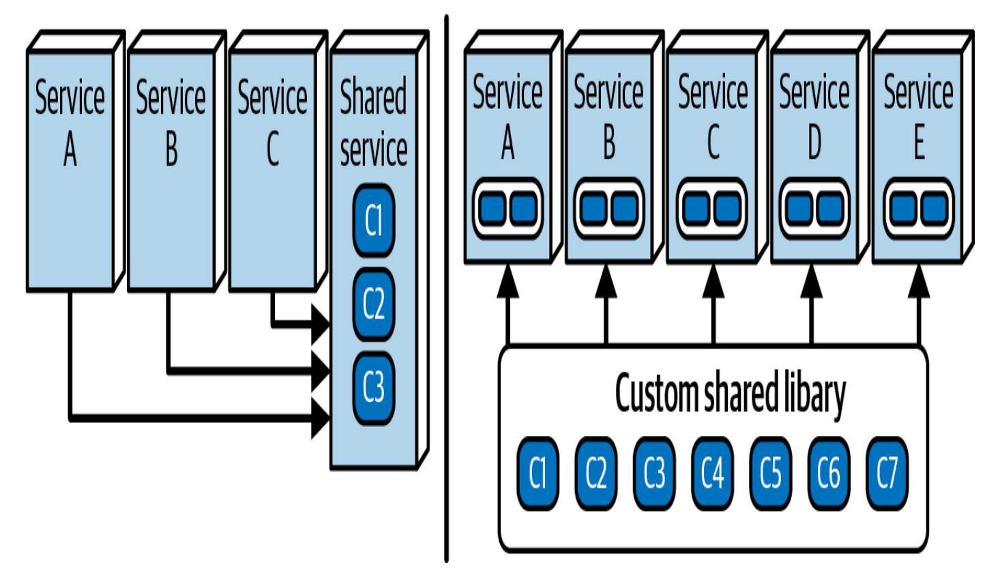
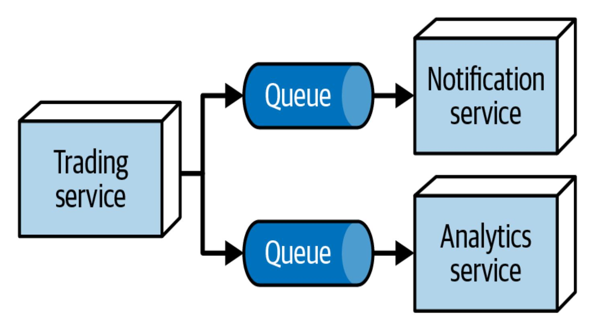
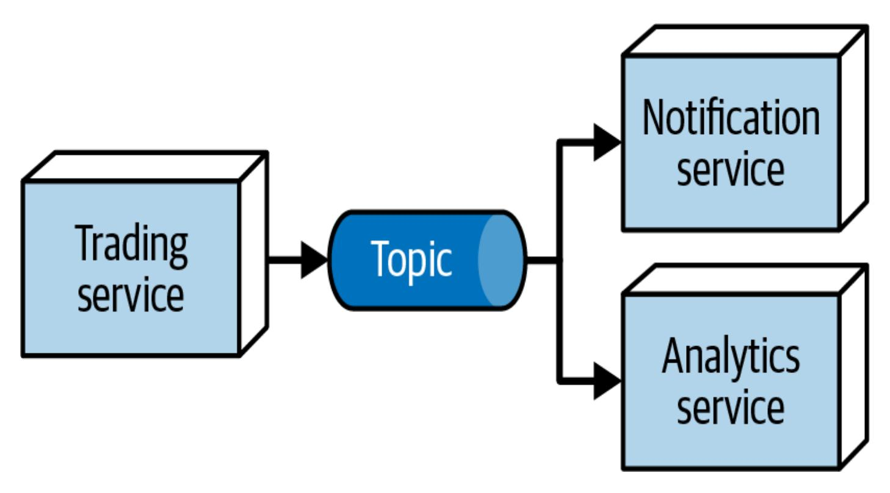

# Kapitel 27. Die Gesetze der Software-Architektur, revisited

Diese Arbeit wurde mithilfe von KI übersetzt. Wir freuen uns über dein Feedback und deine Kommentare: [translation-feedback@oreilly.com](mailto:translation-feedback@oreilly.com)

Bereits in [Kapitel](#page--1-0) 1 haben wir die drei Gesetze der Softwarearchitektur beschrieben:

- Alles in der Softwarearchitektur ist ein Kompromiss.
- Das*Warum* ist wichtiger als das *Wie*.
- Die meisten Architekturentscheidungen sind nicht binär, sondern bewegen sich in einem Spektrum zwischen den Extremen.

Fast jedes Beispiel in diesem Buch hat diese Gesetze illustriert, was auf ihre Entstehungsgeschichte hinweist. Als wir die erste Ausgabe schrieben, hofften wir, zahlreiche Dinge zu finden, die in Bezug auf Software-Architekturen allgemein gültig zu sein schienen, und sie als *Gesetze* festzuhalten. Zu unserer Überraschung fanden wir in der ersten Ausgabe nur zwei Gesetze und entdeckten beim Schreiben der zweiten Ausgabe ein weiteres. Getreu unserer ursprünglichen Absicht scheinen diese drei Gesetze ziemlich allgemeingültig zu sein und geben viele wichtige Perspektiven für Softwarearchitekten vor.

In diesem kurzen Kapitel werden wir diese Gesetze im Lichte der gezeigten Beispiele noch einmal betrachten und auf einige Feinheiten der Analyse von Kompromissen hinweisen.

# Erstes Gesetz: Alles in der Softwarearchitekturist ein Kompromiss

Unser erstes Gesetz ist eines der wichtigsten Merkmale der Softwarearchitektur - alles ist ein Kompromiss. Viele Leute denken, dass die Aufgabe eines Softwarearchitekten darin besteht, Patentlösungen für schwierige Probleme zu finden und ein Held zu sein, aber das ist selten der Fall. (Architekten werden selten für gute Entscheidungen gelobt, aber immer für schlechte getadelt.) Nein, die eigentliche Aufgabe der Softwarearchitektur ist die Analyse von Kompromissen.

Wir sind aus mehreren Gründen der Meinung, dass jeder Architekt seinen Ruf als objektiver Vermittler von Kompromissen festigen sollte, anstatt für einen bestimmten Ansatz zu werben.

Erstens ist Evangelismus in der Architektur auf lange Sicht gefährlich, weil die bewährte Methode von gestern dazu neigt, zum Antipattern von morgen zu werden. Architekten treffen Kompromiss-Entscheidungen auf der Grundlage aktueller Faktoren und Situationen, so gut sie können und mit unvollständigem Wissen. Doch selbst wenn eine Entscheidung zum Zeitpunkt der Entscheidung gut ist, befindet sich das Ökosystem der Softwareentwicklung in ständiger Entwicklung und Veränderung, was bedeutet, dass sich die Umstände allmählich ändern und die

Entscheidung mit der Zeit schwächer (oder ungültig) wird. Wenn der Architekt soziales Kapital investiert hat, um für diese Lösung zu werben, kann sein Ruf darunter leiden, wenn die Entscheidung später geändert werden muss. Bleib bei Technologieentscheidungen immer klar und objektiv, um zu vermeiden, dass du deine Glaubwürdigkeit an eine Entscheidung knüpfst, die sich nicht bewährt hat.

Zweitens suchen Entscheidungsträger in Unternehmen weniger nach enthusiastischen Befürwortern als vielmehr nach nüchterner Objektivität. Ein Architekt oder eine Architektin, der/die sich einen Ruf als Ansprechpartner/in für eine objektive Analyse von Kompromissen erarbeitet, ist ein wertvoller Gewinn für das Unternehmen. Wenn es um kritische Entscheidungen geht, wollen die Entscheidungsträger jemanden, dessen Urteil sie vertrauen können; das solltest du sein.

Schauen wir uns einige Beispiele für die Analyse von Kompromissen bei einigen Software-Architekturentscheidungen an und diskutieren dann eine häufige Lücke im Verständnis.

### **Gemeinsame Bibliothek versus gemeinsamer Dienst**

Ein häufiges Rätsel für Architekten ist das gemeinsame Verhalten in verteilten Architekturen wie Microservices oder EDA: Sollen wir eine gemeinsame Bibliothek verwenden, die zur Erstellungszeit in jeden Dienst kompiliert wird, oder einen gemeinsamen Dienst, den andere Dienste zur Laufzeit aufrufen, wie in [Abbildung](#page-3-0) 27-1 dargestellt?

Abbildung 27-1. Soll die Lösung eine gemeinsame Bibliothek oder einen gemeinsamen Dienst für gemeinsame Funktionen verwenden?

In [Abbildung](#page-3-0) 27-1 kapselt der Dienst auf der linken Seite das gemeinsame Verhalten, und andere Dienste rufen es auf, um darauf zuzugreifen. Auf der rechten Seite haben wir eine gemeinsame Bibliothek, die vor der Bereitstellung in jeden Dienst kompiliert wird. Was ist besser?

Inzwischen kennen die Leserinnen und Leser die Antwort auf all diese Fragen: "Es kommt darauf an!" Aber du musst auch die unvermeidliche Folgefrage beantworten: "Es kommt darauf an, worauf?" Wie bei vielen nicht-trivialen Entscheidungen in der Software-Architektur ist die Antwort auf diese Frage nicht sofort ersichtlich, daher ist es an der Zeit, dass du als Architekt/in eine Analyse der Kompromisse vornimmst.

Zunächst musst du alle kontextabhängigen Kompromisse bestimmen, die für diese Lösung wichtig sind. Diese Liste ist sehr spezifisch für das Unternehmen und die Lösung, daher musst du dich auf dein Wissen über das Unternehmen, die technologische Landschaft, die Fähigkeiten des Teams, das Budget und alle anderen Faktoren stützen, die deine Optionen für den Kompromiss beeinflussen. Für diese Lösung haben wir die folgende Liste mit relevanten Faktoren erstellt:

### *Heterogener Code*

Wenn Lösungen für mehrere Plattformen geschrieben werden, ist es einfacher, mit dem Dienst zu arbeiten, denn unabhängig vom Technologiestack greifen die Aufrufer über das Netzwerk auf den Dienst zu, sodass die Implementierungsplattform keine Rolle spielt. Für die Bibliothek benötigt das Team eine Version des Codes für jeden Technologie-Stack und muss die Versionen synchron halten, was die Gesamtkomplexität des Projekts erheblich erhöht.

### *Hohe Volatilität des Codes*

Erinnere dich daran, dass die Codevolatilität misst, wie schnell sich der Code ändert (auch bekannt als *Churn*). Wenn du also die Bibliothek ändern musst, musst du jeden Dienst neu kompilieren und bereitstellen, um die neuen Funktionen nutzen zu können.

### *Fähigkeit, Änderungen zu versionieren*

Die Versionskontrolle ist in der Bibliothek viel einfacher als im Dienst. Wenn die Bibliothek aktualisiert werden muss, kann das Team die Versionsunterschiede zur Kompilierzeit auflösen und genau das bauen, was es braucht. Für den Dienst müssen die

Versionsinformationen zur Laufzeit ermittelt werden, was die Interaktion mit dem Dienst erschwert.

### *Gesamtrisiko der Veränderung*

Das Änderungsrisiko ist besser für die Bibliothek. Wenn du den Code der Bibliothek änderst und ihn erfolgreich in den Dienst kompilierst, kannst du dich darauf verlassen, dass er funktioniert. Der Dienst hingegen kann sich ohne Kompilierungsprüfung ändern, was die Wahrscheinlichkeit eines Laufzeitfehlers zum Zeitpunkt des Aufrufs erhöht.

#### *Leistung*

Die Bibliothek ist eindeutig leistungsfähiger, da die Aufrufe der gemeinsam genutzten Funktionen prozessinterne Aufrufe sind, im Gegensatz zu den für den Dienst erforderlichen Netzwerkaufrufen. Diese Aufrufe sind wegen der Netzwerklatenz und anderer Faktoren viel langsamer als prozessinterne Aufrufe.

#### *Fehlertoleranz*

Wie wir in [Kapitel](#page--1-0) 9 besprochen haben, kann es beim Laufzeitzugriff auf Dienste immer zu Netzwerkproblemen kommen, so auch bei dem Dienst, um den es hier geht. Die Bibliothek bietet eine bessere Fehlertoleranz: Sobald du den Dienst kompiliert, getestet und eingesetzt hast, kannst du dich darauf verlassen, dass er stabil ist.

#### *Skalierbarkeit*

Genau wie die Leistung leiden auch die Aufrufe zwischen den Diensten unter Latenz, was die Skalierbarkeit beeinträchtigt. Daher bietet die Bibliothek eine bessere Skalierbarkeit, da der Zugriff auf das gemeinsame Verhalten ein sehr effizienter prozessinterner Aufruf ist.

Sobald du deine Liste der wichtigen Faktoren festgelegt hast, kannst du eine Matrix erstellen, um zu vergleichen, wie gut jeder Faktor für jedes Kriterium geeignet ist (siehe [Tabelle](#page-6-0) 27-1).

Tabelle 27-1. Kompromisse zwischen Shared Service und Shared Library

| Faktor                                      | Gemeinsame Bibliothek | Geteilter Dienst |
|---------------------------------------------|--------------------------|---------------------|
| Heterogener Code                         | -                        | +                   |
| Hohe Volatilität des Codes         | -                        | +                   |
| Fähigkeit, Änderungen zu versionieren | +                        | -                   |
| Gesamtrisiko der Veränderung          | +                        | -                   |
| Leistung                                    | +                        | -                   |
| Fehlertoleranz                              | +                        | -                   |
| Skalierbarkeit                              | +                        | -                   |

Die Summe der positiven Aspekte macht die gemeinsam genutzte Bibliothek zum Sieger... zumindest für diese Faktoren und in diesem Kontext. Das kann die Lösung für das Problem sein oder auch nicht vielleicht musst du eine zusätzliche Gewichtung vornehmen (siehe "Zweite [Folgerung:](#page-15-0) Man kann es nicht nur einmal machen" ) - aber jetzt haben du und dein Team eine gute Vorstellung davon, welche Kräfte im Spiel sind.

### **Synchrone versus asynchrone Nachrichtenübermittlung**

Betrachte die folgende Analyse des Kompromisses: Dein Team baut eine verteilte Architektur auf, um Handelsinformationen sowohl an den Notification als auch an den Analytics Dienst zu senden, und du versuchst zu entscheiden, ob du eine *Warteschlange* oder ein *Topic* verwenden sollst, um dieses Verhalten zu implementieren.

Die erste Möglichkeit ist eine Warteschlange oder ein Punkt-zu-Punkt-Kommunikationsprotokoll. Wie du in [Kapitel](#page--1-0) 2 gelernt hast, weiß der Herausgeber, wer die Nachricht empfängt. Um mehrere Verbraucher zu erreichen, muss der Herausgeber eine Nachricht an eine Warteschlange für jeden Verbraucher senden. Wenn der Dienst Trading Warteschlangen verwenden möchte, um den Dienst Analytics und den Dienst Reporting über den Handel zu informieren, sieht die Implementierung wie in [Abbildung](#page-8-0) 27-2 aus.

Abbildung 27-2. Verwendung einer Warteschlange zur Weitergabe von Handelsinformationen an Notification und Analytics

In [Abbildung](#page-8-0) 27-2 gibt der Dienst Trading über eine Warteschlange eine Nachricht an jeden Verbraucher aus. Jeder Verbraucher hat seine eigene Warteschlange, und der Absender sendet eine Nachricht an jeden.

Abbildung 27-3. Verwendung eines Themas zur Weitergabe von Handelsinformationen an Notification und Analytics

Die alternative Topologie verwendet stattdessen ein *Topic*, das eine Broadcast- statt einer Punkt-zu-Punkt-Kommunikation implementiert. In [Abbildung](#page-9-0) 27-3 stellt der Dienst Trading eine einzelne Nachricht in ein Topic ein. Jeder Verbraucher abonniert das Topic und erhält eine Benachrichtigung, wenn eine Nachricht erscheint. In diesem Fall weiß der Herausgeber der Nachricht nicht, wer die Verbraucher sind (oder kümmert sich nicht darum) - das Team kann jederzeit neue Verbraucher hinzufügen, ohne dass sich die anderen Verbraucher oder der Hersteller ändern.

Beide Optionen sind machbar. Wie solltest du dich also entscheiden? Indem du eine Analyse der Kompromisse durchführst.

Mit Warteschlangen benötigt jeder Dienst, den der Trading Dienst benachrichtigen muss, eine eigene Warteschlange. Das ist praktisch, wenn der Dienst Notification und der Dienst Analytics unterschiedliche Informationen benötigen, da du an jede Warteschlange unterschiedliche Nachrichten senden kannst. Der Dienst Trading weiß über jedes System Bescheid, mit dem er kommuniziert, wodurch es für einen anderen (möglicherweise abtrünnigen) Dienst schwieriger wird, "mitzuhören". Das ist vor allem dann von Vorteil, wenn Sicherheit ganz oben auf der Prioritätenliste steht. Da jede Warteschlange unabhängig ist, kannst du sie separat überwachen und bei Bedarf sogar unabhängig skalieren. Der Dienst Trading ist eng an seine Kunden gekoppelt - er weiß genau, wie viele es sind. Wenn du jedoch Nachrichten an den Dienst Compliance senden möchtest, musst du den Dienst Trading überarbeiten, um Nachrichten an eine dritte Warteschlange zu senden.

[Tabelle](#page-11-0) 27-2 fasst die Kompromisse zusammen, die sich aus der Verwendung von Warteschlangen für dieses Projekt ergeben.

Tabelle 27-2. Kompromisse bei der Verwendung einer Warteschlange

| Vorteil                                                                                        | Nachteil                                                                        |
|------------------------------------------------------------------------------------------------|---------------------------------------------------------------------------------|
| Unterstützt heterogene Nachrichten für verschiedene Verbraucher                 | Höherer Grad der Kopplung                                              |
| Ermöglicht die unabhängige Überwachung der Warteschlangentiefe                  | Handelsdienst muss sich mit mehreren Warteschlangen verbinden |
| Mehr Sicherheit                                                                             | Erfordert zusätzliche Infrastruktur                                       |
| Weniger erweiterbar (muss Warteschlangen für mehr Verbraucher hinzufügen) | Gute Unterstützung für Erweiterbarkeit und Evolvierbarkeit       |

Machen wir die gleiche Übung für Topics. Ein Vorteil liegt auf der Hand: Topics sind extrem erweiterbar. Jeder neue Verbraucher, der z. B. an der Einhaltung von Vorschriften interessiert ist, kann dieses Thema abonnieren, ohne das bestehende Verhalten zu verändern. Dieser Vorteil hat jedoch auch Nachteile: Jeder Verbraucher muss die gleiche Nachricht aus dem Topic konsumieren, was zu einer *Stempelkopplung* führen kann (siehe [Abbildung](#page--1-1) 9-9). Und da jeder Verbraucher die gesamte Nachricht

lesen kann, gibt es Sicherheitsbedenken: *Sollte* jeder die gesamte Nachricht lesen können?

Mit dieser Perspektive im Hinterkopf kannst du deine Kompromiss-Tabelle erstellen, die du in [Tabelle](#page-12-0) 27-3 siehst.

Tabelle 27-3. Kompromisse bei der Verwendung eines Themas

| Vorteil                                              | Nachteil                                                                              |
|------------------------------------------------------|---------------------------------------------------------------------------------------|
| Niedrige Kopplung                                 | Einheitliche Botschaft für jeden Verbraucher                              |
| Handelsdienst erzeugt nur eine Nachricht | Einzelne Verbraucher können nicht überwacht oder skaliert werden |
| Mehr Erweiterbarkeit/Entwickelbarkeit             | Weniger sicher                                                                     |
|                                                      | Weniger Optionen für die Skalierbarkeit                                   |

Nachdem du die Analyse der Kompromisse durchgeführt hast, musst du dir die organisatorischen Ziele für diese Lösung vergegenwärtigen und herausfinden, welche Option besser geeignet ist. Wenn die Sicherheit wichtiger ist, solltest du wahrscheinlich Warteschlangen wählen. Wenn

die Organisation schnell wächst und auch andere Dienste am Handel interessiert sind, könnte die Erweiterbarkeit eine Priorität sein, was dich zur Verwendung von Topics veranlassen würde.

### **Erste Folgerung: Fehlende Kompromisse**

Unser erstes Gesetz hat zwei Folgerungen. Die erste lautet:

*Wenn du denkst, dass du etwas entdeckt hast, das kein Kompromiss ist, hast du wahrscheinlich nur den Kompromiss nicht erkannt... noch nicht.*

### —Korollar 1

Der Kern einer Softwarearchitektur-Entscheidung ist die Analyse von Kompromissen, aber was passiert, wenn du auf eine Entscheidung stößt, bei der es scheinbar keine Kompromisse gibt? Unser Rat: Suche weiter!

Betrachte die Wiederverwendung von Code. Das ist doch sicher eine rein vorteilhafte Praxis, oder? Je mehr Code die Organisation wiederverwenden kann, desto weniger Code muss sie schreiben, was Zeit und Doppelarbeit spart.

Zwei Faktoren bestimmen, wie effektiv die Wiederverwendung von Code sein wird. Architekten entdecken oft den ersten, übersehen aber den zweiten. Der erste Faktor ist die *Abstraktion*: Wenn du diesen Code abstrahieren und von mehreren Aufrufpunkten aus verwenden kannst, ist er ein guter Kandidat für die Wiederverwendung. Der zweite Faktor

ist die *geringe Volatilität*. Wenn ein Team ein Codemodul wiederverwendet, das sich ständig ändert, führt das zu Unruhe im gesamten System. Jedes Mal, wenn sich der gemeinsam genutzte Code ändert, müssen sich alle, die diesen Code aufrufen, auf diese Änderung einstellen. Selbst wenn es sich nicht um eine bahnbrechende Änderung handelt, muss das Team überprüfen, dass die Änderung nichts kaputt gemacht hat. Wenn Architekturen Code in unangemessener Weise wiederverwenden, sind die Teams am Ende auf der Suche nach Änderungen, die die gesamte Architektur verändern. Das war eine der wichtigsten Lehren, die Architekten aus dem orchestrierungsorientierten SOA-Architekturstil (siehe [Kapitel](#page--1-0) 17) gezogen haben, der unter anderem darauf abzielt, so viel Code wie möglich wiederzuverwenden. In der Praxis schwammen die Teams, die mit diesen Architekturen arbeiteten, im Treibsand: Jede Änderung hatte das Potenzial, unvorhersehbare Nebeneffekte im System auszulösen.

Das ist der versteckte Kompromiss: Die effektive Wiederverwendung von Code erfordert eine gute Abstraktion *und eine* geringe Volatilität. Aus diesem Grund sind die erfolgreichsten Ziele für die Wiederverwendung in der Architektur das "Klempnerhandwerk": Technologie-Frameworks, Bibliotheken, Plattformen und so weiter. Der Teil der meisten Anwendungen, der sich am schnellsten ändert, ist die Domäne (die Motivation, die Software überhaupt zu schreiben), daher sind Domänenkonzepte schlechte Kandidaten für die Wiederverwendung. (Beachten Sie, dass dies dem DDD-Prinzip des begrenzten Kontexts zugrunde liegt - kein begrenzter Kontext kann die

Implementierungsdetails eines anderen begrenzten Kontexts wiederverwenden).

#### **WARUM WIR KEINE SCHÖNEN DINGE HABEN KÖNNEN - KOMPROMISSE!**

Als professionelle Berater stellen unsere Kunden oft Anfragen wie die folgende: "Wir mögen die Idee von Microservices und verteilten Architekturen, die einen hohen Grad an Entkopplung aufweisen, weil sie ein hohes Maß an Agilität und eine schnelle Bereitstellung ermöglichen. Wir wollen aber auch ein hohes Maß an institutioneller Wiederverwendung, damit die Teams nicht ständig neuen Code schreiben müssen."

Wir müssen hier die schlechte Nachricht überbringen: Du kannst nicht beides haben, denn die Wiederverwendung eines Systems wird durch Kopplung erreicht. Keine Organisation kann beides haben: Entkopplung *und* ein hohes Maß an Wiederverwendung. Die beiden Dinge sind grundsätzlich unvereinbar. Dies ist ein Paradebeispiel dafür, wie Organisationen wichtige Kompromisse missverstehen können.

### **Zweite Folgerung: Du kannst es nicht nur einmal tun**

Es wäre schön, wenn ein Architekt nur eine einzige Kompromiss-Analyse durchführen könnte - einfach *gründlich* nachdenken und ein für alle Mal entscheiden, Choreografie für alle Arbeitsabläufe zu verwenden. Aber es gibt zwei Probleme bei der Analyse von Kompromissen. Erstens gibt es

oft Dutzende oder sogar Hunderte von (technischen und anderen) Variablen, die zur Entscheidung beitragen: Komplexität, Teamerfahrung, Budget, Teamtopologie, Termindruck ... die Liste ist endlos. Geringfügige Unterschiede in diesen Variablen können eine bestimmte Analyse in die eine oder andere Richtung lenken, so dass dies eine ständige Übung ist. Für Architekten ist es gefährlich, pauschale, halbwegs dauerhafte Entscheidungen zu treffen, die auf Annahmen beruhen, die für zukünftige Anwendungen dieser Lösung möglicherweise nicht mehr gültig sind.

Betrachte diese Konsequenz als Arbeitsplatzsicherheit für Architekten. Wir müssen immer wieder Kompromisse analysieren, selbst in scheinbar ähnlichen Situationen. Das unterstreicht den Gedanken, dass die eigentliche Aufgabe in der Analyse von Kompromissen besteht und nicht darin, permanent perfekte Entscheidungen zu treffen.

# Zweites Gesetz: Das Warum ist wichtiger als das Wie

Unser zweites Gesetz betont, dass das *Warum* wichtiger ist als das *Wie*. Als erfahrene Architekten können wir uns ein bestehendes System ansehen und jemandem sagen, *wie* es funktioniert. Es wird jedoch Entscheidungen geben, bei denen nicht klar ist *, warum* der frühere Architekt diese Option einer anderen vorgezogen hat, weil er nicht alle Entscheidungskriterien mit seiner endgültigen Lösung aufgezeichnet hat.

Deshalb betonen wir, wie wichtig es ist, sowohl Architekturdiagramme *als auch* ADRs zu verwenden (siehe [Kapitel](#page--1-0) 21). Jede Analyse von Kompromissen liefert eine enorme Menge an Informationen, die in der Lösung nicht enthalten sind. Es ist wichtig, diese Analyse zu dokumentieren (zusammen mit den bekannten Kompromissen und Einschränkungen der Lösung), um zu verhindern, dass zukünftige Architekten (das könntest du sein) die Analyse noch einmal durchführen müssen, nur um zu verstehen *, warum*.

### **Aus dem Kontext gerissenes Antipattern**

Ein häufiges Muster bei der Analyse von Kompromissen ist das *"Out of Context* "-Muster. Dieses Muster tritt auf, wenn der Architekt zwar die Kompromisse kennt, aber nicht weiß, wie er sie im aktuellen Kontext *gewichten* soll.

Betrachte die Analyse des [Kompromisses, die](#page-2-0) wir in "Shared Library Versus Shared Service" durchgeführt haben [.](#page-2-0) Objektiv betrachtet scheint die gemeinsame Bibliothek die bevorzugte Lösung zu sein, da sie mehr positive als negative Bewertungen erhält. Diese Analyse des Kompromisses hat jedoch einen möglichen Fehler: Haben alle Kriterien das gleiche Gewicht?

Stell dir vor, ein Team hat Code auf mehreren Plattformen. Es ist nicht übermäßig auf Leistung oder Skalierbarkeit bedacht, möchte aber eine saubere Methode zur Verwaltung des gemeinsamen Verhaltens. In diesem Fall haben die ersten beiden Kriterien für den Kompromiss eine viel höhere Priorität, so dass sie sich für den gemeinsamen Dienst

entscheiden sollten. Außerdem hat das Team bereits herausgefunden, welche Probleme es zu entschärfen gilt.

Architekten stützen sich bei der Erstellung von Kompromisskriterien auf ihre Erfahrung, müssen diese Kriterien aber auch abwägen, um die richtige Lösung zu finden. Eine allgemeine Analyse von Kompromissen ist nicht sehr nützlich - sie wird erst dann wertvoll, wenn sie in einem bestimmten Kontext angewendet wird.

## Das Spektrum zwischen den Extremen

In unserer ersten Ausgabe haben wir nur zwei Gesetze identifiziert. Nach und nach haben wir jedoch erkannt, dass es noch ein drittes Gesetz gibt:

*Die meisten Architekturentscheidungen sind nicht binär, sondern bewegen sich in einem Spektrum zwischen den Extremen.*

—Drittes Gesetz der Softwarearchitektur

Es wäre schön, in einer Welt mit schönen, klaren, binären Entscheidungen zu leben - aber in dieser Welt gibt es keine Softwarearchitektur. Es wird oft beobachtet, wie schwierig es ist, umfassende Definitionen für wichtige Konzepte in der Softwarearchitektur zu finden: Architektur versus Design, Orchestrierung versus Choreografie, Themen versus Warteschlangen und so weiter. Der Grund dafür ist, dass die Entscheidungskriterien nicht binär sind, sondern sich in einem ziemlich unübersichtlichen Spektrum bewegen.

In ["Architektur](#page--1-0) versus Design" haben wir über das Spektrum zwischen Architektur und Design gesprochen und darüber, wie man feststellen kann, wo eine bestimmte Entscheidung innerhalb dieses Spektrums liegt. Tatsächlich bietet dieses Gesetz eine nützliche Möglichkeit, über Entscheidungen nachzudenken, die näher an der Softwarearchitektur als an der Designseite liegen:

*Bei der Entscheidung für eine Softwarearchitektur gibt es für jede der Optionen erhebliche Kompromisse.*

Wenn alles in der Softwarearchitektur ein Kompromiss ist, dann muss eine architektonische Entscheidung für jede Option einen Kompromiss beinhalten.

Als Architekt solltest du nicht versuchen, jede Entscheidung auf eine binäre Lösung zu reduzieren - davon gibt es in unserer Welt nur wenige. Das ist einer der Gründe, warum jede Antwort in der Softwarearchitektur "es kommt darauf an" lautet - es kommt darauf an, wo im Spektrum der möglichen Lösungen das betreffende Kriterium liegt.

Als Architekten treffen wir unsere Entscheidungen in einem Sumpf der Unsicherheit. Diesem Umstand Rechnung zu tragen, ist lästig, aber notwendig. Nicht nur, dass wir manchmal wichtige Entscheidungen auf der Grundlage unvollständiger Informationen treffen müssen, oft wäre

die Entscheidung auch dann nicht eindeutig, wenn wir alles wüssten, weil sie sich irgendwo auf einem Spektrum zwischen zwei Extremen bewegt.

Willkommen bei der Software-Architektur!

## Ratschläge zum Abschied

*Wie kommen wir zu guten Designern? Gute Designer entwerfen natürlich.*

—Fred Brooks

*Wie sollen wir also großartige Architekten bekommen, wenn sie nur weniger als ein halbes Dutzend Mal in ihrer Karriere die Chance bekommen, Architekten zu werden?*

#### —Ted Neward

Übung ist der bewährte Weg, um Fähigkeiten zu entwickeln und in allen Bereichen des Lebens besser zu werden, auch in der Architektur. Wir ermutigen neue und bestehende Architekten und Architektinnen, ihre Fähigkeiten im Handwerk des Architekturdesigns zu verfeinern und ihr individuelles technisches Spektrum zu erweitern. Zu diesem Zweck haben wir einige [Architektur-Katas](https://oreil.ly/EPop7) entwickelt, die den Beispielen in diesem Buch nachempfunden sind und die du auf der dazugehörigen Website findest. Wir möchten dich ermutigen, sie zu nutzen, um deine Fähigkeiten in der Architektur zu üben und auszubauen.

Menschen, die unsere Katas benutzen, fragen oft: Gibt es irgendwo einen Leitfaden für Antworten? Leider nein. Um Neal zu zitieren:

*Bei Kompromissen, die nur die Architektur betreffen, gibt es keine richtigen oder falschen Antworten.*

Als eure Autoren anfingen, Architektur-Katas in unseren Live-Schulungen zu verwenden, haben wir zunächst die Zeichnungen der Schüler/innen aufbewahrt, um eine Sammlung von Antworten zu erstellen. Wir gaben jedoch schnell auf, weil wir merkten, dass diese Artefakte unvollständig waren. Die Teams hatten mit Zeichnungen von Topologien festgehalten *, wie* sie ihre Lösungen umsetzen. Das *Warum* war viel interessanter - aber obwohl sie die Kompromisse, die sie im Unterricht erwogen hatten, erläuterten, hatten sie keine Zeit, Architektur-Entscheidungsunterlagen zu erstellen. Wenn wir nur das *Wie* festhielten, hatten wir nur die Hälfte der Geschichte.

Unser abschließender Ratschlag: Lerne immer, übe immer, und *geh in die Architektur*!